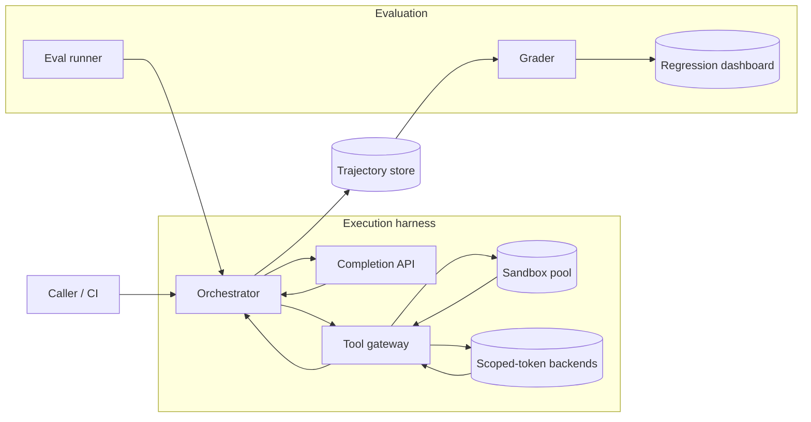

# Agent Harness and Evaluation Framework

[English](README.md) · [中文](README.zh.md)

<!-- meta:begin -->
| Type | Priority | Difficulty | Roles | Topics | Round |
| --- | --- | --- | --- | --- | --- |
| System design | ★☆☆☆☆ | — | RE · MLE · RS | agent, evaluation, tooling, observability | Onsite |
<!-- meta:end -->

## Problem

Design the execution harness for a multi-step, tool-calling agent, together with the offline evaluation
framework built on top of it. An *agent run* pursues a stated goal by alternating between calling a language
model and calling external tools (a code-execution sandbox, an internal search API, a ticketing system, a file
store, ...) across many steps, until it finishes or is stopped. The harness is shared by several product teams
inside the company, each building a different agent (customer support, an internal coding assistant, an
ops-automation agent) on the same execution and tool-calling machinery.

Out of scope: training or fine-tuning the underlying language model, and the design of the model's own
inference-serving stack — assume a hosted completion API with a given latency distribution is available, and
focus on everything around it: how a run is orchestrated, how tools are called safely, how the full trajectory
of a run is recorded, and how a fixed suite of tasks is scored to catch regressions before they reach
production.

Scale for this design:

- 20 runs/second on average across every agent sharing the harness (about 1.7 million runs/day), with a
  3x peak-to-average ratio at busy hours.
- A run takes 12 steps on average; a step is one model call, optionally followed by one tool call (about
  70% of steps call a tool).
- The hosted completion API averages 900 ms per call. Tool calls average 500 ms blended across a mix
  where about one in five goes through an isolated code-execution sandbox (averaging 1.9 s including
  sandbox setup and teardown) and the rest are fast, scoped internal-API or search calls (averaging
  150 ms).
- A fixed evaluation suite of 2,000 tasks runs nightly against the current harness and model version;
  every pull request that touches the harness, a tool definition, or a system prompt runs a 200-task
  smoke subset before it can merge.

In scope: the run orchestrator and its core abstractions (task, context, tool, trajectory, state, termination
condition); the tool-calling interface, including permission scoping, timeouts, retries, and how a tool's
errors reach the model; the recording and replay of complete execution traces, including what is sampled for
long-term storage; and the offline evaluation framework — datasets and grading, the metrics reported per run,
how the evaluation set is kept from leaking into anything the model or its prompts can see, and how evaluation
results gate a release through CI and a nightly regression dashboard. Out of scope beyond model training and
serving: the tool backends themselves (the code sandbox, the search index, the ticketing system) are given,
fixed services, and so is the UI a human uses to read a trace or grade a run.

Produce:

1. Requirements and a scale estimate: concurrent runs in flight, tool-call rate, sandbox pool size, and
   trajectory storage volume.
2. A data model (task, run, step, tool definition, evaluation result) and 4-5 core APIs.
3. An architecture diagram covering both the production run path and the evaluation path, and a
   walk-through of one run along that path.
4. Deep dives into: tool-call isolation, timeouts, retries and error propagation; trajectory recording and
   replay, including sampling and its storage cost; and the evaluation framework — datasets and grading,
   multi-dimensional metrics, preventing evaluation-set leakage and overfitting, and wiring regression
   tests into CI. For each, compare at least two alternatives, say which you would pick, and state the
   cost of that choice.

## Reference solution

<details>
<summary>Show the reference solution</summary>

Two points worth confirming before designing: whether every tool backend can accept an idempotency key
(otherwise the harness cannot safely retry a mutating call on its behalf), and whether the evaluation
environment must be fully offline and replayable or may include a few tasks that call live external services.
The design below assumes most tools support an idempotency key, and that the evaluation suite runs against
recorded or mocked tool responses.

### Requirements and scale

**Concurrency.** At $\lambda_{\text{avg}} = 20$ runs/sec and a step latency of 900 ms for the completion call
plus tool time on the 70% of steps that call one, the blended tool latency is

$$0.2 \times 1.9\text{s} + 0.8 \times 0.15\text{s} = 0.5\text{s},$$

so a step averages $0.9 + 0.7 \times 0.5 = 1.25$ s and a 12-step run averages $12 \times 1.25 = 15$ s
wall-clock. By Little's law, $L = \lambda W$ gives $20 \times 15 = 300$ runs in flight on average and $60
\times 15 = 900$ at the 3x peak — the number the orchestrator's worker pool must hold concurrently, not the
arrival rate itself.

**Tool-call and sandbox rate.** $20 \times 12 = 240$ steps/sec on average (720 at peak); at 70% of steps
calling a tool, that is 168 tool calls/sec on average and 504 at peak. One in five of those goes through the
isolated sandbox, so $504 \times 0.2 \approx 101$ sandboxed calls/sec at peak; each occupies a sandbox for 1.9
s on average, so Little's law again gives $101 \times 1.9 \approx 192$ sandboxes needed concurrently at peak.
A warm pool sized at about 250 (30% headroom) avoids paying a cold microVM start (roughly 150 ms) on the hot
path for most calls.

**Trajectory storage.** Each step's recorded turn is roughly 3 KB: 1.2 KB of model output, 1.4 KB of
tool input/output averaged over the 70% of steps that have any ($2\text{KB} \times 0.7$), and 0.4 KB of
metadata (timestamps, token counts, tool id). A 12-step run is $12 \times 3\text{KB} = 36$ KB, and at
1.73 million runs/day the harness writes about 62.2 GB/day. A 14-day hot retention window for live
debugging is then about 871 GB.

**Eval scheduling.** Grading a stochastic agent on one run is noisy, so both suites run each task 3 times: the
nightly suite is $2{,}000 \times 3 = 6{,}000$ runs, and the smoke suite is $200 \times 3 = 600$ runs. An eval
run is not much cheaper than a production one — the model still costs 900 ms per step and sandboxed tasks
still execute for real; only the fast scoped calls are replayed from the snapshot, which trims a run to $12
\times (0.9 + 0.7 \times 0.2 \times 1.9) = 14.0$ s. Sizing at the production 15 s/run, fitting the nightly
suite inside a 45-minute budget needs at least $\lceil 6{,}000 \times 15 / 2{,}700 \rceil = 34$ concurrent
workers (provisioned at 40), and the smoke suite inside an 8-minute PR-feedback budget needs at least $\lceil
600 \times 15 / 480 \rceil = 19$ (provisioned at 24, on a small reserved lane so a busy production peak of 900
runs never starves a PR check).

### Data model and API

The six core abstractions map directly onto this model: a **task** is a `Task` row; its **context** is not
stored on its own but reconstructed the way the trajectory deep dive describes; a **tool** is a `ToolDef`; the
**trajectory** is the ordered sequence of `Step` rows for a `Run`; a run's **state** is the small amount of
mutable bookkeeping the orchestrator carries while it is in flight — retry counts, the current
consecutive-failure streak per tool signature, tokens and cost spent so far — kept on the `Run` row itself,
separate from the append-only trajectory; and the **termination condition** is the policy checked after every
step: an explicit finish action, `max_steps`, `wall_clock_timeout_s`, a safety halt, or `tool_loop`.

**Task** — `task_id`, `caller` (`production` or an eval suite id), `goal` (the instruction given to the
model), `tool_allowlist`, `env_snapshot_ref` (a pointer to the starting environment — for an eval task,
recorded or mocked tool responses; for a production task, nothing beyond live credentials), `max_steps`,
`wall_clock_timeout_s`, `golden_check_ref` (set only for eval tasks, pointing at the grading function or
rubric).

**Run** — one execution attempt of a task: `run_id`, `task_id`, `model_version`, `harness_version`, `status`
(`running | finished | timed_out | aborted`), `stop_reason` (`finish_action | max_steps | wall_clock |
safety_halt | tool_loop`), `retry_count`, `failure_streak` (the live per-tool-signature consecutive-failure
count), `started_at`, `finished_at`, `total_tokens`, `cost_usd`.

**Step** — the unit of the trajectory: `run_id`, `step_index`, `role` (`assistant | tool`), `content_ref` (a
pointer into blob storage for anything over a size threshold, inline otherwise), `tool_call` (`{tool_id, args,
idempotency_key}` or null), `tool_result` (`{status, error_class, latency_ms, result_ref}` or null),
`token_usage`, `timestamp`.

**ToolDef** — `tool_id`, `version`, `json_schema` (the arguments schema), `side_effect_class` (`read_only |
mutating`), `isolation` (`sandboxed | scoped_token`), `timeout_ms`, `retryable`.

**EvalResult** — `run_id`, `grader` (`programmatic | llm_judge | human`), `dimension_scores` (`{success,
tool_quality, cost, latency, safety, stability}`), `judge_version`, `graded_at`.

Core APIs:

1. `POST /tasks/{task_id}/runs` — start a run, in `production` or `eval` mode. Body:
   `{model_version, harness_version, mode}`. Returns `{run_id, status: "running"}`.
2. `POST /tools/{tool_id}/invoke` — the harness-internal call the orchestrator makes on the model's
   behalf; validates the args against the tool's schema, applies its timeout, isolation and retry policy,
   and returns `{status, result_ref, error_class?, latency_ms}`.
3. `GET /runs/{run_id}/trajectory` — the ordered, paginated list of steps for a run, used by the
   debugging UI and by the replay engine.
4. `POST /eval-suites/{suite_id}/runs` — trigger a suite run (a nightly cron or a CI webhook) at a given
   `model_version`/`harness_version` with `repeats`. Returns `{suite_run_id, status}`.
5. `GET /eval-suites/{suite_id}/runs/{suite_run_id}/report` — per-task and suite-wide dimension scores,
   plus a diff against the suite's historical baseline; CI reads this to decide pass/fail.

### Architecture



A production caller or an eval runner starts a run at the orchestrator, which owns the task's context and
mutable state. The orchestrator sends the current context to the completion API; when the model's turn
requests a tool, the tool gateway validates the call against that tool's schema and dispatches it to either
the sandbox pool (code execution) or a scoped-token backend (internal APIs, search), enforcing the tool's
timeout and retry policy before returning a structured result. The orchestrator appends every model turn and
tool result to the trajectory store as it goes, then loops back to the completion API with the updated
context, until a termination condition fires. An eval runner drives the identical orchestrator path against a
fixed environment snapshot instead of live traffic; once a run ends, the grader reads its trajectory from the
store and writes dimension scores that feed straight into the regression dashboard.

### Deep dives

**Tool-call isolation, timeouts, retries, and error propagation.** Two isolation tiers cover the tool mix:
arbitrary or model-influenced code runs inside an ephemeral sandbox (ejected and destroyed after one call),
while calls into internal APIs and search go out with a short-lived, per-call credential scoped to exactly the
resource and operation the tool declares, with a TTL matched to the tool's timeout. Sandboxing every tool
uniformly would be simpler, but pays the sandbox's cold-start and memory cost on calls already
access-controlled by their own backend; the scoped-token path instead trusts that backend's own authorization,
since the harness cannot see what happens once the call leaves it.

Every tool declares its own timeout (5 s default for a scoped API call, a hard 30 s kill for the sandbox); a
step's own timeout is that value plus a small margin, and the run-level caps above (`max_steps`, wall-clock)
bound the worst case even if every step is slow. Retries are attempted only for error classes that are safe to
repeat — a timeout or a connection error, never a schema-validation failure, since retrying an identical
malformed call cannot fix it and just burns a step; a mutating tool additionally requires an idempotency key,
derived from `(run_id, step_index, tool_id)` so it stays stable across retries of the *same* call without
being reusable across a genuinely new one, and the backend dedupes on it. Up to 2 retries run with an
exponential backoff (250 ms, doubling, ±20% jitter). Letting the model itself retry by just calling the tool
again was considered and rejected: a model-issued duplicate call carries no stable idempotency key, so a
retried mutating action can double-apply its effect; the harness owns every retry of anything with a side
effect and shows the model only the final outcome.

A tool's error is appended to the trajectory as a structured observation — `error_class` plus the real backend
message, never paraphrased — so the model can react appropriately: fix the arguments on a validation error,
try a different tool on a permission error, or move on after the harness reports that a timeout already
exhausted its retries. Three consecutive failures with the same tool signature (same `tool_id` and equivalent
arguments) abort the run with `stop_reason = tool_loop` rather than let a stuck agent spin until the
wall-clock timeout.

**Trajectory recording and replay.** A trajectory is an append-only sequence of steps, each stored once;
anything above a size threshold (a large search result, a file diff) is written to blob storage and the step
keeps only a reference. Reconstructing the exact context sent to the model at any step is done by
concatenating the stored turns with the versioned system prompt and tool definitions used at that time — not
by re-storing the whole, ever-growing context at every step. That distinction matters: storing a full context
snapshot at each of $k = 12$ steps would repeat every earlier turn each time, for $k(k+1)/2 = 78$
turn-equivalents per run instead of 12 — a $6.5\times$ ($=(k+1)/2$) blow-up over the delta-based 36 KB/run
computed above, from the storage choice alone.

Replaying a historical run against a new model version re-feeds each recorded `tool_result` verbatim rather
than re-invoking the tool: this isolates whether the *model's* behavior changed from whether the *environment*
changed, since a search index or a ticketing system returning different results later would otherwise make a
real regression look fixed, or the reverse, for reasons unrelated to the model.

Keeping every run at full fidelity forever is not worth its storage: at 62.2 GB/day, a year of everything is
about 22.7 TB. Instead, the 14-day hot window (871 GB) covers live debugging, and long-term storage keeps only
every failed run plus a 5% sample of successful ones, sampled by hashing `run_id` (not re-randomized daily, so
the same cohort stays sampled over time for drift tracking). With an 8% production failure rate, that keeps
$0.08 + 0.92 \times 0.05 = 12.6\%$ of runs, cutting annual long-term storage to about 2.86 TB, a $7.9\times$
reduction, without losing a single failure to debug. Sampling individual *steps* instead of whole runs was
rejected: a trajectory with some steps kept and others dropped cannot be replayed end to end, so the unit of
sampling has to be the run.

**Evaluation: datasets, grading, and regression testing.** Each eval task fixes its starting environment (a
seeded filesystem, or recorded/mocked tool responses) so the run is reproducible; a live external dependency
changing between two eval runs would otherwise be indistinguishable from a real regression. A small separate
"integration" lane hits live services for the handful of tasks that need to, run less often and never gating a
merge. Grading splits by task type: objective tasks (a file edited correctly, a test suite passing) get a
programmatic check against a golden final state; open-ended tasks get an LLM judge against a fixed rubric with
few-shot calibration examples, itself checked weekly against a 200-task human-graded sample and recalibrated
whenever agreement drops below 90%.

Each run is scored on six dimensions, kept separate rather than blended into one number: task success (the
rubric or golden-state score), tool-call quality (the fraction of calls passing schema validation, and the
fraction redundant given the run's own history), cost (token spend and tool compute cost tracked separately,
since a token-cheap run can still be sandbox-expensive), latency (wall-clock), safety (actions a separate
safety classifier flags as disallowed), and stability (agreement across the 3 repeats of a task — wide
disagreement there is an unreliable-agent problem, not necessarily a wrong-agent one).

The eval store is access-controlled separately from whatever pipeline curates prompts or training data; every
eval task carries a unique canary string, so grepping a prompt bundle or a training shard says at once whether
the suite has leaked into it, and a shingled-MinHash near-duplicate check (flagged above 0.8 Jaccard) catches
an eval item that was reworded rather than copied. The 2,000-task suite splits into a 1,500-task dev subset,
fine to read while iterating on the harness or its prompts, and a 500-task held-out subset scored only weekly
and never inspected otherwise; a growing gap between the two scores is the signal that work has started
overfitting to the visible dev subset. Every PR runs the smoke suite (600 runs, 24 reserved workers, 8-minute
budget) and blocks the merge when its mean success rate falls more than two standard errors below the rolling
baseline. The independent unit there is the task, not the run — a task's 3 repeats are correlated — so at a
75% baseline that error is $\sqrt{0.75 \times 0.25 / 200} \approx 0.031$ — 3.1 points — and the gate catches only regressions
past roughly 6 points; the nightly suite's 2,000 tasks cut the same error to 0.97 points, so a slow two-point
slide is caught overnight, on the dashboard and on-call's pager. Because every trajectory is retained, a
failing task is localized to the earliest step where its own checkpoints (when it defines any) diverge from
golden, or, absent those, to the earliest step the judge flags as where things went wrong, so debugging starts
there.

### Follow-ups

- A run that keeps calling the model without ever finishing or calling a tool is already caught by
  `max_steps` and the wall-clock timeout; it needs no separate detection.
- A sub-agent spawned by another agent reuses the same `Run`/`Step` schema with a `parent_run_id`, so
  nested trajectories fall out of the existing data model.
- A tool backend that only degrades under load needs its retry policy to read a shared, per-`tool_id`
  circuit breaker rather than each run backing off independently, or thousands of concurrent runs retry
  the same failing backend at once and make the outage worse.
- Comparing two harness versions on live traffic is an online A/B split scored on the same six
  dimensions; the offline suite's job is to keep a version that would lose badly from reaching that
  experiment at all.
- Human grading capacity, not model capability, is the real bottleneck on adding a new task category: its
  judge cannot be trusted until a fresh calibration batch has been human-graded for it.

<details>
<summary>Estimate check (runnable)</summary>

```python
import math

# --- run-level throughput and concurrency ---
lam_avg = 20.0          # runs/sec, average, across all agents sharing the harness
peak_factor = 3
lam_peak = lam_avg * peak_factor
assert lam_peak == 60

daily_runs = lam_avg * 86_400
assert daily_runs == 1_728_000

k_steps = 12                      # average steps per run
tool_frac = 0.7                   # fraction of steps that call a tool
llm_latency = 0.9                 # s, average completion-API call
frac_sandbox = 0.2                # fraction of tool calls that go through the isolated sandbox
L_sandbox = 1.9                   # s, average sandbox occupancy (setup + exec + teardown)
L_other = 0.15                    # s, average scoped-token API/search call

tool_latency = frac_sandbox * L_sandbox + (1 - frac_sandbox) * L_other
assert round(tool_latency, 3) == 0.500

step_latency = llm_latency + tool_frac * tool_latency
assert round(step_latency, 3) == 1.250

run_duration = k_steps * step_latency
assert run_duration == 15.0

L_avg = lam_avg * run_duration     # Little's law: concurrency in flight
L_peak = lam_peak * run_duration
assert L_avg == 300
assert L_peak == 900

steps_per_sec_avg = lam_avg * k_steps
steps_per_sec_peak = lam_peak * k_steps
assert steps_per_sec_avg == 240
assert steps_per_sec_peak == 720

tool_calls_per_sec_avg = steps_per_sec_avg * tool_frac
tool_calls_per_sec_peak = steps_per_sec_peak * tool_frac
assert tool_calls_per_sec_avg == 168
assert round(tool_calls_per_sec_peak) == 504

sandbox_calls_per_sec_peak = tool_calls_per_sec_peak * frac_sandbox
assert round(sandbox_calls_per_sec_peak, 1) == 100.8

concurrent_sandboxes_peak = sandbox_calls_per_sec_peak * L_sandbox
assert round(concurrent_sandboxes_peak) == 192

# --- trajectory storage ---
model_output_bytes = 1200
tool_io_bytes = 2000
metadata_bytes = 400
step_bytes = model_output_bytes + tool_frac * tool_io_bytes + metadata_bytes
assert step_bytes == 3000

run_bytes = k_steps * step_bytes
assert run_bytes == 36_000

GB = 1_000_000_000
daily_bytes = daily_runs * run_bytes
daily_gb = daily_bytes / GB
assert round(daily_gb, 1) == 62.2

hot_days = 14
hot_gb = daily_gb * hot_days
assert round(hot_gb) == 871

# naive full-context-per-step snapshot vs delta-based logging
naive_multiplier = (k_steps + 1) / 2
assert naive_multiplier == 6.5
naive_run_bytes = run_bytes * naive_multiplier
assert naive_run_bytes == 234_000

fail_rate = 0.08
sample_rate = 0.05
kept_frac = fail_rate + (1 - fail_rate) * sample_rate
assert round(kept_frac, 3) == 0.126

long_term_daily_gb = kept_frac * daily_gb
assert round(long_term_daily_gb, 2) == 7.84

days_per_year = 365
long_term_annual_tb = long_term_daily_gb * days_per_year / 1000
assert round(long_term_annual_tb, 2) == 2.86

naive_annual_tb = daily_gb * days_per_year / 1000
assert round(naive_annual_tb, 1) == 22.7

reduction = naive_annual_tb / long_term_annual_tb
assert round(reduction, 1) == 7.9

# --- eval suite scheduling ---
n_eval, n_smoke, repeats = 2000, 200, 3
eval_runs = n_eval * repeats
smoke_runs = n_smoke * repeats
assert eval_runs == 6000
assert smoke_runs == 600

nightly_budget_s = 45 * 60
ci_budget_s = 8 * 60

nightly_workers = math.ceil(eval_runs * run_duration / nightly_budget_s)
ci_workers = math.ceil(smoke_runs * run_duration / ci_budget_s)
assert nightly_workers == 34
assert ci_workers == 19

# An eval run replays the scoped calls but still executes the sandboxed ones, so it is only a little
# cheaper than a production run; sizing the pools at 15 s keeps that difference as margin.
eval_run_duration = k_steps * (llm_latency + tool_frac * frac_sandbox * L_sandbox)
assert round(eval_run_duration, 3) == 13.992 and round(eval_run_duration, 1) == 14.0
assert round(run_duration / eval_run_duration, 3) == 1.072

dev_n, held_out_n = 1500, 500
assert dev_n + held_out_n == n_eval

# Regression gate. The independent unit is the task, not the run: a task's 3 repeats are correlated, so
# the suite's mean success rate is no more precise than one Bernoulli draw per task.
baseline_success = 0.75
se_smoke = math.sqrt(baseline_success * (1 - baseline_success) / n_smoke)
se_nightly = math.sqrt(baseline_success * (1 - baseline_success) / n_eval)
assert round(100 * se_smoke, 1) == 3.1
assert round(100 * 2 * se_smoke, 1) == 6.1          # what the merge gate can actually catch
assert round(100 * se_nightly, 2) == 0.97

print("all requirements-and-scale numbers check out")
```

</details>

</details>
