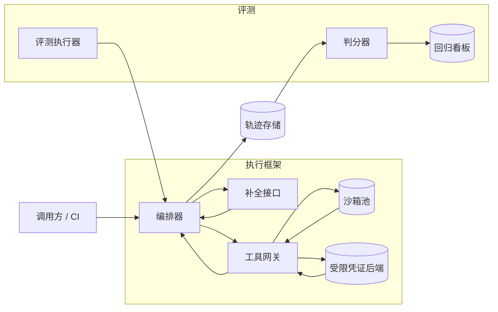

# Agent 执行框架与评测体系

[English](README.md) · [中文](README.zh.md)

<!-- meta:begin -->
| 题型 | 优先级 | 难度 | 岗位 | 考点 | 轮次 |
| --- | --- | --- | --- | --- | --- |
| 系统设计 | ★☆☆☆☆ | — | RE · MLE · RS | agent, evaluation, tooling, observability | 现场面 |
<!-- meta:end -->

## 题目

设计一个多步骤、可调用工具的 agent 的执行框架，以及构建在它之上的离线评测体系。一次*运行*（run）为达成给定目标，在语言模型调用与外部工具调用（代码执行沙箱、内部检索接口、工单系统、文件存储……）之间交替进行，跨越多个步骤，直到运行结束或被终止。这套执行框架由公司内部多个产品团队共用，各团队在同一套执行与工具调用机制之上搭建不同的 agent（客服、内部编程助手、运维自动化 agent）。

范围外：底层语言模型本身的训练或微调，以及模型推理服务本身的设计——假设已经有一个具备给定延迟分布的托管补全（completion）接口可用，重点放在它周围的一切：一次运行如何被编排、工具如何被安全地调用、一次运行的完整轨迹如何被记录，以及一套固定的任务集合如何被打分，以便在问题进入生产环境之前先发现回归。

这次设计的规模：

- 所有共用这套执行框架的 agent 加起来，平均每秒启动 20 次运行（约每天 170 万次），忙时的峰均比为 3 倍。
- 一次运行平均 12 步；一步是一次模型调用，之后可能跟着一次工具调用（约 70% 的步会调用工具）。
- 托管补全接口平均每次调用 900 毫秒。工具调用平均 500 毫秒，这是一个混合数字：其中约五分之一要经过隔离的代码执行沙箱（平均 1.9 秒，含沙箱的创建与销毁），其余是走受限凭证的内部接口或检索调用（平均 150 毫秒）。
- 一套 2,000 个任务的固定评测集每晚针对当前的执行框架与模型版本跑一遍；任何改动执行框架、工具定义或系统提示词的 PR，在合入前都要先跑一遍 200 个任务的抽测子集。

范围内：运行编排器及其核心抽象（任务、上下文、工具、轨迹、状态、终止条件）；工具调用接口，包括权限范围、超时、重试，以及工具的错误如何回传给模型；完整执行轨迹的记录与回放，包括长期存储时采样什么；以及离线评测体系——数据集与判分、每次运行上报的指标、如何防止评测集泄漏进模型或提示词能看到的任何地方，以及评测结果如何通过 CI 与每夜的回归看板把关一次发布。除模型训练与推理服务之外，范围外还包括：工具后端本身（代码沙箱、检索索引、工单系统）都是给定的、固定不变的服务；供人查看轨迹或给运行打分的界面也不在范围内。

要产出：

1. 需求与规模估算：同时在跑的运行数、工具调用速率、沙箱池大小，以及轨迹存储量。
2. 一份数据模型（任务、运行、步骤、工具定义、评测结果）与 4-5 个核心接口。
3. 一张同时覆盖生产运行路径与评测路径的架构图，并沿着一次运行把这条路径走一遍。
4. 深入讨论：工具调用的隔离、超时、重试与错误回传；轨迹的记录与回放，包括采样及其存储成本；以及评测体系——数据集与判分、多维度指标、如何防止评测集泄漏与过拟合，以及如何把回归测试接入 CI。每个话题至少比较两种方案，说明选哪个、为什么，并给出这个选择的代价。

## 参考解答

<details>
<summary>展开参考解答</summary>

动手设计之前值得先确认两点：被调用的工具后端是否都能接受幂等键（否则执行框架无法安全地代它重试一次有副作用的调用）；评测环境是否必须完全离线、可重放，还是允许一小部分任务对接真实的外部服务。下面的设计假设大多数工具都支持幂等键，评测套件跑在录制或模拟的工具响应之上。

### 需求与规模

**并发数。** 在平均到达率 $\lambda_{\text{avg}} = 20$ 次运行/秒下，一步的延迟是补全调用的 900 毫秒，加上 70% 的步里会发生的工具耗时；混合后的工具延迟是

$$0.2 \times 1.9\text{s} + 0.8 \times 0.15\text{s} = 0.5\text{s，}$$

所以一步平均 $0.9 + 0.7 \times 0.5 = 1.25$ 秒，一次 12 步的运行平均耗时 $12 \times 1.25 = 15$ 秒。按 Little 定律 $L = \lambda W$，平均有 $20 \times 15 = 300$ 次运行同时在跑，3 倍峰值下是 $60 \times 15 = 900$——这是编排器的工作池必须能同时容纳的数字，不是到达率本身。

**工具调用与沙箱速率。** 平均每秒 $20 \times 12 = 240$ 步（峰值 720 步），其中 70% 的步调用工具，即平均 168 次工具调用/秒、峰值 504 次/秒。其中五分之一走隔离沙箱，峰值下约 $504 \times 0.2 \approx 101$ 次沙箱调用/秒；每次占用沙箱平均 1.9 秒，再用一次 Little 定律，峰值下需要同时存在约 $101 \times 1.9 \approx 192$ 个沙箱。按 30% 余量配置一个约 250 个的热池，可以避免大多数调用在关键路径上支付一次冷启动（约 150 毫秒）的代价。

**轨迹存储。** 每一步记录下来的一个 turn 大约 3 KB：1.2 KB 的模型输出，1.4 KB 的工具输入/输出（按 70% 的步才有、每次 2 KB 平均下来，即 $2\text{KB} \times 0.7$），以及 0.4 KB 的元数据（时间戳、token 数、工具 id）。一次 12 步的运行是 $12 \times 3\text{KB} = 36$ KB，按每天 173 万次运行算，执行框架每天写入约 62.2 GB。用于实时调试的 14 天热存储窗口因此约 871 GB。

**评测调度。** 单次运行给一个随机性的 agent 打分噪声很大，所以两套评测都对每个任务重复跑 3 次：夜间套件是 $2{,}000 \times 3 = 6{,}000$ 次运行，抽测套件是 $200 \times 3 = 600$ 次。一次评测运行并不比一次生产运行便宜多少——模型每步仍然要 900 毫秒，沙箱任务也仍然真的执行，只有走受限凭证的快调用是从快照里回放的，所以一次评测运行是 $12 \times (0.9 + 0.7 \times 0.2 \times 1.9) = 14.0$ 秒。容量按生产的每次运行 15 秒配置：要在 45 分钟的预算内跑完夜间套件，至少需要 $\lceil 6{,}000 \times 15 / 2{,}700 \rceil = 34$ 个并发工作者（配置 40 个留余量）；要在 8 分钟的 PR 反馈预算内跑完抽测套件，至少需要 $\lceil 600 \times 15 / 480 \rceil = 19$ 个（配置 24 个，放在一条独立预留的通道上，这样生产峰值的 900 次运行不会抢占一次 PR 检查的资源）。

### 数据模型与 API

六个核心抽象在这份数据模型里都有对应：*任务*（task）就是一行 `Task`；它的*上下文*（context）并不单独存储，而是按轨迹那个深入话题的做法临时重建出来；*工具*（tool）是一行 `ToolDef`；*轨迹*（trajectory）是某个 `Run` 按顺序排列的一串 `Step`；一次运行的*状态*（state）是编排器在运行过程中随身带着的少量可变记账——重试次数、当前工具签名下连续失败的次数、目前花掉的 token 和成本——存在 `Run` 这一行本身，和只追加的轨迹分开；*终止条件*（termination condition）则是每一步结束后都要检查的策略：显式的结束动作、`max_steps`、`wall_clock_timeout_s`、安全熔断，或者 `tool_loop`。

**Task（任务）**——`task_id`、`caller`（`production` 或某个评测套件的 id）、`goal`（交给模型的指令）、`tool_allowlist`、`env_snapshot_ref`（指向起始环境的指针——评测任务指向录制或模拟的工具响应；生产任务除了实时凭证之外没有别的）、`max_steps`、`wall_clock_timeout_s`、`golden_check_ref`（只有评测任务才设置，指向判分函数或 rubric）。

**Run（运行）**——一次任务的执行尝试：`run_id`、`task_id`、`model_version`、`harness_version`、`status`（`running | finished | timed_out | aborted`）、`stop_reason`（`finish_action | max_steps | wall_clock | safety_halt | tool_loop`）、`retry_count`、`failure_streak`（按工具签名记的当前连续失败次数）、`started_at`、`finished_at`、`total_tokens`、`cost_usd`。

**Step（步骤）**——轨迹的最小单位：`run_id`、`step_index`、`role`（`assistant | tool`）、`content_ref`（超过某个大小阈值就指向对象存储，否则内联）、`tool_call`（`{tool_id, args, idempotency_key}` 或 null）、`tool_result`（`{status, error_class, latency_ms, result_ref}` 或 null）、`token_usage`、`timestamp`。

**ToolDef（工具定义）**——`tool_id`、`version`、`json_schema`（参数的 schema）、`side_effect_class`（`read_only | mutating`）、`isolation`（`sandboxed | scoped_token`）、`timeout_ms`、`retryable`。

**EvalResult（评测结果）**——`run_id`、`grader`（`programmatic | llm_judge | human`）、`dimension_scores`（`{success, tool_quality, cost, latency, safety, stability}`）、`judge_version`、`graded_at`。

核心接口：

1. `POST /tasks/{task_id}/runs`——以 `production` 或 `eval` 模式启动一次运行。请求体：`{model_version, harness_version, mode}`。返回 `{run_id, status: "running"}`。
2. `POST /tools/{tool_id}/invoke`——编排器代模型发起的、执行框架内部的调用；按 schema 校验参数，套用该工具的超时、隔离与重试策略，返回 `{status, result_ref, error_class?, latency_ms}`。
3. `GET /runs/{run_id}/trajectory`——一次运行按顺序分页的步骤列表，供调试界面与回放引擎使用。
4. `POST /eval-suites/{suite_id}/runs`——触发一次套件运行（夜间定时任务或 CI webhook），指定 `model_version`/`harness_version` 与 `repeats`。返回 `{suite_run_id, status}`。
5. `GET /eval-suites/{suite_id}/runs/{suite_run_id}/report`——每个任务和整套套件的多维度分数，以及与该套件历史基线的差异；CI 读这个接口来判断是否放行。

### 架构



生产调用方或评测执行器在编排器这里启动一次运行，编排器持有这个任务的上下文与可变状态。编排器把当前上下文发给补全接口；模型的这一轮如果请求了工具，工具网关就按该工具的 schema 校验这次调用，再把它分发给沙箱池（代码执行）或某个受限凭证后端（内部接口、检索），过程中执行该工具的超时与重试策略，最后返回一个结构化的结果。编排器每一步都把模型的这一轮和工具的结果追加进轨迹存储，再带着更新后的上下文回到补全接口，直到某个终止条件触发。评测执行器驱动的是同一条编排器路径，只是对接的是一份固定的环境快照而不是真实流量；一次运行结束后，判分器从存储里读出它的轨迹，写下各维度的分数，直接进入回归看板。

### 深入话题

**工具调用的隔离、超时、重试与错误回传。** 两级隔离覆盖了这批工具：任意代码或受模型影响的代码跑在一个用一次就销毁的临时沙箱里；内部接口和检索调用则带着一个短期有效、按调用发放的凭证出去，这个凭证的权限被严格限定在该工具声明的那个资源和那个操作上，TTL 与工具的超时对齐。所有工具统一走沙箱会更简单，但会让本来就由自己后端做权限控制的调用也白付一次沙箱冷启动和内存的代价；受限凭证这条路径的代价则是要相信那个后端自己的鉴权是对的，因为调用一旦离开执行框架，框架就看不到发生了什么。

每个工具自己声明超时（受限接口调用默认 5 秒，沙箱是硬性的 30 秒强杀）；一步自身的超时就是这个值加一点余量，而上面的运行级上限（`max_steps`、整体时限）兜住了即使每一步都很慢的最坏情况。只有可以安全重复的错误类别才会被重试——超时或连接错误，但绝不重试一次 schema 校验失败，因为重试一次同样畸形的调用不会让它变得合法，只会白白耗掉一步；有副作用的工具还要求一个幂等键，由 `(run_id, step_index, tool_id)` 派生，这样它在*同一次*调用的多次重试之间保持不变，又不会被复用到另一次真正不同的调用上，后端就按这个键去重。最多重试 2 次，用指数退避（250 毫秒起、翻倍、±20% 抖动）。让模型自己决定再调一次工具的做法被考虑过并放弃了：模型发起的重复调用没有稳定的幂等键，一次被重试的有副作用操作可能被重复执行；执行框架自己接管所有有副作用调用的重试，只把最终结果告诉模型。

工具的错误会被追加进轨迹，做成一条结构化的观察——`error_class` 加上后端的原始报错文本，不做转述——这样模型才能做出对应的反应：校验错误就去修参数，权限错误就换一个工具，超时被告知重试已经用完了就换个思路。同一个工具签名（同样的 `tool_id` 与等价的参数）连续失败 3 次，直接以 `stop_reason = tool_loop` 终止这次运行，而不是让卡住的 agent 一直转到整体时限。

**轨迹的记录与回放。** 一条轨迹是一串只追加的步骤，每个只存一份；超过某个大小阈值的内容（一次很大的检索结果、一份文件 diff）写进对象存储，步骤记录里只留一个指针。要在任意一步还原出真正发给模型的那份上下文，做法是把已存的各个 turn，和当时生效的、带版本号的系统提示词与工具定义拼接起来——不是在每一步都把那份一直在变长的完整上下文重新存一遍。这个区别很关键：如果在 $k=12$ 步的每一步都存一份完整上下文快照，每个更早的 turn 都会被重复存一次，变成 $k(k+1)/2 = 78$ 个 turn 的等价量，而不是 12 个——是前面按增量存储算出的 36 KB/次运行的 $6.5$ 倍（即 $(k+1)/2$），而这纯粹是存储方式选错造成的。

把一次历史运行拿去在新的模型版本下回放，会原样重放每一条记录下来的 `tool_result`，而不是重新调用那个工具：这样才能把“模型行为是否变了”和“环境是否变了”这两件事分开——否则检索索引或工单系统过一阵子返回了不同的结果，会让一个真实的回归看起来已经修好、或者反过来，而这跟模型无关。

把每次运行都永久按全量保留是不值当的：按 62.2 GB/天算，一年下来是约 22.7 TB。所以只有 14 天的热窗口（871 GB）按全量保留、供实时调试用；长期存储只保留每一次失败的运行，加上成功运行里随机 5% 的样本，按对 `run_id` 做哈希来抽样（不是每天重新随机一次，这样同一批被抽中的运行能被长期跟踪、用来看漂移）。按 8% 的生产失败率算，这样留下的比例是 $0.08 + 0.92 \times 0.05 = 12.6\%$，把长期存储的年用量压到约 2.86 TB，是全量保留的 $1/7.9$，而且不会漏掉任何一次失败。按*步骤*而不是按整次运行来抽样的做法被否掉了：一条只保留了部分步骤、丢了另一部分的轨迹没法被完整回放，所以抽样的单位只能是整次运行。

**评测：数据集、判分与回归测试。** 每个评测任务都固定自己的起始环境（一份预置好的文件系统，或者录制/模拟的工具响应），这样一次运行才可复现；否则，一次运行和另一次运行之间某个真实外部依赖发生的变化，会和一次真正的回归混在一起分不清。另有一条小规模的“集成”通道对接真实服务，只覆盖少数确实需要它的任务，跑得不频繁，也从不卡合入。判分按任务类型分工：客观任务（文件被正确改动、测试套件通过）靠一个程序化检查去对照 golden 的最终状态；开放式任务交给一个 LLM 判官，按固定的 rubric 加若干校准用的示例打分，这个判官本身每周还要拿一份 200 个任务的人工评分样本去核对，一旦一致率跌破 90% 就要重新校准。

每次运行会在六个维度上分别打分，互不合并成一个数：任务成功（rubric 或 golden 状态给出的分数）、工具调用质量（通过 schema 校验的调用占比，以及相对这次运行自己历史而言是冗余调用的占比）、成本（token 花费和工具计算成本分开记账，因为一次 token 花得少的运行，沙箱可能照样很贵）、延迟（墙钟时间）、安全（一个独立的安全分类器标记为不允许的动作），以及稳定性（同一个任务重复跑 3 次之间的一致程度——分歧很大说明的是 agent 不可靠，不一定是这次跑错了）。

评测数据的存储和用来筛选提示词或训练数据的那条流水线分开做访问控制；每个评测任务都带一个唯一的标记串（canary），在一份提示词包或一个训练分片里 grep 一下就知道评测有没有泄漏进去，而一个基于 shingle MinHash 的近重复检查（Jaccard 超过 0.8 就标记）用来抓那些被改写、而不是被照抄的评测样本。这套 2,000 个任务的评测集又分成一个 1,500 个任务的可见子集——迭代执行框架或提示词的时候可以随时看——和一个 500 个任务的留存子集，只按周打一次分，平时不看；这两个分数之间的差距一旦持续拉大，就是已经开始过拟合那个可见子集的信号。每个 PR 都会跑一次抽测套件（600 次运行、24 个预留的工作者、8 分钟预算），只有当它的平均成功率比滚动基线低出 2 个标准误以上，才卡住这次合入。这里独立的单位是任务而不是运行——同一个任务的 3 次重复是相关的——所以 75% 基线下这个标准误是 $\sqrt{0.75 \times 0.25 / 200} \approx 0.031$，即 3.1 个百分点，合入这一关只拦得住 6 个百分点以上的回归；夜间套件的 2,000 个任务把同一个标准误压到 0.97 个百分点，所以一次 2 个百分点的缓慢下滑当晚就会被看板和 on-call 抓到。因为每次运行的轨迹都被留存了下来，一个失败的任务可以被定位到：如果任务自己定义了检查点，就是它偏离 golden 的最早那一步；如果没有，就是判官自己标出的、事情开始走偏的最早那一步，调试从那里开始。

### 追问

- 一个一直调用模型、却从不结束也不调用工具的运行，已经会被 `max_steps` 和整体时限抓住，不需要再单独设计一套检测。
- 一个 agent 派生出的子 agent 复用同一套 `Run`/`Step` 结构，加一个 `parent_run_id` 即可，嵌套的轨迹从现有数据模型自然得到。
- 一个只在负载升高时才变差的工具后端，它的重试策略要读一个按 `tool_id` 共享的熔断器，而不是每次运行各自退避，否则成千上万个并发的运行会同时重试同一个已经出问题的后端，让故障更严重。
- 想在真实流量上比较两个执行框架版本，就是一次在线 A/B 分流，按同样六个维度打分；离线评测套件的职责是别让一个会输得很难看的版本走到那一步。
- 人工判分的产能，而不是模型能力，才是给新的任务类别接入评测时真正的瓶颈：它的判官在一批新的人工校准样本打出来之前，是不能被信任的。

<details>
<summary>估算核对（可运行）</summary>

```python
import math

# --- run-level throughput and concurrency ---
lam_avg = 20.0          # runs/sec, average, across all agents sharing the harness
peak_factor = 3
lam_peak = lam_avg * peak_factor
assert lam_peak == 60

daily_runs = lam_avg * 86_400
assert daily_runs == 1_728_000

k_steps = 12                      # average steps per run
tool_frac = 0.7                   # fraction of steps that call a tool
llm_latency = 0.9                 # s, average completion-API call
frac_sandbox = 0.2                # fraction of tool calls that go through the isolated sandbox
L_sandbox = 1.9                   # s, average sandbox occupancy (setup + exec + teardown)
L_other = 0.15                    # s, average scoped-token API/search call

tool_latency = frac_sandbox * L_sandbox + (1 - frac_sandbox) * L_other
assert round(tool_latency, 3) == 0.500

step_latency = llm_latency + tool_frac * tool_latency
assert round(step_latency, 3) == 1.250

run_duration = k_steps * step_latency
assert run_duration == 15.0

L_avg = lam_avg * run_duration     # Little's law: concurrency in flight
L_peak = lam_peak * run_duration
assert L_avg == 300
assert L_peak == 900

steps_per_sec_avg = lam_avg * k_steps
steps_per_sec_peak = lam_peak * k_steps
assert steps_per_sec_avg == 240
assert steps_per_sec_peak == 720

tool_calls_per_sec_avg = steps_per_sec_avg * tool_frac
tool_calls_per_sec_peak = steps_per_sec_peak * tool_frac
assert tool_calls_per_sec_avg == 168
assert round(tool_calls_per_sec_peak) == 504

sandbox_calls_per_sec_peak = tool_calls_per_sec_peak * frac_sandbox
assert round(sandbox_calls_per_sec_peak, 1) == 100.8

concurrent_sandboxes_peak = sandbox_calls_per_sec_peak * L_sandbox
assert round(concurrent_sandboxes_peak) == 192

# --- trajectory storage ---
model_output_bytes = 1200
tool_io_bytes = 2000
metadata_bytes = 400
step_bytes = model_output_bytes + tool_frac * tool_io_bytes + metadata_bytes
assert step_bytes == 3000

run_bytes = k_steps * step_bytes
assert run_bytes == 36_000

GB = 1_000_000_000
daily_bytes = daily_runs * run_bytes
daily_gb = daily_bytes / GB
assert round(daily_gb, 1) == 62.2

hot_days = 14
hot_gb = daily_gb * hot_days
assert round(hot_gb) == 871

# naive full-context-per-step snapshot vs delta-based logging
naive_multiplier = (k_steps + 1) / 2
assert naive_multiplier == 6.5
naive_run_bytes = run_bytes * naive_multiplier
assert naive_run_bytes == 234_000

fail_rate = 0.08
sample_rate = 0.05
kept_frac = fail_rate + (1 - fail_rate) * sample_rate
assert round(kept_frac, 3) == 0.126

long_term_daily_gb = kept_frac * daily_gb
assert round(long_term_daily_gb, 2) == 7.84

days_per_year = 365
long_term_annual_tb = long_term_daily_gb * days_per_year / 1000
assert round(long_term_annual_tb, 2) == 2.86

naive_annual_tb = daily_gb * days_per_year / 1000
assert round(naive_annual_tb, 1) == 22.7

reduction = naive_annual_tb / long_term_annual_tb
assert round(reduction, 1) == 7.9

# --- eval suite scheduling ---
n_eval, n_smoke, repeats = 2000, 200, 3
eval_runs = n_eval * repeats
smoke_runs = n_smoke * repeats
assert eval_runs == 6000
assert smoke_runs == 600

nightly_budget_s = 45 * 60
ci_budget_s = 8 * 60

nightly_workers = math.ceil(eval_runs * run_duration / nightly_budget_s)
ci_workers = math.ceil(smoke_runs * run_duration / ci_budget_s)
assert nightly_workers == 34
assert ci_workers == 19

# An eval run replays the scoped calls but still executes the sandboxed ones, so it is only a little
# cheaper than a production run; sizing the pools at 15 s keeps that difference as margin.
eval_run_duration = k_steps * (llm_latency + tool_frac * frac_sandbox * L_sandbox)
assert round(eval_run_duration, 3) == 13.992 and round(eval_run_duration, 1) == 14.0
assert round(run_duration / eval_run_duration, 3) == 1.072

dev_n, held_out_n = 1500, 500
assert dev_n + held_out_n == n_eval

# Regression gate. The independent unit is the task, not the run: a task's 3 repeats are correlated, so
# the suite's mean success rate is no more precise than one Bernoulli draw per task.
baseline_success = 0.75
se_smoke = math.sqrt(baseline_success * (1 - baseline_success) / n_smoke)
se_nightly = math.sqrt(baseline_success * (1 - baseline_success) / n_eval)
assert round(100 * se_smoke, 1) == 3.1
assert round(100 * 2 * se_smoke, 1) == 6.1          # what the merge gate can actually catch
assert round(100 * se_nightly, 2) == 0.97

print("all requirements-and-scale numbers check out")
```

</details>

</details>
