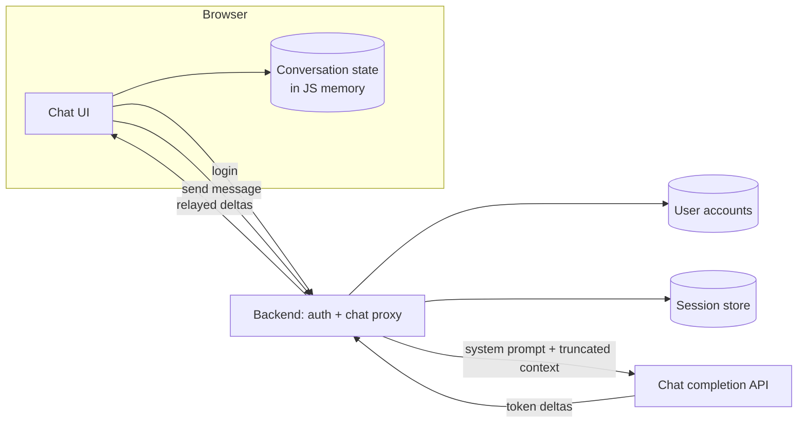

# AI Chatbot Front End

[English](README.md) · [中文](README.zh.md)

<!-- meta:begin -->
| Type | Priority | Difficulty | Roles | Topics | Format | Round |
| --- | --- | --- | --- | --- | --- | --- |
| System design | ★★☆☆☆ | — | SWE | frontend, streaming, client-state, auth | 60 min | Onsite · Phone screen |
<!-- meta:end -->

## Problem

Design the web application behind a simple AI chatbot: a single chat page, similar to a typical
ChatGPT-style main screen. A user must sign in before using it; once signed in, they type a text message,
send it, and watch the assistant's reply appear on screen token by token as it is generated, rather than
all at once. Replies are produced by an existing chat completion API: it takes an ordered list of
`{role, content}` messages (`role` is `system`, `user`, or `assistant`) and streams the reply back as a
sequence of text deltas, followed by one final event carrying a finish reason (`stop` or `length` on
success, `error` on failure). Before streaming starts it may instead refuse a request with HTTP `429`
(rate-limited) or `503` (overloaded). It bills per input and output token, and closing a streaming
request's connection early stops generation. Assume the API itself, its latency, and its throughput are
already provisioned and out of scope.

Three rules fix the shape of the design:

1. The backend must never persist a user's messages or the assistant's replies: no database row, log
   line, or cache entry may retain conversation content past the single request that produced it.
2. All conversation state — every message, in order, with its role and content — lives in the browser
   page's own JavaScript memory, not in `sessionStorage`, `localStorage`, or any other persistent browser
   storage.
3. Reloading the page discards that in-memory state: a refresh clears the conversation, and the next
   message the user sends starts a brand new one.

Scale for this design:

- 150,000 daily active users, opening an average of 1.5 conversations per day each — 225,000 new
  conversations per day.
- Each conversation averages 8 user turns; a user turn averages 80 tokens, an assistant reply averages
  300 tokens, and the completion API streams at roughly 40 tokens/second per reply.
- Usage is concentrated in a roughly 16-hour waking window shared by most users' time zones, and the
  busiest hour runs at about 5x the day's average request rate.

In scope: the browser-side chat application (rendering, conversation state, streaming updates); the login
flow and how the session credential is carried on later requests; a thin backend that authenticates the
user, forwards a message to the completion API, and relays the stream back; error handling and retry for
a dropped connection or a failed completion request. Out of scope: the completion API's own
implementation; storing or searching past conversations; multi-device or multi-tab sync of a single
conversation; file or image attachments; rate limiting or billing beyond stating where a limiter would
sit.

Produce:

1. A requirements and scale estimate: peak concurrent streaming replies, the resulting egress bandwidth,
   and the memory footprint of one conversation in the browser compared with a typical browser storage
   quota.
2. A data model for the browser-side conversation state and the backend's session state, and 3-5 core
   APIs (login, sending a message and streaming its reply, and canceling an in-flight reply).
3. An architecture diagram and a walk-through of one message along it.
4. Deep dives into streaming rendering, login and credential handling, and error handling and retry. For
   each, compare at least two alternatives, say which you would pick, and state the cost of that choice.

## Reference solution

<details>
<summary>Show the reference solution</summary>

Two points worth confirming before designing: the completion API's context-window limit, and whether the
login session should survive a page refresh. This design assumes an 8,000-token window, shared by the
system prompt, the history and the reply, and that the session survives refresh: the "refresh clears
state" rule covers only the conversation in JS memory, while the session lives in a cookie.

### Requirements and scale

**Peak message rate.** $225{,}000$ conversations/day $\times\ 8$ turns/conversation $= 1.8\times10^6$ user
messages/day, averaging $1.8\times10^6 / 86{,}400 \approx 20.8$ messages/sec. At 5x, the busiest hour sees
about $104$ messages/sec, roughly a fifth of the day's messages.

**Peak concurrent streams.** A reply streams for $300 / 40 = 7.5$ seconds on average. By Little's law,
$L = \lambda W$: concurrent streaming replies at peak $\approx 104 \times 7.5 \approx 781$ — the
long-lived connections the backend's chat proxy must hold open at once, each with its own upstream call.

**Egress bandwidth.** A frame carrying one 4-character token (an `event: delta` line plus a `data:` line)
is 37 bytes: $40 \times 37 = 1{,}480$ B/s per stream, so 781 streams peak at about $1.16$ MB/s, roughly 9
Mbit/s. Even if per-write TLS and TCP headers doubled that, the number to size for is open connections,
not bytes.

**Browser memory per conversation.** 8 turns $\times$ (80-token user message + 300-token reply) $\times$ 4
chars/token $\approx 12{,}200$ characters, about 12 KB at the one byte per character V8 uses for Latin-1
text (two once CJK or emoji appear). Add about 120 bytes of bookkeeping per message $\times$ 16 messages
$\approx 1.9$ KB: about 14 KB per conversation, bounded by device RAM, not a quota. For comparison,
`sessionStorage` (the persistence option in the follow-ups) allows about 5 MiB per origin; even at two
bytes per character that is about 186 such conversations, so a quota binds only an unusually long,
code-heavy conversation.

### Data model and API

**Conversation** (browser only) — `id` (`crypto.randomUUID()`, created when the first message is sent),
`messages` (an ordered array of `Message`).

**Message** (browser only) — `id` (`crypto.randomUUID()`, assigned client-side at creation), `role`
(`user | assistant`; the system prompt belongs to the backend), `content`, `status`
(`sending | streaming | done | error`), `createdAt` (client clock, epoch ms).

**Session** (backend session store) — `sessionId` (128 random bits, the session cookie's value), `userId`,
`expiresAt` (sliding, about a day). **User** (accounts store) — `userId`, `email`, `passwordHash` (a slow
salted hash such as Argon2id or bcrypt). Neither holds message content.

Because the backend keeps nothing between requests, every send carries its own context. The backend
prepends its own system prompt (under 400 tokens; never one from the client, which could rewrite it) and
caps the reply at 800 tokens, leaving $8{,}000 - 400 - 800 = 6{,}800$ tokens of history. The client sends
every turn whose reply finished (`done`) plus the new user message, estimating tokens as
`content.length / 4` and walking back from the newest turn, keeping whole (user, assistant) turns while
the total fits: the oldest turns are dropped first, and the new message is always kept. An average 8-turn
conversation (about 3,040 tokens) is never truncated; one that reaches its 19th turn starts losing its
oldest. Four characters per token is a rough rate for English that undercounts other scripts, so the
backend re-counts with the model's tokenizer and trims further from the oldest turn, returning `400`
without calling the model if the new message alone does not fit.

**Core APIs**

1. `POST /api/auth/login` — body `{email, password}`, checked against `passwordHash`. On success, creates a
   session, sets the session cookie (credential deep dive) and returns `{userId}`; no token appears in the
   response body.
2. `POST /api/auth/logout` — deletes the session and clears the cookie; the page also drops its in-memory
   conversation.
3. `POST /api/chat/completions` — body `{conversationId, messages}` (the truncated context above, oldest
   first); requires the session cookie and a matching CSRF header. Response: a `text/event-stream` body
   of `event: delta` / `data: {"text": "…"}` frames, then one `event: done` /
   `data: {"finishReason": "stop" | "length" | "error"}`.
4. Cancel — the client calls `AbortController.abort()` on the in-flight `fetch`; there is no separate
   endpoint. The backend sees the client disconnect and aborts its own upstream call, which stops
   generation.

### Architecture



Signing in posts credentials to the backend, which checks the accounts store, writes a session and sets
the session cookie. For each message, the UI appends the user message (`status: "sending"`) and an empty
assistant placeholder (`status: "streaming"`) to the in-memory conversation and posts the truncated
`messages` to the chat proxy. The backend looks the session cookie up in the session store, checks the
CSRF header against the CSRF cookie, prepends the system prompt, attaches the completion API's key (which
the browser never holds), and forwards the request. Each upstream delta goes back as an `event: delta`
frame and is appended to the placeholder only; the final `event: done` sets its status to `"done"` (`stop`
or `length`) or `"error"`. Nothing on this path is written to disk, so once the response ends the backend
holds no trace of the exchange.

### Deep dives

**Streaming rendering.** A WebSocket's second direction buys nothing when each turn is one request and one
streamed reply, and `EventSource` only issues a `GET` with no body and no custom headers, so it cannot
carry the `messages` array or the CSRF header. The client uses `fetch` with a `POST` body and an
`AbortController` signal, reads `response.body.getReader()`, and parses the frames by hand, carrying a
cut-off event over to the next read. A read can also end in the middle of a multi-byte UTF-8 character
(any CJK character or emoji), so a single `TextDecoder` decodes every chunk with
`decode(chunk, {stream: true})`, which holds the incomplete bytes back for the next call; decoding each
chunk on its own turns them into `U+FFFD` replacement characters.

Messages render as a list keyed by `message.id`, so the framework matches each item to its existing DOM,
and each item is memoized on its `message` object. An update replaces only the streaming message's object,
so the other 15 messages of an 8-turn conversation skip rendering; the key alone would not do this, since
without memoization a parent's state change re-renders every child. Deltas go into a buffer flushed once
per `requestAnimationFrame`, so there is at most one render per displayed frame; because
`requestAnimationFrame` does not run in a background tab, the `done` handler flushes the buffer itself.

The text is Markdown, re-parsed on each flush, and mid-stream it is often incomplete. CommonMark already
treats an unclosed ` ``` ` fence as a code block running to the end of the text, so a half-arrived code
block renders correctly as it grows. What misrenders is inline syntax: an unmatched `**` or a half-arrived
link shows as literal characters, then jumps to formatting once its closer arrives. So before each parse
the renderer closes unmatched inline markers on a copy of the text; the real closer takes over when it
arrives.

For autoscroll, the `scroll` handler records whether the viewport is near the bottom
(`scrollHeight - scrollTop - clientHeight <= threshold`), and each flush scrolls down only if it is.
Growing content fires no `scroll` event, so only the user scrolling up clears the flag; scrolling back
down or sending a message sets it again.

**Login and credentials.** The completion API's key stays in the backend's secrets store; the question is
where the browser keeps proof of login. `localStorage` is ruled out: an injected script reads it with one
`getItem` call and can send it anywhere. An in-memory access token is just as readable by script while it
lives, and is lost on refresh, so it needs a refresh credential in a cookie anyway. The design uses one
cookie holding the opaque `sessionId`, set `HttpOnly` (no script, the page's own included, can read it),
`Secure` (sent only over HTTPS) and `SameSite=Lax`.

`HttpOnly` is not an XSS defense. An injected script cannot read the cookie, but it can call `fetch` from
the page, which attaches it, and can read the CSRF cookie below and the whole conversation; `HttpOnly`
only stops it carrying the session off for use elsewhere. XSS itself must be prevented: the Markdown
renderer treats model output as untrusted (raw HTML disabled, `javascript:` links rejected), and a Content
Security Policy (`script-src 'self'`) refuses inline and third-party scripts.

CSRF is a different attack: another site makes the victim's browser send a request that carries the
cookie. `SameSite=Lax` keeps the cookie off cross-site `POST`s (as `Strict` does), but "site" means the
registrable domain, so a form on a sibling subdomain still gets it. The real guard is a double-submit
token: when the page is first served, the backend sets a second, non-`HttpOnly` cookie with a random value
(rotated at login), and every state-changing request (login, logout, completions) must copy it into an
`X-CSRF-Token` header, which the backend compares with the cookie. Another origin cannot read that cookie,
an HTML form cannot set headers, and a cross-origin `fetch` with a custom header needs a CORS preflight
the backend never grants. CORS alone is not the defense: it governs reading responses and non-simple
requests, and a plain form `POST` is sent without asking.

The session store costs one key-value lookup per request and makes logout immediate; a self-contained
signed token would skip the lookup but could not be revoked before it expires without a blocklist.

**Error handling and retry.** Four failure modes: the connection drops or stalls mid-stream; the
completion API refuses with `429` or `503`, which the backend relays before any frame; the session expires
(`401`); the device goes offline. A lost network can show up as silence rather than an error, so the
backend writes an SSE comment line (`: ping`) every 5 seconds while it waits on the model, and the client
aborts the `fetch` after 15 seconds with no bytes, treating that as a drop.

A `429` or `503`, or a drop before the first delta, is retried automatically, since nothing has been shown
and the rebuilt request is identical: up to three retries at about 0.5, 1 and 2 seconds with random jitter
(or after `Retry-After`, when present), then an error with a retry button. Once deltas have rendered, a
drop or a `finishReason: "error"` is not retried silently, because a retry would replace visible text with
a different sample: the message keeps its partial content, flips to `"error"`, and offers regenerate,
which reissues the request from scratch. Resuming is impossible, since the backend holds nothing (rule 1)
and the completion API only answers a message list with a fresh reply; a regeneration pays for the whole
reply's output tokens again.

A `401` opens an in-page sign-in dialog rather than redirecting, because navigating to a separate login
page would unload the page and discard the conversation; the pending request is resent once the new cookie
is set. While the browser reports being offline (the `offline` event), a banner replaces send instead of a
retry loop.

A retry must not duplicate the user's message, and a stateless backend has nothing to deduplicate against,
so the guarantee is client-side only. The user message and its placeholder each get a
`crypto.randomUUID()` id once, when appended; every retry rebuilds the request from
`Conversation.messages`, where the user message appears once, and streams into the same placeholder id, so
neither the transcript nor the context sent to the model gains a second copy. The ids cannot prevent a
second completion call: each retry is a separately billed generation that resends the whole context, on
top of whatever the failed attempt generated, which is why automatic retries are capped.

### Follow-ups

- The production metrics are time to first token (send to first `delta` frame, measured in the browser so
  it includes the user's network) and the share of replies ending in `"error"`, by region and network type.
- Server-persisted history would add a `Conversation`/`Message` store keyed by user and an endpoint to list
  and resume past conversations; deduplication could then move to the server, keyed by the message id.
- If rule 2 were relaxed, mirroring `Conversation` into `sessionStorage` on every update would keep it
  across a same-tab refresh while a new tab still starts empty, well within the quota estimated above.
- A per-user token bucket in the chat proxy, not the client's backoff (which a script can skip), is what
  protects the completion API's quota and cost.

<details>
<summary>Estimate check (runnable)</summary>

```python
dau, sessions_per_user = 150_000, 1.5
conversations_per_day = dau * sessions_per_user
assert conversations_per_day == 225_000

turns_per_conv = 8
user_messages_per_day = conversations_per_day * turns_per_conv
assert user_messages_per_day == 1_800_000

avg_msgs_per_sec = user_messages_per_day / 86_400
assert round(avg_msgs_per_sec, 1) == 20.8

peak_factor = 5
peak_msgs_per_sec = avg_msgs_per_sec * peak_factor
assert round(peak_msgs_per_sec) == 104
# the busiest hour at 5x the daily average carries about a fifth of the day's messages
peak_hour_share = peak_msgs_per_sec * 3_600 / user_messages_per_day
assert round(peak_hour_share, 2) == 0.21

reply_tokens, tokens_per_sec = 300, 40
stream_seconds = reply_tokens / tokens_per_sec
assert stream_seconds == 7.5

# Little's law: L = lambda * W
peak_concurrent_streams = peak_msgs_per_sec * stream_seconds
assert round(peak_concurrent_streams) == 781

frame = 'event: delta\ndata: {"text": "abcd"}\n\n'   # one 4-character token
bytes_per_token_event = len(frame.encode("utf-8"))
assert bytes_per_token_event == 37
per_stream_bytes_per_sec = tokens_per_sec * bytes_per_token_event
assert per_stream_bytes_per_sec == 1_480

peak_egress_bytes_per_sec = peak_concurrent_streams * per_stream_bytes_per_sec
assert round(peak_egress_bytes_per_sec, -4) == 1_160_000
peak_egress_mbps = peak_egress_bytes_per_sec * 8 / 1_000_000
assert round(peak_egress_mbps) == 9

chars_per_token, user_msg_tokens = 4, 80
user_msg_chars = user_msg_tokens * chars_per_token
assistant_msg_chars = reply_tokens * chars_per_token
conv_text_chars = turns_per_conv * (user_msg_chars + assistant_msg_chars)
assert conv_text_chars == 12_160                   # bytes at one byte per character

overhead_per_message, messages_per_conv = 120, turns_per_conv * 2
conv_overhead_bytes = messages_per_conv * overhead_per_message
assert conv_overhead_bytes == 1_920

conv_total_bytes = conv_text_chars + conv_overhead_bytes
assert conv_total_bytes == 14_080

quota_bytes = 5 * 1024 * 1024                      # sessionStorage, per origin
worst_case_conv_bytes = 2 * conv_total_bytes       # every character stored as two bytes
assert round(quota_bytes / worst_case_conv_bytes) == 186

context_window, reply_cap, system_prompt_cap = 8_000, 800, 400
history_budget = context_window - reply_cap - system_prompt_cap
assert history_budget == 6_800

turn_tokens = user_msg_tokens + reply_tokens
assert turns_per_conv * turn_tokens == 3_040       # an average conversation never truncates

def first_truncated_turn():
    n = 1
    # context at turn n: (n - 1) finished turns plus the new user message
    while (n - 1) * turn_tokens + user_msg_tokens <= history_budget:
        n += 1
    return n

assert first_truncated_turn() == 19

print("all requirements-and-scale numbers check out")
```

</details>

</details>
