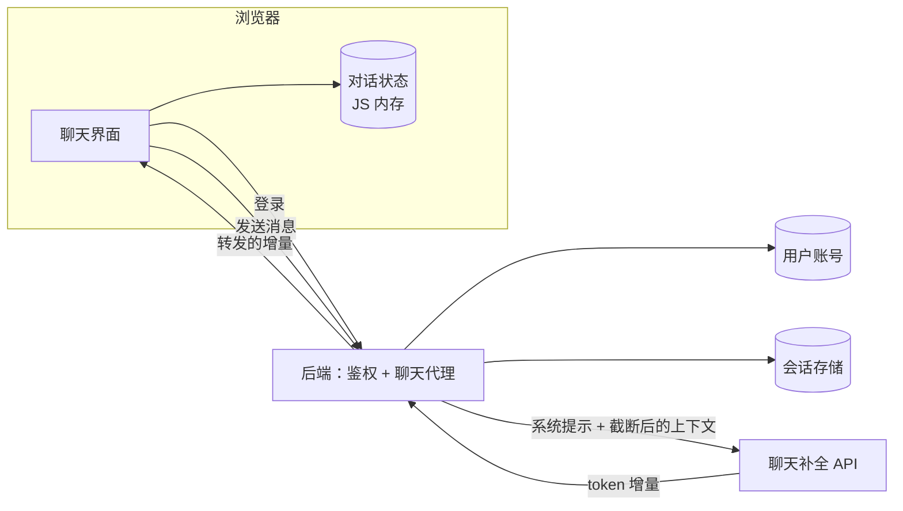

# AI 聊天机器人前端

[English](README.md) · [中文](README.zh.md)

<!-- meta:begin -->
| 题型 | 优先级 | 难度 | 岗位 | 考点 | 形式 | 轮次 |
| --- | --- | --- | --- | --- | --- | --- |
| 系统设计 | ★★☆☆☆ | — | SWE | frontend, streaming, client-state, auth | 60 分钟 | 现场面 · 电话面 |
<!-- meta:end -->

## 题目

设计一个简单的 AI 聊天机器人背后的网页应用：一个单页的聊天界面，类似典型的 ChatGPT 主界面。用户必须先登录才能使用；登录之后，用户输入一条文本消息并发送，然后看着助手的回答逐个 token 出现在屏幕上，而不是等整段生成完才一次性显示。回答由一个已有的聊天补全（chat completion）API 产生：它接收一个有序的 `{role, content}` 消息列表（`role` 取值为 `system`、`user` 或 `assistant`），把回答以一串文本增量（delta）的形式流式返回，最后跟一个携带结束原因的事件（成功时是 `stop` 或 `length`，失败时是 `error`）。在开始流式返回之前，它也可能以 HTTP `429`（限流）或 `503`（过载）拒绝请求。它按输入和输出的 token 计费，提前关闭一个流式请求的连接会让生成停止。假设这个 API 本身，以及它的延迟和吞吐，都已经就绪，不在设计范围内。

三条规则确定了这次设计的形状：

1. 后端绝不能持久化用户的消息或助手的回答：任何数据库行、日志行、缓存条目，都不能在产生它的那一次请求结束之后，继续保留对话内容。
2. 全部对话状态——按顺序排列的每一条消息，连同它的角色和内容——都保存在浏览器页面自己的 JavaScript 内存里，不放进 `sessionStorage`、`localStorage`，也不放进任何其他持久化的浏览器存储。
3. 刷新页面会丢弃这份内存中的状态：一次刷新会清空当前对话，用户发送的下一条消息会开始一段全新的对话。

这次设计的规模：

- 150,000 个日活用户，平均每人每天开启 1.5 段对话——每天新增 225,000 段对话。
- 每段对话平均 8 轮用户提问；一次用户提问平均 80 个 token，一次助手回答平均 300 个 token，补全 API 的流式输出速度约为每次回答 40 token/秒。
- 使用集中在大多数用户所在时区共享的约 16 小时清醒时段内；最忙的那一小时，请求速率约为全天平均值的 5 倍。

范围内：浏览器端的聊天应用（渲染、对话状态、流式更新）；登录流程，以及会话凭证在后续请求里怎么携带；一个精简的后端，负责给用户鉴权、把消息转发给补全 API、再把流式结果转发回去；连接中断或补全请求失败时的错误处理与重试。范围外：补全 API 自身的实现；保存或搜索历史对话；同一段对话在多设备或多标签页之间的同步；文件或图片附件；限流或计费，除了指出限流器应该放在哪里。

要产出：

1. 需求与规模估算：峰值并发的流式回答数、由此得到的出口带宽，以及一段对话在浏览器里的内存占用，与典型的浏览器存储配额相比如何。
2. 浏览器端对话状态和后端会话状态的数据模型，以及 3 到 5 个核心接口（登录、发送消息并流式接收回答、取消正在进行的回答）。
3. 一张架构图，以及沿着这张图把一条消息走一遍。
4. 深入讨论流式渲染、登录与凭证处理、错误处理与重试。每个话题至少比较两种方案，说明选哪个，并给出这个选择的代价。

## 参考解答

<details>
<summary>展开参考解答</summary>

设计之前值得先确认两点：补全 API 的上下文窗口上限，以及登录会话是否应该在页面刷新后仍然保留。这里假设上下文窗口为 8,000 个 token，由系统提示、历史消息和回答共同分配；并假设会话在刷新后仍然保留——“刷新清空状态”这条规则只覆盖 JS 内存里的对话，会话则保存在 cookie 里。

### 需求与规模

**峰值消息速率。** $225{,}000$ 段对话/天 $\times\ 8$ 轮/对话 $= 1.8\times10^6$ 条用户消息/天，平均约 $1.8\times10^6 / 86{,}400 \approx 20.8$ 条/秒。按 5 倍计，最忙的一小时约为 $104$ 条/秒，这一小时大约承载全天五分之一的消息。

**峰值并发流。** 一次回答平均流式输出 $300 / 40 = 7.5$ 秒。由 Little 定律 $L = \lambda W$：峰值时的并发流式回答数 $\approx 104 \times 7.5 \approx 781$——这是后端聊天代理同时要维持的长连接数，每条连接背后还各有一个上游调用。

**出口带宽。** 一个携带 4 字符 token 的帧（一行 `event: delta` 加一行 `data:`）是 37 字节：每个流 $40 \times 37 = 1{,}480$ 字节/秒，781 个流的峰值约为 $1.16$ MB/秒，约合 9 Mbit/s。即使每次小写入附带的 TLS 和 TCP 头部让它翻倍，容量规划要看的仍然是打开的连接数，而不是字节数。

**每段对话在浏览器里的内存。** 8 轮 $\times$（80-token 用户消息 + 300-token 回答）$\times$ 4 字符/token $\approx 12{,}200$ 个字符。V8 这类 JS 引擎用每字符一个字节保存 Latin-1 文本（出现中日韩文字或 emoji 后是两个字节），所以约 12 KB。再加上每条消息约 120 字节的记账开销 $\times$ 16 条消息 $\approx 1.9$ KB，每段对话约 14 KB，只受设备内存限制，不受配额限制。作为对比，`sessionStorage`（追问里的持久化方案）每个源大约有 5 MiB；即使每个字符按两个字节算，也能放下约 186 段这样的对话，所以配额只会在异常长、代码块很多的对话里成为约束。

### 数据模型与 API

**Conversation（对话，仅浏览器端）**——`id`（`crypto.randomUUID()`，在发送第一条消息时创建）、`messages`（一个有序的 `Message` 数组）。

**Message（消息，仅浏览器端）**——`id`（`crypto.randomUUID()`，客户端创建时赋值）、`role`（`user | assistant`；系统提示归后端所有）、`content`、`status`（`sending | streaming | done | error`）、`createdAt`（客户端时钟，epoch 毫秒）。

**Session（会话，后端会话存储）**——`sessionId`（128 位随机数，即会话 cookie 的值）、`userId`、`expiresAt`（滑动续期，约一天）。**User（用户，账号存储）**——`userId`、`email`、`passwordHash`（Argon2id、bcrypt 这类慢速加盐哈希）。两者都不含任何消息内容。

因为后端在请求之间不保留任何东西，每次发送都要自带上下文。后端在最前面加上自己的系统提示（不超过 400 个 token；绝不使用客户端传来的，否则客户端就能改写它），并把回答上限设为 800 个 token，留给历史消息的是 $8{,}000 - 400 - 800 = 6{,}800$ 个 token。客户端发送所有回答已完成（`done`）的轮次，加上这条新的用户消息：按 `content.length / 4` 估算 token 数，从最新的一轮往回走，在总数不超预算的前提下保留完整的（用户，助手）轮次——最早的轮次最先被丢弃，新消息总是保留。一段平均 8 轮的对话（约 3,040 个 token）永远不会被截断；对话到第 19 轮才开始丢掉最早的一轮。每 token 4 个字符只是英文的粗略比例，对其他文字会少估，所以后端用模型的分词器重新计数，必要时继续从最早的一轮裁剪；如果新消息单独一条都放不下，就直接返回 `400`，不调用模型。

**核心接口**

1. `POST /api/auth/login`——请求体 `{email, password}`，与 `passwordHash` 比对。成功后创建会话、设置会话 cookie（见凭证深入话题），返回 `{userId}`；响应体里不出现任何 token。
2. `POST /api/auth/logout`——删除会话并清除 cookie；页面同时丢弃内存中的对话。
3. `POST /api/chat/completions`——请求体 `{conversationId, messages}`（上面截断后的上下文，最旧的在前）；需要携带会话 cookie 和匹配的 CSRF 请求头。响应：一个 `text/event-stream` 响应体，由一串 `event: delta` / `data: {"text": "…"}` 帧组成，最后跟一个 `event: done` / `data: {"finishReason": "stop" | "length" | "error"}`。
4. 取消——客户端对正在进行的 `fetch` 调用 `AbortController.abort()`；没有单独的取消接口。后端感知到客户端断开，随即中止自己对补全 API 的上游调用，生成也就停止了。

### 架构



登录时把凭证提交给后端，后端核对账号存储，写入一条会话，并设置会话 cookie。每发一条消息，界面往内存中的对话里追加这条用户消息（`status: "sending"`）和一条空的助手占位消息（`status: "streaming"`），再把截断后的 `messages` 提交给聊天代理。后端拿会话 cookie 去会话存储里查，核对 CSRF 请求头与 CSRF cookie 是否一致，加上系统提示，附上补全 API 的 key（浏览器从不持有它），然后转发请求。上游的每个增量都以一个 `event: delta` 帧转发回来，只追加到那条占位消息上；最后的 `event: done` 把它的状态改成 `"done"`（`stop` 或 `length`）或 `"error"`。这条路径上没有任何东西写到磁盘，所以响应一结束，后端就不再留有这次往来的任何痕迹。

### 深入话题

**流式渲染。** 每一轮就是一次请求加一段流式回答，WebSocket 多出来的那个方向用不上；`EventSource` 只能发不带请求体、也不能加自定义请求头的 `GET`，带不了 `messages` 数组和 CSRF 请求头。所以客户端用 `fetch` 发一个带请求体和 `AbortController` 信号的 `POST`，读取 `response.body.getReader()`，手工解析各帧，被截断的事件留到下一次读取再拼上。一次读取也可能恰好在一个多字节 UTF-8 字符（任何汉字或 emoji）的中间结束，所以用同一个 `TextDecoder` 以 `decode(chunk, {stream: true})` 解码每一块，它会把不完整的字节留到下一次调用；每块单独解码，这些字节就会变成 `U+FFFD` 替换字符。

消息渲染成一个以 `message.id` 为 key 的列表，框架据此把每一项对应到它已有的 DOM；每一项再按它的 `message` 对象做记忆化（memoization）。一次更新只替换正在流式输出的那条消息的对象，所以 8 轮对话里另外 15 条消息都跳过渲染。只靠 key 做不到这一点：没有记忆化，父组件的状态一变，所有子组件都会重渲染。增量先放进一个缓冲区，每个 `requestAnimationFrame` 刷新一次，所以每个显示帧最多渲染一次；后台标签页里 `requestAnimationFrame` 不会执行，所以 `done` 的处理函数自己把缓冲区刷新一遍。

文本是 Markdown，每次刷新都重新解析，而流式过程中它常常是不完整的。CommonMark 本来就把没有闭合的 ` ``` ` 围栏当作一直延伸到文本末尾的代码块，所以只到了一半的代码块会随着内容增长正确显示。会显示错的是行内语法：没有配对的 `**`、只到了一半的链接，会先显示成字面字符，等闭合的部分到达后再突然变成格式。所以每次解析前，渲染器在文本的副本上补齐未闭合的行内标记；真正的闭合标记到达后就接替它。

自动滚动：`scroll` 事件的处理函数记录视口是否接近底部（`scrollHeight - scrollTop - clientHeight <= threshold`），每次刷新只在接近底部时才往下滚。内容变长不会触发 `scroll` 事件，所以只有用户往上滚才会清掉这个标记；滚回底部或发送新消息时再重新置上。

**登录与凭证。** 补全 API 的 key 只存在后端的密钥存储里；要回答的是浏览器把“已登录”的证明放在哪里。`localStorage` 被排除——注入的脚本一次 `getItem` 就能读走它，再发到任何地方。放在内存里的访问令牌活着的时候同样能被脚本读到，而且刷新就丢，终归还是要一个放在 cookie 里的刷新凭证。这里的设计只用一个 cookie，里面是不透明的 `sessionId`，设置 `HttpOnly`（任何脚本，包括页面自己的，都读不到它）、`Secure`（只在 HTTPS 上发送）和 `SameSite=Lax`。

`HttpOnly` 不是防 XSS 的手段。注入的脚本读不到这个 cookie，但它可以在页面里调用 `fetch`，浏览器照样带上 cookie；它还能读到下面的 CSRF cookie 和整段对话。`HttpOnly` 只是让它没法把会话带走、在别处使用。XSS 本身必须从源头防住：Markdown 渲染器把模型输出当作不可信输入（禁用原始 HTML、拒绝 `javascript:` 链接），再用内容安全策略（Content Security Policy，`script-src 'self'`）拒绝内联脚本和第三方脚本。

CSRF 是另一种攻击：别的网站让受害者的浏览器发出一个带着这个 cookie 的请求。`SameSite=Lax` 让 cookie 不随跨站的 `POST` 发送（`Strict` 也一样），但这里的“站”指可注册域名，所以兄弟子域名上的表单仍然会带上它。真正起作用的是双重提交（double-submit）令牌：页面第一次加载时，后端设置第二个、非 `HttpOnly` 的 cookie，装一个随机值（登录时更换），每个改变状态的请求（登录、登出、聊天补全）都必须把它复制进 `X-CSRF-Token` 请求头，由后端与 cookie 比对。别的源读不到这个 cookie，HTML 表单不能设置请求头，而跨源的 `fetch` 带自定义请求头需要先过一次 CORS 预检，后端从不放行。CORS 本身不是防线：它管的是能否读取响应、能否发送非简单请求，普通的表单 `POST` 不经询问就会发出去。

会话存储让每次请求多一次键值查询，换来登出立即生效；自包含的签名令牌省掉了这次查询，但在过期之前没法撤销，除非另外维护一份黑名单。

**错误处理与重试。** 四种失败：流式过程中连接中断或卡住；补全 API 以 `429` 或 `503` 拒绝请求，由后端在发出任何帧之前原样转告；会话过期（`401`）；设备离线。断网有时不表现为错误，而是一片沉默，所以后端在等待模型时每 5 秒写一行 SSE 注释（`: ping`），客户端在 15 秒收不到任何字节时主动中止 `fetch`，按连接中断处理。

`429`、`503`，以及第一个增量到达之前的中断，会自动重试：屏幕上还什么都没显示，重建出来的请求也完全相同。最多重试三次，间隔约 0.5、1、2 秒并加随机抖动（响应带 `Retry-After` 时按它等待），之后显示错误和一个重试按钮。一旦已有增量显示出来，中断或 `finishReason: "error"` 就不再悄悄重试，因为重试会用另一次采样替换掉用户已经看到的文字：这条消息保留已有的部分内容，状态改为 `"error"`，并提供“重新生成”，从头重新发起请求。续传做不到：后端什么都没保存（规则一），补全 API 对一个消息列表只会给出一段全新的回答；重新生成要为整段回答的输出 token 再付一次钱。

收到 `401` 时，页面弹出页内的登录对话框，而不是跳转——跳到单独的登录页会卸载当前页面，对话也就没了；新的 cookie 设置好之后，再重发待处理的请求。浏览器报告离线期间（`offline` 事件），用一条提示条代替发送按钮，而不是循环重试。

重试不能让用户的消息重复出现，而无状态的后端没有任何可以用来去重的东西，所以这个保证只在客户端成立。用户消息和它的占位消息各自在被追加时得到一个 `crypto.randomUUID()` id，只赋值一次；每次重试都从 `Conversation.messages` 重新构造请求（用户消息在其中只出现一次），并把结果流式写进同一个占位 id，所以对话记录和发给模型的上下文里都不会多出第二份。这些 id 挡不住第二次补全调用：每次重试都是一次单独计费的生成，要把整段上下文重发一遍，失败的那次已经生成的部分也照样计费——这正是自动重试要限次数的原因。

### 追问

- 生产环境里衡量这个设计的指标是首 token 时间（从发送到第一个 `delta` 帧，在浏览器里测，才包含用户自己的网络）和以 `"error"` 结束的回答占比，按地区和网络类型拆开看。
- 改成服务器保存历史，就要加一个按用户分区的 `Conversation`/`Message` 存储和一个列出、续接历史对话的接口；去重也就可以移到服务器上，以消息 id 为键。
- 如果放宽规则二，每次更新时把 `Conversation` 镜像进 `sessionStorage`，同一标签页刷新后对话还在，新开的标签页仍从空白开始，占用也远在上面估算的配额之内。
- 真正保护补全 API 的额度和成本的，是聊天代理上按用户设置的令牌桶，而不是客户端的退避——脚本完全可以跳过后者。

<details>
<summary>估算核对（可运行）</summary>

```python
dau, sessions_per_user = 150_000, 1.5
conversations_per_day = dau * sessions_per_user
assert conversations_per_day == 225_000

turns_per_conv = 8
user_messages_per_day = conversations_per_day * turns_per_conv
assert user_messages_per_day == 1_800_000

avg_msgs_per_sec = user_messages_per_day / 86_400
assert round(avg_msgs_per_sec, 1) == 20.8

peak_factor = 5
peak_msgs_per_sec = avg_msgs_per_sec * peak_factor
assert round(peak_msgs_per_sec) == 104
# the busiest hour at 5x the daily average carries about a fifth of the day's messages
peak_hour_share = peak_msgs_per_sec * 3_600 / user_messages_per_day
assert round(peak_hour_share, 2) == 0.21

reply_tokens, tokens_per_sec = 300, 40
stream_seconds = reply_tokens / tokens_per_sec
assert stream_seconds == 7.5

# Little's law: L = lambda * W
peak_concurrent_streams = peak_msgs_per_sec * stream_seconds
assert round(peak_concurrent_streams) == 781

frame = 'event: delta\ndata: {"text": "abcd"}\n\n'   # one 4-character token
bytes_per_token_event = len(frame.encode("utf-8"))
assert bytes_per_token_event == 37
per_stream_bytes_per_sec = tokens_per_sec * bytes_per_token_event
assert per_stream_bytes_per_sec == 1_480

peak_egress_bytes_per_sec = peak_concurrent_streams * per_stream_bytes_per_sec
assert round(peak_egress_bytes_per_sec, -4) == 1_160_000
peak_egress_mbps = peak_egress_bytes_per_sec * 8 / 1_000_000
assert round(peak_egress_mbps) == 9

chars_per_token, user_msg_tokens = 4, 80
user_msg_chars = user_msg_tokens * chars_per_token
assistant_msg_chars = reply_tokens * chars_per_token
conv_text_chars = turns_per_conv * (user_msg_chars + assistant_msg_chars)
assert conv_text_chars == 12_160                   # bytes at one byte per character

overhead_per_message, messages_per_conv = 120, turns_per_conv * 2
conv_overhead_bytes = messages_per_conv * overhead_per_message
assert conv_overhead_bytes == 1_920

conv_total_bytes = conv_text_chars + conv_overhead_bytes
assert conv_total_bytes == 14_080

quota_bytes = 5 * 1024 * 1024                      # sessionStorage, per origin
worst_case_conv_bytes = 2 * conv_total_bytes       # every character stored as two bytes
assert round(quota_bytes / worst_case_conv_bytes) == 186

context_window, reply_cap, system_prompt_cap = 8_000, 800, 400
history_budget = context_window - reply_cap - system_prompt_cap
assert history_budget == 6_800

turn_tokens = user_msg_tokens + reply_tokens
assert turns_per_conv * turn_tokens == 3_040       # an average conversation never truncates

def first_truncated_turn():
    n = 1
    # context at turn n: (n - 1) finished turns plus the new user message
    while (n - 1) * turn_tokens + user_msg_tokens <= history_budget:
        n += 1
    return n

assert first_truncated_turn() == 19

print("all requirements-and-scale numbers check out")
```

</details>

</details>
