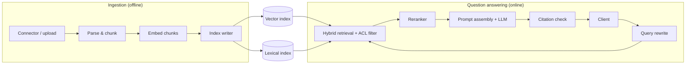

# ChatGPT Enterprise: RAG over Company Data

[English](README.md) · [中文](README.zh.md)

<!-- meta:begin -->
| Type | Priority | Difficulty | Roles | Topics | Format | Round |
| --- | --- | --- | --- | --- | --- | --- |
| ML system design | ★☆☆☆☆ | — | MLE · RE | rag, retrieval, access-control | 60 min | Onsite |
<!-- meta:end -->

## Problem

Design the retrieval-augmented generation (RAG) system behind an enterprise chat assistant. Each
enterprise customer (a *tenant*) connects its internal data — either by uploading files directly or by
linking a source system (a wiki, a ticketing system, a chat archive, ...) through a connector that keeps
a copy in sync — and every employee at that company can then ask the assistant questions in a chat
interface. Every answer must be grounded in the connected documents, must carry citations to the
specific passages it draws on, and must only draw on documents the asking user is allowed to see in the
source system. A single tenant's documents, retrieval results, and conversations must never be visible
to another tenant. Conversations are multi-turn: a follow-up question can refer back to earlier turns in
the same session.

Scale for this design:

- 3,000 tenants, averaging 10,000 documents each — 30,000,000 documents in total.
- Documents average 1,200 tokens (roughly 3-4 pages); some are much shorter (chat threads, tickets) and
  some much longer (contracts, design docs).
- 3,000,000 questions per day across all tenants (about 1,000 per tenant per day on average), with usage
  concentrated in each tenant's business hours.
- A newly uploaded or edited document must become searchable within 5 minutes; a deleted document, or
  one whose permissions were just narrowed, must stop being retrievable within the same 5 minutes.
- Target latency for an answer: time to the first generated token under 800 ms at the median and under
  1.8 s at the 95th percentile.

In scope: the ingestion pipeline (parsing, chunking, embedding, indexing) for documents arriving through
connectors or direct upload; the retrieval, ranking and generation path that turns a question into a
cited answer; multi-turn session handling; per-document access control enforcement; multi-tenant
isolation; citation tracking; and an evaluation plan for retrieval and answer quality. Out of scope:
training or serving the underlying language model itself — assume it is available as a hosted completion
API with given latency and throughput characteristics; the identity provider (assume a directory service
can be asked, for a given user, which groups and documents they can see); OCR and format-specific parsing
for exotic file types; the chat UI.

Produce:

1. Requirements and a scale estimate: chunk count, vector index memory, write throughput, query QPS.
2. A data model (documents, chunks, sessions, messages) and 3-5 core APIs.
3. An architecture diagram that separates the offline ingestion pipeline from the online
   question-answering path, and a walk-through of one question along that path.
4. Deep dives into: tenant isolation and permissions; retrieval quality (hybrid retrieval and
   reranking); and the trustworthiness and evaluation of answers. For each, compare at least two
   alternatives, say which you would pick, and state the cost of that choice.

## Reference solution

<details>
<summary>Show the reference solution</summary>

Two points worth confirming before designing: whether a connector always exposes an explicit
per-document ACL or sometimes only an opaque permission object that has to be resolved by calling back
into the source system, and whether non-text records (spreadsheets, images) are in scope. The design
below assumes an explicit ACL is available per document and focuses on text documents; a different
record type only changes the parser stage.

### Requirements and scale

**Chunk count.** $D = 3\times10^7$ documents averaging 1,200 tokens, chunked at 300 tokens with 15%
overlap (a 255-token step), give $k = \lceil 1200 / 255 \rceil = 5$ chunks per document, so

$$C = D \cdot k = 1.5\times10^8 \text{ chunks.}$$

**Vector index memory.** At embedding dimension $d = 1024$ and float16 storage ($b = 2$ bytes), the raw
vectors cost $C \cdot d \cdot b \approx 286$ GiB. An HNSW graph with $M_0 = 32$ neighbours at the base
layer, 4 bytes per neighbour id, and about 30% more for the upper layers, adds roughly
$C \cdot M_0 \cdot 4 \cdot 1.3 \approx 23$ GiB, for $\approx 309$ GiB total. Quantizing the vectors to int8
halves their cost to $\approx 143$ GiB ($\approx 166$ GiB with the graph), at a small recall loss that the
parallel lexical retrieval below partly offsets — int8 is the default here, with float16 kept for any
tenant whose evaluation numbers need it. Budgeting 24 GiB of index memory per node needs
$\lceil 166 / 24 \rceil = 7$ shards; with 2x replication for availability and read throughput, 14 nodes
serve the vector index (26 nodes without quantization).

**Write throughput.** Taking 1.5% of documents as newly added or edited per day,
$0.015 \times 3\times10^7 \times 5 \approx 2.25\times10^6$ chunks/day need (re)parsing, (re)embedding and
(re)indexing — about 26 chunks/sec on average, comfortably inside one batched embedding replica. The
5-minute freshness target is therefore set by how quickly a change reaches the pipeline, not by raw
throughput. A brand-new tenant's initial backfill runs through a separate, autoscaled batch pool so it
never competes with everyone else's incremental stream for that freshness budget.

**Query QPS.** $3\times10^6$ questions/day average to about 35 QPS. Enterprise usage concentrates in
business hours; with tenants spread across time zones smoothing the peak somewhat, a 6x peak-to-average
ratio gives about 208 QPS, the number retrieval, reranking and the generation endpoint must be
provisioned for.

### Data model and API

**Document** — `doc_id`, `tenant_id`, `source_type`, `external_id` (the source system's id, used to match
a connector's updates and deletes), `title`, `version`, `content_hash` (skip re-ingesting unchanged
content), `acl` (`{mode: "principals" | "public_to_tenant", principals}`), `status`
(`pending | indexed | deleted`), `updated_at`.

**Chunk** — `chunk_id`, `doc_id`, `tenant_id` (denormalized for single-field filtering), `doc_version`
(an edit's old chunks stop being served the moment the new version is indexed, even before the old ones
are physically removed), `ordinal`, `text`, `token_count`, `locator`
(`{page, section, char_start, char_end}`, used to build the citation), `acl_version` (a pointer to the
current ACL record, not a copy of the principal list).

**Session** — `session_id`, `tenant_id`, `user_id`, `created_at`, `last_active_at`.

**Message** — `message_id`, `session_id`, `role` (`user | assistant`), `text`, `created_at`, `citations`
(`[{marker, chunk_id, doc_id, doc_version}]`), `retrieved_chunk_ids` (every candidate that was retrieved,
not just cited — kept for evaluation), `model_version`.

Core APIs:

1. `POST /tenants/{tenant_id}/documents` — a connector or the upload flow pushes one new or changed
   document. Body: `{external_id, source_type, title, content_uri, acl, updated_at}` (large content is
   passed by reference, not inline). Returns `{doc_id, version, status}`.
2. `DELETE /tenants/{tenant_id}/documents/{doc_id}` — tombstones a document; its chunks stop being
   retrievable immediately and are physically removed from the index within the freshness window.
   Returns `{status: "tombstoned", effective_at}`.
3. `POST /tenants/{tenant_id}/sessions/{session_id}/messages` — ask a question. Body:
   `{user_id, text}`. Response: a streamed answer plus `{citations}` once generation finishes; creates
   the session if it does not exist yet.
4. `GET /tenants/{tenant_id}/sessions/{session_id}` — the message history of a session, for resuming a
   conversation or rendering past citations.
5. `POST /tenants/{tenant_id}/retrieve` — retrieval only, no generation: `{user_id, query, top_k}` →
   `{chunks: [{chunk_id, doc_id, score, snippet}]}`. Used by the evaluation harness and by support
   tooling, without re-running generation.

### Architecture



A question posted to a session first goes through query rewrite, which folds in the last few turns to
resolve references ("the same policy") before anything is retrieved. The rewritten query, together with
the caller's tenant id and permissions, goes to hybrid retrieval, which searches the vector index and the
lexical index in parallel — both pre-filtered to eligible chunks — and fuses the two ranked lists. The
reranker scores the top of that pool more precisely and keeps only as many chunks as the generator's
context budget allows. The generator assembles a prompt from the system instructions, the recent turns
and the numbered chunks, and streams a completion; if the reranked scores are too weak, it skips
generation and returns a fixed refusal instead. The answer is streamed, so the citation check works on the
stream: a citation marker is forwarded to the client only if it refers to a chunk that was actually placed
in the prompt.

### Deep dives

**Tenant isolation and permissions.** A fully separate index per tenant wastes capacity on the many small
tenants (average $5\times10^4$ chunks) and doubles the shard count to operate; a single index shared by
everyone and filtered by `tenant_id` turns one very large tenant into a noisy neighbour for its
shard-mates. The middle ground: hash tenants onto shards by `tenant_id`, and give any tenant above
roughly $5\times10^5$ chunks (about 10x average) its own dedicated shard — the long tail shares capacity
efficiently, the few large tenants stay isolated.

Permission filtering must run before ranking, not after: an ANN search returns the top-$k$ of the whole
shard, and post-filtering by permission can leave far fewer than $k$ eligible results even when enough
relevant ones exist deeper in the index — a real recall loss, and a place where an ineligible chunk's
text can reach a log before it is filtered out. The search is instead restricted to eligible nodes
directly (a filtered graph traversal, a standard mode of a graph-based ANN index), scoped by `tenant_id`
then the caller's principals, over-fetching 3-5x the final $k$ when the eligible set is small; a
permission group visible to only a few users can still leave too few graph edges connecting that subset,
since the graph was built for the whole tenant — such narrow-audience sets get a small dedicated
secondary index instead.

A permission change or delete cannot wait for that coarse filter, whose copy of the ACL can be briefly
stale: each chunk carries an `acl_version` pointer, and retrieval does a second, authoritative
point-check (a batched, sub-millisecond key-value lookup) before reranking. A delete tombstones the
document in that store immediately, so the point-check drops it everywhere at once, while physical
removal from the ANN graph happens asynchronously within the 5-minute window. Cost: a larger over-fetch,
one extra lookup per request, and dedicated shards/indexes to operate — accepted because a leak or an
empty result set is worse.

**Retrieval quality: hybrid retrieval and reranking.** Dense retrieval is strong on semantic similarity
but weak on exact tokens (an acronym, a part number); sparse (BM25) retrieval is the reverse. Both are
cheap enough to run on every query, in parallel, over the same ACL-filtered chunk set.

Cosine and BM25 scores sit on incomparable scales, and a mixing weight tuned for one tenant does not
transfer to the next, so fusion uses reciprocal rank fusion: only each list's rank,
$\text{score}(x) = \sum_r 1/(k_0 + \text{rank}_r(x))$ with $k_0 \approx 60$ damping low ranks — no
per-tenant calibration, at the cost of a cruder combination than a properly tuned weighted sum.

Fusion narrows the pool to about 150 candidates, which a reranker scores further, in one of three ways:

- *Pointwise* scores each (query, chunk) pair independently with a cross-encoder trained with an ordinary
  classification loss; $n$ batchable forward passes fit a 150-250 ms budget at $n \approx 150$.
- *Pairwise* trains on which of two chunks is more relevant — easier to label than an absolute score —
  but scoring every pair is $O(n^2)$; the practical version (LambdaMART/LambdaRank) keeps $O(n)$
  pointwise-style inference while training with pairwise gradients reweighted toward nDCG.
- *Listwise* scores the whole list in one pass (a listwise loss, or an LLM given the whole shortlist), the
  only one that can see and penalize redundancy across candidates, at the cost of bounding $n$ to roughly
  20-30 (not 150), no batching across candidates, and needing full graded rankings as training data.

Listwise reranking is therefore reserved for the pointwise shortlist (20-30 candidates), not the full 150
— too slow and wasted there — and earns its cost mainly when the top pointwise scores cluster within a
small margin.

The embedding model is trained with an in-batch contrastive loss (InfoNCE) over pairs mined from feedback
and synthetic queries; hard negatives — passages sharing vocabulary with the query without answering it —
matter far more for quality than the volume of easy random negatives.

**Answer trustworthiness and evaluation.** Grounding is enforced twice: the prompt restricts the model
to the numbered chunks given, requires a citation marker on every factual claim, and specifies a fixed
refusal when the chunks do not answer the question; before the prompt is even built, the orchestrator
checks the top reranked score against a per-tenant threshold and skips generation for a low score,
returning that same refusal — cheaper than asking the model to refuse on its own.

Citations are checked for two separate failures: reference integrity (does every marker point to a chunk
id actually in the prompt) is a membership check done synchronously; groundedness (does the cited chunk
actually support that sentence) needs a lightweight entailment classifier run after generation, with a
failing sentence logged and, above a per-tenant failure-rate threshold, shown as low-confidence or
dropped.

Offline evaluation splits by stage (recall@k and nDCG@k on retrieval; answer correctness and the
groundedness rate end-to-end) and by tenant cohort; online, thumbs up/down, the follow-up rate, and the
live groundedness failure rate are tracked continuously. Catching a regression means watching those
signals per cohort and per pipeline stage that last changed, plus re-running the offline suite nightly
rather than only at deploy time, with a threshold breach paging on-call.

### Follow-ups

- Semantic and embedding caches must be keyed by tenant id and by the asking user's permission set (or an
  ACL fingerprint), not just by query similarity, or a cached answer computed for one user's visible
  documents could be served to a different, less-privileged user asking the same words.
- Conversation history is bounded (a fixed number of recent turns or a token budget) and used only by the
  cheap query-rewrite step to resolve references before retrieval; concatenating raw history into the
  retrieval query itself tends to pull in stale context and dilute the query's meaning.
- Smaller chunks (150-200 tokens) retrieve more precisely and cost less prompt budget per citation but
  multiply the chunk count and can fragment context across a boundary; the 300-token choice here is
  itself a trade point, not a fixed rule.
- Swapping the embedding model needs re-embedding the whole corpus with the same throughput math as the
  initial backfill, and running the old and new vector indexes side by side so traffic cuts over per
  tenant cohort only once that cohort's offline eval numbers clear the new model.
- Retrieval plus reranking should be a small, fixed slice of the latency budget (well under 500 ms
  combined) so most of the time-to-first-token budget is left for the language model itself, which
  usually dominates perceived latency.

<details>
<summary>Estimate check (runnable)</summary>

```python
import math

tenants, avg_docs_per_tenant = 3_000, 10_000
D = tenants * avg_docs_per_tenant
assert D == 30_000_000

avg_doc_tokens, chunk_tokens, overlap = 1200, 300, 0.15
step = chunk_tokens * (1 - overlap)
k = math.ceil(avg_doc_tokens / step)
assert k == 5
C = D * k
assert C == 150_000_000
assert C / tenants == 50_000                       # average chunks per tenant

dim, GiB = 1024, 1024 ** 3
vec_fp16, vec_int8 = C * dim * 2, C * dim * 1       # float16 vs int8 storage
M0, neighbour_bytes, layer_factor = 32, 4, 1.3      # HNSW base-layer degree, id size, upper-layer slack
graph = C * M0 * neighbour_bytes * layer_factor

fp16_total_gib = (vec_fp16 + graph) / GiB
int8_total_gib = (vec_int8 + graph) / GiB
assert round(vec_int8 / GiB) == 143
assert round(graph / GiB) == 23
assert round(int8_total_gib) == 166
assert round(fp16_total_gib) == 309

shard_gib = 24
shards_int8 = math.ceil(int8_total_gib / shard_gib)
shards_fp16 = math.ceil(fp16_total_gib / shard_gib)
assert shards_int8 == 7 and shards_fp16 == 13
assert shards_int8 * 2 == 14                        # 2x replication

churn_rate = 0.015
avg_ingest_chunks_per_sec = (churn_rate * D * k) / 86_400
assert round(avg_ingest_chunks_per_sec) == 26

daily_queries, peak_factor = 3_000_000, 6
avg_qps = daily_queries / 86_400
peak_qps = avg_qps * peak_factor
assert round(avg_qps) == 35
assert round(peak_qps) == 208

print("all requirements-and-scale numbers check out")
```

</details>

</details>
