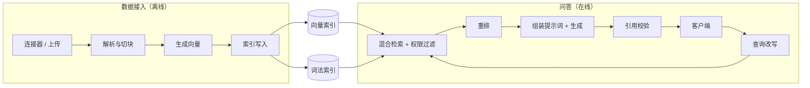

# ChatGPT Enterprise：基于企业数据的 RAG

[English](README.md) · [中文](README.zh.md)

<!-- meta:begin -->
| 题型 | 优先级 | 难度 | 岗位 | 考点 | 形式 | 轮次 |
| --- | --- | --- | --- | --- | --- | --- |
| ML 系统设计 | ★☆☆☆☆ | — | MLE · RE | rag, retrieval, access-control | 60 分钟 | 现场面 |
<!-- meta:end -->

## 题目

设计一个企业聊天助手背后的检索增强生成（RAG，retrieval-augmented generation）系统。每个企业客户（一个*租户*（tenant））接入自己的内部数据——可以直接上传文件，也可以通过连接器（connector）关联一个源系统（wiki、工单系统、聊天记录归档等），连接器会持续把数据同步过来——之后这家公司的每个员工都可以在聊天界面里向助手提问。每个回答都必须基于接入的文档，必须带上它所依据的具体段落的引用，并且只能使用提问者在源系统里本来就有权限看到的文档。一个租户的文档、检索结果和对话，任何时候都不能被另一个租户看到。对话是多轮的：后续问题可以指代同一个会话里更早的内容。

这次设计的规模：

- 3,000 个租户，平均每个租户 10,000 篇文档——总共 30,000,000 篇文档。
- 文档平均长度 1,200 个 token（大致相当于 3-4 页）；有的短得多（聊天串、工单），有的长得多（合同、设计文档）。
- 所有租户加起来每天 3,000,000 次提问（平均每个租户每天约 1,000 次），使用集中在各租户自己的工作时间内。
- 新上传或被编辑过的文档，必须在 5 分钟内变得可检索；被删除的文档，或权限刚被收紧的文档，必须在同样 5 分钟内不再可检索。
- 回答的延迟目标：首个生成 token 的时间，中位数低于 800 毫秒，第 95 百分位低于 1.8 秒。

范围内：文档通过连接器或直接上传进入系统后的接入流水线（解析、切块、生成向量、建索引）；把一个问题变成一个带引用的回答的检索、排序与生成路径；多轮会话的处理；按文档粒度的权限控制；多租户隔离；引用追踪；以及检索质量与回答质量的评测方案。范围外：底层语言模型本身的训练或推理服务——假设它已经作为一个具备给定延迟和吞吐特征的托管补全（completion）接口可用；身份提供方（假设可以向一个目录服务查询，对给定用户，他能看到哪些组和哪些文档）；针对特殊文件格式的 OCR 与专门解析；聊天界面本身。

要产出：

1. 需求与规模估算：chunk 总数、向量索引内存、写入吞吐、查询 QPS。
2. 数据模型（文档、chunk、会话、消息）与 3 到 5 个核心接口。
3. 一张架构图，把离线的接入流水线与在线的问答路径分开，并沿着一次提问把整条路径走一遍。
4. 深入讨论：租户隔离与权限；检索质量（混合检索与重排，reranking）；回答的可信度与评测。每个话题至少比较两种方案，说明选哪个、为什么，并给出这个选择的代价。

## 参考解答

<details>
<summary>展开参考解答</summary>

动手设计之前值得先确认两点：连接器是否总能给出显式的按文档权限列表（ACL），还是有时只能给出一个不透明的权限对象、需要回调源系统才能解析；非文本记录（表格、图片）是否在范围内。下面的设计假设每篇文档都能拿到显式 ACL，且只处理文本文档；换成别的记录类型，只需要换解析阶段。

### 需求与规模

**chunk 总数。** $D = 3\times10^7$ 篇文档，平均每篇 1,200 个 token，按 300 个 token 切块、重叠 15%（步长 255 个 token），每篇文档得到 $k = \lceil 1200 / 255 \rceil = 5$ 个 chunk，因此

$$C = D \cdot k = 1.5\times10^8 \text{ 个 chunk。}$$

**向量索引的内存。** 取向量维度 $d = 1024$、float16 存储（$b = 2$ 字节），原始向量占用 $C \cdot d \cdot b \approx 286$ GiB。HNSW 图在基础层每个节点有 $M_0 = 32$ 个邻居，每个邻居 id 占 4 字节，上层再多占约 30%，图本身约需 $C \cdot M_0 \cdot 4 \cdot 1.3 \approx 23$ GiB，合计约 309 GiB。把向量量化成 int8 能把向量部分的开销减半到约 143 GiB（连同图约 166 GiB），代价是一点召回损失，会被并行的词法检索部分抵消——这里默认用 int8，只有某个租户的评测数字确实需要时才用 float16。按每个节点 24 GiB 索引内存预算，需要 $\lceil 166 / 24 \rceil = 7$ 个分片；加上 2 倍副本用于可用性和读吞吐，共 14 个节点承载向量索引（不量化则是 26 个节点）。

**写入吞吐。** 假设每天有 1.5% 的文档新增或被编辑，$0.015 \times 3\times10^7 \times 5 \approx 2.25\times10^6$ 个 chunk/天需要重新解析、生成向量并重新索引——平均约 26 个 chunk/秒，远低于单个批处理向量化副本的吞吐能力。因此 5 分钟的时效性目标取决于变更进入流水线的速度，而不是原始吞吐。全新租户首次接入走单独的自动扩缩批处理池，不占用其他租户的时效性预算。

**查询 QPS。** 每天 $3\times10^6$ 次提问，平均约 35 QPS。使用集中在各自工作时间；租户分布在不同时区使峰值有所平滑，按 6 倍峰均比估算，峰值约 208 QPS，是检索、重排和生成服务要按此配置容量的数字。

### 数据模型与 API

**Document（文档）**——`doc_id`、`tenant_id`、`source_type`、`external_id`（源系统里的 id，用于匹配连接器的更新和删除）、`title`、`version`、`content_hash`（内容未变时跳过重新接入）、`acl`（`{mode: "principals" | "public_to_tenant", principals}`）、`status`（`pending | indexed | deleted`）、`updated_at`。

**Chunk**——`chunk_id`、`doc_id`、`tenant_id`（冗余一份，便于单字段过滤）、`doc_version`（新版本一旦索引，旧版本 chunk 立即停止返回，即使物理删除还没发生）、`ordinal`、`text`、`token_count`、`locator`（`{page, section, char_start, char_end}`，用来生成引用）、`acl_version`（指向当前 ACL 记录的指针，而非权限主体列表的拷贝）。

**Session（会话）**——`session_id`、`tenant_id`、`user_id`、`created_at`、`last_active_at`。

**Message（消息）**——`message_id`、`session_id`、`role`（`user | assistant`）、`text`、`created_at`、`citations`（`[{marker, chunk_id, doc_id, doc_version}]`）、`retrieved_chunk_ids`（本次检索到的全部候选，不只是被引用的那些——留给评测用）、`model_version`。

核心接口：

1. `POST /tenants/{tenant_id}/documents`——连接器或上传流程推送一篇新的或有变化的文档。请求体：`{external_id, source_type, title, content_uri, acl, updated_at}`（大内容以引用方式传递，不内联）。返回 `{doc_id, version, status}`。
2. `DELETE /tenants/{tenant_id}/documents/{doc_id}`——给文档打删除标记（tombstone）；它的 chunk 立刻停止可被检索，并在时效性窗口内从索引中被物理移除。返回 `{status: "tombstoned", effective_at}`。
3. `POST /tenants/{tenant_id}/sessions/{session_id}/messages`——提问。请求体：`{user_id, text}`。响应：流式返回的回答，生成结束后附带 `{citations}`；会话不存在时会被自动创建。
4. `GET /tenants/{tenant_id}/sessions/{session_id}`——某个会话的消息历史，用于继续对话或展示之前的引用。
5. `POST /tenants/{tenant_id}/retrieve`——只做检索、不生成：`{user_id, query, top_k}` → `{chunks: [{chunk_id, doc_id, score, snippet}]}`。供评测系统和支持团队调试用，无需重新生成。

### 架构



一个问题被发到某个会话后，先经过查询改写：把最近几轮对话折叠进来，把“同一份政策”这类指代解析成明确的说法，然后才进入检索。改写后的查询连同调用方的租户 id 和权限，一起交给混合检索：并行搜索向量索引和词法索引——两者都预先按可访问的 chunk 过滤过——再把两份排序结果融合成一个候选池。重排器对这个候选池靠前的部分打更精细的分，只保留生成器上下文预算能容纳的那么多 chunk。生成器把系统指令、最近几轮对话和编号后的 chunk 组装成提示词，流式调用模型生成；如果重排后的分数都偏低，就跳过生成，直接返回一个固定的拒答。回答是流式返回的，所以引用校验直接作用在输出流上：一个引用标记只有指向确实被放进提示词里的 chunk，才会被转发给客户端。

### 深入话题

**租户隔离与权限。** 每租户一份独立索引会在大量小租户身上浪费容量（平均每租户 $5\times10^4$ 个 chunk），也让分片数翻倍；所有租户共用一份索引、只靠 `tenant_id` 过滤，又会让个别超大租户拖慢同一分片上的其他租户（noisy neighbour）。这里的折中：按 `tenant_id` 一致性哈希分片，chunk 数超过约 $5\times10^5$（约 10 倍均值）的租户单独占用专属分片，长尾小租户共享容量，少数大租户被隔离。

权限过滤必须发生在排序之前。如果先对整个分片做 ANN 搜索取 top-$k$、再按权限筛选，提问者可见的结果可能远少于 $k$ 个，即使索引深处还有足够多相关的结果；这是实实在在的召回损失，而且无权限的文本在被筛掉之前已经可能写进日志。做法是让图索引在遍历时只接受 `tenant_id` 和权限主体都匹配的节点（带过滤的图遍历，是图式 ANN 索引的标准用法）；可见子集较小时，把候选数放大到最终 $k$ 的 3-5 倍。只有极少数人可见的权限组（例如 5 个人可见的法务文件夹）在为整个租户建的图上连边太少，为它们另建一个小的二级索引。

索引里的 ACL 只是一份拷贝，可能短暂过期，所以权限收紧和删除不能只靠上面的过滤。每个 chunk 带一个 `acl_version` 指针；重排之前，再拿候选到权威的权限存储里批量核对一次（一次亚毫秒级的键值查询）。删除先在这个存储里打标记，核对这一步随即把它从所有结果里去掉；从 ANN 图里物理移除则异步进行，在 5 分钟的窗口内完成。代价：更大的过采样、每个请求多一次查询、还要运维专属分片和二级索引；但一次权限泄露或一次空结果的代价更大。

**检索质量：混合检索与重排。** 稠密检索擅长语义相似，但对缩写、编号这类精确 token 不敏感；稀疏（BM25）检索相反。两者都够便宜，对每个查询并行跑一遍，在同一份按权限过滤的 chunk 集合上进行。

余弦分数和 BM25 分数量纲不可比，按租户调好的混合权重也难迁移，所以用倒数排名融合（reciprocal rank fusion）：只用名次，$\text{score}(x) = \sum_r 1/(k_0 + \text{rank}_r(x))$，$k_0 \approx 60$ 压低靠后名次——不用按租户标定，代价是比标定好的加权和更粗糙。

融合后候选池约 150 个，交给重排器细分，三种做法：

- *Pointwise* 用交叉编码器独立给每对 (query, chunk) 打分，classification 损失训练；$n$ 次可批处理的前向计算，$n\approx150$ 时轻松落进 150-250 毫秒预算。
- *Pairwise* 学的是“两个 chunk 哪个更相关”，这比给出绝对分数更容易标注；逐对打分是 $O(n^2)$，实际做法（LambdaMART/LambdaRank）推理仍是 $O(n)$ 逐点打分，训练用重加权成对梯度对齐 nDCG。
- *Listwise* 一次性对整个列表打分（列表级损失，或让 LLM 给出完整排序），唯一能看到并惩罚候选间冗余的做法，代价是列表要塞进一次前向计算（$n$ 限制在 20-30，而非 150），不能批处理，训练数据要完整分级排序。

因此列表级重排只用于逐点之后的 20-30 个候选，而不是完整 150 个——放在那里太慢也是浪费；主要用在逐点分数彼此接近、顺序和冗余比单个分数更重要的时候。

嵌入模型用批内对比损失（InfoNCE）训练，正样本对从用户反馈和合成查询里挖掘；难负例——与查询共享词汇却答非所问的段落——对质量的影响远大于随机负例的数量。

**回答的可信度与评测。** 依据约束在两处生效：提示词要求模型只用给定的编号 chunk 作答、每条事实带引用标记、在 chunk 答不了时给出固定拒答；生成之前编排层还会把重排最高分和按租户设定的阈值比较，分数太低直接跳过生成——比让模型自己拒答更省时，也不受模型不听指令影响。

引用检查两类问题：引用完整性（标记是否指向提示词里确实存在的 chunk id）是同步的成员检查；有据性（groundedness：引用的 chunk 是否真支撑这句话，而不只是话题相关）靠生成后的轻量蕴含（entailment）分类器检查，失败的句子记录下来，超过租户阈值就标为低置信度或直接删掉。

离线评测按阶段拆分（检索用 recall@k、nDCG@k，端到端用正确性和有据率），按租户分组；线上跟踪点赞/点踩、追问率、有据性失败率。发现退化靠按租户和改动阶段看信号，加上每晚重跑离线评测集而不只在发布时跑，超过阈值直接呼叫 on-call。

### 追问

- 语义缓存和向量缓存的 key 必须同时包含租户 id 和提问用户的权限集合（或者一个 ACL 指纹），不能只按查询的语义相似度来——否则给一个用户算出来的缓存回答，可能会被同样这句话、但权限更低的另一个用户拿到。
- 对话历史要有上限（固定轮数或 token 预算），只用在便宜的查询改写这一步去解析指代，再进入检索；把原始历史直接拼进检索查询本身，容易带进过时的上下文，稀释查询的含义。
- 更小的 chunk（150-200 个 token）检索更精确、引用占用的提示词预算更少，但会让 chunk 数量倍增，还可能切断上下文；这里选的 300 个 token 本身就是一个取舍点，不是固定规则。
- 更换 embedding 模型，需要用和首次接入相同的吞吐量把整个语料重新生成一遍向量，并让新旧两套向量索引并存，等某个租户分组的离线评测数字达标后才把流量切过去。
- 延迟预算里，检索加重排应该只占一小块、固定的份额（加起来远低于 500 毫秒），把首个生成 token 的时间预算大部分留给语言模型本身，因为它通常才是感知延迟里的大头。

<details>
<summary>估算核对（可运行）</summary>

```python
import math

tenants, avg_docs_per_tenant = 3_000, 10_000
D = tenants * avg_docs_per_tenant
assert D == 30_000_000

avg_doc_tokens, chunk_tokens, overlap = 1200, 300, 0.15
step = chunk_tokens * (1 - overlap)
k = math.ceil(avg_doc_tokens / step)
assert k == 5
C = D * k
assert C == 150_000_000
assert C / tenants == 50_000                       # average chunks per tenant

dim, GiB = 1024, 1024 ** 3
vec_fp16, vec_int8 = C * dim * 2, C * dim * 1       # float16 vs int8 storage
M0, neighbour_bytes, layer_factor = 32, 4, 1.3      # HNSW base-layer degree, id size, upper-layer slack
graph = C * M0 * neighbour_bytes * layer_factor

fp16_total_gib = (vec_fp16 + graph) / GiB
int8_total_gib = (vec_int8 + graph) / GiB
assert round(vec_int8 / GiB) == 143
assert round(graph / GiB) == 23
assert round(int8_total_gib) == 166
assert round(fp16_total_gib) == 309

shard_gib = 24
shards_int8 = math.ceil(int8_total_gib / shard_gib)
shards_fp16 = math.ceil(fp16_total_gib / shard_gib)
assert shards_int8 == 7 and shards_fp16 == 13
assert shards_int8 * 2 == 14                        # 2x replication

churn_rate = 0.015
avg_ingest_chunks_per_sec = (churn_rate * D * k) / 86_400
assert round(avg_ingest_chunks_per_sec) == 26

daily_queries, peak_factor = 3_000_000, 6
avg_qps = daily_queries / 86_400
peak_qps = avg_qps * peak_factor
assert round(avg_qps) == 35
assert round(peak_qps) == 208

print("all requirements-and-scale numbers check out")
```

</details>

</details>
