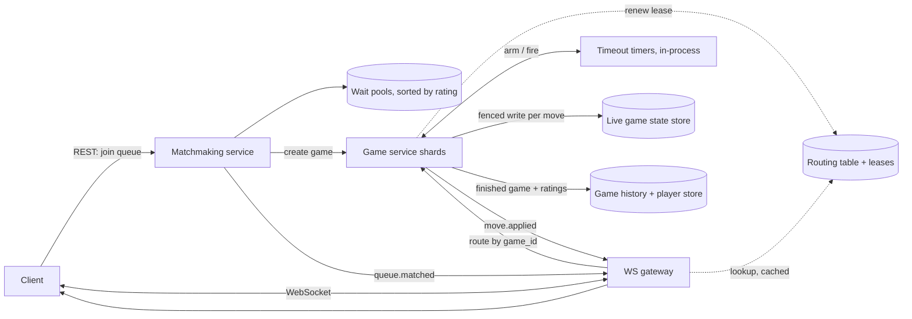

# Online Chess Platform (Chess.com-style)

[English](README.md) · [中文](README.zh.md)

<!-- meta:begin -->
| Type | Priority | Difficulty | Roles | Topics | Round |
| --- | --- | --- | --- | --- | --- |
| System design | ★★★★★ | — | SWE · Infra Eng | websocket, matchmaking, game-state, idempotency, consistent-hashing | Phone screen · Onsite |
<!-- meta:end -->

## Problem

Design the real-time backend for a one-on-one online chess platform. A registered player joins a queue
for a time control (for example, 5 minutes with a 3-second increment added after each move) and a mode
(rated or casual); the system pairs them with an opponent of comparable rating and starts a game. Once a
game starts, both players submit moves over a persistent connection and must see the opponent's move
appear almost immediately. Each player has an individual chess clock, and the server is the sole
authority over both clocks: a player's on-screen timer is only a display and is never trusted to decide
when time has run out. A dropped connection never pauses a game: the clock of the side to move keeps
running whether or not either player is connected, and a player who reconnects must resume from the
exact current position and the exact current clock reading. A finished game's full move history is
recorded permanently, and both players' ratings are updated.

Scale this design for:

- 5,000,000 players play at least one game on a typical day.
- At peak, 300,000 players are online at once (6% of daily players), which puts 150,000 games in
  progress simultaneously.
- An average game lasts about 8 minutes and runs about 80 moves in total, 40 by each side (a "move" here
  is one player's turn — chess notation calls this a *ply*).
- Target match wait time: 95th percentile under 4 seconds.
- Target move relay latency, from one player submitting a move to the opponent's screen showing it: 95th
  percentile under 120 ms.
- Target clock-timeout detection: the server must declare a timeout within 50 ms of the instant a
  player's remaining time actually reaches zero.
- Target availability: 99.9%.
- Correctness requirement: no move the server has acknowledged is ever lost, and no move is applied
  twice or accepted out of turn, even when a client retries a request or reconnects mid-game.

In scope: joining a queue and matchmaking by rating; validating, applying, and relaying moves for a
single game in real time; the server-authoritative clock and timeout detection; resigning and
offering/accepting a draw; handling disconnects and reconnects; and persisting a finished game's move
history while updating both players' ratings. Out of scope: spectating an in-progress game, tournaments,
a computer opponent, cheat or engine-assistance detection, chat, and the rating formula itself — assume a
rating-update function that takes two ratings and a game result and returns the two updated ratings is
available as a library call.

Produce:

1. Requirements and a scale estimate: the peak rate of moves relayed per second, the number of concurrent
   WebSocket connections and how many connection-serving instances that requires (state your assumption
   for how many connections one instance can hold), and the daily storage growth from persisting move
   history.
2. A data model (players, games, move records, queue entries) and the APIs, with the REST endpoints and
   the WebSocket messages listed separately.
3. An architecture diagram, and a walk-through of one move from the moment a player submits it to the
   moment the opponent's client shows it.
4. Deep dives into: the server-authoritative clock; keeping moves consistent and routed correctly within
   a single game; and matchmaking.

## Reference solution

<details>
<summary>Show the reference solution</summary>

Worth confirming before designing: whether casual games get the same move-relay and clock guarantees as
rated ones (assumed yes below — only the rating update is skipped), and whether time controls are a small
fixed catalog (bullet/blitz/rapid) rather than a value typed in freely (assumed fixed, since a
matchmaking pool has to be finite to search).

### Requirements and scale

**Peak concurrency.** 300,000 online players means 150,000 concurrent games. At 80 moves over an
8-minute (480 s) game, the average gap between moves in a given game is $480/80 = 6\text{ s}$, so peak
move rate across all games is $150{,}000/6 = 25{,}000$ moves/s. Each accepted move goes to two sockets
(an ack to the mover, an update to the opponent), so peak WebSocket traffic for moves is $50{,}000$
messages/s; at roughly 150 bytes each that is only $\approx 7.5$ MB/s aggregate — bandwidth is not the
bottleneck; connection count and per-move CPU are.

**Connection-serving fleet.** Every online player — mid-game, queued, or idle — holds one persistent
WebSocket connection. Budgeting 20,000 connections per gateway instance (bounded by per-connection
buffers and fan-out cost, not raw memory) needs $\lceil 300{,}000/20{,}000\rceil = 15$ instances at bare
peak; 17 with two extra for rolling deploys and failover.

**Game-service fleet.** Each game must live in one process's memory so move validation and clock math
for that game never race across machines. Budgeting 5,000 games per instance (bounded by per-game CPU
and one open timeout timer per game) needs $\lceil 150{,}000/5{,}000\rceil = 30$ instances bare, 32 with
the same margin.

**Move-history storage.** A persisted move entry (ply, the move, both players' remaining time after it,
the server's receive timestamp, the idempotency key) is about 80 bytes; the board position (FEN) is kept
once on the game's row, not per move, so a game's move log is about $80 \times 80\text{ B} = 6.4$ KB.
Games in progress average about a third of the peak figure across a day (a 3x peak-to-average ratio is
reasonable for a global player base), so by Little's law (arrival rate = number in the system / time in
the system) new games start at $50{,}000 / 480\text{ s} \approx 104$/s, about 9,000,000 finished
games/day — daily growth of $9\times10^6 \times 6.4\text{ KB} \approx 57.6$ GB, about 21 TB/year before
replication. The history store takes one write per finished game, so one well-sharded relational
cluster is enough.

**Matchmaking queue.** At peak, $150{,}000 / 480 \approx 312$ games start per second, so about 625
players join the queue each second. With a mean wait of at most about 2 s (the p95 target is 4 s),
Little's law puts only $625 \times 2 = 1{,}250$ entries in the queue at once, spread across every
(time control, mode) pool.

### Data model and API

**Player** — `player_id`, `username`, `rating_bullet`, `rating_blitz`, `rating_rapid` (one rating per
time-control category), `created_at`.

**QueueEntry** — `entry_id`, `player_id`, `mode` (`rated`/`casual`), `time_control`
(`{base_s, increment_s}`), `rating_snapshot`, `joined_at`, `status`
(`waiting`/`matched`/`cancelled`/`expired`), `matched_game_id`.

**Game** — `game_id`, `white_player_id`, `black_player_id`, `mode`, `time_control`, `status`, `result`
(`white`/`black`/`draw`, null while active), `result_reason`
(`checkmate`/`resignation`/`timeout`/`draw_agreement`/`abandonment`), `current_fen` (the position as a
one-line FEN string, kept as a read cache), `ply` (next move number expected), `turn`,
`white_remaining_ms`, `black_remaining_ms`, `turn_started_at_ms` (server time the side to move's turn
began), `version` (bumped on every accepted move, resignation, draw, or timeout), `owner_epoch`
(fencing token, bumped each time the game is reassigned to a new owner), `started_at`, `ended_at`.

**MoveRecord** (append-only) — `game_id`, `ply`, `player_id`, `uci` (e.g. `g1f3`), `client_move_id`
(client-generated idempotency key), `white_remaining_ms_after`, `black_remaining_ms_after`,
`server_received_at_ms`, `version_after`.

REST, for anything that is not latency-critical:

1. `POST /v1/matchmaking/queue` — `{mode, time_control}` → `{entry_id, status}`.
2. `DELETE /v1/matchmaking/queue/{entry_id}` — leave the queue.
3. `GET /v1/games/{game_id}` — current snapshot (`current_fen`, clocks, `version`, `status`), for a client
   before its WebSocket connects, or for post-game review.
4. `GET /v1/games/{game_id}/moves` — the full move history.

WebSocket, for everything inside an active game:

- Client → server: `move {game_id, ply, uci, client_move_id}`, `resign {game_id}`,
  `draw_offer {game_id}`, `draw_response {game_id, accept}`, `reconnect {game_id, last_seen_version}`.
- Server → client: `queue.matched {game_id, color, opponent, time_control}`,
  `move.applied {game_id, version, ply, uci, current_fen, turn, white_remaining_ms, black_remaining_ms,
  server_now_ms}`, `move.rejected {game_id, expected_ply, reason}`, `clock.sync {game_id, version,
  white_remaining_ms, black_remaining_ms, server_now_ms}` (right after a reconnect),
  `moves.backfill {game_id, moves, from_version, to_version}` (on reconnect, to replay anything missed),
  `game.ended {game_id, result, result_reason, final_version}`.

### Architecture



Walk-through of one move: the client sends `move` to its gateway, which looks up the game's owner in its
cached copy of the routing table and forwards the message without checking any chess rules. The owner
stamps the move with its own receive time as it enters the game's event queue. When the move reaches the
head of that queue, the owner first recognizes a retry by its `client_move_id`, then checks the turn and
`ply`, and validates legality with an existing chess-rules library (en passant, castling and repetition
are where hand-written validators go wrong). It then computes the new clock reading, writes the new game
state together with the appended `MoveRecord` to the live-state store in one fenced write, re-arms the
timeout timer for the new side to move, and pushes `move.applied` through the gateways to both sockets;
a rejected move gets `move.rejected` back to the sender only.

### Deep dives

**The server-authoritative clock.** Two designs: tick every second, decrementing the running clock and
writing or broadcasting each tick; or recompute the clock only on the two events that can change it — a
move being accepted, or nobody moving until time runs out. Ticking means 150,000 writes/s (every
concurrent game, once a second), six times the move rate, for a value nobody reads between events, so
the design below is event-based.

On a move stamped $t_{\text{recv}}$, with $r$ the mover's remaining time and $t_{\text{turn}}$
(`turn_started_at_ms`) the start of the turn, the mover's new remaining time is

$$r' = r - (t_{\text{recv}} - t_{\text{turn}}) + \text{inc}, \quad \text{only if } r - (t_{\text{recv}} - t_{\text{turn}}) > 0$$

so the increment is added after a completed move (a Fischer increment). If the difference is not
positive, the move is rejected and the mover loses on time — a move that arrives after the flag fell
cannot save the game. Then $t_{\text{turn}} := t_{\text{recv}}$, `turn` switches, `version` increments,
and the client's on-screen timer just counts down from the readings in the latest `move.applied` or
`clock.sync`. No clock runs before a side's first move; instead that move has a fixed deadline (say
20 s), and missing it aborts the game with no result.

Timeout with no move: after every accepted move the owner arms one in-process timer for the new side to
move at its deadline $t_{\text{turn}} + r$, cancelling the previous one. A game's moves and timer
firings go through one per-game event queue processed one event at a time, and $t_{\text{recv}}$ is taken
when a move enters that queue. A firing carries the `version` captured when it was armed and declares
the timeout only if `version` is unchanged: cancelling fails when the firing is already queued behind a
move, and the check turns that stale firing into a no-op. A firing enters the queue no earlier than the
deadline, so a move stamped before the deadline is always processed first; the outcome depends only on
the move's stamp versus the deadline, not on which event happens to run first. Stamping at the gateway
would break this, since a move stamped in time could still reach the queue after the firing.

Latency compensation (optional): the charged time includes one round trip of the mover's connection
(the opponent's move going out, the reply coming back). Crediting back the round-trip time the server
itself measures on that socket, at most e.g. 100 ms per move and never more than the time charged,
removes most of this bias; the cap also
bounds what a client gains by delaying its pong replies to inflate the measurement. Without it, a player
on a 100 ms connection loses about 4 s over 40 moves, a lot in a one-minute game and little at 5+3, so
turn it on for bullet only. The 50 ms detection target is measured on the server's clock and is
unaffected.

**Move consistency and routing within a game.** Two ways to route a game's messages to the process owning
its state: pure consistent hashing on `game_id`, every gateway computing the owner from a shared ring;
or an explicit routing table (`game_id` → current owner) that gateways look up and cache. Both are used,
for different jobs: the ring (with virtual nodes) only computes placement — where a new game goes, and
where a dead instance's games go, spread over all survivors — and the table records the result. A game
changes owner only when its owner dies, so resizing the fleet moves no game in progress; with the ring
alone, every membership change would remap games mid-play, and gateways that saw the change at
different moments would send one game's moves to two instances.

Neither structure rules out two owners by itself: a gateway's cached entry can be stale, and an instance
declared dead may only have paused (a long GC pause, a network partition) and then resume. So ownership
is a lease: each instance renews one lease covering all its games every second, with a 5 s time-to-live,
and stops accepting moves as soon as a renewal fails; a controller reassigns an instance's games only
after its lease has expired, bumping each game's `owner_epoch`. Every live-state write is conditional on
the writer's `owner_epoch` and the expected `version`, so a stale owner's write fails and it drops the
game, and a gateway told `not_owner` refreshes its entry and retries.

Exactly-once, in-order moves: a move whose `client_move_id` is already recorded is a retry and gets the
recorded result back, so a client that lost only the acknowledgment sees the game continue, not an
error. Any other move must come from the side to move with `ply` equal to the game's current `ply` — an
optimistic-concurrency check that rejects a stale or out-of-turn move before it mutates anything. The
order matters: checking `ply` first would reject the retry of a move that was in fact applied.

Recovery when an instance dies: a move is acknowledged only after its fenced write (the new game state
plus the appended `MoveRecord`) is on a majority of the live-state store's replicas — a few milliseconds
inside one region, small next to the two client legs of the 120 ms budget. So no acknowledged move is
lost, and a move written but not yet acknowledged when the owner crashed is found by its
`client_move_id` when the client retries, so it is not applied twice. A live game's entry is never
evicted. The new owner loads the game from live state and re-arms the timer of the side to move. The
failover gap, when no move could be accepted, is not charged: the side to move is charged only up to the
old owner's last lease renewal (nothing if the turn began after it), and $t_{\text{turn}}$ restarts at
the takeover. When the game ends, the owner writes the move list, the result and both new ratings to the
history store in one transaction that first inserts the finished game's row and does nothing if that row
already exists, so a retry after a crash never applies a rating change twice; only then is the live
entry deleted.

Reconnect: a client sends `reconnect {game_id, last_seen_version}` once its socket is back up; the
gateway routes it through the table, which may now point elsewhere, and the owner records that gateway
as the player's new delivery address. The owner replies with `moves.backfill` — every `MoveRecord`
whose `version_after` exceeds `last_seen_version`, taken from the live game, since the history store
only receives finished games — plus a `clock.sync` computed at the current server time; the client then
resends its unacknowledged move, if any, with the original `client_move_id`.

**Matchmaking.** Each (time control, mode) pair has its own pool of waiting players. A pool can use fixed
rating buckets, a search scanning every bucket that overlaps the ±Δ window and filtering (searching only
the player's own bucket would make a player next to a boundary miss an opponent one point away); or one
structure sorted by rating, where one range query returns the closest rating within Δ, with no bucket
width to tune and nothing to filter. The latter is buckets at one-point granularity, and is used here.

Widening rule: $\Delta(w) = \min(\Delta_0 + \text{rate} \times w, \Delta_{\max})$, with $w$ the time
waited — e.g. ±40 points at join, +20 points per second, reaching the ±400 cap after 18 s. Too strict
leaves players in a thin pool (an off-peak time control, an extreme rating) waiting indefinitely; too
loose gives lopsided pairings to players who would have found a close match a moment later; a window
that grows keeps most matches close, and nobody stays unmatched forever because of an unusual rating.

Pairing and sharding: each pool is owned by one single-threaded matcher that, every 100 ms, walks its
entries oldest first, pairs each with the closest-rated entry inside that entry's window, removes both,
and asks the game service to create the game; with one thread per pool, a player can never be handed to
two games, and no lock is needed. The load is small — about 625 joins/s and 1,250 waiting entries at
peak, far below one core — so the service is split by pool for failure isolation, not throughput: each
pool lives whole on one shard, so range queries never cross shards, and a standby rebuilds a failed
shard's pools from the `waiting` queue entries.

### Follow-ups

- Spectating needs a separate broadcast path (one game, unboundedly many watchers) rather than the 1:1
  relay above, which is sized and ordered for exactly two recipients.
- A game could be placed in a region near both players to cut relay latency for a cross-region match, at
  the cost of fewer placement choices or an extra hop for the farther player.
- A daily (multi-day) time control should not keep a game resident in memory for days: load it on each
  move, and keep its deadline in a durable table indexed by deadline and polled by a scheduler, instead of
  an in-process timer.

<details>
<summary>Estimate check (runnable)</summary>

```python
import math

daily_players = 5_000_000
peak_frac = 0.06
peak_online = daily_players * peak_frac
peak_games = peak_online / 2
assert peak_online == 300_000
assert peak_games == 150_000

avg_game_duration_s, avg_moves = 8 * 60, 80
avg_move_interval_s = avg_game_duration_s / avg_moves
assert avg_move_interval_s == 6

peak_moves_per_sec = peak_games / avg_move_interval_s
assert peak_moves_per_sec == 25_000
ws_msgs_per_sec = peak_moves_per_sec * 2
assert ws_msgs_per_sec == 50_000

move_msg_bytes = 150
bandwidth_mb_s = ws_msgs_per_sec * move_msg_bytes / 1e6
assert round(bandwidth_mb_s, 1) == 7.5

per_gateway_conns = 20_000
gateways_bare = math.ceil(peak_online / per_gateway_conns)
assert gateways_bare == 15
gateways_with_margin = gateways_bare + 2
assert gateways_with_margin == 17

per_instance_games = 5_000
game_svc_bare = math.ceil(peak_games / per_instance_games)
assert game_svc_bare == 30
game_svc_with_margin = game_svc_bare + 2
assert game_svc_with_margin == 32

# a ticking clock writes once per second for every game in progress
tick_writes_per_sec = peak_games * 1
assert tick_writes_per_sec == 150_000
assert tick_writes_per_sec / peak_moves_per_sec == 6

peak_to_avg_ratio = 3
avg_concurrent_games = peak_games / peak_to_avg_ratio
assert avg_concurrent_games == 50_000

# Little's law: arrival rate = number in system / average time in system
games_started_per_sec = avg_concurrent_games / avg_game_duration_s
games_per_day = games_started_per_sec * 86_400
assert round(games_started_per_sec) == 104
assert round(games_per_day) == 9_000_000

bytes_per_move_row = 80
bytes_per_game = avg_moves * bytes_per_move_row
assert bytes_per_game == 6_400

daily_storage_gb = games_per_day * bytes_per_game / 1e9
annual_storage_tb = daily_storage_gb * 365 / 1e3
assert round(daily_storage_gb, 1) == 57.6
assert round(annual_storage_tb, 1) == 21.0

# queue size at peak, again by Little's law: entries = join rate * mean wait
peak_games_started_per_sec = peak_games / avg_game_duration_s
assert math.floor(peak_games_started_per_sec) == 312
peak_joins_per_sec = 2 * peak_games_started_per_sec
assert peak_joins_per_sec == 625
mean_wait_s = 2
peak_queue_entries = peak_joins_per_sec * mean_wait_s
assert peak_queue_entries == 1_250

# widening rule: +-40 at join, +20 per second, capped at +-400
delta0, rate, delta_max = 40, 20, 400
assert (delta_max - delta0) / rate == 18

# latency charged without compensation: one 100 ms round trip per move, 40 moves per side
rtt_s, moves_per_side = 0.100, avg_moves // 2
assert round(rtt_s * moves_per_side, 6) == 4

print("all requirements-and-scale numbers check out")
```

</details>

</details>
