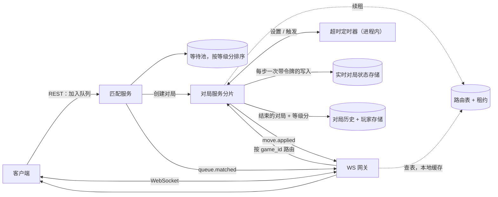

# 在线国际象棋平台（类 Chess.com）

[English](README.md) · [中文](README.zh.md)

<!-- meta:begin -->
| 题型 | 优先级 | 难度 | 岗位 | 考点 | 轮次 |
| --- | --- | --- | --- | --- | --- |
| 系统设计 | ★★★★★ | — | SWE · Infra Eng | websocket, matchmaking, game-state, idempotency, consistent-hashing | 电话面 · 现场面 |
<!-- meta:end -->

## 题目

设计一个一对一实时对局的在线国际象棋平台后端。已注册的玩家为某种时限规则（例如 5 分钟基础时间、每步加 3 秒）和某种模式（计分或友谊局）加入队列；系统会为其匹配一个等级分相近的对手并开始一局对局。对局开始后，双方通过一条持久连接提交走子，并且几乎要立刻看到对方的走子。每位玩家有各自的棋钟，服务器是双方棋钟的唯一权威：玩家屏幕上的计时器只是显示，绝不能被用来判定时间是否用完。掉线不会暂停对局：无论双方是否在线，轮到走子一方的棋钟都照常走动；玩家重新连接后，必须能恢复到当前的确切局面和当前的确切剩余时间。对局如何结束也由服务器判定：已经开始的对局只有七种结局——将死（checkmate）；逼和（stalemate，轮到走子的一方没有合法走子，且没有被将军）；认输；棋钟走到零；双方同意和棋；*三次重复局面*（threefold repetition，同一局面第三次出现）；*五十步规则*（fifty-move rule，双方各走五十步而其间没有吃子、也没有走兵）。后两种一出现就判和，不需要玩家提出。对局结束后，完整的走子历史要永久记录，双方的等级分也要更新。

规模设定：

- 每天有 5,000,000 名玩家至少下一局。
- 高峰时同时在线 300,000 名玩家（占每日玩家数的 6%），对应 150,000 局同时进行。
- 一局持续 1 到 30 分钟不等，平均约 8 分钟、共走约 80 步，双方各 40 步（这里“一步”指一方的一次走子——国际象棋术语里称为*半回合*（ply））。
- 匹配等待时间目标：第 95 百分位低于 4 秒。
- 走子转发延迟目标（从一方提交走子到对方屏幕显示为止）：第 95 百分位低于 120 毫秒。
- 超时判负检测目标：服务器必须在玩家剩余时间真正归零后的 50 毫秒内宣布超时。
- 可用性目标：99.9%。
- 正确性要求：即使客户端重试请求或在对局中重连，服务器确认过的走子也绝不能丢失，任何走子都不能被重复应用，也不能在不该这一方走子时被接受。

范围内：按等级分加入队列与匹配；实时校验、应用并转发单局对局的走子；服务器权威的棋钟与超时检测；认输、提和，以及由服务器自行判定的各种和棋结局；处理掉线与重连；对局结束后持久化走子历史并更新双方等级分。范围外：观战正在进行的对局、锦标赛、电脑对手、作弊/借助引擎的检测、聊天，以及等级分公式本身——假设已经有一个等级分更新函数可以调用，它接收两个等级分和一局的结果，返回更新后的两个等级分。

要产出：

1. 需求与规模估算：每秒转发走子的峰值速率、需要多少并发 WebSocket 连接以及为此需要多少台承载连接的实例（说明你对单实例能承载多少连接的假设）、持久化走子历史带来的每日存储增长。
2. 数据模型（玩家、对局、走子记录、队列条目）与接口，REST 接口和 WebSocket 消息分开列出。
3. 一张架构图，并沿着一次走子从玩家提交到对方客户端显示的路径走一遍。
4. 深入讨论：服务器权威的棋钟；单局内走子的一致性与正确路由；匹配。

## 参考解答

<details>
<summary>展开参考解答</summary>

动手设计之前值得先确认：友谊局是否享有和计分对局完全相同的走子转发与棋钟保证（下面假设是，只是跳过等级分更新），以及时限规则是否是一个较小的固定目录（子弹棋/超快棋/快棋）而不是玩家随意输入的值（下面假设是固定目录，这样匹配池才是有限的）。

### 需求与规模

**峰值并发。** 300,000 名在线玩家意味着 150,000 局并发对局。一局 8 分钟（480 秒）共走 80 步，同一局里两步之间的平均间隔是 $480/80 = 6\text{ 秒}$，所以全体对局的走子峰值速率是 $150{,}000/6 = 25{,}000$ 步/秒。每一步被接受的走子要发给两个连接（给走子方的确认、给对方的更新），所以走子相关的 WebSocket 峰值流量是 $50{,}000$ 条消息/秒；按每条约 150 字节算，聚合带宽约 $7.5$ MB/秒——带宽不是瓶颈，连接数和每步走子的 CPU 开销才是。

**连接服务层的规模。** 每个在线玩家——无论正在对局、排队，还是只是挂在网站上——都占用一条持久 WebSocket 连接。按每台网关实例承载 20,000 条连接预算（受限于单连接缓冲区和扇出开销，而非原始内存），裸峰值需要 $\lceil 300{,}000/20{,}000\rceil = 15$ 台；加上两台滚动发布/故障切换余量，共 17 台。

**对局服务的规模。** 每一局都必须常驻在某一个进程的内存里，走子校验和棋钟运算才不会跨机器产生竞态。按每台实例承载 5,000 局预算（受限于每局的校验 CPU 开销和一个常驻超时定时器），裸峰值需要 $\lceil 150{,}000/5{,}000\rceil = 30$ 台，加上同样余量共 32 台。

**走子历史的存储。** 一条持久化的走子记录（半回合序号、走子本身、双方走子后的剩余时间、服务器接收时间戳、幂等键）约 80 字节；棋盘局面（FEN）只在对局行上存一份，不逐步存储，所以一局的走子日志约为 $80 \times 80\text{ 字节} = 6.4$ KB。一整天里进行中的对局数平均约为峰值的三分之一（全球玩家基数下 3 倍的峰均比是合理假设），按利特尔法则（Little's law：到达率 = 系统中的数量 / 平均停留时间），新对局的开局速率约为 $50{,}000 / 480\text{ 秒} \approx 104$ 局/秒，即每天约 9,000,000 局——每日增长约 $9\times10^6 \times 6.4\text{ KB} \approx 57.6$ GB，一年约 21 TB（复制之前）。历史存储每局结束时只写一次，一个良好分片的关系型集群就够了。

### 数据模型与 API

**Player（玩家）**——`player_id`、`username`、`rating_bullet`、`rating_blitz`、`rating_rapid`（每个时限类别一个等级分）、`created_at`。

**QueueEntry（队列条目）**——`entry_id`、`player_id`、`mode`（`rated`/`casual`）、`time_control`（`{base_s, increment_s}`）、`rating_snapshot`、`joined_at`、`status`（`waiting`/`matched`/`cancelled`/`expired`）、`matched_game_id`。

**Game（对局）**——`game_id`、`white_player_id`、`black_player_id`、`mode`、`time_control`、`status`、`result`（`white`/`black`/`draw`，进行中为空）、`result_reason`（`checkmate`/`stalemate`/`resignation`/`timeout`/`draw_agreement`/`threefold_repetition`/`fifty_move`/`abandonment`）、`current_fen`（用 FEN 记法写成一行的当前局面，作读缓存）、`repetition_counts`（自上一次吃子或走兵以来，每个局面键——子力摆放、轮到谁走、易位权、过路兵格——各出现过几次，吃子和走兵会把它清空；五十步规则的计数就是 FEN 自带的半回合计数）、`ply`（下一步预期的序号）、`turn`、`white_remaining_ms`、`black_remaining_ms`、`turn_started_at_ms`（该走子方回合开始时的服务器时间）、`version`（每次走子、认输、提和或超时都递增）、`owner_epoch`（*隔离令牌*，即 fencing token，对局每换一次归属实例就加一）、`started_at`、`ended_at`。

**MoveRecord（走子记录，只追加）**——`game_id`、`ply`、`player_id`、`uci`（例如 `g1f3`）、`client_move_id`（客户端生成的幂等键）、`white_remaining_ms_after`、`black_remaining_ms_after`、`server_received_at_ms`、`version_after`。

REST，用于一切非延迟敏感的操作：

1. `POST /v1/matchmaking/queue`——`{mode, time_control}` → `{entry_id, status}`。
2. `DELETE /v1/matchmaking/queue/{entry_id}`——离开队列。
3. `GET /v1/games/{game_id}`——当前快照（`current_fen`、棋钟、`version`、`status`）；供客户端在 WebSocket 连上之前先取局面，或用于赛后回顾。
4. `GET /v1/games/{game_id}/moves`——完整的走子历史。

WebSocket，用于一局对局内的一切：

- 客户端 → 服务器：`move {game_id, ply, uci, client_move_id}`、`resign {game_id}`、`draw_offer {game_id}`、`draw_response {game_id, accept}`、`reconnect {game_id, last_seen_version}`。
- 服务器 → 客户端：`queue.matched {game_id, color, opponent, time_control}`、`move.applied {game_id, version, ply, uci, current_fen, turn, white_remaining_ms, black_remaining_ms, server_now_ms}`、`move.rejected {game_id, expected_ply, reason}`、`clock.sync {game_id, version, white_remaining_ms, black_remaining_ms, server_now_ms}`（重连后立即发送）、`moves.backfill {game_id, moves, from_version, to_version}`（重连时发送，补上漏掉的走子）、`game.ended {game_id, result, result_reason, final_version}`。

### 架构



一次走子的完整路径：客户端把 `move` 发给自己所连的网关，网关在缓存的路由表里查出这局的归属实例并转发，不检查棋规。走子进入这局的事件队列时，归属实例用自己的时钟给它打上接收时间戳。轮到处理这步走子时，实例先按 `client_move_id` 识别重试，再检查轮次和 `ply`，然后用现成的国际象棋规则库校验合法性（过路兵、易位、重复局面是手写校验最容易错的地方）。接着算出新的棋钟读数，并查这一步是不是直接结束了对局——对方没有合法走子，被将军是将死、没被将军是逼和；新局面在 `repetition_counts` 里第三次出现；半回合计数到了 100——再把新的对局状态连同追加的 `MoveRecord` 用一次带隔离令牌的写入写进实时状态存储，为新的走子方重设超时定时器，再经网关把 `move.applied` 推给双方连接；被拒绝的走子只把 `move.rejected` 发回提交者本人。

### 深入话题

**服务器权威的棋钟。** 有两种做法：每秒打一次点，给正在走的棋钟扣时，并写入或广播每一次的新值；或者只在能改变棋钟的两类事件上重新计算——一步走子被接受，或者没有人走子、直到时间耗尽。打点意味着每局每秒写一次，共 150,000 次/秒，是走子速率的六倍，而这个值在两次事件之间没人读，所以下面采用事件驱动的做法。

设一步走子的接收时间戳为 $t_{\text{recv}}$，走子方的剩余时间为 $r$，这一回合的开始时间为 $t_{\text{turn}}$（`turn_started_at_ms`），走子方的新剩余时间是

$$r' = r - (t_{\text{recv}} - t_{\text{turn}}) + \text{inc}, \quad \text{仅当 } r - (t_{\text{recv}} - t_{\text{turn}}) > 0$$

也就是说，加秒在走完一步之后才加上（费舍尔加秒，Fischer increment）。差值不为正时，这步走子被拒绝，走子方超时判负——时间用完之后才到的走子不能挽救这一局。然后令 $t_{\text{turn}} := t_{\text{recv}}$，切换 `turn`，`version` 加一；客户端屏幕上的计时器只是从最近一条 `move.applied` 或 `clock.sync` 的读数往下倒数。双方各自走出第一步之前，棋钟都不走；第一步改用一个固定期限（例如 20 秒），超过期限就中止对局、不计结果。

没有人走子时的超时：每接受一步走子，归属实例就为新的走子方设置一个进程内定时器，定在它的截止时刻 $t_{\text{turn}} + r$，同时取消上一个。一局的走子和定时器触发都进入同一个按局划分的事件队列，逐个处理；$t_{\text{recv}}$ 在走子进入这个队列时取得。触发事件带着设置定时器时记下的 `version`，只有 `version` 没变才宣布超时：触发事件已经排在一步走子后面时，取消会失败，这个检查让这次过期的触发变成空操作。触发事件进入队列的时刻不早于截止时刻，所以时间戳早于截止时刻的走子一定先被处理；结果只取决于走子的时间戳是否早于截止时刻，与哪个事件碰巧先执行无关。改在网关打时间戳就不成立了：时间戳在截止之前的走子，仍可能在触发事件之后才进入队列。

延迟补偿（可选）：扣掉的时间里包含走子方连接的一次往返（对方的走子发过来、回应发回去）。把服务器自己在这条连接上测得的往返时间退还给走子方，每步至多例如 100 毫秒、且不超过这一步被扣的时间，就能消掉大部分偏差；这个上限也限制了客户端故意推迟回复 pong、抬高测量值能占到的便宜。不补偿时，往返 100 毫秒的玩家 40 步约多扣 4 秒，在 1 分钟的对局里很多，在 5+3 里很少，所以只对子弹棋开启。

**单局内走子的一致性与路由。** 先定一局的状态住在哪里。无状态的做法——任何实例都能处理任何一步走子，从按 `game_id` 分片的存储里读出这一局的行，校验之后用一次带条件的更新写回——没有谁持有哪一局，因此既不需要租约也不需要隔离令牌；25,000 步/秒摊到 30 个分片，每片不到 900 步/秒。它输在棋钟上：50 毫秒的检测目标要的是每局一个进程内定时器，无状态就得换成一个扫描 15 万个截止时刻、且扫描周期本身短于 50 毫秒的调度器；走子与它自己的超时触发之间的先后，必须由走子的接收时间戳决定，这件事一个按局划分的事件队列在内存里就定了，两个各写各的进程只能在带条件的更新失败之后重读再判。所以这里让对局有归属，而归属的代价是租约、隔离令牌，以及接管时的一段空窗。

把一局的消息送到持有其状态的进程有两种办法：对 `game_id` 做纯一致性哈希（consistent hashing），每个网关各自算出归属实例；或者维护一张显式路由表（`game_id` → 当前归属实例），网关查表并缓存。两者各司其职：哈希环（带虚拟节点）只计算放置——新对局放在哪里，宕机实例的对局分给谁（摊到所有存活实例上）——路由表记录结果。一局只在归属实例宕机时才换归属，扩缩容不搬动进行中的对局；只靠哈希环的话，每次成员变化都会在对局中途改变一部分对局的归属，看到变化有先有后的网关还会把同一局的走子发给两个实例。

这两种结构本身都排除不了“两个归属者”：网关缓存的表项可能过期，被判定宕机的实例也可能只是暂停（长时间 GC、网络分区）之后又恢复。所以归属权是一份*租约*（lease）：每个实例持有一份覆盖其全部对局的租约，每秒续一次，有效期 5 秒，一旦续租失败就停止接受走子；控制器只在租约过期之后才重新分配该实例的对局，并把每局的 `owner_epoch` 加一。每一次写实时状态都以写入方的 `owner_epoch` 和预期的 `version` 为条件，于是过期归属者的写入会失败，它随即放弃这局；网关收到 `not_owner` 后刷新表项再重试。

恰好一次、按序的走子：`client_move_id` 已有记录的走子是重试，服务器把记录下来的结果再发一次，只丢了确认的客户端因此看到对局继续，而不是报错。其他走子必须来自轮到走子的一方，且 `ply` 等于对局当前的 `ply`——这是一种*乐观并发*（optimistic concurrency）检查，在改动任何状态之前挡掉过期或越权的走子。顺序不能反：先查 `ply` 的话，一步其实已经应用过的走子，它的重试会被拒绝。

实例崩溃后的恢复：一步走子只有在它那次带令牌的写入（新的对局状态加上追加的 `MoveRecord`）落到实时状态存储的多数副本上之后才被确认——同一地区内只需几毫秒，比 120 毫秒预算里两段客户端网络传输小得多。多数副本都联系不上时，这步走子直接被拒绝、由客户端重试，绝不会先确认、后补写。所以已确认的走子不会丢失；崩溃时已写入但还没确认的走子，会在客户端重试时按 `client_move_id` 被找到，不会被应用两次。进行中对局的条目永远不会被驱逐。新的归属实例从实时状态读出对局，为轮到走子的一方重设定时器。故障切换的空窗期里没有走子能被接受，所以不计时：走子方只被扣到旧归属者最后一次续租为止（这一回合在那之后才开始就不扣），$t_{\text{turn}}$ 从接管时刻重新开始。对局结束时，归属实例在一个事务里把走子列表、结果和双方新等级分写进历史存储；事务先插入这局的结束记录，记录已存在就什么也不做，因此崩溃后重试不会把等级分改两次；之后才删除实时条目。

重连（客户端自己掉线，或者持有它这条连接的网关宕机，一次带走两万条连接——重连因此要带抖动）：客户端重新建立 WebSocket 后发送 `reconnect {game_id, last_seen_version}`；网关按路由表转发（表此时可能已指向另一个实例），归属实例把这个网关记为该玩家新的投递地址，并回复 `moves.backfill`——`version_after` 大于 `last_seen_version` 的全部 `MoveRecord`，取自进行中的对局本身，因为历史存储只收已结束的对局——再加一条按当前服务器时间算出的 `clock.sync`；客户端随后用原来的 `client_move_id` 重发还没被确认的走子。

**匹配。** 每个（时限规则、模式）组合有自己的等待池。池子可以按固定的等级分分桶，搜索时扫描与 ±Δ 窗口重叠的所有桶再过滤（只搜自己那个桶的话，桶边界旁的玩家会错过只差一分的对手）；也可以用一个按等级分排序的结构，一次范围查询就返回 Δ 以内最接近的等级分，不用调桶宽、也不用过滤。后者就是粒度细到一分的分桶，这里选它。

放宽规则：$\Delta(w) = \min(\Delta_0 + \text{rate} \times w, \Delta_{\max})$，$w$ 是已等待的时间——例如加入时 ±40 分，每秒放宽 20 分，18 秒后达到 ±400 分的上限。太严格会让冷门池子（非高峰时段的时限规则、极端的等级分）里的玩家无限等待，太宽又会给再等片刻就能配到接近对手的玩家配出悬殊的对局；窗口随时间放宽，两头都能避开。

配对与分片：每个池子由一个单线程的匹配器独占，它每 100 毫秒按等待时间从长到短遍历条目，为每个条目在其窗口内找等级分最接近的对手，把两人一起移出池子，并请对局服务创建对局；一个池子只有一个线程，所以一个玩家不可能被分进两局，也不需要加锁。负载很小：高峰时每秒约有 $150{,}000 / 480 \approx 312$ 局开始，即每秒约 625 名玩家加入队列，平均等待至多约 2 秒（第 95 百分位的目标是 4 秒），按利特尔法则，同一时刻所有池子里加起来只有约 $625 \times 2 = 1{,}250$ 个条目——远低于一个核的处理能力，所以按池子拆分服务是为了故障隔离，而不是吞吐：每个池子整体放在一个分片上，范围查询从不跨分片；某个分片故障时，由备用实例根据状态为 `waiting` 的队列条目重建它的池子。

### 追问

- 观战需要一条独立的广播路径：一局对局对应不确定数量的观众，而这里的走子转发是为恰好两个接收者设计和排序的。
- 每日棋（多日制）不应让一局对局在内存里常驻好几天：每次走子时再加载它，截止时刻存进一张由调度器轮询的持久表。

<details>
<summary>估算核对（可运行）</summary>

```python
import math

daily_players = 5_000_000
peak_frac = 0.06
peak_online = daily_players * peak_frac
peak_games = peak_online / 2
assert peak_online == 300_000
assert peak_games == 150_000

avg_game_duration_s, avg_moves = 8 * 60, 80
avg_move_interval_s = avg_game_duration_s / avg_moves
assert avg_move_interval_s == 6

peak_moves_per_sec = peak_games / avg_move_interval_s
assert peak_moves_per_sec == 25_000
ws_msgs_per_sec = peak_moves_per_sec * 2
assert ws_msgs_per_sec == 50_000

move_msg_bytes = 150
bandwidth_mb_s = ws_msgs_per_sec * move_msg_bytes / 1e6
assert round(bandwidth_mb_s, 1) == 7.5

stateless_shards = 30                        # the stateless variant: one store shard per game_id range
moves_per_shard = peak_moves_per_sec / stateless_shards
assert round(moves_per_shard) == 833

per_gateway_conns = 20_000
gateways_bare = math.ceil(peak_online / per_gateway_conns)
assert gateways_bare == 15
gateways_with_margin = gateways_bare + 2
assert gateways_with_margin == 17

per_instance_games = 5_000
game_svc_bare = math.ceil(peak_games / per_instance_games)
assert game_svc_bare == 30
game_svc_with_margin = game_svc_bare + 2
assert game_svc_with_margin == 32

# a ticking clock writes once per second for every game in progress
tick_writes_per_sec = peak_games * 1
assert tick_writes_per_sec == 150_000
assert tick_writes_per_sec / peak_moves_per_sec == 6

peak_to_avg_ratio = 3
avg_concurrent_games = peak_games / peak_to_avg_ratio
assert avg_concurrent_games == 50_000

# Little's law: arrival rate = number in system / average time in system
games_started_per_sec = avg_concurrent_games / avg_game_duration_s
games_per_day = games_started_per_sec * 86_400
assert round(games_started_per_sec) == 104
assert round(games_per_day) == 9_000_000

bytes_per_move_row = 80
bytes_per_game = avg_moves * bytes_per_move_row
assert bytes_per_game == 6_400

daily_storage_gb = games_per_day * bytes_per_game / 1e9
annual_storage_tb = daily_storage_gb * 365 / 1e3
assert round(daily_storage_gb, 1) == 57.6
assert round(annual_storage_tb, 1) == 21.0

# queue size at peak, again by Little's law: entries = join rate * mean wait
peak_games_started_per_sec = peak_games / avg_game_duration_s
assert math.floor(peak_games_started_per_sec) == 312
peak_joins_per_sec = 2 * peak_games_started_per_sec
assert peak_joins_per_sec == 625
mean_wait_s = 2
peak_queue_entries = peak_joins_per_sec * mean_wait_s
assert peak_queue_entries == 1_250

# widening rule: +-40 at join, +20 per second, capped at +-400
delta0, rate, delta_max = 40, 20, 400
assert (delta_max - delta0) / rate == 18

# latency charged without compensation: one 100 ms round trip per move, 40 moves per side
rtt_s, moves_per_side = 0.100, avg_moves // 2
assert round(rtt_s * moves_per_side, 6) == 4

print("all requirements-and-scale numbers check out")
```

</details>

</details>
