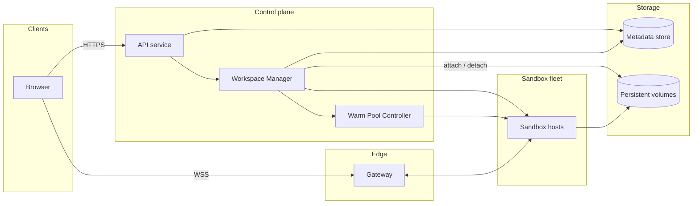

# Cloud IDE

[English](README.md) · [中文](README.zh.md)

<!-- meta:begin -->
| Type | Priority | Difficulty | Roles | Topics | Round |
| --- | --- | --- | --- | --- | --- |
| System design | ★★★☆☆ | Hard | SWE · Infra Eng · EM | sandbox, vm-lifecycle, websocket, streaming | Phone screen · Onsite |
<!-- meta:end -->

## Problem

Design the backend for a browser-based IDE, in the style of Replit or GitHub Codespaces: a user opens a
tab, and without installing anything locally, edits files, opens a terminal, runs shell commands, and
watches stdout/stderr appear as the command produces it. Each user's workspace runs inside its own
isolated sandbox — a container or a lightweight virtual machine — with its own filesystem, process tree
and resource limits; nothing in one workspace's sandbox is visible to, or can affect, another workspace's.
A workspace goes through a lifecycle: it is created once, the sandbox behind it is started (or resumed)
whenever the user reopens it, put to sleep (hibernated) after the user stops using it, and eventually
deleted. Files a user writes, and packages they install with a package manager inside the sandbox, are
part of the workspace's persisted state and survive hibernation and resume, same as source files; they
are lost only when the workspace itself is deleted. If the browser tab loses its connection mid-session —
a flaky network, a laptop going to sleep — reconnecting must reattach to the same running terminal rather
than starting a new one, and any command still running keeps running while the tab is away.

Scale for this design:

- 2,000,000 registered users.
- 36,000 workspaces holding a live sandbox at once during peak hours; an interactive session, from
  opening a workspace to closing its last browser tab, lasts about 20 minutes on average.
- Each workspace gets a fixed quota: 2 vCPUs, 4 GiB RAM, and 10 GiB of persistent file storage.
- Opening a workspace: a live sandbox ready in under 2 seconds at the 95th percentile on the normal path;
  under 7 seconds at the 95th percentile on the rare path where no pre-started sandbox is available and
  one has to be provisioned from scratch.
- Terminal output: a line printed by a running command must reach the browser within 150 ms at the 95th
  percentile.
- A workspace with no open browser connection and no running foreground process hibernates after 15
  minutes in that idle state.

In scope: workspace lifecycle management (create, start, hibernate, resume, delete); sandbox isolation and
resource limits; file (and installed-package) persistence; the terminal streaming and reconnection path;
and capacity and warm-pool sizing for the sandbox fleet. Out of scope: the code editor itself — syntax
highlighting, autocomplete and language servers are assumed to run client-side or against a separate,
already-designed service; billing and plan management; and real-time collaborative editing (two people
typing in the same file at once) — sharing here only grants another user view or edit access to the same
workspace, one active editor at a time.

Produce:

1. A requirements and scale estimate: concurrently running sandboxes and how many hosts the sandbox fleet
   needs, warm-pool size, terminal-output bandwidth, and total persistent storage.
2. A data model (workspace, sandbox assignment, file, process) and the core APIs — REST for workspace
   lifecycle and file management, WebSocket for terminal I/O and file-change events — listed separately.
3. An architecture diagram and a walk-through of opening a workspace and running a command along it.
4. Deep dives into: sandbox isolation; terminal streaming and reconnection; and workspace lifecycle and
   cost. For each, compare at least two alternatives, say which you would pick, and state the cost of that
   choice.

## Reference solution

<details>
<summary>Show the reference solution</summary>

Worth confirming before designing: whether sandboxes need general outbound internet access or only package
registries. This design assumes only registries.

### Requirements and scale

**Workspace-start rate.** A sandbox stays live through the session and then through the 15-minute idle
timeout after the last tab closes, so it is held for $W = 20 + 15 = 35$ min $= 2{,}100$ s. By Little's law,
$L = \lambda \cdot W$, with $L = 36{,}000$ live sandboxes at peak,

$$\lambda_{\text{peak}} = L / W \approx 17.1 \text{ workspace starts (or resumes) per second.}$$

Of these, about $\lambda_{\text{peak}} \times 1{,}200 \approx 20{,}600$ are in an active session and the
other 15,400 are waiting out the timeout.

**Sandbox-fleet size.** Assume each host offers sandboxes 96 vCPUs and 192 GiB after the host's own share —
the quota's 1 : 2 ratio, so neither resource is stranded — which fits $96/2 = 192/4 = 48$ sandboxes.
$36{,}000 / 48 = 750$ hosts; 20% headroom for hosts booting, draining or failing health checks, and for the
warm pool, makes **900 hosts** ($43{,}200$ slots).

**Warm-pool size.** Each claim from the pool triggers a replacement that takes $T_{\text{create}} = 7$ s
(the cold path). The pool, counting sandboxes still booting, runs dry only if more claims arrive within one
refill time than it holds; by Little's law again, $\lambda_{\text{peak}} \cdot T_{\text{create}} = 120$
replacements are in flight at peak. A 1.5x burst margin gives **180 warm sandboxes**, under four hosts'
worth of slots, each holding a real 2 vCPU/4 GiB.

**Terminal-output bandwidth.** If 35% of the ≈20,600 active sessions have a process printing at any instant,
that is $7{,}200$ streams at an average 600 B/s, $\approx 4.3$ MB/s ($\approx 35$ Mb/s) — negligible; the
Gateway is sized by its ≈20,600 concurrent WebSockets instead.

**Persistent storage.** If 40% of the 2,000,000 registered users keep a workspace, that is $800{,}000$
workspaces averaging 350 MB of files and packages: **280 TB** of used bytes. Reserving each volume's full 10
GiB quota would take about 8.6 PB, 30 times as much, so volumes are thin-provisioned.

### Data model and API

**Workspace** — `id`, `owner_id`, `name`, `template`, `sharing` (`{mode: "private" | "view" | "edit",
principals}`), `status`, `generation` (an integer bumped every time a new `Sandbox` is assigned — the
fencing token), `current_sandbox_id` (set only while `status` is `running`, `hibernating` or `resuming`),
`idle_since` (set when the last connection closes with no foreground process running, else null),
`created_at`, `updated_at`.

`status` has six states, each transition owned by one component. The Workspace Manager moves a new workspace
`creating → running` once its first sandbox reports healthy. The manager's idle sweep, or `POST /stop`,
moves `running → hibernating`; the host agent then syncs the filesystem, stops the sandbox and detaches the
volume, and its confirmation moves the workspace to `hibernated`. `POST /start` moves `hibernated →
resuming`, the manager's lease monitor moves `running → resuming` after a host failure, and the new sandbox
reporting healthy moves either back to `running`. `DELETE` moves any state to `deleted` once any live
sandbox is released and the volume purged.

**Sandbox** — one row per booted sandbox: `id`, `host_id`, `workspace_id` (null while `warm`), `generation`
(copied from the workspace at claim time), `status` (`provisioning | warm | attached | releasing |
released`), `lease_expires_at`, `last_heartbeat_at`, `created_at`. A unique index allows at most one
`attached` row per workspace.

**File** — a metadata index, not the bytes: `id`, `workspace_id`, `path`, `is_directory`, `size_bytes`,
`content_hash`, `updated_at`. Every sandbox boots from its template's read-only base image, shared by all
sandboxes; everything the user changes — files and installed packages alike — lands in a writable layer on
the workspace's volume. The agent inside the sandbox keeps the index current (a directory such as
`node_modules` is one entry), so the tree lists even while `hibernated`.

**Process** — `id`, `workspace_id`, `sandbox_id`, `generation`, `command`, `status` (`running | exited`),
`exit_code`, `started_at`, `ended_at`.

**REST** (workspace lifecycle and files):

1. `POST /workspaces` — `{name, template}` → `{workspace_id, status: "creating"}`.
2. `POST /workspaces/{id}/start` — ensures a running sandbox (warm pool, resume, or post-failure recovery).
   Returns `{status, stream_token}`, `stream_token` a signed `{workspace_id, sandbox_id, host_endpoint,
   generation, access, exp}`.
3. `POST /workspaces/{id}/stop` — user-triggered hibernate, `running → hibernating`. Returns `{status}`.
4. `DELETE /workspaces/{id}` — releases any live sandbox, purges the volume, returns `{status: "deleted"}`.
5. `GET /workspaces/{id}/files?path=` lists a directory from the index (works while hibernated);
   `PUT /workspaces/{id}/files/{path}` writes a file, requiring `status = running` (`409` +
   `resume_required` otherwise).

**WebSocket** (`WSS /stream/{workspace_id}?token=<stream_token>`) — one connection multiplexes every
process, tagged by `process_id`, so a dev server and a test run share one socket.

Client to server: `{type: "run", command, cwd}`; `{type: "input", process_id, data}`; `{type: "resize",
process_id, cols, rows}`; `{type: "cancel", process_id}`; and, only right after reconnecting, `{type:
"resume", process_id, from_seq}`.

Server to client: `{type: "process_started", process_id}`; `{type: "output", process_id, seq, data}` (`seq`
is the byte offset of the first byte of `data`); `{type: "process_exit", process_id, exit_code}`; `{type:
"output_gap", process_id, from_seq, dropped_bytes}` when output the client never received was overwritten;
and `{type: "file_changed", path, kind}` for a change made outside a `PUT`, such as a package manager
writing a lockfile.

### Architecture



Opening a hibernated workspace goes from the API service to the Workspace Manager, which claims a `warm`
sandbox from the Warm Pool Controller (which starts a replacement, or provisions one on the spot when the
pool is empty), bumps `generation` and marks the `Sandbox` row `attached` in one conditional update, then
attaches the workspace's volume to that host and returns a `stream_token` carrying both. Each host's host agent
boots and stops sandboxes, renews their leases with the manager, and forwards connections to the agent
inside each sandbox, which owns the PTYs, output buffers and file watcher. The browser opens a WebSocket to
the Gateway, which dials the host address in the token (no database lookup) and carries input and output
over that connection for the session. A `run` message makes the in-sandbox agent start the process on a
pseudo-terminal and stream its output back; the manager and the metadata store are not on this path, so the
150 ms output target never waits on the database.

### Deep dives

**Sandbox isolation.** Three categories, in increasing isolation strength. Plain OS containers (Linux
namespaces limit what a process sees, cgroups what it uses) start in well under a second, but all sandboxes
share one host kernel: seccomp trims the syscall table, yet one exploitable bug in what remains exposes
every tenant on the host. Containers behind a sandboxed kernel (a user-space kernel intercepts the syscalls
and implements them itself — gVisor is one implementation) expose the host kernel only to the small,
filtered set of calls that layer makes, so an escape needs a bug in the layer and then one in the host
kernel; the price is overhead on syscall- and file-heavy work such as builds, and the occasional tool
needing a syscall the layer lacks. MicroVMs (a minimal virtual machine monitor boots a guest kernel per
sandbox under hardware virtualization — Firecracker is one implementation) give each sandbox its own kernel;
an escape must get through the hypervisor's narrow interface, KVM plus a few emulated devices.

Choice: microVMs — every sandbox runs arbitrary commands from strangers, so the boundary is the product's
core promise. Cost: hosts need hardware virtualization (bare metal or nested virtualization); every sandbox
carries its own guest kernel and page cache, which containers would share; the guest boot adds on the order
of a hundred milliseconds, small next to fetching the image and attaching the volume on the cold path; and
placement and health checks are built in-house rather than taken from a generic container scheduler.

Two more controls sit outside the guest, where the user cannot change them. Egress reaches only a proxy that
forwards to allowlisted package registries, never to internal addresses or the cloud metadata endpoint.
Resources: the microVM has exactly 2 vCPUs and 4 GiB of guest memory, and the host puts its monitor process
in a cgroup (`cpu.max` throttles CPU time, `memory.max` caps host-side memory) and rate-limits its disk and
network devices, so a runaway build slows only itself.

**Terminal streaming and reconnection.** The in-sandbox agent starts each command on a pseudo-terminal
(PTY), not a pipe, so a REPL or anything checking `isatty` behaves as it does locally; like a local
terminal, the PTY merges stdout and stderr into one byte stream. The agent reads the PTY's master side,
appends the bytes to a 256 KB ring buffer per process, and sends them up the Gateway connection.

The agent never stops reading the PTY: if it did, the kernel's PTY buffer would fill and the user's program
would block in `write`, freezing a build because a tab was slow or closed. Instead the send position may lag
the ring's write position; a slow browser gets output later, and if the lag exceeds the ring, the oldest
unsent bytes are overwritten and reported with `output_gap`. On reconnect the client sends, per process, the
offset just past its last received byte: if that is still in the ring, the agent replays from it; if not, it
sends `output_gap` with the bytes lost and continues from the ring's oldest byte, so the UI shows a marker
instead of silently skipping. The alternative, a durable log outside the sandbox, keeps unlimited history
and survives a sandbox loss, but every byte crosses the network twice and is stored, for output whose
process dies with the sandbox anyway. The ring's price is capped history: about seven minutes at 600 B/s, a
few seconds of a verbose build.

Reconnecting needs no lookup: the Gateway dials the host address in the `stream_token`. The host agent
accepts only if the token's `sandbox_id` and `generation` match a sandbox it runs under a current lease;
otherwise — the workspace moved, or this host was fenced — it refuses, and the client calls `/start` for a
fresh token.

**Workspace lifecycle and cost.** "Active" means an open WebSocket or a running foreground process; the host
agent reports each change, and a periodic sweep hibernates workspaces whose `idle_since` is over 15 minutes
old. That timeout is the largest cost lever: about 15,400 of the 36,000 peak sandboxes are waiting it out,
and each minute of it costs $\lambda_{\text{peak}} \times 60 \approx 1{,}030$ sandboxes, about 21 hosts,
against users who come back inside the window and find everything still running.

What hibernation keeps is a choice. Filesystem only — sync and detach the volume, release the compute —
resumes along the normal 2-second path, but running processes are gone: a dev server restarts, and state
held only in memory is lost. A memory snapshot resumes a dev server where it left off, but it is as large as
the memory the guest has touched, up to 4 GiB against a 350 MB average volume, so keeping one per hibernated
workspace would multiply storage. Choice: filesystem-only by default, since a restart costs seconds, not
data; snapshots are a priced opt-in.

A host failure surfaces as an expired lease (the host agent renews with a write conditional on `generation`
and `status = attached`). The old host may only be partitioned, and its microVM can keep writing even after
its host agent dies, so recovery does not rely on timing. The lease monitor first revokes the lease
(`attached → releasing`, only if expired), so no late renewal succeeds. It then fences at the storage: the
block store enforces single attachment itself, so the manager force-detaches the volume from the old host,
after which the old host's I/O fails. Only once the store confirms does one update mark the row `released`,
bump `generation` and move the workspace to `resuming`; if it cannot confirm, the workspace stays
unavailable rather than risk two writers. Separately, a host agent that cannot renew stops its sandboxes at
its own deadline, counted from when it sent its last successful renewal so that it passes no later than the
manager's, and one whose renewal returns `409` stops at once. That protects processes and terminals; the
fence protects the bytes.

Where the bytes live decides what a failure loses. On the host's local disk, the workspace is stranded until
that host returns, or loses everything since its last upload, and every hibernation or move copies the whole
volume. On the network volume, the guest's page cache is the only write-back layer and `fsync` returns only
once the store has the data, so a crash loses just unsynced writes, as on a laptop; the price is a network
round trip per synchronous write. So the block store is chosen for enforced single attachment with forced
detach, attach fast enough for the 2-second path, and thin provisioning.

### Follow-ups

- A second user with *edit* access attaches to the same sandbox and the same PTYs; a *view* token carries
  `access: "view"`, and the host agent rejects its `run`, `input`, `resize` and `cancel` messages.
- If users instead connect over SSH to a provisioned host, the SSH server supplies the PTY and a terminal
  multiplexer supplies reattachment; what remains is scheduling work across the host fleet, a separate
  design.

<details>
<summary>Estimate check (runnable)</summary>

```python
import math

# ---- workspace-start rate (Little's law) ----
L_peak = 36_000              # workspaces holding a live sandbox at peak
session_s = 20 * 60          # average interactive session, seconds
idle_timeout_s = 15 * 60     # a sandbox stays live this long after the last tab closes
W = session_s + idle_timeout_s
assert W == 2_100
lam_peak = L_peak / W
assert round(lam_peak, 1) == 17.1
active = lam_peak * session_s                 # sandboxes in an active session
waiting = lam_peak * idle_timeout_s           # sandboxes waiting out the idle timeout
assert round(active, -2) == 20_600 and round(waiting, -2) == 15_400
assert math.isclose(active + waiting, L_peak)

# ---- sandbox-fleet sizing ----
vcpu_per_ws, ram_gib_per_ws = 2, 4
host_vcpu, host_ram_gib = 96, 192             # offered to sandboxes after the host's own share
by_vcpu = host_vcpu // vcpu_per_ws
by_ram = host_ram_gib // ram_gib_per_ws
assert by_vcpu == by_ram == 48                # same 1:2 ratio as the quota: nothing stranded
per_host = min(by_vcpu, by_ram)
assert L_peak / per_host == 750
headroom = 0.20
hosts = math.ceil(L_peak / per_host * (1 + headroom))
assert hosts == 900
slots = hosts * per_host
assert slots == 43_200

# ---- warm-pool sizing (Little's law again: replacements in flight) ----
T_create = 7                                  # seconds: full provision = pool refill time
inflight = lam_peak * T_create
assert math.isclose(inflight, 120)
pool = inflight * 1.5                         # margin for bursts above the sustained peak
assert math.isclose(pool, 180)
assert pool / per_host < 4                    # under four hosts' worth of slots
assert L_peak + pool <= slots                 # fits inside the fleet headroom

# ---- terminal output and gateway ----
streams = 0.35 * active
assert round(streams) == 7_200
mb_per_s = streams * 600 / 1e6
assert round(mb_per_s, 2) == 4.32
assert round(mb_per_s * 8) == 35              # Mb/s

# ---- persistent storage ----
stored = 2_000_000 * 0.40
assert stored == 800_000
used_tb = stored * 350 / 1e6
assert used_tb == 280
full_quota_pb = stored * 10 * 2**30 / 1e15    # every volume reserved at its 10 GiB quota
assert round(full_quota_pb, 1) == 8.6
assert round(full_quota_pb * 1000 / used_tb) == 31   # about 30x the used bytes

# ---- idle timeout as a cost lever ----
per_minute = lam_peak * 60                    # live sandboxes added by each minute of timeout
assert round(per_minute, -1) == 1_030
assert round(per_minute / per_host) == 21     # hosts

# ---- per-process ring buffer history ----
ring = 256 * 1024
assert round(ring / 600 / 60) == 7            # minutes at the average 600 B/s
assert ring / 100_000 < 3                     # seconds at a verbose build's 100 KB/s

print("all requirements-and-scale numbers check out")
```

</details>

</details>
