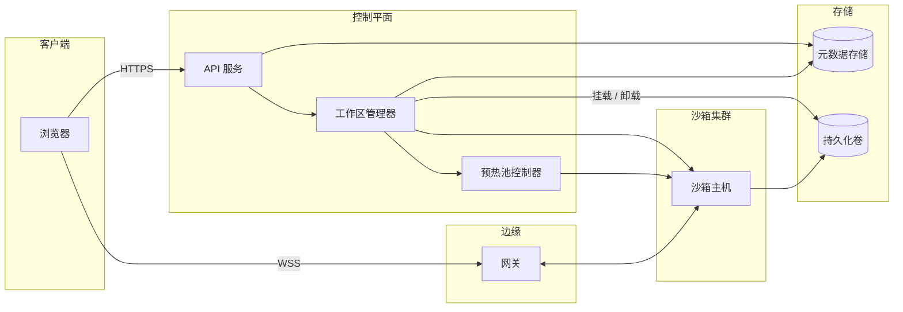

# 云端 IDE

[English](README.md) · [中文](README.zh.md)

<!-- meta:begin -->
| 题型 | 优先级 | 难度 | 岗位 | 考点 | 轮次 |
| --- | --- | --- | --- | --- | --- |
| 系统设计 | ★★★☆☆ | 困难 | SWE · Infra Eng · EM | sandbox, vm-lifecycle, websocket, streaming | 电话面 · 现场面 |
<!-- meta:end -->

## 题目

设计一个浏览器里的云端 IDE 的后端，类似 Replit 或 GitHub Codespaces：用户打开一个浏览器标签页，不需要在本地安装任何东西，就能编辑文件、打开终端、运行 shell 命令，并实时看到命令产生的标准输出/标准错误。每个用户的工作区（workspace）运行在自己独立的沙箱（sandbox）里——一个容器或一台轻量级虚拟机——拥有自己的文件系统、进程树和资源限额；一个工作区的沙箱里发生的事，另一个工作区既看不到也影响不了。工作区有一套生命周期：创建一次；每次用户重新打开时启动（或恢复）背后的沙箱；用户不再使用后进入休眠（hibernate）；最终被删除。用户写入的文件，以及在沙箱内用包管理器安装的包，都属于工作区的持久化状态，会像源代码文件一样在休眠和恢复之间保留下来，只有在工作区本身被删除时才会丢失。如果浏览器标签页在会话中途断线——网络不稳、笔记本电脑休眠——重新连接必须接回同一个正在运行的终端，而不是开一个新的；断线期间仍在运行的命令要继续运行。

这次设计的规模：

- 2,000,000 个注册用户。
- 高峰时段同时有 36,000 个工作区持有一个存活的沙箱；一次交互式会话（从打开工作区到关掉最后一个浏览器标签页）平均持续约 20 分钟。
- 每个工作区拿到固定配额：2 个 vCPU、4 GiB 内存、10 GiB 持久化文件存储。
- 打开工作区：正常路径下，沙箱在第 95 百分位低于 2 秒内就绪；极少数情况下（预热池里没有现成的沙箱，只能从零开始置备），第 95 百分位低于 7 秒。
- 终端输出：正在运行的命令打印的一行内容，必须在第 95 百分位 150 毫秒内到达浏览器。
- 一个工作区如果既没有打开的浏览器连接、也没有正在运行的前台进程，在这种闲置状态持续 15 分钟后进入休眠。

范围内：工作区生命周期管理（创建、启动、休眠、恢复、删除）；沙箱隔离与资源限额；文件（以及已安装的包）的持久化；终端流式传输与重连路径；沙箱集群的容量与预热池规模。范围外：代码编辑器本身——语法高亮、自动补全、语言服务假设完全跑在客户端，或者由另一个已经设计好的独立服务提供；计费与套餐管理；实时协同编辑（两个人同时编辑同一份文件）——这里的“分享”只是把同一个工作区的查看或编辑权限授予另一个用户，同一时刻只有一个人在编辑。

要产出：

1. 需求与规模估算：同时运行的沙箱数、沙箱集群需要多少台主机、预热池规模、终端输出带宽、总持久化存储量。
2. 数据模型（工作区、沙箱分配、文件、进程）与核心接口——REST 用于工作区生命周期与文件管理，WebSocket 用于终端输入输出与文件变更事件——分开列出。
3. 一张架构图，并沿着“打开工作区、运行一条命令”这条路径走一遍。
4. 深入讨论：沙箱隔离；终端流式传输与重连；工作区生命周期与成本。每个话题至少比较两种方案，说明选哪个，并给出这个选择的代价。

## 参考解答

<details>
<summary>展开参考解答</summary>

动手设计之前值得先确认：沙箱需要能访问任意外网，还是只需要访问包仓库。下面假设只需要包仓库。

### 需求与规模

**工作区启动速率。** 一个沙箱在会话期间存活，最后一个标签页关掉后还要再等 15 分钟的闲置超时，所以每个沙箱存活 $W = 20 + 15 = 35$ 分钟 $= 2{,}100$ 秒。由 Little 定律 $L = \lambda \cdot W$，高峰时存活的沙箱 $L = 36{,}000$ 个，

$$\lambda_{\text{peak}} = L / W \approx 17.1 \text{ 次工作区启动（或恢复）/秒。}$$

其中约 $\lambda_{\text{peak}} \times 1{,}200 \approx 20{,}600$ 个在活跃会话中，其余约 15,400 个在等闲置超时。

**沙箱集群规模。** 假设每台主机扣掉自身开销后，给沙箱用的是 96 个 vCPU 和 192 GiB 内存——与配额同为 1 : 2 的比例，两种资源都不会闲置——能装 $96/2 = 192/4 = 48$ 个沙箱。$36{,}000 / 48 = 750$ 台主机；再留 20% 余量给启动中、排空中、健康检查失败的主机以及预热池，共 **900 台主机**（$43{,}200$ 个槽位）。

**预热池规模。** 每领走一个沙箱就触发一次补充，耗时 $T_{\text{create}} = 7$ 秒（即冷启动路径）。池子（含还在启动的）只有在一次补充时间内被领走的数量超过它的大小时才会见底；再用一次 Little 定律，高峰时平均有 $\lambda_{\text{peak}} \cdot T_{\text{create}} = 120$ 个补充在进行中。留 1.5 倍突发余量，得到 **180 个预热沙箱**，不到四台主机的槽位，每个都占着真实的 2 vCPU/4 GiB。

**终端输出带宽。** 假设约 20,600 个活跃会话里有 35% 此刻有进程在打印，即 $7{,}200$ 条流，每条平均 600 字节/秒，合计约 4.3 MB/s（约 35 Mb/s），可以忽略。网关的规模由约 20,600 条并发 WebSocket 决定。

**持久化存储。** 假设 2,000,000 个注册用户里有 40% 保留着工作区，即 $800{,}000$ 个工作区，平均每个 350 MB 的文件和已装包：已用字节 **280 TB**。如果每个卷都按 10 GiB 配额预先分配，要占约 8.6 PB，是前者的 30 倍，所以卷采用精简配置（thin provisioning），写到哪个块才分配哪个块。

### 数据模型与 API

**Workspace（工作区）**——`id`、`owner_id`、`name`、`template`、`sharing`（`{mode: "private" | "view" | "edit", principals}`）、`status`、`generation`（每给工作区分配一个新的 `Sandbox` 就加一的整数，即*隔离令牌*（fencing token））、`current_sandbox_id`（只在 `status` 为 `running`、`hibernating` 或 `resuming` 时有值）、`idle_since`（最后一条连接关闭、且没有前台进程在跑时设置，否则为空）、`created_at`、`updated_at`。

`status` 有六个状态，每个转移由一个组件负责。工作区管理器在新工作区的第一个沙箱报告健康后，把它从 `creating` 推到 `running`。管理器的闲置扫描或 `POST /stop` 把 `running` 推到 `hibernating`；随后主机 agent 同步文件系统、停掉沙箱、卸下卷，它的确认把工作区推到 `hibernated`。`POST /start` 把 `hibernated` 推到 `resuming`，管理器的*租约*（lease）监控器在主机故障后把 `running` 推到 `resuming`，新沙箱报告健康后两者都回到 `running`。`DELETE` 在存活的沙箱释放、卷清除之后，把任何状态推到 `deleted`。

**Sandbox（沙箱）**——每个已启动的沙箱一行：`id`、`host_id`、`workspace_id`（`warm` 时为空）、`generation`（领取时从工作区拷贝）、`status`（`provisioning | warm | attached | releasing | released`）、`lease_expires_at`、`last_heartbeat_at`、`created_at`。一个唯一索引保证每个工作区至多一行 `attached`。

**File（文件）**——元数据索引，不存字节：`id`、`workspace_id`、`path`、`is_directory`、`size_bytes`、`content_hash`、`updated_at`。每个沙箱都从模板的只读基础镜像启动，这份镜像由各沙箱共用；用户做的一切改动——文件和已装的包都一样——落在工作区卷上的可写层里。沙箱内的 agent 持续更新索引（`node_modules` 这类目录只记一条），所以即使处于 `hibernated`，文件树也能列出来。

**Process（进程）**——`id`、`workspace_id`、`sandbox_id`、`generation`、`command`、`status`（`running | exited`）、`exit_code`、`started_at`、`ended_at`。

**REST**（工作区生命周期与文件）：

1. `POST /workspaces`——`{name, template}` → `{workspace_id, status: "creating"}`。
2. `POST /workspaces/{id}/start`——确保有一个运行中的沙箱（预热池领取、休眠恢复或故障后恢复）。返回 `{status, stream_token}`，`stream_token` 是签名过的 `{workspace_id, sandbox_id, host_endpoint, generation, access, exp}`。
3. `POST /workspaces/{id}/stop`——用户主动休眠，`running → hibernating`。返回 `{status}`。
4. `DELETE /workspaces/{id}`——释放存活的沙箱、清除卷，返回 `{status: "deleted"}`。
5. `GET /workspaces/{id}/files?path=` 从索引列出一个目录（休眠时也可用）；`PUT /workspaces/{id}/files/{path}` 写入一个文件，要求 `status = running`（否则返回 `409` 加 `resume_required`）。

**WebSocket**（`WSS /stream/{workspace_id}?token=<stream_token>`）——一条连接承载工作区里的所有进程，用 `process_id` 区分，开发服务器和测试运行共用这一条。

客户端到服务端：`{type: "run", command, cwd}`；`{type: "input", process_id, data}`；`{type: "resize", process_id, cols, rows}`；`{type: "cancel", process_id}`；以及只在重连之后才用的 `{type: "resume", process_id, from_seq}`。

服务端到客户端：`{type: "process_started", process_id}`；`{type: "output", process_id, seq, data}`（`seq` 是 `data` 第一个字节的字节偏移）；`{type: "process_exit", process_id, exit_code}`；客户端还没收到的输出被覆盖时发 `{type: "output_gap", process_id, from_seq, dropped_bytes}`；以及 `PUT` 之外的文件变化（比如包管理器写了 lockfile）时发 `{type: "file_changed", path, kind}`。

### 架构



打开一个休眠的工作区时，API 服务调用工作区管理器，后者从预热池控制器领取一个 `warm` 沙箱（控制器随即补充一个；池子空了就现场置备），在一次条件更新里把 `generation` 加一、把那行 `Sandbox` 记为 `attached`，再把工作区的卷挂到那台主机上，返回带着这两项的 `stream_token`。每台主机上的主机 agent 负责启停沙箱、向管理器续租，并把连接转发给沙箱内的 agent；后者管着 PTY、输出缓冲区和文件监视。浏览器向网关开一条 WebSocket，网关直接拨 token 里的主机地址（不查数据库），整个会话里输入和输出都走这条连接。一条 `run` 消息让沙箱内的 agent 在伪终端上启动进程，把输出流回来；管理器和元数据存储都不在这条路径上，所以 150 毫秒的输出目标不会被数据库拖累。

### 深入话题

**沙箱隔离。** 三个类别，隔离强度依次递增。普通 OS 容器（Linux 命名空间限制进程能看到什么，cgroups 限制它能用多少）不到一秒就能启动，但所有沙箱共用一个主机内核：seccomp 能裁掉一部分系统调用，剩下的里面只要有一个可利用的漏洞，整台主机上的租户都会暴露。带沙箱内核的容器（一个用户态内核拦截容器的系统调用、自己实现——gVisor 是一种实现）让主机内核只面对这一层自己发出的一小组、经过过滤的调用，逃逸要先攻破这一层、再攻破主机内核；代价是系统调用和文件操作密集的负载（比如构建）有额外开销，偶尔有工具用到这一层没实现的系统调用。微型虚拟机（一个精简的虚拟机监控器在硬件虚拟化之上为每个沙箱启动一个客户机内核——Firecracker 是一种实现）让每个沙箱有自己的内核，逃逸必须穿过虚拟机监控器很窄的接口：KVM 加上少量模拟设备。

选择：微型虚拟机——每个沙箱都在跑陌生人的任意命令，隔离边界就是产品的核心承诺。代价：主机要提供硬件虚拟化（裸金属，或嵌套虚拟化）；每个沙箱各带一份客户机内核和页缓存，容器本可以共用；客户机内核启动多出百毫秒量级，与冷启动路径上拉取镜像、挂载卷相比很小；放置和健康检查要自己做，不能直接用通用的容器调度器。

另有两项控制放在客户机之外，用户改不了。出网只能到一个代理，代理只转发到白名单里的包仓库，绝不转发到内网地址或云厂商的元数据端点。资源：微型虚拟机固定是 2 个 vCPU、4 GiB 客户机内存，主机再把它的监控器进程放进一个 cgroup（`cpu.max` 限制 CPU 时间，`memory.max` 限制主机侧内存），并对它的磁盘和网络设备限速，失控的构建只会拖慢它自己。

**终端流式传输与重连。** 沙箱内的 agent 把每条命令接在伪终端（PTY）上启动，而不是一根管道，这样 REPL 以及任何检查 `isatty` 的程序才会表现得和在本地一样；与本地终端一样，PTY 把标准输出和标准错误合成一条字节流。agent 读 PTY 的主设备端，把字节追加进每个进程各一个的 256 KB 环形缓冲区，再沿网关连接发出去。

agent 从不停止读 PTY：一旦停下，内核里的 PTY 缓冲区就会被写满，用户程序会阻塞在 `write` 上——构建会因为标签页慢了或关了而卡住。所以发送位置允许落后于环形缓冲区的写入位置：浏览器慢，只是晚一点收到输出；落后超过缓冲区大小时，最旧的未发送字节被覆盖，并用 `output_gap` 报告。重连时，客户端为每个进程发来它已收到的最后一个字节的下一个偏移：还在缓冲区里，agent 就从那里重放；已被覆盖，就发一条 `output_gap` 说明丢了多少字节，再从缓冲区里最旧的字节继续，界面上显示一个标记，而不是悄悄跳过。另一种做法是在沙箱外写一份持久日志：历史不受限，沙箱丢了也还在，但每个字节要多过一次网络、多存一份，而产生它的进程反正会随沙箱一起消失。环形缓冲区的代价是历史有上限：按平均 600 字节/秒能存约七分钟，对输出很多的构建只够几秒。

重连不用查表：网关直接拨 `stream_token` 里的主机地址。主机 agent 只在 token 的 `sandbox_id` 和 `generation` 与它在有效租约下运行的某个沙箱一致时才接受；否则——工作区已经搬走，或者这台主机已被隔离——拒绝连接，客户端调 `/start` 拿新 token。

**工作区生命周期与成本。** “活跃”指有一条打开的 WebSocket，或有一个前台进程在跑；主机 agent 上报每次变化，周期性扫描把 `idle_since` 超过 15 分钟的工作区送去休眠。这个超时是最大的成本旋钮：高峰时 36,000 个沙箱里约 15,400 个在等它，超时每多一分钟就多出 $\lambda_{\text{peak}} \times 60 \approx 1{,}030$ 个沙箱，约 21 台主机；换来的是用户在窗口内回来时一切都还在运行。

休眠时保存什么是一个取舍。只保存文件系统——同步并卸下卷，释放算力——恢复走正常的 2 秒路径，但运行中的进程都没了：开发服务器要重启，只在内存里的状态会丢。内存快照能让开发服务器从离开的地方继续，但快照的大小等于客户机用过的内存，最多 4 GiB，而卷平均只有 350 MB，给每个休眠的工作区存一份会让存储成倍增长。选择：默认只存文件系统，重启只花几秒、不丢数据；内存快照作为收费选项。

主机故障表现为租约过期（主机 agent 续租的写入以 `generation` 和 `status = attached` 为条件）。旧主机可能只是被网络分区隔开，而且即使主机 agent 挂了，它上面的微型虚拟机也可能还在写，所以恢复不能依赖时间。租约监控器先吊销租约（`attached → releasing`，仅当已过期），此后迟到的续租都不会成功。然后在存储这一端隔离：块存储自己保证一个卷同时只挂在一处，管理器把卷从旧主机上强制卸下，此后旧主机的 I/O 都会失败。只有存储确认之后，才用一次更新把那一行记为 `released`、把 `generation` 加一、把工作区推到 `resuming`；确认不了，工作区宁可暂时不可用，也不冒两个写入者的风险。另外，续不了租的主机 agent 在自己的截止时间停掉沙箱，截止时间从它发出最后一次成功续租的时刻算起，因此不会晚于管理器那边的；续租收到 `409` 的则立即停止。这一步管的是进程和终端，字节的安全靠存储端的隔离。

字节存在哪，决定了故障会丢什么。存在主机的本地盘上，工作区就被困在那台主机上，要么等它回来，要么丢掉上次上传之后的全部内容，而且每次休眠或迁移都要拷贝整个卷。存在网络卷上，客户机的页缓存是唯一的写回层，`fsync` 要等存储拿到数据才返回，所以崩溃只丢掉没有同步过的写入，和笔记本电脑一样；代价是每次同步写都多一次网络往返。所以选块存储看三点：自己保证单处挂载并支持强制卸载、挂载快到能放进 2 秒路径、支持精简配置。

### 追问

- 有*编辑*权限的第二个用户接到同一个沙箱、同一组 PTY 上；*查看*用的 token 带 `access: "view"`，主机 agent 拒绝它的 `run`、`input`、`resize` 和 `cancel` 消息。
- 如果用户改为通过 SSH 连到一台分配好的主机，PTY 由 SSH 服务端提供，重新接回由终端复用器提供；剩下的是在主机集群上调度任务，是另一套设计。

<details>
<summary>估算核对（可运行）</summary>

```python
import math

# ---- workspace-start rate (Little's law) ----
L_peak = 36_000              # workspaces holding a live sandbox at peak
session_s = 20 * 60          # average interactive session, seconds
idle_timeout_s = 15 * 60     # a sandbox stays live this long after the last tab closes
W = session_s + idle_timeout_s
assert W == 2_100
lam_peak = L_peak / W
assert round(lam_peak, 1) == 17.1
active = lam_peak * session_s                 # sandboxes in an active session
waiting = lam_peak * idle_timeout_s           # sandboxes waiting out the idle timeout
assert round(active, -2) == 20_600 and round(waiting, -2) == 15_400
assert math.isclose(active + waiting, L_peak)

# ---- sandbox-fleet sizing ----
vcpu_per_ws, ram_gib_per_ws = 2, 4
host_vcpu, host_ram_gib = 96, 192             # offered to sandboxes after the host's own share
by_vcpu = host_vcpu // vcpu_per_ws
by_ram = host_ram_gib // ram_gib_per_ws
assert by_vcpu == by_ram == 48                # same 1:2 ratio as the quota: nothing stranded
per_host = min(by_vcpu, by_ram)
assert L_peak / per_host == 750
headroom = 0.20
hosts = math.ceil(L_peak / per_host * (1 + headroom))
assert hosts == 900
slots = hosts * per_host
assert slots == 43_200

# ---- warm-pool sizing (Little's law again: replacements in flight) ----
T_create = 7                                  # seconds: full provision = pool refill time
inflight = lam_peak * T_create
assert math.isclose(inflight, 120)
pool = inflight * 1.5                         # margin for bursts above the sustained peak
assert math.isclose(pool, 180)
assert pool / per_host < 4                    # under four hosts' worth of slots
assert L_peak + pool <= slots                 # fits inside the fleet headroom

# ---- terminal output and gateway ----
streams = 0.35 * active
assert round(streams) == 7_200
mb_per_s = streams * 600 / 1e6
assert round(mb_per_s, 2) == 4.32
assert round(mb_per_s * 8) == 35              # Mb/s

# ---- persistent storage ----
stored = 2_000_000 * 0.40
assert stored == 800_000
used_tb = stored * 350 / 1e6
assert used_tb == 280
full_quota_pb = stored * 10 * 2**30 / 1e15    # every volume reserved at its 10 GiB quota
assert round(full_quota_pb, 1) == 8.6
assert round(full_quota_pb * 1000 / used_tb) == 31   # about 30x the used bytes

# ---- idle timeout as a cost lever ----
per_minute = lam_peak * 60                    # live sandboxes added by each minute of timeout
assert round(per_minute, -1) == 1_030
assert round(per_minute / per_host) == 21     # hosts

# ---- per-process ring buffer history ----
ring = 256 * 1024
assert round(ring / 600 / 60) == 7            # minutes at the average 600 B/s
assert ring / 100_000 < 3                     # seconds at a verbose build's 100 KB/s

print("all requirements-and-scale numbers check out")
```

</details>

</details>
