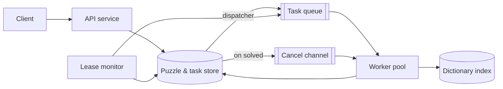

# Distributed Crossword Solver

[English](README.md) · [中文](README.zh.md)

<!-- meta:begin -->
| Type | Priority | Difficulty | Roles | Topics | Round |
| --- | --- | --- | --- | --- | --- |
| System design | ★★☆☆☆ | — | SWE · Infra Eng | distributed-search, backtracking, job-system | Onsite |
<!-- meta:end -->

## Problem

Design a backend that fills in crossword puzzles: given a board and a dictionary, place a word in
every slot so that every pair of crossing slots agrees on their shared letter, or determine that no
such placement exists. A puzzle arrives as an explicit list of slots — position, direction (across or
down), and length; the solver never sees the black-square grid that produced them, only the slots and
how they cross. A word may be used at most once across the whole grid; the same word may not fill two
different slots. Any clue text attached to a slot is metadata the solver ignores — any word of the
right length and letters is an acceptable fill.

Scale for this design:

- A board is about 50×50 cells with about 100 slots to fill; slot lengths range from 3 to 15 cells.
- The dictionary holds about 1,000,000 English words, grouped by length.
- 20,000 solve requests arrive per day on average, with submissions reaching 5x that average during a
  recurring one-hour peak (a nightly batch of newly authored puzzles, say).
- A solve attempt runs for at most 5 minutes (300 s) of wall-clock time; if no filling has been found
  by then, the service reports that it gave up, which is a different outcome from having proven that
  no filling exists.
- The service runs on a shared, elastic worker pool; a single puzzle may claim at most 64 workers at
  once, so many puzzles make progress concurrently without one puzzle starving the rest.

In scope: turning a puzzle's slots and the dictionary into one valid filling or a definitive "no
filling exists" / "gave up" result; splitting the search across the worker pool; pruning; rebalancing
load between workers; stopping every worker once any one of them finds a filling; tolerating a worker
crash or a coordinator failover without losing search progress or double-counting it; determining,
reliably, when no filling exists. Out of scope: generating the black-square layout itself; clue
authoring or mapping a clue's text to candidate answers; a UI for manually editing a filling; ranking
multiple valid fillings by quality (any valid filling is an acceptable answer).

Produce:

1. A requirements and scale estimate: why filling the board by brute force is infeasible on one
   machine, dictionary and index memory, worker pool size, and task-queue throughput.
2. A data model (puzzle, slot, task, worker) and 3-5 core APIs.
3. An architecture diagram and a walk-through of one puzzle along it.
4. Deep dives into: splitting the search into tasks and balancing load across workers; pruning and
   slot ordering, and how they interact with splitting; and fault tolerance — what happens when a
   worker or the coordinator crashes, and why the "no filling exists" conclusion stays correct. For
   each, compare at least two alternatives, say which you would pick, and state the cost.

## Reference solution

<details>
<summary>Show the reference solution</summary>

Worth confirming before designing: whether the grid is fully checked, i.e. every open cell belongs to
exactly one across slot and one down slot. This design assumes a fully checked grid, the standard
convention; an unchecked cell only removes some crossing constraints, a strict simplification of the
same problem.

### Requirements and scale

**Why one machine can't brute-force it.** Indexing the dictionary by length narrows a slot's candidates
from 1,000,000 words to those of its length — about 77,000 per length on average over 13 lengths, tens
of thousands mid-range, fewer only at the extremes. Even at a deliberately low floor of 300 candidates
for each of the ~100 slots, filling the board without checking any crossing has at least
$300^{100} \approx 10^{248}$ combinations: not a runtime estimate, just proof that per-slot filtering
alone gets nowhere near exhaustive search. The crossing-pruned tree is astronomically smaller, but
nothing bounds its size in advance, and proving that no filling exists means visiting all of it; the
design assumes a hard board outlasts one machine's five minutes, so the search must be both distributed
and pruned early.

**Dictionary and index memory.** At an assumed average word length of 7 letters, the raw dictionary,
as fixed-width records per length bucket, takes about $1{,}000{,}000 \times 7 = 7$ MB. The inverted index
keeps one dense bitmap per (length, position, letter), one bit per word of that length — 26 bits per
(word, position), so $26 \times 7{,}000{,}000 / 8 \approx 22.75$ MB — roughly 30 MB in all, small enough
for every worker to load a full local copy at startup: no sharding, no per-candidate network round trip.

**Solve-request rate and concurrency.** $20{,}000$ requests/day average to
$20{,}000 / 86{,}400 \approx 0.231$ requests/sec; at 5x that during the daily peak,
$\approx 1.157$ requests/sec — an hour at that rate is about 4,167 requests, comfortably inside the
daily total. Assume 90% of puzzles finish in about 15 s of search and the remaining 10% run the full
300 s give-up budget, for a weighted average solve time of $0.9 \times 15 + 0.1 \times 300 = 43.5$ s. By
Little's law, $L = \lambda W$: on average $\approx 10.1$ puzzles are being solved concurrently, at peak
$\approx 50.3$.

**Worker pool size.** The search is elastic — a hard puzzle will use every worker it is given, up to its
cap — so the pool size is a budget: allow 8 workers per active puzzle on average. At peak,
$50.3 \times 8 \approx 403$ workers are busy; with 20% headroom, rounded up to a multiple of the cap, the
pool is **512 workers** ($403 / 512 \approx 79\%$ utilized at peak). At full 64-worker fan-out for the
whole budget, one puzzle expands at most $64 \times 2{,}000 \times 300 = 38{,}400{,}000$ nodes (2,000
expansions/sec/worker is an assumption, not a measurement) — tens of millions, nowhere near the
$10^{248}$ floor above: distribution alone buys at most a factor of 64, and the rest closes only once
propagation collapses the branching factor.

**Task-queue throughput.** Assume a task lives about 0.5 s on average, claim to report, with a heartbeat
every 7 s: $403 / 0.5 \approx 806$ claims/sec, as many reports, and $403 / 7 \approx 58$ heartbeats/sec —
roughly 1,670 store writes/sec at peak, and at most about 265/sec for one 64-worker puzzle, whose rows
share a single partition. Task granularity is bound by per-task overhead — a round trip plus a
conditional write — against how little CPU one node expansion costs, not by aggregate throughput.

### Data model and API

**Puzzle** — `puzzle_id`, `width`, `height`, `dictionary_version`, `time_budget_seconds` (default 300),
`status` (`queued | solving | solved | unsat | timeout`), `generation` (bumped when the puzzle is solved
or times out; carried by every task so a stale worker can tell it should stop), `tasks_created`,
`tasks_finalized` (changed only by the writes that insert or finalize tasks), `solution` (nullable,
the finished `slot_id -> word` map), `created_at`, `updated_at`.

**Slot** — `slot_id`, `puzzle_id`, `start_row`, `start_col`, `direction` (`across | down`), `length`,
`crossings` (`[{other_slot_id, this_position, other_position}]`, computed once at submission).

**Task** — `task_id`, `puzzle_id`, `generation`, `assignment` (the full partial `{slot_id: word}` map
this task starts from — at most 100 entries, cheap to store whole), `slice` (`{slot_id, lo, hi}`:
candidates `lo` to `hi - 1` of that slot, in word-id order; empty for the root), `status`
(`ready | running | dead_end | split | solved`), `owner_worker_id`, `lease_expires_at`, `fencing_token`
(bumped by every claim, never reused), `parent_task_id`.

**Worker** — `worker_id`, `status` (`idle | busy`), `current_task_id`, `last_heartbeat_at`.

Core APIs — external:

1. `POST /puzzles` — `{width, height, slots, dictionary_version, time_budget_seconds}` →
   `{puzzle_id, status: "queued"}`; writes the `Puzzle`, its `Slot` rows, and a root `Task` with an
   empty assignment.
2. `GET /puzzles/{puzzle_id}` —
   `{status, elapsed_seconds, tasks_created, tasks_finalized, active_workers}`.
3. `GET /puzzles/{puzzle_id}/solution` — once `status = "solved"`, `{solution: [{slot_id, word}]}`.

Worker-facing — every call after `claim` carries the `fencing_token` it was issued; the store rejects a
write whose token isn't the task's current one, or whose task is no longer `running`, with a `409`:

4. `POST /workers/{worker_id}/claim` →
   `{task_id, generation, fencing_token, assignment, slice, split_into, deadline}`, or `204` if nothing is
   ready; `split_into` is how many more ready tasks the puzzle could use right now.
5. `POST /tasks/{task_id}/heartbeat` — `{fencing_token}` → `{lease_expires_at, stop: bool, split_into}`
   (`stop` once the puzzle's generation has advanced past the task's).
6. `POST /tasks/{task_id}/report` —
   `{fencing_token, outcome: "dead_end" | "solved" | "split", solution?, split?}`; a `split`
   (`{assignment, slot_id, ranges}`) finalizes the task and inserts one child per range in one
   transaction, the first already claimed by the reporter, whose new `task_id` and `fencing_token` it
   returns. A `solved` report is instead a compare-and-swap on the puzzle's `status`, whatever the token.

### Architecture



A submission is validated (slot bounds fit the board, crossings computed from shared cells) and written
as a `Puzzle` row, its `Slot` rows, and a root `Task` before the API acknowledges the client — a crash
between the two would otherwise let the client believe in a puzzle the store has no record of. A
background dispatcher turns `ready` tasks into entries in the task queue, a disposable index workers pull
from; the store stays authoritative. A worker claims a task, rebuilds its slice's candidates from the
local index, and searches depth-first, at each level taking the open slot with the fewest candidates and
skipping any candidate that would leave a crossing slot with none; whenever a claim or heartbeat reply
carries `split_into > 0`, it hands the untried candidates at the shallowest level of its DFS stack back
to the store as new tasks. Once a `solved` compare-and-swap succeeds, the puzzle's `generation` advances
and a cancel goes out on the puzzle's channel; workers check a local stop flag every few hundred
expansions, a missed message is caught by the next heartbeat (`stop: true`), and queued tasks can no
longer be claimed, since a claim requires the puzzle to be `solving`. Meanwhile the lease monitor
requeues any task whose lease expired without a heartbeat.

### Deep dives

**Task splitting and load balancing.** A task's assignment and slice carry everything a worker needs, so
no search state is shared; the question is when and where to cut a running search apart.

- *Split by candidate count*: split whenever the slot a task branches on has more candidates than a
  threshold. Simple, but candidate count is a poor proxy for subtree size: a fresh puzzle's first slot,
  with a whole length bucket of candidates, floods the queue with tasks that each do a handful of
  expansions, while a slot with three candidates can hide a subtree that keeps one worker busy for the
  whole budget as the rest sit idle.
- *Split on demand, at the shallowest untried level* (chosen): work stealing, with the store as
  go-between. A worker splits only when its puzzle has fewer ready tasks than workers it could still use
  (free workers in the pool, up to its 64 cap), a shortfall claim and heartbeat replies carry as
  `split_into`. It cuts the untried candidates at the shallowest level of its DFS stack — the largest
  unexplored subtrees, with the most open slots below — into at most `split_into` contiguous `[lo, hi)`
  slices; the same write finalizes its task and adds one more child for the branch it is in the middle
  of, handed back to it already claimed, so its search goes on without a pause.

Cost: an idle worker can wait up to one heartbeat interval (7 s) for work, and every claim rebuilds its
candidates, one AND per fixed crossing letter over the slot's length bucket (about 1,200 machine words
for 77,000 words, about a microsecond each). In exchange, the search is cut as finely as idle workers
require rather than by a guess at subtree size; the fan-out cap keeps one split from creating more ready
tasks than the puzzle can run at once, so the queue never floods; and the no-repeated-word rule needs no
shared registry, since excluding used ids takes only the task's own `assignment`.

**Pruning and slot ordering.** The board is a constraint satisfaction problem: variables are the slots,
a variable's domain is its length's words filtered to agree with every letter a crossing slot has
already fixed and to exclude used words, and a constraint ties two crossing slots to the same letter at
their shared cell.

- *Fixed order*: simple, but a large, lightly-constrained slot gets tried first purely by position,
  doing real work before ever reaching a slot that would fail immediately.
- *Most-constrained-variable, MRV* (chosen): recompute every remaining slot's candidate count and pick
  the smallest before each assignment, so a zero-candidate slot is pruned the moment it exists, not
  whenever a fixed order reaches it. Cost: at every node, one AND per fixed crossing letter for every
  open slot, each over that slot's length bucket — a few hundred bitmap operations for ~100 open slots.

Look-ahead is a separate axis: *plain backtracking* only checks a new word against already-fixed
crossings, discovering a starved neighbor only when its own turn comes up; *forward checking* (chosen)
checks every unassigned neighbor's count before committing and discards a candidate that would empty
one — exactly what MRV would catch one call later anyway, so it saves that recursive call, and its
candidate generation, per pruned branch. *Maintaining arc consistency* goes further, repeatedly
dropping from every open slot the words whose letter at a crossing no longer occurs among the crossing
slot's candidates. It sees a dead end two slots away before trying the candidates of the slot in
between, so it visits fewer nodes, but costs up to 52 bitmap operations per crossing per pass (an AND and an OR
per letter) instead of one; whether that pays off at 1,000,000 words needs measuring on real boards, so
the design starts from forward checking.

On one small, fully crossed 5×5 board with a synthetic 310-word dictionary, MRV with forward checking
visits 12.6x fewer nodes than a fixed interleaved order without it, all of it from MRV: once MRV is in
place, forward checking removes calls, not nodes. The ratio belongs to that board; eight dictionaries
built the same way give 9x to 19x.

**Fault tolerance and completeness.** Two invariants must hold under crashes: no subtree is silently
dropped, and "no filling exists" is declared only once every subtree has been explored.

- *Lease timeout alone*: the lease monitor requeues a task whose lease expired. Cheap, but a merely
  paused worker can still report later on a task a second worker has meanwhile claimed or finalized —
  one task's completion recorded twice, or a split's children created twice.
- *Fencing token on every write* (chosen): a claim is a compare-and-swap from `ready` to `running` that
  bumps `fencing_token`; a later write lands only while its token is current and the task `running`. A
  stale worker's report gets `409` and is discarded: its CPU is wasted, but re-exploring a subtree changes
  no count, because only one report per task can land.

Why "no filling exists" is then sound: the root covers the whole search space, and a split replaces a
task's unexplored part by children that partition it exactly, in the same transaction that marks the
parent `split`, so every unexplored part always belongs to a task still `ready` or `running`. Each
finalizing write adds one to `tasks_finalized` and lands at most once per task, so the counter counts
distinct tasks; the write that brings it level with `tasks_created` leaves no task open, and also moves
the puzzle from `solving` to `unsat` by compare-and-swap. Both conditions carry weight: finalizing a
parent before inserting its children lets the counters agree, briefly or after a crash, with the children
missing; and a second report counted for one task stands in for another still running. A puzzle's
counters and tasks share one partition, so each such write is a single-partition transaction.

The coordinator — dispatcher and lease monitor — keeps no state of its own: a replacement rebuilds the
queue from `ready` rows, and two instances overlapping during failover can at worst enqueue a task twice
or both requeue it, harmless because claim and requeue are compare-and-swaps on the task row. A `solved`
report instead wins on a puzzle-level compare-and-swap regardless of its token, once the store has
re-checked every crossing: a valid filling is valid whichever attempt found it. A crash-reassigned task
restarts from its `assignment` and `slice`, losing what its owner explored since claiming or last
splitting it. A puzzle that exhausts its budget first is marked `timeout`, not `unsat`, via the same
generation bump as a solved one: the two statuses tell a caller whether "no filling" was proven or merely
not disproven yet.

### Follow-ups

- Stochastic local search (simulated annealing, or a min-conflicts hill climb) run alongside the
  distributed search can find a filling faster on many satisfiable boards, but it never proves one
  unsatisfiable, so the exhaustive search still has to finish, or the budget expire, before the service
  reports "no filling exists."
- A task's candidate ranges are only meaningful against the exact dictionary index they were computed
  from, so `dictionary_version` is pinned at submission; a mid-solve swap would silently point old ranges
  at different words.
- The 64-worker cap only bounds one puzzle's claim; at peak, dozens of puzzles could each want that many
  at once, so sharing the pool fairly across puzzles, not just tasks within one, would need weighted
  scheduling by priority or age.
- A slot whose length has no words in the dictionary is rejected at submission with an immediate
  `unsat`, without creating a root task.

<details>
<summary>Estimate, solver and protocol checks (runnable)</summary>

```python
import math
import timeit

# ---- scale estimates, in the order they appear ----
assert round(100 * math.log10(300)) == 248  # 300**100 ~ 10**248
words, avg_len = 1_000_000, 7
assert round(words / 13) == 76_923  # average bucket over lengths 3..15
index_mb = 26 * words * avg_len / 8 / 1e6  # dense bitmaps: 26 bits per (word, position)
assert (index_mb, words * avg_len / 1e6 + index_mb) == (22.75, 29.75)

avg_rate = 20_000 / 86_400
peak_rate = 5 * avg_rate
assert (round(avg_rate, 3), round(peak_rate, 3), round(peak_rate * 3600)) == (0.231, 1.157, 4167)
avg_solve = 0.9 * 15 + 0.1 * 300  # assumed mix of solve times
L_avg, L_peak = avg_rate * avg_solve, peak_rate * avg_solve  # Little's law
assert (round(avg_solve, 1), round(L_avg, 1), round(L_peak, 1)) == (43.5, 10.1, 50.3)

busy = L_peak * 8  # budget: 8 workers per active puzzle
pool = math.ceil(busy * 1.2 / 64) * 64  # 20% headroom, rounded up to a multiple of the cap
assert (round(busy), pool, round(busy / pool, 2)) == (403, 512, 0.79)
assert 64 * 2_000 * 300 == 38_400_000  # nodes one puzzle can expand at the cap

ops = lambda n: n / 0.5 * 2 + n / 7  # claim + report per 0.5 s task, one heartbeat per 7 s
assert (round(ops(busy)), round(ops(64))) == (1669, 265)
assert round(77_000 / 64) == 1203  # 64-bit words in one bitmap of a 77,000-word bucket
a, b = (1 << 77_000) - 1, (1 << 76_999) - 3
and_sec = min(timeit.repeat(lambda: a & b, number=2000, repeat=3)) / 2000
assert and_sec < 1e-5  # one AND over the bucket: about a microsecond (bound left loose)
print("all scale numbers check out")
```

```python
import itertools
import random

# ---- dictionary, inverted index (int bitmasks), solvers on an n x n fully crossed board ----
LETTERS = "abcdefghijklmnopqrstuvwxyz"
WEIGHTS = [8.2, 1.5, 2.8, 4.3, 12.7, 2.2, 2.0, 6.1, 7.0, 0.15, 0.8, 4.0, 2.4,  # English
           6.7, 7.5, 1.9, 0.10, 6.0, 6.3, 9.1, 2.8, 1.0, 2.4, 0.15, 2.0, 0.07]


def make_dict(words):
    index = [{c: 0 for c in LETTERS} for _ in words[0]]
    for i, w in enumerate(words):
        for pos, c in enumerate(w):
            index[pos][c] |= 1 << i  # bit i set iff words[i][pos] == c
    return words, index, (1 << len(words)) - 1


def candidates(d, fixed, used):  # one AND per fixed letter, then drop used words
    m = d[2]
    for pos, c in fixed:
        m &= d[1][pos][c]
    return m & ~used


def candidates_scan(d, fixed, used):  # independent: test every word
    return sum(1 << i for i, w in enumerate(d[0])
               if not used >> i & 1 and all(w[p] == c for p, c in fixed))


def board(n):  # across i crosses down j at across position j / down position i
    cross = {("A", i): [(("D", j), j, i) for j in range(n)] for i in range(n)}
    cross.update({("D", j): [(("A", i), i, j) for i in range(n)] for j in range(n)})
    return [s for i in range(n) for s in (("A", i), ("D", i))], cross


def solve(d, cross, open_slots, mrv, fc, nodes, asg, used=0):
    if not open_slots:
        return dict(asg)
    fixed = lambda s: [(p, asg[o][q]) for o, p, q in cross[s] if o in asg]
    masks = {s: candidates(d, fixed(s), used) for s in (open_slots if mrv else open_slots[:1])}
    slot = min(masks, key=lambda s: masks[s].bit_count())  # MRV; without it: fixed order
    rest = [s for s in open_slots if s != slot]
    m = masks[slot]
    while m:
        wid = (m & -m).bit_length() - 1
        m &= m - 1
        nodes[0] += 1
        asg[slot] = d[0][wid]
        u = used | 1 << wid
        # forward checking: every open crossing slot must keep at least one candidate
        if not fc or all(candidates(d, fixed(o), u) for o, _, _ in cross[slot] if o in rest):
            r = solve(d, cross, rest, mrv, fc, nodes, asg, u)
            if r is not None:
                return r
        del asg[slot]
    return None


def valid(sol, words, cross):  # straight from the problem statement
    return (all(sol[s][p] == sol[o][q] for s in cross for o, p, q in cross[s])
            and set(sol.values()) <= set(words) and len(set(sol.values())) == len(sol))


def brute_force_sat(words, n):  # independent: every choice of across words, read off the downs
    for rows in itertools.permutations(words, n):
        cols = ["".join(r[j] for r in rows) for j in range(n)]
        if set(cols) <= set(words) and len(set(rows) | set(cols)) == 2 * n:
            return True
    return False


# completeness on random 3x3 boards (a 3-letter alphabet makes both outcomes common)
rng = random.Random(3)
slots3, cross3 = board(3)
seen = {True: 0, False: 0}
for _ in range(200):
    words = rng.sample(["".join(t) for t in itertools.product("abc", repeat=3)], rng.randint(6, 12))
    d, truth = make_dict(words), brute_force_sat(words, 3)
    seen[truth] += 1
    for mrv, fc in ((False, False), (True, False), (True, True)):
        sol = solve(d, cross3, slots3, mrv, fc, [0], {})
        assert (sol is not None) == truth and (sol is None or valid(sol, words, cross3))
    for _ in range(5):  # index intersection vs. scan
        fixed = [(p, rng.choice("abc")) for p in rng.sample(range(3), rng.randint(0, 3))]
        used = rng.getrandbits(len(words))
        assert candidates(d, fixed, used) == candidates_scan(d, fixed, used)
assert min(seen.values()) >= 40, seen
print(f"3x3 completeness vs brute force: {seen[True]} satisfiable, {seen[False]} unsatisfiable, all agree")


def planted_dict(seed, n=5, noise=300):  # a planted word square plus random 5-letter words
    rng = random.Random(20260921 + seed)
    while True:
        g = "".join(rng.choices(LETTERS, weights=WEIGHTS, k=n * n))
        planted = [g[i * n:i * n + n] for i in range(n)] + [g[j::n] for j in range(n)]
        if len(set(planted)) == 2 * n:
            break
    rng, words = random.Random(8 + seed), list(planted)
    while len(words) < noise + 2 * n:
        w = "".join(rng.choices(LETTERS, weights=WEIGHTS, k=n))
        if w not in words:
            words.append(w)
    rng.shuffle(words)
    return make_dict(words)


# node counts on 5x5 boards: fixed interleaved order (A0, D0, A1, ...) vs. MRV (+ FC)
slots5, cross5 = board(5)
ratios = []
for seed in range(8):
    d = planted_dict(seed)
    counts = []
    for mrv, fc in ((False, False), (True, False), (True, True)):
        nodes = [0]
        sol = solve(d, cross5, slots5, mrv, fc, nodes, {})
        assert sol is not None and valid(sol, d[0], cross5)
        counts.append(nodes[0])
    assert counts[1] == counts[2]  # under MRV, forward checking saves calls, not nodes
    ratios.append(counts[0] / counts[2])
print("fixed order / MRV + FC, 8 dictionaries:", [round(r, 1) for r in ratios])
assert round(ratios[0], 1) == 12.6 and 8.5 < min(ratios) and max(ratios) < 20
```

```python
# ---- protocol model: tasks cover leaves [lo, hi); 2 workers claim (CAS, token + 1), examine a
# leaf per step, split (children: front one kept, already claimed), crash at any step; any lease
# may expire at any time (with a live owner that is a pause, counted as a fault) ----
def violation(L, sol, faults, fence=True, atomic=True):
    init = (((0, L, "r", 0),), 0, "S", (None, None), 0, faults)
    seen, todo, stale = {init}, [init], 0
    while todo:
        T, fin, st, W, ex, f = todo.pop()
        if st == "U" and (ex != 2**L - 1 or sol is not None):
            return "unsat before every leaf was examined"
        if st != "S":
            continue
        out = []

        def final(t, kids=()):  # finalize t, insert its children, maybe declare unsat: one write
            T2 = T[:t] + (T[t][:2] + ("F", T[t][3]),) + T[t + 1:] + kids
            return T2, fin + 1, "U" if fin + 1 == len(T2) else "S"

        live = {c[:2] for c in W if c}
        for t, (lo, hi, s, k) in enumerate(T):
            if s == "R" and (f or (t, k) not in live):  # lease expiry
                out.append((T[:t] + ((lo, hi, "r", k),) + T[t + 1:], fin, st, W, ex, f - ((t, k) in live)))
        for w, c in enumerate(W):
            def go(c2, T2=T, fin2=fin, st2=st, ex2=ex, f2=f):
                out.append((T2, fin2, st2, W[:w] + (c2,) + W[w + 1:], ex2, f2))
            if c is None:
                for t, (lo, hi, s, k) in enumerate(T):
                    if s == "r":
                        go((t, k + 1, lo, hi), T[:t] + ((lo, hi, "R", k + 1),) + T[t + 1:])
                continue
            if f:
                go(None, f2=f - 1)  # crash: local state lost, the task stays running
            t, k, a, b = c
            if t == "P":  # atomic=False only: a second write inserts the children
                go((len(T), 1, a, k), T + ((a, k, "R", 1), (k, b, "r", 0)))
                continue
            ok = T[t][2:] == ("R", k) or not fence
            stale += not ok
            if a < b and a == sol:
                out.append((T, fin, "D", W, ex | 1 << a, f))  # solved: CAS on the puzzle
            elif a < b:
                go((t, k, a + 1, b), ex2=ex | 1 << a)
            else:
                go(None, *final(t)) if ok else go(None)  # dead end, or 409
            if b - a >= 2:
                m = (a + b) // 2
                if not ok:
                    go(None)
                elif atomic:
                    go((len(T), 1, a, m), *final(t, ((a, m, "R", 1), (m, b, "r", 0))))
                else:
                    go(("P", m, a, b), *final(t))
        if not out:
            return "stuck without a verdict"
        for s2 in out:
            if s2 not in seen:
                seen.add(s2)
                todo.append(s2)
    assert stale > 0 and len(seen) > 1000  # stale writes really happened
    return None


for L, faults in ((3, 2), (4, 2)):
    for sol in (None, 0, L - 1):  # no filling, or one at the first or last leaf
        assert violation(L, sol, faults) is None
# negative controls: unconditional reports; finalizing the parent before inserting children
assert violation(3, None, 1, fence=False) and violation(3, None, 0, atomic=False)
print("protocol model: no early unsat, always a verdict; both negative controls fail")
```

</details>

</details>
