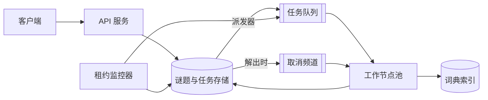

# 分布式填字游戏求解器

[English](README.md) · [中文](README.zh.md)

<!-- meta:begin -->
| 题型 | 优先级 | 难度 | 岗位 | 考点 | 轮次 |
| --- | --- | --- | --- | --- | --- |
| 系统设计 | ★★☆☆☆ | — | SWE · Infra Eng | distributed-search, backtracking, job-system | 现场面 |
<!-- meta:end -->

## 题目

设计一个求解填字游戏的服务：给定一个棋盘和一个词典，为每个槽位填入一个单词，使得每一对相交槽位在共用格子上的字母一致，或者判定不存在这样的填法。一个谜题以一份显式的槽位列表给出——位置、方向（横向或纵向）、长度——不管产生这些槽位的黑格布局是什么样子；求解器看不到棋盘本身，只看到槽位以及它们如何相交。同一个单词在整个棋盘里最多只能用一次；不能有两个不同的槽位填同一个单词。槽位上附带的提示文字（如果有）只是求解器忽略的元数据——只要长度和字母都对得上，任何单词都是可以接受的填法。

这次设计的规模：

- 棋盘大约 50×50 格，大约有 100 个待填的槽位；槽位长度从 3 到 15 格不等。
- 词典大约有 1,000,000 个英文单词，按长度分组。
- 平均每天有 20,000 次求解请求，在一个反复出现的一小时高峰期内，提交量会达到日均值的 5 倍（比如每晚一批新出的谜题）。
- 一次求解尝试最多运行 5 分钟（300 秒）的墙钟时间；如果到时还没找到填法，服务会报告自己放弃了——这和“已经证明不存在填法”是两种不同的结果。
- 服务运行在一个共享的、可伸缩的工作节点池上；单个谜题最多可以占用 64 个工作节点，这样很多谜题可以同时取得进展，不会有一个谜题把其余谜题饿死。

范围内：把一个谜题的槽位和词典变成一个有效填法，或者一个确定的“不存在填法”/“放弃”结果；把搜索拆分给工作节点池；剪枝；在工作节点之间重新平衡负载；一旦有工作节点找到填法就让所有节点停下来；容忍工作节点崩溃或协调者故障切换，而不丢失搜索进度、也不重复计数；可靠地判定何时不存在填法。范围外：黑格布局本身的生成；提示文字的撰写，或把提示文字映射到候选答案；手动编辑填法的界面；按质量给多个有效填法排序（任何一个有效填法都是可接受的答案）。

要产出：

1. 需求与规模估算：为什么在一台机器上暴力填棋盘不可行、词典与索引占用的内存、工作节点池大小、任务队列吞吐。
2. 数据模型（谜题、槽位、任务、工作节点）与 3 到 5 个核心接口。
3. 一张架构图，并沿着一个谜题把整条路径走一遍。
4. 深入讨论：把搜索拆成任务、在工作节点间平衡负载；剪枝与槽位顺序，以及它们与任务拆分的相互作用；容错——工作节点或协调者崩溃时会发生什么，以及为什么“不存在填法”这个结论仍然站得住。每个话题至少比较两种方案，说明选哪个，并给出这个选择的代价。

## 参考解答

<details>
<summary>展开参考解答</summary>

动手设计之前值得先确认：这个棋盘是否“全交叉”，即每个空格都同时属于一个横向槽位和一个纵向槽位。下面的设计假设棋盘全交叉，这是标准约定；一个非全交叉格只是少了一些交叉约束，是同一个问题的严格简化版本。

### 需求与规模

**为什么单机跑不动暴力搜索。** 按长度对词典建索引，能把一个槽位的候选词从 1,000,000 个缩小到与它长度相同的那些——13 种长度平均每种约 77,000 个，中等长度的有几万个，只有两端的长度少一些。即便取一个刻意压低的下限，假设约 100 个槽位每个只有 300 个候选词，不检查任何一处交叉就填满棋盘的组合也至少有 $300^{100} \approx 10^{248}$ 种：这不是运行时间的估计，只是说明单靠按槽位过滤，离穷举搜索还差得太远。交叉约束剪枝之后的搜索树要小得多，但它的大小事先没有任何上界，而证明不存在填法必须把它整棵走完；所以这个设计假设难的棋盘在一台机器的五分钟内搜不完，搜索既要分布出去，也要尽早剪枝。

**词典与索引的内存。** 假设单词平均长 7 个字母，原始词典按长度分桶、每桶存成定长记录，大约占 $1{,}000{,}000 \times 7 = 7$ MB。倒排索引为每个（长度，位置，字母）存一张稠密位图，该长度的每个单词占一位——相当于每个（单词，位置）占 26 位，共 $26 \times 7{,}000{,}000 / 8 \approx 22.75$ MB，合计约 30 MB，小到每个工作节点都能在启动时加载一份完整的本地副本：不需要分片，也不需要为每个候选词发一次网络请求。

**求解请求速率与并发度。** 每天 $20{,}000$ 次请求，平均约 $20{,}000 / 86{,}400 \approx 0.231$ 次/秒；日高峰期是这个速率的 5 倍，约 $1.157$ 次/秒——按这个速率一小时大约 4,167 次请求，完全落在当日总量以内。假设 90% 的谜题在约 15 秒的搜索内结束，剩下 10% 跑满 300 秒的放弃预算，加权平均求解时间为 $0.9 \times 15 + 0.1 \times 300 = 43.5$ 秒。按 Little 定律，$L = \lambda W$：平均同时有约 10.1 个谜题在求解，高峰期约 50.3 个。

**工作节点池大小。** 搜索是有弹性的——难的谜题给多少工作节点就用多少，直到上限——所以池的大小是一笔预算：按每个正在求解的谜题平均 8 个工作节点来配。高峰期约有 $50.3 \times 8 \approx 403$ 个工作节点忙碌；留 20% 余量，再向上取整到上限的整数倍，工作节点池定为 **512 个节点**（高峰期利用率约 $403 / 512 \approx 79\%$）。在整个预算期内以满额 64 个节点展开，一个谜题最多能展开 $64 \times 2{,}000 \times 300 = 38{,}400{,}000$ 个节点（每个工作节点每秒 2,000 次节点展开是一个假设，不是实测值）——几千万个，与上面 $10^{248}$ 的下限相差悬殊：分布式本身最多只换来 64 倍，剩下的缺口只能靠约束传播把分支因子压下去。

**任务队列吞吐。** 假设一个任务从被领取到上报平均存活约 0.5 秒，心跳间隔 7 秒：大约 $403 / 0.5 \approx 806$ 次领取/秒，同样多的上报，以及 $403 / 7 \approx 58$ 次心跳/秒——高峰期存储每秒约 1,670 次写入；单个 64 节点的谜题最多约每秒 265 次，它的所有行都在同一个分区里。任务粒度真正受限的是单次任务的开销——一次网络往返加一次条件写入——相对于一次节点展开多么廉价，而不是聚合吞吐。

### 数据模型与 API

**Puzzle（谜题）**——`puzzle_id`、`width`、`height`、`dictionary_version`、`time_budget_seconds`（默认 300）、`status`（`queued | solving | solved | unsat | timeout`）、`generation`（谜题被解出或超时时自增；每个任务都带着它，好让过期的工作节点知道自己该停下）、`tasks_created`、`tasks_finalized`（只在插入或敲定任务的那次写入里变动）、`solution`（可空，最终的 `slot_id -> word` 映射）、`created_at`、`updated_at`。

**Slot（槽位）**——`slot_id`、`puzzle_id`、`start_row`、`start_col`、`direction`（`across | down`）、`length`、`crossings`（`[{other_slot_id, this_position, other_position}]`，提交时一次性算好）。

**Task（任务）**——`task_id`、`puzzle_id`、`generation`、`assignment`（这个任务出发时的完整局部赋值 `{slot_id: word}`——最多 100 项，整份存下也很便宜）、`slice`（`{slot_id, lo, hi}`：该槽位按单词 id 排序的候选词中第 `lo` 到第 `hi - 1` 个；根任务为空）、`status`（`ready | running | dead_end | split | solved`）、`owner_worker_id`、`lease_expires_at`、`fencing_token`（每次领取都自增，绝不重用）、`parent_task_id`。

**Worker（工作节点）**——`worker_id`、`status`（`idle | busy`）、`current_task_id`、`last_heartbeat_at`。

核心接口——外部：

1. `POST /puzzles` —— `{width, height, slots, dictionary_version, time_budget_seconds}` → `{puzzle_id, status: "queued"}`；写入 `Puzzle`、它的 `Slot` 行，以及一个赋值为空的根 `Task`。
2. `GET /puzzles/{puzzle_id}` —— `{status, elapsed_seconds, tasks_created, tasks_finalized, active_workers}`。
3. `GET /puzzles/{puzzle_id}/solution` —— 一旦 `status = "solved"`，返回 `{solution: [{slot_id, word}]}`。

面向工作节点——`claim` 之后的每次调用都带着当时拿到的隔离令牌（fencing token）`fencing_token`；令牌与任务当前值不符、或任务已不处于 `running` 的写入，存储会返回 `409`：

4. `POST /workers/{worker_id}/claim` → `{task_id, generation, fencing_token, assignment, slice, split_into, deadline}`，没有可领取的任务则返回 `204`；`split_into` 是这个谜题此刻还缺几个就绪任务。
5. `POST /tasks/{task_id}/heartbeat` —— `{fencing_token}` → `{lease_expires_at, stop: bool, split_into}`（一旦谜题的 generation 超过了这个任务的，`stop` 就为真）。
6. `POST /tasks/{task_id}/report` —— `{fencing_token, outcome: "dead_end" | "solved" | "split", solution?, split?}`；一次 `split`（`{assignment, slot_id, ranges}`）在同一个事务里敲定这个任务、为每段区间插入一个子任务，其中第一个已经由上报者领取，响应返回它的新 `task_id` 和 `fencing_token`。`solved` 上报则不同，它是对谜题 `status` 的一次比较后交换，不管令牌是什么。

### 架构



一次提交先经过校验（槽位边界要落在棋盘内，交叉关系由共用格子算出），写成一行 `Puzzle`、它的 `Slot` 行和一个根 `Task`，之后 API 才应答客户端——否则两步之间一旦崩溃，客户端会以为谜题已经存在，存储里却没有记录。后台派发器把 `ready` 状态的任务变成任务队列里的条目，队列只是一份可以丢弃的索引，供工作节点拉取；权威的始终是存储。工作节点领取一个任务，从本地索引重建它那段切片的候选词，然后深度优先地搜索：每一层取候选词最少的未填槽位，跳过会让某个交叉槽位一个候选词都不剩的词；只要领取或心跳的响应里 `split_into > 0`，它就把 DFS 栈最浅一层里还没试过的候选词作为新任务交回存储。一旦某次 `solved` 的比较后交换成功，谜题的 `generation` 自增，并在这个谜题的频道上发出取消消息；工作节点每展开几百个节点检查一次本地的停止标志，漏收的消息由下一次心跳补上（`stop: true`），队列里的任务也再领不走，因为领取要求谜题仍处于 `solving`。与此同时，租约监控器把租约到期却没收到心跳的任务重新放回队列。

### 深入话题

**任务拆分与负载均衡。** 一个任务的赋值和切片已经带着工作节点需要的一切，没有共享的搜索状态；要决定的是何时、从哪里把一个正在进行的搜索切开。

- *按候选词数拆分*：任务要分支的那个槽位候选词数一超过阈值就拆。做法简单，但候选词数很难反映子树大小：新谜题的第一个槽位有整整一个长度桶的候选词，会让队列塞满各自只做几次节点展开的任务；而一个只有三个候选词的槽位，下面可能藏着一棵能让一个工作节点忙满整个预算的子树，其余节点却闲着。
- *按需拆分，从最浅的未尝试层切*（选择的方案）：一种以存储为中介的工作窃取（work stealing）。只有当谜题的就绪任务少于它还能用上的工作节点数（池里的空闲节点，最多到 64 个的上限）时，工作节点才拆分；领取和心跳的响应用 `split_into` 带回这个缺口。它把 DFS 栈最浅一层里还没试过的候选词——下面剩的未填槽位最多，是最大的未探索子树——切成至多 `split_into` 段连续的 `[lo, hi)` 切片；同一次写入敲定它的任务，并为它正在探索的那个分支再加一个子任务，直接交还给它、已处于领取状态，所以它的搜索不必停顿。

代价：空闲的工作节点最多要等一个心跳间隔（7 秒）才分到活；每次领取都要重建候选词，每个已定下的交叉字母对该槽位的长度桶做一次按位与（77,000 个词约 1,200 个机器字，每次约一微秒）。换来的是：切多细取决于实际有多少空闲节点，而不是对子树大小的猜测；扇出上限保证一次拆分不会造出比这个谜题同时能跑的更多的就绪任务，队列不会被淹没；“单词不能重复使用”这条规则也不需要共享的登记表，排除用过的词 id 只需要任务自己的 `assignment`。

**剪枝与槽位顺序。** 整个棋盘是一个约束满足问题（constraint satisfaction problem）：变量是各个槽位，一个变量的取值域是它那个长度的词，按每个交叉槽位已定下的字母过滤过，并排除了用过的词；约束则要求两个相交的槽位在共用格子上是同一个字母。

- *固定槽位顺序*：做法简单，但一个取值域巨大、几乎没受约束的槽位，只因为位置靠前就会被先尝试，在碰到一个本该立刻失败的槽位之前白白做了不少工作。
- *最受约束变量优先*（MRV，选择的方案）：每次赋值前重新数一遍每个剩余槽位的候选词数，挑最少的那个——候选词数归零的槽位一出现就被剪掉，而不是等固定顺序轮到它。代价：每个节点都要为每个未填槽位、按它每个已定下的交叉字母做一次按位与，每次都覆盖该槽位的整个长度桶——约 100 个未填槽位就是每个节点几百次位图运算。

前瞻是与顺序正交的另一个维度：*朴素回溯* 只拿新词和已经定下的交叉字母核对，要等那个被饿死的邻居轮到自己时才发现它已经无词可填；*前向检查*（forward checking，选择的方案）在定下一个候选词之前，先检查每个尚未赋值的邻居是否还有候选词，会清空某个邻居的候选就直接丢弃——这正是 MRV 下一次调用本来就会抓到的死路，所以它省下的是每条被剪掉的分支上那一次递归调用，以及其中的候选词生成。*维护弧一致性*（maintaining arc consistency）走得更远：反复从每个未填槽位里删掉这样的词——它在某个交叉格上的字母，已经不出现在交叉槽位的任何候选词里。它能在逐个尝试中间那个槽位的候选词之前，就看出两个槽位之外的死路，所以访问的节点更少，但每个交叉每一轮最多要做 52 次位图运算（每个字母一次按位与、一次按位或），而不是一次；在 1,000,000 个词的规模上是否划算，要在真实棋盘上实测才知道，所以这个设计先用前向检查。

在一个小型的、全交叉的 5×5 棋盘上，配一份自造的 310 词词典，MRV 加前向检查访问的节点数比不做前向检查的固定交替顺序少 12.6 倍，而且全部来自 MRV：有了 MRV，前向检查省掉的是调用，不是节点。这个倍数只属于那个棋盘；同样方法生成的八份词典给出 9 到 19 倍。

**容错与完备性。** 就算发生崩溃，也有两件事必须成立：没有子树被悄无声息地丢掉，而且“不存在填法”只有在每棵子树都探索过之后才能宣布。

- *只靠租约超时*：租约监控器把租约到期的任务重新放回队列。做法便宜，但一个只是暂停了的工作节点，之后仍可能为一个已经被第二个节点领走、甚至已经敲定的任务上报结果——同一个任务的完成被记两次，或者一次拆分的子任务被建两份。
- *每次写入都带隔离令牌*（选择的方案）：领取是一次从 `ready` 到 `running` 的比较后交换，同时把 `fencing_token` 加一；之后的写入只有在令牌仍是当前值、任务仍处于 `running` 时才生效。过期节点的上报拿到 `409` 而被丢弃：它花掉的 CPU 白费了，但重新探索一棵子树不会改变任何计数，因为每个任务只有一份上报能生效。

为什么“不存在填法”这时是可靠的：根任务覆盖整个搜索空间；一次拆分把一个任务尚未探索的部分换成恰好划分它的子任务，而且与把父任务标为 `split` 在同一个事务里完成，所以任何尚未探索的部分，始终属于某个仍处于 `ready` 或 `running` 的任务。每次敲定都让 `tasks_finalized` 加一，并且每个任务至多成功一次，所以这个计数器数的是不同的任务；让它追平 `tasks_created` 的那次写入意味着没有任务还开着，这次写入同时用比较后交换把谜题从 `solving` 改成 `unsat`。两个条件都不可少：先敲定父任务、再插入子任务，计数器会在两步之间（或者两步之间崩溃之后）显得一致，而子任务并不存在；同一个任务被多计的一次敲定，会顶替另一个仍在运行的任务。一个谜题的计数器和任务都在同一个分区里，所以这些写入都是单分区事务。

协调者——派发器和租约监控器——自身不保存状态：替补实例从 `ready` 行重建队列；故障切换期间两个实例同时在跑，最坏也只是把一个任务入队两次，或者都去重新入队同一个任务，这无伤大雅，因为领取和重新入队都是对任务行的比较后交换。`solved` 上报则不同，它靠谜题这一级的比较后交换生效，不管令牌是否最新，只要存储重新核对过每一个交叉：一个有效的填法，不管是哪次尝试找到的都有效。因崩溃被重新分配的任务从它的 `assignment` 和 `slice` 重新开始，损失的是原来的节点自领取或上次拆分以来探索过的部分。预算先耗尽的谜题被标为 `timeout` 而不是 `unsat`，走的是与已解出的谜题同一套 generation 自增：这两种状态告诉调用方，“不存在填法”是被证明了，还是只是还没被证伪。

### 追问

- 随机化局部搜索（模拟退火，或者最小冲突爬山法）和分布式搜索并行跑，能在许多有解的棋盘上更快找到一个填法，但它永远无法证明一个棋盘无解，所以穷举搜索仍然要跑完，或者预算耗尽，服务才能报告“不存在填法”。
- 一个任务的候选词区间，只有对着算出它时那个确切的词典索引版本才有意义，所以 `dictionary_version` 在提交时就被固定下来；求解途中换一份词典，会让原来的区间悄悄指向别的词。
- 64 个工作节点的上限只管住单个谜题能占用多少；高峰期可能有几十个谜题同时在求解，都想要这么多节点，所以要在多个谜题之间（而不只是一个谜题内部的多个任务之间）公平分享工作节点池，还需要按优先级或等待时长做加权调度。
- 如果某个槽位的长度在词典里一个词都没有，提交时就直接判定 `unsat`，不创建根任务。

<details>
<summary>估算、求解器与协议核对（可运行）</summary>

```python
import math
import timeit

# ---- scale estimates, in the order they appear ----
assert round(100 * math.log10(300)) == 248  # 300**100 ~ 10**248
words, avg_len = 1_000_000, 7
assert round(words / 13) == 76_923  # average bucket over lengths 3..15
index_mb = 26 * words * avg_len / 8 / 1e6  # dense bitmaps: 26 bits per (word, position)
assert (index_mb, words * avg_len / 1e6 + index_mb) == (22.75, 29.75)

avg_rate = 20_000 / 86_400
peak_rate = 5 * avg_rate
assert (round(avg_rate, 3), round(peak_rate, 3), round(peak_rate * 3600)) == (0.231, 1.157, 4167)
avg_solve = 0.9 * 15 + 0.1 * 300  # assumed mix of solve times
L_avg, L_peak = avg_rate * avg_solve, peak_rate * avg_solve  # Little's law
assert (round(avg_solve, 1), round(L_avg, 1), round(L_peak, 1)) == (43.5, 10.1, 50.3)

busy = L_peak * 8  # budget: 8 workers per active puzzle
pool = math.ceil(busy * 1.2 / 64) * 64  # 20% headroom, rounded up to a multiple of the cap
assert (round(busy), pool, round(busy / pool, 2)) == (403, 512, 0.79)
assert 64 * 2_000 * 300 == 38_400_000  # nodes one puzzle can expand at the cap

ops = lambda n: n / 0.5 * 2 + n / 7  # claim + report per 0.5 s task, one heartbeat per 7 s
assert (round(ops(busy)), round(ops(64))) == (1669, 265)
assert round(77_000 / 64) == 1203  # 64-bit words in one bitmap of a 77,000-word bucket
a, b = (1 << 77_000) - 1, (1 << 76_999) - 3
and_sec = min(timeit.repeat(lambda: a & b, number=2000, repeat=3)) / 2000
assert and_sec < 1e-5  # one AND over the bucket: about a microsecond (bound left loose)
print("all scale numbers check out")
```

```python
import itertools
import random

# ---- dictionary, inverted index (int bitmasks), solvers on an n x n fully crossed board ----
LETTERS = "abcdefghijklmnopqrstuvwxyz"
WEIGHTS = [8.2, 1.5, 2.8, 4.3, 12.7, 2.2, 2.0, 6.1, 7.0, 0.15, 0.8, 4.0, 2.4,  # English
           6.7, 7.5, 1.9, 0.10, 6.0, 6.3, 9.1, 2.8, 1.0, 2.4, 0.15, 2.0, 0.07]


def make_dict(words):
    index = [{c: 0 for c in LETTERS} for _ in words[0]]
    for i, w in enumerate(words):
        for pos, c in enumerate(w):
            index[pos][c] |= 1 << i  # bit i set iff words[i][pos] == c
    return words, index, (1 << len(words)) - 1


def candidates(d, fixed, used):  # one AND per fixed letter, then drop used words
    m = d[2]
    for pos, c in fixed:
        m &= d[1][pos][c]
    return m & ~used


def candidates_scan(d, fixed, used):  # independent: test every word
    return sum(1 << i for i, w in enumerate(d[0])
               if not used >> i & 1 and all(w[p] == c for p, c in fixed))


def board(n):  # across i crosses down j at across position j / down position i
    cross = {("A", i): [(("D", j), j, i) for j in range(n)] for i in range(n)}
    cross.update({("D", j): [(("A", i), i, j) for i in range(n)] for j in range(n)})
    return [s for i in range(n) for s in (("A", i), ("D", i))], cross


def solve(d, cross, open_slots, mrv, fc, nodes, asg, used=0):
    if not open_slots:
        return dict(asg)
    fixed = lambda s: [(p, asg[o][q]) for o, p, q in cross[s] if o in asg]
    masks = {s: candidates(d, fixed(s), used) for s in (open_slots if mrv else open_slots[:1])}
    slot = min(masks, key=lambda s: masks[s].bit_count())  # MRV; without it: fixed order
    rest = [s for s in open_slots if s != slot]
    m = masks[slot]
    while m:
        wid = (m & -m).bit_length() - 1
        m &= m - 1
        nodes[0] += 1
        asg[slot] = d[0][wid]
        u = used | 1 << wid
        # forward checking: every open crossing slot must keep at least one candidate
        if not fc or all(candidates(d, fixed(o), u) for o, _, _ in cross[slot] if o in rest):
            r = solve(d, cross, rest, mrv, fc, nodes, asg, u)
            if r is not None:
                return r
        del asg[slot]
    return None


def valid(sol, words, cross):  # straight from the problem statement
    return (all(sol[s][p] == sol[o][q] for s in cross for o, p, q in cross[s])
            and set(sol.values()) <= set(words) and len(set(sol.values())) == len(sol))


def brute_force_sat(words, n):  # independent: every choice of across words, read off the downs
    for rows in itertools.permutations(words, n):
        cols = ["".join(r[j] for r in rows) for j in range(n)]
        if set(cols) <= set(words) and len(set(rows) | set(cols)) == 2 * n:
            return True
    return False


# completeness on random 3x3 boards (a 3-letter alphabet makes both outcomes common)
rng = random.Random(3)
slots3, cross3 = board(3)
seen = {True: 0, False: 0}
for _ in range(200):
    words = rng.sample(["".join(t) for t in itertools.product("abc", repeat=3)], rng.randint(6, 12))
    d, truth = make_dict(words), brute_force_sat(words, 3)
    seen[truth] += 1
    for mrv, fc in ((False, False), (True, False), (True, True)):
        sol = solve(d, cross3, slots3, mrv, fc, [0], {})
        assert (sol is not None) == truth and (sol is None or valid(sol, words, cross3))
    for _ in range(5):  # index intersection vs. scan
        fixed = [(p, rng.choice("abc")) for p in rng.sample(range(3), rng.randint(0, 3))]
        used = rng.getrandbits(len(words))
        assert candidates(d, fixed, used) == candidates_scan(d, fixed, used)
assert min(seen.values()) >= 40, seen
print(f"3x3 completeness vs brute force: {seen[True]} satisfiable, {seen[False]} unsatisfiable, all agree")


def planted_dict(seed, n=5, noise=300):  # a planted word square plus random 5-letter words
    rng = random.Random(20260921 + seed)
    while True:
        g = "".join(rng.choices(LETTERS, weights=WEIGHTS, k=n * n))
        planted = [g[i * n:i * n + n] for i in range(n)] + [g[j::n] for j in range(n)]
        if len(set(planted)) == 2 * n:
            break
    rng, words = random.Random(8 + seed), list(planted)
    while len(words) < noise + 2 * n:
        w = "".join(rng.choices(LETTERS, weights=WEIGHTS, k=n))
        if w not in words:
            words.append(w)
    rng.shuffle(words)
    return make_dict(words)


# node counts on 5x5 boards: fixed interleaved order (A0, D0, A1, ...) vs. MRV (+ FC)
slots5, cross5 = board(5)
ratios = []
for seed in range(8):
    d = planted_dict(seed)
    counts = []
    for mrv, fc in ((False, False), (True, False), (True, True)):
        nodes = [0]
        sol = solve(d, cross5, slots5, mrv, fc, nodes, {})
        assert sol is not None and valid(sol, d[0], cross5)
        counts.append(nodes[0])
    assert counts[1] == counts[2]  # under MRV, forward checking saves calls, not nodes
    ratios.append(counts[0] / counts[2])
print("fixed order / MRV + FC, 8 dictionaries:", [round(r, 1) for r in ratios])
assert round(ratios[0], 1) == 12.6 and 8.5 < min(ratios) and max(ratios) < 20
```

```python
# ---- protocol model: tasks cover leaves [lo, hi); 2 workers claim (CAS, token + 1), examine a
# leaf per step, split (children: front one kept, already claimed), crash at any step; any lease
# may expire at any time (with a live owner that is a pause, counted as a fault) ----
def violation(L, sol, faults, fence=True, atomic=True):
    init = (((0, L, "r", 0),), 0, "S", (None, None), 0, faults)
    seen, todo, stale = {init}, [init], 0
    while todo:
        T, fin, st, W, ex, f = todo.pop()
        if st == "U" and (ex != 2**L - 1 or sol is not None):
            return "unsat before every leaf was examined"
        if st != "S":
            continue
        out = []

        def final(t, kids=()):  # finalize t, insert its children, maybe declare unsat: one write
            T2 = T[:t] + (T[t][:2] + ("F", T[t][3]),) + T[t + 1:] + kids
            return T2, fin + 1, "U" if fin + 1 == len(T2) else "S"

        live = {c[:2] for c in W if c}
        for t, (lo, hi, s, k) in enumerate(T):
            if s == "R" and (f or (t, k) not in live):  # lease expiry
                out.append((T[:t] + ((lo, hi, "r", k),) + T[t + 1:], fin, st, W, ex, f - ((t, k) in live)))
        for w, c in enumerate(W):
            def go(c2, T2=T, fin2=fin, st2=st, ex2=ex, f2=f):
                out.append((T2, fin2, st2, W[:w] + (c2,) + W[w + 1:], ex2, f2))
            if c is None:
                for t, (lo, hi, s, k) in enumerate(T):
                    if s == "r":
                        go((t, k + 1, lo, hi), T[:t] + ((lo, hi, "R", k + 1),) + T[t + 1:])
                continue
            if f:
                go(None, f2=f - 1)  # crash: local state lost, the task stays running
            t, k, a, b = c
            if t == "P":  # atomic=False only: a second write inserts the children
                go((len(T), 1, a, k), T + ((a, k, "R", 1), (k, b, "r", 0)))
                continue
            ok = T[t][2:] == ("R", k) or not fence
            stale += not ok
            if a < b and a == sol:
                out.append((T, fin, "D", W, ex | 1 << a, f))  # solved: CAS on the puzzle
            elif a < b:
                go((t, k, a + 1, b), ex2=ex | 1 << a)
            else:
                go(None, *final(t)) if ok else go(None)  # dead end, or 409
            if b - a >= 2:
                m = (a + b) // 2
                if not ok:
                    go(None)
                elif atomic:
                    go((len(T), 1, a, m), *final(t, ((a, m, "R", 1), (m, b, "r", 0))))
                else:
                    go(("P", m, a, b), *final(t))
        if not out:
            return "stuck without a verdict"
        for s2 in out:
            if s2 not in seen:
                seen.add(s2)
                todo.append(s2)
    assert stale > 0 and len(seen) > 1000  # stale writes really happened
    return None


for L, faults in ((3, 2), (4, 2)):
    for sol in (None, 0, L - 1):  # no filling, or one at the first or last leaf
        assert violation(L, sol, faults) is None
# negative controls: unconditional reports; finalizing the parent before inserting children
assert violation(3, None, 1, fence=False) and violation(3, None, 0, atomic=False)
print("protocol model: no early unsat, always a verdict; both negative controls fail")
```

</details>

</details>
