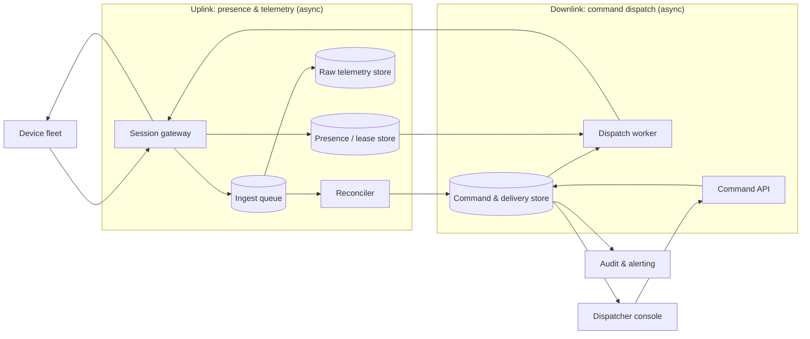

# Device Fleet Monitoring and Command Dispatch

[English](README.md) · [中文](README.zh.md)

<!-- meta:begin -->
| Type | Priority | Difficulty | Roles | Topics | Round |
| --- | --- | --- | --- | --- | --- |
| System design | ★★★☆☆ | — | SWE · Infra Eng | iot, messaging, idempotency, reconciliation, telemetry | Phone screen · Onsite |
<!-- meta:end -->

## Problem

Design the platform behind a demand-response program that a utility runs over a fleet of grid-connected
devices reachable only over the public internet: EV chargers, smart thermostats controlling home and
small-business air conditioners, commercial cold-storage refrigeration units, and hospital or other backup
loads. The platform both *collects* telemetry that devices push up (power draw, connectivity,
command-execution progress) and *sends* commands down to them (for example, "cut power draw by some percentage
for the next half hour"); communication runs in both directions, and either side can be the one to start
a message. **A device's owner has the final say over any command directed at their device — they can ignore
it, refuse it outright, or revoke it after already agreeing to it — so the platform can never assume a
dispatched command will actually be carried out.** It can only infer what happened from whatever the device
itself chooses to report back.

The public network between the platform and any device can lose a message in either direction, deliver one
more than once, delay it anywhere from seconds to hours, deliver several out of order, or go dark for a while
as a device loses power or connectivity and later comes back.

Scale for this design:

- The fleet has 4,000,000 devices: 1,200,000 EV chargers (charging can be delayed or throttled for a
  while at no real cost), 2,000,000 smart thermostats (adjustable within a comfort band), 600,000
  commercial refrigeration units (adjustable only briefly, before spoilage risk sets in), and 200,000
  hospital and other backup loads that are never a command target and are monitored only.
- In steady state, every device reports its status — power draw, a health flag, its own clock reading —
  every 40 seconds over a persistent, bidirectional session with the platform; it is declared offline once
  120 seconds pass with no report from it — three missed reports at that cadence. While it is carrying out a
  command, it reports every 10 seconds instead, for closer tracking.
- A command names a target cohort (by region, device type and how controllable it is) and a directive —
  for example, "cut power draw by 20% for the next 30 minutes." The platform should attempt delivery to
  99% of the cohort's devices that are online at dispatch within 2 seconds. A device's status for one
  command is allowed to keep changing — and any report already produced for that command is allowed to
  keep being corrected — for up to 4 hours after the 30-minute execution window ends; after that the
  platform finalizes the command and stops waiting.

In scope: presence/online detection, including the thundering herd of a mass simultaneous reconnect; on-device
offline caching and idempotent batch upload once a device reconnects; command creation, targeted dispatch, and
the per-device confirmation state machine (undelivered / delivered / accepted / rejected / executing /
completed / expired); ingesting and aggregating duplicate, out-of-order and late-arriving reports into
command-level statistics a dispatcher can act on, including correcting a report already published;
prioritizing and fairly rotating which devices get commanded across control tiers; scaling the whole pipeline
to millions of devices with fault tolerance, an audit trail, and alerting.

Out of scope: the load-forecasting and optimization logic that decides how much reduction a cohort needs and
when (assume that decision arrives at the command API already made); device firmware and its local control
loop; device-owner billing or incentive payments; anything about the physical grid beyond the commands and
telemetry described here.

Produce:

1. A requirements and scale estimate: uplink message rate and bandwidth in steady state and during an
   active command; the peak reconnect rate after a mass outage and the cached backlog it creates; a worked
   completion-rate breakdown for one command batch; the effect of the correction window on a report already
   published.
2. A data model (devices, commands, per-device command delivery, raw telemetry) and 3-5 core APIs.
3. An architecture diagram that shows the uplink (presence and telemetry) and downlink (command dispatch
   and confirmation) paths sharing the same device-facing layer, and a walk-through of one command along
   that path.
4. Deep dives into: (a) presence detection and the thundering herd of a mass reconnect; (b) targeted
   dispatch, the per-device confirmation state machine, priority and fairness across control tiers, and
   revocation; (c) turning duplicate, out-of-order and late reports into a command-level report that stays
   correct as more data arrives.

## Reference solution

<details>
<summary>Show the reference solution</summary>

One point worth confirming before designing: whether a device that has been offline for a long stretch should,
on reconnect, get every command it missed, or only the ones still inside their execution window (assumed the
latter — a command whose window has already passed no longer helps the grid, so it is simply never delivered
to that device and later expires for it).

### Requirements and scale

**Uplink rate and bandwidth.** $N = 4{,}000{,}000$ devices reporting every $H_b = 40$ s give a baseline rate
of $N / H_b = 100{,}000$ reports/sec. At roughly 300 bytes on the wire per report (device id, sequence number,
event time, a handful of metric fields, plus protocol framing), baseline bandwidth is $100{,}000 \times
300\text{ B} = 30$ MB/s. Persisted rows drop the framing, at roughly 220 bytes each: $100{,}000 \times
220\text{ B} \times 86{,}400\text{ s} \approx 1.90$ TB/day of raw telemetry. Kept 14 days — long enough to
recompute a report, short enough to bound cost — that is $\approx 26.6$ TB.

**Peak during an active command.** A single demand-response event can target up to 800,000 thermostats (40% of
that tier) at once. While a command is active, the targeted devices report every 10 s instead of 40 s: extra
rate $= 800{,}000 \times (1/10 - 1/40) = 60{,}000$/sec, for a peak of $160{,}000$ reports/sec ($48$ MB/s) — on
top of, not instead of, the baseline from the rest of the fleet.

**Thundering herd on reconnect.** A shared failure — a substation trip, an ISP outage — can take 10% of the
fleet, 400,000 devices, offline together. Reconnecting the instant power returns, with no spreading, would
cluster on the order of 5 seconds, an $80{,}000$/sec burst. Each device instead waits a jittered delay drawn
uniformly from a 200-second window before its first reconnect attempt, which spreads the same 400,000 devices
to $400{,}000 / 200 = 2{,}000$ connections/sec. Budgeting 250 handshake-and-auth completions/sec per instance,
that takes $\lceil 2{,}000/250 \rceil = 8$ instances, 10 with the usual 15% burst margin — versus $\lceil
80{,}000/250 \rceil = 320$, 368 with margin, for the unjittered burst, 36.8 times as many. Little's law, $L =
\lambda W$, shows this is a throughput problem rather than a concurrency one: even the raw 80,000/sec burst,
at a 20 ms handshake, holds only $L = 80{,}000 \times 0.02 = 1{,}600$ handshakes in flight at once — a small
number of slots, arriving far faster than any reasonably sized pool can retire them.

**Offline backlog on reconnect.** Each device caches locally while offline, up to 8 hours of reports at the
baseline rate ($8 \times 3{,}600 / 40 = 720$ records) before the oldest is dropped. Sizing against a 4-hour
outage, each of the 400,000 affected devices comes back carrying up to $4 \times 3{,}600/40 = 360$ cached
records, a $400{,}000 \times 360 = 144{,}000{,}000$-record backlog platform-wide. Paced to drain over 1 hour
rather than dumped all at once, that adds $144\times10^6 / 3{,}600 = 40{,}000$ records/sec. In the worst case
— one outage both caused the herd and triggered the demand-response event still active as the backlog drains —
all three add: $100{,}000 + 60{,}000 + 40{,}000 = 200{,}000$ records/sec, $60$ MB/s, the number the ingestion
tier is sized against.

**A command batch's completion breakdown.** For the 800,000-device event above: 760,000 (95%) are online at
dispatch and get delivered; the other 40,000 stay offline for the whole window and never do. Of the delivered,
80% accept (608,000), 15% refuse outright (114,000), and 5% neither accept nor refuse before the window ends
(38,000, still open). Of the 608,000 that accepted, 520,000 have reported completion by the time a dispatcher
checks 5 minutes after the window closes; the other 88,000 have no completion report yet. Storage for
per-command delivery rows is small next to raw telemetry: at roughly 500 commands/day averaging 50,000
targeted devices, $500 \times 50{,}000 \times 150\text{ B} \times 30\text{ days} \approx 112.5$ GB for 30 days
of history.

### Data model and API

**Device** — `device_id`, `device_type` (`ev_charger | thermostat | cold_storage | critical_load`),
`control_tier` (`delay_tolerant | comfort_band | short_time | non_interruptible` — `critical_load` is always
`non_interruptible`), `region_id`, `last_seq` (the high-water mark used to reject stale reports),
`last_commanded_at` (for fairness rotation), `registered_at`.

**Presence** — `device_id`, `lease_deadline`, `session_node` (which gateway instance currently holds the
session). Kept in a fast shared store, not per-gateway memory, so any instance can answer "is this device
online" and a crashed gateway's devices read as offline the moment their lease lapses, with no separate
cleanup step.

**TelemetryRecord** — `device_id`, `seq` (assigned by the device, monotonic, persisted across reboots),
`event_time`, `received_at`, `metric_type`, `payload`. Unique `(device_id, seq)` makes a re-uploaded batch
idempotent — inserting an already-stored record is a no-op — and is what `Device.last_seq` is advanced from
(deep dive (c)).

**Command** — `command_id`, `region_id`, `device_type` (optional — if given, restricts selection to that one
type/tier, as in the worked example above; if omitted, creation fills `target_count` by walking control tiers
in priority order, deep dive (b)), `target_count` (how many devices the command should reach), `directive`
(`{type: "reduce_power_pct", value, duration_min}`), `created_at`, `expires_at` (`created_at + duration_min`),
`finalize_at` (`expires_at +` a 4-hour correction horizon), `status` (`open | finalized`). Selection happens
once, at creation, into a fixed device list, so a device registered afterward never joins a command already
running.

**CommandDelivery** — `command_id`, `device_id` (unique pair — creating a command's rows is one bulk insert
per target device, idempotent the same way), `state` (`undelivered | delivered | accepted | rejected |
executing | completed | expired`), `last_event_time`, `updated_at`. Index `(command_id, state)` serves the
status query's `GROUP BY`; index `(device_id, state)` where state is non-terminal serves "what does this
device still owe a response on."

Core APIs:

1. `POST /commands` — `{region_id, device_type?, target_count, directive, duration_min}` →
   `{command_id, target_count, expires_at}`. Rejected if it would select any `non_interruptible` device.
2. `POST /devices/{device_id}/telemetry:batch` — `{records: [{seq, event_time, metric_type, payload}, ...]}`
   → `{accepted, duplicate}`. What a device sends on reconnect to flush its offline cache.
3. `POST /devices/{device_id}/commands/{command_id}/ack` — `{state, event_time}`, where `state` is one of
   `delivered | accepted | rejected | executing | completed` → `{applied: bool, current_state}`. `applied`
   is false when the guard (deep dive (b)) rejects the transition as stale.
4. `GET /commands/{command_id}/status?as_of=now|final` → per-state counts, derived rates
   (`coverage_rate`, `acceptance_rate`, `rejection_rate`, `completion_rate`), `realized_reduction_kw`
   (summed from `completed` devices' own before/after power-draw telemetry, not just their count), and
   `is_final`.
5. `PATCH /commands/{command_id}` — `{action: "cancel"}` — immediately expires every still-`undelivered`
   row and best-effort notifies every targeted device that is online to stand down; whether they do is up
   to them.

### Architecture



A device holds one persistent, bidirectional session with the gateway tier (a protocol built for full-duplex
push, such as MQTT or a gRPC stream, rather than a request the device has to poll) — the same session carries
its heartbeats, its telemetry, its command acks upward, and any command pushed to it downward. Every inbound
message refreshes that device's lease in the presence store and lands on the ingest queue, a durable,
replayable log. From there, raw records are persisted to the telemetry store, and anything tagged with a
`command_id` is also handed to the reconciler, which applies the guarded state-machine update (deep dive (b))
to the command-and-delivery store. On the way down, the dispatcher scans that same store for rows still
`undelivered` (or `delivered` past a nominal decision window) whose device the presence store shows online,
and pushes the directive through the gateway to the device's live session; a device found offline is left
alone, and its row waits for the next scan after that device's session reopens. The console reads aggregated
counts and the realized reduction straight from the delivery and telemetry stores to show a command's progress
and to inform the next round's targets, and every state transition the reconciler applies is also written to
an append-only audit log that alerting watches for anomalies (deep dive (c)).

### Deep dives

**Presence detection and the reconnect herd.** A 120-second lease (three missed 40-second reports) absorbs an
ordinary retransmit delay without flapping a device online/offline, and still notices a genuinely disconnected
device within two minutes. On reconnect after a mass outage, jittering each device's first attempt over a
window (200 s here) turns an unbounded instantaneous spike into a bounded rate. The same jitter mechanism, and
the same 250/sec-per-instance budget, cover a gateway instance's own crash: its devices' leases lapse, and
their reconnects spread the same way rather than all landing on the instant of failover.

**Targeted dispatch, the confirmation state machine, and fairness.** Selection happens once, at creation, so
the `target_count` in the response means the same fixed set of devices for the command's whole life. The
worked example pins `device_type: thermostat`, so creation simply draws `target_count` thermostats from that
one region and tier. Leaving `device_type` out asks for capacity without caring which kind of device supplies
it — an operator shedding load region-wide rather than tier by tier — and creation then walks control tiers in
priority order: it fills `target_count` from `delay_tolerant` devices first, then `comfort_band`, and only
reaches `short_time` devices if the first two tiers can't supply enough; `non_interruptible` devices are never
eligible either way (the API rejects any request that would select one). Within whichever tier is being drawn
from, devices with the oldest `last_commanded_at` are preferred, so the same subset isn't hit every round; a
device is skipped for 2 hours after being commanded; only when its tier runs short of devices off cooldown are
the least recently commanded ones reused rather than leaving the target unmet.

Dispatch is a burst, not a trickle: 99% of the 760,000 devices online at dispatch have to be reached inside
the 2-second target, $0.99 \times 760{,}000 / 2 = 376{,}200$ pushes/sec and about 75 MB/s at roughly 200 bytes
per push — 3.8x the steady 100,000/sec uplink the same gateway fleet is carrying. That is affordable only
because each push rides a session that is already open, and because dispatch workers shard the row scan by
`device_id` so the fan-out spreads over the whole fleet instead of queueing behind one scanner.

Delivery state is a ladder — `undelivered < delivered < accepted < executing < completed` — plus two side
exits. An update is applied only along a legal edge: the ladder only moves forward (an `executing` report
arriving before its `accepted` report still advances the row straight to `executing`, backfilling the skipped
step at the same `event_time` for audit — which step got skipped only says which of the device's own reports
arrived first); `rejected` is the side exit reachable from any non-terminal state — modeling both a refusal
and an owner revoking mid-execution — but it is the one edge the ladder's own ordering does not guard, so it
is applied only when its `event_time` is at least the row's `last_event_time`; otherwise it is a refusal some
newer report has already overtaken, and dropping it is what keeps the rule "an older state never overwrites a
newer one" true on this edge too. Once a row is `completed` or `rejected` it accepts no further update.
`expired` is not one of the states a device can ack: it is written once, by a sweep at `finalize_at`, to every
row for that command still short of `completed` or `rejected`, which is also what turns the command's `status`
to `finalized`. Revoking a command (`PATCH .../cancel`) expires its `undelivered` rows immediately and
best-effort notifies every targeted device that is online, the `undelivered` ones included — a row still
reading `undelivered` may be a push whose ack has not landed yet, and that device is exactly the one that
would otherwise carry out a cancelled command. A device already `executing` is free to keep going or to stop;
the platform only learns which by whatever it reports next.

**Correctable aggregation from duplicate, out-of-order and late reports.** Every report a device sends carries
its own monotonically increasing `seq` and the `event_time` the device stamped it with. Presence and any
per-device aggregate apply an update only if its `seq` is newer than the one already recorded, so a retried
batch upload, a duplicate delivered twice by the network, or one message that overtakes another in flight can
never push a newer value back to an older one — the guard depends on the device's own ordering, not on arrival
order, which the network makes no promises about. `event_time` is read off the device's own clock, which is
why every report also carries that clock's reading: the gateway keeps a smoothed per-device offset —
`received_at` minus that reading — and normalizes `event_time` by it before any window test, so a device whose
clock is minutes off does not get an on-time completion scored as late. A command-level report is a live count
over `CommandDelivery` grouped by `state`, tagged `is_final = now >= finalize_at` rather than a separately
stored snapshot, so there is exactly one place a number can be wrong, not two kept in sync.

Continuing the 800,000-device batch from the requirements section: at the 5-minute-after-window check, the
completion count stands at $520{,}000 / 800{,}000 = 65.0\%$, with 88,000 devices still `accepted` or
`executing` and no completion report yet, many of them among the 400,000 caught in the same outage and only
just back online. Over the following 4 hours, 27,200 of those 88,000 send a completion report whose
`event_time` still falls inside the 30-minute window — the *action* happened on time; only the *report* of it
was late — correcting completion to $547{,}200/800{,}000 = 68.4\%$, up 3.4 points, while the rest never do and
are swept to `expired` when `finalize_at` arrives. A completion report whose `event_time` falls after the
window closed is not counted as `completed` however promptly it arrives — the device really did act too late
to matter for this command.

### Follow-ups

- A device that disputes a command it never actually saw (network loss, not a refusal) has no way to tell
  the platform that from `undelivered` — from its side, nothing happened, so there's nothing to report; the
  dispatcher only sees the eventual `expired`, indistinguishable from a device that was simply never asked.
- Fairness cooldowns are per device; once enough history has accumulated, selection could also be weighted
  by a device's *realized* reduction from past commands, not just how recently it was picked.

<details>
<summary>Scale check (runnable)</summary>

Recomputes every number the prose states — the rates, the reconnect herd, the dispatch burst and the
completion-rate walkthrough — from the same inputs, so a later edit to one cannot silently leave another
stale.

```python
import math

N = 4_000_000
EV, THERMOSTAT, COLD_STORAGE, CRITICAL = 1_200_000, 2_000_000, 600_000, 200_000
assert EV + THERMOSTAT + COLD_STORAGE + CRITICAL == N
assert (EV / N, THERMOSTAT / N, COLD_STORAGE / N, CRITICAL / N) == (0.30, 0.50, 0.15, 0.05)

Hb, active_ivl, lease = 40, 10, 120
assert lease == 3 * Hb

baseline_rate = N / Hb
assert baseline_rate == 100_000
wire_bytes = 300
assert baseline_rate * wire_bytes == 30_000_000  # 30 MB/s

store_bytes = 220
daily_raw_bytes = baseline_rate * store_bytes * 86_400
assert round(daily_raw_bytes / 1e12, 2) == 1.90
raw_retention_days = 14
assert round(daily_raw_bytes * raw_retention_days / 1e12, 1) == 26.6

cohort = 800_000
assert cohort == round(0.40 * THERMOSTAT)
extra_active = cohort * (1 / active_ivl - 1 / Hb)
assert round(extra_active) == 60_000
peak_active_rate = baseline_rate + extra_active
assert round(peak_active_rate) == 160_000
assert round(peak_active_rate * wire_bytes / 1e6) == 48  # MB/s

outage_devices = round(0.10 * N)
assert outage_devices == 400_000
jitter_s = 200
jittered_rate = outage_devices / jitter_s
assert jittered_rate == 2_000
naive_cluster_s = 5
naive_rate = outage_devices / naive_cluster_s
assert naive_rate == 80_000

per_instance = 250
instances = math.ceil(math.ceil(jittered_rate / per_instance) * 1.15)
assert math.ceil(jittered_rate / per_instance) == 8 and instances == 10
naive_instances = math.ceil(math.ceil(naive_rate / per_instance) * 1.15)
assert naive_instances == 368
assert round(naive_instances / instances, 1) == 36.8

handshake_s = 0.02
assert jittered_rate * handshake_s == 40          # in-flight handshakes, jittered
assert naive_rate * handshake_s == 1_600          # in-flight handshakes, even at the raw burst

cache_horizon_h = 8
assert cache_horizon_h * 3_600 / Hb == 720         # per-device cache capacity, records

outage_duration_h = 4
backlog_per_device = outage_duration_h * 3_600 / Hb
assert backlog_per_device == 360
total_backlog = outage_devices * backlog_per_device
assert total_backlog == 144_000_000
drain_window_s = 3_600
drain_extra_rate = total_backlog / drain_window_s
assert drain_extra_rate == 40_000

combined_peak_rate = baseline_rate + extra_active + drain_extra_rate
assert round(combined_peak_rate) == 200_000
assert round(combined_peak_rate * wire_bytes / 1e6) == 60  # MB/s

delivered = round(cohort * 0.95)
undelivered = cohort - delivered
assert (delivered, undelivered) == (760_000, 40_000)

# dispatch fan-out: the devices online at dispatch, reached inside the 2-second delivery target
dispatch_slo_frac, dispatch_slo_s, push_bytes = 0.99, 2, 200
dispatch_rate = dispatch_slo_frac * delivered / dispatch_slo_s
assert dispatch_rate == 376_200
assert round(dispatch_rate * push_bytes / 1e6, 1) == 75.2      # MB/s downlink during the burst
assert round(dispatch_rate / baseline_rate, 1) == 3.8          # times the steady uplink rate

accepted = round(delivered * 0.80)
rejected = round(delivered * 0.15)
delivered_open = delivered - accepted - rejected
assert (accepted, rejected, delivered_open) == (608_000, 114_000, 38_000)

completed_at_check = 520_000
executing_open_at_check = accepted - completed_at_check
assert executing_open_at_check == 88_000

late_completed = 27_200
final_completed = completed_at_check + late_completed
final_unresolved = executing_open_at_check - late_completed
final_expired = undelivered + delivered_open + final_unresolved
assert (final_completed, final_unresolved, final_expired) == (547_200, 60_800, 138_800)
assert final_completed + rejected + final_expired == cohort

coverage_rate = delivered / cohort
acceptance_rate = accepted / delivered
rejection_rate = rejected / delivered
completion_rate_of_accepted = final_completed / accepted
end_to_end_rate = final_completed / cohort
checkpoint_rate = completed_at_check / cohort
assert (coverage_rate, acceptance_rate, rejection_rate) == (0.95, 0.80, 0.15)
assert completion_rate_of_accepted == 0.9
assert end_to_end_rate == 0.684 and checkpoint_rate == 0.65
assert round(end_to_end_rate - checkpoint_rate, 3) == 0.034

commands_per_day, avg_cohort, delivery_row_bytes, delivery_retention_days = 500, 50_000, 150, 30
delivery_rows_per_day = commands_per_day * avg_cohort
assert delivery_rows_per_day == 25_000_000
delivery_bytes = delivery_rows_per_day * delivery_row_bytes * delivery_retention_days
assert round(delivery_bytes / 1e9, 1) == 112.5  # GB

print("all requirements-and-scale and completion-rate numbers check out")
```

```python
# The delivery state machine's guard. Four rules: the ladder only moves forward (skipping a step is fine,
# the skipped states are backfilled for audit); "rejected" is a side exit from any non-terminal state, but
# only for a report at least as new as what the row already reflects; "expired" is written by the finalize
# sweep alone; and nothing updates a terminal row.
LADDER = ["undelivered", "delivered", "accepted", "executing", "completed"]
RANK = {s: i for i, s in enumerate(LADDER)}
TERMINAL = {"completed", "rejected", "expired"}
DEVICE_REPORTABLE = {"delivered", "accepted", "executing", "completed", "rejected"}


def apply_update(state, last_event_time, new_state, event_time, source="device"):
    """Returns the row's (state, last_event_time) after the update, or None if it is dropped."""
    if new_state not in (DEVICE_REPORTABLE if source == "device" else {"expired"}):
        return None
    if state in TERMINAL:
        return None
    if new_state == "expired":
        return ("expired", last_event_time)
    if new_state == "rejected":
        return ("rejected", event_time) if event_time >= last_event_time else None
    if RANK[new_state] > RANK[state]:
        return (new_state, max(event_time, last_event_time))
    return None


# Hand-written cases, including the ones that have to be refused.
T0, T1 = 100, 200
cases = {
    ("undelivered", T0, "delivered", T1, "device"): ("delivered", T1),
    ("undelivered", T0, "executing", T1, "device"): ("executing", T1),   # skips delivered and accepted
    ("undelivered", T0, "rejected", T1, "device"): ("rejected", T1),     # ack overtook the dispatch write
    ("delivered", T0, "delivered", T1, "device"): None,                  # duplicate: not a forward move
    ("delivered", T0, "rejected", T1, "device"): ("rejected", T1),       # refused outright
    ("accepted", T0, "rejected", T1, "device"): ("rejected", T1),        # revoked before starting
    ("executing", T0, "rejected", T1, "device"): ("rejected", T1),       # revoked mid-execution
    ("executing", T0, "completed", T1, "device"): ("completed", T1),
    ("executing", T1, "accepted", T0, "device"): None,                   # stale re-send of an earlier step
    ("executing", T1, "rejected", T0, "device"): None,                   # refusal older than the row: stale
    ("completed", T0, "rejected", T1, "device"): None,                   # nothing overwrites a terminal row
    ("rejected", T0, "completed", T1, "device"): None,
    ("expired", T0, "completed", T1, "device"): None,                    # arrived after finalize: dropped
    ("accepted", T0, "expired", T1, "device"): None,                     # a device cannot expire its own row
    ("accepted", T0, "expired", T1, "sweep"): ("expired", T0),           # the finalize sweep can
    ("completed", T0, "expired", T1, "sweep"): None,                     # but not over a terminal row
    ("undelivered", T0, "accepted", T1, "sweep"): None,                  # the sweep writes nothing else
}
for args, expected in cases.items():
    assert apply_update(*args) == expected, (args, apply_update(*args), expected)


def oracle(state, last_event_time, new_state, event_time, source):
    """The same four rules, transcribed independently of the implementation above."""
    if state in TERMINAL:
        return None
    if source == "sweep":
        return ("expired", last_event_time) if new_state == "expired" else None
    if new_state == "rejected":
        return ("rejected", event_time) if event_time >= last_event_time else None
    if new_state in LADDER and RANK[new_state] > RANK[state]:
        return (new_state, max(event_time, last_event_time))
    return None


# Exhaustive: every (state, reported state) pair, both sources, both orderings of the two timestamps.
ALL_STATES = LADDER + ["rejected", "expired"]
applied = dropped = 0
for state in ALL_STATES:
    for new_state in ALL_STATES:
        for last_event_time in (T0, T1):
            for event_time in (T0, T1):
                for source in ("device", "sweep"):
                    got = apply_update(state, last_event_time, new_state, event_time, source)
                    assert got == oracle(state, last_event_time, new_state, event_time, source)
                    if got is None:
                        dropped += 1
                        continue
                    applied += 1
                    resulting, stamp = got
                    assert state not in TERMINAL and resulting == new_state
                    assert stamp >= last_event_time
                    assert resulting in ("expired", "rejected") or RANK[resulting] > RANK[state]
assert applied + dropped == len(ALL_STATES) ** 2 * 4 * 2 == 392
assert (applied, dropped) == (68, 324)
# Of the 49 (state, reported state) pairs, a device report can move 14 and the sweep 4; the rest are
# refused, which is what makes the count above a negative control and not just a restatement.
assert sum(apply_update(s, T0, n, T0, "device") is not None for s in ALL_STATES for n in ALL_STATES) == 14
assert sum(apply_update(s, T0, n, T0, "sweep") is not None for s in ALL_STATES for n in ALL_STATES) == 4

print("state-machine guard: 392 (state, report, source, ordering) combinations agree with the rules")
```

</details>

</details>
