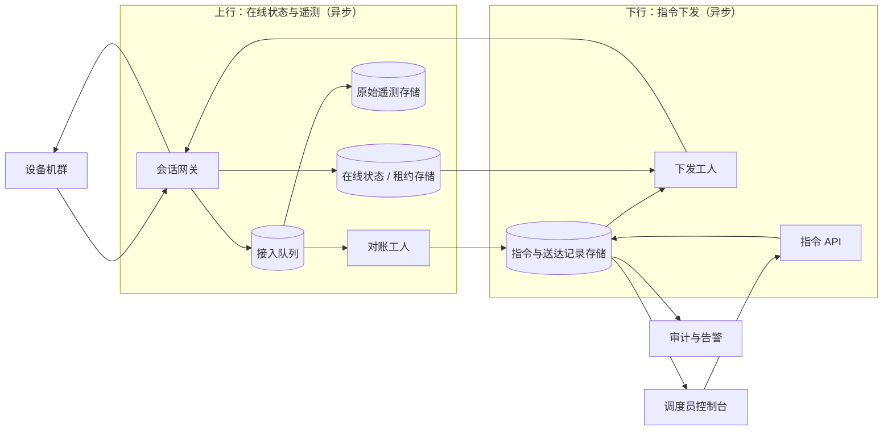

# 大规模设备监控与指令下发

[English](README.md) · [中文](README.zh.md)

<!-- meta:begin -->
| 题型 | 优先级 | 难度 | 岗位 | 考点 | 轮次 |
| --- | --- | --- | --- | --- | --- |
| 系统设计 | ★★★☆☆ | — | SWE · Infra Eng | iot, messaging, idempotency, reconciliation, telemetry | 电话面 · 现场面 |
<!-- meta:end -->

## 题目

设计一个需求响应（demand response）项目背后的平台：电力公司通过公共互联网管理一支只能靠公网触达的联网设备机群——电动车充电桩、控制家用和小型商业空调的智能温控器、商用冷库的制冷机组，以及医院等场所的备用负荷。平台既要*接收*设备主动上报的遥测（telemetry）（用电功率、连接状态、指令执行进度），也要向设备*下发*指令（例如“接下来半小时内把用电功率降低若干百分比”）；通信是双向的，双方都可能是发起消息的一方。平台只能依据设备自己愿意上报的内容，去推断一条指令实际发生了什么：**每台设备的所有者对发给自己设备的任何指令都有最终决定权——可以忽略、直接拒绝，也可以在已经同意之后再撤销——所以平台永远不能假设一条已下发的指令真的会被执行。**

平台与任意一台设备之间的公网连接可能在任一方向丢失消息、把同一条消息投递两次、把消息延迟几秒到几个小时、让若干条消息乱序到达，也可能让设备因为断电或断网而暂时消失，过一段时间才恢复。

这次设计的规模：

- 机群共有 4,000,000 台设备：1,200,000 台电动车充电桩（延迟或压低充电功率基本没有实际代价）、2,000,000 台智能温控器（可以在舒适区间内调整）、600,000 台商用制冷机组（只能短时调整，超过一定时长就有变质风险）、200,000 台医院等场所的备用负荷，这一类永远不会成为指令目标，只做监控。
- 稳态下，每台设备通过与平台之间维持的一个持久双向会话，每 40 秒上报一次状态（用电功率、健康标志、自身的时钟读数）；连续 120 秒没有收到它的上报就判定离线——按这个频率就是错过三次。设备正在执行一条指令期间，上报间隔改为 10 秒，以便更紧密地跟踪。
- 一条指令指定一个目标群组（cohort，按地区、设备类型和可调控程度筛选）和一条指令内容——例如“接下来 30 分钟内把用电功率降低 20%”。平台应当在下发后 2 秒内，对群组里下发时在线的设备中的 99% 尝试投递。针对某条指令，设备的状态允许持续变化——已经产出的这条指令的报表也允许持续被修正——直到 30 分钟执行窗口结束后再过 4 小时（一个修正窗口）；这之后平台把该指令收尾，不再等待。

范围内：在线/离线判定，包括大批设备同时重连造成的惊群（thundering herd）；设备离线期间的本地缓存，以及重连后的批量上传要做到幂等（idempotent）；指令的创建、定向下发，以及逐台设备的确认状态机（未送达 / 已送达 / 已接受 / 已拒绝 / 执行中 / 完成 / 过期）；把重复、乱序、迟到的上报聚合成调度人员可以据以决策的指令级统计，包括修正已经发布过的报表；在不同可调控档位之间设定优先级并公平轮换；把整条流水线扩展到百万级设备，同时具备容错、审计留痕与告警。

范围外：判断某个群组需要降多少负荷、什么时候降的负荷预测与优化逻辑（假设这个决定已经做好，随指令一起到达指令 API）；设备端固件与其本地控制回路；设备所有者的计费或激励结算；除本题描述的指令与遥测之外，关于电网本身的其它内容。

要产出：

1. 需求与规模估算：稳态与指令执行期间的上行消息速率与带宽；大规模离线后重连的峰值速率，以及由此产生的缓存积压；一次指令批次的完成率明细；修正窗口对已发布报表的影响。
2. 一个数据模型（设备、指令、逐设备的指令送达记录、原始遥测）和 3 到 5 个核心接口。
3. 一张架构图，展示上行（在线状态与遥测）与下行（指令下发与确认）共用同一套设备侧接入层，并沿着一条指令把这条路径走一遍。
4. 深入讨论：(a) 在线判定与大规模重连惊群；(b) 指令的定向下发、逐设备确认状态机、跨可调控档位的优先级与公平性，以及撤销；(c) 把重复、乱序、迟到的上报变成一份能随着新数据到达而持续修正的指令级报表。

## 参考解答

<details>
<summary>展开参考解答</summary>

动手设计之前值得先确认一点：一台离线很久的设备重新上线时，应该收到它错过的每一条指令，还是只收到执行窗口还没过期的那些（假设是后者——窗口已经过去的指令对电网没有帮助，不会再投递给这台设备，之后按过期处理）。

### 需求与规模

**上行速率与带宽。** $N = 4{,}000{,}000$ 台设备，每台每 $H_b = 40$ 秒上报一次，基准速率是 $N / H_b = 100{,}000$ 条/秒。每条在网络上约 300 字节（设备 id、序号、事件时间、若干指标字段加协议帧头），基准带宽是 $100{,}000 \times 300\text{ B} = 30$ MB/s。持久化时去掉帧头，每条约 220 字节：$100{,}000 \times 220\text{ B} \times 86{,}400\text{ s} \approx 1.90$ TB/天的原始遥测。保留 14 天——足够重新算一次报表，又能限住成本——大约是 26.6 TB。

**指令执行期间的峰值。** 一次需求响应事件最多可能同时面向 800,000 台温控器（这一档的 40%）。指令生效期间，被选中的设备上报间隔从 40 秒变成 10 秒：多出的速率 $= 800{,}000 \times (1/10 - 1/40) = 60{,}000$ 条/秒，峰值达到 $160{,}000$ 条/秒（$48$ MB/s）——这是叠加在机群其余部分的基准流量之上，不是替代它。

**重连惊群。** 一次共因故障（变电站跳闸、运营商中断）可以让 10% 的机群、即 400,000 台设备同时离线。供电一恢复就立刻重连、不分散，会在约 5 秒内挤成一堆，形成 $80{,}000$ 条/秒的连接洪峰。改为每台设备先等一个从 200 秒窗口里均匀取的随机延迟，再发起首次重连，同样的 400,000 台就摊成 $400{,}000 / 200 = 2{,}000$ 个连接/秒。按每个实例 250 次握手加鉴权/秒的预算，需要 $\lceil 2{,}000/250 \rceil = 8$ 个实例，加上常规的 15% 突发余量是 10 个——不加抖动则要 $\lceil 80{,}000/250 \rceil = 320$，加余量 368 个，是前者的 36.8 倍。Little 定律 $L = \lambda W$ 说明这其实是吞吐问题，不是并发问题：即便是未加抖动的 80,000/秒洪峰，按 20 毫秒一次握手算，同一时刻也只有 $L = 80{,}000 \times 0.02 = 1{,}600$ 次握手在途——槽位数并不多，只是到达得比任何合理规模的池子能处理的都快。

**重连后的离线积压。** 每台设备离线期间在本地缓存，按基准速率最多存 8 小时的上报（$8 \times 3{,}600 / 40 = 720$ 条），存满后丢最旧的。按一次 4 小时的停电来配置容量，这 400,000 台设备每台恢复时带着最多 $4 \times 3{,}600/40 = 360$ 条缓存记录，全平台合计 $400{,}000 \times 360 = 144{,}000{,}000$ 条积压。把这批积压分摊到 1 小时内排空，而不是一次性倒出来，会多出 $144\times10^6 / 3{,}600 = 40{,}000$ 条/秒。最坏情形是同一次故障既引发了重连惊群，又是这次仍在生效的需求响应事件的起因，三者叠加：$100{,}000 + 60{,}000 + 40{,}000 = 200{,}000$ 条/秒，$60$ MB/s，接入层就按这个数字配置容量。

**一个指令批次的完成率明细。** 以上面 800,000 台设备的事件为例：760,000 台（95%）在下发时在线并收到了指令，另外 40,000 台整个窗口都离线、始终没送达。送达的里面，80% 接受（608,000），15% 直接拒绝（114,000），5% 在窗口结束前既没接受也没拒绝（38,000，还悬着）。608,000 台接受的设备里，520,000 在窗口关闭 5 分钟后已报告完成，其余 88,000 尚无完成上报。逐指令的送达记录存储量比原始遥测小得多：按每天约 500 条指令、平均每条面向 50,000 台设备算，30 天历史约 $500 \times 50{,}000 \times 150\text{ B} \times 30 \approx 112.5$ GB。

### 数据模型与 API

**Device（设备）**——`device_id`、`device_type`（`ev_charger | thermostat | cold_storage | critical_load`）、`control_tier`（`delay_tolerant | comfort_band | short_time | non_interruptible`——`critical_load` 永远是 `non_interruptible`）、`region_id`、`last_seq`（用来拒绝迟到上报的高水位标记）、`last_commanded_at`（供公平轮换使用）、`registered_at`。

**Presence（在线状态）**——`device_id`、`lease_deadline`、`session_node`（当前持有这个会话的网关实例）。放在快速的共享存储里，而不是某个网关实例自己的内存，这样任何实例都能回答“这台设备在不在线”；一个崩溃的网关，它名下的设备只要租约一过就自动读成离线，不需要额外的清理步骤。

**TelemetryRecord（遥测记录）**——`device_id`、`seq`（设备自己分配，单调递增，跨重启持久化）、`event_time`、`received_at`、`metric_type`、`payload`。唯一索引 `(device_id, seq)` 让重复上传的批次天然幂等——插入一条已经存过的记录是空操作——也是 `Device.last_seq` 这个高水位标记的判断依据（深入话题 (c)）。

**Command（指令）**——`command_id`、`region_id`、`device_type`（可选——给出时就限定在那一种设备类型/档位；不给时由创建按可调控档位的优先顺序凑够 `target_count`，见深入话题 (b)）、`target_count`（这条指令要覆盖多少台设备）、`directive`（`{type: "reduce_power_pct", value, duration_min}`）、`created_at`、`expires_at`（`created_at + duration_min`）、`finalize_at`（`expires_at +` 4 小时修正窗口）、`status`（`open | finalized`）。设备清单只在创建时算一次并固定下来，之后才注册的设备不会加入一条已经在跑的指令。

**CommandDelivery（指令送达记录）**——`command_id`、`device_id`（唯一对——创建一条指令的记录是对每个目标设备做一次批量插入，同样天然幂等）、`state`（`undelivered | delivered | accepted | rejected | executing | completed | expired`）、`last_event_time`、`updated_at`。索引 `(command_id, state)` 供状态查询的 `GROUP BY` 使用；索引 `(device_id, state)`（限定 state 为非终态）供“这台设备还欠哪些响应”这条查询使用。

核心接口：

1. `POST /commands`——`{region_id, device_type?, target_count, directive, duration_min}` → `{command_id, target_count, expires_at}`。如果选取结果会包含任何 `non_interruptible` 设备则拒绝创建。
2. `POST /devices/{device_id}/telemetry:batch`——`{records: [{seq, event_time, metric_type, payload}, ...]}` → `{accepted, duplicate}`。设备重连后用它冲刷离线期间的本地缓存。
3. `POST /devices/{device_id}/commands/{command_id}/ack`——`{state, event_time}`，其中 `state` 取 `delivered | accepted | rejected | executing | completed` 之一 → `{applied: bool, current_state}`。当状态机的 guard（深入话题 (b)）判定这次转移是过期数据而拒绝时，`applied` 为 false。
4. `GET /commands/{command_id}/status?as_of=now|final` → 各状态的计数、派生出的比率（`coverage_rate`、`acceptance_rate`、`rejection_rate`、`completion_rate`）、`realized_reduction_kw`（由 `completed` 设备自己上报的执行前后功率差累加而来，不只是数个数）以及 `is_final`。
5. `PATCH /commands/{command_id}`——`{action: "cancel"}`——立即把所有仍是 `undelivered` 的记录标记过期，并尽力（best-effort）通知所有在线的目标设备停止；它们是否真的停下由它们自己决定。

### 架构



每台设备与网关层维持一个持久的双向会话（用支持全双工推送的协议，例如 MQTT 或 gRPC 双向流，而不是让设备自己去轮询）——同一个会话既向上带着心跳、遥测、指令确认，也向下带着推给它的指令。每一条上行消息都会刷新这台设备在在线状态存储里的租约，并落到接入队列——一个持久、可重放的日志。原始记录从这里写入原始遥测存储；带 `command_id` 标签的消息还会同时交给对账工人，由它把状态机的 guard 更新（深入话题 (b)）应用到指令与送达记录存储上。下行方向，下发工人扫描同一份存储里仍然 `undelivered`（或者 `delivered` 超过了名义决策窗口）、且在线状态存储显示在线的记录，把指令内容推给这台设备当前的会话；设备离线就先放着，等它下一次打开会话时被下一轮扫描捡起。控制台从送达记录与遥测存储读聚合计数与实际节电量，用来展示指令进度并给下一轮的目标提供依据；对账工人应用的每一次状态转移都写进只能追加的审计日志，供告警监视异常（深入话题 (c)）。

### 深入话题

**在线判定与重连惊群。** 120 秒的租约（三次错过 40 秒一次的上报）足以吸收一次普通的重传延迟而不至于让在线状态来回抖动，又能让一台真正断连的设备在两分钟内被发现。大规模断电之后的重连，把每台设备的首次重连尝试打散在一个窗口（这里是 200 秒）内，能把一个无上限的瞬时尖峰变成一个有界的速率。同一套抖动机制、同一份每实例 250/秒的预算，也覆盖了网关实例自己崩溃的情形：它名下设备的租约到期，重连同样按这个节奏摊开，而不会全部集中在故障发生的那一刻。

**指令的定向下发、确认状态机与公平性。** 设备清单只在创建时算一次，返回的 `target_count` 因此在指令的整个生命周期里都指向同一批设备。上面的例子指定了 `device_type: thermostat`，创建这一步只需在那一个地区、那一个档位里凑够 `target_count` 台温控器。不指定 `device_type`，就表示调度员只要凑够容量、不在乎哪一类设备提供——这时创建按可调控档位的优先顺序去凑：先 `delay_tolerant`，不够再 `comfort_band`，前两档都不够才用 `short_time`；两条路径下 `non_interruptible` 的设备都不会入选（API 直接拒绝这样的请求）。不论从哪个档位选，`last_commanded_at` 最早的设备优先被选中，避免每轮都打同一批；一台设备被下过指令后 2 小时内不再被选中；只有该档位不在冷却期的设备不够用时，才复用最早被选中过的那些。

下发本身是一次突发，不是细水长流：下发时在线的那 760,000 台设备里，99% 要在 2 秒的目标之内被触达，也就是 $0.99 \times 760{,}000 / 2 = 376{,}200$ 次推送/秒，按每次推送约 200 字节算是 75 MB/s，相当于同一套网关此刻承载的 100,000 条/秒上行流量的 3.8 倍。扛得住是因为每次推送都走一个已经打开的会话，而且下发工人按 `device_id` 分片扫描，扇出被摊到整个网关机群上。

送达状态是一条阶梯——`undelivered < delivered < accepted < executing < completed`——外加两个侧向出口。更新只在合法的边上生效：阶梯只能往前走（一条 `executing` 上报如果先于对应的 `accepted` 到达，仍把记录直接推进到 `executing`，被跳过的那一步按同一个 `event_time` 补记供审计——跳过哪一步只取决于它自己哪条上报先到）；`rejected` 是从任意非终态都能走的那个侧向出口——既覆盖直接拒绝，也覆盖执行到中途所有者撤销——但它是阶梯的顺序管不到的一条边，所以只有 `event_time` 不早于该记录的 `last_event_time` 时才生效；否则它是一条已被更新的上报追过的拒绝，丢掉它，“旧状态不能覆盖新状态”在这条边上才同样成立。一条记录一旦是 `completed` 或 `rejected` 就不再接受更新。`expired` 不在设备能确认的状态之列：它只在 `finalize_at` 到达时由一次统一扫描写入，覆盖该指令下所有还没到 `completed` 或 `rejected` 的记录，同一次扫描也把这条指令的 `status` 改成 `finalized`。撤销一条指令（`PATCH .../cancel`）会让它所有 `undelivered` 的记录立即过期，并尽力通知所有在线的目标设备，`undelivered` 的也要通知——这条记录可能只是推送已发出、确认还没回来，而那台设备正是会去执行一条已被撤销指令的那台。已经在 `executing` 的设备可以选择继续或停下，平台只能靠它接下来上报的内容才知道它选了哪个。

**把重复、乱序、迟到的上报变成可修正的聚合报表。** 设备发出的每一条上报都带着自己单调递增的 `seq` 和它自己打上的 `event_time`。在线状态和任何逐设备的聚合值，只有消息的 `seq` 比已记录的那个更新时才会被应用，所以一次重试的批量上传、被重复投递两次的同一条消息，或者被后发消息追过的一条消息，都不可能把更新的值又推回旧值——这个 guard 依据设备自己的顺序，不依赖到达顺序，而网络恰恰对到达顺序不做任何保证。`event_time` 读的是设备自己的时钟，这也是每条上报都要带上这个时钟读数的原因：网关为每台设备维持一个平滑过的偏移量——`received_at` 减去这个读数——并在做任何窗口判定之前先用它校正 `event_time`，这样一台时钟差了几分钟的设备，不会让一次按时完成的动作被算成迟到。指令级的报表是对 `CommandDelivery` 按 `state` 分组的一次实时计数，标上 `is_final = now >= finalize_at`，而不是单独存一份快照——出错的地方因此只有一个，不用维护两份还要保持同步。

接着看需求与规模一节里那批 800,000 台设备的例子：窗口结束 5 分钟后查看，完成率是 $520{,}000 / 800{,}000 = 65.0\%$，还有 88,000 台停在 `accepted` 或 `executing`、尚无完成上报，其中不少正是被同一次故障波及、刚刚才重新上线的设备。接下来的 4 小时里，这 88,000 台里有 27,200 台发来完成上报，其 `event_time` 仍落在那 30 分钟窗口之内——*动作*本身是按时完成的，只是*上报*迟到了——把完成率修正到 $547{,}200/800{,}000 = 68.4\%$，提高了 3.4 个百分点；剩下的一直没有再发，等 `finalize_at` 到达时被统一扫描成 `expired`。而一条完成上报如果 `event_time` 落在窗口结束之后，不管它多快送到都不计入 `completed`——设备确实是动作晚了，对这条指令已经没有意义。

### 追问

- 一台根本没收到指令的设备（网络丢失，不是拒绝）没法把这件事告诉平台——从它自己的角度看什么都没发生，也就没什么可上报的；调度员最终只会看到 `expired`，和一台从来没被问过的设备没法区分。
- 现在的公平轮换只按设备做冷却；积累足够历史后，可以再按设备过去的*实际*削减效果加权选取，而不只看上次被选中的时间。

<details>
<summary>规模核对（可运行）</summary>

用正文里同一批输入，把正文给出的每一个数字——各项速率、重连惊群、下发突发、完成率推演——重新算一遍，这样以后改动其中一个时不会悄悄留下另一个没跟着更新。

```python
import math

N = 4_000_000
EV, THERMOSTAT, COLD_STORAGE, CRITICAL = 1_200_000, 2_000_000, 600_000, 200_000
assert EV + THERMOSTAT + COLD_STORAGE + CRITICAL == N
assert (EV / N, THERMOSTAT / N, COLD_STORAGE / N, CRITICAL / N) == (0.30, 0.50, 0.15, 0.05)

Hb, active_ivl, lease = 40, 10, 120
assert lease == 3 * Hb

baseline_rate = N / Hb
assert baseline_rate == 100_000
wire_bytes = 300
assert baseline_rate * wire_bytes == 30_000_000  # 30 MB/s

store_bytes = 220
daily_raw_bytes = baseline_rate * store_bytes * 86_400
assert round(daily_raw_bytes / 1e12, 2) == 1.90
raw_retention_days = 14
assert round(daily_raw_bytes * raw_retention_days / 1e12, 1) == 26.6

cohort = 800_000
assert cohort == round(0.40 * THERMOSTAT)
extra_active = cohort * (1 / active_ivl - 1 / Hb)
assert round(extra_active) == 60_000
peak_active_rate = baseline_rate + extra_active
assert round(peak_active_rate) == 160_000
assert round(peak_active_rate * wire_bytes / 1e6) == 48  # MB/s

outage_devices = round(0.10 * N)
assert outage_devices == 400_000
jitter_s = 200
jittered_rate = outage_devices / jitter_s
assert jittered_rate == 2_000
naive_cluster_s = 5
naive_rate = outage_devices / naive_cluster_s
assert naive_rate == 80_000

per_instance = 250
instances = math.ceil(math.ceil(jittered_rate / per_instance) * 1.15)
assert math.ceil(jittered_rate / per_instance) == 8 and instances == 10
naive_instances = math.ceil(math.ceil(naive_rate / per_instance) * 1.15)
assert naive_instances == 368
assert round(naive_instances / instances, 1) == 36.8

handshake_s = 0.02
assert jittered_rate * handshake_s == 40          # in-flight handshakes, jittered
assert naive_rate * handshake_s == 1_600          # in-flight handshakes, even at the raw burst

cache_horizon_h = 8
assert cache_horizon_h * 3_600 / Hb == 720         # per-device cache capacity, records

outage_duration_h = 4
backlog_per_device = outage_duration_h * 3_600 / Hb
assert backlog_per_device == 360
total_backlog = outage_devices * backlog_per_device
assert total_backlog == 144_000_000
drain_window_s = 3_600
drain_extra_rate = total_backlog / drain_window_s
assert drain_extra_rate == 40_000

combined_peak_rate = baseline_rate + extra_active + drain_extra_rate
assert round(combined_peak_rate) == 200_000
assert round(combined_peak_rate * wire_bytes / 1e6) == 60  # MB/s

delivered = round(cohort * 0.95)
undelivered = cohort - delivered
assert (delivered, undelivered) == (760_000, 40_000)

# dispatch fan-out: the devices online at dispatch, reached inside the 2-second delivery target
dispatch_slo_frac, dispatch_slo_s, push_bytes = 0.99, 2, 200
dispatch_rate = dispatch_slo_frac * delivered / dispatch_slo_s
assert dispatch_rate == 376_200
assert round(dispatch_rate * push_bytes / 1e6, 1) == 75.2      # MB/s downlink during the burst
assert round(dispatch_rate / baseline_rate, 1) == 3.8          # times the steady uplink rate

accepted = round(delivered * 0.80)
rejected = round(delivered * 0.15)
delivered_open = delivered - accepted - rejected
assert (accepted, rejected, delivered_open) == (608_000, 114_000, 38_000)

completed_at_check = 520_000
executing_open_at_check = accepted - completed_at_check
assert executing_open_at_check == 88_000

late_completed = 27_200
final_completed = completed_at_check + late_completed
final_unresolved = executing_open_at_check - late_completed
final_expired = undelivered + delivered_open + final_unresolved
assert (final_completed, final_unresolved, final_expired) == (547_200, 60_800, 138_800)
assert final_completed + rejected + final_expired == cohort

coverage_rate = delivered / cohort
acceptance_rate = accepted / delivered
rejection_rate = rejected / delivered
completion_rate_of_accepted = final_completed / accepted
end_to_end_rate = final_completed / cohort
checkpoint_rate = completed_at_check / cohort
assert (coverage_rate, acceptance_rate, rejection_rate) == (0.95, 0.80, 0.15)
assert completion_rate_of_accepted == 0.9
assert end_to_end_rate == 0.684 and checkpoint_rate == 0.65
assert round(end_to_end_rate - checkpoint_rate, 3) == 0.034

commands_per_day, avg_cohort, delivery_row_bytes, delivery_retention_days = 500, 50_000, 150, 30
delivery_rows_per_day = commands_per_day * avg_cohort
assert delivery_rows_per_day == 25_000_000
delivery_bytes = delivery_rows_per_day * delivery_row_bytes * delivery_retention_days
assert round(delivery_bytes / 1e9, 1) == 112.5  # GB

print("all requirements-and-scale and completion-rate numbers check out")
```

```python
# The delivery state machine's guard. Four rules: the ladder only moves forward (skipping a step is fine,
# the skipped states are backfilled for audit); "rejected" is a side exit from any non-terminal state, but
# only for a report at least as new as what the row already reflects; "expired" is written by the finalize
# sweep alone; and nothing updates a terminal row.
LADDER = ["undelivered", "delivered", "accepted", "executing", "completed"]
RANK = {s: i for i, s in enumerate(LADDER)}
TERMINAL = {"completed", "rejected", "expired"}
DEVICE_REPORTABLE = {"delivered", "accepted", "executing", "completed", "rejected"}


def apply_update(state, last_event_time, new_state, event_time, source="device"):
    """Returns the row's (state, last_event_time) after the update, or None if it is dropped."""
    if new_state not in (DEVICE_REPORTABLE if source == "device" else {"expired"}):
        return None
    if state in TERMINAL:
        return None
    if new_state == "expired":
        return ("expired", last_event_time)
    if new_state == "rejected":
        return ("rejected", event_time) if event_time >= last_event_time else None
    if RANK[new_state] > RANK[state]:
        return (new_state, max(event_time, last_event_time))
    return None


# Hand-written cases, including the ones that have to be refused.
T0, T1 = 100, 200
cases = {
    ("undelivered", T0, "delivered", T1, "device"): ("delivered", T1),
    ("undelivered", T0, "executing", T1, "device"): ("executing", T1),   # skips delivered and accepted
    ("undelivered", T0, "rejected", T1, "device"): ("rejected", T1),     # ack overtook the dispatch write
    ("delivered", T0, "delivered", T1, "device"): None,                  # duplicate: not a forward move
    ("delivered", T0, "rejected", T1, "device"): ("rejected", T1),       # refused outright
    ("accepted", T0, "rejected", T1, "device"): ("rejected", T1),        # revoked before starting
    ("executing", T0, "rejected", T1, "device"): ("rejected", T1),       # revoked mid-execution
    ("executing", T0, "completed", T1, "device"): ("completed", T1),
    ("executing", T1, "accepted", T0, "device"): None,                   # stale re-send of an earlier step
    ("executing", T1, "rejected", T0, "device"): None,                   # refusal older than the row: stale
    ("completed", T0, "rejected", T1, "device"): None,                   # nothing overwrites a terminal row
    ("rejected", T0, "completed", T1, "device"): None,
    ("expired", T0, "completed", T1, "device"): None,                    # arrived after finalize: dropped
    ("accepted", T0, "expired", T1, "device"): None,                     # a device cannot expire its own row
    ("accepted", T0, "expired", T1, "sweep"): ("expired", T0),           # the finalize sweep can
    ("completed", T0, "expired", T1, "sweep"): None,                     # but not over a terminal row
    ("undelivered", T0, "accepted", T1, "sweep"): None,                  # the sweep writes nothing else
}
for args, expected in cases.items():
    assert apply_update(*args) == expected, (args, apply_update(*args), expected)


def oracle(state, last_event_time, new_state, event_time, source):
    """The same four rules, transcribed independently of the implementation above."""
    if state in TERMINAL:
        return None
    if source == "sweep":
        return ("expired", last_event_time) if new_state == "expired" else None
    if new_state == "rejected":
        return ("rejected", event_time) if event_time >= last_event_time else None
    if new_state in LADDER and RANK[new_state] > RANK[state]:
        return (new_state, max(event_time, last_event_time))
    return None


# Exhaustive: every (state, reported state) pair, both sources, both orderings of the two timestamps.
ALL_STATES = LADDER + ["rejected", "expired"]
applied = dropped = 0
for state in ALL_STATES:
    for new_state in ALL_STATES:
        for last_event_time in (T0, T1):
            for event_time in (T0, T1):
                for source in ("device", "sweep"):
                    got = apply_update(state, last_event_time, new_state, event_time, source)
                    assert got == oracle(state, last_event_time, new_state, event_time, source)
                    if got is None:
                        dropped += 1
                        continue
                    applied += 1
                    resulting, stamp = got
                    assert state not in TERMINAL and resulting == new_state
                    assert stamp >= last_event_time
                    assert resulting in ("expired", "rejected") or RANK[resulting] > RANK[state]
assert applied + dropped == len(ALL_STATES) ** 2 * 4 * 2 == 392
assert (applied, dropped) == (68, 324)
# Of the 49 (state, reported state) pairs, a device report can move 14 and the sweep 4; the rest are
# refused, which is what makes the count above a negative control and not just a restatement.
assert sum(apply_update(s, T0, n, T0, "device") is not None for s in ALL_STATES for n in ALL_STATES) == 14
assert sum(apply_update(s, T0, n, T0, "sweep") is not None for s in ALL_STATES for n in ALL_STATES) == 4

print("state-machine guard: 392 (state, report, source, ordering) combinations agree with the rules")
```

</details>

</details>
