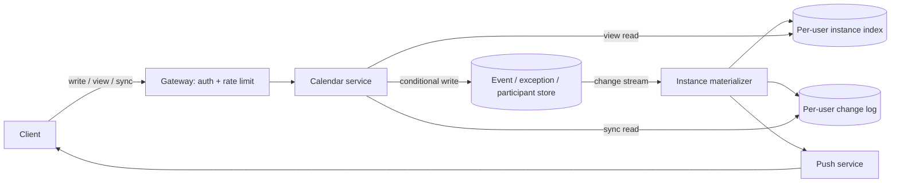

# Calendar (Google Calendar-style)

[English](README.md) · [中文](README.zh.md)

<!-- meta:begin -->
| Type | Priority | Difficulty | Roles | Topics | Round |
| --- | --- | --- | --- | --- | --- |
| System design | ★★☆☆☆ | — | SWE | schema-design, caching, sync | Onsite |
<!-- meta:end -->

## Problem

Design the calendar service behind a personal and team scheduling app. A user creates events on one or
more calendars they own, views their schedule by day, week, month or year, and invites other users to an
event so that it appears on each invitee's own calendar for them to accept, decline, or mark tentative.

An event has a title, an optional location and description, and a start and end instant; it is created in
the creator's local time zone, which is stored with it. An *all-day* event has no time zone at all — it
is anchored to calendar dates, not to instants. An event is either a single occurrence or a *recurring
event*: a rule that generates occurrences at a frequency — daily; weekly on one or more days of the week
(every Tuesday and Thursday); or monthly, either on a fixed day of the month (the 15th) or on the *n*-th of
a set of weekdays in the month (the second Tuesday; the last weekday, Monday to Friday) — repeating every
*N* periods, and ending after a fixed count, on a given date, or never. Any single occurrence of a
recurring event can later be rescheduled or cancelled on its own, identified by the time it was originally
scheduled to start, without touching the rest of the series.

The creator of an event can invite other registered users as participants; an invite adds the event to
each invitee's own view, and each invitee independently accepts, declines, or marks themselves tentative,
without affecting the other invitees' responses.

Scale for this design:

- 100,000,000 registered users, 30,000,000 of whom are active on a given day.
- A user's own calendars hold an average of 120 event definitions with occurrences in any given two-year
  span — a single occurrence or a whole recurring series each count as one; about 20% of those are
  recurring series, the rest single occurrences.
- An active user performs an average of 2 write actions a day (create, edit, cancel, or RSVP to an event)
  and loads 15 calendar views a day (opening the app and switching between day/week/month a few times);
  usage is 5x busier at its daily peak than the day's average.
- An event averages 2.5 participants, including the organizer; a user is signed in on an average of 2.5
  devices.
- Target latency: a view load (day, week, month, or year) under 150 ms at the median and under 400 ms at
  the 95th percentile; a change made on one device becomes visible on a user's other devices within 5
  seconds at the 95th percentile.

In scope: creating, rescheduling and cancelling single and recurring events, including per-occurrence
exceptions; time zones, including all-day events; inviting participants and tracking their RSVP; reading
the day/week/month/year views; and propagating a change to a user's other devices with low latency,
including one that was offline while the change happened. Out of scope: reminder notifications sent ahead
of an event's start (push or email); a free/busy lookup across other users' calendars; sharing an entire
calendar with another user (as opposed to inviting participants to one event); and importing or exporting
events to or from an external calendar system.

Produce:

1. Requirements and a scale estimate: total event storage, peak read and write QPS, and the volume of
   sync traffic pushed to devices.
2. A data model (calendars, events, recurrence rules and their exceptions, participants, and whatever a
   device needs in order to sync) and 3-5 core APIs.
3. An architecture diagram, and a walk-through of one event write and one view read along it.
4. Deep dives into: how recurring events are stored and turned into concrete occurrences; making the four
   calendar views fast to read; and keeping a user's devices in sync, including one that was offline.

## Reference solution

<details>
<summary>Show the reference solution</summary>

Two points worth confirming before designing: whether a participant must already be a registered user, or
an event can be shared with an outside email address (assumed: registered users only — an outside guest
would need its own lightweight identity, not covered here); and whether editing "all" occurrences of a
series is expected to rewrite ones that already happened (assumed: no, only occurrences that have not
started yet change).

### Requirements and scale

**Event storage.** $100{,}000{,}000$ users average $120$ event definitions each in a two-year span, for
$1.2\times10^{10}$ rows; $20\%$, $2.4\times10^9$, are recurring series and the rest single occurrences. At
roughly 280 bytes a row (title, start/end, the recurrence fields, foreign keys, flags), the event store
holds about $1.2\times10^{10}\times280 \approx 3{,}129$ GiB — a few terabytes, well inside a horizontally
sharded store.

**Read and write QPS.** $30{,}000{,}000$ daily active users write $2$ times a day on average — create,
edit, cancel, or RSVP — for $6\times10^7$ writes/day: about $694$ QPS on average and, at a $5\times$ peak
factor for the daily busy window, $3{,}472$ QPS at peak. The same users load $15$ views a day, for
$4.5\times10^8$ reads/day: about $5{,}208$ QPS on average and $26{,}042$ at peak — a $7.5$:$1$ read-to-write
ratio, which is what makes the read path, not the write path, worth spending complexity on.

**Instance index and write amplification.** The per-user instance index holds a row per occurrence per
participant, from 90 days back to 2 years ahead. If a recurring series averages 40 occurrences in two years
(an assumption: most are weekly, many end within months), a user's definitions produce
$96 + 24\times40 = 1{,}056$ occurrences per two years, $1{,}188$ in the 2.25-year window, each in $2.5$
participants' indexes: $2{,}970$ rows per user, $3\times10^{11}$ in all, about $27$ TiB at 100 bytes a row.
That is nearly nine times the event store, so the index sets the shard count; per user it is about $3.6$
rows a day. If one write in five rewrites a series' 40 occurrences ahead, a write averages
$(0.8 + 0.2\times40)\times2.5 = 22$ index rows, about $76{,}000$ row writes a second at peak, sent as one
batch per participant partition: $2.5$ per request, about $8{,}700$ a second.

**Sync push volume.** Every write needs a "something changed" push to every device of every participant:
at $2.5$ participants and $2.5$ devices each, $6.25$ targets per write (a slight over-count, including the
writer's own device), $6\times10^7\times6.25 = 3.75\times10^8$ pushes/day: about $4{,}340$ QPS on average
and $21{,}701$ at peak. That is close to the view read rate, but a push carries no event data and prompts
only a small change-log read.

### Data model and API

**Calendar** — `calendar_id`, `owner_user_id`, `name`, `timezone` (default for new events on it),
`created_at`.

**Event** — `event_id`, `calendar_id`, `organizer_user_id`, `title`, `location`, `description`, `all_day`
(bool), `start_local`, `end_local` (wall-clock times in `timezone`, like iCalendar's `DTSTART;TZID=...`, so a
series keeps its time of day; for an all-day event, `start_date`/`end_date`: calendar dates, no time zone),
`timezone` (an IANA zone name, required unless `all_day`), `recurrence` (nullable:
`{freq, interval, by_day, by_month_day, by_set_pos, count, until_utc}`), `status` (`confirmed | cancelled`),
`version` (optimistic concurrency, bumped by every change to the event or its exceptions), `updated_at` —
a single occurrence and a recurring series share this row shape. Events, exceptions and participants are
sharded by `calendar_id`.

**EventException** — one row per modified or cancelled occurrence of a series: `event_id`,
`original_start_utc` (the base rule's own occurrence time, before any override — iCalendar's
`RECURRENCE-ID`), `kind` (`cancelled | modified`; a cancelled one is what iCalendar lists in `EXDATE`),
and, when modified, `new_start_utc`, `new_end_utc`, `new_timezone`; `updated_at`.

**Participant** — `event_id`, `user_id`, `role` (`organizer | attendee`), `rsvp_status`
(`needs_action | accepted | declined | tentative`), `responded_at` (the device's clock when the user
answered); a secondary index on `user_id`.

**Per-user instance index** — `user_id`, `occurrence_start_utc` (for an all-day row, 00:00 UTC of its first
date), `occurrence_end_utc`, `event_id`, `event_version`, `calendar_id`, `title`, `all_day`,
`is_exception`, `hidden` (set when the user declined), indexed on `(user_id, occurrence_start_utc)`, and on
`(user_id, event_id)` for replacing an event's rows.

**Per-user change log** — `user_id`, `seq` (increasing per user), `event_id`, `change_type`,
`affected_from_utc`, `affected_to_utc` (the span holding the event's occurrences before and after the
change), `occurred_at`, indexed on `(user_id, seq)`.

Core APIs:

1. `POST /calendars/{calendar_id}/events` — create a single or recurring event. Body:
   `{title, start_local, end_local, timezone | start_date, end_date, recurrence?, participants: [user_id]}`.
   Returns `{event_id, version}`.
2. `PATCH /calendars/{calendar_id}/events/{event_id}` — reschedule, edit, or cancel (`status: "cancelled"`).
   Body: `{scope: "this" | "this_and_following" | "all", original_start?, ...changed fields, version}`;
   `original_start` is required unless `scope` is `"all"` or the event is not recurring. Returns the new
   `version`, or `409` with the current copy if `version` is stale.
3. `POST /events/{event_id}/rsvp` — Body: `{status: "accepted" | "declined" | "tentative", responded_at}`,
   for the whole series.
4. `GET /users/{user_id}/view?start_date=...&end_date=...&tz=...` — every occurrence overlapping those local
   dates across the user's own calendars and the invites they have not declined:
   `{occurrences: [{event_id, version, start, end, all_day, title, calendar_id, is_exception}]}`.
5. `GET /users/{user_id}/sync?since=<token>` — `{changes: [{event_id, change_type, affected_from,
   affected_to}], next_token}`; a token older than the change log's retention returns
   `{resync_required: true}` instead.

### Architecture



**Writing an event.** A create, reschedule, or RSVP goes client → gateway (auth, then a per-user rate
limit) → calendar service, which validates it and commits the `Event` row (with any `EventException`, or
only the `Participant` row for an RSVP) under the conditional update from the sync deep dive. The
materializer reads the event store's change stream, so a committed write is fanned out even if the service
crashes right after it: it re-expands the event's window into every participant's index rows, then
appends to each participant's change log and has the push service tickle their devices. In that order, a
device that sees the entry and re-reads its view gets the new rows; the stream is processed at least once,
and a repeated entry only costs a re-read.

**Reading a view.** A day/week/month/year request goes client → gateway → calendar service, which turns the
viewer's local dates into a UTC range and runs one range scan of the instance index on
`(user_id, occurrence_start_utc)`; the rows carry everything the view needs, so nothing is read from the
event store on this path.

### Deep dives

**Storing and expanding recurring events.** Read-time expansion finds, for each view, every series whose
span overlaps the range (an interval index on `(calendar_id, rule_start, rule_end)`) and expands it in
application code: a viewer takes part in $24\times2.5 = 60$ series on average, up to about 1.6 million
expansions a second at the $26{,}042$ peak, and a series with a `count` must be walked from its own start to
know whether the count has run out. Write-time materialization expands a series into rows once, so a view is
one range scan whatever the rules, at the cost of write amplification and a job that extends indefinite
series.

This design materializes — $76{,}000$ row writes a second at peak, against 1.6 million expansions inside
views' latency budgets — but keeps the rule as the only source of truth and materializes only the window
from 90 days back to 2 years ahead. A daily job slides the window; a view outside it reads the user's
events through the `Participant.user_id` index and expands them for that range. A series with no end
date starting now materializes 105 rows if weekly, 730 if daily, 24 if monthly.

The expander follows RFC 5545's `RRULE` semantics for this subset. Weeks start on Monday (its default
`WKST`), so "every 2 weeks on Monday and Friday" counts weeks from the one containing the start. A date the
month lacks (April 31) yields no occurrence and does not count toward `count`. `by_set_pos` $= n$ picks
the $n$-th of the month's dates matching `by_day`, so the last weekday is `by_day` = MO–FR with
`by_set_pos` $= -1$. `until` is inclusive, and RFC 5545 forbids `count` and `until` in the same rule. A
start date the rule does not generate is not an occurrence (RFC 5545 leaves that case undefined).

Occurrences are generated in the series' local time and then converted to UTC, so a Tuesday 9 a.m.
meeting stays at 9 a.m. through a clock change while its UTC instant shifts by an hour. A local time that
occurs twice in the fall-back hour means the first of the two, as RFC 5545 specifies. A local time
skipped by the spring-forward gap takes the offset from before the gap, so a 2:30 a.m. occurrence happens
at 3:30 daylight time: RFC 5545's rule for a single local time, where its recurrence rules would instead
drop the occurrence without a trace. Each occurrence lasts the series' exact elapsed duration: a one-hour
meeting at 1:30 a.m. on the fall-back day ends at the second 1:30.

An edit to a series names a `scope`, commits in one transaction on the calendar's shard, and bumps the
`Event` row's `version`. **This occurrence only** writes one `EventException` keyed by the occurrence's
original start, its `RECURRENCE-ID`; a cancelled occurrence still counts toward `count`, since RFC 5545
removes `EXDATE` values after the rule has generated its set. **This and following** ends the old rule just
before the edited occurrence (`until_utc` one second before its original start, `count` dropped) and creates
a new `Event` row from that occurrence's scheduled local time, with the edited fields, the remaining count
(`count` $- k$ after $k$ earlier occurrences, cancelled ones included) and copies of the `Participant` rows;
later exceptions move to it if its rule still generates their original start, and the materializer replaces
the old event's rows from the split on. **All** is "this and following" at the first occurrence not yet
started (in place if none has), so past occurrences keep their rows and their rule.

**Making the four views fast to read.** Every view is one query: a user's occurrences overlapping
`[range_start, range_end)`. Keying the index by `user_id` makes that a single scan although the schedule
spans the user's own calendars and every event they were invited to; keying it by `calendar_id` would be
cheaper to write but would turn every view into several queries plus a merge, since an invited event lives
on someone else's calendar. So invites fan out at write time: the estimate's 22 index rows per write, up to
730 per participant for an edit to a daily series. Declining sets `hidden` on that participant's rows
instead of deleting them, so re-accepting is a flag flip.

An occurrence that began before the range and is still running (a three-day offsite) is keyed before
`range_start`, so the service keeps each user's longest event duration and scans from `range_start` minus
it, keeping timed rows whose `[start, end)` overlaps the UTC range and all-day rows whose dates overlap the
viewer's local dates. That covers all-day rows too: their key, 00:00 UTC of the first date, is at most 12
hours before the viewer's midnight, and the event lasts at least 24 hours. At 3.6 rows a day, a week view is
about 25 rows, a month 110, a year 1,300, each one scan within one partition; a year full of daily series
can reach several thousand rows, which the API pages. No cache sits in front of the index: it would save
little on a single-partition scan, and a miss that read the old rows could refill it after the
materializer's invalidation. The client prefetches the adjacent range instead.

**Keeping devices in sync.** A device holds a `since` token — the last sequence number it consumed from its
user's change log — and the sync endpoint returns every entry after it plus a new token. An entry is
`(event_id, change_type, affected span)`, not the event: the device re-reads, through the view path,
whichever of its cached ranges overlap the span. A push carries only a tickle, "go sync", never a payload:
a push can be silently dropped, so correctness cannot depend on it, and the device also syncs on
foregrounding and on a slow timer.

Concurrent edits are resolved with the `Event` row's `version`, which every view occurrence carries: a
write sends the `version` the device last read, the update is conditioned on it
(`UPDATE events SET ..., version = version + 1 WHERE event_id = ? AND version = ?`), and if another device
or the organizer wrote first, perhaps while this one was offline, it matches zero rows and returns `409`
with the current copy; last-write-wins would silently drop one of the two edits. An RSVP writes only the
responder's `Participant` row, never the `Event` row's `version`, so accepting never conflicts with the
organizer editing the location; the row keeps the answer with the later `responded_at`, so a stale answer
from a device that was offline cannot overwrite a newer one.

The change log keeps 30 days: each of the $6\times10^7$ daily writes lands in $2.5$ participants' logs, so
30 days is $4.5\times10^9$ entries, about 210 GiB at 50 bytes each. An older `since` token gets a resync
response and the device re-reads its views, so the log never has to serve an arbitrarily old cursor.

### Follow-ups

- A free/busy lookup across other users, for a scheduling assistant, needs its own lightweight index of
  busy intervals queryable without exposing an event's title or attendees.
- A meeting-room calendar turns "accept an invite" into "reserve a scarce resource", needing overlap-proof
  booking (for example one row per room and 15-minute slot, inserted in one transaction only if absent)
  rather than the per-event version check.
- An RSVP to a single occurrence needs a per-participant exception keyed by `RECURRENCE-ID`, which the
  materializer overlays on that participant's rows as it overlays an `EventException`.

<details>
<summary>Verification (runnable)</summary>

**Estimate check.**

```python
users, dau, defs_per_user, recurring, GiB, TiB = 100_000_000, 30_000_000, 120, 0.20, 1024 ** 3, 1024 ** 4
defs = users * defs_per_user
assert defs == 1.2e10 and defs * recurring == 2.4e9 and round(defs * 280 / GiB) == 3129  # 280 B per event row

writes_day, views_day, peak = dau * 2, dau * 15, 5
assert (writes_day, views_day, views_day / writes_day) == (6e7, 4.5e8, 7.5)
assert [round(x / 86_400 * f) for x in (writes_day, views_day) for f in (1, peak)] == [694, 3472, 5208, 26_042]

occ_per_series, participants, window = 40, 2.5, 2.25  # assumed occurrences per series in 2 years; years
occ_2y = defs_per_user * (1 - recurring + recurring * occ_per_series)
rows_user = occ_2y * window / 2 * participants
assert [round(occ_2y), round(occ_2y * window / 2), round(rows_user)] == [1056, 1188, 2970]
assert round(users * rows_user * 100 / TiB) == 27 and round(users * rows_user * 100 / (defs * 280), 1) == 8.8
per_day = rows_user / (window * 365.25)
assert round(per_day, 1) == 3.6 and [round(per_day * d) for d in (7, 30.4, 365.25)] == [25, 110, 1320]

rows_write, peak_writes = (1 - recurring + recurring * occ_per_series) * participants, writes_day / 86_400 * peak
assert round(rows_write) == 22 and round(peak_writes * rows_write, -3) == 76_000
assert round(peak_writes * participants, -2) == 8_700  # one batch per participant
assert round(views_day / 86_400 * peak * defs_per_user * recurring * participants, -5) == 1_600_000  # read-time

pushes_day, log_entries = writes_day * participants * 2.5, writes_day * participants * 30  # 2.5 devices; 30 days
assert pushes_day == 3.75e8 and [round(pushes_day / 86_400 * f) for f in (1, peak)] == [4340, 21_701]
assert log_entries == 4.5e9 and round(log_entries * 50 / GiB) == 210
print("all requirements-and-scale numbers check out")
```

**Recurrence expansion.**

```python
from datetime import datetime, timedelta, date, time, timezone
from types import SimpleNamespace
from zoneinfo import ZoneInfo
import calendar, random

UTC, WD = timezone.utc, ["MO", "TU", "WE", "TH", "FR", "SA", "SU"]  # WD index = date.weekday()


def RecurrenceRule(freq, interval=1, by_day=(), by_month_day=None, by_set_pos=None, count=None, until_utc=None):
    """RRULE subset; by_set_pos = n picks the n-th by_day date of a month (-1 = last)."""
    return SimpleNamespace(**locals())


def _period(rule, d0, k):  # first day of the k-th day / Monday-started week / month
    if rule.freq == "DAILY":
        return d0 + timedelta(days=k * rule.interval)
    if rule.freq == "WEEKLY":  # NOTE: weeks start on Monday (WKST=MO)
        return d0 - timedelta(days=d0.weekday()) + timedelta(weeks=k * rule.interval)
    t = d0.year * 12 + d0.month - 1 + k * rule.interval
    return date(t // 12, t % 12 + 1, 1)


def _dates(rule, p):  # the rule's dates in the period starting at p
    if rule.freq == "DAILY":
        return [p]
    if rule.freq == "WEEKLY":
        return sorted(p + timedelta(days=WD.index(c)) for c in rule.by_day)
    n = calendar.monthrange(p.year, p.month)[1]
    if rule.by_month_day is not None:
        d = rule.by_month_day if rule.by_month_day > 0 else n + 1 + rule.by_month_day
        return [p.replace(day=d)] if 1 <= d <= n else []  # NOTE: no April 31: nothing, not counted
    m = [p.replace(day=i) for i in range(1, n + 1) if WD[p.replace(day=i).weekday()] in rule.by_day]
    i = rule.by_set_pos - 1 if rule.by_set_pos > 0 else rule.by_set_pos
    return [m[i]] if -len(m) <= i < len(m) else []


def expand_series(start_local, duration, tz_name, rule, exceptions, range_start, range_end):
    """Sorted UTC (start, end, original_start) overlapping [range_start, range_end); exceptions map
    original_start_utc to None (cancelled) or (new_start_utc, new_end_utc)."""
    tz, d0, tod = ZoneInfo(tz_name), start_local.date(), start_local.time()
    # NOTE: an exception moved into the range can come from any later occurrence
    horizon = max([range_end] + [o for o, x in exceptions.items() if x and x[0] < range_end and x[1] > range_start])
    out, n, k = [], 0, 0
    while _period(rule, d0, k) <= horizon.astimezone(tz).date():
        for d in (d for d in _dates(rule, _period(rule, d0, k)) if d >= d0):
            # NOTE: fold=0 is RFC 5545's reading: a repeated 01:30 is the first; a skipped 02:30 takes
            # the offset from before the gap (03:30 daylight time)
            base = datetime.combine(d, tod, tzinfo=tz).astimezone(UTC)
            n += 1
            if (rule.count is not None and n > rule.count) or (rule.until_utc is not None and base > rule.until_utc):
                return sorted(out)
            if base in exceptions and exceptions[base] is None:
                continue  # cancelled (EXDATE), still counted
            s, e = exceptions.get(base) or (base, base + duration)  # NOTE: exact, not wall-clock, duration
            if s < range_end and e > range_start:
                out.append((s, e, base))
        k += 1
    return sorted(out)


def brute_force(start_local, duration, tz_name, rule, exceptions, range_start, range_end, days=900):
    """Tests each day against the rule's clauses; own local -> UTC search; no shared helpers."""
    tz, d0, bases = ZoneInfo(tz_name), start_local.date(), []
    for i in range(days):
        d = d0 + timedelta(days=i)
        last = calendar.monthrange(d.year, d.month)[1]
        if rule.freq == "DAILY":
            ok = i % rule.interval == 0
        elif rule.freq == "WEEKLY":
            ok = WD[d.weekday()] in rule.by_day and (i + d0.weekday()) // 7 % rule.interval == 0
        elif rule.by_month_day is not None:
            ok = d.day in (rule.by_month_day, last + 1 + rule.by_month_day)
        else:
            same = [x for x in range(1, last + 1) if WD[date(d.year, d.month, x).weekday()] in rule.by_day]
            ok = d.day in same and rule.by_set_pos in (same.index(d.day) + 1, same.index(d.day) - len(same))
        if not ok or (rule.freq == "MONTHLY" and ((d.year - d0.year) * 12 + d.month - d0.month) % rule.interval):
            continue
        wall = datetime.combine(d, start_local.time(), tzinfo=UTC)  # wall-clock digits, labelled UTC
        offs = [(wall + timedelta(days=j)).astimezone(tz).utcoffset() for j in (-1, 1)]
        hits = sorted(wall - o for o in offs if (wall - o).astimezone(tz).replace(tzinfo=UTC) == wall)
        base = hits[0] if hits else wall - offs[0]  # repeated: the first; skipped: offset before
        if rule.until_utc is not None and base > rule.until_utc:
            break
        bases.append(base)
        if len(bases) == rule.count:
            break
    new = [(exceptions.get(b, (b, b + duration)), b) for b in bases]
    return sorted((x[0], x[1], b) for x, b in new if x and x[0] < range_end and x[1] > range_start)

LA, H, D, R = "America/Los_Angeles", timedelta(hours=1), timedelta(days=1), RecurrenceRule
at = lambda *a: datetime(*a, tzinfo=UTC)
replace = lambda rule, **kw: SimpleNamespace(**{**vars(rule), **kw})
fmt = lambda occ, f: [s.astimezone(ZoneInfo(LA)).strftime(f) for s, _, _ in occ]
ex = lambda start, rule, rs=at(2026, 1, 1), re_=at(2027, 1, 1): expand_series(start, H, LA, rule, {}, rs, re_)

# 02:30 on 03-08 is skipped (-> 03:30 PDT); 01:30 on 11-01 repeats (-> the first) and still lasts one hour.
assert fmt(ex(datetime(2026, 3, 7, 2, 30), R("DAILY", count=3)), "%d %H:%M%z") == [
    "07 02:30-0800", "08 03:30-0700", "09 02:30-0700"]
[(s, e, _)] = ex(datetime(2026, 10, 31, 1, 30), R("DAILY"), at(2026, 11, 1), at(2026, 11, 2))
assert fmt([(s, e, 0)], "%H:%M%z") == ["01:30-0700"] and e - s == H
w = [datetime(y, 1, 6, 9, tzinfo=ZoneInfo(LA)).astimezone(UTC) for y in (2026, 2028)]  # two years of rows
assert [len(ex(datetime(2026, 1, 6, 9), r, *w)) for r in (R("WEEKLY", by_day=("TU",)), R("DAILY"),
                                                            R("MONTHLY", by_month_day=6))] == [105, 730, 24]

# Random rules (intervals, 29th-31st, n-th / last weekday), ranges, exceptions vs brute_force; split at k.
rng, hit = random.Random(5), dict.fromkeys(["gap", "fold", "moved_in", "moved_out", "until", "split"], 0)
for case in range(500):
    tzn = rng.choice([LA, "Europe/London", "Australia/Sydney"])
    tz, rule = ZoneInfo(tzn), R(rng.choice(["DAILY", "WEEKLY", "MONTHLY"]), rng.choice([1, 1, 2, 3]))
    if rule.freq == "WEEKLY":
        rule.by_day = rng.sample(WD, rng.randint(1, 3))
    elif rule.freq == "MONTHLY" and rng.random() < 0.5:
        rule.by_month_day = rng.choice([1, 29, 30, 31, -1, -2])
    elif rule.freq == "MONTHLY":
        rule.by_day, rule.by_set_pos = rng.choice([(["TU"], 2), (["SU"], 5), (WD[:5], -1), (WD[5:], 1), (["FR"], -2)])
    start = datetime(2026, rng.choice([2, 3, 9, 10]), rng.randint(1, 28), *rng.choice([(1, 30), (2, 30), (9, 0)]))
    dur, span = rng.choice([30, 60, 150]) * timedelta(minutes=1), (at(2020, 1, 1), at(2027, 7, 1))
    E = lambda st, r, exc, a, b: expand_series(st, dur, tzn, r, exc, a, b)
    allb = [b for _, _, b in brute_force(start, dur, tzn, rule, {}, *span)]
    assert [b for _, _, b in E(start, rule, {}, *span)] == allb
    hit["gap"] += sum(b.astimezone(tz).time() != start.time() for b in allb)
    hit["fold"] += sum((b + H).astimezone(tz).time() == b.astimezone(tz).time() for b in allb)
    if not allb:
        continue
    if rng.random() < 0.3:
        rule.count = rng.randint(1, 12)
    elif rng.random() < 0.4:
        rule.until_utc = rng.choice(allb[:15])  # NOTE: exactly an occurrence: inclusive
    rs = rng.choice(allb[:20]) + rng.randint(-72, 72) * H
    re_ = rs + rng.choice([1, 7, 31, 366]) * D
    exc = {}
    for b in rng.sample(allb[:25], min(3, len(allb))):  # cancel, move into range, move far, shift
        new, far = rs + rng.random() * (re_ - rs), b + (re_ - rs) + 30 * D
        exc[b] = rng.choice([None, (new, new + dur), (far, far + dur), (b + 2 * H, b + 3 * H)])
    got = E(start, rule, exc, rs, re_)
    assert got == brute_force(start, dur, tzn, rule, exc, rs, re_), (case, rule, start, tzn)
    bases, ins = [b for _, _, b in E(start, rule, {}, span[0], max(re_, *exc) + D)], [b for _, _, b in got]
    hit["moved_in"] += sum(b >= re_ for b in ins)  # moved in from a later original time
    hit["moved_out"] += sum(x is not None and b in bases and b < re_ and b + dur > rs and b not in ins
                            for b, x in exc.items())
    hit["until"] += rule.until_utc in ins
    if rule.until_utc is None and len(bases) > 1:
        gaps = [i for i, b in enumerate(bases) if i and b.astimezone(tz).time() != start.time()]
        k = rng.choice(gaps or range(1, len(bases)))  # split at a skipped-hour occurrence if any
        old = replace(rule, count=None, until_utc=bases[k] - timedelta(seconds=1))
        new = replace(rule, count=rule.count and rule.count - k)
        new_start = datetime.combine(bases[k].astimezone(tz).date(), start.time())  # scheduled local time
        halves = (E(start, old, {b: x for b, x in exc.items() if b < bases[k]}, rs, re_) +
                  E(new_start, new, {b: x for b, x in exc.items() if b >= bases[k]}, rs, re_))
        assert sorted(halves) == got, (case, rule, k)
        hit["split"] += 1
assert min(hit.values()) >= 30, hit
print("recurrence checks pass:", hit)
```

</details>

</details>
