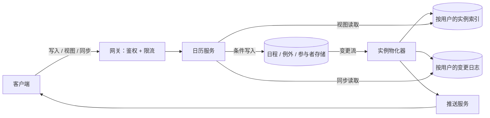

# 日历（类 Google Calendar）

[English](README.md) · [中文](README.zh.md)

<!-- meta:begin -->
| 题型 | 优先级 | 难度 | 岗位 | 考点 | 轮次 |
| --- | --- | --- | --- | --- | --- |
| 系统设计 | ★★☆☆☆ | — | SWE | schema-design, caching, sync | 现场面 |
<!-- meta:end -->

## 题目

设计个人与团队日程管理应用背后的日历服务。用户在自己拥有的一个或多个日历上创建日程，按日、周、月、年查看自己的安排，并邀请其他用户参加某个日程——被邀请者会在自己的日历里看到这个日程，并可以接受、拒绝或标记为待定。

一个日程（event）有标题、可选的地点和描述，以及一个起止时刻；它按创建者的本地时区创建，时区信息随之保存。*全天*（all-day）日程完全没有时区——它锚定在日历日期上，而不是某个时刻上。一个日程要么是单次的，要么是*重复日程*（recurring event）：由一条规则按某种频率生成多个实例——每天；每周的一个或多个星期几（每周二和周四）；或每月，可以是固定的某一天（15 日），也可以是当月一组星期几中的第 *n* 个（第二个周二；最后一个工作日，即周一到周五中的最后一天）——每隔 *N* 个周期重复一次，结束条件可以是达到固定次数、到某个日期为止，或者永不结束。重复日程的任意一次实例，之后都可以单独改期或取消，用它原本计划开始的时间来标识，不影响系列里的其余部分。

日程的创建者可以邀请其他注册用户作为参与者；一次邀请会把这个日程加入被邀请者自己的视图，每个被邀请者各自独立地接受、拒绝，或把自己标记为待定，不影响其他被邀请者的回复。

这次设计的规模：

- 100,000,000 个注册用户，其中 30,000,000 个在给定的一天里是活跃用户。
- 一个用户自己的日历上，任意两年内有实例的日程定义平均有 120 条——单次日程或一整个重复系列各算一条；其中约 20% 是重复系列，其余是单次日程。
- 一个活跃用户平均每天执行 2 次写操作（创建、编辑、取消或回复某个日程的邀请），并加载 15 次日历视图（打开应用、在日/周/月之间切换几次）；一天里的高峰使用量是日均的 5 倍。
- 一个日程平均有 2.5 个参与者（含组织者）；一个用户平均登录 2.5 台设备。
- 延迟目标：一次视图加载（日、周、月或年）中位数低于 150 毫秒，第 95 百分位低于 400 毫秒；一台设备上的改动，要在用户的其他设备上于 5 秒内（第 95 百分位）变得可见。

范围内：创建、改期和取消单次与重复日程，包括针对单个实例的例外；时区处理，包括全天日程；邀请参与者并追踪他们的回复状态；读取日/周/月/年视图；把一次改动以低延迟传播到用户的其他设备，包括改动发生时处于离线状态的设备。范围外：日程开始前发送的提醒通知（推送或邮件）；跨用户查询忙闲状态（free/busy）；把整个日历共享给另一个用户（区别于邀请参与者参加某一个日程）；与外部日历系统之间的导入或导出。

要产出：

1. 需求与规模估算：日程存储总量、读写的峰值 QPS，以及推送给设备的同步流量。
2. 一份数据模型（日历、日程、重复规则与其例外、参与者，以及设备完成同步所需要的一切）和 3 到 5 个核心接口。
3. 一张架构图，并沿着一次日程写入和一次视图读取，把图上的路径各走一遍。
4. 深入讨论：重复日程如何存储、又如何变成具体的实例；如何让四种视图读取得快；如何让用户的设备保持同步，包括曾经离线过的设备。

## 参考解答

<details>
<summary>展开参考解答</summary>

动手设计之前值得先确认两点：参与者是否必须是本系统的注册用户，还是也可以把日程共享给系统之外的一个邮箱地址（这里假设只能是注册用户——一个系统外的访客需要自己的一套轻量身份，不在本设计范围内）；以及编辑一个系列的“全部”实例，是否要求把已经发生过的实例也一并改写（这里假设不需要，只改还没有开始的实例）。

### 需求与规模

**日程存储。** $100{,}000{,}000$ 个用户，任意两年内平均每人有 $120$ 条日程定义，共 $1.2\times10^{10}$ 行；其中 $20\%$、即 $2.4\times10^9$ 行是重复系列，其余是单次日程。按每行大约 280 字节估算（标题、起止时间、重复规则的各个字段、外键、标志位），日程存储共占用约 $1.2\times10^{10}\times280 \approx 3{,}129$ GiB——几个 TB 的量级，在一个水平分片的存储上不难容纳。

**读写 QPS。** $30{,}000{,}000$ 个日活用户平均每天写 $2$ 次——创建、编辑、取消或回复邀请——共 $6\times10^7$ 次写入/天：平均约 $694$ QPS，按当天高峰时段 $5$ 倍的峰值系数，峰值约 $3{,}472$ QPS。同样这些用户每天加载 $15$ 次视图，共 $4.5\times10^8$ 次读取/天：平均约 $5{,}208$ QPS，峰值 $26{,}042$——读写比达到 $7.5$:$1$，这也是为什么值得把复杂度花在读路径而不是写路径上。

**实例索引与写放大。** 按用户的实例索引为每个参与者的每个实例各存一行，覆盖从 90 天前到 2 年后。设一个重复系列两年内平均有 40 个实例（这是假设：多数按周重复，不少几个月就结束），一个用户的日程定义每两年产生 $96 + 24\times40 = 1{,}056$ 个实例，2.25 年的窗口内是 $1{,}188$ 个；每个实例进入 $2.5$ 个参与者的索引：每个用户 $2{,}970$ 行，共 $3\times10^{11}$ 行，按每行 100 字节约 $27$ TiB，接近日程存储的九倍，所以分片数由索引决定；折合每个用户每天约 $3.6$ 行。如果五次写入里有一次改写某个系列往后的 40 个实例，每次写入平均写 $(0.8 + 0.2\times40)\times2.5 = 22$ 行索引，峰值约每秒 $76{,}000$ 行；同一参与者的行在同一个分区里，合成一批写入，每个请求 $2.5$ 批，峰值约每秒 $8{,}700$ 批。

**同步推送量。** 每一次写入都要向每个参与者的每台设备推送一条“有变化”的通知：按 $2.5$ 个参与者、每人 $2.5$ 台设备算，每次写入 $6.25$ 个推送目标（含写入者自己的设备，略有高估），$6\times10^7\times6.25 = 3.75\times10^8$ 次推送/天：平均约 $4{,}340$ QPS，峰值 $21{,}701$。这与视图读取的速率相当，但推送不带日程数据，只引来一次对变更日志的小读取。

### 数据模型与 API

**Calendar（日历）**——`calendar_id`、`owner_user_id`、`name`、`timezone`（该日历上新建日程的默认时区）、`created_at`。

**Event（日程）**——`event_id`、`calendar_id`、`organizer_user_id`、`title`、`location`、`description`、`all_day`（布尔值）、`start_local`、`end_local`（`timezone` 下的挂钟时间，同 iCalendar 的 `DTSTART;TZID=...`，系列因此保持每天的时刻；全天日程改用 `start_date`/`end_date`：纯日历日期，不带时区）、`timezone`（一个 IANA 时区名，非全天日程必填）、`recurrence`（可为空：`{freq, interval, by_day, by_month_day, by_set_pos, count, until_utc}`）、`status`（`confirmed | cancelled`）、`version`（乐观并发用，日程本身或它的例外每改动一次就加一）、`updated_at`——单次日程和重复系列共用这一种行结构。日程、例外和参与者都按 `calendar_id` 分片。

**EventException（例外）**——重复系列里每个被修改或取消的实例各占一行：`event_id`、`original_start_utc`（基础规则本该产生的那次实例的时间，不含任何覆盖——即 iCalendar 的 `RECURRENCE-ID`）、`kind`（`cancelled | modified`；被取消的实例就是 iCalendar 列在 `EXDATE` 里的那种），若是 `modified` 还有 `new_start_utc`、`new_end_utc`、`new_timezone`；以及 `updated_at`。

**Participant（参与者）**——`event_id`、`user_id`、`role`（`organizer | attendee`）、`rsvp_status`（`needs_action | accepted | declined | tentative`）、`responded_at`（用户作答时设备上的时间）；另有一个 `user_id` 上的二级索引。

**按用户的实例索引**——`user_id`、`occurrence_start_utc`（全天日程的行取其第一天的 UTC 0 点）、`occurrence_end_utc`、`event_id`、`event_version`、`calendar_id`、`title`、`all_day`、`is_exception`、`hidden`（用户拒绝邀请时置位），按 `(user_id, occurrence_start_utc)` 建索引，另按 `(user_id, event_id)` 建索引，用来替换某个日程的所有行。

**按用户的变更日志**——`user_id`、`seq`（每个用户各自递增）、`event_id`、`change_type`、`affected_from_utc`、`affected_to_utc`（覆盖这个日程改动前后所有实例的时间段）、`occurred_at`，按 `(user_id, seq)` 建索引。

核心接口：

1. `POST /calendars/{calendar_id}/events`——创建单次或重复日程。请求体：`{title, start_local, end_local, timezone | start_date, end_date, recurrence?, participants: [user_id]}`。返回 `{event_id, version}`。
2. `PATCH /calendars/{calendar_id}/events/{event_id}`——改期、编辑或取消（`status: "cancelled"`）。请求体带 `scope`（`"this" | "this_and_following" | "all"`）、按需的 `original_start`、改动后的字段，以及 `version`；除非 `scope` 是 `"all"` 或该日程本来就不是重复的，否则必须带 `original_start`。返回新的 `version`；若 `version` 已过期，返回 `409` 并带上服务端当前的副本。
3. `POST /events/{event_id}/rsvp`——请求体：`{status: "accepted" | "declined" | "tentative", responded_at}`，作用于整个系列。
4. `GET /users/{user_id}/view?start_date=...&end_date=...&tz=...`——返回该用户名下所有日历、加上没有拒绝的邀请里，与这几个本地日期重叠的每一个实例：`{occurrences: [{event_id, version, start, end, all_day, title, calendar_id, is_exception}]}`。
5. `GET /users/{user_id}/sync?since=<token>`——`{changes: [{event_id, change_type, affected_from, affected_to}], next_token}`；令牌超出变更日志的保留期时返回 `{resync_required: true}`。

### 架构



**写入一个日程。** 创建、改期或回复邀请，走的是客户端 → 网关（先鉴权、再按用户限流）→ 日历服务；日历服务校验请求后，用同步深入话题里那种条件更新提交 `Event` 行（连同可能有的 `EventException`；回复邀请则只写 `Participant` 行）。物化器读取日程存储的变更流，所以即使日历服务刚提交就崩溃，这次写入照样会被扇出：它把这个日程的窗口重新展开，写进每个参与者的索引行，然后向每个参与者的变更日志追加记录，再让推送服务提示他们的设备。按这个顺序，设备看到日志记录后再读视图，读到的已是新行；变更流至少处理一次，重复的记录只多引起一次重读。

**读取一个视图。** 日/周/月/年请求走的是客户端 → 网关 → 日历服务；日历服务把查看者的本地日期换算成一个 UTC 区间，在实例索引上做一次 `(user_id, occurrence_start_utc)` 范围扫描——这些行本身就带着视图需要的一切，这条路径上不读日程存储。

### 深入话题

**重复日程的存储与展开。** 读时展开要在每次视图读取时找出规则区间与查询区间重叠的系列（按 `(calendar_id, rule_start, rule_end)` 建的区间索引），再在应用代码里逐个展开：平均每个查看者参与 $24\times2.5 = 60$ 个系列，在 $26{,}042$ 的峰值下最多约每秒 160 万次展开，带 `count` 的系列还得从自己的起点往后数，才知道次数是否用完。写时物化一次性把系列展开成行，无论规则多复杂，视图都只是一次范围扫描，代价是写放大和一个不断延伸无终止系列的后台任务。

本设计选择物化——峰值每秒约 $76{,}000$ 行写入，对比每秒 160 万次、都要挤进视图延迟预算的展开——但规则仍是唯一的事实来源，只物化从 90 天前到 2 年后的窗口。每天运行的任务把窗口向前滑动；超出窗口的视图通过 `Participant.user_id` 索引读出该用户的日程，就地展开这个区间。一个从现在开始、没有结束日期的系列，每周一次物化出 105 行，每天一次 730 行，每月一次 24 行。

展开器对这个子集采用 RFC 5545 `RRULE` 的语义。一周从周一开始（它默认的 `WKST`），所以“每 2 周的周一和周五”从包含起点的那一周开始数。当月没有的日期（4 月 31 日）不产生实例，也不计入 `count`。`by_set_pos` $= n$ 取当月与 `by_day` 匹配的日期中的第 $n$ 个，所以“最后一个工作日”就是 `by_day` = MO–FR、`by_set_pos` $= -1$。`until` 包含端点，RFC 5545 也不允许 `count` 和 `until` 出现在同一条规则里。规则本身生成不出来的起始日期不算一个实例（RFC 5545 对这种情况未作定义）。

实例先在系列的本地时间里生成，再换算成 UTC，所以周二上午 9 点的会议在调表前后都停在本地 9 点，变化的是它的 UTC 时刻，差一小时。秋季回拨时出现两次的本地时间，取第一次，这是 RFC 5545 的规定。春季拨快时跳过的本地时间，用跳变之前的偏移量来解释，所以凌晨 2:30 的实例落在夏令时 3:30：这是 RFC 5545 对单个本地时间的规则，而它的重复规则一节会把这个实例直接丢掉，不留痕迹。每个实例的时长是系列的实际经过时长：回拨那天凌晨 1:30 开始的一小时会议，在第二个 1:30 结束。

对系列的一次编辑要指明 `scope`，在日历所在的分片上用一个事务提交，并把 `Event` 行的 `version` 加一。**只改这一次**写一条 `EventException`，以这次实例的原定开始时间、即它的 `RECURRENCE-ID` 为键；被取消的实例仍然计入 `count`，因为 RFC 5545 是在规则生成整个集合之后才去掉 `EXDATE` 里的值。**这一次及以后**让旧规则在被编辑的实例之前结束（`until_utc` 设为它原定开始前一秒，去掉 `count`），并从这次实例的计划本地时间起新建一条 `Event` 行，带着改动后的字段、剩余的次数（前面已有 $k$ 个实例时为 `count` $- k$，被取消的也算在内），以及复制过来的 `Participant` 行；之后的例外，如果新规则仍能生成它们的原定开始时间，就归到新日程上，物化器则从拆分点起把旧日程的行换成新日程的行。**全部**等于在第一个还没开始的实例处做“这一次及以后”（一个都还没开始时就原地更新），所以过去的实例保留原来的行和原来的规则。

**让四种视图读得快。** 每一种视图都是同一个查询：某个用户与 `[range_start, range_end)` 重叠的实例。以 `user_id` 为索引的键，即使日程横跨用户自己的多个日历和受邀的每个日程，也只需一次扫描；以 `calendar_id` 为键写起来更省，但受邀的日程在别人的日历上，每次视图都要变成好几次查询加一次合并。所以邀请在写时扇出：即规模估算里每次写入 22 行，编辑一个每日系列时每个参与者最多 730 行。拒绝邀请只是给这个参与者的行置上 `hidden`，不删除它们，再接受时翻转标志即可。

在区间开始前就已开始、到区间里仍在进行的实例（例如三天的外出活动），键在 `range_start` 之前。所以服务为每个用户记下最长的日程时长，从 `range_start` 减去它的地方开始扫描：定时日程的行保留 `[start, end)` 与 UTC 区间重叠的，全天日程的行保留日期与查看者本地日期重叠的。全天日程也不会漏：它的键是第一天的 UTC 0 点，最多比查看者当地午夜早 12 小时，而它至少持续 24 小时。每天约 3.6 行，周视图约 25 行，月视图 110 行，年视图 1,300 行，每一种都是单个分区内的一次扫描；满是每日系列的一年可能有几千行，接口会分页返回。索引前面不放缓存：对单个分区的一次扫描它省不了多少，而一次读到旧行的未命中，可能在物化器让缓存失效之后才把旧数据回填进去。客户端改为预取相邻区间。

**让设备保持同步。** 一台设备持有一个 `since` 令牌——它上次从用户的变更日志里消费到的序号——同步接口返回这个序号之后的每一条记录，以及一个新的令牌。一条记录是 `(event_id, change_type, 受影响的时间段)`，而不是日程本身：设备通过视图路径重新读取它已缓存、且与这个时间段重叠的区间。推送只带一句“去同步”，从不带内容：推送可能被悄悄丢弃，正确性不能依赖它，所以设备回到前台时、以及按一个较慢的定时器也会同步。

并发的编辑靠 `Event` 行的 `version` 解决，视图里的每个实例都带着它：写入时发送设备上次读到的 `version`，更新以它仍然匹配为条件（`UPDATE events SET ..., version = version + 1 WHERE event_id = ? AND version = ?`）；如果另一台设备或组织者先写了——可能正是在这台设备离线的时候——这次更新匹配不到任何一行，返回 `409` 并带上当前副本；“后写入者获胜”则会悄悄丢掉两次编辑中的一次。回复邀请只写回复者自己的 `Participant` 行，不动 `Event` 行的 `version`，所以接受邀请永远不会和组织者修改地点冲突；这一行保留 `responded_at` 较晚的那个回复，离线设备上的旧回复不会覆盖较新的回复。

变更日志保留 30 天：每天 $6\times10^7$ 次写入，每次落进 $2.5$ 个参与者的日志，30 天共 $4.5\times10^9$ 条，按每条 50 字节约 210 GiB。更早的 `since` 令牌得到的是要求重新同步的响应，设备重新读取视图，所以日志不必为任意久远的游标服务。

### 追问

- 面向调度助手的跨用户忙闲查询，需要一份自己的轻量级忙碌区间索引，查询时不暴露日程标题或参与者名单。
- 会议室一类的日历会把“接受邀请”变成“预定一份稀缺资源”，需要防止时间重叠的预定（例如每个房间每 15 分钟一行，在一个事务里仅当不存在时插入），而不是按日程的版本号检查。
- 只回复系列中的某一次，需要一条按参与者、以 `RECURRENCE-ID` 为键的例外，物化器像叠加 `EventException` 那样把它叠加到这个参与者的行上。

<details>
<summary>验证代码（可运行）</summary>

**估算核对。**

```python
users, dau, defs_per_user, recurring, GiB, TiB = 100_000_000, 30_000_000, 120, 0.20, 1024 ** 3, 1024 ** 4
defs = users * defs_per_user
assert defs == 1.2e10 and defs * recurring == 2.4e9 and round(defs * 280 / GiB) == 3129  # 280 B per event row

writes_day, views_day, peak = dau * 2, dau * 15, 5
assert (writes_day, views_day, views_day / writes_day) == (6e7, 4.5e8, 7.5)
assert [round(x / 86_400 * f) for x in (writes_day, views_day) for f in (1, peak)] == [694, 3472, 5208, 26_042]

occ_per_series, participants, window = 40, 2.5, 2.25  # assumed occurrences per series in 2 years; years
occ_2y = defs_per_user * (1 - recurring + recurring * occ_per_series)
rows_user = occ_2y * window / 2 * participants
assert [round(occ_2y), round(occ_2y * window / 2), round(rows_user)] == [1056, 1188, 2970]
assert round(users * rows_user * 100 / TiB) == 27 and round(users * rows_user * 100 / (defs * 280), 1) == 8.8
per_day = rows_user / (window * 365.25)
assert round(per_day, 1) == 3.6 and [round(per_day * d) for d in (7, 30.4, 365.25)] == [25, 110, 1320]

rows_write, peak_writes = (1 - recurring + recurring * occ_per_series) * participants, writes_day / 86_400 * peak
assert round(rows_write) == 22 and round(peak_writes * rows_write, -3) == 76_000
assert round(peak_writes * participants, -2) == 8_700  # one batch per participant
assert round(views_day / 86_400 * peak * defs_per_user * recurring * participants, -5) == 1_600_000  # read-time

pushes_day, log_entries = writes_day * participants * 2.5, writes_day * participants * 30  # 2.5 devices; 30 days
assert pushes_day == 3.75e8 and [round(pushes_day / 86_400 * f) for f in (1, peak)] == [4340, 21_701]
assert log_entries == 4.5e9 and round(log_entries * 50 / GiB) == 210
print("all requirements-and-scale numbers check out")
```

**重复展开。**

```python
from datetime import datetime, timedelta, date, time, timezone
from types import SimpleNamespace
from zoneinfo import ZoneInfo
import calendar, random

UTC, WD = timezone.utc, ["MO", "TU", "WE", "TH", "FR", "SA", "SU"]  # WD index = date.weekday()


def RecurrenceRule(freq, interval=1, by_day=(), by_month_day=None, by_set_pos=None, count=None, until_utc=None):
    """RRULE subset; by_set_pos = n picks the n-th by_day date of a month (-1 = last)."""
    return SimpleNamespace(**locals())


def _period(rule, d0, k):  # first day of the k-th day / Monday-started week / month
    if rule.freq == "DAILY":
        return d0 + timedelta(days=k * rule.interval)
    if rule.freq == "WEEKLY":  # NOTE: weeks start on Monday (WKST=MO)
        return d0 - timedelta(days=d0.weekday()) + timedelta(weeks=k * rule.interval)
    t = d0.year * 12 + d0.month - 1 + k * rule.interval
    return date(t // 12, t % 12 + 1, 1)


def _dates(rule, p):  # the rule's dates in the period starting at p
    if rule.freq == "DAILY":
        return [p]
    if rule.freq == "WEEKLY":
        return sorted(p + timedelta(days=WD.index(c)) for c in rule.by_day)
    n = calendar.monthrange(p.year, p.month)[1]
    if rule.by_month_day is not None:
        d = rule.by_month_day if rule.by_month_day > 0 else n + 1 + rule.by_month_day
        return [p.replace(day=d)] if 1 <= d <= n else []  # NOTE: no April 31: nothing, not counted
    m = [p.replace(day=i) for i in range(1, n + 1) if WD[p.replace(day=i).weekday()] in rule.by_day]
    i = rule.by_set_pos - 1 if rule.by_set_pos > 0 else rule.by_set_pos
    return [m[i]] if -len(m) <= i < len(m) else []


def expand_series(start_local, duration, tz_name, rule, exceptions, range_start, range_end):
    """Sorted UTC (start, end, original_start) overlapping [range_start, range_end); exceptions map
    original_start_utc to None (cancelled) or (new_start_utc, new_end_utc)."""
    tz, d0, tod = ZoneInfo(tz_name), start_local.date(), start_local.time()
    # NOTE: an exception moved into the range can come from any later occurrence
    horizon = max([range_end] + [o for o, x in exceptions.items() if x and x[0] < range_end and x[1] > range_start])
    out, n, k = [], 0, 0
    while _period(rule, d0, k) <= horizon.astimezone(tz).date():
        for d in (d for d in _dates(rule, _period(rule, d0, k)) if d >= d0):
            # NOTE: fold=0 is RFC 5545's reading: a repeated 01:30 is the first; a skipped 02:30 takes
            # the offset from before the gap (03:30 daylight time)
            base = datetime.combine(d, tod, tzinfo=tz).astimezone(UTC)
            n += 1
            if (rule.count is not None and n > rule.count) or (rule.until_utc is not None and base > rule.until_utc):
                return sorted(out)
            if base in exceptions and exceptions[base] is None:
                continue  # cancelled (EXDATE), still counted
            s, e = exceptions.get(base) or (base, base + duration)  # NOTE: exact, not wall-clock, duration
            if s < range_end and e > range_start:
                out.append((s, e, base))
        k += 1
    return sorted(out)


def brute_force(start_local, duration, tz_name, rule, exceptions, range_start, range_end, days=900):
    """Tests each day against the rule's clauses; own local -> UTC search; no shared helpers."""
    tz, d0, bases = ZoneInfo(tz_name), start_local.date(), []
    for i in range(days):
        d = d0 + timedelta(days=i)
        last = calendar.monthrange(d.year, d.month)[1]
        if rule.freq == "DAILY":
            ok = i % rule.interval == 0
        elif rule.freq == "WEEKLY":
            ok = WD[d.weekday()] in rule.by_day and (i + d0.weekday()) // 7 % rule.interval == 0
        elif rule.by_month_day is not None:
            ok = d.day in (rule.by_month_day, last + 1 + rule.by_month_day)
        else:
            same = [x for x in range(1, last + 1) if WD[date(d.year, d.month, x).weekday()] in rule.by_day]
            ok = d.day in same and rule.by_set_pos in (same.index(d.day) + 1, same.index(d.day) - len(same))
        if not ok or (rule.freq == "MONTHLY" and ((d.year - d0.year) * 12 + d.month - d0.month) % rule.interval):
            continue
        wall = datetime.combine(d, start_local.time(), tzinfo=UTC)  # wall-clock digits, labelled UTC
        offs = [(wall + timedelta(days=j)).astimezone(tz).utcoffset() for j in (-1, 1)]
        hits = sorted(wall - o for o in offs if (wall - o).astimezone(tz).replace(tzinfo=UTC) == wall)
        base = hits[0] if hits else wall - offs[0]  # repeated: the first; skipped: offset before
        if rule.until_utc is not None and base > rule.until_utc:
            break
        bases.append(base)
        if len(bases) == rule.count:
            break
    new = [(exceptions.get(b, (b, b + duration)), b) for b in bases]
    return sorted((x[0], x[1], b) for x, b in new if x and x[0] < range_end and x[1] > range_start)

LA, H, D, R = "America/Los_Angeles", timedelta(hours=1), timedelta(days=1), RecurrenceRule
at = lambda *a: datetime(*a, tzinfo=UTC)
replace = lambda rule, **kw: SimpleNamespace(**{**vars(rule), **kw})
fmt = lambda occ, f: [s.astimezone(ZoneInfo(LA)).strftime(f) for s, _, _ in occ]
ex = lambda start, rule, rs=at(2026, 1, 1), re_=at(2027, 1, 1): expand_series(start, H, LA, rule, {}, rs, re_)

# 02:30 on 03-08 is skipped (-> 03:30 PDT); 01:30 on 11-01 repeats (-> the first) and still lasts one hour.
assert fmt(ex(datetime(2026, 3, 7, 2, 30), R("DAILY", count=3)), "%d %H:%M%z") == [
    "07 02:30-0800", "08 03:30-0700", "09 02:30-0700"]
[(s, e, _)] = ex(datetime(2026, 10, 31, 1, 30), R("DAILY"), at(2026, 11, 1), at(2026, 11, 2))
assert fmt([(s, e, 0)], "%H:%M%z") == ["01:30-0700"] and e - s == H
w = [datetime(y, 1, 6, 9, tzinfo=ZoneInfo(LA)).astimezone(UTC) for y in (2026, 2028)]  # two years of rows
assert [len(ex(datetime(2026, 1, 6, 9), r, *w)) for r in (R("WEEKLY", by_day=("TU",)), R("DAILY"),
                                                            R("MONTHLY", by_month_day=6))] == [105, 730, 24]

# Random rules (intervals, 29th-31st, n-th / last weekday), ranges, exceptions vs brute_force; split at k.
rng, hit = random.Random(5), dict.fromkeys(["gap", "fold", "moved_in", "moved_out", "until", "split"], 0)
for case in range(500):
    tzn = rng.choice([LA, "Europe/London", "Australia/Sydney"])
    tz, rule = ZoneInfo(tzn), R(rng.choice(["DAILY", "WEEKLY", "MONTHLY"]), rng.choice([1, 1, 2, 3]))
    if rule.freq == "WEEKLY":
        rule.by_day = rng.sample(WD, rng.randint(1, 3))
    elif rule.freq == "MONTHLY" and rng.random() < 0.5:
        rule.by_month_day = rng.choice([1, 29, 30, 31, -1, -2])
    elif rule.freq == "MONTHLY":
        rule.by_day, rule.by_set_pos = rng.choice([(["TU"], 2), (["SU"], 5), (WD[:5], -1), (WD[5:], 1), (["FR"], -2)])
    start = datetime(2026, rng.choice([2, 3, 9, 10]), rng.randint(1, 28), *rng.choice([(1, 30), (2, 30), (9, 0)]))
    dur, span = rng.choice([30, 60, 150]) * timedelta(minutes=1), (at(2020, 1, 1), at(2027, 7, 1))
    E = lambda st, r, exc, a, b: expand_series(st, dur, tzn, r, exc, a, b)
    allb = [b for _, _, b in brute_force(start, dur, tzn, rule, {}, *span)]
    assert [b for _, _, b in E(start, rule, {}, *span)] == allb
    hit["gap"] += sum(b.astimezone(tz).time() != start.time() for b in allb)
    hit["fold"] += sum((b + H).astimezone(tz).time() == b.astimezone(tz).time() for b in allb)
    if not allb:
        continue
    if rng.random() < 0.3:
        rule.count = rng.randint(1, 12)
    elif rng.random() < 0.4:
        rule.until_utc = rng.choice(allb[:15])  # NOTE: exactly an occurrence: inclusive
    rs = rng.choice(allb[:20]) + rng.randint(-72, 72) * H
    re_ = rs + rng.choice([1, 7, 31, 366]) * D
    exc = {}
    for b in rng.sample(allb[:25], min(3, len(allb))):  # cancel, move into range, move far, shift
        new, far = rs + rng.random() * (re_ - rs), b + (re_ - rs) + 30 * D
        exc[b] = rng.choice([None, (new, new + dur), (far, far + dur), (b + 2 * H, b + 3 * H)])
    got = E(start, rule, exc, rs, re_)
    assert got == brute_force(start, dur, tzn, rule, exc, rs, re_), (case, rule, start, tzn)
    bases, ins = [b for _, _, b in E(start, rule, {}, span[0], max(re_, *exc) + D)], [b for _, _, b in got]
    hit["moved_in"] += sum(b >= re_ for b in ins)  # moved in from a later original time
    hit["moved_out"] += sum(x is not None and b in bases and b < re_ and b + dur > rs and b not in ins
                            for b, x in exc.items())
    hit["until"] += rule.until_utc in ins
    if rule.until_utc is None and len(bases) > 1:
        gaps = [i for i, b in enumerate(bases) if i and b.astimezone(tz).time() != start.time()]
        k = rng.choice(gaps or range(1, len(bases)))  # split at a skipped-hour occurrence if any
        old = replace(rule, count=None, until_utc=bases[k] - timedelta(seconds=1))
        new = replace(rule, count=rule.count and rule.count - k)
        new_start = datetime.combine(bases[k].astimezone(tz).date(), start.time())  # scheduled local time
        halves = (E(start, old, {b: x for b, x in exc.items() if b < bases[k]}, rs, re_) +
                  E(new_start, new, {b: x for b, x in exc.items() if b >= bases[k]}, rs, re_))
        assert sorted(halves) == got, (case, rule, k)
        hit["split"] += 1
assert min(hit.values()) >= 30, hit
print("recurrence checks pass:", hit)
```

</details>

</details>
