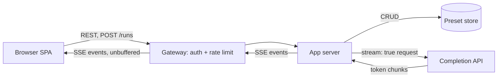

# GPT-3 Playground (Full-Stack)

[English](README.md) · [中文](README.zh.md)

<!-- meta:begin -->
| Type | Priority | Difficulty | Roles | Topics | Round |
| --- | --- | --- | --- | --- | --- |
| System design | ★☆☆☆☆ | — | SWE | fullstack, frontend, streaming, schema-design | Technical screen |
<!-- meta:end -->

## Problem

Design a website that lets a user experiment interactively with a hosted text-completion model: type a
prompt, adjust a few sampling parameters, watch the completion stream in token by token, and save a
prompt-and-parameters combination as a *preset* to reload and rerun later. You are the only engineer on
this project, starting from an empty repository — every technology choice, from the wire protocol to the
storage engine, is yours to make and justify.

The completion model itself is not something you build: it is reachable through an existing HTTP
endpoint, `POST /v1/completions`, with a JSON body `{model, prompt, max_tokens, temperature, top_p, stop,
stream}`. With `stream: false` it returns one JSON object once generation finishes. With `stream: true` it
instead returns a chunked `text/event-stream` response: each event's `data` field is a JSON object
`{text, finish_reason}`, where `text` is a few newly generated tokens of text and `finish_reason` is
`null` until the last event, then one of `"stop"` (a stop sequence was hit) or `"length"` (`max_tokens`
was reached). The endpoint bills the owner of the API key per generated token, and closing a streaming
request's connection early stops generation.

The page has a prompt box, a run button, a panel of the four parameters below it (temperature, maximum
length, top-p, and up to four stop sequences), and a sidebar listing the user's saved presets. Submitting
a prompt appends the streamed completion right after the prompt text, in the same box, rendered so the
original prompt reads as plain text and the appended completion is visually distinguished from it (for
example, a highlighted background).

Scale for this design:

- 60,000 registered users, of whom about 6,000 are active on a given day.
- An active user runs about 8 completions a day on average, for roughly 48,000 runs/day system-wide.
- A registered user has 8 saved presets on average (many have none, a few have dozens).
- Usage is heaviest during a combined US/Europe working-hours window, roughly 8 hours a day, which
  carries 60% of a day's runs.
- A completion streams for about 5 seconds on average (a model generating around 40 tokens/second, and an
  average completion length of 200 tokens).

In scope: the prompt-and-parameters editor and its interaction with the completion endpoint above;
streaming the completion into the browser; cancelling a run in progress; the full lifecycle of a preset
(create, list, load, edit, delete); per-user rate limiting on how many completions can be requested.
Login is out of scope beyond assuming an existing identity service authenticates the user and attaches a
verified user id to every request that reaches your backend — you do not need to design sign-up, sessions
or password handling. Also out of scope: billing or usage-based cost tracking, sharing a preset with
other users or a team, and any change to the completion model itself (fine-tuning, or choosing among
model variants beyond passing a `model` string through unchanged).

Produce:

1. Requirements and a scale estimate: peak concurrent streams and preset storage volume.
2. A data model (users, presets, and whatever tracks a run in progress) and the core APIs: preset CRUD,
   starting a completion, streaming it back, and cancelling it.
3. An architecture diagram covering the browser, your backend, the completion API, and preset storage,
   with a walk-through of one run along that path.
4. Deep dives into: streaming delivery to the browser; front-end state management; and saving a preset
   safely under concurrent edits.

## Reference solution

<details>
<summary>Show the reference solution</summary>

Two points worth confirming before designing: whether a finished completion becomes part of the prompt,
so the next Run continues from the whole text (assumed yes, since it is appended in the same box), and
whether rerunning a preset is expected to reproduce the same completion (assumed no — sampling above
temperature 0 is stochastic unless the completion API exposes a fixed seed, which it is not assumed to here).

### Requirements and scale

**Peak concurrent streams.** With 6,000 daily active users running 8 completions/day each,
$6{,}000 \times 8 = 48{,}000$ runs/day, an average of $48{,}000 / 86{,}400 \approx 0.56$ runs/sec started.
60% of that volume, 28,800 runs, lands inside the 8-hour (28,800 s) working-hours window, exactly 1
run/sec on average across that window; assume a 3x burst multiplier over the window average for the
single busiest minute, for a design peak of about 3 runs/sec started. Each run holds its stream open for
about 5 seconds on average (200 tokens at ~40 tokens/sec). By Little's law, $L = \lambda W$, the expected
number of concurrently open streams at that peak is about $3 \times 5 = 15$.

**Preset storage.** $60{,}000$ users at 8 presets/user average to 480,000 presets. Each preset row holds a
prompt (a few hundred characters, budget 400 bytes), the four sampling parameters, and bookkeeping fields
(name, timestamps, version) at roughly 250 bytes of JSON and metadata — about 650 bytes per preset, so
$480{,}000 \times 650 \approx 298$ MiB of preset data in total — small enough for a single modest
relational instance, backed up daily; the hard parts of this system are latency and correctness under
concurrent streams and edits, not scale.

### Data model and API

**User** — `user_id` (the id the identity service issues), `display_name`, `created_at`; authentication
itself lives in the identity service.

**Preset** — `preset_id`, `user_id`, `name`, `prompt` (text), `model`, `params`
(`{temperature, max_tokens, top_p, stop: [...]}`, at most 4 stop sequences), `schema_version` (which keys
`params` is expected to carry — see the third deep dive), `version` (incremented on every update, used for
optimistic concurrency), `created_at`, `updated_at`. There is no output field: a completion is kept only
as part of the prompt text, if the user leaves it there and saves — sampling above temperature 0 is
stochastic, so a stored output would not match a future rerun anyway.

**Run** — not a stored record. A run in progress exists only in the app-server handler streaming it (its
upstream request handle, plus user id and start time for the log line, in memory for the few seconds it
lasts) and in the browser's run state. A cancel arrives as the close of the very connection that handler
is writing to, so nothing else ever needs to look the run up — no `run_id`, no shared store — and if the process
crashes, both its connections drop with it, leaving nothing to clean up.

Keeping a durable log of every run's prompt and completion cuts both ways. It would let a user recover a
completion they forgot to keep and let support see what a failed run sent, and storage is no obstacle: at
~400 bytes of prompt and ~800 of completion (200 tokens at ~4 bytes), 48,000 runs are about 55 MiB a day,
20 GiB a year. The cost is the content: every prompt a user pastes in, however sensitive, would sit on the
server by default, with retention and deletion to manage, while a preset is a deliberate save. So this
design logs only per-run metadata (user, model, parameters, completion length, `finish_reason`, duration);
the text outlives the tab only in a saved preset, and a real need for "what did I generate an hour ago"
would get an opt-in history with a fixed retention period, not a log of every run.

Core APIs:

1. `POST /presets` — create. Body `{name, prompt, model, params}`; returns `{preset_id, version, created_at}`.
2. `GET /presets` / `GET /presets/{preset_id}` — list summaries for the sidebar, or fetch one in full to
   load into the editor.
3. `PATCH /presets/{preset_id}` — update. Body carries the new fields plus the `version` last read;
   returns the new `version`, `409 Conflict` with the current server copy if `version` is stale, or `404`
   if the preset is gone.
4. `DELETE /presets/{preset_id}`.
5. `POST /runs` — start a completion. Body `{prompt, model, params}`, always the editor's current draft;
   after validation the response is a `text/event-stream` relaying the completion API's
   `{text, finish_reason}` events one by one, plus a final `error` event if the completion API fails
   mid-run.
6. Cancelling has no endpoint: the client aborts its `POST /runs` request (first deep dive).

Every preset query also filters on the verified `user_id`, so another account's `preset_id` gets `404`.
The backend calls the completion API on the caller's behalf rather than shipping the API key to the
browser: a key in client code is readable by anyone who opens the network tab, the key's owner pays for
every token, and only a server the operator controls can enforce per-user quotas, rate limits and usage
logging against it.

### Architecture



A click on Run sends `POST /runs` with the current draft to the gateway, which checks the identity-service
token and the caller's rate-limit bucket before forwarding it to the app server. The app server validates
the parameters, then opens its own request to the completion API with `stream: true`. As each event
arrives, the app server forwards it to the browser as one `text/event-stream` event — it holds at most one
partly received event, never the completion so far, so memory per open stream stays constant rather than
growing with the completion's length. The browser appends each event's text to the highlighted
completion region as it arrives. When an event carries a non-null `finish_reason`, the app server forwards
it and ends the response; if the browser aborts instead, the app server sees its connection close and
aborts its upstream request.

### Deep dives

**Streaming delivery to the browser.** Data flows one way after the request, so Server-Sent Events — a
one-way stream of `text/event-stream` events over an ordinary HTTP response, passing through the same
gateway, auth and load balancer as the rest of the API — fit better than a WebSocket. The prompt travels
in a `POST` body, which the built-in `EventSource` (a bodiless `GET` only) cannot send, so the client
reads the response with `fetch` and a stream reader and splits it into events itself, holding an
incomplete trailing event until the next read.

The cost is in the path between the two ends. A reverse proxy that buffers responses defeats the stream:
with nginx's default `proxy_buffering on`, an upstream response is passed on in buffer-sized blocks (4 or
8 KB by default) or at the end, and a whole completion's events here are only a few kilobytes, so the text arrives in one or
two bursts. Buffering has to be turned off for this route (`proxy_buffering off`, or an
`X-Accel-Buffering: no` response header) — the `text/event-stream` content type alone does not do it — and
any gzip layer must flush after every event or skip this route, since an unflushed compressor holds its
output until the response ends; the app server itself flushes after every event. At ~15 concurrent
streams one OS thread per open request is affordable; an async I/O runtime (an event loop such as Node.js,
or an ASGI Python stack) is what keeps long-held connections cheap if streams grow into the thousands.

Cancelling is `AbortController.abort()` on that `fetch`: the browser closes the connection, the gateway
passes the abort on by closing its own connection to the app server (nginx's default), and the handler sees
the close and aborts its request to the completion API. That last step is the one that matters — breaking
out of the forwarding loop with the upstream request still open would leave the API generating, and
billing, tokens nobody will see. A closed tab takes the same path.

**Front-end state management.** Three kinds of state here, each with a different owner. *Server state* —
the preset list and any loaded preset — is the backend's data; the front end holds only a cache of it, in a
data-fetching layer of the React Query / SWR kind rather than a hand-copied global store, because that
layer already de-duplicates concurrent requests and invalidates the cache when a save succeeds.

*Editor draft state* — the prompt text and the four parameters currently being edited — is local to the
editor component's own subtree. "Unsaved changes" is a value derived from it, not a separately tracked
flag: the editor keeps the snapshot of the preset it was last loaded from (or `null`) and compares the
current `{prompt, model, params}` against it field by field on every change; a successful save replaces
the snapshot, `version` included, with the saved copy. A flag set on the first edit would stay set after an
undo back to the original values; the comparison cannot drift that way. When it finds a difference,
loading another preset or navigating away asks for confirmation.

*Run-transient state* — the run's status (`streaming | done | cancelled | error`), the completion text
streamed so far, and any error — is neither of the above: not fetched-and-cached, never written back to the
server, so it lives in its own local state, reset at the start of every run. While a run is in progress the
prompt and parameters are read-only and cancel stays available; the streamed text is its own span after
the frozen prompt. Allowing edits and merging afterwards would also work, but the screen would no longer
show the text the model is continuing, and an edit at the prompt's end, where the completion attaches,
needs a merge rule; for runs of a few seconds, locking is simpler. When the run ends, whichever way, its
text is appended to the draft prompt, so the next Run continues from the whole box (and, by the comparison
above, the draft counts as unsaved); the highlight stays as a display-only character range until the next
run starts. A plain `<textarea>` cannot style part of its text, so the box is a transparent textarea over
a mirror element that draws the highlight, or a `contenteditable` region.

The completion span is a small component and the only reader of the streamed text, so each update — at
most a few dozen a second, and one per animation frame when several events arrive in one `read()` —
re-renders nothing else: not the prompt, the parameter panel or the sidebar.

**Saving a preset under concurrent edits.** The same preset open in two browser tabs is the concurrent-write
case to design for, and the `version` integer on each row is the mechanism: a tab's `PATCH` carries the
`version` it loaded, and the backend applies it as one conditional statement,
`UPDATE presets SET ..., version = version + 1 WHERE preset_id = ? AND user_id = ? AND version = ?`. The row
lock makes two such statements run one after the other, and the second evaluates `version = ?` against the
row the first committed, so it matches zero rows; the backend then re-reads the row and returns
`409 Conflict` with the current copy (or `404` if the other tab deleted it). The losing tab shows its draft
beside the server copy and offers three choices: take the server copy, overwrite it (resend with the new
`version`, now a deliberate overwrite), or save the draft as a new preset. Last-write-wins would instead
drop one tab's edit without either tab being told.

Every parameter is range-checked on the client as it changes, so a bad value (`top_p` outside `(0, 1]`, a
fifth stop sequence) is flagged before Run is clicked; the backend repeats every check and is the copy
trusted, since `POST /presets`, `PATCH` and `POST /runs` can be called by something other than this front
end — a stale cached build, a script. `POST /runs` rejects a bad value with an ordinary `400` before
contacting the completion API, while the response can still carry an error status.

A preset's `params` will grow new keys — a fifth sampling knob is the realistic case — and
`schema_version` is what makes that cheap: reading a preset upgrades its `params` from the stored version
to the current one, filling each key added since with the value the completion API used when that key was
absent, so an old preset reruns as it did, instead of a migration rewriting all 480,000 rows the moment the
parameter ships; the version number, not just a missing key, also covers a key that is renamed or changes
meaning. Writing a preset stamps the current `schema_version`, so it carries the new key on disk only once
it is saved again.

### Follow-ups

- A per-user token bucket at the gateway, refilled continuously rather than reset once a minute, keeps one
  user's burst of retried runs from using up the completion API's rate limit, which every user shares
  through the one server-side key.
- The completion API's rate-limit or context-length errors are relayed as they are (an error status before
  the stream starts, a final `error` event mid-run), never retried silently: a silent retry after seconds
  of a stalled-looking stream reads to the user as the system being stuck.

<details>
<summary>Estimate check (runnable)</summary>

```python
users, dau_rate = 60_000, 0.10
dau = users * dau_rate
assert dau == 6_000

runs_per_dau = 8
daily_runs = dau * runs_per_dau
assert daily_runs == 48_000

avg_qps = daily_runs / 86_400
assert round(avg_qps, 2) == 0.56

window_share, window_hours = 0.60, 8
window_runs = daily_runs * window_share
window_seconds = window_hours * 3600
assert window_runs == 28_800
assert window_seconds == 28_800
window_avg_qps = window_runs / window_seconds
assert window_avg_qps == 1.0

burst_factor = 3
peak_qps = window_avg_qps * burst_factor
assert peak_qps == 3.0

tokens_per_sec, avg_completion_tokens = 40, 200
avg_stream_seconds = avg_completion_tokens / tokens_per_sec
assert avg_stream_seconds == 5.0

# Little's law: L = lambda * W
peak_concurrent_streams = peak_qps * avg_stream_seconds
assert peak_concurrent_streams == 15.0

presets_per_user = 8
total_presets = users * presets_per_user
assert total_presets == 480_000

prompt_bytes, metadata_bytes = 400, 250
preset_bytes = prompt_bytes + metadata_bytes
assert preset_bytes == 650

total_preset_bytes = total_presets * preset_bytes
MiB = 1024 ** 2
total_preset_mib = total_preset_bytes / MiB
assert round(total_preset_mib) == 298

# durable run log, if bodies were kept: prompt + completion per run
completion_bytes = avg_completion_tokens * 4        # ~4 bytes per token
assert completion_bytes == 800
run_log_bytes_per_day = daily_runs * (prompt_bytes + completion_bytes)
assert round(run_log_bytes_per_day / MiB) == 55
GiB = 1024 ** 3
assert round(run_log_bytes_per_day * 365 / GiB) == 20

print("all requirements-and-scale numbers check out")
```

</details>

</details>
