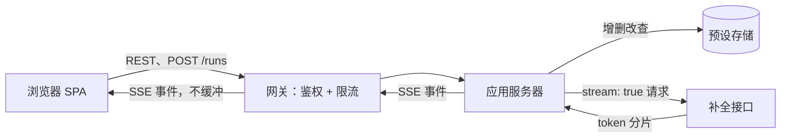

# GPT-3 Playground（全栈）

[English](README.md) · [中文](README.zh.md)

<!-- meta:begin -->
| 题型 | 优先级 | 难度 | 岗位 | 考点 | 轮次 |
| --- | --- | --- | --- | --- | --- |
| 系统设计 | ★☆☆☆☆ | — | SWE | fullstack, frontend, streaming, schema-design | 技术初筛 |
<!-- meta:end -->

## 题目

设计一个网站，让用户交互式地体验一个托管的文本补全（completion）模型：输入一段提示词（prompt），调整几个采样参数，逐个 token 地看着补全结果流式出现，并把一组提示词和参数保存为一个*预设*（preset），供以后加载并重新运行。你是这个项目唯一的开发者，从一个空仓库开始——从传输协议到存储引擎，每一个技术选择都由你决定并自己论证。

补全模型本身不需要你来构建：它可以通过一个已有的 HTTP 接口访问，`POST /v1/completions`，请求体是 JSON：`{model, prompt, max_tokens, temperature, top_p, stop, stream}`。当 `stream: false` 时，生成结束后一次性返回一个 JSON 对象。当 `stream: true` 时，它返回一个分块（chunked）的 `text/event-stream` 响应：每个事件的 `data` 字段是一个 JSON 对象 `{text, finish_reason}`，其中 `text` 是新生成的若干个 token 对应的文本，`finish_reason` 在最后一个事件之前始终是 `null`，最后一个事件里是 `"stop"`（命中了某个停止序列）或 `"length"`（达到了 `max_tokens`）二者之一。这个接口按生成的 token 数向所用 API 密钥的所有者计费；流式请求的连接一旦提前关闭，生成随即停止。

页面上有一个提示词输入框、一个运行按钮、下方一组四个参数（temperature、最大长度、top-p，以及最多四个停止序列）的面板，还有一个列出用户已保存预设的侧栏。提交一次提示词后，流式返回的补全结果会紧接在提示词文本后面追加显示在同一个输入框里：原始提示词以普通文本呈现，追加的补全部分在视觉上与之区分开（例如用高亮背景）。

这次设计的规模：

- 60,000 个注册用户，其中约 6,000 个在任意一天是活跃用户。
- 一个活跃用户平均每天运行约 8 次补全，全系统合计每天约 48,000 次运行。
- 一个注册用户平均保存 8 个预设（很多用户一个也没有，少数用户有几十个）。
- 使用高峰集中在美国与欧洲工作时间叠加的窗口内，大约每天 8 小时，承载了一天中 60% 的运行量。
- 一次补全平均流式传输约 5 秒（模型以约每秒 40 个 token 的速度生成，平均补全长度为 200 个 token）。

范围内：提示词与参数编辑器及其与上述补全接口的交互；把补全结果流式传输到浏览器；取消一次正在进行的运行；预设的完整生命周期（创建、列出、加载、编辑、删除）；按用户限制可请求的补全次数。登录不在范围内，假设已有一个身份服务对用户做鉴权，并在到达你后端的每个请求上附带一个已验证的用户 id——你不需要设计注册、会话或密码处理。同样不在范围内：计费或按使用量的成本统计、把预设分享给其他用户或团队、以及对补全模型本身的任何改动（微调，或在 `model` 字符串原样透传之外挑选模型变体）。

要产出：

1. 需求与规模估算：峰值并发流数量与预设存储量。
2. 数据模型（用户、预设，以及用来追踪一次正在进行的运行所需的东西）与核心接口：预设的增删改查、发起一次补全、把它流式返回、以及取消它。
3. 一张覆盖浏览器、你的后端、补全接口与预设存储的架构图，并沿着这条路径把一次运行走一遍。
4. 深入话题：流式传输到浏览器；前端状态管理；以及在并发编辑下安全地保存预设。

## 参考解答

<details>
<summary>展开参考解答</summary>

设计之前值得先确认两点：一次补全结束后是否并入提示词，让下一次运行接着整段文本继续（假设是，因为它就追加在同一个输入框里）；重新运行一个预设是否要求复现出同一次补全的结果（假设不需要——温度高于 0 时采样是随机的，除非补全接口暴露一个固定的种子，这里不假设它有）。

### 需求与规模

**峰值并发流。** 6,000 个日活用户每人每天运行 8 次补全，$6{,}000 \times 8 = 48{,}000$ 次运行/天，平均约 $48{,}000 / 86{,}400 \approx 0.56$ 次/秒发起。其中 60%、即 28,800 次运行落在 8 小时（28,800 秒）的工作时间窗口内，窗口内平均恰好 1 次/秒；假设在最繁忙的那一分钟，相对窗口平均值有 3 倍的突发系数，得到设计峰值约 3 次/秒发起。每次运行的流平均保持打开约 5 秒（200 个 token，速度约每秒 40 个）。由 Little 定律 $L = \lambda W$，该峰值下同时打开的流数量约为 $3 \times 5 = 15$。

**预设存储。** $60{,}000$ 个用户，人均 8 个预设，合计 480,000 个预设。每条预设记录包含一段提示词（几百个字符，按 400 字节预算）、四个采样参数，以及名称、时间戳、版本号等记账字段（约 250 字节的 JSON 与元数据）——每条约 650 字节，因此预设数据总量 $480{,}000 \times 650 \approx 298$ MiB，一个中等配置的关系型数据库实例、配上每日备份就足够了；这个系统的难点在于并发流与并发编辑下的延迟与正确性，不在规模。

### 数据模型与 API

**User（用户）**——`user_id`（身份服务签发的 id）、`display_name`、`created_at`；鉴权本身留在身份服务里。

**Preset（预设）**——`preset_id`、`user_id`、`name`、`prompt`（文本）、`model`、`params`（`{temperature, max_tokens, top_p, stop: [...]}`，最多 4 个停止序列）、`schema_version`（`params` 预期携带哪些键——见第三个深入话题）、`version`（每次更新自增，用于乐观并发控制）、`created_at`、`updated_at`。它没有输出字段：一段补全只有留在提示词文本里、再由用户保存，才会跟着预设留下来——温度高于 0 时采样是随机的，单独存下来的输出本来也对不上将来重新运行的结果。

**Run（运行）**——不是一条存储的记录。一次正在进行的运行只存在于正在转发它的那个应用服务器处理函数里（它对上游请求的句柄，外加写日志用的用户 id 和开始时间，在内存里保留流式传输的那几秒），以及浏览器的运行状态里。取消表现为这个处理函数正在写的那条连接被关闭，所以别的任何地方都不需要查找这次运行——不需要 `run_id`，也不需要共享存储；进程如果崩溃，它的两条连接随之断开，没有任何东西需要清理。

要不要为每次运行的提示词和补全结果保存一份持久日志，两个方向都有道理。保存的好处是：用户能找回一段忘了留下的补全，排查问题时也能看到一次失败的运行到底发送了什么；存储也不是障碍——按提示词约 400 字节、补全约 800 字节（200 个 token，每个约 4 字节）计算，48,000 次运行每天约 55 MiB，一年约 20 GiB。代价在于存下来的内容：用户粘贴进来的每一段提示词，不管多敏感，都会默认留在服务器上，还要为它管理保留期限和删除；而预设是用户有意的保存。所以这个设计只记录每次运行的元数据（用户、模型、参数、补全长度、`finish_reason`、耗时）；文本只有保存进预设，才会在标签页关闭后留下来。如果“找回一小时前生成的内容”真的成了需求，就加一个由用户主动开启、有固定保留期限的历史记录，而不是记录每一次运行。

核心接口：

1. `POST /presets`——创建。请求体 `{name, prompt, model, params}`；返回 `{preset_id, version, created_at}`。
2. `GET /presets` / `GET /presets/{preset_id}`——列出侧栏用的摘要信息，或取回一条完整记录以加载进编辑器。
3. `PATCH /presets/{preset_id}`——更新。请求体携带新的字段值，以及客户端上次读到的 `version`；返回新的 `version`；`version` 过期时返回 `409 Conflict` 并附上服务端当前的版本；预设已不存在时返回 `404`。
4. `DELETE /presets/{preset_id}`。
5. `POST /runs`——发起一次补全。请求体是 `{prompt, model, params}`，始终是编辑器里当前的草稿；校验通过后，响应是一个 `text/event-stream`，把补全接口的 `{text, finish_reason}` 事件逐个转发过来；如果补全接口在运行中途出错，最后再加一个 `error` 事件。
6. 取消没有单独的接口：客户端中止自己的 `POST /runs` 请求（见第一个深入话题）。

每一条预设查询还会按已验证的 `user_id` 过滤，所以拿另一个账号的 `preset_id` 只会得到 `404`。后端代替调用方去调用补全接口，而不是把 API 密钥交给浏览器：放在客户端代码里的密钥，任何打开网络面板的人都能读到；每个 token 的费用都由密钥所有者承担；只有运营方自己掌控的服务器，才能对它强制执行按用户的配额、限流和用量记录。

### 架构



点击“运行”会把带着当前草稿的 `POST /runs` 发到网关，网关先校验身份服务的令牌和调用方的限流配额，再转发给应用服务器。应用服务器校验参数，然后以 `stream: true` 向补全接口发起自己的请求。每到达一个事件，应用服务器就把它作为一个 `text/event-stream` 事件转发给浏览器——它最多只保留一个还没收完整的事件，从不积累目前为止的补全，所以每条打开的流占用的内存是常数，不随补全长度增长。浏览器把每个事件里的文本追加到高亮的补全区域，随到随显示。当某个事件带有非空的 `finish_reason` 时，应用服务器把它转发出去并结束响应；如果浏览器先中止了请求，应用服务器会看到自己的连接被关闭，随即中止对上游的请求。

### 深入话题

**流式传输到浏览器。** 请求发出之后数据只朝一个方向流动，所以 Server-Sent Events（SSE，承载在普通 HTTP 响应上的单向 `text/event-stream` 事件流，和其余接口走同样的网关、鉴权和负载均衡）比 WebSocket 更合适。提示词放在 `POST` 的请求体里，而浏览器内置的 `EventSource` 只能发不带请求体的 `GET`，所以客户端改用 `fetch` 和流读取器读取响应，自己把它切分成事件，末尾不完整的事件留到下一次读取时再拼上。

代价在两端之间的路径上。会缓冲响应的反向代理会让流式传输失效：nginx 默认 `proxy_buffering on`，上游的响应按缓冲区大小（默认 4 KB 或 8 KB）成块转发，或者等到响应结束才转发；而这里一次补全的全部事件只有几 KB，用户看到的文本就是一两次整块跳出来。所以这条路由必须关闭缓冲（`proxy_buffering off`，或者在响应头里加 `X-Accel-Buffering: no`）——光把内容类型设成 `text/event-stream` 做不到这一点；路径上的 gzip 压缩层也必须每个事件刷新一次，或者对这条路由关闭，因为不刷新的压缩器会把输出一直攒到响应结束；应用服务器自己也在每写一个事件后刷新。在约 15 条并发流的规模下，每个打开的请求占一个操作系统线程也负担得起；如果流的数量涨到上千条，要靠异步 I/O 运行时（事件循环，例如 Node.js，或者基于 ASGI 的 Python 技术栈）才能让长时间保持的连接依然便宜。

取消就是对这次 `fetch` 调用 `AbortController.abort()`：浏览器关闭连接，网关随之关闭自己到应用服务器的连接、把中止传递下去（nginx 的默认行为），处理函数看到连接关闭，就中止自己对补全接口的请求。真正关键的是最后这一步——如果只是跳出转发循环、上游请求却还开着，补全接口就会继续生成、继续为没人会看到的 token 计费。关闭标签页走的是同一条路径。

**前端状态管理。** 这里有三类状态，各自的归属不同。*服务器状态*（server state）——预设列表以及加载进来的任意一个预设——是后端的数据，前端只持有它的一份缓存，放在 React Query、SWR 这一类数据获取层里，而不是手工拷贝进一个全局仓库，因为这一层已经能对并发请求去重，并在保存成功时让缓存失效。

*编辑器草稿状态*——当前正在编辑的提示词文本和四个参数值——是编辑器组件自己子树内部的局部状态。“有未保存的修改”是从这份状态派生出来的一个值，而不是单独维护的标志位：编辑器保留着它最近一次加载的那个预设的快照（没有加载过则为 `null`），每次改动都把当前的 `{prompt, model, params}` 逐字段与这份快照比较；保存成功后，用保存下来的副本（连同新的 `version`）替换快照。一个在第一次编辑时置位的标志位，在修改被撤销回原始值之后仍然是置位的；逐字段比较不会这样与实际脱节。比较出差别时，加载另一个预设或离开页面都会先要求确认。

*运行的临时状态*——这次运行的状态（`streaming | done | cancelled | error`）、目前为止流式到达的补全文本、以及任何错误——不属于上面两类：它不被获取和缓存，也从不写回服务器，所以放在它自己的局部状态里，每次运行开始时重置。运行进行中时，提示词和参数是只读的，取消则始终可用；流式到达的文本是紧跟在冻结的提示词后面的独立一段。也可以允许用户继续编辑、等运行结束再合并，但那样屏幕上显示的就不再是模型正在续写的那段文本，而且在提示词末尾（也就是补全接上的地方）的编辑还需要一条合并规则；对只持续几秒的运行来说，锁住编辑更简单。运行无论以哪种方式结束，它的文本都会追加进草稿提示词，于是下一次运行接着整个输入框的内容继续（按上面的比较，草稿这时也算作有未保存的修改）；高亮只作为一个仅用于显示的字符区间保留，到下一次运行开始时清除。普通的 `<textarea>` 不能只给其中一部分文字加样式，所以这个输入框是一个透明的 textarea 叠在一个负责画高亮的镜像元素上，或者用一个 `contenteditable` 区域。

补全那一段是一个很小的组件，也是流式文本唯一的读取者，所以每次更新——每秒最多几十次，一次 `read()` 带来多个事件时每个动画帧只更新一次——都不会重渲染别的部分：提示词、参数面板和侧栏都不动。

**在并发编辑下保存预设。** 同一个预设在两个浏览器标签页里同时被编辑，是需要设计应对的并发写入场景，每条记录上的 `version` 整数就是应对机制：一个标签页的 `PATCH` 带着它加载时的 `version`，后端把更新做成一条条件语句，`UPDATE presets SET ..., version = version + 1 WHERE preset_id = ? AND user_id = ? AND version = ?`。行锁让两条这样的语句先后执行，后一条拿 `version = ?` 去和前一条已提交的行比较，于是匹配不到任何行；后端随即重新读取这一行，返回 `409 Conflict` 和当前的副本（如果另一个标签页已经把它删了，就返回 `404`）。落败的标签页把自己的草稿和服务端副本并排展示，给出三个选择：采用服务端副本；覆盖它（带着新的 `version` 重新提交，这时就是有意的覆盖）；或者把草稿另存为一个新预设。如果用“后写入者获胜”，其中一个标签页的修改会被丢掉，而两个标签页都不会得到任何提示。

每个参数都会在客户端改动时做范围校验，因此一个不合法的值（超出 $(0, 1]$ 的 `top_p`、第五个停止序列）在点击“运行”之前就会被标出来；后端把每一项检查都重复一遍，而且以后端为准，因为 `POST /presets`、`PATCH` 和 `POST /runs` 都可能被这个前端之外的东西调用——一个陈旧的缓存构建、一段脚本。`POST /runs` 在联系补全接口之前就用一个普通的 `400` 拒绝不合法的值，此时响应还没开始，仍然可以带上错误状态码。

预设的 `params` 会增长出新的键——以后再加第五个采样旋钮是现实的情形——`schema_version` 让这件事代价很小：读取一条预设时，把它的 `params` 从存储时的版本升级到当前版本，为之后新增的每个键填上当初缺少这个键时补全接口所用的值，于是旧预设重新运行的效果和以前一样，而不需要在新参数上线的那一刻迁移全部 480,000 条记录；靠的是版本号而不只是“缺了某个键”，所以同样的升级也能处理被改名或含义改变的键。写入预设时总是盖上当前的 `schema_version`，所以一条预设只有再次被保存后，磁盘上才会带有那个新键。

### 追问

- 网关上按用户设置一个持续补充（而不是每分钟归零一次）的令牌桶，防止某一个用户一连串的重试运行耗尽补全接口的限流额度——所有用户都通过服务器端的同一个密钥共享这份额度。
- 补全接口自身的限流或上下文长度错误会原样转发给浏览器（流开始之前是一个错误状态码，运行中途是最后一个 `error` 事件），后端绝不悄悄重试：一条看起来卡住的流过了几秒又悄悄重试，在用户看来就是系统卡死了。

<details>
<summary>估算核对（可运行）</summary>

```python
users, dau_rate = 60_000, 0.10
dau = users * dau_rate
assert dau == 6_000

runs_per_dau = 8
daily_runs = dau * runs_per_dau
assert daily_runs == 48_000

avg_qps = daily_runs / 86_400
assert round(avg_qps, 2) == 0.56

window_share, window_hours = 0.60, 8
window_runs = daily_runs * window_share
window_seconds = window_hours * 3600
assert window_runs == 28_800
assert window_seconds == 28_800
window_avg_qps = window_runs / window_seconds
assert window_avg_qps == 1.0

burst_factor = 3
peak_qps = window_avg_qps * burst_factor
assert peak_qps == 3.0

tokens_per_sec, avg_completion_tokens = 40, 200
avg_stream_seconds = avg_completion_tokens / tokens_per_sec
assert avg_stream_seconds == 5.0

# Little's law: L = lambda * W
peak_concurrent_streams = peak_qps * avg_stream_seconds
assert peak_concurrent_streams == 15.0

presets_per_user = 8
total_presets = users * presets_per_user
assert total_presets == 480_000

prompt_bytes, metadata_bytes = 400, 250
preset_bytes = prompt_bytes + metadata_bytes
assert preset_bytes == 650

total_preset_bytes = total_presets * preset_bytes
MiB = 1024 ** 2
total_preset_mib = total_preset_bytes / MiB
assert round(total_preset_mib) == 298

# durable run log, if bodies were kept: prompt + completion per run
completion_bytes = avg_completion_tokens * 4        # ~4 bytes per token
assert completion_bytes == 800
run_log_bytes_per_day = daily_runs * (prompt_bytes + completion_bytes)
assert round(run_log_bytes_per_day / MiB) == 55
GiB = 1024 ** 3
assert round(run_log_bytes_per_day * 365 / GiB) == 20

print("all requirements-and-scale numbers check out")
```

</details>

</details>
