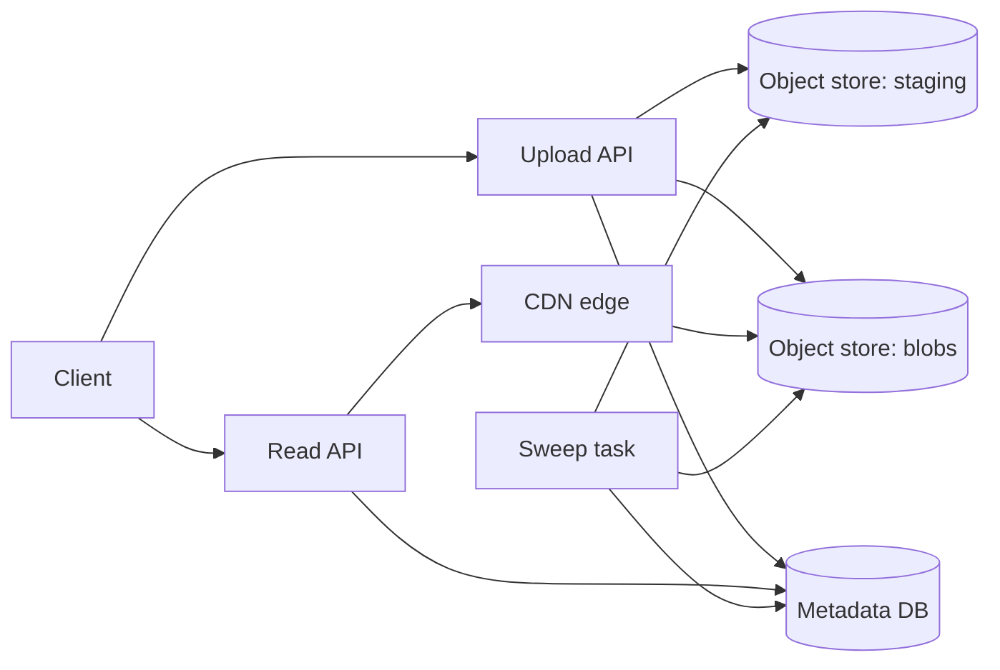

# Image Sharing with Deduplication

[English](README.md) · [中文](README.zh.md)

<!-- meta:begin -->
| Type | Priority | Difficulty | Roles | Topics | Round |
| --- | --- | --- | --- | --- | --- |
| System design | ★★☆☆☆ | Medium | SWE | storage, deduplication, consistency | Phone screen · Onsite |
<!-- meta:end -->

## Problem

Design a service that stores images and lets users share them. A user uploads an image, and afterwards
views or downloads it by a user-facing `image_id`, or deletes it. Any request that supplies a currently valid `image_id` may
view or download that image; only its owner may delete it. Two uploads whose bytes are byte-for-byte
identical must end up sharing a single stored copy of the content; the identity of a piece of content is
its SHA-256 hash.

The object store holds arbitrary byte blobs under string keys and gives three guarantees: a
*create-if-absent* (conditional) write, which creates a key only if it does not already exist and
otherwise fails without changing anything; *multipart upload*, so a large object can be sent as several
parts and becomes readable only once the upload is explicitly completed; and atomicity of a write to a
single key — no reader ever observes a partially written object, whether it arrived as one PUT or as a
completed multipart upload. The metadata store is a transactional relational database: several statements
against it can be grouped into one all-or-nothing commit.

Scale for this design:

- 40,000,000 registered users; 400,000 image uploads per day.
- Images average 3 MiB; the largest image the service accepts is 100 MiB, and any upload at or above
  8 MiB goes through multipart.
- About 30% of daily uploads are byte-identical to content the service already stores (screenshots,
  memes, and other images that get reshared widely).
- 4,000,000 views/downloads per day — 10 per upload.
- Download latency target: 150 ms at the median, served from a CDN edge cache, and 900 ms at the 95th
  percentile, a cache miss served from the object store.

In scope: the upload, view/download and delete lifecycle of a single image; computing and verifying the
SHA-256 identity of uploaded content; keeping the metadata store and the object store consistent across
the multi-step upload and delete paths, including a process dying in the middle of either one; two users
uploading identical content at the same time; and what happens to shared content when one user's
reference to it is deleted while other users still hold references to the same content. Out of scope:
generating thumbnails or transcoding images to other formats; near-duplicate detection — finding images
that are visually similar but not byte-identical is a different problem from this exact-content
deduplication, though it can come up as an extension; and the authentication system itself (assume every
request already carries a verified user id).

Produce:

1. Requirements and a scale estimate: bytes uploaded per day before and after deduplication, storage
   growth per year, and download bandwidth under the CDN hit-rate assumption you choose.
2. A data model for stored content and for a user's reference to it, and 3-5 core APIs.
3. An architecture diagram, with a walk-through of one upload and one download along it.
4. Deep dives into: (a) the upload path as a multi-step commit spanning the object store and the
   metadata store, and what a crash leaves behind at each step; (b) deletion and reference counting,
   including the race between the last reference to some content being deleted and a new upload of that
   same content; (c) the read path at scale — caching, content shared by many images, and access after
   deletion.

## Reference solution

<details>
<summary>Show the reference solution</summary>

Worth confirming first: whether a deleted `image_id` may ever be reused, and whether the object store can
issue short-lived signed URLs, which both the upload and the download path rely on. Assumed here:
ids are never reused, signed URLs are available, and anything over 100 MiB is rejected outright.

### Requirements and scale

**Storage.** $U = 400{,}000$ uploads/day at an average size $s = 3$ MiB give $U \cdot s = 1{,}200{,}000$
MiB $\approx 1.14$ TiB/day arriving at the service, before dedup. At a $30\%$ duplicate rate,
$(1 - 0.30) \cdot 1{,}200{,}000 = 840{,}000$ MiB $\approx 820.3$ GiB/day is genuinely new content needing a
new object — the store's daily growth, $840{,}000 \times 365 \approx 292.4$ TiB/year at a steady duplicate
rate. Deletions claw some of this back over time, but sizing for a year of pure growth is the conservative
number to provision against.

**Upload path.** Average QPS is $400{,}000 / 86{,}400 \approx 4.6$; a $5\times$ peak-to-average ratio
(uploads cluster in evenings and weekends, smoothed by 40 million users across time zones) gives about
$23$ QPS at peak — provision for roughly $25$ QPS.

**Download path and bandwidth.** $4{,}000{,}000$ downloads/day is a $10\!:\!1$ read-to-write ratio, about
$46.3$ QPS on average against the metadata layer, which every view and download has to reach regardless of
whether the bytes come from cache (deep dive (c)). At the assumed 3 MiB average size that is
$4{,}000{,}000 \times 3 \approx 11.44$ TiB/day of image bytes served; with a $92\%$ CDN hit rate only the
remaining $8\%$ — about $0.92$ TiB/day, $\approx 93$ Mbps sustained and $\approx 373$ Mbps at a $4\times$
read peak — has to come out of the object store.

### Data model and API

**Blob** — `sha256` (primary key, the 64 hex-character content hash), `generation`, `size_bytes`, `state`
(`pending | committed | deleting | deleted`), `ref_count`, `created_at`, `state_since` (when `state` last
changed; for a `pending` row, when an upload last claimed it). Its object key is derived, not stored:
`blobs/{sha256[0:2]}/{sha256[2:4]}/{sha256}/{generation}`. The hash prefix spreads objects across the
store's key space instead of collecting them under one prefix; the generation means that once a
generation is tombstoned, its key is never written again (deep dive (b)).

**Image** — `image_id` (primary key, 128 random bits: holding the id is what grants view access, so it must
be neither guessable nor enumerable, as a sequential id would be), `owner_id`, `sha256` (references
`Blob`), `filename`, `content_type`, `uploaded_at`. A composite index on `(owner_id, uploaded_at)` serves a
user's own upload list; an index on `sha256` backs deep dive (b)'s reconciliation job.

**Upload** — `upload_id`, `owner_id`, `multipart_upload_id` (empty for a single PUT), `image_id` (written
by the transaction that creates the image, and only while still empty), `created_at`. **GcQueue** — the
`(sha256, generation)` of an object waiting to be deleted, and `enqueued_at`.

Core APIs:

1. `POST /uploads` — `{size_bytes, content_type}` → writes an `Upload` row and returns
   `{upload_id, upload_url}` for sizes under 8 MiB, or `{upload_id, multipart_upload_id, part_size,
   part_urls}` at or above it. Either way the bytes land at a temporary key `staging/{upload_id}`, not the
   final content-addressed one, which isn't known yet.
2. `POST /uploads/{upload_id}/complete` — `{filename, content_type}` (plus the part list for a multipart
   upload) → `{image_id, sha256, status: "active"}`. A retry after it already succeeded finds
   `Upload.image_id` set and replays that result instead of creating a second image.
3. `GET /images/{image_id}` — `{filename, size_bytes, uploaded_at}`; 404 if the id was never issued or
   has since been deleted.
4. `GET /images/{image_id}/download` — a short-lived signed URL (or CDN redirect) for the content; same
   404 rule as above.
5. `DELETE /images/{image_id}` — owner-only; `{status: "deleted"}`.

### Architecture



An upload calls the Upload API for a URL, then PUTs (or multipart-PUTs) its bytes straight to `staging`.
On `complete`, the Upload API reads the staged bytes once, hashing them and spooling them to local disk,
and claims the content in the metadata DB: content already stored is linked right away; otherwise a
create-if-absent write puts the spooled bytes under the content's key in `blobs`, and a second
transaction commits the `Image` row (deep dive (a) walks through what each step leaves behind if the
process dies partway). A view or download first asks the Read API, which checks the `image_id` against
the metadata DB, then hands back a URL resolving through the CDN edge to the object in `blobs` — most
requests are satisfied at the edge and never reach `blobs` at all. The sweep task runs independently of
any request: it tombstones rows that have sat in `deleting` or `pending` for an hour, deletes the queued
objects from `blobs`, and clears the staging objects of uploads more than a day old.

### Deep dives

**(a) The upload path's multi-step commit.** Two designs for how a client with matching content could
avoid re-sending it: let it declare a hash up front and skip the upload if the store already has it, or
always require the full bytes and hash them server-side. The first is a real vulnerability: a hash is not
a secret — in this design it appears in every download URL — so anyone who has seen another user's
content hash, but never the bytes, would get a live `image_id` and a signed download URL for content they
never possessed. This design takes the second option: the server links a user to a blob only after it has
hashed the bytes itself, in step 1 of `complete`.

`complete` runs, in order: (1) read `staging/{upload_id}` once, computing its SHA-256 while spooling the
bytes to local disk and rejecting anything over 100 MiB; every later step uses this copy, because the
client's signed PUT URL may still be valid and a second read could return bytes it replaced after the
hash; (2) a *claim* transaction on the `Blob` row: `committed` or `deleting` → link now (increment
`ref_count`, set `committed`, insert `Image`, set `Upload.image_id`) and skip to step 5; absent → insert it
as `pending` with generation 1; `deleted` at generation $g$ → `pending` at $g + 1$; `pending` → keep its
generation and refresh `state_since`; (3) a create-if-absent write of the spooled bytes to that
generation's key — multipart at 8 MiB and above, readable only once completed; winning the write and
finding the object already there both mean a complete object is in place, since a single-key write is
atomic; (4) a *commit* transaction:
`UPDATE blob SET state = 'committed', ref_count = ref_count + 1 WHERE sha256 = ? AND generation = ? AND state <> 'deleted'`,
insert `Image`, set `Upload.image_id`; zero rows updated means the generation was reclaimed meanwhile, so
go back to step 2; (5) delete the staging object.

A crash before step 2 leaves only a staging object: the sweep takes every `Upload` row older than 24
hours, deletes its staging object (aborting a multipart session that is still open) and then the row. A
crash between steps 2 and 4 leaves a `pending` row and perhaps a complete object; a retry of `complete`,
or any other upload of the same content, picks up the same generation and finishes it, and if none comes
the sweep reclaims the row once it has been `pending` for an hour. A crash inside a transaction rolls it
back, and a crash after step 4 leaves only the staging object.

Two users uploading identical content at the same time serialize on the `Blob` row in step 2 — the first
inserts `pending`, the second finds it and takes the same generation — and then race on step 3's
create-if-absent write: exactly one call creates the object, and the other finds it already complete.
Both commits succeed, each with its own `Image` row, whichever call won the write.

**(b) Deletion and reference counting.** `ref_count` on `Blob` could either be a denormalized counter,
updated in the same transaction as every `Image` insert or delete, or derived on demand from
`COUNT(*) FROM image WHERE sha256 = ?`. The counter is what this design uses, since deciding whether a
delete just removed the last reference has to be cheap and on the hot path, and a transactional
`UPDATE blob SET ref_count = ref_count ± 1 ...` gives that for free: two transactions touching the same
`Blob` row take a row lock, so concurrent increments and decrements on one blob always serialize instead
of racing on a separate read-then-write. The cost is that the counter is only as trustworthy as every
write path that touches it — a manual data fix or a bulk migration on `Image` rows directly would leave it
wrong with no way to notice — so a nightly job recomputes `COUNT(*)` per `sha256` and corrects any
`Blob.ref_count` that has drifted.

`DELETE /images/{image_id}` is one metadata transaction: delete the `Image` row whose `owner_id` matches
and, only if a row was actually deleted — so a retried DELETE changes nothing — decrement `ref_count`,
setting `state = 'deleting'` and stamping `state_since` when it reaches zero. Deletion never touches the
object store. The sweep later picks rows that have sat in `deleting` for an hour (the grace period), or in
`pending` for an hour since their last claim. For each it runs one transaction — a conditional update
`... WHERE state = <state it read> AND generation = <generation it read>` that tombstones the row to the
terminal `deleted`, plus an insert of that `(sha256, generation)` into `GcQueue` — and only afterwards
deletes each queued object and then its queue row. A crash anywhere leaves queue rows that the next run
processes again; deleting an object twice is harmless.

The interesting race is a new upload of that exact content landing close to when its last reference was
deleted. The claim, the commit, the delete and the tombstone all update the same `Blob` row, so the store
serializes them. If the upload comes first, `ref_count` never reaches zero. If the row is already
`deleting`, the claim *revives* it in place — back to `committed`, `ref_count` from zero to one, same
generation — which is safe because an object is only ever deleted after its generation is tombstoned. If
the row is already `deleted`, its object is gone or about to be: the sweep's delete is unconditional and
may still be in flight, so rewriting the same key would not help — a create-if-absent write could find the
doomed object and write nothing, or the late delete could land after the rewrite. That is why the claim
moves the row to `pending` under generation $g + 1$ and writes a new key: a late delete can only hit a
generation that no row points to any more. Each content therefore has at most one live object at a time;
an object of a dead generation lingers only until its queue row is processed.

The conditional updates, not the grace period, keep references valid. The grace period saves a rewrite
when content is re-uploaded soon after its last delete; and since one `complete` takes seconds, as long as
none runs past an hour, no write to a generation is still in flight when it is tombstoned — otherwise a
write landing after its generation was purged would leave an object that nothing points to.

**(c) The read path at scale.** Two ways to key the CDN's cache: by `image_id`, or by the content key
(`sha256` plus generation) that `image_id` resolves to. Content-keyed caching is the better fit here
precisely because of deduplication: the same bytes are typically fetched under many different
`image_id`s — any image sharing that content — so one content-keyed entry serves all of them, while an
id-keyed cache would need a separate, redundant copy per id for content that is, by construction,
identical. Since the bytes under a content key never change — only whether the key exists changes — a
content-keyed entry can also carry a long, effectively "immutable" TTL, with nothing to invalidate on a
write.

The cost of keying by content is that the cache key alone says nothing about who is allowed to see it, so
the access decision cannot be made at the edge: every view or download still reaches the Read API first,
which checks that `image_id` currently resolves to a live `Image` row before handing back a URL — a
signed, short-lived one (5 minutes here) scoped to the content key. The edge verifies that signature on
every request, hit or miss, and leaves it out of the cache key, so differently signed URLs for the same
content share one cached copy; without the check at the edge, a cache hit would serve anyone who knew the
content key. Deleting an `image_id` revokes exactly this: the moment `DELETE /images/{image_id}` commits,
that id starts 404ing at the Read API's check on every subsequent request — but it does not, and
structurally cannot, touch the CDN's cache entry for the content, since other `image_id`s may still
resolve to the same bytes. The bound on how long a just-deleted image's bytes stay fetchable is therefore
the signed URL's own TTL, not the CDN's: a URL handed out moments before the delete keeps working for up
to 5 more minutes, and once the content's last reference is gone and its last URL has expired, the cached
copy is unreachable and simply ages out.

### Follow-ups

- A proof-of-possession challenge — the server names a random byte range of the stored content and the
  client must return that range's hash — would let a genuine duplicate skip the upload while still
  refusing a caller who knows only the hash, saving at most the 30% duplicate share, about 352 GiB of
  upload a day. It stays out by default because the skip itself tells the client that someone already
  stored this exact content, an existence check on other users' images.
- Near-duplicate detection (visually similar but not byte-identical images) is a separate system — a
  perceptual hash plus a nearest-neighbor index — layered alongside this exact-content path, not built
  into it.
- Content that must stop being served at once, such as after a legal request, cannot wait for 5-minute
  URLs to lapse: delete every `Image` row with that `sha256`, tombstone its `Blob` without waiting for the
  grace period, and purge its content key from the CDN.

<details>
<summary>Estimate and interleaving check (runnable)</summary>

```python
daily_uploads, avg_image_mib, dedup_rate = 400_000, 3, 0.30
raw_upload_mib_per_day = daily_uploads * avg_image_mib
assert raw_upload_mib_per_day == 1_200_000
raw_upload_tib_per_day = raw_upload_mib_per_day / (1024 ** 2)          # MiB -> TiB
assert round(raw_upload_tib_per_day, 2) == 1.14

new_unique_mib_per_day = (1 - dedup_rate) * raw_upload_mib_per_day
assert new_unique_mib_per_day == 840_000
new_unique_gib_per_day = new_unique_mib_per_day / 1024
assert round(new_unique_gib_per_day, 1) == 820.3
new_unique_tib_per_year = new_unique_mib_per_day * 365 / (1024 ** 2)
assert round(new_unique_tib_per_year, 1) == 292.4
duplicate_gib_per_day = dedup_rate * raw_upload_mib_per_day / 1024   # what skipping duplicates could save
assert round(duplicate_gib_per_day) == 352

avg_upload_qps = daily_uploads / 86_400
assert round(avg_upload_qps, 1) == 4.6
peak_upload_qps = avg_upload_qps * 5
assert round(peak_upload_qps, 1) == 23.1

daily_downloads = 4_000_000
assert daily_downloads / daily_uploads == 10
avg_view_qps = daily_downloads / 86_400
assert round(avg_view_qps, 1) == 46.3

daily_download_tib = daily_downloads * avg_image_mib / (1024 ** 2)
assert round(daily_download_tib, 2) == 11.44
cdn_hit_rate = 0.92
origin_egress_tib_per_day = daily_download_tib * (1 - cdn_hit_rate)
assert round(origin_egress_tib_per_day, 2) == 0.92
origin_mibps_avg = origin_egress_tib_per_day * (1024 ** 2) / 86_400
origin_mbps_avg = origin_mibps_avg * 8 * 1.048576          # MiB/s -> Mbit/s
assert round(origin_mbps_avg) == 93
assert round(origin_mbps_avg * 4) == 373                    # a 4x read peak

print("all requirements-and-scale numbers check out")


# --- interleaving and crash model of upload / delete / sweep for one content hash ---
# Every transaction and every object-store call is one atomic step. Searched: all interleavings of two
# uploads (each may die at any step and be retried once), three deletes (C2 retries C1), a sweep that may
# die once, and a client that overwrites its staging object after the server has read it. Staging cleanup
# touches no shared state and is left out.
from collections import Counter, namedtuple

GOOD, EVIL = "good", "evil"          # bytes that hash to the content's sha256, and bytes that do not
World = namedtuple("World", "row objects gc images staging ups done dels sweep budget")
# row: Blob (state, generation, ref_count); objects: {(key generation, bytes)}; gc: GcQueue generations;
# ups: U1, U2 as (step, generation, spooled bytes, retries left); done: uploads with Upload.image_id set;
# dels: deletes issued; sweep: (step, generation, crashes left); budget: tombstones left (bounds the search)


def start(stored):
    return World(("committed", 1, 1) if stored else ("absent", 0, 0),
                 frozenset({(1, GOOD)} if stored else ()), frozenset(), frozenset({"C"} if stored else ()),
                 GOOD, (("hash", 0, None, 1),) * 2, frozenset(), frozenset(), ("idle", 0, 1), 1)


def key(g, bug):
    return 0 if bug == "same_key" else g              # the object key is sha256 plus generation


def drop(objects, k):
    return frozenset(o for o in objects if o[0] != k)


def moves(w, bug, timing):
    state, gen, refs = w.row
    out = []
    for u, (step, g, spool, retries) in enumerate(w.ups):
        if step in ("done", "dead", "other"):
            continue
        at = lambda *new: w.ups[:u] + (new,) + w.ups[u + 1:]
        link = dict(images=w.images | {"AB"[u]}, done=w.done | {u})
        out.append(("", w._replace(ups=at("dead", g, spool, 0))))                 # the call dies for good
        if retries:
            out.append(("", w._replace(ups=at("hash", 0, None, retries - 1))))  # dies; the client retries
        if step == "hash":                             # NOTE: one read of staging both hashes and spools
            data = w.staging if u == 0 else GOOD
            out.append(("", w._replace(ups=at("claim" if data == GOOD else "other", 0, data, retries))))
        elif step == "claim" and u in w.done:          # a retry finds Upload.image_id already set
            out.append(("", w._replace(ups=at("done", g, spool, retries))))
        elif step == "claim" and (state in ("committed", "deleting")
                                  or (state == "deleted" and bug == "revive_deleted_in_place")):
            out.append(("revive" if state != "committed" else "",
                        w._replace(row=("committed", gen, refs + 1), ups=at("done", gen, spool, retries), **link)))
        elif step == "claim" and state in ("absent", "deleted"):   # NOTE: never reuse a tombstoned generation
            out.append(("new generation",
                        w._replace(row=("pending", gen + 1, 0), ups=at("write", gen + 1, spool, retries))))
        elif step == "claim":                          # pending: write and commit that same generation
            out.append(("adopt pending", w._replace(ups=at("write", gen, spool, retries))))
        elif step == "write":                          # create-if-absent PUT, or a completed multipart upload
            data = w.staging if (u == 0 and bug == "reread_staging") else spool
            present = any(k == key(g, bug) for k, _ in w.objects)
            objects = w.objects if present else w.objects | {(key(g, bug), data)}
            out.append(("", w._replace(objects=objects, ups=at("commit", g, spool, retries))))
        elif (gen == g and state != "deleted") or bug == "unconditional_commit":
            out.append(("", w._replace(row=("committed", g, refs + 1), ups=at("done", g, spool, retries), **link)))
        else:                                          # commit found its generation reclaimed: claim again
            out.append(("commit retry", w._replace(ups=at("claim", g, spool, retries))))

    for d, img in (("C1", "C"), ("C2", "C"), ("A", "A")):
        if d not in w.dels:
            hit = img in w.images or bug == "blind_decrement"  # NOTE: decrement only if a row was deleted
            row = ("deleting" if refs == 1 else state, gen, refs - 1) if hit else w.row
            out.append(("" if hit else "no-op delete",
                        w._replace(row=row, images=w.images - {img}, dels=w.dels | {d})))

    step, g, crashes = w.sweep
    sw = lambda *new, **kw: w._replace(sweep=new, **kw)
    if step != "idle" and crashes:
        out.append(("", sw("idle", 0, crashes - 1)))   # the sweep dies; its next run starts from scratch
    if step == "idle":
        writing = {q for s, q, _, _ in w.ups if s == "write"}   # the one-hour assumption, when timing is on
        ripe = w.budget and state in ("deleting", "pending") and not (timing and gen in writing)
        if ripe and bug in ("stale_tombstone", "delete_before_tombstone"):    # split into two steps
            early = drop(w.objects, key(gen, bug)) if bug == "delete_before_tombstone" else w.objects
            out.append(("", sw("tombstone", gen, crashes, objects=early)))
        elif ripe:                                     # NOTE: conditional tombstone + enqueue, one transaction
            out.append(("", sw("idle", 0, crashes, row=("deleted", gen, 0), gc=w.gc | {gen},
                               budget=w.budget - 1)))
        for q in w.gc:
            out.append(("", sw("purge", q, crashes)))
    elif step == "tombstone":                          # second transaction of the two broken variants
        if bug == "stale_tombstone" or (state in ("deleting", "pending") and gen == g):
            out.append(("", sw("idle", 0, crashes, row=("deleted", gen, refs), gc=w.gc | {g},
                               budget=w.budget - 1)))
        else:
            out.append(("", sw("idle", 0, crashes)))
    elif step == "purge":                              # NOTE: delete the object first, its queue row after
        gone = not any(k == key(g, bug) for k, _ in w.objects)
        label = "repeat purge" if gone else "late purge" if gen > g and state == "committed" else ""
        if bug == "dequeue_first":
            out.append((label, sw("dequeue", g, crashes, gc=w.gc - {g})))
        else:
            out.append((label, sw("dequeue", g, crashes, objects=drop(w.objects, key(g, bug)))))
    elif bug == "dequeue_first":
        out.append(("", sw("idle", 0, crashes, objects=drop(w.objects, key(g, bug)))))
    else:
        out.append(("", sw("idle", 0, crashes, gc=w.gc - {g})))

    if w.staging == GOOD and w.ups[0][0] in ("claim", "write"):
        out.append(("overwrite", w._replace(staging=EVIL)))  # the client replaces staging after the read
    return out


def check(bug=None, timing=True, stored=True):
    seen, stack, leaks, labels = set(), [start(stored)], 0, Counter()
    while stack:
        w = stack.pop()
        if w in seen:
            continue
        seen.add(w)
        state, gen, refs = w.row
        live = (key(gen, bug), GOOD)
        if w.images and not (state == "committed" and live in w.objects):
            return "dangling Image"
        if refs != len(w.images):
            return "ref_count drift"
        if any(data != GOOD for _, data in w.objects):
            return "object bytes do not match the hash"
        if all(u[0] in ("done", "dead", "other") for u in w.ups) and w.sweep[0] == "idle":
            queued = w.gc | ({gen} if state in ("deleting", "pending") else set())   # sweep runs to the end
            left = {o for o in w.objects if o[0] not in {key(q, bug) for q in queued}}
            if left != ({live} if state == "committed" else set()):     # at most the one live object
                if timing:
                    return "object left behind by the sweep"
                leaks += 1
        for label, nxt in moves(w, bug, timing):
            labels[label] += 1
            stack.append(nxt)
    return len(seen), leaks, labels


total, labels = 0, Counter()
for stored in (True, False):                          # the content starts out stored (image C) or absent
    n, leaks, seen_labels = check(stored=stored)
    assert leaks == 0
    total, labels = total + n, labels + seen_labels
assert all(labels[x] > 100 for x in ("revive", "new generation", "adopt pending", "commit retry", "late purge",
                                      "repeat purge", "no-op delete", "overwrite")), labels
print(f"{total} states: every Image resolves to its object, ref_count exact, nothing left after the sweep")

leaks = sum(check(timing=False, stored=stored)[1] for stored in (True, False))
assert leaks > 0          # without the one-hour assumption references stay valid, but an object can leak
print(f"without the one-hour assumption: still no dangling Image; {leaks} end states leave an object behind")

for bug in ("same_key", "revive_deleted_in_place", "unconditional_commit", "stale_tombstone",
            "delete_before_tombstone", "blind_decrement", "reread_staging", "dequeue_first"):
    found = [check(bug, stored=stored) for stored in (True, False)]
    assert any(isinstance(f, str) for f in found), bug    # every broken variant is caught
    print(f"{bug:24} -> {next(f for f in found if isinstance(f, str))}")
```

</details>

</details>
