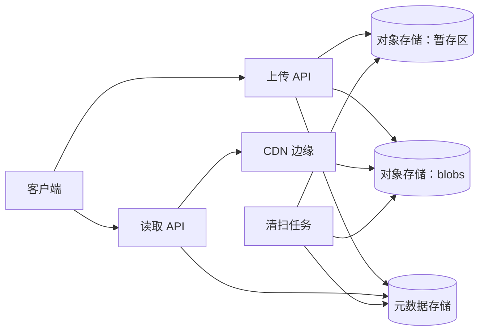

# 带去重的图片分享

[English](README.md) · [中文](README.zh.md)

<!-- meta:begin -->
| 题型 | 优先级 | 难度 | 岗位 | 考点 | 轮次 |
| --- | --- | --- | --- | --- | --- |
| 系统设计 | ★★☆☆☆ | 中等 | SWE | storage, deduplication, consistency | 电话面 · 现场面 |
<!-- meta:end -->

## 题目

设计一个存储图片、并让用户能够分享图片的服务。用户上传一张图片，之后可以通过一个面向用户的 `image_id` 查看或下载它，也可以删除它。任何请求只要带着一个当前有效的 `image_id`，就可以查看或下载对应的图片；只有图片的所有者才能删除它。两次上传如果字节完全相同，最终必须共用同一份存储的内容；一份内容的身份标识就是它的 SHA-256 哈希。

对象存储把任意字节串保存在字符串键下，并提供三项保证：*不存在才创建*（create-if-absent）的条件写入——只有这个键当前不存在时才会创建它，否则整个调用失败、不改变任何东西；*分段上传*（multipart upload）——一个大对象可以拆成多个部分发送，只有显式完成上传之后这个对象才变得可读；以及对单个键的写入是原子的——无论一个对象是通过一次 PUT、还是通过一次完成了的分段上传写入的，读者都不会看到一个写了一半的对象。元数据存储是一个支持事务的关系型数据库：对它的多条语句可以打包进一次要么全部生效、要么完全不生效的提交。

这次设计的规模：

- 40,000,000 名注册用户，每天 400,000 次图片上传。
- 图片平均大小 3 MiB；服务接受的最大图片为 100 MiB，达到或超过 8 MiB 的上传一律走分段上传。
- 每天大约 30% 的上传，其字节与服务里已经存有的某份内容完全相同（截图、表情包，以及其他被大量转发的图片）。
- 每天 4,000,000 次查看/下载——平均每次上传对应 10 次下载。
- 下载延迟目标：中位数 150 毫秒（命中 CDN 边缘缓存），第 95 百分位 900 毫秒（缓存未命中，由对象存储提供）。

范围内：单张图片的上传、查看/下载与删除生命周期；计算并校验上传内容的 SHA-256 身份；在多步的上传与删除路径中保持元数据存储与对象存储的一致，包括进程在其中任意一步崩溃的情况；两个用户同时上传相同内容；以及当一个用户对某份内容的引用被删除、而其他用户仍持有对同一份内容的引用时会发生什么。范围外：生成缩略图或把图片转码成其他格式；近似重复检测——找出视觉上相似但字节并不相同的图片，是一个不同于这里这种精确内容去重的问题，可以作为一个扩展来讨论；以及身份认证系统本身（假设每个请求都已经带着一个经过校验的用户 id）。

要产出：

1. 需求与规模估算：去重前后每天上传的字节数、每年的存储增长量，以及你选定的 CDN 命中率假设下的下载带宽。
2. 一个用于存储内容、以及用于用户对内容的引用的数据模型，加上 3 到 5 个核心接口。
3. 一张架构图，并沿着一次上传和一次下载把这条路径走一遍。
4. 深入话题：(a) 把上传路径当作横跨对象存储与元数据存储的多步提交，以及每一步之后崩溃会留下什么；(b) 删除与引用计数，包括某份内容的最后一个引用被删除、与这份内容被重新上传这两件事之间的竞态；(c) 读路径在规模下的表现——缓存、被许多图片共享的内容，以及删除之后的访问权限。

## 参考解答

<details>
<summary>展开参考解答</summary>

动手之前值得先确认：被删除的 `image_id` 以后能否重新使用；对象存储能否签发短期有效的签名 URL——上传和下载路径都要用到它。这里的假设是：id 永不重用，签名 URL 可用，超过 100 MiB 的上传直接拒绝。

### 需求与规模

**存储。** $U = 400{,}000$ 次上传/天、平均大小 $s = 3$ MiB，得到 $U \cdot s = 1{,}200{,}000$ MiB $\approx 1.14$ TiB/天，这是去重之前到达服务的字节量。按 $30\%$ 的重复率，$(1 - 0.30) \cdot 1{,}200{,}000 = 840{,}000$ MiB $\approx 820.3$ GiB/天是真正需要新对象的新内容——也就是存储的日增量，在重复率保持稳定的情况下相当于 $840{,}000 \times 365 \approx 292.4$ TiB/年。删除会随时间收回其中一部分，但按一整年的纯增长来估算容量是更保守的数字。

**上传路径。** 平均 QPS 为 $400{,}000 / 86{,}400 \approx 4.6$；按 $5$ 倍的峰均比（上传集中在傍晚和周末，4000 万用户分布在不同时区多少抹平了一些峰值）算，峰值约为 $23$ QPS——按大约 $25$ QPS 来配置上传路径。

**下载路径与带宽。** 每天 4,000,000 次下载，读写比是 $10\!:\!1$，元数据层平均约 $46.3$ QPS——无论字节本身是否来自缓存，每次查看和下载都要打到这一层（见深入话题 (c)）。按假设的 3 MiB 平均大小，这相当于每天提供 $4{,}000{,}000 \times 3 \approx 11.44$ TiB 的图片字节；在 $92\%$ 的 CDN 命中率下，只有剩下的 $8\%$——约 $0.92$ TiB/天，平均约 $93$ Mbps，在 $4$ 倍读峰值下约 $373$ Mbps——才需要从对象存储发出。

### 数据模型与 API

**Blob**——`sha256`（主键，64 个十六进制字符的内容哈希）、`generation`（代号）、`size_bytes`、`state`（`pending | committed | deleting | deleted`）、`ref_count`、`created_at`、`state_since`（`state` 最近一次改变的时刻；对 `pending` 行，是最近一次有上传认领它的时刻）。它的对象键由 `sha256` 和代号派生，不单独存储：`blobs/{sha256[0:2]}/{sha256[2:4]}/{sha256}/{generation}`。哈希前缀让对象分散在存储的键空间里，而不是全部挤在同一个前缀下；带上代号，是为了让一个代号被打上墓碑之后，它的键再也不会被写入（见深入话题 (b)）。

**Image**——`image_id`（主键，128 位随机数：持有这个 id 就能查看图片，所以它既不能被猜到，也不能像自增 id 那样被逐个枚举）、`owner_id`、`sha256`（引用 `Blob`）、`filename`、`content_type`、`uploaded_at`。`(owner_id, uploaded_at)` 上的复合索引服务于用户自己的上传列表；`sha256` 上的索引支撑深入话题 (b) 里的对账任务。

**Upload**——`upload_id`、`owner_id`、`multipart_upload_id`（单次 PUT 时为空）、`image_id`（由创建图片的那个事务写入，并且只在它仍为空时写入）、`created_at`。**GcQueue**——等待删除的对象的 `(sha256, generation)`，以及 `enqueued_at`。

核心接口：

1. `POST /uploads`——`{size_bytes, content_type}` → 写入一行 `Upload`；小于 8 MiB 时返回 `{upload_id, upload_url}`，达到或超过时返回 `{upload_id, multipart_upload_id, part_size, part_urls}`。无论哪种情况，字节都先落在临时键 `staging/{upload_id}` 下，而不是那个此时还不知道的最终内容寻址键。
2. `POST /uploads/{upload_id}/complete`——`{filename, content_type}`（分段上传再加上分段列表）→ `{image_id, sha256, status: "active"}`。已经成功过的调用再次重试，会发现 `Upload.image_id` 已有值，于是重放那次的结果，而不是再创建一张图片。
3. `GET /images/{image_id}`——`{filename, size_bytes, uploaded_at}`；这个 id 从未签发过，或者已经被删除，都返回 404。
4. `GET /images/{image_id}/download`——一个指向内容的短期签名 URL（或 CDN 重定向）；404 规则同上。
5. `DELETE /images/{image_id}`——仅限所有者；`{status: "deleted"}`。

### 架构



一次上传先调用上传 API 取得 URL，然后把字节直接 PUT（或分段 PUT）到 `staging`。调用 `complete` 时，上传 API 把暂存的字节读一遍，边算哈希边落到本地磁盘，然后在元数据存储里认领这份内容：已经存有的内容立即关联；否则用条件写入把落盘的字节写到 `blobs` 下这份内容的键，再由第二个事务提交 `Image` 行（深入话题 (a) 逐步分析进程在中途崩溃会留下什么）。一次查看或下载先问读取 API，它对照元数据存储检查 `image_id`，再返回一个经由 CDN 边缘解析到 `blobs` 里那个对象的 URL——绝大多数请求在边缘就被满足，根本不会到达 `blobs`。清扫任务独立于任何请求运行：把在 `deleting` 或 `pending` 里停留满一小时的行打上墓碑，从 `blobs` 删除排队的对象，并清理超过一天的上传留下的暂存对象。

### 深入话题

**(a) 上传路径的多步提交。** 已经持有相同内容的客户端想免去重传，有两种设计：先声明一个哈希，存储里已经有了就跳过上传；或者总是要求完整字节，由服务端自己算哈希。第一种是一个真实的漏洞：哈希不是秘密——在这个设计里，它出现在每一个下载 URL 中——于是任何见过别人的内容哈希、却从没见过那些字节的人，都能拿到一个活的 `image_id` 和一个签名下载 URL，取到自己从未持有过的内容。这里采用第二种：服务端只在自己对字节算过哈希之后，才把用户和 blob 关联起来，即 `complete` 的第 1 步。

`complete` 按顺序做这几件事：(1) 把 `staging/{upload_id}` 读一遍，边算 SHA-256 边把字节落到本地磁盘，超过 100 MiB 的直接拒绝；之后各步都用这份落盘的副本，因为客户端手里的签名 PUT URL 可能仍然有效，再读一次，读到的可能是客户端在算完哈希之后换掉的字节；(2) 对 `Blob` 行执行*认领*（claim）事务：`committed` 或 `deleting` → 立即关联（`ref_count` 加一、置为 `committed`、插入 `Image`、写入 `Upload.image_id`），跳到第 5 步；不存在 → 以代号 1 插入 `pending` 行；代号为 $g$ 的 `deleted` → 改为代号 $g + 1$ 的 `pending`；`pending` → 沿用它的代号并刷新 `state_since`；(3) 用条件写入把落盘的字节写到这个代号的键，8 MiB 及以上走分段上传、完成之后才可读；无论这次写入是自己创建了对象，还是发现对象已经存在，都说明一个完整的对象已经就位，因为单个键的写入是原子的；(4) *提交*事务：`UPDATE blob SET state = 'committed', ref_count = ref_count + 1 WHERE sha256 = ? AND generation = ? AND state <> 'deleted'`，插入 `Image`，写入 `Upload.image_id`；影响行数为零，说明这个代号在此期间已被回收，回到第 2 步；(5) 删除暂存对象。

第 2 步之前崩溃，只留下一个暂存对象：清扫任务会处理所有超过 24 小时的 `Upload` 行，删除它的暂存对象（分段会话还开着就中止它），再删除这一行。第 2 到第 4 步之间崩溃，留下一行 `pending`，可能还有一个完整的对象：客户端重试 `complete`，或者任何一次相同内容的上传，都会沿用同一个代号把它完成；如果一直没人来，清扫任务在这一行停留在 `pending` 满一小时后回收它。事务内部崩溃由事务回滚；第 4 步之后崩溃，只剩下暂存对象。

两个用户同时上传相同内容时，两次认领在同一行 `Blob` 上串行化——先到的插入 `pending`，后到的发现它并沿用同一个代号——然后在第 3 步的条件写入上竞争：恰好一方创建了对象，另一方发现对象已经完整存在。两边的提交都会成功，各自得到自己的 `Image` 行，与谁赢得写入无关。

**(b) 删除与引用计数。** `Blob` 上的 `ref_count` 既可以是一个反规范化的计数器，在每次 `Image` 的插入或删除所在的同一个事务里更新；也可以按需从 `COUNT(*) FROM image WHERE sha256 = ?` 派生。这里选用计数器，因为判断一次删除是否刚好删掉了最后一个引用，需要在热路径上做到足够便宜，而一次事务性的 `UPDATE blob SET ref_count = ref_count ± 1 ...` 天然就能做到：两个触及同一个 `Blob` 行的事务会取得行锁，于是同一个 blob 上并发的加一和减一总是被串行化，而不是在“先读后写”这两步之间产生竞争。代价是这个计数器只有在每条写路径都经过它时才值得信任——一次手工的数据修复，或者一次直接改动 `Image` 行的批量迁移，都会在无人察觉的情况下让它出错——所以一个每晚运行的任务会按 `sha256` 重新计算 `COUNT(*)`，纠正任何已经出现漂移的 `Blob.ref_count`。

`DELETE /images/{image_id}` 是一次元数据事务：删除 `owner_id` 匹配的那一行 `Image`；只有确实删掉了一行，才把 `ref_count` 减一（所以重试的 DELETE 什么也不改），减到零时把 `state` 置为 `deleting` 并更新 `state_since`。删除完全不涉及对象存储。清扫任务之后挑出在 `deleting` 里停留满一小时（宽限期，grace period）、或者自最近一次认领起在 `pending` 里停留满一小时的行，对每一行执行一个事务：条件更新 `... WHERE state = <读到的状态> AND generation = <读到的代号>`，把它置为终态 `deleted`（打墓碑，tombstone），同时把这个 `(sha256, generation)` 插入 `GcQueue`；之后才删除队列里的每个对象，删完再删它的队列行。任何一处崩溃都只会留下队列行，由下一次运行再处理一遍；同一个对象删两次没有害处。

真正有意思的竞态，是同一份内容的一次新上传，恰好落在它最后一个引用被删除的前后。认领、提交、删除和打墓碑都更新同一行 `Blob`，所以存储会把它们串行化。上传在前，`ref_count` 就不会降到零。这一行已经是 `deleting`，认领就原地*复活*（revive）它：回到 `committed`，`ref_count` 从零加一，代号不变——这是安全的，因为一个对象只会在它的代号被打上墓碑之后才被删除。这一行已经是 `deleted`，它的对象要么已经没了，要么即将被删：清扫任务的删除不带条件，而且可能还在路上，所以重写同一个键无济于事——条件写入可能发现那个注定被删的对象还在，于是什么也不写；迟到的删除也可能落在重写之后。所以认领把这一行改为代号 $g + 1$ 的 `pending`，写一个新的键：迟到的删除只会落在一个已经没有任何行指向的代号上。因此一份内容任何时刻最多只有一个活的对象；死去代号的对象只保留到它的队列行被处理为止。

保证引用有效的是这些条件更新，而不是宽限期。宽限期让刚被删掉又被重新上传的内容省去一次重写；而且一次 `complete` 只需几秒，只要没有哪次调用超过一小时，一个代号被打上墓碑时就不会还有对它的写入在进行——否则，一次在回收之后才落地的写入，会留下一个没有任何东西指向的对象。

**(c) 读路径在规模下的表现。** 给 CDN 缓存定键有两种方式：按 `image_id`，或者按 `image_id` 最终解析到的内容键（`sha256` 加代号）。按内容键缓存在这里恰恰因为去重而更合适：同样的字节通常会在许多不同的 `image_id` 下被取用——任何共享那份内容的图片都算——所以一条按内容键缓存的条目能同时服务所有这些图片，而按 id 缓存则要为构造上完全相同的内容各留一份冗余的拷贝。因为同一个内容键下的字节永远不会变——变的只是这个键存不存在——按内容键缓存的条目也可以带上一个很长、事实上“永不过期”的 TTL，写入时没有任何东西需要失效。

按内容而不是按 id 定键的代价，是缓存键本身完全不携带“谁有权看”这个信息，所以访问决定不能在边缘做出：每一次查看或下载仍然要先打到读取 API，它检查 `image_id` 当前是否解析到一个存活的 `Image` 行，然后才返回一个作用域限定在内容键上、有效期很短（这里是 5 分钟）的签名 URL。边缘对每一个请求都校验这个签名，无论是否命中缓存，并把签名排除在缓存键之外，所以对同一份内容签发的不同 URL 共用一份缓存；如果边缘不校验，一次缓存命中就会把内容交给任何知道内容键的人。删除一个 `image_id` 撤销的正是这个：`DELETE /images/{image_id}` 一旦提交，这个 id 在读取 API 的检查那里对之后的每一次请求都返回 404——但它不会、在结构上也不可能去动 CDN 里这份内容的缓存条目，因为别的 `image_id` 可能仍然解析到同样的字节。一张刚被删除的图片，它的字节还能被取到多久，取决于签名 URL 自己的 TTL，而不是 CDN 的：删除前一刻发出的 URL 还能再用最多 5 分钟；内容的最后一个引用被删除、最后一个 URL 也过期之后，缓存里的那份拷贝就再也取不到，只是等着被淘汰。

### 追问

- 持有性证明挑战（proof-of-possession challenge）——服务端指定已存内容里一段随机的字节范围，客户端必须返回这一段的哈希——能让真正的重复上传免去传输，同时仍然拒绝只知道哈希的调用方，最多省下占上传量 30% 的重复部分，约每天 352 GiB。默认不采用它，是因为“跳过上传”本身就告诉了客户端：已经有人存过这份一模一样的内容，等于对别人的图片提供了一个存在性查询。
- 近似重复检测（视觉上相似但字节并不相同的图片）是一个独立的系统——感知哈希加上最近邻索引——叠加在这条精确内容的路径旁边，而不是内建到它里面。
- 必须立即停止提供的内容（例如收到法律要求之后）等不起 5 分钟的 URL 过期：删除所有带这个 `sha256` 的 `Image` 行，不等宽限期直接给它的 `Blob` 打墓碑，再从 CDN 显式清除它的内容键。

<details>
<summary>估算与交错核对（可运行）</summary>

```python
daily_uploads, avg_image_mib, dedup_rate = 400_000, 3, 0.30
raw_upload_mib_per_day = daily_uploads * avg_image_mib
assert raw_upload_mib_per_day == 1_200_000
raw_upload_tib_per_day = raw_upload_mib_per_day / (1024 ** 2)          # MiB -> TiB
assert round(raw_upload_tib_per_day, 2) == 1.14

new_unique_mib_per_day = (1 - dedup_rate) * raw_upload_mib_per_day
assert new_unique_mib_per_day == 840_000
new_unique_gib_per_day = new_unique_mib_per_day / 1024
assert round(new_unique_gib_per_day, 1) == 820.3
new_unique_tib_per_year = new_unique_mib_per_day * 365 / (1024 ** 2)
assert round(new_unique_tib_per_year, 1) == 292.4
duplicate_gib_per_day = dedup_rate * raw_upload_mib_per_day / 1024   # what skipping duplicates could save
assert round(duplicate_gib_per_day) == 352

avg_upload_qps = daily_uploads / 86_400
assert round(avg_upload_qps, 1) == 4.6
peak_upload_qps = avg_upload_qps * 5
assert round(peak_upload_qps, 1) == 23.1

daily_downloads = 4_000_000
assert daily_downloads / daily_uploads == 10
avg_view_qps = daily_downloads / 86_400
assert round(avg_view_qps, 1) == 46.3

daily_download_tib = daily_downloads * avg_image_mib / (1024 ** 2)
assert round(daily_download_tib, 2) == 11.44
cdn_hit_rate = 0.92
origin_egress_tib_per_day = daily_download_tib * (1 - cdn_hit_rate)
assert round(origin_egress_tib_per_day, 2) == 0.92
origin_mibps_avg = origin_egress_tib_per_day * (1024 ** 2) / 86_400
origin_mbps_avg = origin_mibps_avg * 8 * 1.048576          # MiB/s -> Mbit/s
assert round(origin_mbps_avg) == 93
assert round(origin_mbps_avg * 4) == 373                    # a 4x read peak

print("all requirements-and-scale numbers check out")


# --- interleaving and crash model of upload / delete / sweep for one content hash ---
# Every transaction and every object-store call is one atomic step. Searched: all interleavings of two
# uploads (each may die at any step and be retried once), three deletes (C2 retries C1), a sweep that may
# die once, and a client that overwrites its staging object after the server has read it. Staging cleanup
# touches no shared state and is left out.
from collections import Counter, namedtuple

GOOD, EVIL = "good", "evil"          # bytes that hash to the content's sha256, and bytes that do not
World = namedtuple("World", "row objects gc images staging ups done dels sweep budget")
# row: Blob (state, generation, ref_count); objects: {(key generation, bytes)}; gc: GcQueue generations;
# ups: U1, U2 as (step, generation, spooled bytes, retries left); done: uploads with Upload.image_id set;
# dels: deletes issued; sweep: (step, generation, crashes left); budget: tombstones left (bounds the search)


def start(stored):
    return World(("committed", 1, 1) if stored else ("absent", 0, 0),
                 frozenset({(1, GOOD)} if stored else ()), frozenset(), frozenset({"C"} if stored else ()),
                 GOOD, (("hash", 0, None, 1),) * 2, frozenset(), frozenset(), ("idle", 0, 1), 1)


def key(g, bug):
    return 0 if bug == "same_key" else g              # the object key is sha256 plus generation


def drop(objects, k):
    return frozenset(o for o in objects if o[0] != k)


def moves(w, bug, timing):
    state, gen, refs = w.row
    out = []
    for u, (step, g, spool, retries) in enumerate(w.ups):
        if step in ("done", "dead", "other"):
            continue
        at = lambda *new: w.ups[:u] + (new,) + w.ups[u + 1:]
        link = dict(images=w.images | {"AB"[u]}, done=w.done | {u})
        out.append(("", w._replace(ups=at("dead", g, spool, 0))))                 # the call dies for good
        if retries:
            out.append(("", w._replace(ups=at("hash", 0, None, retries - 1))))  # dies; the client retries
        if step == "hash":                             # NOTE: one read of staging both hashes and spools
            data = w.staging if u == 0 else GOOD
            out.append(("", w._replace(ups=at("claim" if data == GOOD else "other", 0, data, retries))))
        elif step == "claim" and u in w.done:          # a retry finds Upload.image_id already set
            out.append(("", w._replace(ups=at("done", g, spool, retries))))
        elif step == "claim" and (state in ("committed", "deleting")
                                  or (state == "deleted" and bug == "revive_deleted_in_place")):
            out.append(("revive" if state != "committed" else "",
                        w._replace(row=("committed", gen, refs + 1), ups=at("done", gen, spool, retries), **link)))
        elif step == "claim" and state in ("absent", "deleted"):   # NOTE: never reuse a tombstoned generation
            out.append(("new generation",
                        w._replace(row=("pending", gen + 1, 0), ups=at("write", gen + 1, spool, retries))))
        elif step == "claim":                          # pending: write and commit that same generation
            out.append(("adopt pending", w._replace(ups=at("write", gen, spool, retries))))
        elif step == "write":                          # create-if-absent PUT, or a completed multipart upload
            data = w.staging if (u == 0 and bug == "reread_staging") else spool
            present = any(k == key(g, bug) for k, _ in w.objects)
            objects = w.objects if present else w.objects | {(key(g, bug), data)}
            out.append(("", w._replace(objects=objects, ups=at("commit", g, spool, retries))))
        elif (gen == g and state != "deleted") or bug == "unconditional_commit":
            out.append(("", w._replace(row=("committed", g, refs + 1), ups=at("done", g, spool, retries), **link)))
        else:                                          # commit found its generation reclaimed: claim again
            out.append(("commit retry", w._replace(ups=at("claim", g, spool, retries))))

    for d, img in (("C1", "C"), ("C2", "C"), ("A", "A")):
        if d not in w.dels:
            hit = img in w.images or bug == "blind_decrement"  # NOTE: decrement only if a row was deleted
            row = ("deleting" if refs == 1 else state, gen, refs - 1) if hit else w.row
            out.append(("" if hit else "no-op delete",
                        w._replace(row=row, images=w.images - {img}, dels=w.dels | {d})))

    step, g, crashes = w.sweep
    sw = lambda *new, **kw: w._replace(sweep=new, **kw)
    if step != "idle" and crashes:
        out.append(("", sw("idle", 0, crashes - 1)))   # the sweep dies; its next run starts from scratch
    if step == "idle":
        writing = {q for s, q, _, _ in w.ups if s == "write"}   # the one-hour assumption, when timing is on
        ripe = w.budget and state in ("deleting", "pending") and not (timing and gen in writing)
        if ripe and bug in ("stale_tombstone", "delete_before_tombstone"):    # split into two steps
            early = drop(w.objects, key(gen, bug)) if bug == "delete_before_tombstone" else w.objects
            out.append(("", sw("tombstone", gen, crashes, objects=early)))
        elif ripe:                                     # NOTE: conditional tombstone + enqueue, one transaction
            out.append(("", sw("idle", 0, crashes, row=("deleted", gen, 0), gc=w.gc | {gen},
                               budget=w.budget - 1)))
        for q in w.gc:
            out.append(("", sw("purge", q, crashes)))
    elif step == "tombstone":                          # second transaction of the two broken variants
        if bug == "stale_tombstone" or (state in ("deleting", "pending") and gen == g):
            out.append(("", sw("idle", 0, crashes, row=("deleted", gen, refs), gc=w.gc | {g},
                               budget=w.budget - 1)))
        else:
            out.append(("", sw("idle", 0, crashes)))
    elif step == "purge":                              # NOTE: delete the object first, its queue row after
        gone = not any(k == key(g, bug) for k, _ in w.objects)
        label = "repeat purge" if gone else "late purge" if gen > g and state == "committed" else ""
        if bug == "dequeue_first":
            out.append((label, sw("dequeue", g, crashes, gc=w.gc - {g})))
        else:
            out.append((label, sw("dequeue", g, crashes, objects=drop(w.objects, key(g, bug)))))
    elif bug == "dequeue_first":
        out.append(("", sw("idle", 0, crashes, objects=drop(w.objects, key(g, bug)))))
    else:
        out.append(("", sw("idle", 0, crashes, gc=w.gc - {g})))

    if w.staging == GOOD and w.ups[0][0] in ("claim", "write"):
        out.append(("overwrite", w._replace(staging=EVIL)))  # the client replaces staging after the read
    return out


def check(bug=None, timing=True, stored=True):
    seen, stack, leaks, labels = set(), [start(stored)], 0, Counter()
    while stack:
        w = stack.pop()
        if w in seen:
            continue
        seen.add(w)
        state, gen, refs = w.row
        live = (key(gen, bug), GOOD)
        if w.images and not (state == "committed" and live in w.objects):
            return "dangling Image"
        if refs != len(w.images):
            return "ref_count drift"
        if any(data != GOOD for _, data in w.objects):
            return "object bytes do not match the hash"
        if all(u[0] in ("done", "dead", "other") for u in w.ups) and w.sweep[0] == "idle":
            queued = w.gc | ({gen} if state in ("deleting", "pending") else set())   # sweep runs to the end
            left = {o for o in w.objects if o[0] not in {key(q, bug) for q in queued}}
            if left != ({live} if state == "committed" else set()):     # at most the one live object
                if timing:
                    return "object left behind by the sweep"
                leaks += 1
        for label, nxt in moves(w, bug, timing):
            labels[label] += 1
            stack.append(nxt)
    return len(seen), leaks, labels


total, labels = 0, Counter()
for stored in (True, False):                          # the content starts out stored (image C) or absent
    n, leaks, seen_labels = check(stored=stored)
    assert leaks == 0
    total, labels = total + n, labels + seen_labels
assert all(labels[x] > 100 for x in ("revive", "new generation", "adopt pending", "commit retry", "late purge",
                                      "repeat purge", "no-op delete", "overwrite")), labels
print(f"{total} states: every Image resolves to its object, ref_count exact, nothing left after the sweep")

leaks = sum(check(timing=False, stored=stored)[1] for stored in (True, False))
assert leaks > 0          # without the one-hour assumption references stay valid, but an object can leak
print(f"without the one-hour assumption: still no dangling Image; {leaks} end states leave an object behind")

for bug in ("same_key", "revive_deleted_in_place", "unconditional_commit", "stale_tombstone",
            "delete_before_tombstone", "blind_decrement", "reread_staging", "dequeue_first"):
    found = [check(bug, stored=stored) for stored in (True, False)]
    assert any(isinstance(f, str) for f in found), bug    # every broken variant is caught
    print(f"{bug:24} -> {next(f for f in found if isinstance(f, str))}")
```

</details>

</details>
