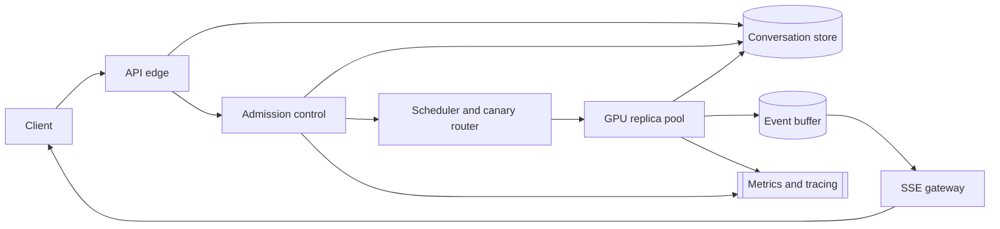

# LLM Inference Serving

[English](README.md) · [中文](README.zh.md)

<!-- meta:begin -->
| Type | Priority | Difficulty | Roles | Topics | Format | Round |
| --- | --- | --- | --- | --- | --- | --- |
| System design | ★★★★☆ | — | SWE · Infra Eng · MLE | gpu-scheduling, batching, streaming, rate-limiting, cost | 60 min | Phone screen · Onsite |
<!-- meta:end -->

## Problem

Design the backend for a consumer chat product built on a large language model: a user sends a
text message and the assistant's reply appears token by token, the way a person would type it,
rather than all at once when generation finishes. Every conversation and message is stored
durably, so a user can close the app and resume the same conversation later, from the same device
or a different one; a second device that has the same conversation open while a reply is still
generating must see the same tokens arrive. A message can fail partway through generation — a
dropped connection, an overloaded model replica — and a retry must not create a duplicate reply or
be billed for the same generation twice. The service has a free tier with a fixed daily message
quota and one or more paid tiers with a much larger quota and a tighter time-to-first-token
target. More than one version of the model runs at a time: a new version is ramped up from a small
percentage of traffic to a larger one only once its quality and latency look healthy, and traffic
is rolled back to the previous version if they don't.

Scale for this design:

- 20,000,000 daily active users; 24% send at least one message on a given day, at an average of
  1.5 conversations and 6 user turns per conversation — 43,200,000 user messages/day.
- Usage spans time zones, with a daily peak lasting about an hour at 6x the daily average
  submission rate.
- A request's prompt is the new message plus the conversation's earlier turns, truncated to fit
  the model's context window; averaged over all requests it comes to 1,200 tokens, and a reply
  averages 300 tokens. A small fraction of requests carry a much longer prompt, up to 16,000
  tokens, from a long history or a pasted document; the context window tops out at 32,000 tokens.
- The model has 32 transformer layers, 8 key-value attention heads per layer, and a head dimension
  of 128; its key-value (KV) cache is stored in fp16.
- Each GPU has 80 GiB of memory. One model replica's weights occupy 40 GiB and 4 GiB is reserved
  for activations and framework overhead, leaving the rest as a KV cache pool. A decode step —
  producing one new token for every sequence in the batch — takes about 40 ms regardless of batch
  size, up to 128 sequences per replica; past that the step time grows with the batch. Prefill,
  processing prompt tokens before the first output token, runs at about 12,000 tokens/second per
  GPU, and prefill and decode work on the same replica share the same GPU time. Moving KV cache
  between GPU and host memory runs at about 24 GB/s.
- A smaller model is also available to serve as a fallback: 10 GiB of weights, a 15 ms decode step
  at up to 256 sequences, prefill at 30,000 tokens/second, and a visibly lower answer quality.
- Latency targets: time to first token at P95 under 600 ms on the paid tiers and under 4 s on the
  free tier, for prompts up to 2,000 tokens; and, on every tier, a sustained output rate of at
  least 10 tokens/second once a reply starts.
- Internal settlement price: \$0.03 per 1,000 input tokens, \$0.10 per 1,000 output tokens.

In scope: conversation and message persistence and access from more than one device; streaming a
reply to the client; free- and paid-tier quotas and rate limiting; the inference-serving path
itself — batching, GPU scheduling, KV cache memory, and admission control under load; canary
rollout and routing between model versions; and per-request observability (cost, queueing time,
GPU utilization). Out of scope: the model's own training; content moderation and abuse detection,
which run on the prompt before it is queued and on the reply before it is shown, but are not
designed further here; the client's rendering of the reply; and billing.

Produce:

1. A requirements and scale estimate: average and peak request rate, concurrent decode slots
   needed and the GPU replica count that follows from Little's law, the composition of first-token
   latency, per-GPU KV cache capacity, and daily token cost.
2. A data model (conversation, message, inference request) and 3-5 core client-facing APIs.
3. An architecture diagram and a walk-through of one message along it, including how it reaches a
   device other than the one that sent it.
4. Deep dives into: continuous batching and the separation of prefill and decode work, including
   admission control and queueing under load; managing KV cache memory for long-context requests,
   including preemption and swapping once the cache pool fills up; and tiered rate limiting and
   degradation that keeps the paid tier's time-to-first-token target even when the system is
   overloaded. For each, compare at least two alternatives, say which you would pick, and give the
   cost of that choice.

## Reference solution

<details>
<summary>Show the reference solution</summary>

Worth confirming before designing: whether the server may cache a conversation's prompt prefix
between turns (assumed not — every turn prefills its whole prompt) and whether a canary version can
take over mid-conversation (assumed no).

### Requirements and scale

**Request rate.** $43{,}200{,}000$ messages/day average to $43{,}200{,}000 / 86{,}400 = 500$
requests/sec; at 6x for the daily peak, peak submissions run at $3{,}000$ requests/sec.

**KV cache per token.** With 32 layers, 8 KV heads, head dimension 128, and fp16 (2 bytes), one
token's key and value together cost

$$
2 \times 32 \times 8 \times 128 \times 2 = 131{,}072 \text{ bytes} = 128 \text{ KiB.}
$$

Of the 80 GiB per GPU, 40 GiB holds the weights and 4 GiB the activation reserve, leaving a
**36 GiB KV cache pool** per replica.

**What a decode step actually costs.** A replica does not only decode: the prompts it is serving
have to be prefilled on the same GPU. A replica finishing $r$ requests/sec must prefill
$1{,}200r$ tokens/sec, and since one step emits a token for each of its 128 sequences it runs
$300r/128$ steps/sec — so each step carries $128 \times 1{,}200/300 = 512$ tokens of prefill,
$512/12{,}000 \approx 42.7$ ms on top of the 40 ms decode. **A step lands every
$\approx 82.7$ ms, not 40 ms**, which is also the rate a user sees tokens arrive:
$\approx 12.1$/sec, just above the 10 tokens/sec floor.

**Concurrency and replica pool.** A 300-token reply therefore holds a slot for
$W = 300 \times 0.0827 = 24.8$ s (its own prefill rides inside those steps). By Little's law,
$L = \lambda \cdot W$: at peak, $L_{\text{peak}} = 3{,}000 \times 24.8 = 74{,}400$ sequences in
flight. At 128 per replica and 20% headroom for replicas booting or failing health checks,
$74{,}400 / 128 \times 1.2 = 697.5$, rounded up to **698 replicas**, draining
$698 \times 128 / 24.8 \approx 3{,}603$ requests/sec — peak arrival runs the pool at
$\approx 83\%$ utilization. Counting GPU time directly gives the same count and also splits the
bill: $1{,}200/12{,}000 + 300 \times 0.040/128 = 0.194$ GPU-seconds per request, 52% prefill.

**First-token latency.** A 1,200-token prompt is prefilled in $\lceil 1{,}200/512 \rceil = 3$
chunked steps (the batching deep dive sets the 512-token budget): 3 decode passes (120 ms), its own
100 ms of prefill, and 15 ms of routing and tokenization, $\approx 235$ ms against the paid tier's
600 ms target. A 16,000-token prompt needs 32 chunks and $\approx 2{,}628$ ms — an 11x gap the
batching deep dive is about, and why the target stops at 2,000-token prompts.

**KV cache headroom.** A request's KV footprint averages input plus half of output (it grows from
input to input-plus-output as it decodes), $1{,}200 + 150 = 1{,}350$ tokens, or $168.75$ MiB. A
full batch of 128 uses $\approx 21.1$ GiB of the 36 GiB pool, leaving $\approx 14.9$ GiB for the
long-context tail.

**Daily cost.** $43{,}200{,}000$ requests/day at 1,200 input and 300 output tokens each is
$51.84 \times 10^9$ input and $12.96 \times 10^9$ output tokens/day. At \$0.03/\$0.10 per 1,000
tokens, that's $\$1{,}555{,}200 + \$1{,}296{,}000 = \$2{,}851{,}200$/day, or $\$0.066$/request.

### Data model and API

**Conversation** — `conversation_id`, `user_id`, `title`, `pinned_model_version` (fixed at
creation by the canary router), `created_at`, `last_message_at`.

**Message** — `message_id`, `conversation_id`, `role` (`user | assistant`), `content`, `status`
(`pending | streaming | complete | error`), `model_version`, `input_tokens`, `output_tokens`,
`idempotency_key`, `created_at`.

**InferenceRequest** — one row per model call: `request_id`, `message_id`, `tier`
(`free | plus | enterprise`), `status` (`queued | admitted | prefilling | decoding | done |
cancelled | failed`), `replica_id`, `max_output_tokens` (1,024 here), `queued_at`,
`first_token_at`, `completed_at`, `cost_usd`.

**RateBudget** — `user_id`, `tier`, `messages_today`, `daily_message_cap`, `reset_at`, `holds`
(`{request_id: expires_at}`: an admitted message counts against the cap until it reaches a terminal
state or its hold expires, so parallel submissions cannot overshoot it).

Core API:

1. `POST /conversations/{id}/messages` — `{content, idempotency_key}` → `202 {message_id,
   stream_url}`; resubmitting with an `idempotency_key` the server has already seen hands back the
   existing message. `429` when the daily cap is used up, `503` with `Retry-After` when the tier's
   admission queue is full.
2. `GET /conversations/{id}/messages/{message_id}/stream` — an SSE stream of `token` and `done`
   events; any number of devices can open it at once and each gets the same events, replayed from
   `Last-Event-ID` for one that reconnects mid-stream.
3. `POST /conversations/{id}/messages/{message_id}/cancel` — idempotent; stops generation at the
   next decode step. The message still counts against the daily cap.
4. `GET /conversations/{id}` — the conversation's messages, for a device opening it or resuming
   after being offline; `GET /conversations` lists the user's conversations, newest first.

### Architecture



A message lands at the API edge, which writes a `Message` row and an `InferenceRequest` row to the
conversation store — the one place a message is authoritative — before acknowledging the client;
any other device with the conversation open sees the new row on its next fetch. Admission control
checks the user's `RateBudget` and the tier's admission queue (the tiering deep dive) before
letting the request through. The scheduler assigns it to a replica running the conversation's
`pinned_model_version`, chosen at the first message by hashing the user id into the canary router's
current traffic split, so every later turn lands on the same version. The replica prefills the
prompt in chunks, decodes under continuous batching (the batching deep dive), and
appends each token to a per-request event buffer every gateway instance can read; the SSE gateway
tails that buffer and forwards events to every device with a stream open on this message, which is
how a second device sees the same reply arrive. On completion the replica commits the final
`content`, token counts, and `cost_usd`, and the `done` event closes every open stream. Metrics
and tracing collect queue depth and rejection rate from admission control and time-to-first-token,
output rate, and batch occupancy from the pool, tagged by tier and `model_version` — the tags a
canary is judged on.

### Deep dives

**Continuous batching, and interleaving prefill with decode.** Two problems come from mixing
requests of very different lengths in one batch.

*Batching itself*: static batching — filling a batch of 128 and running it to completion — ties
every slot to the batch's slowest member. With output length roughly exponential at mean 300
tokens, the expected maximum of 128 such samples is $300 \times H_{128} \approx 1{,}630$ tokens
($H_{128}$ the 128th harmonic number, $\approx 5.43$), so slot-holding time inflates
$\approx 5.4\times$. *Continuous batching* (chosen) fills a freed slot with the next queued request
the moment a sequence finishes, so a slot idles at most one step.

*Prefill vs. decode*: prefill is compute-bound (one large forward pass over the whole prompt) and
decode is bandwidth-bound (one token per sequence, reading the same weights regardless of batch
size) — very different profiles sharing a GPU in the 52 : 48 split the sizing above worked out. The
simple arrangement, running each prefill as one uninterrupted step inside the ongoing decode batch,
breaks on the long tail: a 16,000-token prefill takes $\approx 1{,}333$ ms, so that step runs
$\approx 1{,}373$ ms and all 128 sequences — not just the new arrival — wait that long for their
next token, $\approx 17\times$ the 82.7 ms they normally see and far past the 100 ms the
10 tokens/sec floor allows.

- *Chunked prefill* (chosen): give each step a fixed prefill budget and split prompts into chunks
  that fit it. The budget must cover the 512 tokens/step steady-state traffic generates, and
  raising it only lengthens the step, so 512 it is — exactly the 82.7 ms step the sizing assumed.
  A 16,000-token prompt with the budget to itself then takes $\lceil 16{,}000/512 \rceil = 32$
  chunked steps. Its prefill costs the same $1{,}333$ ms of GPU time either way; what changes is
  that the time arrives in 32 slices of at most 42.7 ms, so no sequence waits more than 82.7 ms for
  its next token. The long prompt pays for it — sharing each of those 32 steps with a full decode
  batch slips its own first token from $\approx 1{,}388$ ms to $\approx 2{,}628$ ms.
- *Disaggregated pools* (alternative, not chosen): dedicate separate replicas to prefill and to
  decode, shipping each prefilled prompt's KV cache to a decode replica. The GPU count is the same
  — $3{,}000 \times 1{,}200/12{,}000 \times 1.2 = 360$ prefill plus
  $3{,}000 \times 12/128 \times 1.2 \approx 338$ decode-only is again $698$, the work being
  identical — and it buys a clean 40 ms step, 25 tokens/sec per stream instead of 12.1, whatever
  prompts arrive. It costs a 150 MiB KV handoff per average request ($\approx 439$ GiB/s
  fleet-wide) and two capacity knobs instead of one: the split has to track the input : output
  token ratio, so a shift toward longer prompts leaves the prefill pool queueing while decode
  capacity idles, where the co-located pool absorbs the same shift as a longer step. Revisit it
  once the average prompt nears 1,700 tokens, where that step reaches 100 ms and the output floor
  breaks.

*Admission and queueing*: near the pool's $\approx 3{,}603$ requests/sec capacity, queueing for a
slot adds straight to first-token latency, so the queue is bounded by Little's law — capacity times
the wait the target leaves over, $\approx 180$ requests for a 50 ms budget against the whole pool;
the tiering deep dive reapplies it per tier.

**KV cache memory for long context.** The 36 GiB pool has to serve both the ordinary case and the
occasional 16,000-token one.

- *Reserve the worst case upfront* (rejected): admit a request only if the pool has room for
  `input_tokens + max_output_tokens` reserved for its whole lifetime. An average request reserves
  $(1{,}200 + 1{,}024) \times 131{,}072 = 278$ MiB against $168.75$ MiB actually used —
  $1.65\times$ waste, $34.75$ GiB of the 36 GiB pool at a full batch,
  leaving $1.25$ GiB instead of $\approx 14.9$ GiB: beside a full batch not one 16,000-token
  sequence fits, where on-demand allocation fits 7.
- *Paged, on-demand allocation* (chosen): allocate KV cache in fixed 16-token pages (each
  $16 \times 131{,}072 = 2$ MiB) as a sequence actually grows, not for a length it may never
  reach, and free them the moment it ends. Cost: the attention kernel gathers a sequence's
  key/value pairs through a page table instead of one contiguous buffer — an extra indirection on
  every attention read.

Even with paging the pool fills: a full batch plus 8 concurrent 16,000-token sequences needs
$36.7$ GiB. When the next one would not fit, something already running has to give up its cache:

- *Evict and recompute* (rejected as the default): drop the victim's KV cache and redo its prefill
  when it resumes — for a 16,000-token sequence the full $\approx 1{,}333$ ms again, out of the
  same prefill budget every other request is queued behind.
- *Swap to host memory* (chosen): move the victim's pages over the 24 GB/s link and back. A
  16,000-token cache is $\approx 1.95$ GiB, so a round trip costs $\approx 175$ ms, about
  $7.6\times$ cheaper than recomputing it; one way for an average request ($168.75$ MiB) is
  $\approx 7.4$ ms. The victim is the lowest tier's largest current footprint, so one preemption
  frees as much room as possible, and it keeps its decode slot — preemption delays a request
  rather than returning it to the queue.

**Tiered rate limiting and degradation.** The per-user daily message cap bounds one account over a
day, but it is not a capacity control: a surge of free traffic — say half of peak arrivals,
$1{,}500$ requests/sec — ahead of paid traffic in one FIFO would push paid first-token latency past
its target with every account still inside its cap. So the pool's $\approx 3{,}603$ requests/sec is
split by weighted round robin, free : plus : enterprise = 1 : 3 : 6, floors of $\approx 360$,
$\approx 1{,}081$, and $\approx 2{,}162$ requests/sec that no other tier's backlog can take.

The floors are work-conserving, so a tier may use idle capacity above its own: at the design's peak
split (free 50%, plus 35%, enterprise 15% of $3{,}000$ requests/sec) plus and enterprise leave
$\approx 2{,}103$ requests/sec free can draw on, so free's $1{,}500$ is served in full while
enterprise sits at $\approx 21\%$ of its floor. Each tier also gets its own admission queue, capped
by the Little's-law rule above against its floor and the wait its target allows — 50 ms for the
paid tiers ($\approx 54$ and $\approx 108$ requests), 3 s for free ($\approx 1{,}081$) — past
which it sheds load with `503` rather than growing a queue no target can absorb.

A floor is a share of *existing* capacity, not more of it, so when total arrivals exceed the pool
every tier is squeezed toward its floor and even enterprise queues. Overflow routes instead to a
standby pool of the smaller model: by the same step accounting each of its steps carries
$256 \times 1{,}200/300 = 1{,}024$ prefill tokens and lands every $15 + 34.1 \approx 49$ ms, so one
GPU serves $256/(300 \times 0.049) \approx 17.4$ requests/sec — $3.4\times$ a full-size replica's
$\approx 5.2$, at $\approx 85$ ms to first token. A spike to $1.5\times$ the design peak leaves
$\approx 897$ requests/sec over, which $\lceil 897/17.4 \rceil = 52$ standby replicas absorb: 7%
of the main pool for 50% of surge headroom. A reply served there records the fallback in its
`model_version` rather than the conversation's pin, so the quality drop is visible in the
per-version metrics; the replicas stay warm because provisioning GPUs takes minutes.

### Follow-ups

- A retried `POST /conversations/{id}/messages` with a seen `idempotency_key`, after the client
  never saw the `202`, returns the existing `message_id` rather than billing a second generation.
- A canary rolled back for quality re-pins every conversation on it to the previous version at that
  conversation's next turn, never mid-stream; a rollback only for latency leaves them alone.
- Two devices sending on one conversation at once are not queued: the second `POST` while the first
  is `pending`/`streaming` gets `409`, one conversation allowing one in-flight generation.
- A replica crashing mid-generation is caught by the scheduler's health check, which marks that
  `InferenceRequest` `failed`; the partial output is not charged and its message hold is released,
  so the client's retry is the only generation billed.

<details>
<summary>Estimate check (runnable)</summary>

```python
import math
import random

GiB, MiB = 1024 ** 3, 1024 ** 2

# ---- traffic ----
dau = 20_000_000
requests_per_day = dau * 0.24 * 1.5 * 6
assert requests_per_day == 43_200_000
avg_rps = requests_per_day / 86_400
assert avg_rps == 500.0
peak_rps = avg_rps * 6
assert peak_rps == 3_000.0
assert peak_rps * 3_600 < requests_per_day            # an hour at peak fits inside the daily total

# a 1,200-token average prompt is what 6 turns of carried history come to:
# turn k sends the user's own tokens plus every earlier turn's message and reply
user_msg = 128
avg_prompt = sum(user_msg + (k - 1) * (user_msg + 300) for k in range(1, 7)) / 6
assert 1_150 < avg_prompt < 1_250

# ---- KV cache bytes per token ----
num_layers, num_kv_heads, head_dim, bytes_per_elem = 32, 8, 128, 2
kv_bytes_per_token = 2 * num_layers * num_kv_heads * head_dim * bytes_per_elem
assert kv_bytes_per_token == 131_072 and kv_bytes_per_token / 1024 == 128.0

gpu_gib, weight_gib, overhead_gib = 80, 40, 4
kv_pool_gib = gpu_gib - weight_gib - overhead_gib
assert kv_pool_gib == 36

# ---- the decode step really costs more than 40 ms, because prefill shares the GPU ----
prefill_tps, decode_step_s, batch_cap = 12_000, 0.040, 128
avg_in, avg_out, tail_in = 1_200, 300, 16_000
prefill_tokens_per_step = batch_cap * avg_in / avg_out
assert prefill_tokens_per_step == 512.0
step_s = decode_step_s + prefill_tokens_per_step / prefill_tps
assert round(step_s * 1000, 1) == 82.7
assert round(1 / step_s, 1) == 12.1                   # tokens/sec per stream, above the 10/sec floor

# a replica's second is fully accounted for: decode passes plus prefill chunks
steps_per_s = 1 / step_s
assert abs(steps_per_s * decode_step_s
           + steps_per_s * prefill_tokens_per_step / prefill_tps - 1.0) < 1e-12

# ---- Little's law and the replica pool ----
W = avg_out * step_s
assert round(W, 2) == 24.8
L_peak = peak_rps * W
assert round(L_peak) == 74_400
headroom = 0.20
replicas = math.ceil(L_peak / batch_cap * (1 + headroom))
assert replicas == 698

# same answer straight from GPU time per request, which also gives the prefill/decode split
gpu_s_per_request = avg_in / prefill_tps + avg_out * decode_step_s / batch_cap
assert gpu_s_per_request == 0.19375
assert math.ceil(peak_rps * gpu_s_per_request * (1 + headroom)) == replicas
prefill_share = (avg_in / prefill_tps) / gpu_s_per_request
assert round(prefill_share, 2) == 0.52

mu_total = replicas * batch_cap / W
assert round(mu_total) == 3_603
assert round(peak_rps / mu_total, 2) == 0.83
assert abs(mu_total - replicas / gpu_s_per_request) < 1e-9

# ---- first-token latency, under the chunked-prefill schedule chosen below ----
chunk_tokens = int(prefill_tokens_per_step)
network_ms = 15


def ttft_ms(prompt_tokens):
    chunks = math.ceil(prompt_tokens / chunk_tokens)
    return chunks * decode_step_s * 1000 + prompt_tokens / prefill_tps * 1000 + network_ms


assert math.ceil(avg_in / chunk_tokens) == 3
assert round(ttft_ms(avg_in)) == 235 and ttft_ms(avg_in) < 600        # paid-tier target
assert math.ceil(tail_in / chunk_tokens) == 32
assert round(ttft_ms(tail_in)) == 2_628
assert round(ttft_ms(tail_in) / ttft_ms(avg_in)) == 11
assert ttft_ms(2_000) < 600 - 50                                      # the target's stated boundary,
assert ttft_ms(avg_in) + 3_000 < 4_000                                # paid and free, with queueing

# inline prefill instead: one uninterrupted step, stalling the whole batch
inline_step_ms = (decode_step_s + tail_in / prefill_tps) * 1000
assert round(inline_step_ms) == 1_373
assert round(inline_step_ms / (step_s * 1000)) == 17                  # vs. the normal step
assert round(inline_step_ms + network_ms) == 1_388                    # that request's own TTFT
assert inline_step_ms > 100                                           # blows the 10 tokens/sec floor

# ---- KV headroom ----
avg_seq_bytes = (avg_in + avg_out / 2) * kv_bytes_per_token
assert avg_seq_bytes / MiB == 168.75
batch_gib = batch_cap * avg_seq_bytes / GiB
assert batch_gib == 21.09375
headroom_gib = kv_pool_gib - batch_gib
assert headroom_gib == 14.90625
tail_seq_gib = tail_in * kv_bytes_per_token / GiB
assert tail_seq_gib == 1.953125
assert math.floor(headroom_gib / tail_seq_gib) == 7                   # long sequences beside a full batch
assert round(batch_gib + 8 * tail_seq_gib, 1) == 36.7                 # the eighth does not fit

# ---- daily cost ----
daily_in, daily_out = requests_per_day * avg_in, requests_per_day * avg_out
assert (daily_in, daily_out) == (51_840_000_000, 12_960_000_000)
cost = daily_in / 1000 * 0.03 + daily_out / 1000 * 0.10
assert cost == 2_851_200.0
assert round(cost / requests_per_day, 3) == 0.066
off_peak_rps = (requests_per_day - peak_rps * 3_600) / (86_400 - 3_600)
assert round(off_peak_rps / mu_total, 2) == 0.11

# ---- deep dive 1: static batching, max of 128 iid exponentials ----
n = batch_cap
H_n = sum(1 / k for k in range(1, n + 1))
assert round(H_n, 2) == 5.43
assert round(avg_out * H_n) == 1_630
rng = random.Random(11)
runs = 3_000
sim_max = sum(max(rng.expovariate(1 / avg_out) for _ in range(n)) for _ in range(runs)) / runs
assert abs(sim_max - avg_out * H_n) / (avg_out * H_n) < 0.03   # simulation confirms the analytic value

# ---- deep dive 1: disaggregated pools need the same GPUs, and cost a KV handoff ----
prefill_gpus = math.ceil(peak_rps * avg_in / prefill_tps * (1 + headroom))
decode_gpus = math.ceil(peak_rps * (avg_out * decode_step_s) / batch_cap * (1 + headroom))
assert (prefill_gpus, decode_gpus) == (360, 338)
assert prefill_gpus + decode_gpus == replicas                  # same total work, same GPU count
assert 1 / decode_step_s == 25.0                               # tokens/sec per stream over there
handoff_bytes = avg_in * kv_bytes_per_token
assert handoff_bytes / MiB == 150.0
assert round(handoff_bytes * peak_rps / GiB) == 439
assert round(handoff_bytes * peak_rps / GiB / decode_gpus, 1) == 1.3

# a prompt-mix shift strands capacity in one pool but only lengthens the co-located step
assert math.ceil(peak_rps * 1_800 / prefill_tps * (1 + headroom)) == 540
assert round((decode_step_s + batch_cap * 1_800 / avg_out / prefill_tps) * 1000) == 104
trip_wire_in = (0.100 - decode_step_s) * prefill_tps * avg_out / batch_cap
assert round(trip_wire_in) == 1_688                            # where the step hits the 10/sec floor

# ---- deep dive 1: bounded admission queue ----
assert round(mu_total * 0.05) == 180

# ---- deep dive 2: reservation waste, paging, swap vs. recompute ----
output_cap = 1_024
reserved_bytes = (avg_in + output_cap) * kv_bytes_per_token
assert reserved_bytes / MiB == 278.0
assert round(reserved_bytes / avg_seq_bytes, 2) == 1.65
reserved_batch_gib = batch_cap * reserved_bytes / GiB
assert reserved_batch_gib == 34.75
assert math.floor((kv_pool_gib - reserved_batch_gib) / tail_seq_gib) == 0
assert 16 * kv_bytes_per_token / MiB == 2.0                    # one 16-token page

pcie_bytes_per_s = 24e9
swap_round_trip_ms = 2 * tail_in * kv_bytes_per_token / pcie_bytes_per_s * 1000
recompute_ms = tail_in / prefill_tps * 1000
assert round(swap_round_trip_ms) == 175 and round(recompute_ms) == 1_333
assert round(recompute_ms / swap_round_trip_ms, 1) == 7.6
assert round(avg_seq_bytes / pcie_bytes_per_s * 1000, 1) == 7.4

# ---- deep dive 3: tiered floors, queues, and the standby pool ----
weights = {"free": 1, "plus": 3, "enterprise": 6}
shares = {k: mu_total * w / sum(weights.values()) for k, w in weights.items()}
assert [round(shares[k]) for k in ("free", "plus", "enterprise")] == [360, 1_081, 2_162]
arrivals = {"free": peak_rps * 0.50, "plus": peak_rps * 0.35, "enterprise": peak_rps * 0.15}
assert arrivals == {"free": 1_500.0, "plus": 1_050.0, "enterprise": 450.0}
assert round(arrivals["enterprise"] / shares["enterprise"], 2) == 0.21
spare_for_free = mu_total - arrivals["plus"] - arrivals["enterprise"]
assert round(spare_for_free) == 2_103 and spare_for_free > arrivals["free"]   # free is served in full
assert round(shares["free"] * 3) == 1_081
assert [round(shares[k] * 0.05) for k in ("plus", "enterprise")] == [54, 108]

small_weight_gib, small_step_s, small_batch, small_prefill_tps = 10, 0.015, 256, 30_000
assert gpu_gib - small_weight_gib - overhead_gib == 66        # its KV pool, never the binding limit
small_prefill_per_step = small_batch * avg_in / avg_out
assert small_prefill_per_step == 1_024.0
small_step = small_step_s + small_prefill_per_step / small_prefill_tps
assert round(small_step * 1000) == 49 and 1 / small_step > 10
mu_small = small_batch / (avg_out * small_step)
mu_big = batch_cap / W
assert round(mu_small, 1) == 17.4 and round(mu_big, 1) == 5.2
assert round(mu_small / mu_big, 1) == 3.4
small_chunks = math.ceil(avg_in / small_prefill_per_step)
assert round(small_chunks * small_step_s * 1000
             + avg_in / small_prefill_tps * 1000 + network_ms) == 85
overflow = peak_rps * 1.5 - mu_total
assert round(overflow) == 897
standby = math.ceil(overflow / mu_small)
assert standby == 52 and round(standby / replicas * 100) == 7

print("all requirements-and-scale numbers check out")
```

</details>

</details>
