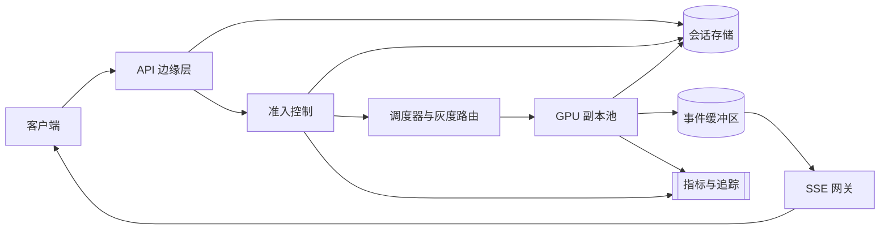

# 大模型推理服务

[English](README.md) · [中文](README.zh.md)

<!-- meta:begin -->
| 题型 | 优先级 | 难度 | 岗位 | 考点 | 形式 | 轮次 |
| --- | --- | --- | --- | --- | --- | --- |
| 系统设计 | ★★★★☆ | — | SWE · Infra Eng · MLE | gpu-scheduling, batching, streaming, rate-limiting, cost | 60 分钟 | 电话面 · 现场面 |
<!-- meta:end -->

## 题目

设计一个基于大语言模型的终端用户对话产品的后端：用户发出一条文本消息，助手的回复像人打字一样逐个 token 出现，而不是等生成完毕后一次性显示。每段会话和每条消息都要持久化保存，用户关掉应用之后可以在同一台设备或另一台设备上继续这段会话；如果另一台设备正打开着同一段会话，而这条回复还在生成中，它必须看到同样的 token 陆续到达。一条消息可能在生成过程中失败——连接断开、模型副本过载——重试不能生成第二份重复的回复，也不能为同一次生成计费两次。这个服务有一个每天消息数固定的免费档，以及一个或多个额度更大、首 token 延迟目标更严格的付费档。系统同时跑着不止一个模型版本：新版本从一小部分流量开始逐步放量，只有在它的质量和延迟指标健康时才继续加大比例，不健康就把流量切回旧版本。

这次设计的规模：

- 20,000,000 日活用户；其中 24% 的人在某一天至少发一条消息，平均每人每天开 1.5 段会话，每段会话平均 6 轮用户提问——合计每天 43,200,000 条用户消息。
- 使用分布在各个时区，有一段约一小时的日峰值，提交速率达到日均值的 6 倍。
- 一次请求的提示词是新消息加上这段会话之前各轮的内容，截断到能放进模型的上下文窗口；对全部请求取平均是 1,200 个 token，一次回复平均 300 个 token。小部分请求的提示词会长得多，最多到 16,000 个 token（来自很长的会话历史或一段贴进来的文档）；上下文窗口的上限是 32,000 个 token。
- 模型有 32 层 transformer，每层 8 个键值注意力头（key-value attention head），头维度为 128；它的键值缓存（KV cache）以 fp16 存储。
- 每块 GPU 有 80 GiB 显存。一个模型副本的权重占 40 GiB，另有 4 GiB 留给激活值与框架开销，剩下的作为 KV cache 池。一次解码步——为批次里的每个序列各生成一个新 token——耗时约 40 毫秒，与批大小无关，单副本最多 128 个序列；超过这个数之后步时随批大小增长。prefill（在第一个输出 token 之前处理提示词的 token）每块 GPU 约为每秒 12,000 个 token，同一个副本上的 prefill 与 decode 共用这块 GPU 的时间。KV cache 在 GPU 与主机内存之间搬运的速率约为 24 GB/s。
- 另有一个更小的模型可以用作退路：权重 10 GiB，解码步 15 毫秒、最多 256 个序列，prefill 每秒 30,000 个 token，回答质量明显低一档。
- 延迟目标：提示词不超过 2,000 个 token 时，首 token 延迟 P95 在付费档低于 600 毫秒、在免费档低于 4 秒；回复开始之后，每个档位的持续输出速率都不低于每秒 10 个 token。
- 内部结算价：每 1,000 个输入 token \$0.03，每 1,000 个输出 token \$0.10。

范围内：会话与消息的持久化，以及多设备访问；把回复流式返回给客户端；免费档与付费档的额度与限流；推理服务本身的路径——批处理、GPU 调度、KV cache 显存、过载时的准入控制；灰度发布与模型版本之间的路由；以及按请求的可观测性（成本、排队时间、GPU 利用率）。范围外：模型自身的训练；内容审核与滥用检测——它们在提示词入队前、回复展示前各跑一次，但这里不展开设计；客户端对回复的渲染；计费。

要产出：

1. 需求与规模估算：平均和峰值请求速率、由 Little 定律得到的并发解码槽位数与 GPU 副本数、首 token 延迟的构成、单 GPU 的 KV cache 容量，以及每天的 token 成本。
2. 数据模型（会话、消息、推理请求）与 3 到 5 个核心的面向客户端接口。
3. 一张架构图，并沿着一条消息把整条路径走一遍，包括它怎么到达发消息设备之外的另一台设备。
4. 深入话题：连续批处理（continuous batching）与 prefill、decode 工作的分离，包括过载时的准入控制与排队；长上下文请求的 KV cache 显存管理，包括缓存池被占满之后的抢占与换出；以及分档限流与降级，如何在系统过载时仍然保住付费档的首 token 延迟目标。每个话题至少比较两种方案，说明选哪个，并给出这个选择的代价。

## 参考解答

<details>
<summary>展开参考解答</summary>

动手设计之前值得先确认：能否把一段会话的提示词前缀缓存到下一轮（假设不能，每轮都重新 prefill 整个提示词）；灰度中的新版本能否在会话中途接管（假设不能）。

### 需求与规模

**请求速率。** 每天 $43{,}200{,}000$ 条消息，即 $43{,}200{,}000 / 86{,}400 = 500$ 次/秒；峰值是日均的 6 倍，$3{,}000$ 次/秒。

**每个 token 的 KV cache。** 32 层、8 个 KV 头、头维度 128、fp16（2 字节），一个 token 的 key 和 value 合计

$$
2 \times 32 \times 8 \times 128 \times 2 = 131{,}072 \text{ 字节} = 128 \text{ KiB。}
$$

每块 GPU 的 80 GiB 里，40 GiB 装权重、4 GiB 是激活值预留，剩 **36 GiB 的 KV cache 池**。

**解码步的真实开销。** 副本不只在解码，它服务的提示词也要在同一块 GPU 上 prefill。每秒完成 $r$ 个请求的副本，每秒就要 prefill $1{,}200r$ 个 token；一步为 128 个序列各产出一个 token，于是每秒跑 $300r/128$ 步，每一步要承担 $128 \times 1{,}200/300 = 512$ 个 token 的 prefill，在 40 毫秒的解码之上再加 $512/12{,}000 \approx 42.7$ 毫秒。**一步是每 $\approx 82.7$ 毫秒落地一次，不是 40 毫秒**，这也是用户看到 token 到达的速率：$\approx 12.1$ 个/秒，刚好在每秒 10 个的下限之上。

**并发数与副本池。** 一条 300-token 回复因此占住槽位 $W = 300 \times 0.0827 = 24.8$ 秒（自己的 prefill 摊在这些步里）。由 Little 定律 $L = \lambda \cdot W$，峰值时 $L_{\text{peak}} = 3{,}000 \times 24.8 = 74{,}400$ 个序列在途。单副本 128 个，加 20% 余量给启动中和健康检查失败的副本，$74{,}400 / 128 \times 1.2 = 697.5$，向上取整为 **698 个副本**，吞吐 $698 \times 128 / 24.8 \approx 3{,}603$ 次/秒，峰值到达下利用率约 $83\%$。直接算 GPU 时间得到同一个数，还顺带把账分开：每请求 $1{,}200/12{,}000 + 300 \times 0.040/128 = 0.194$ 个 GPU-秒，52% 在 prefill。

**首 token 延迟。** 1,200-token 提示词要 $\lceil 1{,}200/512 \rceil = 3$ 个分块步（512 的预算见批处理深入话题）：3 次解码（120 毫秒）、自己 100 毫秒的 prefill，加上路由与分词的 15 毫秒，$\approx 235$ 毫秒，对着付费档 600 毫秒的目标。16,000-token 提示词要 32 块、$\approx 2{,}628$ 毫秒——这 11 倍的差距正是批处理深入话题要处理的，目标也因此只覆盖 2,000-token 以内的提示词。

**KV cache 余量。** 一个请求的 KV 占用平均是输入加上输出的一半（解码中它从输入长度长到输入加输出），$1{,}350$ 个 token，即 $168.75$ MiB；一整批 128 个占 36 GiB 池中的 $\approx 21.1$ GiB，剩 $\approx 14.9$ GiB 留给长上下文的长尾。

**每天的成本。** $43{,}200{,}000$ 次请求，每次 1,200 个输入、300 个输出 token，合计 $51.84 \times 10^9$ 和 $12.96 \times 10^9$ 个 token。按每 1,000 个 token \$0.03/\$0.10 算，$\$1{,}555{,}200 + \$1{,}296{,}000 = \$2{,}851{,}200$/天，约 \$0.066/请求。

### 数据模型与 API

**Conversation（会话）**——`conversation_id`、`user_id`、`title`、`pinned_model_version`（创建时由灰度路由定住）、`created_at`、`last_message_at`。

**Message（消息）**——`message_id`、`conversation_id`、`role`（`user | assistant`）、`content`、`status`（`pending | streaming | complete | error`）、`model_version`、`input_tokens`、`output_tokens`、`idempotency_key`、`created_at`。

**InferenceRequest（推理请求）**——每次模型调用一行：`request_id`、`message_id`、`tier`（`free | plus | enterprise`）、`status`（`queued | admitted | prefilling | decoding | done | cancelled | failed`）、`replica_id`、`max_output_tokens`（这里是 1,024）、`queued_at`、`first_token_at`、`completed_at`、`cost_usd`。

**RateBudget（配额）**——`user_id`、`tier`、`messages_today`、`daily_message_cap`、`reset_at`、`holds`（`{request_id: expires_at}`：已准入的消息在到达终止态或占位过期前一直计入配额，并发提交因此没法超发）。

核心接口：

1. `POST /conversations/{id}/messages`——`{content, idempotency_key}` → `202 {message_id, stream_url}`；用服务端已经见过的 `idempotency_key` 再提交，拿回的是已有的那条消息。当天配额用完返回 `429`，档位准入队列已满返回 `503` 并带 `Retry-After`。
2. `GET /conversations/{id}/messages/{message_id}/stream`——发出 `token` 和 `done` 事件的 SSE 流；任意数量的设备可以同时打开，各自收到相同的事件，中途重连按 `Last-Event-ID` 回放。
3. `POST /conversations/{id}/messages/{message_id}/cancel`——幂等；下一个解码步停止生成，这条消息仍计入当天配额。
4. `GET /conversations/{id}`——这段会话的消息列表，供设备打开或离线恢复时使用；`GET /conversations` 给出用户的会话列表，按最新排序。

### 架构



一条消息先到 API 边缘层，它把一条 `Message` 和一条 `InferenceRequest` 写进会话存储——消息状态的唯一权威来源——然后才确认给客户端；打开着这段会话的其他设备下一次拉取就能看到。准入控制核对用户的 `RateBudget` 和档位的准入队列（限流深入话题）后才放行。调度器把请求分给正在跑这段会话 `pinned_model_version` 的副本，这个版本在第一条消息时由用户 id 哈希进灰度路由当时的流量分割定下，之后不再变。副本分块 prefill 提示词，在连续批处理下解码（批处理深入话题），把每个 token 追加进按请求划分、每个网关实例都能读的事件缓冲区；SSE 网关读取它，转发给每一台对这条消息开着流的设备——第二台设备就这样看到了同样的回复。生成结束后，副本把最终的 `content`、token 计数和 `cost_usd` 提交进会话存储，`done` 事件关闭每条流。指标与追踪从准入控制收集队列深度和拒绝率，从池子收集首 token 延迟、输出速率和批次占用率，按档位和 `model_version` 打标签——灰度放量看的就是这套指标。

### 深入话题

**连续批处理，以及把 prefill 交织进 decode。** 把长度差异很大的请求混进同一批，会带来两个问题。

*批处理本身*：静态批处理凑够 128 个请求跑到全部结束，每个槽位都被这批最慢的那个拖住。输出长度按均值 300 个 token 的指数分布算，128 个样本最大值的期望是 $300 \times H_{128} \approx 1{,}630$ 个 token（$H_{128}$ 是第 128 个调和数，$\approx 5.43$），槽位占用时长因此膨胀约 $5.4$ 倍。*连续批处理*（选择的方案）一有序列结束就用队列里下一个请求填上空位，槽位最多空转一步。

*prefill 与 decode 的差异*：prefill 计算密集（对整段提示词做一次大的前向计算），decode 带宽密集（每个序列每步只出一个 token，不管批大小都要把权重读一遍）——两种很不一样的负载共用一块 GPU，比例就是上面的 52 : 48。最简单的排法是把每次 prefill 当作不可打断的一步插进正在跑的解码批次，但它在长尾上会垮：16,000-token 的 prefill 要 $\approx 1{,}333$ 毫秒，这一步就变成 $\approx 1{,}373$ 毫秒，批次里全部 128 个序列——不只是新来的那个——都要等这么久才拿到下一个 token，是平时 82.7 毫秒的约 $17$ 倍，远超每秒 10 个 token 下限允许的 100 毫秒。

- *分块 prefill*（选择的方案）：给每一步固定一份 prefill 预算，把提示词切成塞得进预算的块。预算至少要覆盖稳态流量每步产生的 512 个 token，定得更大只会拉长步时，所以取 512——正是前面估算用的 82.7 毫秒的步。于是独占这份预算的 16,000-token 提示词要 $\lceil 16{,}000/512 \rceil = 32$ 个分块步。不论哪种排法，这段 prefill 花掉的 GPU 时间同样是 $1{,}333$ 毫秒；变的是它被切成 32 片、每片不超过 42.7 毫秒，没有任何序列要等超过 82.7 毫秒才拿到下一个 token。代价由长提示词自己承担：这 32 步每步都还带着一整批解码，它的首 token 因此从 $\approx 1{,}388$ 毫秒推到 $\approx 2{,}628$ 毫秒。
- *prefill 与 decode 分池*（备选，未采用）：给两种工作各配一批专属副本，prefill 完的提示词把 KV cache 送给 decode 副本。GPU 总数一样：$3{,}000 \times 1{,}200/12{,}000 \times 1.2 = 360$ 个 prefill 副本加 $3{,}000 \times 12/128 \times 1.2 \approx 338$ 个纯 decode 副本仍是 $698$ 个，总工作量本来就相同。换来一个干净的 40 毫秒解码步，每条流每秒 25 个 token 而不是 12.1 个，且与来什么提示词无关。代价是平均每请求要搬 150 MiB 的 KV cache（全池约 $439$ GiB/s），以及容量旋钮从一个变成两个：两池比例必须跟着输入与输出 token 的比走，提示词一变长，prefill 池就排队而 decode 池反而闲着，混部池遇到同样的变化只是步时变长。等平均提示词接近 1,700 个 token、步时涨到 100 毫秒、输出下限被击穿时，再回头考虑分池。

*准入与排队*：池子接近 $\approx 3{,}603$ 次/秒的容量时，排队等槽位直接算进首 token 延迟，所以准入队列由 Little 定律定上限：容量乘以目标剩下的等待预算，对整池按 50 毫秒算是 $\approx 180$ 个请求；限流深入话题会按档位再用一次。

**长上下文的 KV cache 显存管理。** 36 GiB 的池子既要服务普通请求，也要服务偶尔的 16,000-token 请求。

- *提前按最坏情况预留*（不采用）：只有池子能为 `input_tokens + max_output_tokens` 留出空间并保留到请求结束，才放它进来。平均请求预留 $(1{,}200 + 1{,}024) \times 131{,}072 = 278$ MiB，实际只用 $168.75$ MiB——浪费 $1.65$ 倍，满批时占去 36 GiB 池中的 $34.75$ GiB，余量只剩 $1.25$ GiB 而非 $\approx 14.9$ GiB：满批之外连一个 16,000-token 序列都放不下，按需分配能放 7 个。
- *按需的分页分配*（选择的方案）：KV cache 按固定的 16-token 页分配（每页 $16 \times 131{,}072 = 2$ MiB），序列真的变长才分配，不为可能用不到的长度预留，结束就回收。代价：注意力核要通过页表收集 key/value，而不是从连续缓冲区直接读，每次读取多一层间接寻址。

即便分页池子仍会占满：一整批加 8 个 16,000-token 序列就要 $36.7$ GiB。放不下下一个时，必须有序列让出缓存：

- *驱逐并重算*（默认不采用）：丢掉被选中序列的 KV cache，恢复时重做 prefill——对 16,000-token 序列就是完整的 $\approx 1{,}333$ 毫秒再来一遍，而且要从其他排队请求都在等的 prefill 预算里出。
- *换出到主机内存*（选择的方案）：把它的页通过 24 GB/s 的链路搬走，恢复时搬回来。16,000-token 的缓存约 $1.95$ GiB，一次往返约 $175$ 毫秒，比重算便宜约 $7.6$ 倍；平均请求（$168.75$ MiB）单程只要 $\approx 7.4$ 毫秒。被选中的是最低档位里占用最大的那个，一次抢占腾出尽量多的空间；它的解码槽位保留，抢占只让这个请求变慢，不退回队列。

**分档限流与降级。** 每日消息配额约束的是单个账号一天的用量，不是容量控制：一波免费档流量——比如峰值到达的一半，$1{,}500$ 次/秒——在同一个先进先出队列里排在付费流量前面，会在每个账号都没超配额时把付费档首 token 延迟顶过目标。所以池子的 $\approx 3{,}603$ 次/秒按加权轮询（weighted round robin）在 free : plus : enterprise = 1 : 3 : 6 之间划分，得到别的档位积压再多也拿不走的保底份额：约 $360$、$1{,}081$、$2{,}162$ 次/秒。

保底份额不空转，一个档位可以用掉别的档位闲着的容量：按设计的峰值占比（免费 50%、plus 35%、enterprise 15%），plus 和 enterprise 留下 $\approx 2{,}103$ 次/秒给免费档，免费档的 $1{,}500$ 次/秒因此全部被服务，enterprise 只用到自己份额的 $\approx 21\%$。每个档位另有一个准入队列，按同一条 Little 定律规则、用自己的份额和目标允许的等待时间定上限——付费档 50 毫秒（$\approx 54$ 和 $\approx 108$ 个），免费档 3 秒（$\approx 1{,}081$ 个）——超过就用 `503` 卸载，不养一条谁的目标都吃不下的队列。

保底份额分的是*现有*容量，所以总到达量超过整池时每个档位都被压回自己的份额，连 enterprise 也要排队。超出的部分不排队，而是路由到一个更小模型的备用池：按同一套步时账，它每一步带 $1{,}024$ 个 prefill token，每 $15 + 34.1 \approx 49$ 毫秒落地一次，一块 GPU 能处理 $256/(300 \times 0.049) \approx 17.4$ 次/秒——标准副本 $\approx 5.2$ 次/秒的 $3.4$ 倍，首 token 约 $85$ 毫秒。流量冲到设计峰值的 $1.5$ 倍时多出 $\approx 897$ 次/秒，$\lceil 897/17.4 \rceil = 52$ 个备用副本就能吸收：用主池 7% 的规模换 50% 的突发余量。这里出的回复在 `Message` 里记的是备用模型而非会话定住的版本，质量下降因此在按版本的指标里看得见；副本一直热着，因为开新 GPU 要几分钟。

### 追问

- 客户端没看到 `202` 就用已见过的 `idempotency_key` 重试 `POST /conversations/{id}/messages`，拿到已有的 `message_id`，不会再计一次费。
- 因质量被回滚的灰度版本，把还挂在它上面的会话在下一轮重新定到旧版本，但绝不在流中途切换；只因延迟而回滚时，已有会话不动。
- 同一段会话里两台设备同时发送，第二条不排队：第一条还是 `pending`/`streaming` 时第二个 `POST` 返回 `409`，一段会话只允许一次正在进行的生成。
- 副本在生成中途崩溃，调度器的健康检查发现后把这次 `InferenceRequest` 标为 `failed`；已生成的部分不计费、消息占位释放，只有客户端重试的那次计费。

<details>
<summary>估算核对（可运行）</summary>

```python
import math
import random

GiB, MiB = 1024 ** 3, 1024 ** 2

# ---- traffic ----
dau = 20_000_000
requests_per_day = dau * 0.24 * 1.5 * 6
assert requests_per_day == 43_200_000
avg_rps = requests_per_day / 86_400
assert avg_rps == 500.0
peak_rps = avg_rps * 6
assert peak_rps == 3_000.0
assert peak_rps * 3_600 < requests_per_day            # an hour at peak fits inside the daily total

# a 1,200-token average prompt is what 6 turns of carried history come to:
# turn k sends the user's own tokens plus every earlier turn's message and reply
user_msg = 128
avg_prompt = sum(user_msg + (k - 1) * (user_msg + 300) for k in range(1, 7)) / 6
assert 1_150 < avg_prompt < 1_250

# ---- KV cache bytes per token ----
num_layers, num_kv_heads, head_dim, bytes_per_elem = 32, 8, 128, 2
kv_bytes_per_token = 2 * num_layers * num_kv_heads * head_dim * bytes_per_elem
assert kv_bytes_per_token == 131_072 and kv_bytes_per_token / 1024 == 128.0

gpu_gib, weight_gib, overhead_gib = 80, 40, 4
kv_pool_gib = gpu_gib - weight_gib - overhead_gib
assert kv_pool_gib == 36

# ---- the decode step really costs more than 40 ms, because prefill shares the GPU ----
prefill_tps, decode_step_s, batch_cap = 12_000, 0.040, 128
avg_in, avg_out, tail_in = 1_200, 300, 16_000
prefill_tokens_per_step = batch_cap * avg_in / avg_out
assert prefill_tokens_per_step == 512.0
step_s = decode_step_s + prefill_tokens_per_step / prefill_tps
assert round(step_s * 1000, 1) == 82.7
assert round(1 / step_s, 1) == 12.1                   # tokens/sec per stream, above the 10/sec floor

# a replica's second is fully accounted for: decode passes plus prefill chunks
steps_per_s = 1 / step_s
assert abs(steps_per_s * decode_step_s
           + steps_per_s * prefill_tokens_per_step / prefill_tps - 1.0) < 1e-12

# ---- Little's law and the replica pool ----
W = avg_out * step_s
assert round(W, 2) == 24.8
L_peak = peak_rps * W
assert round(L_peak) == 74_400
headroom = 0.20
replicas = math.ceil(L_peak / batch_cap * (1 + headroom))
assert replicas == 698

# same answer straight from GPU time per request, which also gives the prefill/decode split
gpu_s_per_request = avg_in / prefill_tps + avg_out * decode_step_s / batch_cap
assert gpu_s_per_request == 0.19375
assert math.ceil(peak_rps * gpu_s_per_request * (1 + headroom)) == replicas
prefill_share = (avg_in / prefill_tps) / gpu_s_per_request
assert round(prefill_share, 2) == 0.52

mu_total = replicas * batch_cap / W
assert round(mu_total) == 3_603
assert round(peak_rps / mu_total, 2) == 0.83
assert abs(mu_total - replicas / gpu_s_per_request) < 1e-9

# ---- first-token latency, under the chunked-prefill schedule chosen below ----
chunk_tokens = int(prefill_tokens_per_step)
network_ms = 15


def ttft_ms(prompt_tokens):
    chunks = math.ceil(prompt_tokens / chunk_tokens)
    return chunks * decode_step_s * 1000 + prompt_tokens / prefill_tps * 1000 + network_ms


assert math.ceil(avg_in / chunk_tokens) == 3
assert round(ttft_ms(avg_in)) == 235 and ttft_ms(avg_in) < 600        # paid-tier target
assert math.ceil(tail_in / chunk_tokens) == 32
assert round(ttft_ms(tail_in)) == 2_628
assert round(ttft_ms(tail_in) / ttft_ms(avg_in)) == 11
assert ttft_ms(2_000) < 600 - 50                                      # the target's stated boundary,
assert ttft_ms(avg_in) + 3_000 < 4_000                                # paid and free, with queueing

# inline prefill instead: one uninterrupted step, stalling the whole batch
inline_step_ms = (decode_step_s + tail_in / prefill_tps) * 1000
assert round(inline_step_ms) == 1_373
assert round(inline_step_ms / (step_s * 1000)) == 17                  # vs. the normal step
assert round(inline_step_ms + network_ms) == 1_388                    # that request's own TTFT
assert inline_step_ms > 100                                           # blows the 10 tokens/sec floor

# ---- KV headroom ----
avg_seq_bytes = (avg_in + avg_out / 2) * kv_bytes_per_token
assert avg_seq_bytes / MiB == 168.75
batch_gib = batch_cap * avg_seq_bytes / GiB
assert batch_gib == 21.09375
headroom_gib = kv_pool_gib - batch_gib
assert headroom_gib == 14.90625
tail_seq_gib = tail_in * kv_bytes_per_token / GiB
assert tail_seq_gib == 1.953125
assert math.floor(headroom_gib / tail_seq_gib) == 7                   # long sequences beside a full batch
assert round(batch_gib + 8 * tail_seq_gib, 1) == 36.7                 # the eighth does not fit

# ---- daily cost ----
daily_in, daily_out = requests_per_day * avg_in, requests_per_day * avg_out
assert (daily_in, daily_out) == (51_840_000_000, 12_960_000_000)
cost = daily_in / 1000 * 0.03 + daily_out / 1000 * 0.10
assert cost == 2_851_200.0
assert round(cost / requests_per_day, 3) == 0.066
off_peak_rps = (requests_per_day - peak_rps * 3_600) / (86_400 - 3_600)
assert round(off_peak_rps / mu_total, 2) == 0.11

# ---- deep dive 1: static batching, max of 128 iid exponentials ----
n = batch_cap
H_n = sum(1 / k for k in range(1, n + 1))
assert round(H_n, 2) == 5.43
assert round(avg_out * H_n) == 1_630
rng = random.Random(11)
runs = 3_000
sim_max = sum(max(rng.expovariate(1 / avg_out) for _ in range(n)) for _ in range(runs)) / runs
assert abs(sim_max - avg_out * H_n) / (avg_out * H_n) < 0.03   # simulation confirms the analytic value

# ---- deep dive 1: disaggregated pools need the same GPUs, and cost a KV handoff ----
prefill_gpus = math.ceil(peak_rps * avg_in / prefill_tps * (1 + headroom))
decode_gpus = math.ceil(peak_rps * (avg_out * decode_step_s) / batch_cap * (1 + headroom))
assert (prefill_gpus, decode_gpus) == (360, 338)
assert prefill_gpus + decode_gpus == replicas                  # same total work, same GPU count
assert 1 / decode_step_s == 25.0                               # tokens/sec per stream over there
handoff_bytes = avg_in * kv_bytes_per_token
assert handoff_bytes / MiB == 150.0
assert round(handoff_bytes * peak_rps / GiB) == 439
assert round(handoff_bytes * peak_rps / GiB / decode_gpus, 1) == 1.3

# a prompt-mix shift strands capacity in one pool but only lengthens the co-located step
assert math.ceil(peak_rps * 1_800 / prefill_tps * (1 + headroom)) == 540
assert round((decode_step_s + batch_cap * 1_800 / avg_out / prefill_tps) * 1000) == 104
trip_wire_in = (0.100 - decode_step_s) * prefill_tps * avg_out / batch_cap
assert round(trip_wire_in) == 1_688                            # where the step hits the 10/sec floor

# ---- deep dive 1: bounded admission queue ----
assert round(mu_total * 0.05) == 180

# ---- deep dive 2: reservation waste, paging, swap vs. recompute ----
output_cap = 1_024
reserved_bytes = (avg_in + output_cap) * kv_bytes_per_token
assert reserved_bytes / MiB == 278.0
assert round(reserved_bytes / avg_seq_bytes, 2) == 1.65
reserved_batch_gib = batch_cap * reserved_bytes / GiB
assert reserved_batch_gib == 34.75
assert math.floor((kv_pool_gib - reserved_batch_gib) / tail_seq_gib) == 0
assert 16 * kv_bytes_per_token / MiB == 2.0                    # one 16-token page

pcie_bytes_per_s = 24e9
swap_round_trip_ms = 2 * tail_in * kv_bytes_per_token / pcie_bytes_per_s * 1000
recompute_ms = tail_in / prefill_tps * 1000
assert round(swap_round_trip_ms) == 175 and round(recompute_ms) == 1_333
assert round(recompute_ms / swap_round_trip_ms, 1) == 7.6
assert round(avg_seq_bytes / pcie_bytes_per_s * 1000, 1) == 7.4

# ---- deep dive 3: tiered floors, queues, and the standby pool ----
weights = {"free": 1, "plus": 3, "enterprise": 6}
shares = {k: mu_total * w / sum(weights.values()) for k, w in weights.items()}
assert [round(shares[k]) for k in ("free", "plus", "enterprise")] == [360, 1_081, 2_162]
arrivals = {"free": peak_rps * 0.50, "plus": peak_rps * 0.35, "enterprise": peak_rps * 0.15}
assert arrivals == {"free": 1_500.0, "plus": 1_050.0, "enterprise": 450.0}
assert round(arrivals["enterprise"] / shares["enterprise"], 2) == 0.21
spare_for_free = mu_total - arrivals["plus"] - arrivals["enterprise"]
assert round(spare_for_free) == 2_103 and spare_for_free > arrivals["free"]   # free is served in full
assert round(shares["free"] * 3) == 1_081
assert [round(shares[k] * 0.05) for k in ("plus", "enterprise")] == [54, 108]

small_weight_gib, small_step_s, small_batch, small_prefill_tps = 10, 0.015, 256, 30_000
assert gpu_gib - small_weight_gib - overhead_gib == 66        # its KV pool, never the binding limit
small_prefill_per_step = small_batch * avg_in / avg_out
assert small_prefill_per_step == 1_024.0
small_step = small_step_s + small_prefill_per_step / small_prefill_tps
assert round(small_step * 1000) == 49 and 1 / small_step > 10
mu_small = small_batch / (avg_out * small_step)
mu_big = batch_cap / W
assert round(mu_small, 1) == 17.4 and round(mu_big, 1) == 5.2
assert round(mu_small / mu_big, 1) == 3.4
small_chunks = math.ceil(avg_in / small_prefill_per_step)
assert round(small_chunks * small_step_s * 1000
             + avg_in / small_prefill_tps * 1000 + network_ms) == 85
overflow = peak_rps * 1.5 - mu_total
assert round(overflow) == 897
standby = math.ceil(overflow / mu_small)
assert standby == 52 and round(standby / replicas * 100) == 7

print("all requirements-and-scale numbers check out")
```

</details>

</details>
