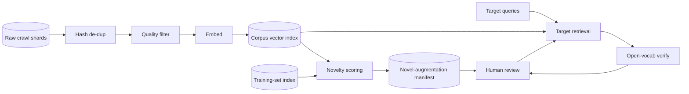

# Novel-Data Mining from an Unlabeled Corpus

[English](README.md) · [中文](README.zh.md)

<!-- meta:begin -->
| Type | Priority | Difficulty | Roles | Topics | Round |
| --- | --- | --- | --- | --- | --- |
| ML system design | ★☆☆☆☆ | — | MLE | ml-system-design, data-mining, retrieval | Onsite |
<!-- meta:end -->

## Problem

Design the offline pipeline that turns a newly acquired, unlabeled image corpus into two
deliverables for a computer-vision team: (1) a set of images that are novel relative to the data
the team's current vision model was already trained on, to be added to the next training round,
and (2) for a short list of target objects, the images in the corpus that contain them.

The team already has a trained vision encoder — a frozen model that maps an image to a
$d = 768$-dimensional embedding — and the $N_{\text{train}} = 4\times10^8$ labeled images it was
trained on, each with its embedding already computed and stored from that training run. A
data-collection partner delivers a new corpus scraped from the public web:
$N_{\text{raw}} = 8\times10^9$ images, unlabeled, averaging 100 KB each as crawled (JPEG, resized
to a web-friendly resolution by the crawler), reachable by URL and already sitting in object
storage.

For the target-object task, the vision team supplies a list of 200 target object categories; each
comes with either 3-10 example images or a one-paragraph text description, never large amounts of
either.

Scale given for this design: 128 GPUs (A100-class) are available, and the compute-heavy stages of
the pipeline (filtering, embedding, nearest-neighbor scoring) have up to 5 days of that fleet to
work with; the whole project, from receiving the corpus to delivering both outputs, has a 2-week
deadline, the rest of which covers human-labeling turnaround and review. Up to 6,000 images total
can be sent to human annotators across both deliverables.

Out of scope: training or fine-tuning the frozen vision encoder itself (only lightweight heads or
classifiers may be trained on top of its output); the crawler and the object-storage layer that
produced the corpus; OCR or format-specific parsing; serving either deliverable as a live,
user-facing search product — both are offline batch jobs whose output is a manifest, not a
request/response API with a latency target.

Produce:

1. A requirements and scale estimate: GPU-time to embed the corpus once, the size of the stored
   vectors, the memory of the nearest-neighbor indexes involved, and the cost of the
   de-duplication stage.
2. A record schema and the pipeline's stage-by-stage interfaces: what each stage reads, what it
   writes, and what fields survive to the next stage.
3. An architecture diagram, plus a walk-through of one image's path through the novelty side and
   one target object's path through the retrieval side.
4. Deep dives into: how "novel" is defined and measured; how target-object retrieval is built,
   including how to estimate its precision and recall without ground truth over the whole corpus;
   and how the pipeline is kept affordable and re-runnable at this scale. For each, compare at
   least two alternatives, say which you would pick, and state the cost of that choice.

## Reference solution

<details>
<summary>Show the reference solution</summary>

Worth confirming before designing: whether "novel" is judged against the training set alone or also
against production traffic, and whether the frozen encoder comes with a text encoder trained into
the same space (CLIP-style), which text-only targets rely on. The design below takes the training
set as the reference and assumes such an encoder; without one, those targets first get a few seed
images from a separate image-text model run over a corpus sample.

### Requirements and scale

**Cascade and corpus size.** Exact and perceptual-hash de-duplication first removes exact copies,
recompressions, resizes and slight crops (a 10% crop or a mirror flip already changes a third to a half
of the hash's 64 bits, close to an unrelated image, so those are left to the embedding-based
near-duplicate check); if that
discards 15%, $S_1 = 0.85\, N_{\text{raw}} = 6.8\times10^9$ images remain. A cheap quality filter
(corrupted files, near-blank images, extreme aspect ratios) removes a further 20%, leaving
$S_2 = 0.80\, S_1 = 5.44\times10^9$ images to embed.

**GPU-time to embed the corpus once.** At $T_{\text{qual}} = 4{,}000$ images/sec/GPU for the quality
filter and $T_{\text{embed}} = 800$ for the embedding model (roughly a ViT-L-sized encoder at 224px,
about 40% of an A100's bf16 peak), filtering costs $S_1 / T_{\text{qual}} \approx 472$ GPU-hours and
embedding $S_2 / T_{\text{embed}} \approx 1{,}889$, about 2,361 combined: 18.4 hours on the 128
GPUs, under 16% of the 15,360 GPU-hours in 5 days. Embedding $N_{\text{raw}}$ directly would cost
$N_{\text{raw}} / T_{\text{embed}} \approx 2{,}778$ GPU-hours, 417 more; Deep dive (c) shows where
that saving comes from.

**Vector storage and nearest-neighbor index memory.** At $d = 768$, the $S_2$ vectors take
$S_2 \cdot d \cdot 2 \approx 7.6$ TiB in float16, $\approx 3.8$ TiB quantized to int8. An HNSW graph
over them ($M_0 = 32$ base-layer neighbors, 4-byte ids, 30% upper-layer overhead) adds
$\approx 0.82$ TiB, for a $\approx 4.6$ TiB corpus index: 19 shards at 256 GiB of index memory per
node. The training set's index, over $N_{\text{train}} = 4\times10^8$ vectors, is only $\approx 348$
GiB, two such nodes.

**De-duplication and neighbor queries.** The hash needs only a 32×32 thumbnail, so its cost is a
reduced-size JPEG decode, about 1 ms per image per core, or 67 minutes on 2,000 cores; but the stage
reads all 800 TB, and at an assumed 100 GB/s from object storage the read, about 2.2 hours, sets its
time. The two neighbor passes (against the corpus index for near-duplicates and density, against the
training-set index for distance to training) run on the index nodes' CPUs. Vectors are spread across
shards at random, so every query visits every shard, and total query work grows with the shard count
(a graph search grows only logarithmically with shard size), which is why the shards are few and
large. At an assumed 1 ms of one core per visit, each of the 21 64-core nodes serves all $S_2$
queries in $S_2 \times 1\,\text{ms} / 64 \approx 24$ hours, all in parallel: about $3.2\times10^4$
core-hours, off the GPUs.

**Target-object scan.** The 200 targets bring at most 5 query vectors each; scoring all 1,000
against every stored vector is $2 \cdot S_2 \cdot d \cdot 1{,}000 \approx 8.4\times10^{15}$
operations, 42 seconds of one GPU at an assumed 200 TFLOPS. The read, not the arithmetic, is the
bound: each 1,536-byte vector feeds 1,000 dot products, about 1,000 operations per byte, so a GPU
would need 200 GB/s of vectors, but the 7.6 TiB is 100 times one GPU's memory and a PCIe link
carries about 25 GB/s: about 6 minutes on one GPU, or about 1.4 minutes across the fleet, set by the
100 GB/s read from the vector store. The in-corpus pass cannot be brute-forced: with $S_2$ queries
it is compute-bound, $d \cdot S_2^2 \approx 2.3\times10^{22}$ operations counting each pair once,
about 31,600 GPU-hours, twice the 5-day budget; hence the approximate index.

### Data and pipeline interfaces

**Image record**, one row per corpus image, updated in place as it moves through the stages:
`image_id`, `source_url`, `content_hash`, `phash` (64-bit perceptual hash), `dup_group` (its
near-duplicate group), `width`, `height`, `stage`
(`raw | deduped | quality_kept | embedded | scored`), `quality_score`, `embedding_ref` (a pointer
into the vector store), `train_nn_dist` (distance to the nearest training-set neighbor),
`corpus_knn_dist` (distance to its 5th-nearest in-corpus neighbor, the density signal of Deep dive
(a)), `target_hits` (`[{target_id, stage: "zero_shot" | "detector" | "classifier", score, bbox}]`).

Pipeline interfaces, one per stage, each idempotent per shard (see Deep dive (c)):

1. `dedup_shard(shard_id) -> DedupManifest` — hashes a shard of raw images, writes
   `{image_id, content_hash, phash, dup_group, keep}` for every image.
2. `quality_filter_shard(shard_id) -> QualityManifest` — runs the quality model on the kept images,
   writes `{image_id, quality_score, keep}`.
3. `embed_shard(shard_id) -> EmbeddingManifest` — embeds, writes the vectors to the vector store and
   `{image_id, embedding_ref}` to the manifest.
4. `score_novelty_shard(shard_id) -> NoveltyManifest` — queries both indexes, writes
   `{image_id, train_nn_dist, corpus_knn_dist}` and merges embedding-level near-duplicates into
   `dup_group`.
5. `retrieve_target(target_id, query_embeddings, top_k) -> RankedCandidates` — scores
   `query_embeddings` (from a target's example images or description) exactly against every
   stored vector, returns the `top_k` `{image_id, score}` pairs.

Human review goes through `submit_for_review(image_ids, task) -> batch_id` and
`get_review_labels(batch_id) -> labels`, charged against the shared 6,000-image budget.

### Architecture



An image passes hash de-dup and the quality filter, is embedded, and lands in the corpus vector
index; novelty scoring queries that index for in-corpus density and the training-set index for
distance from what the model already knows, and the top-ranked candidates go into the
novel-augmentation manifest. A target's query vectors, built once from its example images or
description, are scanned against every stored vector; the open-vocabulary detector re-examines only
the resulting shortlist, and its confirmed hits, with a sample of the novelty manifest, go to human
review, whose labels feed back into retrieval as the active-learning signal of Deep dive (b).

### Deep dives

**How "novel" is defined and measured.** *Distance to the nearest training-set neighbor* is cheap,
the query already run above, but alone ranks isolated outliers as high as genuine novelty: a one-off
oddity (a garbled render, an extreme crop) is far from every training image precisely because
nothing else looks like it. *Low likelihood under a density model* fit to training embeddings fails
the same way. *High predictive uncertainty* of the existing classifier (high entropy; loss needs
labels) also flags ambiguous examples of known classes, and misses novel images it labels
confidently, as softmax classifiers often do far from their training data. *Under-covered clusters*,
whose training-set share is far below their corpus share, ignore stray points and are cheap (one
assignment pass against $10^5$ centroids is about 1 GPU-hour), but depend on granularity: at $10^5$
clusters the average one holds 54,000 images, enough to hide a new concept of a few thousand.

The design uses a local form of the cluster check, with no granularity to choose: an image qualifies
only if its `corpus_knn_dist` is below a threshold (it has several similar images in the corpus),
and qualifying images are ranked by distance to the training set. On synthetic 2-D data (three
Gaussian training clusters; a corpus adding two clusters absent from training plus 20 scattered
points standing in for oddities, 2.6% of it), ranking by distance alone put all 15 farthest points,
and 15 of the top-decile 77, in the scattered group. Keeping only points whose 5th-nearest in-corpus
neighbor is closer than the 70th-percentile distance, then taking the 77 farthest, selected none of
them and raised recall on the new clusters from 20.7% to 25.7%; using the density check as a second
fixed cutoff instead shrank the selection to 33 and recall to 11.0%, so the check filters before
ranking.
The counts are this setup's; over 50 seeds the direction held.

Novelty is not usefulness either, so a small controlled experiment gates any larger backfill. It
takes 2,000 of the 6,000 labels: 750 novelty-selected images and 750 drawn uniformly from the
quality-kept corpus, all labeled with the team's classes, and a 500-image evaluation slice drawn
uniformly from the corpus with near-duplicates of every added image removed, so nothing trained on
reappears in evaluation. Two linear probes on the frozen encoder, trained on the same training-set
subset plus either the 750 novel or the 750 random images, are compared on the slice and on the
existing validation set; the novel arm must win on the first without losing on the second. With 500
evaluation images only large differences show, so this is a go/no-go gate, not a measurement.

**Target-object retrieval.** *Zero-shot retrieval* scores every corpus embedding against a target's
query vectors (averaged example-image embeddings, or the text encoder's embedding of the
description): cheap and training-free, but a query for "a red bicycle" also surfaces bicycle shops
and similarly colored objects, so precision is weak. *An open-vocabulary detector* scores candidate
boxes against the description, or against example images for detectors that accept image queries; it
localizes the object and is far more precise, but at an assumed 30 images/sec/GPU all of $S_2$ would
take about 50,000 GPU-hours, over three times the budget. *A lightweight classifier* on the frozen
embeddings (a prototype or heavily regularized linear head) is cheap at corpus scale, but with 3-10
positives it needs mined negatives and regularization to avoid latching onto whatever those few
examples happen to share.

The design cascades all three. The exact scan returns 20,000 candidates per target; the detector
re-scores only those, $4\times10^6$ images or about 37 GPU-hours, dropping unconfirmed ones; once a
target's confirmed hits reach a few dozen, the classifier trains on them and pulls in candidates the
scan under-ranked, in an active-learning loop that sends borderline images, not random ones, to
review, since an obvious hit or miss teaches the classifier little. Those labels are not a random
sample, so they never enter the precision and recall estimates.

Both estimates come from labeled samples. For precision, a target's hits are split into score bins
and a fixed number per bin is labeled; precision above a threshold is the size-weighted average
$\sum_h N_h \hat p_h / \sum_h N_h$ over the bins above it ($N_h$ a bin's size, $\hat p_h$ its
labeled hit rate); a few thousand labels leave each target's own figure coarse, so bins are pooled
across targets as well. For recall, the *rule of three*: if $n$ images drawn uniformly at random
from a large set contain no positive, the one-sided 95% upper bound on the set's positive rate is
$1 - 0.05^{1/n} \approx 3/n$. Drawn from the $N$ undelivered images, it bounds the misses at $3N/n$,
so $F / (F + 3N/n)$, with $F$ the verified true positives delivered, is a 95% lower bound on recall.
At this scale it is useless: $N \approx S_2$, $n = 2{,}000$ and $F = 3{,}000$ give recall of at
least 0.04%, and certifying 50% would take $n \approx 5.4\times10^6$. The budget can instead measure
recall within a deep pool, say a target's top $10^6$ by zero-shot score: its undelivered part is
split into score bands, each sampled, and a band's misses are bounded by its size times an exact
binomial upper bound on its rate (the zero-hit formula when it has none), each of the $H$ bands at
confidence $1 - 0.05/H$ so the sum holds at 95% (a union bound). A near-zero rate in the deepest
band shows the ranking has run dry; below the pool only the weak bound applies, and even this is
affordable only for the highest-priority targets.

**Scale and cost.** Reprocessing the whole corpus on every change is simple, but each tweak then
costs the full 2,361 GPU-hours. Instead each stage writes its manifest under
`(shard_id, stage, config_hash)`, the hash covering the stage's config and the keys of the manifests
it read, so a change re-runs exactly the stages downstream of it, and a crashed run retries in place
because a shard counts as done only once its manifest exists. Stages store scores beside decisions
(`quality_score` beside `keep`), so moving a threshold re-reads scores rather than re-running a
model. The cost is the manifest store and hashing every config.

A filter placed before the embedding model saves GPU time only if the fraction $r$ it drops exceeds
$T_{\text{embed}} / T$, where $T$ is its own throughput. The CPU hash de-dup drops 15% at no GPU
cost and accounts for the whole 417 GPU-hour saving; the quality filter, dropping 20% at a fifth of
the embedding cost per image, exactly breaks even (472 GPU-hours spent, 472 saved) and earns its
place by keeping junk out of the index and the novelty set.

### Follow-ups

- Mining medical images targets something different: "effective, high-signal" is not "novel", since
  a striking scan can be clinically uninformative; the score would add agreement with a small,
  clinician-verified set to distance from training.
- When a target's examples span several visual styles, averaging them into one query vector can wash
  out a mode; clustering the examples and querying each centroid (up to the 5 vectors per target)
  covers each style.
- A pattern repeated thousands of times in the crawl but never in training passes the density check
  easily and could flood the novelty set; capping how many selected images may share one
  `dup_group` stops it.

<details>
<summary>Estimate check (runnable)</summary>

```python
import io
import math
import time
from collections import Counter

import numpy as np
from PIL import Image
from scipy.fft import dctn
from scipy.stats import beta
from sklearn.datasets import load_sample_images
from sklearn.neighbors import NearestNeighbors

# ---- corpus sizes through the cheap-filter cascade ----
N_raw, N_train = 8_000_000_000, 400_000_000
S1 = round(N_raw * 0.85)       # survives exact + perceptual-hash de-dup
S2 = round(S1 * 0.80)          # survives the quality filter -> this is what gets embedded
assert (S1, S2) == (6_800_000_000, 5_440_000_000)

# ---- GPU-hours: cheap filter, then the embedding model ----
T_qual, T_embed = 4_000, 800   # images/sec/GPU, stated assumptions
assert 0.35 < 155.6e9 * T_embed / 312e12 < 0.45   # ViT-L/14 at 224px ~156 GFLOPs; A100 bf16 peak
gpu_h_qual, gpu_h_embed = S1 / T_qual / 3600, S2 / T_embed / 3600
gpu_h_cascade = gpu_h_qual + gpu_h_embed
assert math.isclose(gpu_h_qual, 472.2, rel_tol=1e-3) and math.isclose(gpu_h_embed, 1888.9, rel_tol=1e-3)
assert math.isclose(gpu_h_cascade, 2361.1, rel_tol=1e-3)
GPUS, budget_gpu_h = 128, 128 * 5 * 24
assert budget_gpu_h == 15_360 and gpu_h_cascade / budget_gpu_h < 0.16
assert math.isclose(gpu_h_cascade / GPUS, 18.4, rel_tol=5e-3)
gpu_h_no_cascade = N_raw / T_embed / 3600
assert math.isclose(gpu_h_no_cascade, 2777.8, rel_tol=1e-3)
savings = gpu_h_no_cascade - gpu_h_cascade
assert math.isclose(savings, 416.7, rel_tol=1e-3)
# the whole saving is the CPU de-dup's; the GPU quality filter exactly breaks even (r == T_embed / T_qual)
assert math.isclose((N_raw - S1) / T_embed / 3600, savings, rel_tol=1e-9)
assert math.isclose((S1 - S2) / T_embed / 3600, gpu_h_qual, rel_tol=1e-9)

# ---- hash de-dup: 1 ms/image/core of reduced-size decode; the 800 TB read sets the time ----
assert math.isclose(N_raw * 1e-3 / 2_000 / 60, 66.7, rel_tol=1e-3)     # minutes of compute
store_read = 100e9                                                     # bytes/sec, assumption
assert math.isclose(N_raw * 100e3 / store_read / 3600, 2.2, rel_tol=0.02)

# ---- vector storage and index memory ----
GiB, TiB, d = 1024**3, 1024**4, 768
fp16_bytes, int8_bytes = S2 * d * 2, S2 * d
assert math.isclose(fp16_bytes / TiB, 7.6, rel_tol=1e-2) and math.isclose(int8_bytes / TiB, 3.8, rel_tol=1e-2)
M0, id_bytes, layer_factor = 32, 4, 1.3
graph_bytes = S2 * M0 * id_bytes * layer_factor
assert math.isclose(graph_bytes / TiB, 0.82, rel_tol=1e-2)
assert math.isclose((int8_bytes + graph_bytes) / TiB, 4.6, rel_tol=1e-2)
corpus_shards = math.ceil((int8_bytes + graph_bytes) / GiB / 256)
train_bytes = N_train * d + N_train * M0 * id_bytes * layer_factor
assert math.isclose(train_bytes / GiB, 348, rel_tol=1e-2)
train_shards = math.ceil(train_bytes / GiB / 256)
assert (corpus_shards, train_shards) == (19, 2)

# ---- neighbor passes on the index nodes' CPUs: every query visits every shard ----
visit_s, cores_per_node = 1e-3, 64
assert 23 < S2 * visit_s / cores_per_node / 3600 < 24.5              # hours, same on every node
assert math.isclose(S2 * (corpus_shards + train_shards) * visit_s / 3600, 3.2e4, rel_tol=0.02)

# ---- exact target scan: 1,000 query vectors, bound by the read, not the arithmetic ----
flops, gpu_flops = 2 * S2 * d * 1_000, 200e12
assert math.isclose(flops / gpu_flops, 41.8, rel_tol=1e-2) and math.isclose(flops, 8.4e15, rel_tol=0.01)
assert math.isclose(flops / fp16_bytes, 1000)                         # operations per byte read
assert fp16_bytes / 80e9 > 100                                        # vs one GPU's memory
assert math.isclose(fp16_bytes / 25e9 / 60, 5.6, rel_tol=1e-2)        # minutes through one PCIe link
assert math.isclose(fp16_bytes / store_read / 60, 1.4, rel_tol=1e-2)  # minutes, fleet-wide read
pair_gpu_h = d * S2 * S2 / gpu_flops / 3600                           # in-corpus, each pair once
assert math.isclose(d * S2 * S2, 2.3e22, rel_tol=0.02) and math.isclose(pair_gpu_h, 31_600, rel_tol=1e-2)
assert pair_gpu_h > 2 * budget_gpu_h

# ---- open-vocabulary detector (30 images/sec/GPU, assumption) and clustering ----
assert math.isclose(S2 / 30 / 3600, 50_000, rel_tol=0.01) and S2 / 30 / 3600 > 3 * budget_gpu_h
det_gpu_h = 200 * 20_000 / 30 / 3600
assert math.isclose(det_gpu_h, 37, rel_tol=0.01)
assert (gpu_h_cascade + det_gpu_h) / budget_gpu_h < 0.16
assert math.isclose(2 * S2 * 100_000 * d / gpu_flops / 3600, 1.16, rel_tol=1e-2)
assert S2 / 100_000 == 54_400
assert 6_000 - (750 + 750 + 500) == 4_000                            # labels left for retrieval

# ---- rule of three and the recall lower bound ----
def cp_upper(x, n, alpha):     # one-sided exact (Clopper-Pearson) upper bound on a binomial rate
    return 1.0 if x == n else beta.ppf(1 - alpha, x + 1, n - x)

n_r, F = 2_000, 3_000
assert math.isclose(cp_upper(0, n_r, 0.05), 1 - 0.05 ** (1 / n_r), rel_tol=1e-9)
assert math.isclose(1 - 0.05 ** (1 / n_r), 3 / n_r, rel_tol=0.01)
miss_bound = 3 * S2 / n_r
assert math.isclose(miss_bound, 8.16e6, rel_tol=1e-3)
assert 0.00035 < F / (F + miss_bound) < 0.0004                        # recall >= ~0.04%
assert math.isclose(3 * S2 / F, 5.44e6)                               # n needed for 3N/n <= F
H = 3                                                                  # union bound over H bands
assert math.isclose(cp_upper(0, 200, 0.05 / H), math.log(20 * H) / 200, rel_tol=0.05)
print("all scale estimates check out")

# ---- perceptual hash: robust to recompression and resizing, not to heavier crops or flips ----
def phash64(img):
    g = np.asarray(img.convert("L").resize((32, 32), Image.LANCZOS), dtype=np.float64)
    c = dctn(g, norm="ortho")[:8, :8].ravel()
    return c > np.median(c[1:])

photos = [Image.fromarray(a) for a in load_sample_images().images]
for im in photos:
    W, Hp = im.size
    h0 = phash64(im)
    bits = lambda other: int((h0 != phash64(other)).sum())
    buf = io.BytesIO()
    im.save(buf, "JPEG", quality=25)
    assert bits(Image.open(io.BytesIO(buf.getvalue()))) <= 2 and bits(im.resize((W * 2 // 5, Hp * 2 // 5))) <= 2
    assert bits(im.crop((W // 50, Hp // 50, W - W // 50, Hp - Hp // 50))) <= 6        # 2% crop
    assert bits(im.crop((W // 10, Hp // 10, W - W // 10, Hp - Hp // 10))) >= 21       # 10% crop
    assert bits(im.transpose(Image.FLIP_LEFT_RIGHT)) >= 30
assert int((phash64(photos[0]) != phash64(photos[1])).sum()) >= 28                     # unrelated

jpeg = io.BytesIO()
photos[0].resize((800, 534)).save(jpeg, "JPEG", quality=85)
assert 80e3 < len(jpeg.getvalue()) < 130e3                          # a ~100 KB crawled image
def seconds_per_hash(reduced):
    t0 = time.perf_counter()
    for _ in range(50):
        x = Image.open(io.BytesIO(jpeg.getvalue()))
        if reduced:
            x.draft("L", (64, 64))   # NOTE: DCT-domain downscaling while decoding; the hash needs 32x32
        phash64(x)
    return (time.perf_counter() - t0) / 50

reduced_s, full_s = seconds_per_hash(True), seconds_per_hash(False)
assert reduced_s < 5e-3 and reduced_s < 0.6 * full_s               # ~1 ms; order of magnitude only

# ---- synthetic novelty experiment: distance-only ranking vs density filter, then ranking ----
def novelty_experiment(seed):
    rng = np.random.default_rng(seed)
    blob = lambda centers, n: np.vstack([rng.normal(c, 0.7, size=(n, 2)) for c in centers])
    known_c, new_c = [[0.0, 0.0], [6.0, 6.0], [6.0, -6.0]], [[-6.0, 6.0], [-6.0, -6.0]]
    train = blob(known_c, 400)
    corpus = np.vstack([blob(known_c, 150), blob(new_c, 150), rng.uniform(-20, 20, size=(20, 2))])
    labels = np.array(["known"] * 450 + ["new"] * 300 + ["scattered"] * 20)
    dist_to_train = NearestNeighbors(n_neighbors=1).fit(train).kneighbors(corpus)[0].ravel()
    kth = NearestNeighbors(n_neighbors=6).fit(corpus).kneighbors(corpus)[0][:, -1]  # 5th, self excluded
    K = len(corpus) // 10
    order = np.argsort(-dist_to_train)
    dense = kth <= np.percentile(kth, 70)
    filtered = [i for i in order if dense[i]][:K]          # NOTE: filter first, then rank
    both_cutoffs = order[:K][dense[order[:K]]]              # two fixed cutoffs shrink the selection
    return labels, [Counter(labels[idx]) for idx in (order[:K], filtered, both_cutoffs)], labels[order[:15]]

labels, (c_dist, c_filt, c_both), far15 = novelty_experiment(0)
assert len(labels) == 770 and math.isclose((labels == "scattered").mean(), 0.026, rel_tol=0.01)
assert (far15 == "scattered").all()
assert (c_dist["scattered"], c_dist["new"]) == (15, 62)
assert (c_filt["scattered"], c_filt["new"]) == (0, 77)
assert sum(c_both.values()) == c_both["new"] == 33
for c, recall in ((c_dist, 0.207), (c_filt, 0.257), (c_both, 0.110)):
    assert math.isclose(c["new"] / 300, recall, abs_tol=5e-4)
for seed in range(1, 50):                                  # the direction, not the counts, is general
    _, (c_dist, c_filt, _), _ = novelty_experiment(seed)
    assert c_filt["scattered"] <= 1 < c_dist["scattered"] and c_filt["new"] > c_dist["new"]
print("perceptual-hash and novelty experiments check out")
```

</details>

</details>
