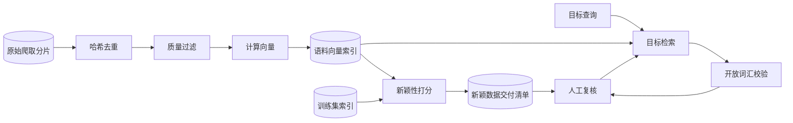

# 从无标注语料中挖掘新数据

[English](README.md) · [中文](README.zh.md)

<!-- meta:begin -->
| 题型 | 优先级 | 难度 | 岗位 | 考点 | 轮次 |
| --- | --- | --- | --- | --- | --- |
| ML 系统设计 | ★☆☆☆☆ | — | MLE | ml-system-design, data-mining, retrieval | 现场面 |
<!-- meta:end -->

## 题目

设计一条离线流水线，把新拿到的、无标注的图片语料变成计算机视觉团队需要的两份交付物：(1) 相对于团队现有视觉模型的训练集而言“新”的一批图片，供下一轮训练扩充使用；(2) 针对一份目标物体清单，语料里包含这些物体的图片。

团队已经有一个训练好的视觉编码器——一个冻结的模型，把一张图片映射成 $d = 768$ 维的向量（embedding）——以及训练它用的 $N_{\text{训练}} = 4\times10^8$ 张已标注图片，每张图片在那次训练时就已经算好并存下了向量。一家数据供应方交付了一批从公开网页抓取的新语料：$N_{\text{原始}} = 8\times10^9$ 张图片，无标注，抓取下来的平均大小 100 KB（JPEG，抓取程序已缩放到适合网页的分辨率），可以通过 URL 访问，已经落在对象存储里。

目标物体任务这边，视觉团队给出 200 个目标物体类别的清单；每个类别配有 3-10 张示例图片，或者一段文字描述，两者都不会给很多。

这次设计给定的规模：可用 128 张 A100 级别的 GPU，流水线里计算密集的几个阶段（过滤、生成向量、最近邻打分）最多可以用这批 GPU 5 天；整个项目从拿到语料到交付两份结果，一共两周，剩下的时间用于人工标注的周转和复核。两份交付物加起来最多可以把 6,000 张图片送去人工标注。

范围外：训练或微调那个冻结的视觉编码器本身（只能在它的输出向量之上训练轻量级的探针或分类头）；产出这批语料的爬虫和对象存储层；OCR 与特殊格式的解析；把任何一份交付物做成面向最终用户、实时可用的搜索产品——两份都是离线批处理任务，产出一份清单（manifest），不是带延迟指标的请求-响应接口。

要产出：

1. 需求与规模估算：把整个语料算一遍向量需要的 GPU 时间、存下的向量占多少空间、涉及的几个最近邻索引各占多少内存、去重阶段的计算量。
2. 一份记录字段的定义，以及流水线各阶段的接口：每个阶段读什么、写什么、哪些字段会传到下一阶段。
3. 一张架构图，并沿着一张图片在新颖性一侧的路径、一个目标物体在检索一侧的路径，各走一遍。
4. 深入话题：“新颖”如何定义与度量；目标物体检索怎么搭建，包括在语料没有全量标签的情况下如何估计精度和召回；如何让这条流水线在这个规模下仍然负担得起、并且可以重跑。每个话题至少比较两种方案，说明选哪个，并给出这个选择的代价。

## 参考解答

<details>
<summary>展开参考解答</summary>

动手设计之前值得先确认两点：“新颖”只对照训练集，还是也对照线上流量；冻结的编码器有没有训练到同一向量空间里的文字编码器（CLIP 式训练会有），只有文字描述的目标要靠它。下面以训练集为唯一参照，并假设有这样的编码器；没有的话，这类目标先用另一个图文模型在语料抽样里找几张种子图片。

### 需求与规模

**级联过滤与语料规模。** 先做精确去重和感知哈希（perceptual hash）去重，去掉完全相同的副本，以及重新压缩、缩放、轻微裁剪过的版本（裁剪 10% 或镜像翻转就会改变哈希 64 位中的三分之一到一半，接近两张无关图片的差异，这些留给基于向量的近似重复检查）；假设这一步去掉 15%，剩下 $S_1 = 0.85\, N_{\text{原始}} = 6.8\times10^9$ 张。接着是一个便宜的质量过滤器（损坏文件、近乎空白的图片、极端长宽比），再去掉 20%，剩下 $S_2 = 0.80\, S_1 = 5.44\times10^9$ 张送去算向量。

**把语料算一遍向量需要的 GPU 时间。** 质量过滤的吞吐取 $T_{\text{质检}} = 4{,}000$ 张/秒/GPU，向量模型取 $T_{\text{向量}} = 800$ 张/秒/GPU（大致是 224px 下 ViT-L 规模的编码器，约为 A100 bf16 峰值算力的 40%），过滤耗时 $S_1 / T_{\text{质检}} \approx 472$ GPU 小时，算向量耗时 $S_2 / T_{\text{向量}} \approx 1{,}889$ GPU 小时，合计约 2,361：128 张 GPU 上约 18.4 小时，不到 5 天配额 15,360 GPU 小时的 16%。直接对 $N_{\text{原始}}$ 算向量要 $N_{\text{原始}} / T_{\text{向量}} \approx 2{,}778$ GPU 小时，多出 417；这笔节省从哪里来，见深入话题“规模与成本”。

**向量存储与最近邻索引的内存。** $d = 768$ 时，$S_2$ 个向量用 float16 存储占 $S_2 \cdot d \cdot 2 \approx 7.6$ TiB，量化成 int8 约 3.8 TiB。这些向量之上的 HNSW 图（基础层每个节点 $M_0 = 32$ 个邻居，每个 id 占 4 字节，上层再多约 30%）再加约 0.82 TiB，语料索引合计约 4.6 TiB：每个节点 256 GiB 索引内存，共 19 个分片。训练集自己的索引，$N_{\text{训练}} = 4\times10^8$ 个向量，只要约 348 GiB，两个这样的节点。

**去重与近邻查询。** 感知哈希只需要一张 32×32 的缩略图，所以它的开销在于按缩小的尺寸解码 JPEG，每张图片每核约 1 毫秒，2,000 核上约 67 分钟；但这一步要读完全部 800 TB，按假设的对象存储读取速度 100 GB/s，读一遍约 2.2 小时，决定这一步耗时的是读取，而不是哈希。两次近邻查询（查语料索引得到近似重复和密度信号，查训练集索引得到离训练集的距离）在索引节点的 CPU 上跑。向量是随机分到各分片的，所以每次查询都要访问每一个分片，总查询量随分片数增长（图搜索的开销只随分片大小对数增长），这就是分片少而大的原因。假设每次分片访问占一个核 1 毫秒，21 个 64 核节点每个都要处理全部 $S_2$ 次查询，耗时 $S_2 \times 1\,\text{ms} / 64 \approx 24$ 小时，所有节点并行：合计约 $3.2\times10^4$ 核时，不占用 GPU。

**目标物体扫描。** 200 个目标每个最多 5 个查询向量，把这 1,000 个向量与全部存储向量逐一打分，是 $2 \cdot S_2 \cdot d \cdot 1{,}000 \approx 8.4\times10^{15}$ 次运算，按假设的 200 TFLOPS，一张 GPU 要算 42 秒。瓶颈在读数据，不在计算：每个 1,536 字节的向量参与 1,000 次点积，每字节约 1,000 次运算，GPU 要满负荷就需要每秒读入 200 GB 向量；但 7.6 TiB 是一张 GPU 显存的 100 倍，一条 PCIe 链路只有约 25 GB/s，所以一张 GPU 上要约 6 分钟，分到整个集群上约 1.4 分钟，由向量存储 100 GB/s 的读取速度决定。语料内部的近邻查询没法这样暴力做：查询数从 1,000 变成 $S_2$，就变成了计算受限，每一对只算一次也要 $d \cdot S_2^2 \approx 2.3\times10^{22}$ 次运算，约 31,600 GPU 小时，是 5 天配额的两倍，所以才要建近似索引。

### 数据与流水线接口

**图片记录**，语料里每张图片一行，随着它走过各阶段原地更新：`image_id`、`source_url`、`content_hash`、`phash`（64 位感知哈希）、`dup_group`（它所属的近似重复组）、`width`、`height`、`stage`（`raw | deduped | quality_kept | embedded | scored`）、`quality_score`、`embedding_ref`（指向向量存储的指针）、`train_nn_dist`（到训练集最近邻的距离）、`corpus_knn_dist`（到语料内部第 5 近邻的距离，深入话题“新颖如何定义与度量”里的密度信号）、`target_hits`（`[{target_id, stage: "zero_shot" | "detector" | "classifier", score, bbox}]`）。

流水线接口，每个阶段一个，按分片幂等（见深入话题“规模与成本”）：

1. `dedup_shard(shard_id) -> DedupManifest`——给一个分片的原始图片算哈希，为每张图片写 `{image_id, content_hash, phash, dup_group, keep}`。
2. `quality_filter_shard(shard_id) -> QualityManifest`——对保留的图片跑质量模型，写 `{image_id, quality_score, keep}`。
3. `embed_shard(shard_id) -> EmbeddingManifest`——给质量过滤后保留的图片算向量，写进向量存储，`{image_id, embedding_ref}` 写进清单。
4. `score_novelty_shard(shard_id) -> NoveltyManifest`——为每张图片查两个索引，写 `{image_id, train_nn_dist, corpus_knn_dist}`，并把向量层面的近似重复合并进 `dup_group`。
5. `retrieve_target(target_id, query_embeddings, top_k) -> RankedCandidates`——把 `query_embeddings`（来自示例图片或文字描述）与每个存储向量精确打分，返回前 `top_k` 个 `{image_id, score}`。

人工复核通过 `submit_for_review(image_ids, task) -> batch_id` 和 `get_review_labels(batch_id) -> labels` 进行，从共享的 6,000 张标注预算里扣减。

### 架构



一张图片先经过哈希去重和质量过滤，再算出向量、落进语料向量索引；新颖性打分查这个索引拿语料内部的密度信号，再查训练集索引拿它和模型已知内容的距离，排名靠前的候选写进新颖数据交付清单。一个目标的查询向量从它的示例图片或文字描述一次性算出，与全部存储向量逐一比对；开放词汇检测器（open-vocabulary detector）只重新检查得到的候选短名单，它确认的命中连同新颖清单的一份抽样送去人工复核，复核的标签作为主动学习信号回流到目标检索（深入话题“目标物体检索”）。

### 深入话题

**“新颖”如何定义与度量。** *到训练集最近邻的距离*很便宜，就是上面已经跑过的那次查询，但单独用它，会把孤立的离群点和真正新的内容排得一样高：一张独一无二的怪图（渲染出错的画面、极端的裁剪）离每一张训练图片都很远，恰恰是因为没有别的东西长得像它。*在拟合训练集向量的密度模型下似然很低*，失效的方式也一样。*现有分类器的预测不确定性高*（熵高；损失要有标签才能算）也会标出已知类别里本来就含糊的样本，还会漏掉分类器很有把握的新图片，softmax 分类器在远离训练数据的地方常常如此。*覆盖不足的簇*，即训练集占比远低于语料占比的簇，不会被孤立点骗过，也不贵（对 $10^5$ 个簇中心做一遍分配约 1 GPU 小时），但结论取决于粒度：分成 $10^5$ 个簇时平均每簇 54,000 张，足以把一个只有几千张的新概念藏在里面。

这里的设计用簇检查的局部版本，不需要选粒度：一张图片只有 `corpus_knn_dist` 低于阈值（在语料里有若干张相似的图片）才有资格入选，有资格的图片再按到训练集的距离排序。在二维合成数据上（训练集取自三个高斯簇；语料另外加了两个训练集里没有的簇，外加 20 个散布得很开、充当怪图的点，占语料的 2.6%），只按距离排序时，最远的 15 个点全是散点，前十分之一的 77 个点里也有 15 个散点。只保留第 5 近邻距离小于整体第 70 百分位的点，再取离训练集最远的 77 个，一个散点也没有选中，新簇的召回从 20.7% 升到 25.7%；如果把密度检查当作第二道固定阈值，选出的点只剩 33 个，召回降到 11.0%，所以要先过滤、再排序。这些数字只属于这个实验设定；换 50 个随机种子，方向每次都成立。

新颖也不等于有用，所以更大规模的回填之前，先用一个小的对照实验把关。6,000 张标注里拿出 2,000 张：750 张从新颖选择里抽，750 张从质量过滤后的语料里均匀随机抽，全部按团队的类别标注；再从语料里均匀抽 500 张作评测集，并去掉与任何一张加入训练的图片近似重复的图片，保证训练里见过的东西不会在评测里再出现。在冻结编码器上训练两个线性探针（linear probe），用同一份训练集子集，分别加上 750 张新颖图片或 750 张随机图片，在这份评测集和团队现有的验证集上比较；新颖组必须在前者上胜出，同时在后者上不变差。500 张评测图片只分辨得出较大的差异，所以这是一道放行关口，不是对收益的测量。

**目标物体检索。** *零样本检索*（zero-shot retrieval）把语料里每个向量和目标的查询向量（示例图片向量的平均，或文字编码器给描述算出的向量）比对打分：便宜、不用训练，但查“一辆红色自行车”也会带出自行车店和颜色相近的其它物体，精度不高。*开放词汇检测器*把图片里的候选框与目标的文字描述比对打分，支持图片查询的检测器也可以与示例图片比对；它定位到物体本身，精度高得多，但按假设的每 GPU 每秒 30 张，全部 $S_2$ 要约 50,000 GPU 小时，是整个配额的三倍以上。*在冻结向量之上训练的轻量分类器*（原型分类器或加了强正则的线性头）在全语料规模上跑起来很便宜，但每个目标只有 3-10 张正例，需要挖掘负例、做好正则，否则容易抓住那几张示例碰巧共有的特征。

这里的设计把三者级联起来。精确扫描给每个目标返回 20,000 个候选；检测器只给这些候选重新打分，一共 $4\times10^6$ 张、约 37 GPU 小时，丢掉不能确认的；某个目标确认的命中累计到几十张后，分类器在这些命中上训练，找回扫描时排名靠后的候选，构成一个主动学习循环：每一轮送去复核的是阈值附近、打分模糊的图片，而不是随机图片，因为一目了然的命中或未命中对分类器帮助很小。这些标签不是随机样本，所以从不进入精度和召回的估计。

两种估计都来自标注样本。精度方面，把一个目标的命中按分数分成若干区间，每个区间标注固定数量；阈值以上的精度是这些区间按大小加权的平均 $\sum_h N_h \hat p_h / \sum_h N_h$（$N_h$ 是区间大小，$\hat p_h$ 是标注命中率）；几千张标注分到各个目标，每个目标的数字都很粗，所以还要跨目标合并。召回方面用*三法则*（rule of three）：从一个大集合里均匀随机抽 $n$ 张、没有一个正例时，该集合正例比例的单侧 95% 上界是 $1 - 0.05^{1/n} \approx 3/n$。从没有交付的 $N$ 张图片里抽样，漏检数的上界就是 $3N/n$，于是 $F / (F + 3N/n)$ 是召回的 95% 下界，$F$ 是交付结果里经过核实的正例数。在这个规模上它没有用：$N \approx S_2$、$n = 2{,}000$、$F = 3{,}000$ 时，召回只能保证不低于 0.04%，要证明召回达到 50% 需要 $n \approx 5.4\times10^6$。预算能测的是较深候选池里的召回，比如一个目标零样本分数前 $10^6$ 的图片：把池中未交付的部分按分数分段、每段抽样，每段的漏检数用段的大小乘以它比例的精确二项上界来界定（没有命中时就是上面的零命中公式），$H$ 段各取 $1 - 0.05/H$ 的置信度，加总后整体在 95% 下成立（联合界，union bound）。最深一段的命中率接近零，说明排序已经见底；池子以外只有那个很弱的界，而且这种抽样也只负担得起优先级最高的目标。

**规模与成本。** 每次改动都把整个语料重新处理一遍很简单，但每次微调都要付出全部 2,361 GPU 小时。这里的做法是每个阶段把清单写到按 `(shard_id, stage, config_hash)` 编码的路径下，哈希覆盖这个阶段自己的配置和它读取的各份清单的键，所以一处改动只会重跑它下游的阶段；一个分片只有在清单存在之后才算完成，崩溃的任务原地重试即可。各阶段在决定之外还存下分数（`keep` 旁边有 `quality_score`），所以调阈值只需重读分数，不用重跑模型。代价是清单存储，以及给每份配置算哈希。

放在向量模型前面的过滤器，只有当它去掉的比例 $r$ 超过 $T_{\text{向量}} / T$（$T$ 是它自己的吞吐）时才能省下 GPU 时间。CPU 上的哈希去重去掉 15%、不花 GPU，417 GPU 小时的节省全部来自它；质量过滤去掉 20%，每张图片的开销是向量模型的五分之一，恰好持平（花 472 GPU 小时、省 472），它的价值在于不让垃圾图片进入索引和新颖集合。

### 追问

- 挖掘医疗图像的目标不同：“有效、高信号”不等于“新颖”，醒目的影像在临床上可能毫无信息量；打分要在离训练集的距离之外，加上与一小批经临床医生核实的样本是否一致。
- 一个目标的示例图片跨越几种视觉风格时，把它们平均成一个查询向量可能会抹掉其中一种；先对示例聚类，再对每个簇中心分别查询（每个目标最多 5 个向量），就能覆盖每种风格。
- 一个在爬取语料里重复出现成千上万次、却从未出现在训练集里的模式，很容易通过密度检查，可能灌满新颖集合；限制同一个 `dup_group` 最多入选多少张，就能挡住它。

<details>
<summary>估算核对（可运行）</summary>

```python
import io
import math
import time
from collections import Counter

import numpy as np
from PIL import Image
from scipy.fft import dctn
from scipy.stats import beta
from sklearn.datasets import load_sample_images
from sklearn.neighbors import NearestNeighbors

# ---- corpus sizes through the cheap-filter cascade ----
N_raw, N_train = 8_000_000_000, 400_000_000
S1 = round(N_raw * 0.85)       # survives exact + perceptual-hash de-dup
S2 = round(S1 * 0.80)          # survives the quality filter -> this is what gets embedded
assert (S1, S2) == (6_800_000_000, 5_440_000_000)

# ---- GPU-hours: cheap filter, then the embedding model ----
T_qual, T_embed = 4_000, 800   # images/sec/GPU, stated assumptions
assert 0.35 < 155.6e9 * T_embed / 312e12 < 0.45   # ViT-L/14 at 224px ~156 GFLOPs; A100 bf16 peak
gpu_h_qual, gpu_h_embed = S1 / T_qual / 3600, S2 / T_embed / 3600
gpu_h_cascade = gpu_h_qual + gpu_h_embed
assert math.isclose(gpu_h_qual, 472.2, rel_tol=1e-3) and math.isclose(gpu_h_embed, 1888.9, rel_tol=1e-3)
assert math.isclose(gpu_h_cascade, 2361.1, rel_tol=1e-3)
GPUS, budget_gpu_h = 128, 128 * 5 * 24
assert budget_gpu_h == 15_360 and gpu_h_cascade / budget_gpu_h < 0.16
assert math.isclose(gpu_h_cascade / GPUS, 18.4, rel_tol=5e-3)
gpu_h_no_cascade = N_raw / T_embed / 3600
assert math.isclose(gpu_h_no_cascade, 2777.8, rel_tol=1e-3)
savings = gpu_h_no_cascade - gpu_h_cascade
assert math.isclose(savings, 416.7, rel_tol=1e-3)
# the whole saving is the CPU de-dup's; the GPU quality filter exactly breaks even (r == T_embed / T_qual)
assert math.isclose((N_raw - S1) / T_embed / 3600, savings, rel_tol=1e-9)
assert math.isclose((S1 - S2) / T_embed / 3600, gpu_h_qual, rel_tol=1e-9)

# ---- hash de-dup: 1 ms/image/core of reduced-size decode; the 800 TB read sets the time ----
assert math.isclose(N_raw * 1e-3 / 2_000 / 60, 66.7, rel_tol=1e-3)     # minutes of compute
store_read = 100e9                                                     # bytes/sec, assumption
assert math.isclose(N_raw * 100e3 / store_read / 3600, 2.2, rel_tol=0.02)

# ---- vector storage and index memory ----
GiB, TiB, d = 1024**3, 1024**4, 768
fp16_bytes, int8_bytes = S2 * d * 2, S2 * d
assert math.isclose(fp16_bytes / TiB, 7.6, rel_tol=1e-2) and math.isclose(int8_bytes / TiB, 3.8, rel_tol=1e-2)
M0, id_bytes, layer_factor = 32, 4, 1.3
graph_bytes = S2 * M0 * id_bytes * layer_factor
assert math.isclose(graph_bytes / TiB, 0.82, rel_tol=1e-2)
assert math.isclose((int8_bytes + graph_bytes) / TiB, 4.6, rel_tol=1e-2)
corpus_shards = math.ceil((int8_bytes + graph_bytes) / GiB / 256)
train_bytes = N_train * d + N_train * M0 * id_bytes * layer_factor
assert math.isclose(train_bytes / GiB, 348, rel_tol=1e-2)
train_shards = math.ceil(train_bytes / GiB / 256)
assert (corpus_shards, train_shards) == (19, 2)

# ---- neighbor passes on the index nodes' CPUs: every query visits every shard ----
visit_s, cores_per_node = 1e-3, 64
assert 23 < S2 * visit_s / cores_per_node / 3600 < 24.5              # hours, same on every node
assert math.isclose(S2 * (corpus_shards + train_shards) * visit_s / 3600, 3.2e4, rel_tol=0.02)

# ---- exact target scan: 1,000 query vectors, bound by the read, not the arithmetic ----
flops, gpu_flops = 2 * S2 * d * 1_000, 200e12
assert math.isclose(flops / gpu_flops, 41.8, rel_tol=1e-2) and math.isclose(flops, 8.4e15, rel_tol=0.01)
assert math.isclose(flops / fp16_bytes, 1000)                         # operations per byte read
assert fp16_bytes / 80e9 > 100                                        # vs one GPU's memory
assert math.isclose(fp16_bytes / 25e9 / 60, 5.6, rel_tol=1e-2)        # minutes through one PCIe link
assert math.isclose(fp16_bytes / store_read / 60, 1.4, rel_tol=1e-2)  # minutes, fleet-wide read
pair_gpu_h = d * S2 * S2 / gpu_flops / 3600                           # in-corpus, each pair once
assert math.isclose(d * S2 * S2, 2.3e22, rel_tol=0.02) and math.isclose(pair_gpu_h, 31_600, rel_tol=1e-2)
assert pair_gpu_h > 2 * budget_gpu_h

# ---- open-vocabulary detector (30 images/sec/GPU, assumption) and clustering ----
assert math.isclose(S2 / 30 / 3600, 50_000, rel_tol=0.01) and S2 / 30 / 3600 > 3 * budget_gpu_h
det_gpu_h = 200 * 20_000 / 30 / 3600
assert math.isclose(det_gpu_h, 37, rel_tol=0.01)
assert (gpu_h_cascade + det_gpu_h) / budget_gpu_h < 0.16
assert math.isclose(2 * S2 * 100_000 * d / gpu_flops / 3600, 1.16, rel_tol=1e-2)
assert S2 / 100_000 == 54_400
assert 6_000 - (750 + 750 + 500) == 4_000                            # labels left for retrieval

# ---- rule of three and the recall lower bound ----
def cp_upper(x, n, alpha):     # one-sided exact (Clopper-Pearson) upper bound on a binomial rate
    return 1.0 if x == n else beta.ppf(1 - alpha, x + 1, n - x)

n_r, F = 2_000, 3_000
assert math.isclose(cp_upper(0, n_r, 0.05), 1 - 0.05 ** (1 / n_r), rel_tol=1e-9)
assert math.isclose(1 - 0.05 ** (1 / n_r), 3 / n_r, rel_tol=0.01)
miss_bound = 3 * S2 / n_r
assert math.isclose(miss_bound, 8.16e6, rel_tol=1e-3)
assert 0.00035 < F / (F + miss_bound) < 0.0004                        # recall >= ~0.04%
assert math.isclose(3 * S2 / F, 5.44e6)                               # n needed for 3N/n <= F
H = 3                                                                  # union bound over H bands
assert math.isclose(cp_upper(0, 200, 0.05 / H), math.log(20 * H) / 200, rel_tol=0.05)
print("all scale estimates check out")

# ---- perceptual hash: robust to recompression and resizing, not to heavier crops or flips ----
def phash64(img):
    g = np.asarray(img.convert("L").resize((32, 32), Image.LANCZOS), dtype=np.float64)
    c = dctn(g, norm="ortho")[:8, :8].ravel()
    return c > np.median(c[1:])

photos = [Image.fromarray(a) for a in load_sample_images().images]
for im in photos:
    W, Hp = im.size
    h0 = phash64(im)
    bits = lambda other: int((h0 != phash64(other)).sum())
    buf = io.BytesIO()
    im.save(buf, "JPEG", quality=25)
    assert bits(Image.open(io.BytesIO(buf.getvalue()))) <= 2 and bits(im.resize((W * 2 // 5, Hp * 2 // 5))) <= 2
    assert bits(im.crop((W // 50, Hp // 50, W - W // 50, Hp - Hp // 50))) <= 6        # 2% crop
    assert bits(im.crop((W // 10, Hp // 10, W - W // 10, Hp - Hp // 10))) >= 21       # 10% crop
    assert bits(im.transpose(Image.FLIP_LEFT_RIGHT)) >= 30
assert int((phash64(photos[0]) != phash64(photos[1])).sum()) >= 28                     # unrelated

jpeg = io.BytesIO()
photos[0].resize((800, 534)).save(jpeg, "JPEG", quality=85)
assert 80e3 < len(jpeg.getvalue()) < 130e3                          # a ~100 KB crawled image
def seconds_per_hash(reduced):
    t0 = time.perf_counter()
    for _ in range(50):
        x = Image.open(io.BytesIO(jpeg.getvalue()))
        if reduced:
            x.draft("L", (64, 64))   # NOTE: DCT-domain downscaling while decoding; the hash needs 32x32
        phash64(x)
    return (time.perf_counter() - t0) / 50

reduced_s, full_s = seconds_per_hash(True), seconds_per_hash(False)
assert reduced_s < 5e-3 and reduced_s < 0.6 * full_s               # ~1 ms; order of magnitude only

# ---- synthetic novelty experiment: distance-only ranking vs density filter, then ranking ----
def novelty_experiment(seed):
    rng = np.random.default_rng(seed)
    blob = lambda centers, n: np.vstack([rng.normal(c, 0.7, size=(n, 2)) for c in centers])
    known_c, new_c = [[0.0, 0.0], [6.0, 6.0], [6.0, -6.0]], [[-6.0, 6.0], [-6.0, -6.0]]
    train = blob(known_c, 400)
    corpus = np.vstack([blob(known_c, 150), blob(new_c, 150), rng.uniform(-20, 20, size=(20, 2))])
    labels = np.array(["known"] * 450 + ["new"] * 300 + ["scattered"] * 20)
    dist_to_train = NearestNeighbors(n_neighbors=1).fit(train).kneighbors(corpus)[0].ravel()
    kth = NearestNeighbors(n_neighbors=6).fit(corpus).kneighbors(corpus)[0][:, -1]  # 5th, self excluded
    K = len(corpus) // 10
    order = np.argsort(-dist_to_train)
    dense = kth <= np.percentile(kth, 70)
    filtered = [i for i in order if dense[i]][:K]          # NOTE: filter first, then rank
    both_cutoffs = order[:K][dense[order[:K]]]              # two fixed cutoffs shrink the selection
    return labels, [Counter(labels[idx]) for idx in (order[:K], filtered, both_cutoffs)], labels[order[:15]]

labels, (c_dist, c_filt, c_both), far15 = novelty_experiment(0)
assert len(labels) == 770 and math.isclose((labels == "scattered").mean(), 0.026, rel_tol=0.01)
assert (far15 == "scattered").all()
assert (c_dist["scattered"], c_dist["new"]) == (15, 62)
assert (c_filt["scattered"], c_filt["new"]) == (0, 77)
assert sum(c_both.values()) == c_both["new"] == 33
for c, recall in ((c_dist, 0.207), (c_filt, 0.257), (c_both, 0.110)):
    assert math.isclose(c["new"] / 300, recall, abs_tol=5e-4)
for seed in range(1, 50):                                  # the direction, not the counts, is general
    _, (c_dist, c_filt, _), _ = novelty_experiment(seed)
    assert c_filt["scattered"] <= 1 < c_dist["scattered"] and c_filt["new"] > c_dist["new"]
print("perceptual-hash and novelty experiments check out")
```

</details>

</details>
