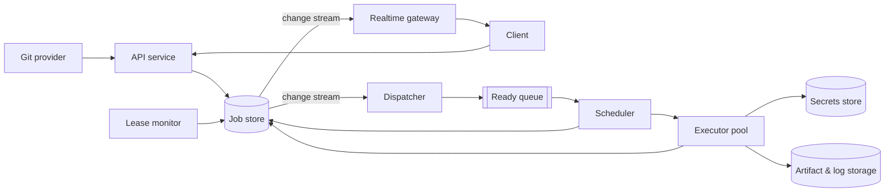

# Multi-Tenant CI/CD

[English](README.md) · [中文](README.zh.md)

<!-- meta:begin -->
| Type | Priority | Difficulty | Roles | Topics | Round |
| --- | --- | --- | --- | --- | --- |
| System design | ★★☆☆☆ | — | SWE · Infra Eng | scheduling, exactly-once, multi-tenancy | Phone screen · Onsite |
<!-- meta:end -->

## Problem

Design the backend for a multi-tenant continuous integration and deployment (CI/CD) system. Each
tenant is a customer whose git repositories are connected to the system; a push to any branch
triggers that repository's workflow, defined in a YAML file committed to the repo. A workflow is a
set of jobs with dependency edges between them — a directed acyclic graph (DAG), not necessarily a
straight line — and a job only starts once every job it depends on has succeeded. Each job runs a
user-supplied command in the container image it names, on a shared pool of *execution nodes*: an
execution node runs one job at a time, and several nodes share one physical host. Users watch a
workflow run's progress on a web UI that updates live as each job moves through its states, and can
read a job's log while it is still running.

The system must keep working through crashes: an execution node can lose power, be killed by the
underlying cluster, or become unreachable through a network partition while it keeps running. None
of this may lose a job that was accepted, or let two nodes both commit a result for the same job:
each job's result — its final status, exit code and output artifacts, which later jobs and the UI
read — is committed exactly once. Tenants must never see each other's job output or secrets, or feel
each other's load: one tenant pushing thousands of commits at once must not starve another tenant's
workflow.

The system is built on these components. The job store is a transactional relational database: the
statements of one transaction commit together or not at all, with the same effect as if transactions
ran one at a time; a conditional `UPDATE` reports how many rows it changed; `now()` reads the store's
own clock. It publishes a change stream that delivers every committed row change at least once, in
commit order; a consumer that crashes resumes from the last position it acknowledged. Logs and
artifacts go to an object store, which writes each key atomically but cannot make a write conditional
on anything in the job store. Queues and pub/sub topics take no part in job-store transactions.

Scale for this design:

- 5,000 tenants, pushing an average of 64 times a day each — 320,000 pushes/day. Each workflow
  averages 7 jobs. The combined push rate peaks at 5x its daily average, for up to two hours a day.
- A job occupies an execution node for its image pull (20 s on average, mostly served from a cache
  already on the host), its run (100 s on average), and teardown (10 s).
- An execution node sends a heartbeat every 10 seconds to renew its *lease* on the job it is running
  (the job stays assigned to it only while the lease is unexpired), and flushes a chunk of the job's
  log to storage every 2 seconds while it runs.
- Targets: a status change must reach a subscribed client within 2 s of the database write that
  caused it, and a newly flushed log chunk within 3 s of being written; a push is acknowledged (the
  workflow run and every job row created) within 500 ms at the 95th percentile; an accepted job is
  never silently lost; a job whose node stops sending heartbeats can be claimed by another node
  within 50 s of the last one.

In scope: the push-triggered trigger path; parsing a workflow's YAML into a DAG and validating it
(rejecting a cycle); scheduling jobs onto execution nodes; committing each job's result exactly once
despite node crashes and rescheduling; tenant isolation of execution, secrets, and scheduling
fairness; and pushing live status and logs to a UI. Out of scope: the workflow YAML's syntax itself
(assume it is already parsed into a DAG of jobs, each with a command, an image reference, and a set
of upstream job ids); building or publishing the container images a job runs in (assume they already
exist in a registry the execution nodes can pull from); authenticating the push webhook and the UI's
API calls (assume a signature check and a session, respectively, already resolve to a `tenant_id`);
billing.

Produce:

1. A requirements and scale estimate: arrival rates, the executor pool size implied by Little's
   law, the status/log event write rate, and log storage volume.
2. A data model (workflow run, job, the DAG's edges) and the core external and internal
   (execution-node-facing) APIs.
3. An architecture diagram and a walk-through of one push along it.
4. Deep dives into: scheduling and committing a job's result exactly once (including retries and
   steps with side effects outside the system); tenant isolation (execution environment, secrets,
   and fair scheduling across tenants); and how live status and logs reach the UI. For each,
   compare at least two alternatives, say which you would pick, and state the cost.

## Reference solution

<details>
<summary>Show the reference solution</summary>

One point worth confirming: whether every tenant needs the same isolation boundary — a customer on
dedicated capacity can take a lighter one. This design assumes the harder case, one pool shared by
tenants of unknown mutual trust.

### Requirements and scale

**Push and job rate.** 5,000 tenants pushing an average of 64 times a day give $320{,}000$ pushes/day,
$320{,}000 / 86{,}400 \approx 3.7$ pushes/sec on average. At 7 jobs per workflow that is
$2{,}240{,}000$ jobs/day, $\approx 25.9$ jobs/sec; at the 5x peak, $\approx 18.5$ pushes/sec and
$\approx 129.6$ jobs/sec.

**Executor pool.** A job holds its node for the image pull, the run and the teardown, so Little's law,
$L = \lambda \cdot W$, takes $W = 20 + 100 + 10 = 130$ s, not the 100 s runtime: $L = 129.6 \times 130 \approx 16{,}852$ jobs
running at peak (about 3,370 on average). An execution node runs one job at a time, so the pool needs at least that many; with 20%
headroom for nodes booting, draining, or failing a health check, $16{,}852 \times 1.2 \approx
20{,}222$, rounded up to **20,300 execution nodes**, which finish $20{,}300 / 130 \approx 156.2$
jobs/sec — $\approx 83\%$ utilization at peak.

**Status and log write volume.** Each job emits roughly 4 status changes (created, `queued`,
`running`, a terminal one) and a log chunk every 2 s of its run ($100 / 2 = 50$) — 54 events per job,
so $2{,}240{,}000 \times 54 \approx 1.21 \times 10^8$ events/day, $\approx 1{,}400$/sec on average and
$\approx 7{,}000$/sec at peak. Only the status changes, $\approx 520$/sec at peak, write to the job store — fewer than lease
renewals (a lease is held 120 s, so $129.6 \times 120 / 10 \approx 1{,}560$/sec at peak).

**Log storage.** Taking 80 KB of log text per job, $2{,}240{,}000$ jobs/day write $\approx 179.2$
GB/day, $\approx 2.51$ TB over 14 days of hot retention before logs move to archival storage.

### Data model and API

**Tenant** — `id`, `weight` (its plan's share of the pool), `max_running_jobs`, `running_jobs`.

**WorkflowRun** — `id`, `tenant_id`, `repo_id`, `commit_sha`, `status`
(`pending | running | succeeded | failed | cancelled`).

**Job** — `id`, `workflow_run_id`, `tenant_id`, `name`, `image`, `command`, `status` (`pending | queued | running | succeeded | failed |
cancelled`), `version` (bumped by every update of the row), `pending_deps` (count of upstream jobs not
yet succeeded), `attempt_count`, `max_attempts`, `not_before` (earliest claim time after a retry),
`cancel_requested`, `lease` (`{executor_id, lease_expires_at}`, present only while `running`),
`fencing_token` (a per-job counter, bumped at every claim, never reset), `exit_code`,
`blocked_by_job_id` (the upstream whose failure or cancellation cancelled this job).

**JobEdge** — `workflow_run_id`, `upstream_job_id`, `downstream_job_id` — the DAG's edges.

**Artifact** — `id`, `job_id`, `name`, `storage_uri`, `size_bytes`, `checksum` — a job's output files.

The DAG advances inside the transaction that ends an upstream job: when the `complete` call's
compare-and-swap, conditioned on `fencing_token` and `status = 'running'`, changes a row, the same
transaction runs, per downstream job, `UPDATE job SET pending_deps = pending_deps - 1 WHERE id = ? AND
status = 'pending'`, then `UPDATE job SET status = 'queued' WHERE id = ? AND status = 'pending' AND
pending_deps = 0`. The compare-and-swap succeeds once per job, so a resent or stale `complete`
decrements nothing, a crash mid-transaction rolls it all back, and two upstreams finishing together
serialize on the downstream row, so exactly one sees 0. A change-stream consumer doing this work
instead would replay events after a crash and count an upstream twice, unless each edge carried a flag
flipped in the decrement's transaction. A job ending `failed` or `cancelled` instead cancels, in the
same transaction, every job downstream of it still `pending`, setting `blocked_by_job_id`; the `status
= 'pending'` guards keep a cancelled job from being revived.

Core external API:

1. `POST /hooks/push` — `{repo_id, commit_sha, ref}`. Parses that commit's workflow YAML, sorts it
   topologically (`422` on a cycle), and inserts one `WorkflowRun` and one `Job` per node in one
   transaction, `pending_deps` set to each job's upstream count and jobs with none already `queued`.
   Returns `202 {run_id, status: "pending"}`.
2. `GET /runs/{run_id}` — the run's status and each job's status, `version`, attempt count and exit
   code: the snapshot the UI renders and checks live updates against.
3. `GET /runs/{run_id}/stream` — a push channel, scoped to the caller's `tenant_id`, for this run's
   status and log-chunk events.
4. `POST /runs/{run_id}/cancel` — one transaction cancels every `pending` or `queued` job and flags
   `cancel_requested` on `running` ones: the node sees the flag in its next heartbeat response and
   calls `fail` (`reason: "cancelled"`), and a flagged job whose lease lapses is cancelled, not requeued.
5. `GET /jobs/{job_id}/logs?since_offset=` — a byte range of the current attempt's log.

Internal, node-facing API — every call after `claim` carries the `fencing_token` it was issued and
gets `409` once it is stale (Deep dive: scheduling):

1. `POST /executors/{executor_id}/claim` → `{job_id, fencing_token, lease_expires_at, image, command,
   secret_refs, secrets_credential, artifact_refs}`, or `204` when nothing is ready.
2. `POST /jobs/{job_id}/heartbeat` — `{fencing_token}` → `{lease_expires_at, cancel_requested}`.
3. `POST /jobs/{job_id}/logs` — `{fencing_token, seq, chunk}` → stored in the object store under
   `logs/{job_id}/{fencing_token}/{seq}`, then announced.
4. `POST /jobs/{job_id}/complete` — `{fencing_token, exit_code, artifact_manifest}` → `succeeded` on a
   zero exit code, `failed` otherwise, advancing the DAG in the same transaction; a resend after a
   lost response gets success if the row already holds this token's result.
5. `POST /jobs/{job_id}/fail` — `{fencing_token, reason, retryable}` → the retry policy (Deep dive:
   scheduling).

### Architecture



A push reaches the API service's webhook, which writes the run and its jobs to the job store — the
only authority on a job's state — in one transaction. The dispatcher tails the store's change stream
and puts every job that turns `queued` into the ready queue, partitioned by tenant: a disposable
index, rebuilt from the store if lost, where a duplicate entry is harmless because only the claim's
compare-and-swap assigns a job. A free node asks the scheduler for work; the scheduler picks a tenant
by weighted fair queuing and claims one of its jobs, returning a fencing token, a secrets credential
and a 30-second lease (three heartbeat intervals). The node boots a microVM from the job's image,
fetches its secrets, runs the command while sending heartbeats and log chunks, uploads its artifacts
and calls `complete`. The same change stream feeds the realtime gateway, and the lease monitor scans
every 5 s for lapsed leases and requeues their jobs.

### Deep dives

**Scheduling and the exactly-once commit.** Execution is only at-least-once: a node that loses its
lease to a partition or a pause keeps running and may write a result after a second attempt took over.
What is exactly-once is the commit of each job's result — its terminal status, exit code, artifact
manifest and downstream decrements — however many attempts ran.

- *Lease timeout alone*: reassign once the lease lapses. Cheap, but a late write from the original
  attempt can still land after the new attempt's, since nothing tells a stale write from a current
  one.
- *Lease plus a fencing token on every write* (chosen): the claim's compare-and-swap (`status:
  'queued' -> 'running'`) also bumps `fencing_token`, which every later call from that attempt
  carries: its write is `UPDATE ... WHERE id = ? AND fencing_token = ? AND status = 'running'`, so a
  requeued, superseded or finished attempt gets `409` in any arrival order. The monitor's requeue is
  conditional too, `WHERE id = ? AND status = 'running' AND lease_expires_at < now()` on the store's
  clock: a renewal that commits first wins, and a heartbeat arriving after the requeue gets `409`.

The object store cannot run that check, so the log call reads the token before writing, and an
attempt fenced off in between still lands a chunk — under keys containing its own token, while the UI
shows only the log of the token in the row.

The token protects the store, not the node's process: a node that cannot reach the store stops once
its lease runs out by its own clock, one whose partition heals stops at its first `409`, and until
then two attempts can run side by side. Compiling or testing twice is harmless: only the attempt whose
`complete` commits counts. A deploy or a publish can reach the same external system from both
attempts, so the platform passes every attempt an idempotency key derived from `job_id` alone —
identical across attempts, so a system that deduplicates on it acts once — plus the `fencing_token`,
for a system that can refuse a lower token than one it has seen. Making an arbitrary shell command
idempotent is beyond the platform; it is the workflow author's job.

Retries: a retryable `fail` (an image-pull error, a failed health check) or a lapsed lease increments
`attempt_count` and requeues the job with `not_before` set by a jittered backoff (5 s, then 10 s,
±20%); the third failure (`max_attempts = 3`) ends it `failed`. A job whose node stops heartbeating is
therefore claimable again within $30 + 5 + 10 \times 1.2 = 47$ s of its last heartbeat, inside the 50
s target. A non-zero exit code is never retried: it is a correct result, not a fault.

**Tenant isolation.** The boundary has to survive a malicious job, not just a buggy one.

- *Plain containers* (namespaces and cgroups on the host kernel): fast to start and densely packed,
  but every job on a host shares that kernel, so one kernel or container-runtime escape reaches the
  other tenants' jobs on the host.
- *A microVM per job* (a Firecracker-style VM with its own guest kernel) (chosen): an escape must also
  break the hypervisor. Cost: boot time — well under a second for a minimal virtual machine monitor,
  small against the 130 s occupancy — and the memory each guest reserves for itself, so fewer jobs fit
  on a host.

Secrets (deploy keys, API tokens) are stored encrypted per tenant, never in the `Job` row or the ready
queue. The claim returns only `secret_refs` — the secrets this workflow's definition names, not the
tenant's whole vault — and a credential bound to `(job_id, fencing_token)`, which the secrets store
honors only while the job store shows that token current and the job `running`. A queued job therefore
has no credential and a stale attempt's is refused; the values live only inside that job's
microVM and vanish with it.

Fair scheduling: one global FIFO would put a tenant's burst of thousands of jobs ahead of everyone
else's. Instead each tenant has a virtual time that advances, per dispatched job, by the job's expected node-seconds (its recent average) divided by the
tenant's `weight`, and the scheduler serves the backlogged tenant
with the smallest one, kept in a heap — $O(\log \text{tenants})$ per dispatch. A tenant that becomes
backlogged again resumes at no less than the smallest virtual time among those waiting, so idle time
is not banked as credit. Fair queuing only decides who gets the *next* free node, and running jobs are
never preempted, so a tenant pushing into an idle pool could still hold all of it for as long as its
jobs run. A per-tenant cap bounds that: the claim transaction increments `running_jobs` only while it
is below `max_running_jobs`, whichever transaction takes a job out of `running` decrements it, and a
capped tenant leaves the heap until one of its jobs ends. Cost: a capped tenant's backlog waits even while nodes are idle.
Virtual times are soft state in the scheduler; losing them only resets the fairness history.

**Real-time status.**

- *Polling* `GET /runs/{run_id}`: simple, but the 2 s target needs a poll about every second per open
  run, re-reading the full snapshot whether or not anything changed.
- *Push over a live connection* (chosen): a relay tails the job store's change stream and publishes
  each job change, `{run_id, job_id, version, status}`, to a pub/sub topic keyed by `run_id`; the
  gateway instance holding a client's `GET /runs/{run_id}/stream` connection subscribes and forwards
  it. Coming from the committed change rather than from the writer, the event survives a writer
  crashing right after its commit. A log chunk is announced as `{job_id, fencing_token, seq}` by the
  API that stored it, and the client fetches the bytes itself.

Delivery can still drop across a gateway restart or a reconnect, and can repeat or reorder, so the
client never relies on it alone: on connect and reconnect it subscribes first, then calls `GET
/runs/{run_id}`, and applies an event only if its `version` is newer than the one it holds for that
job — a raced, duplicate or late event never moves the view backwards. With a critical path of three jobs (≈390 s per run),
$18.5 \times 390 \approx 7{,}200$ runs are active at peak: even a viewer on each is only 7,200 mostly idle
connections, and stateless gateways need no pinning, since any instance can subscribe to any topic.

### Follow-ups

- A build cache is an object keyed by the tenant plus a hash of its inputs (lockfile checksum, image
  digest, the step's command), read before a job runs and written back on a miss. Concurrent writers
  need no coordination, since a key is written atomically and either copy is valid; the tenant prefix
  keeps one tenant from reading or poisoning another's.
- A key can also skip a step instead of restoring its inputs: a unit-test job whose command, image
  digest and source tree hash to an earlier run's may report that run's result, which turns anything
  the key omits — a system package, a network response — from a slow rebuild into a wrong pass.
  Where the cache lives is the other trade-off: on the node's own disk a hit costs nothing but
  serves only the jobs that land there, so the scheduler can prefer, never require, a node that
  recently ran the same repo, while an object-store cache serves every node through a download a
  130-second job may not earn back.
- To pass artifacts between jobs, each attempt uploads under a key containing its `fencing_token`, so
  it never overwrites the winner's; downstream jobs read only the `Artifact` rows the winning
  `complete` committed, by `(workflow_run_id, job_id)`, never another run's.

<details>
<summary>Estimate and crash-interleaving check (runnable)</summary>

```python
pushes_per_day = 5_000 * 64                               # tenants x pushes per tenant per day
jobs_per_day = pushes_per_day * 7
peak_factor, peak_hours = 5, 2
assert (pushes_per_day, jobs_per_day) == (320_000, 2_240_000) and peak_factor * peak_hours <= 24
push_rate, job_rate = pushes_per_day / 86_400, jobs_per_day / 86_400
peak_push, peak_job = push_rate * peak_factor, job_rate * peak_factor
assert [round(x, 1) for x in (push_rate, peak_push, job_rate, peak_job)] == [3.7, 18.5, 25.9, 129.6]

pull_s, run_s, teardown_s = 20, 100, 10
W = pull_s + run_s + teardown_s                           # the node is busy for all three, not just the run
assert (round(job_rate * W), round(peak_job * W), round(peak_job * W * 1.2)) == (3_370, 16_852, 20_222)
pool = 20_300                                             # Little's law plus 20% headroom, rounded up
assert (round(pool / W, 1), round(peak_job / (pool / W), 2)) == (156.2, 0.83)

events_per_day = jobs_per_day * (4 + run_s // 2)          # 4 status changes + a log chunk every 2 s
assert (events_per_day, events_per_day / 86_400, events_per_day / 86_400 * peak_factor) == (120_960_000, 1_400, 7_000)
# job-store writes at peak: status changes, and heartbeats for leases held from claim to complete
assert (round(peak_job * 4, -1), round(peak_job * (pull_s + run_s) / 10, -1)) == (520, 1_560)

log_gb_per_day = jobs_per_day * 80 / 1e6                  # 80 KB of log text per job
assert round(log_gb_per_day, 1) == 179.2 and round(log_gb_per_day * 14 / 1e3, 2) == 2.51
assert round(peak_push * 3 * W, -2) == 7_200              # active runs: a critical path of three jobs
assert 30 + 5 + 10 * 1.2 == 47 <= 50                      # lease + monitor scan + largest backoff with jitter
print("all requirements-and-scale numbers check out")
```

```python
from collections import Counter, namedtuple

# --- crash and interleaving model: one run in which U1 and U2 both feed D ---
# Each job-store transaction, read and object-store write is one atomic step. Searched: all interleavings
# of claims, heartbeats, a lease lapsing at any moment, the monitor's scan and later requeue, log chunks
# (token check, then a separate write), complete (resent after a lost response), a retryable fail, a user
# cancel, and a node dying or acting late at any step. Left out: backoff timing, the tenant cap, and the
# ready queue (only the claim's compare-and-swap on the row assigns a job).
U, D, END = (0, 1), 2, ("succeeded", "failed", "cancelled")
Row = namedtuple("Row", "status deps tries tok expired by renewed cancel")
World = namedtuple("World", "rows atts scan stream disp crash edges logs cancelled spurious")

def put(rows, j, **kw):
    return rows[:j] + (rows[j]._replace(**kw),) + rows[j + 1:]

def finish(w, j, status, by, bug):            # one transaction: j ends and the DAG advances with it
    rows, label, d = put(w.rows, j, status=status, by=by, expired=False, renewed=0, cancel=False), "", w.rows[D]
    if j == D:
        pass
    elif bug.startswith("cdc"):               # alternative: a change-stream consumer advances it later
        w = w._replace(stream=w.stream + ((j, status),))
    elif status != "succeeded":
        if d.status == "pending":
            rows, label = put(rows, D, status="cancelled"), "cascade"
    elif d.status == "pending" or bug == "no_pending_guard":
        q = d.deps == 1                       # NOTE: decrement and enqueue both WHERE status = 'pending'
        rows, label = put(rows, D, deps=d.deps - 1, status="queued" if q else d.status), "fan-in" * q
    return label, w._replace(rows=rows)

def retry(w, j, bug):                         # a lapsed lease or a retryable fail: one transaction
    r = w.rows[j]
    w = w._replace(rows=put(w.rows, j, tries=r.tries + 1))
    if (r.cancel and bug != "retry_ignores_cancel") or r.tries + 1 >= TRIES[j]:
        return finish(w, j, "cancelled" if r.cancel else "failed", r.tok, bug)
    return "requeue", w._replace(rows=put(w.rows, j, status="queued", expired=False, renewed=0, cancel=False))

def moves(w, bug):
    out = []
    for j, r in enumerate(w.rows):
        if r.status == "queued":              # claim: WHERE status = 'queued', token + 1
            logs = frozenset(c for c in w.logs if c[0] != j) if bug == "log_per_job" else w.logs
            out.append(("reclaim" * (r.tok > 0), w._replace(
                rows=put(w.rows, j, status="running", tok=r.tok + 1, expired=False, renewed=r.tok + 1),
                atts=w.atts | {(j, r.tok + 1, "run")}, logs=logs)))
        if r.status == "running":             # the lease lapses (partition, pause); the scan sees it
            out.append(("", w._replace(rows=put(w.rows, j, expired=True))))
            if r.expired and w.scan is None:
                out.append(("", w._replace(scan=j)))
    if w.scan is not None:                    # requeue: WHERE status = 'running' AND lease_expires_at < now()
        r = w.rows[w.scan]
        if r.status == "running" and (r.expired or bug == "monitor_trusts_scan"):
            out.append(retry(w._replace(scan=None, spurious=w.spurious or not r.expired), w.scan, bug))
        else:
            out.append(("renewal won" * (r.status == "running"), w._replace(scan=None)))

    for a in sorted(w.atts):                  # a fixed order, whatever the hash seed
        (j, t, phase), r, rest = a, w.rows[a[0]], w.atts - {a}
        live = r.tok == t and r.status == "running"   # WHERE fencing_token = ? AND status = 'running'
        out.append(("", w._replace(atts=rest)))       # the node dies here
        if phase == "run":
            if live or (bug == "heartbeat_no_token" and r.status == "running"):
                out.append(("cancel seen" * r.cancel, w._replace(rows=put(w.rows, j, expired=False, renewed=t),
                                                                 atts=rest | {(j, t, "cancel" if r.cancel else "run")})))
            else:
                out.append(("stale heartbeat", w._replace(atts=rest)))
            out.append(("" if live else "stale log", w._replace(atts=rest | {(j, t, "log")} if live else rest)))
            if live or (bug == "complete_no_token" and r.status == "running"):
                for o in ("succeeded", "failed"):
                    out.append(finish(w._replace(atts=rest | {(j, t, "sent " + o)}), j, o, t, bug))
            else:
                out.append(("stale complete", w._replace(atts=rest)))
            if live:
                out.append(retry(w._replace(atts=rest), j, bug))
        elif phase == "log":                  # NOTE: the object store cannot check the token
            key = None if bug == "log_per_job" else t
            out.append(("late chunk" * (r.tok != t), w._replace(atts=rest | {(j, t, "run")}, logs=w.logs | {(j, key, t)})))
        elif phase == "cancel" and live:      # it saw cancel_requested: fail(reason="cancelled")
            out.append(finish(w._replace(atts=rest), j, "cancelled", t, bug))
        elif phase == "sent succeeded" and bug == "decrement_every_call" and j != D:
            out.append(finish(w._replace(atts=rest), j, "succeeded", t, bug))
        elif phase.startswith("sent"):        # the resend's compare-and-swap matches no row
            out.append(("resend no-op", w._replace(atts=rest)))

    if w.cancelled is None:                   # user cancel: one transaction over the run's jobs
        out.append(("", w._replace(cancelled=True, rows=tuple(
            r._replace(status="cancelled") if r.status in ("pending", "queued") else
            r._replace(cancel=r.status == "running") for r in w.rows))))

    if w.stream:                              # the consumer of the cdc_* alternatives
        (u, status), d = w.stream[0], w.rows[D]
        if w.crash and w.disp != "A":
            out.append(("crash", w._replace(disp="A", crash=0)))
        if w.disp == "A":                     # transaction 1: flip the edge flag and decrement, or cascade
            if d.status == "pending" and status != "succeeded":
                d = d._replace(status="cancelled")
            elif d.status == "pending" and (u not in w.edges or bug == "cdc_replay"):
                d = d._replace(deps=d.deps - 1)
            out.append(("replay" * (u in w.edges), w._replace(rows=w.rows[:D] + (d,), disp="B", edges=w.edges | {u})))
        elif w.disp == "B":                   # transaction 2: the conditional enqueue
            q = d.status == "pending" and d.deps == 0
            out.append(("", w._replace(rows=put(w.rows, D, status="queued") if q else w.rows, disp="C")))
        else:                                 # acknowledge the event
            out.append(("", w._replace(stream=w.stream[1:], disp="A")))
    return out

def violation(w, bug):
    rows, ok = w.rows, sum(w.rows[u].status == "succeeded" for u in U)
    return next((msg for bad, msg in (
        (rows[D].status not in ("pending", "cancelled") and ok < 2, "D started before both upstreams succeeded"),
        (rows[D].status == "pending" and rows[D].deps < 2 - ok, "pending_deps counted an upstream twice"),
        (any(r.status in END and r.by not in (0, r.tok) for r in rows), "a stale attempt's result was committed"),
        (any(r.status == "running" and r.renewed != r.tok for r in rows), "a stale attempt renewed the lease"),
        (w.spurious, "a just-renewed lease was requeued"),
        (w.cancelled is True and any(r.status == "queued" for r in rows), "a cancelled run queued a job"),
        (any(k == (None if bug == "log_per_job" else rows[j].tok) != t for j, k, t in w.logs),
         "the current log shows a stale chunk")) if bad), None)

def search(bug="", tries=(2, 1, 1)):          # U1 can run twice, so it can have a fenced-off attempt
    global TRIES
    TRIES = tries
    q = Row("queued", 0, 0, 0, False, 0, 0, False)
    rows = (q, q, q._replace(status="pending", deps=2))
    seen, labels = set(), Counter()           # a run the user may cancel (None), and one never cancelled
    stack = [World(rows, frozenset(), None, (), "A", 1, frozenset(), frozenset(), c, False) for c in (None, False)]
    while stack:
        w = stack.pop()
        if w in seen:
            continue
        seen.add(w)
        nxt, v = moves(w, bug), violation(w, bug)
        if v or (not nxt and any(r.status not in END for r in w.rows)):
            return v or "a job was lost"      # nothing can move, yet a job has not ended
        labels["end"] += not nxt
        for label, n in nxt:
            if any(p.status in END and p.status != q.status for p, q in zip(w.rows, n.rows)):
                return "a terminal job changed state"
            labels[label] += 1
            stack.append(n)
    return len(seen), labels

n, labels = search()
assert all(labels[x] for x in ("reclaim", "stale heartbeat", "stale log", "late chunk", "stale complete",
                               "renewal won", "requeue", "cancel seen", "resend no-op", "cascade", "fan-in",
                               "end")), labels
print(f"chosen design: {n} states, {labels['end']} end states, no violation")
n, labels = search("cdc_edge_flag", tries=(1, 1, 1))
assert labels["crash"] and labels["replay"], labels
print(f"change-stream consumer with a per-edge flag: {n} states, no violation")

for bug in ("cdc_replay", "decrement_every_call", "no_pending_guard", "complete_no_token", "heartbeat_no_token",
            "monitor_trusts_scan", "retry_ignores_cancel", "log_per_job"):
    found = search(bug)
    assert isinstance(found, str), bug        # every broken variant is caught
    print(f"{bug:22} -> {found}")
```

</details>

</details>
