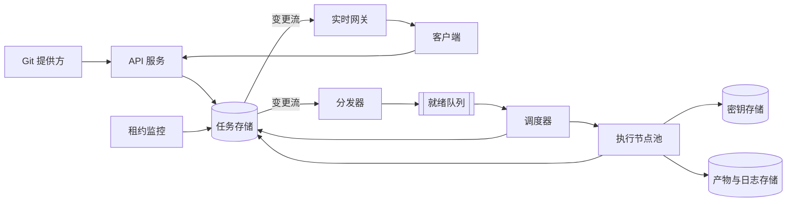

# 多租户 CI/CD

[English](README.md) · [中文](README.zh.md)

<!-- meta:begin -->
| 题型 | 优先级 | 难度 | 岗位 | 考点 | 轮次 |
| --- | --- | --- | --- | --- | --- |
| 系统设计 | ★★☆☆☆ | — | SWE · Infra Eng | scheduling, exactly-once, multi-tenancy | 电话面 · 现场面 |
<!-- meta:end -->

## 题目

设计一个多租户的持续集成与持续交付（CI/CD）系统的后端。每个租户是一个已经把自己的 git 仓库接入系统的客户；向任意分支的一次推送都会触发该仓库的工作流（workflow），工作流定义在提交到仓库里的一个 YAML 文件中。一个工作流是一组带依赖边的 job——一个有向无环图（DAG，directed acyclic graph），不一定是一条直线——一个 job 只有在它依赖的每个 job 都成功之后才会开始。每个 job 在它指定的容器镜像里运行用户提供的命令，运行在一个共享的*执行节点*（execution node）池上：一个执行节点同一时刻只运行一个 job，几个执行节点共用一台物理主机。用户在网页界面上实时查看一次工作流运行的进度，界面随每个 job 状态的变化而更新，并且能在 job 仍在运行时读取它的日志。

系统必须在崩溃中继续工作：执行节点可能断电、被底层集群杀死，或者因为网络分区而不可达、自己却仍在运行。无论发生哪种情况，都不能丢失一个已经被接受的 job，也不能让两个节点都为同一个 job 提交结果：每个 job 的结果——最终状态、退出码和输出产物，也就是后续 job 和界面读到的东西——恰好提交一次。租户之间绝不能看到彼此的 job 输出或密钥，也不能感受到对方的负载：一个租户一次推送几千个提交，不能让另一个租户的工作流被饿死。

系统建立在下面这些组件之上。任务存储（job store）是一个事务型关系数据库：一个事务里的语句要么全部提交、要么全部不提交，效果与事务逐个执行相同；条件 `UPDATE` 会报告它改了多少行；`now()` 读的是存储自己的时钟。它对外发布一条变更流（change stream），把每一次已提交的行变更按提交顺序至少投递一次；消费者崩溃后，从它最后确认的位置继续。日志和产物写进对象存储：对单个键的写入是原子的，但无法让一次写入以任务存储里的任何内容为条件。队列和发布/订阅主题都不参与任务存储的事务。

这次设计的规模：

- 5,000 个租户，平均每个租户每天推送 64 次——每天 320,000 次推送。每个工作流平均 7 个 job。全体推送速率的峰值是日均值的 5 倍，每天最多持续两小时。
- 一个 job 占用执行节点的时间包括：拉取镜像（平均 20 秒，大多数命中主机上已有的缓存）、运行（平均 100 秒）、清理（10 秒）。
- 执行节点每 10 秒发一次心跳，续订它对正在运行的 job 的*租约*（lease）（只有租约未过期，这个 job 才归它）；运行期间每 2 秒把一段日志刷新到存储。
- 目标：状态变化必须在引发它的数据库写入后 2 秒内到达已订阅的客户端，新刷新的日志片段必须在写入后 3 秒内到达；一次推送必须在 500 毫秒内（P95）被确认（工作流运行记录和每个 job 记录都已创建）；已被接受的 job 绝不会被默默丢失；节点停止发心跳后，它的 job 在最后一次心跳后 50 秒内可以被另一个节点领取。

范围内：推送触发的入口路径；把工作流的 YAML 解析成 DAG 并校验它（拒绝有环的图）；把 job 调度到执行节点上；在节点崩溃与重新调度下让每个 job 的结果恰好提交一次；执行环境、密钥、调度公平性三方面的租户隔离；把实时状态和日志推送到界面。范围外：工作流 YAML 本身的语法（假设它已经被解析成一个 job 的 DAG，每个 job 带命令、镜像引用和一组上游 job id）；构建或发布 job 运行所用的容器镜像（假设它们已经存在于执行节点可以拉取的镜像仓库里）；对推送 webhook 和界面 API 调用的身份验证（假设签名校验和会话分别已经解析出一个 `tenant_id`）；计费。

要产出：

1. 需求与规模估算：到达速率、由 Little 定律推出的执行节点池大小、状态/日志事件的写入速率，以及日志存储量。
2. 数据模型（工作流运行、job、DAG 的边）和核心的对外接口与对内（面向执行节点）接口。
3. 一张架构图，并沿着一次推送把它走一遍。
4. 深入话题：job 调度与结果的恰好一次提交（包括重试，以及有系统外部副作用的步骤）；租户隔离（执行环境、密钥、跨租户的公平调度）；实时状态和日志如何到达界面。每个话题至少比较两种方案，说明你会选哪个，并给出代价。

## 参考解答

<details>
<summary>展开参考解答</summary>

有一点值得先确认：是否每个租户都需要同样的隔离边界——使用专属容量的客户可以用轻一些的边界。这里假设更难的情形：一个池由互不信任的租户共享。

### 需求与规模

**推送与 job 速率。** 5,000 个租户，每个平均每天推送 64 次，共 $320{,}000$ 次推送，平均 $320{,}000 / 86{,}400 \approx 3.7$ 次/秒。按每个工作流 7 个 job 算，每天 $2{,}240{,}000$ 个 job，约 $25.9$ 个/秒；按 5 倍峰值，约 $18.5$ 次推送/秒、$129.6$ 个 job/秒。

**执行节点池。** job 在拉镜像、运行和清理期间都占着节点，所以 Little 定律 $L = \lambda \cdot W$ 里取 $W = 20 + 100 + 10 = 130$ 秒，而不是 100 秒的运行时长：峰值时 $L = 129.6 \times 130 \approx 16{,}852$ 个 job 同时在跑（平均约 3,370 个）。一个执行节点同一时刻只跑一个 job，池里至少要有这么多节点；再留 20% 余量给正在启动、排空或健康检查失败的节点，$16{,}852 \times 1.2 \approx 20{,}222$，向上取整为 **20,300 个执行节点**，每秒能完成 $20{,}300 / 130 \approx 156.2$ 个 job，峰值利用率约 $83\%$。

**状态与日志的写入量。** 每个 job 约有 4 次状态变化（创建、`queued`、`running`、一个终止状态），运行期间每 2 秒一段日志（$100 / 2 = 50$ 段），每个 job 共 54 个事件；每天 $2{,}240{,}000 \times 54 \approx 1.21 \times 10^8$ 个，平均约 $1{,}400$ 个/秒，峰值约 $7{,}000$ 个/秒。其中写任务存储的只有状态变化，峰值约 $520$ 次/秒，比心跳的续约还少（租约持有 120 秒，峰值约 $129.6 \times 120 / 10 \approx 1{,}560$ 次/秒）。

**日志存储。** 按每个 job 80 KB 日志文本算，每天 $2{,}240{,}000$ 个 job 写入约 $179.2$ GB；热存储保留 14 天约 $2.51$ TB，之后转入归档存储。

### 数据模型与 API

**Tenant（租户）** —— `id`、`weight`（套餐对应的池份额）、`max_running_jobs`、`running_jobs`。

**WorkflowRun** —— `id`、`tenant_id`、`repo_id`、`commit_sha`、`status`（`pending | running | succeeded | failed | cancelled`）。

**Job** —— `id`、`workflow_run_id`、`tenant_id`、`name`、`image`、`command`、`status`（`pending | queued | running | succeeded | failed | cancelled`）、`version`（这一行每次更新都加一）、`pending_deps`（尚未成功的上游 job 数）、`attempt_count`、`max_attempts`、`not_before`（重试后最早可被领取的时刻）、`cancel_requested`、`lease`（`{executor_id, lease_expires_at}`，只在 `running` 时存在）、`fencing_token`（每个 job 一个计数器，每次领取加一，从不重置）、`exit_code`、`blocked_by_job_id`（因哪个上游失败或取消而被取消）。

**JobEdge** —— `workflow_run_id`、`upstream_job_id`、`downstream_job_id`——DAG 的边。

**Artifact（产物）** —— `id`、`job_id`、`name`、`storage_uri`、`size_bytes`、`checksum`——一个 job 的输出文件。

DAG 在结束上游 job 的那个事务里推进：`complete` 调用以 `fencing_token` 和 `status = 'running'` 为条件做比较后交换（compare-and-swap），改到一行时，同一事务对每个下游 job 先执行 `UPDATE job SET pending_deps = pending_deps - 1 WHERE id = ? AND status = 'pending'`，再执行 `UPDATE job SET status = 'queued' WHERE id = ? AND status = 'pending' AND pending_deps = 0`。比较后交换对每个 job 只成功一次，所以重发的或令牌已失效的 `complete` 不会递减计数，事务中途崩溃会整体回滚，两个上游同时完成则在下游那一行上串行化，只有一个看到 0。改由变更流的消费者来做，它崩溃后重放事件就会把同一个上游算两次，除非每条边带一个与递减同事务翻转的标志位。以 `failed` 或 `cancelled` 结束的 job 则在同一事务里取消它下游所有仍处于 `pending` 的 job，并设置 `blocked_by_job_id`；`status = 'pending'` 这个条件保证已取消的 job 不会被复活。

核心对外接口：

1. `POST /hooks/push` —— `{repo_id, commit_sha, ref}`。取出该提交的工作流 YAML 做拓扑排序（有环返回 `422`），在一个事务里插入 `WorkflowRun` 和每个节点的 `Job`，`pending_deps` 设为上游数，没有上游的直接 `queued`。返回 `202 {run_id, status: "pending"}`。
2. `GET /runs/{run_id}` —— 运行状态，以及每个 job 的状态、`version`、尝试次数和退出码，供界面渲染快照、核对更新。
3. `GET /runs/{run_id}/stream` —— 限定在调用者 `tenant_id` 范围内的推送通道，转发这次运行的状态事件和日志片段事件。
4. `POST /runs/{run_id}/cancel` —— 一个事务取消所有 `pending` 或 `queued` 的 job，给 `running` 的设置 `cancel_requested`：节点在下一次心跳响应里看到它就调用 `fail`（`reason: "cancelled"`），带标志的 job 租约过期时直接取消、不再入队。
5. `GET /jobs/{job_id}/logs?since_offset=` —— 当前这次尝试的日志中的一段字节区间。

对内、面向执行节点的接口——`claim` 之后的调用都带着领取时拿到的 `fencing_token`，过期则得到 `409`（深入话题：调度）：

1. `POST /executors/{executor_id}/claim` → `{job_id, fencing_token, lease_expires_at, image, command, secret_refs, secrets_credential, artifact_refs}`，无可领取 job 则返回 `204`。
2. `POST /jobs/{job_id}/heartbeat` —— `{fencing_token}` → `{lease_expires_at, cancel_requested}`。
3. `POST /jobs/{job_id}/logs` —— `{fencing_token, seq, chunk}` → 存到对象存储的 `logs/{job_id}/{fencing_token}/{seq}`，并发布通知。
4. `POST /jobs/{job_id}/complete` —— `{fencing_token, exit_code, artifact_manifest}` → 退出码为 0 则 `succeeded`，否则 `failed`，并在同一事务里推进 DAG；响应丢失后重发时，如果这一行已经记着这个令牌的结果，就返回成功。
5. `POST /jobs/{job_id}/fail` —— `{fencing_token, reason, retryable}` → 套用重试策略（深入话题：调度）。

### 架构



一次推送打到 API 服务的 webhook，它在一个事务里把这次运行和它的 job 写入任务存储——job 状态唯一的权威来源。分发器跟随变更流，把每个变成 `queued` 的 job 放进按租户分区的就绪队列：它只是个可丢弃、可从存储重建的索引，重复条目也无害，因为只有领取时的比较后交换才分配 job。空闲节点向调度器要活，调度器按加权公平队列（weighted fair queuing）选出租户并领取它的一个 job，交回隔离令牌（fencing token）、一份密钥凭证和一份 30 秒的租约（三个心跳间隔）。节点从 job 的镜像启动一个微虚拟机（microVM），取回密钥，运行命令，同时发心跳和日志片段，上传产物，然后调用 `complete`。同一条变更流也送往实时网关；租约监控每 5 秒扫描一次过期的租约，把对应的 job 重新入队。

### 深入话题

**调度与结果的恰好一次提交。** 执行本身只能做到至少一次：因网络分区或停顿而失去租约的节点仍在运行，可能在第二次尝试接手之后写入结果。做到恰好一次的是每个 job 结果的提交——终止状态、退出码、产物清单和对下游的递减——无论跑了几次尝试。

- *只靠租约超时*：租约一过期就重新分配。便宜，但原尝试的迟到写入仍可能晚于新尝试落地，因为没有东西能区分过期写入和当前写入。
- *租约加上每次写入都带隔离令牌*（选用）：领取时的比较后交换（`status: 'queued' -> 'running'`）同时把 `fencing_token` 加一，这次尝试之后的每次调用都带着它，写入语句是 `UPDATE ... WHERE id = ? AND fencing_token = ? AND status = 'running'`，已被重新入队、取代或结束的尝试，调用无论何时到达都得到 `409`。租约监控的重新入队也是条件更新：`WHERE id = ? AND status = 'running' AND lease_expires_at < now()`，用的是存储的时钟；先提交的续约获胜，重新入队之后才到的心跳得到 `409`。

对象存储做不了这个检查，日志调用只能先读令牌、再写入，两步之间令牌失效的尝试仍会写进一段日志——但它落在含有自己令牌的键下，而界面只显示行里那个令牌的日志。

令牌保护的是存储，不是节点上的进程：连不上存储的节点按自己的时钟等租约耗尽后停下，分区恢复的节点收到第一个 `409` 时停下，在此之前两次尝试可能同时在跑。编译或测试跑两次无害，只有 `complete` 提交成功的那次算数；部署或发布却可能让两次尝试都调用同一个外部系统。平台给每次尝试传一个只由 `job_id` 派生的幂等键（idempotency key），各次尝试相同，按它去重的外部系统只执行一次；再附上 `fencing_token`，供能拒绝较小令牌的系统使用。任意 shell 命令的幂等性平台保证不了，那是工作流作者的事。

重试：可重试的 `fail`（拉镜像出错、健康检查失败）或租约过期，都让 `attempt_count` 加一并把 job 重新入队，`not_before` 按带抖动的退避设定（先 5 秒、再 10 秒，±20%）；第三次失败（`max_attempts = 3`）以 `failed` 结束。节点停止心跳后，job 最迟在 $30 + 5 + 10 \times 1.2 = 47$ 秒后可再被领取，满足 50 秒的目标。job 命令自身返回的非零退出码不会重试：这是正确结果，不是故障。

**租户隔离。** 隔离边界要能扛住恶意 job，而不只是有 bug 的 job。

- *普通容器*（宿主机内核上的命名空间与 cgroups）：启动快、密度高，但同一台主机上的 job 共用这个内核，一个内核或容器运行时的逃逸漏洞就能波及主机上其他租户的 job。
- *每个 job 一个微虚拟机*（类似 Firecracker、带自己客户机内核的虚拟机）（选用）：逃逸还得再攻破虚拟化层（hypervisor）。代价：启动时间——精简的虚拟机监控器不到一秒，相对 130 秒的占用很小——以及每个客户机为自己预留的内存，一台主机能放的 job 更少。

密钥（部署密钥、API 令牌）按租户加密存放，不进 `Job` 记录和就绪队列。领取只返回 `secret_refs`——这个工作流的定义里点名的密钥，而不是租户的整个密钥库——以及一份绑定 `(job_id, fencing_token)` 的凭证；只有当任务存储显示这个令牌仍是当前令牌、job 仍在 `running` 时，密钥存储才认这份凭证。因此排队中的 job 拿不到凭证，令牌失效的尝试所持的凭证会被拒绝；密钥的值只存在于这个 job 的微虚拟机里，随它一起销毁。

公平调度：全局 FIFO 会让一个租户突发的几千个 job 排在所有人前面，所以改用加权公平队列：每个租户有一个虚拟时间，每分发它一个 job 就加上该 job 的预计节点秒数（取它最近几次运行的平均）除以租户的 `weight`；调度器总是服务有积压的租户中虚拟时间最小的那个，用堆维护，每次分发 $O(\log \text{租户数})$。租户重新有积压时，虚拟时间不低于正在等待者中的最小值，空闲不会攒成额度。公平队列只决定*下一个*空闲节点给谁，而运行中的 job 不被抢占，所以一个租户在池空闲时推送，仍可能占满整个池直到它的 job 跑完。每租户并发上限限制了这一点：领取事务只在 `running_jobs` 低于 `max_running_jobs` 时给它加一，把 job 移出 `running` 的事务给它减一，达到上限的租户离开堆，直到它有 job 结束。代价：达到上限的租户即使遇上空闲节点，积压也只能等着。虚拟时间是调度器内存里的软状态，丢了只会重置公平性的历史。

**实时状态。**

- *轮询* `GET /runs/{run_id}`：简单，但为了 2 秒目标，每个打开的运行约每秒轮询一次，没有变化也要重读完整快照。
- *通过长连接推送*（选用）：一个中继跟随任务存储的变更流，把每次 job 变化 `{run_id, job_id, version, status}` 发布到以 `run_id` 为键的发布/订阅（pub/sub）主题；持有客户端 `GET /runs/{run_id}/stream` 连接的网关实例订阅并转发。事件取自已提交的变更而不是写入方，写入方提交后立刻崩溃也不会丢。日志片段由存下它的 API 以 `{job_id, fencing_token, seq}` 的形式通知，客户端自己去取内容。

投递仍可能在网关重启或重连时丢失，也可能重复或乱序，所以客户端不只依赖推送：连接和重连时先订阅，再调用 `GET /runs/{run_id}`，只应用 `version` 比手里更新的事件——与快照赛跑的、重复的或迟到的事件都不会让视图倒退。按关键路径三个 job（约 390 秒）算，峰值时约有 $18.5 \times 390 \approx 7{,}200$ 次运行在进行，每次都有人看也只是 7,200 条多半空闲的连接；网关无状态，任何实例都能订阅任何主题，无需粘连。

### 追问

- 构建缓存是一个对象，键为租户加上输入的哈希（锁文件校验和、镜像摘要、这一步的命令），job 运行前读取，未命中就写回。并发写同一个键无需协调：单键写入是原子的，两份都有效；租户前缀让租户之间读不到、也污染不了彼此的缓存。
- 在 job 之间传递产物时，每次尝试上传到含有自己 `fencing_token` 的键下，不会覆盖赢家的产物；下游只读赢家的 `complete` 提交的 `Artifact` 记录，按 `(workflow_run_id, job_id)` 定位，读不到别的运行的产物。

<details>
<summary>估算与崩溃交错核对（可运行）</summary>

```python
pushes_per_day = 5_000 * 64                               # tenants x pushes per tenant per day
jobs_per_day = pushes_per_day * 7
peak_factor, peak_hours = 5, 2
assert (pushes_per_day, jobs_per_day) == (320_000, 2_240_000) and peak_factor * peak_hours <= 24
push_rate, job_rate = pushes_per_day / 86_400, jobs_per_day / 86_400
peak_push, peak_job = push_rate * peak_factor, job_rate * peak_factor
assert [round(x, 1) for x in (push_rate, peak_push, job_rate, peak_job)] == [3.7, 18.5, 25.9, 129.6]

pull_s, run_s, teardown_s = 20, 100, 10
W = pull_s + run_s + teardown_s                           # the node is busy for all three, not just the run
assert (round(job_rate * W), round(peak_job * W), round(peak_job * W * 1.2)) == (3_370, 16_852, 20_222)
pool = 20_300                                             # Little's law plus 20% headroom, rounded up
assert (round(pool / W, 1), round(peak_job / (pool / W), 2)) == (156.2, 0.83)

events_per_day = jobs_per_day * (4 + run_s // 2)          # 4 status changes + a log chunk every 2 s
assert (events_per_day, events_per_day / 86_400, events_per_day / 86_400 * peak_factor) == (120_960_000, 1_400, 7_000)
# job-store writes at peak: status changes, and heartbeats for leases held from claim to complete
assert (round(peak_job * 4, -1), round(peak_job * (pull_s + run_s) / 10, -1)) == (520, 1_560)

log_gb_per_day = jobs_per_day * 80 / 1e6                  # 80 KB of log text per job
assert round(log_gb_per_day, 1) == 179.2 and round(log_gb_per_day * 14 / 1e3, 2) == 2.51
assert round(peak_push * 3 * W, -2) == 7_200              # active runs: a critical path of three jobs
assert 30 + 5 + 10 * 1.2 == 47 <= 50                      # lease + monitor scan + largest backoff with jitter
print("all requirements-and-scale numbers check out")
```

```python
from collections import Counter, namedtuple

# --- crash and interleaving model: one run in which U1 and U2 both feed D ---
# Each job-store transaction, read and object-store write is one atomic step. Searched: all interleavings
# of claims, heartbeats, a lease lapsing at any moment, the monitor's scan and later requeue, log chunks
# (token check, then a separate write), complete (resent after a lost response), a retryable fail, a user
# cancel, and a node dying or acting late at any step. Left out: backoff timing, the tenant cap, and the
# ready queue (only the claim's compare-and-swap on the row assigns a job).
U, D, END = (0, 1), 2, ("succeeded", "failed", "cancelled")
Row = namedtuple("Row", "status deps tries tok expired by renewed cancel")
World = namedtuple("World", "rows atts scan stream disp crash edges logs cancelled spurious")

def put(rows, j, **kw):
    return rows[:j] + (rows[j]._replace(**kw),) + rows[j + 1:]

def finish(w, j, status, by, bug):            # one transaction: j ends and the DAG advances with it
    rows, label, d = put(w.rows, j, status=status, by=by, expired=False, renewed=0, cancel=False), "", w.rows[D]
    if j == D:
        pass
    elif bug.startswith("cdc"):               # alternative: a change-stream consumer advances it later
        w = w._replace(stream=w.stream + ((j, status),))
    elif status != "succeeded":
        if d.status == "pending":
            rows, label = put(rows, D, status="cancelled"), "cascade"
    elif d.status == "pending" or bug == "no_pending_guard":
        q = d.deps == 1                       # NOTE: decrement and enqueue both WHERE status = 'pending'
        rows, label = put(rows, D, deps=d.deps - 1, status="queued" if q else d.status), "fan-in" * q
    return label, w._replace(rows=rows)

def retry(w, j, bug):                         # a lapsed lease or a retryable fail: one transaction
    r = w.rows[j]
    w = w._replace(rows=put(w.rows, j, tries=r.tries + 1))
    if (r.cancel and bug != "retry_ignores_cancel") or r.tries + 1 >= TRIES[j]:
        return finish(w, j, "cancelled" if r.cancel else "failed", r.tok, bug)
    return "requeue", w._replace(rows=put(w.rows, j, status="queued", expired=False, renewed=0, cancel=False))

def moves(w, bug):
    out = []
    for j, r in enumerate(w.rows):
        if r.status == "queued":              # claim: WHERE status = 'queued', token + 1
            logs = frozenset(c for c in w.logs if c[0] != j) if bug == "log_per_job" else w.logs
            out.append(("reclaim" * (r.tok > 0), w._replace(
                rows=put(w.rows, j, status="running", tok=r.tok + 1, expired=False, renewed=r.tok + 1),
                atts=w.atts | {(j, r.tok + 1, "run")}, logs=logs)))
        if r.status == "running":             # the lease lapses (partition, pause); the scan sees it
            out.append(("", w._replace(rows=put(w.rows, j, expired=True))))
            if r.expired and w.scan is None:
                out.append(("", w._replace(scan=j)))
    if w.scan is not None:                    # requeue: WHERE status = 'running' AND lease_expires_at < now()
        r = w.rows[w.scan]
        if r.status == "running" and (r.expired or bug == "monitor_trusts_scan"):
            out.append(retry(w._replace(scan=None, spurious=w.spurious or not r.expired), w.scan, bug))
        else:
            out.append(("renewal won" * (r.status == "running"), w._replace(scan=None)))

    for a in sorted(w.atts):                  # a fixed order, whatever the hash seed
        (j, t, phase), r, rest = a, w.rows[a[0]], w.atts - {a}
        live = r.tok == t and r.status == "running"   # WHERE fencing_token = ? AND status = 'running'
        out.append(("", w._replace(atts=rest)))       # the node dies here
        if phase == "run":
            if live or (bug == "heartbeat_no_token" and r.status == "running"):
                out.append(("cancel seen" * r.cancel, w._replace(rows=put(w.rows, j, expired=False, renewed=t),
                                                                 atts=rest | {(j, t, "cancel" if r.cancel else "run")})))
            else:
                out.append(("stale heartbeat", w._replace(atts=rest)))
            out.append(("" if live else "stale log", w._replace(atts=rest | {(j, t, "log")} if live else rest)))
            if live or (bug == "complete_no_token" and r.status == "running"):
                for o in ("succeeded", "failed"):
                    out.append(finish(w._replace(atts=rest | {(j, t, "sent " + o)}), j, o, t, bug))
            else:
                out.append(("stale complete", w._replace(atts=rest)))
            if live:
                out.append(retry(w._replace(atts=rest), j, bug))
        elif phase == "log":                  # NOTE: the object store cannot check the token
            key = None if bug == "log_per_job" else t
            out.append(("late chunk" * (r.tok != t), w._replace(atts=rest | {(j, t, "run")}, logs=w.logs | {(j, key, t)})))
        elif phase == "cancel" and live:      # it saw cancel_requested: fail(reason="cancelled")
            out.append(finish(w._replace(atts=rest), j, "cancelled", t, bug))
        elif phase == "sent succeeded" and bug == "decrement_every_call" and j != D:
            out.append(finish(w._replace(atts=rest), j, "succeeded", t, bug))
        elif phase.startswith("sent"):        # the resend's compare-and-swap matches no row
            out.append(("resend no-op", w._replace(atts=rest)))

    if w.cancelled is None:                   # user cancel: one transaction over the run's jobs
        out.append(("", w._replace(cancelled=True, rows=tuple(
            r._replace(status="cancelled") if r.status in ("pending", "queued") else
            r._replace(cancel=r.status == "running") for r in w.rows))))

    if w.stream:                              # the consumer of the cdc_* alternatives
        (u, status), d = w.stream[0], w.rows[D]
        if w.crash and w.disp != "A":
            out.append(("crash", w._replace(disp="A", crash=0)))
        if w.disp == "A":                     # transaction 1: flip the edge flag and decrement, or cascade
            if d.status == "pending" and status != "succeeded":
                d = d._replace(status="cancelled")
            elif d.status == "pending" and (u not in w.edges or bug == "cdc_replay"):
                d = d._replace(deps=d.deps - 1)
            out.append(("replay" * (u in w.edges), w._replace(rows=w.rows[:D] + (d,), disp="B", edges=w.edges | {u})))
        elif w.disp == "B":                   # transaction 2: the conditional enqueue
            q = d.status == "pending" and d.deps == 0
            out.append(("", w._replace(rows=put(w.rows, D, status="queued") if q else w.rows, disp="C")))
        else:                                 # acknowledge the event
            out.append(("", w._replace(stream=w.stream[1:], disp="A")))
    return out

def violation(w, bug):
    rows, ok = w.rows, sum(w.rows[u].status == "succeeded" for u in U)
    return next((msg for bad, msg in (
        (rows[D].status not in ("pending", "cancelled") and ok < 2, "D started before both upstreams succeeded"),
        (rows[D].status == "pending" and rows[D].deps < 2 - ok, "pending_deps counted an upstream twice"),
        (any(r.status in END and r.by not in (0, r.tok) for r in rows), "a stale attempt's result was committed"),
        (any(r.status == "running" and r.renewed != r.tok for r in rows), "a stale attempt renewed the lease"),
        (w.spurious, "a just-renewed lease was requeued"),
        (w.cancelled is True and any(r.status == "queued" for r in rows), "a cancelled run queued a job"),
        (any(k == (None if bug == "log_per_job" else rows[j].tok) != t for j, k, t in w.logs),
         "the current log shows a stale chunk")) if bad), None)

def search(bug="", tries=(2, 1, 1)):          # U1 can run twice, so it can have a fenced-off attempt
    global TRIES
    TRIES = tries
    q = Row("queued", 0, 0, 0, False, 0, 0, False)
    rows = (q, q, q._replace(status="pending", deps=2))
    seen, labels = set(), Counter()           # a run the user may cancel (None), and one never cancelled
    stack = [World(rows, frozenset(), None, (), "A", 1, frozenset(), frozenset(), c, False) for c in (None, False)]
    while stack:
        w = stack.pop()
        if w in seen:
            continue
        seen.add(w)
        nxt, v = moves(w, bug), violation(w, bug)
        if v or (not nxt and any(r.status not in END for r in w.rows)):
            return v or "a job was lost"      # nothing can move, yet a job has not ended
        labels["end"] += not nxt
        for label, n in nxt:
            if any(p.status in END and p.status != q.status for p, q in zip(w.rows, n.rows)):
                return "a terminal job changed state"
            labels[label] += 1
            stack.append(n)
    return len(seen), labels

n, labels = search()
assert all(labels[x] for x in ("reclaim", "stale heartbeat", "stale log", "late chunk", "stale complete",
                               "renewal won", "requeue", "cancel seen", "resend no-op", "cascade", "fan-in",
                               "end")), labels
print(f"chosen design: {n} states, {labels['end']} end states, no violation")
n, labels = search("cdc_edge_flag", tries=(1, 1, 1))
assert labels["crash"] and labels["replay"], labels
print(f"change-stream consumer with a per-edge flag: {n} states, no violation")

for bug in ("cdc_replay", "decrement_every_call", "no_pending_guard", "complete_no_token", "heartbeat_no_token",
            "monitor_trusts_scan", "retry_ignores_cancel", "log_per_job"):
    found = search(bug)
    assert isinstance(found, str), bug        # every broken variant is caught
    print(f"{bug:22} -> {found}")
```

</details>

</details>
