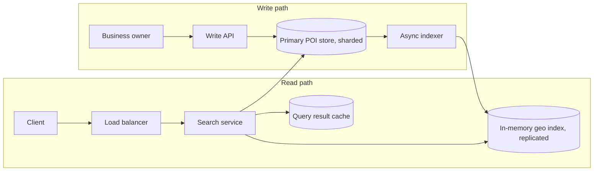

# Nearby Places (POI / Yelp-style)

[English](README.md) · [中文](README.zh.md)

<!-- meta:begin -->
| Type | Priority | Difficulty | Roles | Topics | Round |
| --- | --- | --- | --- | --- | --- |
| System design | ★★☆☆☆ | — | SWE | geospatial-index, sharding, caching | Onsite |
<!-- meta:end -->

## Problem

Design a service that finds points of interest (POIs) — restaurants, shops, cafes, and other
businesses — near a user's location. A client supplies its coordinates and either a search radius or a
desired count $K$, plus an optional category filter, and the service returns the matching POIs ordered by
real-world distance from the client. Each POI has a name, address, category, rating, and a set of weekly
opening hours; the owning business can edit any of these at any time (hours, category, a temporary or
permanent closure). Reads vastly outnumber writes.

Scale for this design:

- $2\times10^8$ (200 million) POIs worldwide.
- 864,000,000 nearby-search requests per day across all regions, concentrated in each region's local
  daytime and evening hours.
- Target latency for a single search request: p50 under 60 ms, p95 under 150 ms.
- On an average day, about 0.5% of POIs are created, edited (most often just the hours), or closed by
  their owners; a single owner-facing bulk edit can touch up to 10,000 POIs at once.
- An edit or a closure must stop, or start, being reflected in search results within 2 minutes.

In scope: the primary POI store and its write path; the spatial index — how it is built, kept in sync
with the primary store, and either replicated or sharded across query-serving nodes; the radius-search and
exact-$K$-nearest query paths, both with an optional category filter; caching of popular queries. Out of
scope: ranking beyond distance and rating (personalization, ads, sponsored placement); rendering map tiles
and the CDN that serves them; turning a free-text address into coordinates; photo and review storage;
authenticating business owners.

Produce:

1. Requirements and a scale estimate: bytes per POI record; spatial-index memory, and whether it fits on
   one server; peak QPS and the number of query-serving nodes it implies; the size of a query-result cache.
2. A data model (the POI record and the spatial index's entries) and 3-5 core APIs.
3. An architecture diagram that separates the write path from the read path, and a walk-through of one
   search request along that path.
4. Deep dives into: the choice of spatial index (Geohash vs. QuadTree) and how the boundary problem is
   handled; how an exact radius search and an exact $K$-nearest search are computed from that index; and
   how the index is replicated or sharded, including how a dense city's POIs are kept from overloading a
   single shard.

## Reference solution

<details>
<summary>Show the reference solution</summary>

Worth confirming first: whether the client always supplies a radius, or sometimes only a desired count
$K$ with no radius; and whether an approximate $K$-nearest result is acceptable or the answer must be
exact. The design below treats a radius as optional (a $K$-nearest query picks its own starting radius)
and treats exactness as a hard requirement.

### Requirements and scale

**POI record size.** Each POI stores `poi_id`, `owner_id`, `lat`, `lon` (four 8-byte fields), a `name`
(~24 bytes), an `address` (~40 bytes), `category_id` (2 bytes), a `rating` (1 byte, stored as rating × 10),
an `hours` block (~70 bytes for a week of open/close pairs), `rating_count` (4 bytes), `status` (1 byte), and
three bookkeeping fields — `created_at`, `updated_at` (8 bytes each), `version` (4 bytes) — for $194$ bytes
of core data. With the 30% row/index overhead typical of a relational store, that is $\approx 252$
bytes/record, or

$$N \cdot 252\text{ B} \approx 47\text{ GiB across all } N = 2\times10^8 \text{ POIs.}$$

Small enough that data volume is never the bottleneck here — QPS and index memory are.

**Spatial index memory.** The read path needs a structure that, given a location, returns nearby POIs
without touching the larger, disk-backed primary store. Each entry carries just enough to filter, sort,
and render a result: an 8-byte geohash key (Deep dive (a)), an 8-byte `poi_id`, two 4-byte fixed-point
coordinates, a 2-byte `category_id`, and a 1-byte rating — $27$ bytes of core data. Packed into a flat,
sorted array (not a pointer-heavy tree — Deep dive (a) explains why) with 20% overhead for alignment,

$$N \cdot 27\text{ B} \times 1.2 \approx 6.0\text{ GiB per copy of the index.}$$

Six gibibytes fits comfortably in a single server's memory with room to spare — the decision this unlocks
is in Deep dive (c).

**Peak QPS and node count.** At $864{,}000{,}000$ searches/day, average QPS is
$864{,}000{,}000 / 86{,}400 = 10{,}000$; with traffic following each region's waking hours, and time zones
only partly smoothing the global curve, a 4x peak-to-average ratio gives a peak of $40{,}000$ QPS. Assuming
a query-serving node can sustain $2{,}000$ QPS — a 9-cell geohash lookup against the in-memory index, a
haversine check on a few hundred candidates, and a sort, all cheap next to network and serialization
overhead — the fleet needs $\lceil 40{,}000 / 2{,}000 \rceil = 20$ nodes. Replicating the full 6 GiB index
to all 20 (Deep dive (c)) costs about $121$ GiB of cluster memory in total, still cheap.

**Cache.** A popular (block, category) pair repeats heavily — many users near the same block ask for
"coffee" within minutes of each other. A cached ranked list would be wrong for the other users in that block,
since which POIs qualify and their order depend on the exact query point. So the cache is keyed by the
$3\times3$ block (its precision and center cell) and the category; its value is the block's candidates with
what the response needs (`poi_id`, fixed-point coordinates, rating, name), and every request, hit or miss,
computes distances from its own coordinates. A hit saves the batched name lookup against the primary store.
With a 30-second TTL and an assumed 90% hit rate, misses arrive at $10{,}000 \times 0.1 = 1{,}000$/s at
average load; by Little's law the cache holds about $1{,}000 \times 30\text{ s} = 30{,}000$ resident keys,
each about 200 candidates of 41 bytes plus a header (about 8 KB), for about $240$ MiB — one cache
node. The 20-node fleet is still sized for
the full *uncached* peak: a cache flush or a cold start cannot be allowed to blow the latency budget.

**Write path.** With 0.5% of $2\times10^8$ POIs changed on an average day, that is $1{,}000{,}000$
changes/day, or $11.57$ writes/sec; fanned out to 20 index replicas, $231$ apply operations/sec — trivial
next to the read path. Each change spends about 6 seconds in the indexing pipeline (batching plus delivery
to every replica), a twentieth of the 120-second freshness budget, so by Little's law only about $69$
changes are in flight on average; even a 10,000-POI bulk edit drains in 5 seconds across 4 indexing
workers at 500/sec each.

### Data model and API

**POI** — `poi_id`, `owner_id`, `name`, `category_id`, `lat`, `lon`, `address`, `hours`
(`[{day, open, close}]`, empty for a day the business is closed), `rating`, `rating_count`, `status`
(`active | closed`), `version`, `created_at`, `updated_at`. Held in the primary, durable store — the source of truth for
every field.

**IndexEntry** — one per POI, held in the in-memory spatial index: `geohash_key` (the point's 9-character
geohash, packed as the sort key), `poi_id`, `lat_fixed`, `lon_fixed` (fixed-point integers), `category_id`,
`rating_x10`. No `name` or `address`: the response's `name` is filled in by a batched point lookup against
the primary store's read replicas when a block's candidates enter the cache.

Core APIs:

1. `PUT /pois/{poi_id}` — an owner creates or fully replaces a POI. Body:
   `{name, category_id, lat, lon, address, hours}`. Written synchronously to the primary store; returns
   `{poi_id, version}` and queues the change for indexing.
2. `PATCH /pois/{poi_id}/hours` — the most frequent owner edit. Body: `{hours}`. Returns `{version}`.
3. `DELETE /pois/{poi_id}` — marks the POI `closed` (a tombstone, not a hard delete, so history and
   disputes stay resolvable). Returns `{status: "closed", effective_at}`.
4. `GET /search/nearby?lat&lon&radius_m&category_id?&limit` — every POI within `radius_m` meters, sorted
   by distance. Returns `[{poi_id, name, category_id, rating, distance_m}]`.
5. `GET /search/nearest?lat&lon&k&category_id?` — the exact $K$ nearest POIs, sorted by distance. Same
   response shape.

### Architecture



A search request carries the client's coordinates, a radius or a $K$, and an optional category; the load
balancer routes it to any search-service node, since every node holds a full copy of the geo index. The
node picks a geohash precision from the radius (Deep dive (b)) and checks the query-result cache for that
block and category. On a miss, it looks up the block's 9 cells in its local in-memory index, fills in the
candidates' names with one batched point lookup against a primary-store read replica, and writes them into
the cache. Either way it then computes the real haversine distance from the request's own coordinates to
every candidate, filters and sorts, and — for a $K$-nearest request — checks a safety margin before
returning (Deep dive (b)), moving to a coarser block if the margin or the candidate count is not enough. On
the write side, an owner's edit lands in the sharded primary store first and reaches every geo-index
replica through the asynchronous indexer and its change log (Deep dive (c)).

### Deep dives

**(a) Spatial index: Geohash vs. QuadTree, and the boundary problem.** Geohash turns a (lat, lon) pair into a
short string by bisecting the longitude and latitude ranges in alternation — longitude first — appending a
1 bit whenever the point falls in the upper half of the current range, and packing every 5 bits into one
base32 character. A precision-$p$ hash encodes $5p$ bits, split $\lceil 5p/2 \rceil$ to longitude and
$\lfloor 5p/2 \rfloor$ to latitude (longitude gets the odd bit, since it goes first), giving a cell of
height $180 / 2^{\text{lat bits}}$ degrees and width $360 / 2^{\text{lon bits}}$ degrees. At precision 6
that is $0.61\text{ km} \times 1.22\text{ km}$ at the equator, but a degree of longitude covers less ground
further from the equator, so the same cell narrows to about $0.61 \times 0.61\text{ km}$ near latitude 60°
($\cos 60° = 0.5$) — height, tied only to latitude, does not shrink.

Two points sharing a hash prefix are close, but the reverse is false: two points a few meters apart across
a cell edge can share no characters at all — on either side of the prime meridian, the very first
bisection already separates them. That is
the boundary problem, fixed by always searching the $3\times3$ block of the cell plus its 8 neighbors,
never the center cell alone. A neighbor is found by decoding the center hash to its bounds, stepping one
cell-width or cell-height in the needed direction, wrapping longitude with `((lon + 180) % 360) - 180` so a
step east of $+179.99°$ lands near $-179.99°$ across the antimeridian, and re-encoding — correct even for
POIs straddling $\pm180°$ longitude. Latitude is clamped at $\pm90°$ instead, so a cell touching a pole
simply gets fewer distinct neighbors. Precision itself is chosen from the search radius $r$: the finest
precision whose cell height is at least $r/R$ ($R$ the Earth's radius, angles in radians) and whose cell
width is at least the disc's longitude half-span $\arcsin(\sin(r/R)/\cos\varphi)$ at the query's latitude
$\varphi$ — a little more than $(r/R)/\cos\varphi$ — guarantees the $3\times3$ block covers the search
disc even from a corner of the center cell. At latitude 41° a 300 m radius picks precision 6 and a 5 km
radius precision 4; at 80° the same 300 m needs precision 5. When no precision qualifies — a radius wider
than a continent-sized cell, or a disc that contains a pole — the search scans the whole index: exact,
slow, and rare.

QuadTree instead recursively splits a square region into four quadrants only where the point count demands
it — a leaf splits once it passes a few hundred points, merging back only
once well below that — adapting naturally to density, small leaves downtown and huge ones over farmland.
Its search handles the boundary by itself: a best-first traversal visits nodes in order of their minimum
distance to the query, so a nearer point just across a leaf edge is reached without a separate neighbor
rule. The cost is storage and updates: as a pointer tree in memory, every node carries child pointers and
allocator overhead, and an insert can split a leaf, a structural change every replica must reproduce in
the same order; stored in a database, leaves have variable-length quadrant codes, so finding a point's
leaf is a longest-prefix lookup rather than a fixed-length prefix scan.

Given the index's modest, in-memory size and a write-light, read-heavy workload, QuadTree's extra
adaptivity is not worth that complexity: Geohash, as the flat sorted array already priced above, is the
choice. Its downside — one unusually dense cell (a stadium, a mall) still over-returning at a fine
precision — is handled locally, with a deeper override just for that prefix, rather than adopting
QuadTree's adaptivity everywhere for a few hot spots. Hierarchical spherical grids such as S2 and H3
avoid Geohash's distortion near the poles and in cell shape, at the cost of a heavier dependency.

**(b) Exact radius and $K$-nearest search.** Neither a shared hash prefix nor grid adjacency is a distance —
only the real, decoded coordinates are — so the $3\times3$ candidate set above is always followed by an
exact haversine distance to every candidate, and only that distance decides inclusion or rank. A radius
query stops there: the precision was chosen so the block covers the whole search disc (and when none
can, the whole index is scanned), so nothing outside it can be within the radius, and the filtered, sorted
list is already exact and complete.

$K$-nearest is harder, since there is no radius to size the block from up front. The search starts from a
default radius (a density guess, e.g. 1 km), gathers that block's candidates, sorts by real distance, and
checks a safety margin before returning: a lower bound on the distance from the query point to anything
outside the $3\times3$ block. An edge of latitude is a parallel, reached most quickly due north or south,
at $R \cdot \Delta\varphi$; an edge of longitude is a meridian, a great circle, at
$R\arcsin(\cos\varphi \sin\Delta\lambda)$ — shorter than the $R\cos\varphi \cdot \Delta\lambda$ measured
along the query's parallel, by 3.4 km at latitude 60° with $\Delta\lambda = 11.75°$, enough to return a
wrong nearest POI. If the $K$-th best distance is no more than the smallest of the four edge distances, nothing
outside the block could be closer and the answer is exact. Otherwise, with at least $K$ candidates, the $K$-th distance
so far is an upper bound on the true one, so the next round uses the block the precision rule picks for that
radius, which is guaranteed to pass; with fewer than $K$ it goes one precision coarser. A coarser block
contains the finer one, and below precision 1 the search scans the whole index, so the loop always ends
with the exact answer — the $K$ nearest, or every matching POI when fewer than $K$ exist.

Against an independent full scan over 600 queries — in a metro area, at latitude 70°, in a sparse region at
62–78° S, and across $\pm180°$, two thirds of them next to a cell corner — both searches match exactly; in
$33$ of them the first block already held $K$ candidates while a nearer POI lay outside it.

**(c) Replication vs. sharding, hot shards, and freshness.** Because the whole spatial index is only about
6 GiB, it is replicated read-only, in full, to every one of the 20 query-serving nodes — not
sharded by region. Sharding the index (say, by geohash prefix) would save memory this design does not need,
at the cost of a real problem: a query whose 9 cells cross a shard boundary would need some of them from a
different machine. With geohash-4 shards that is one query in eight at precision 6 (124 of the 1,024
precision-6 cells in a geohash-4 cell sit on its rim), five in eight at precision 5, and every query at
precision 4 or coarser, each one a cross-machine fan-out. Replication avoids that entirely — and a dense
city's queries spread over all 20 nodes like any others — at $20\times$ the memory (about 121 GiB
fleet-wide, still cheap) and $20\times$ the write fan-out (231 apply operations/sec, still trivial).

The primary POI store is sharded for a different reason: write isolation and blast radius, not memory
(its 47 GiB total is nowhere near a bottleneck). Sharding by a geohash-4 prefix keeps a region's POIs on
nearby shards for low-latency regional writes — but a fixed-length prefix is exactly what creates a hot
shard: a prefix over a dense downtown holds far more POIs and writes than the same-length prefix over open
countryside. If an average non-empty geohash-4 prefix holds on the order of 1,000 POIs, one at ten times
that ($10{,}000$) is split into its 32 geohash-5 children, each becoming its own range; ranges, large and
small, are packed onto a handful of machines, and a request routes through a small shard map by
longest-prefix match rather than a fixed prefix length.

Freshness comes from a short write-path critical section: an owner's edit is durably committed to the
primary store first — the source of truth — and only then does an asynchronous indexer batch it,
recompute its geohash key if coordinates changed, and append the delta to an ordered change log that every
index replica consumes, off the query path entirely. A replica cannot insert into its packed sorted array
in place, which would shift gigabytes, so it applies deltas to a small overlay searched alongside the
array — new versions of changed entries in a sorted side table, and the `poi_id`s whose array entries are
stale in a tombstone set — and every 10 minutes merges the two into a fresh array and swaps it
in; by then the overlay holds only about $7{,}000$ changes. Each replica
reports its log offset, the load balancer drains one that falls more than 60 seconds behind, and a
restarted replica loads the latest array snapshot and replays the log from that snapshot's offset. At most
60 seconds of lag plus the cache's 30-second TTL stays inside the 2-minute target even during a 10,000-POI
bulk edit, which is why eventual consistency — a POI briefly still showing open after closing — is an
acceptable trade against a synchronous index write on the write path.

### Follow-ups

- A client that keeps moving (walking, driving) could be sent every POI within $r + d$ and re-filter
  locally until it has moved more than $d$ — exact by the triangle inequality — cutting backend QPS well
  under the peak this design provisions for.
- A category with fewer than $K$ POIs worldwide sends every $K$-nearest query for it to the full scan;
  per-category counts kept by the indexer let such a query go straight to that category's short list.

<details>
<summary>Estimate check (runnable)</summary>

```python
import itertools
import math
import random
from collections import defaultdict

# ---- requirements and scale ----
GiB, MiB, N = 1024 ** 3, 1024 ** 2, 200_000_000
primary_core = 8 + 8 + 8 + 8 + 24 + 40 + 2 + 1 + 70 + 4 + 1 + 8 + 8 + 4  # POI fields as listed in the text
assert (primary_core, round(primary_core * 1.3), round(N * primary_core * 1.3 / GiB)) == (194, 252, 47)  # +30%
idx_gib = N * (8 + 8 + 4 + 4 + 2 + 1) * 1.2 / GiB  # IndexEntry, +20% alignment
avg_qps = 864_000_000 / 86_400
nodes = math.ceil(4 * avg_qps / 2_000)  # 4x peak; assumption: 2,000 QPS per node
assert (round(idx_gib, 1), avg_qps, nodes, round(nodes * idx_gib)) == (6.0, 10_000, 20, 121)
writes = 0.005 * N / 86_400
assert (round(writes, 2), round(writes * nodes), round(writes * 6)) == (11.57, 231, 69)  # Little: 6 s in flight
assert round(writes * 600, -3) == 7_000 and 10_000 / (4 * 500) == 5.0  # overlay per 10 min; bulk edit
keys = avg_qps * (1 - 0.9) * 30  # Little's law: misses/s x TTL
entry = 200 * (8 + 4 + 4 + 1 + 24) + 150  # ~200 candidates x (id, lat, lon, rating, name) + header
assert (round(keys), round(entry / 1000), round(keys * entry / MiB, -1)) == (30_000, 8, 240)

# ---- geohash ----
R = 6_371_000.0
BASE32 = "0123456789bcdefghjkmnpqrstuvwxyz"

def geohash_encode(lat, lon, precision=9):
    lo, hi, bits = [-180.0, -90.0], [180.0, 90.0], ""
    for n in range(5 * precision):
        d, v = n % 2, (lon, lat)[n % 2]  # NOTE: bit 0 bisects longitude
        mid = (lo[d] + hi[d]) / 2
        bits += "1" if v >= mid else "0"
        lo[d], hi[d] = (mid, hi[d]) if v >= mid else (lo[d], mid)
    return "".join(BASE32[int(bits[i:i + 5], 2)] for i in range(0, len(bits), 5))

def geohash_decode(gh):  # -> centre lat, centre lon, half-height, half-width (degrees)
    lo, hi = [-180.0, -90.0], [180.0, 90.0]
    for n, b in enumerate("".join(format(BASE32.index(c), "05b") for c in gh)):
        d, mid = n % 2, (lo[n % 2] + hi[n % 2]) / 2
        lo[d], hi[d] = (mid, hi[d]) if b == "1" else (lo[d], mid)
    return (lo[1] + hi[1]) / 2, (lo[0] + hi[0]) / 2, (hi[1] - lo[1]) / 2, (hi[0] - lo[0]) / 2

def geohash_neighbors(gh):
    lat, lon, hh, hw = geohash_decode(gh)
    return [geohash_encode(max(-90.0, min(90.0, lat + dy * 2 * hh)),         # NOTE: clamp at the poles
                           (lon + dx * 2 * hw + 180.0) % 360.0 - 180.0, len(gh))  # wrap across +-180 deg
            for dy in (-1, 0, 1) for dx in (-1, 0, 1)]

def haversine_m(lat1, lon1, lat2, lon2):
    p1, p2, dphi, dlmb = map(math.radians, (lat1, lat2, lat2 - lat1, lon2 - lon1))
    a = math.sin(dphi / 2) ** 2 + math.cos(p1) * math.cos(p2) * math.sin(dlmb / 2) ** 2
    return 2 * R * math.asin(min(1.0, math.sqrt(a)))

def cell_deg(p):  # cell height, width in degrees
    return 180.0 / 2 ** (5 * p // 2), 360.0 / 2 ** ((5 * p + 1) // 2)

def choose_precision(lat, radius_m, max_p=9):  # NOTE: max_p = length of the stored keys
    rho = radius_m / R
    s = math.sin(rho) / math.cos(math.radians(lat))
    # NOTE: the disc spans asin(sin(rho) / cos(lat)) of longitude, more than rho / cos(lat)
    need_h, need_w = math.degrees(rho), (math.degrees(math.asin(s)) if s < 1 else math.inf)
    best = 0  # 0: no 3x3 block covers the disc (too big, or over a pole) -> scan the whole index
    while best < max_p and cell_deg(best + 1)[0] >= need_h and cell_deg(best + 1)[1] >= need_w:
        best += 1
    return best

assert (geohash_encode(57.64911, 10.40744, 11), geohash_encode(42.6, -5.6, 5)) == ("u4pruydqqvj", "ezs42")

def rim_share(p, parent="u0vq"):  # share of cells whose 3x3 block leaves the geohash-4 cell
    cells = [parent + "".join(t) for t in itertools.product(BASE32, repeat=p - 4)]
    return sum(any(nb[:4] != parent for nb in geohash_neighbors(gh)) for gh in cells) / len(cells)

assert (rim_share(4), rim_share(5), round(rim_share(6), 3)) == (1.0, 0.625, 0.121)
h_km, w_km = [d * math.pi / 180 * R / 1000 for d in cell_deg(6)]
assert (round(h_km, 2), round(w_km, 2), round(w_km * math.cos(math.radians(60)), 2)) == (0.61, 1.22, 0.61)
assert (choose_precision(41.0, 300), choose_precision(41.0, 5_000), choose_precision(80.0, 300)) == (6, 4, 5)

# ---- radius / k-NN search ----
class Index:  # points, categories, 9-character keys, prefix buckets per precision
    def __init__(self, points, cats):
        self.pts, self.cats, self.gh, self.by_p = points, cats, [geohash_encode(a, b, 9) for a, b in points], {}

def scored_block(ix, lat, lon, p, category):
    if p not in ix.by_p:  # prefix -> point indices; p = 0: the whole index
        ix.by_p[p] = defaultdict(list)
        for i, gh in enumerate(ix.gh):
            ix.by_p[p][gh[:p]].append(i)
    center = geohash_encode(lat, lon, p)
    idxs = {i for nb in set(geohash_neighbors(center)) for i in ix.by_p[p][nb]}
    return center, sorted((haversine_m(lat, lon, *ix.pts[i]), i) for i in idxs
                          if category is None or ix.cats[i] == category)

def window_margin_m(lat, lon, center):
    # lower bound on the distance to anything outside the block (p >= 1)
    clat, clon, hh, hw = geohash_decode(center)
    north, south = min(clat + 3 * hh, 90.0), max(clat - 3 * hh, -90.0)
    d_lon = math.radians(3 * hw - abs(lon - clon))  # to the nearer east/west edge, <= 67.5 deg
    # NOTE: a parallel is nearest due north/south; a meridian is a great circle: asin(cos(lat) sin(d_lon))
    return R * min(math.radians(north - lat), math.radians(lat - south),
                   math.asin(math.cos(math.radians(lat)) * math.sin(d_lon)))

def radius_search(ix, lat, lon, radius_m, category=None):
    p = choose_precision(lat, radius_m)
    center, scored = scored_block(ix, lat, lon, p, category)
    out = [(d, i) for d, i in scored if d <= radius_m]
    return out, any(ix.gh[i][:p] != center for _, i in out)

def knn_search(ix, lat, lon, k, category=None, start_radius_m=1000.0):
    p = choose_precision(lat, start_radius_m)
    while True:
        center, scored = scored_block(ix, lat, lon, p, category)
        if p == 0 or (len(scored) >= k and scored[k - 1][0] <= window_margin_m(lat, lon, center)):
            return scored[:k]
        # NOTE: the k-th distance so far bounds the true one; a block chosen for it passes next round
        p = min(p - 1, choose_precision(lat, scored[k - 1][0])) if len(scored) >= k else p - 1

# ---- independent reference: chord distance, full scan ----
def ref_dist(lat1, lon1, lat2, lon2):
    u, v = [(math.cos(a) * math.cos(o), math.cos(a) * math.sin(o), math.sin(a))
            for a, o in (map(math.radians, (lat1, lon1)), map(math.radians, (lat2, lon2)))]
    return 2 * R * math.asin(min(1.0, math.dist(u, v) / 2))

def ref_scan(ix, lat, lon, category=None):
    return sorted((ref_dist(lat, lon, a, b), i) for i, (a, b) in enumerate(ix.pts)
                  if category is None or ix.cats[i] == category)

rng = random.Random(0)
REGIONS = [((40.0, 40.3), (-3.0, -2.6)), ((70.0, 71.0), (-2.0, 2.0)),      # metro; high latitude
           ((-78.0, -62.0), (100.0, 140.0)), ((64.0, 66.0), (178.0, 182.0))]  # sparse far south; across 180 deg
tally, ids = defaultdict(int), lambda pairs: [i for _, i in pairs]
for lat_rng, lon_rng in REGIONS:
    rand_point = lambda: (rng.uniform(*lat_rng), (rng.uniform(*lon_rng) + 180.0) % 360.0 - 180.0)
    ix = Index([rand_point() for _ in range(1_500)], [rng.randrange(4) for _ in range(1_500)])
    for qi in range(150):
        radius_m, k, cat = rng.choice([300, 2_000, 20_000, 150_000]), rng.choice([1, 3, 10]), rng.choice([None, 1])
        lat, lon = rand_point()
        if qi % 3 != 2:  # next to a corner of the first cell the radius / k-NN search uses
            p = choose_precision(lat, radius_m if qi % 3 == 0 else 1000.0)
            clat, clon, hh, hw = geohash_decode(geohash_encode(lat, lon, p))
            lat = clat + rng.choice([-1, 1]) * hh * (1 - 1e-6)
            lon = (clon + rng.choice([-1, 1]) * hw * (1 - 1e-6) + 180.0) % 360.0 - 180.0
        truth = ref_scan(ix, lat, lon, cat)
        got, from_nb = radius_search(ix, lat, lon, radius_m, cat)
        got_k = knn_search(ix, lat, lon, k, cat)
        _, first = scored_block(ix, lat, lon, choose_precision(lat, 1000.0), cat)
        tally["mismatch"] += (ids(got) != ids(t for t in truth if t[0] <= radius_m)) + (ids(got_k) != ids(truth[:k]))
        tally["radius from neighbor"] += from_nb
        # k candidates in the first block, yet a nearer POI outside it: caught only by the margin check
        tally["k-NN beyond first block"] += len(first) >= k and ids(first[:k]) != ids(truth[:k])
assert tally["mismatch"] == 0 and tally["radius from neighbor"] >= 150 and tally["k-NN beyond first block"] >= 25

def check(points, lat, lon, radius_m=None, k=None):  # pinned cases against the full scan
    ix = Index(points, [0] * len(points))
    truth = ref_scan(ix, lat, lon)
    if radius_m is not None:
        assert ids(radius_search(ix, lat, lon, radius_m)[0]) == ids(t for t in truth if t[0] <= radius_m) != []
    if k is not None:
        assert ids(knn_search(ix, lat, lon, k)) == ids(truth[:k])

# k-NN at lat 60, precision-2 block ending at 22.5 E: the nearest POI is just past that meridian
foot = math.degrees(math.atan(math.tan(math.radians(60.0)) / math.cos(math.radians(22.5 - 10.75))))
check([(65.86, 10.75), (foot, 22.500001)], 60.0, 10.75, k=1)  # fails with a cos(lat) * d_lon margin
assert round(R * (0.5 * math.radians(11.75) - math.asin(0.5 * math.sin(math.radians(11.75)))) / 1000, 1) == 3.4
check([(70.54, -0.05)], 70.0, 11.250000001, radius_m=427_800)  # fails with a rho / cos(lat) width
check([(33.0, 13.3), (39.385, 5.625)], 33.0, 5.625, k=1)  # nearest POI just past the block's north edge
check([(89.995, 0.0), (89.995, 180.0), (89.0, 90.0)], 89.995, 0.0, radius_m=2_000, k=2)  # disc over the pole
check([(41.0, -3.0), (41.000003, -3.0)], 41.0, -3.0, radius_m=0.5, k=5)  # 0.5 m radius; fewer than k POIs
check([(-40.0, 85.0), (10.0, -50.0)], 10.0, 10.0, k=1)  # nearest POI outside even the precision-1 block
print("geohash search checks out:", dict(tally))
```

</details>

</details>
