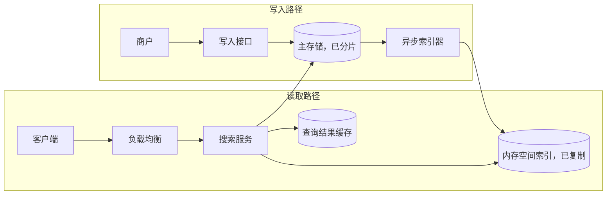

# 附近地点（POI / 类 Yelp）

[English](README.md) · [中文](README.zh.md)

<!-- meta:begin -->
| 题型 | 优先级 | 难度 | 岗位 | 考点 | 轮次 |
| --- | --- | --- | --- | --- | --- |
| 系统设计 | ★★☆☆☆ | — | SWE | geospatial-index, sharding, caching | 现场面 |
<!-- meta:end -->

## 题目

设计一个查找附近地点（points of interest，POI）的服务——餐厅、商店、咖啡馆等各类商户。客户端给出自己的坐标，以及一个搜索半径或者想要的数量 $K$，外加一个可选的类别过滤条件，服务按到客户端的真实距离对匹配的地点排序并返回。每个地点都有名称、地址、类别、评分，以及一周的营业时间；商户可以随时修改这些信息（营业时间、类别、临时或永久歇业）。读远多于写。

这次设计给定的规模：

- 全球共 $2\times10^8$（2 亿）个地点。
- 每天 864,000,000 次“附近搜索”请求，覆盖所有地区，集中在各地区当地的白天和傍晚时段。
- 单次搜索请求的延迟目标：p50 低于 60 毫秒，p95 低于 150 毫秒。
- 平均每天约有 0.5% 的地点被商户新建、修改（最常见的只是营业时间）或关闭；商户一次批量编辑最多可涉及 10,000 个地点。
- 一次修改或关店，必须在 2 分钟以内在搜索结果里消失或出现。

范围内：主存储及其写入路径；空间索引——如何构建、如何与主存储保持同步、在各查询服务节点之间是复制还是分片；半径搜索与精确的最近 $K$ 个搜索，两者都要支持可选的类别过滤；热门查询的缓存。范围外：距离和评分之外的排序（个性化、广告、赞助位）；地图瓦片的渲染及其 CDN；把一段文字地址转成坐标；照片与点评的存储；商户身份认证。

要产出：

1. 需求与规模估算：每条地点记录多少字节；空间索引占多少内存、能否放进一台服务器；峰值 QPS 以及由此推出的查询服务节点数；查询结果缓存的大小。
2. 一份数据模型（地点记录与空间索引的条目）和 3-5 个核心接口。
3. 一张把写入路径和读取路径分开的架构图，并沿着一次搜索请求走一遍这条路径。
4. 深入话题：空间索引的选型（Geohash 与 QuadTree）以及边界问题如何处理；精确的半径搜索和精确的最近 $K$ 个搜索如何从这个索引算出来；索引是复制还是分片，包括如何不让一座热门城市的地点压垮某一个分片。

## 参考解答

<details>
<summary>展开参考解答</summary>

先值得跟面试官确认：客户端是否总会给出半径，还是有时只给出想要的数量 $K$ 而没有半径；近似的最近 $K$ 个结果是否可以接受，还是必须精确。下面的设计把半径当作可选项（最近 $K$ 个查询自己选一个起始半径），并把精确性当作硬性要求。

### 需求与规模

**地点记录的大小。** 每条地点记录存 `poi_id`、`owner_id`、`lat`、`lon`（四个 8 字节字段）、一个 `name`（约 24 字节）、一个 `address`（约 40 字节）、`category_id`（2 字节）、一个 `rating`（1 字节，按评分 ×10 存储）、一个 `hours` 块（约 70 字节，存一周的开关门时间对）、`rating_count`（4 字节）、`status`（1 字节），以及三个记账字段——`created_at`、`updated_at`（各 8 字节）、`version`（4 字节）——核心数据合计 $194$ 字节。加上关系型存储典型的 30% 行/索引开销，约为 $252$ 字节/条，也就是

$$N \cdot 252\text{ 字节} \approx 47\text{ GiB，覆盖全部 } N = 2\times10^8 \text{ 个地点。}$$

足够小，数据总量在这个设计里从来不是瓶颈——QPS 和索引内存才是。

**空间索引的内存。** 读取路径需要一种结构：给定一个位置，不必碰更大、落盘的主存储就能返回附近的地点。每条索引条目只带够用来过滤、排序、渲染结果的信息：一个 8 字节的 geohash 键（深入话题 (a)）、一个 8 字节 `poi_id`、两个 4 字节的定点坐标、一个 2 字节 `category_id`、一个 1 字节的评分——核心数据 $27$ 字节。打包进一个扁平的有序数组（而不是指针密集的树——深入话题 (a) 会说明原因），再加 20% 的对齐开销，

$$N \cdot 27\text{ 字节} \times 1.2 \approx 6.0\text{ GiB，每一份索引副本。}$$

六个 GiB 舒舒服服地放进单台服务器的内存，还有富余——这份富余决定了深入话题 (c) 里的选择。

**峰值 QPS 与节点数。** 按每天 $864{,}000{,}000$ 次搜索，平均 QPS 是 $864{,}000{,}000 / 86{,}400 = 10{,}000$；搜索流量跟着各地区的清醒时段走，时区只能部分抹平全球曲线，取 4 倍的峰均比，峰值就是 $40{,}000$ QPS。假设一个查询服务节点能扛住 $2{,}000$ QPS——对内存中的索引做一次 9 格查找、对几百个候选做一次 haversine 检查、再排一次序，这些都比网络和序列化开销便宜得多——机群需要 $\lceil 40{,}000 / 2{,}000 \rceil = 20$ 个节点。把完整的 6 GiB 索引复制到全部 20 个节点（深入话题 (c)），总共约 $121$ GiB 集群内存，仍然便宜。

**缓存。** 一个热门的（格子块、类别）组合会被反复问到——同一个街区附近的很多用户会在几分钟内都搜“咖啡”。缓存一份排好序的结果列表，对同一块里的其他用户就不对了：哪些地点入选、按什么顺序，都取决于查询点的精确位置。所以缓存键是 $3\times3$ 格子块（它的精度和中心格子）加类别，缓存值是块里的候选连同响应需要的字段（`poi_id`、定点坐标、评分、名称），每个请求无论命中与否，都用自己的坐标重新算距离。命中省掉的是对主存储的那次批量名称查询。TTL 取 30 秒，假设命中率 90%，平均负载下每秒有 $10{,}000 \times 0.1 = 1{,}000$ 次未命中；按 Little 定律，缓存里大约驻留 $1{,}000 \times 30\text{ 秒} = 30{,}000$ 个键，每个键约 200 个候选、每个 41 字节，再加一个头部（约 8 KB），合计约 $240$ MiB——一个缓存节点就够。上面 20 个节点的机群仍然按*不带缓存*的完整峰值来配置：缓存被清空或冷启动时，延迟预算不能被打穿。

**写入路径。** $2\times10^8$ 个地点里平均每天有 0.5% 发生变化，也就是每天 $1{,}000{,}000$ 次改动，约 $11.57$ 次写/秒；分发给 20 份索引副本后是 $231$ 次应用操作/秒——比起读取路径可以忽略。一次改动在索引流水线里（批处理加送达每份副本）平均停留约 6 秒，是 120 秒时效预算的二十分之一，所以按 Little 定律，平均在途的改动只有约 $69$ 条；即便一次 10,000 个地点的批量编辑，用 4 个索引 worker、每个 500/秒，也只要 5 秒就能处理完。

### 数据模型与 API

**POI**——`poi_id`、`owner_id`、`name`、`category_id`、`lat`、`lon`、`address`、`hours`（`[{day, open, close}]`，某天歇业就留空）、`rating`、`rating_count`、`status`（`active | closed`）、`version`、`created_at`、`updated_at`。存在主存储里，是每个字段的权威来源。

**IndexEntry**——每个地点一条，存在内存空间索引中：`geohash_key`（该点 9 位精度的 geohash，打包成排序键）、`poi_id`、`lat_fixed`、`lon_fixed`（定点整数）、`category_id`、`rating_x10`。没有 `name` 或 `address`：响应里的 `name`，在一个格子块的候选写入缓存时，靠对主存储只读副本的一次批量点查补上。

核心接口：

1. `PUT /pois/{poi_id}`——商户新建或整体替换一个地点。请求体：`{name, category_id, lat, lon, address, hours}`。同步写入主存储；返回 `{poi_id, version}`，并把这次改动排进索引队列。
2. `PATCH /pois/{poi_id}/hours`——商户最常做的编辑。请求体：`{hours}`。返回 `{version}`。
3. `DELETE /pois/{poi_id}`——把地点标成 `closed`（打上墓碑标记，不是物理删除，历史记录和纠纷才能继续追溯）。返回 `{status: "closed", effective_at}`。
4. `GET /search/nearby?lat&lon&radius_m&category_id?&limit`——`radius_m` 米以内的所有地点，按距离排序。返回 `[{poi_id, name, category_id, rating, distance_m}]`。
5. `GET /search/nearest?lat&lon&k&category_id?`——精确的 $K$ 个最近地点，按距离排序。返回结构相同。

### 架构



一次搜索请求带着客户端的坐标、一个半径或一个 $K$，以及一个可选类别；负载均衡把它路由到任意一个搜索服务节点，因为每个节点都持有一份完整的地理索引副本。节点按半径选一个 geohash 精度（深入话题 (b)），用这个格子块和类别去查查询结果缓存。未命中时，它在本地内存索引里查这个块的 9 个格子，通过对主存储只读副本的一次批量点查补上候选的名称，再写进缓存。无论命中与否，接下来都用请求自己的坐标对每个候选算真实的 haversine 距离，过滤、排序；对最近 $K$ 个请求，返回前还要检查一个安全余量（深入话题 (b)），余量或候选数不够就换更粗的格子块。写入这边，商户的改动先写入已分片的主存储，再经异步索引器和它的变更日志送到每一份地理索引副本（深入话题 (c)）。

### 深入话题

**(a) 空间索引：Geohash 与 QuadTree，以及边界问题。** Geohash 把一对（纬度、经度）变成一个短字符串，做法是交替二分经度区间和纬度区间——先经度——每当点落在当前区间的上半段就追加一个 1 比特，每凑够 5 个比特就打包成一个 base32 字符。精度为 $p$ 的 hash 编码 $5p$ 个比特，其中 $\lceil 5p/2 \rceil$ 分给经度、$\lfloor 5p/2 \rfloor$ 分给纬度（经度先来，多出的那一位归它），格子的高度是 $180 / 2^{\text{纬度位数}}$ 度，宽度是 $360 / 2^{\text{经度位数}}$ 度。精度 6 在赤道上是 $0.61\text{ 公里} \times 1.22\text{ 公里}$——但经度每一度对应的实际距离越往高纬越短，所以同样的格子到纬度 60° 附近就窄成约 $0.61 \times 0.61\text{ 公里}$（$\cos 60° = 0.5$）；高度只取决于纬度，不会跟着变窄。

两个点共享 hash 前缀说明它们很近，但反过来不成立：格子边缘两侧只隔几米的两个点，可能一个字符都不共享——比如分处本初子午线两侧的两点，第一次二分就把它们分开了。这就是边界问题，解法是永远搜这个格子加上它 8 个邻居组成的 $3\times3$ 块，绝不只查中心格子。找一个邻居格子的办法是：解码中心 hash 得到它的边界，朝需要的方向挪动一个格子的宽或高，用 `((lon + 180) % 360) - 180` 把经度折回来，这样从 $+179.99°$ 往东挪一步就会正确落在跨过日期变更线之后的 $-179.99°$ 附近，再重新编码——这样一来，$3\times3$ 搜索对跨越 $\pm180°$ 经度的地点同样正确。纬度则在 $\pm90°$ 处钳位（clamp），所以贴着极点的格子只是不同的邻居少一些。精度本身由搜索半径 $r$ 决定：选这样的最细精度——格子高度不小于 $r/R$（$R$ 是地球半径，角度用弧度），格子宽度不小于搜索圆盘在查询点纬度 $\varphi$ 处的经度半跨度 $\arcsin(\sin(r/R)/\cos\varphi)$（比 $(r/R)/\cos\varphi$ 略大）——就能保证查询点即使在中心格子的角上，$3\times3$ 块也完全覆盖搜索圆盘。在纬度 41°，300 米半径选精度 6，5 公里半径选精度 4；到纬度 80°，同样的 300 米只能用精度 5。没有哪个精度满足条件时——半径比大陆大小的格子还宽，或者圆盘包含了极点——就扫描整个索引：结果精确，速度慢，而且很少发生。

QuadTree 走的是相反的路子：它只在点数需要的地方，才把一个正方形区域递归切成四个象限——一个叶子节点点数超过几百就切分，合并回去则要等点数明显降到阈值以下——这样自然贴合真实密度，市中心叶子很小，郊外农田的叶子很大。它的搜索自己就处理了边界：*最佳优先遍历*（best-first traversal）按节点到查询点的最小距离依次访问，叶子边缘另一侧更近的点自然会被访问到，不需要单独的邻居规则。代价在存储和更新上：在内存里做成指针树，每个节点都带着子节点指针和内存分配开销，一次插入可能让叶子分裂，这种结构变化每份副本都要按同样的顺序重做一遍；存进数据库，叶子的象限编码长短不一，找一个点所在的叶子要做最长前缀查找，而不是按固定长度的前缀扫描。

考虑到这份索引本来就不大、能舒服地放进内存，又是写少读多的负载，QuadTree 多出的自适应能力，抵不过它在存储和更新上的额外复杂度：这里选 Geohash，就存成上面已经算过内存开销的那种扁平有序数组。它唯一真正的短板——某一个格子异常密集（一座体育场、一个商场）时，即使精度已经很细，返回的候选还是太多——用局部手段解决：只给那一个前缀单独配一档更深的精度，而不是为了这几个热点就在全局都换成 QuadTree 的自适应方式。S2、H3 这类分层的球面网格能避开 Geohash 在极点附近和格子形状上的失真，代价是多一个较重的依赖。

**(b) 精确的半径搜索与最近 $K$ 个搜索。** 无论是共享的 hash 前缀还是格子相邻，都不是距离——只有解码出来的真实坐标才是——所以上面那个 $3\times3$ 候选集之后，永远要对每个候选算一次精确的 haversine 距离，只有这个距离才能决定取舍和排名。半径查询到这一步就够了：因为选精度时已经保证这个格子块覆盖整个搜索圆盘（做不到时就扫描整个索引），块外的任何点都不可能落在半径以内，过滤、排序之后的候选列表本身就是精确且完整的答案。

最近 $K$ 个更难一些，因为事先没有半径来决定格子块的大小。搜索从一个默认半径出发（凭密度猜一个，比如 1 公里），收集这个格子块里的候选，按真实距离排序，返回之前还要检查一个安全余量：从查询点到格子块外任何一点的距离的下界。纬度方向的边是纬线，最快的走法是正南或正北，距离 $R \cdot \Delta\varphi$；经度方向的边是经线，也就是大圆，距离是 $R\arcsin(\cos\varphi \sin\Delta\lambda)$——比沿查询点所在纬线量出的 $R\cos\varphi \cdot \Delta\lambda$ 短，在纬度 60°、$\Delta\lambda = 11.75°$ 时短 3.4 公里，足以返回一个错误的最近地点。如果当前第 $K$ 近的距离不超过到四条边的距离中最小的那个，块外不可能有更近的点，答案就是精确的。否则，如果已有至少 $K$ 个候选，当前第 $K$ 近的距离就是真实值的上界，下一轮就用精度规则为这个半径选出的格子块，它一定能通过检查；候选不足 $K$ 个，就换粗一档的精度。更粗的块总包含更细的块，而在精度 1 之下就扫描整个索引，所以循环总会以精确答案结束——最近的 $K$ 个，或者匹配的地点不足 $K$ 个时的全部。

拿一次独立的全量扫描对 600 次查询做对拍——分布在都市区、纬度 70°、南纬 62–78° 的稀疏区域和横跨 $\pm180°$ 的地带，三分之二放在格子的角附近——两种搜索都完全一致；其中 $33$ 次，第一个格子块已经有 $K$ 个候选，更近的地点却落在块外。

**(c) 复制还是分片、热点分片、以及时效。** 因为整个空间索引只有约 6 GiB，它被整份、只读地复制到全部 20 个查询服务节点上——而不是按区域分片。给索引分片（比如按 geohash 前缀）能省下这份设计根本不需要的内存，代价却是一个实实在在的问题：9 个格子跨过分片边界的查询，有一部分格子要到另一台机器上去查。按 geohash-4 分片，精度 6 时八个查询里有一个是这样（一个 geohash-4 格子里的 1,024 个精度 6 格子，有 124 个在它的边上），精度 5 时八个里有五个，精度 4 或更粗时每个查询都是，每一次都是跨机器的扇出（fan-out）。整份复制彻底绕开了这个问题——一座热门城市的查询也和其他查询一样分摊到全部 20 个节点上；代价是 $20$ 倍的内存（集群总共约 121 GiB，仍然便宜）和 $20$ 倍的写入扇出（231 次应用操作/秒，仍然可以忽略）。

主存储确实做了分片，但原因不同：为的是写入隔离和故障半径，不是内存（它总共 47 GiB，离瓶颈还远）。按 geohash-4 前缀分片，能让同一地区的地点落在相邻的分片上，方便就近写入——但固定长度的前缀恰恰会制造热点分片：覆盖一座热门市中心的前缀，地点数和写入量都远超覆盖开阔乡村的同长度前缀。如果一个非空的 geohash-4 前缀平均持有约 1,000 个地点，那么持有量达到十倍（$10{,}000$）的前缀，就拆成它的 32 个 geohash-5 子前缀，每一个成为单独的一段范围；这些大大小小的范围装进少数几台机器，请求靠一张小的分片映射表按最长前缀匹配来路由，而不是假设所有前缀长度一致。

时效靠的是让写入路径的关键区间尽量短：商户的一次改动先持久提交到主存储——权威数据源——之后才由异步索引器批处理它，坐标变了就重算 geohash 键，把增量追加到一份有序的变更日志里，每份索引副本都消费这份日志，整个过程完全在查询路径之外。副本没法在打包好的有序数组里原地插入，那要挪动好几 GB 的数据，所以它把增量写进一个和数组一起查询的小覆盖层（overlay）：改动后的新条目放进一张有序的旁表，数组里已经过时的条目，把它们的 `poi_id` 记进一个墓碑集合；每 10 分钟把两者合并成一个新数组再切换过去，这时覆盖层里只攒了约 $7{,}000$ 条改动。每份副本上报自己消费到的日志位置，落后超过 60 秒的副本由负载均衡摘下；重启的副本先加载最新的数组快照，再从快照对应的位置重放日志。最多 60 秒的滞后加上缓存 30 秒的 TTL，即使在一次 10,000 个地点的批量编辑期间也在 2 分钟目标之内——这就是为什么最终一致性是可以接受的取舍：一个地点关店后还会在结果里短暂显示为营业，换来的是不用在写入路径上加一次同步的索引写入。

### 追问

- 一直在移动的客户端（走路、开车），可以一次拿到 $r + d$ 以内的全部地点，在移动距离超过 $d$ 之前都在本地重新过滤——由三角不等式保证结果精确——这样后端 QPS 就能远低于这份设计按峰值配置的规模。
- 全球不足 $K$ 个地点的类别，每次最近 $K$ 个查询都会落到全量扫描；让索引器维护各类别的地点数，这种查询就能直接取该类别的那份短名单。

<details>
<summary>验证代码（可运行）</summary>

```python
import itertools
import math
import random
from collections import defaultdict

# ---- requirements and scale ----
GiB, MiB, N = 1024 ** 3, 1024 ** 2, 200_000_000
primary_core = 8 + 8 + 8 + 8 + 24 + 40 + 2 + 1 + 70 + 4 + 1 + 8 + 8 + 4  # POI fields as listed in the text
assert (primary_core, round(primary_core * 1.3), round(N * primary_core * 1.3 / GiB)) == (194, 252, 47)  # +30%
idx_gib = N * (8 + 8 + 4 + 4 + 2 + 1) * 1.2 / GiB  # IndexEntry, +20% alignment
avg_qps = 864_000_000 / 86_400
nodes = math.ceil(4 * avg_qps / 2_000)  # 4x peak; assumption: 2,000 QPS per node
assert (round(idx_gib, 1), avg_qps, nodes, round(nodes * idx_gib)) == (6.0, 10_000, 20, 121)
writes = 0.005 * N / 86_400
assert (round(writes, 2), round(writes * nodes), round(writes * 6)) == (11.57, 231, 69)  # Little: 6 s in flight
assert round(writes * 600, -3) == 7_000 and 10_000 / (4 * 500) == 5.0  # overlay per 10 min; bulk edit
keys = avg_qps * (1 - 0.9) * 30  # Little's law: misses/s x TTL
entry = 200 * (8 + 4 + 4 + 1 + 24) + 150  # ~200 candidates x (id, lat, lon, rating, name) + header
assert (round(keys), round(entry / 1000), round(keys * entry / MiB, -1)) == (30_000, 8, 240)

# ---- geohash ----
R = 6_371_000.0
BASE32 = "0123456789bcdefghjkmnpqrstuvwxyz"

def geohash_encode(lat, lon, precision=9):
    lo, hi, bits = [-180.0, -90.0], [180.0, 90.0], ""
    for n in range(5 * precision):
        d, v = n % 2, (lon, lat)[n % 2]  # NOTE: bit 0 bisects longitude
        mid = (lo[d] + hi[d]) / 2
        bits += "1" if v >= mid else "0"
        lo[d], hi[d] = (mid, hi[d]) if v >= mid else (lo[d], mid)
    return "".join(BASE32[int(bits[i:i + 5], 2)] for i in range(0, len(bits), 5))

def geohash_decode(gh):  # -> centre lat, centre lon, half-height, half-width (degrees)
    lo, hi = [-180.0, -90.0], [180.0, 90.0]
    for n, b in enumerate("".join(format(BASE32.index(c), "05b") for c in gh)):
        d, mid = n % 2, (lo[n % 2] + hi[n % 2]) / 2
        lo[d], hi[d] = (mid, hi[d]) if b == "1" else (lo[d], mid)
    return (lo[1] + hi[1]) / 2, (lo[0] + hi[0]) / 2, (hi[1] - lo[1]) / 2, (hi[0] - lo[0]) / 2

def geohash_neighbors(gh):
    lat, lon, hh, hw = geohash_decode(gh)
    return [geohash_encode(max(-90.0, min(90.0, lat + dy * 2 * hh)),         # NOTE: clamp at the poles
                           (lon + dx * 2 * hw + 180.0) % 360.0 - 180.0, len(gh))  # wrap across +-180 deg
            for dy in (-1, 0, 1) for dx in (-1, 0, 1)]

def haversine_m(lat1, lon1, lat2, lon2):
    p1, p2, dphi, dlmb = map(math.radians, (lat1, lat2, lat2 - lat1, lon2 - lon1))
    a = math.sin(dphi / 2) ** 2 + math.cos(p1) * math.cos(p2) * math.sin(dlmb / 2) ** 2
    return 2 * R * math.asin(min(1.0, math.sqrt(a)))

def cell_deg(p):  # cell height, width in degrees
    return 180.0 / 2 ** (5 * p // 2), 360.0 / 2 ** ((5 * p + 1) // 2)

def choose_precision(lat, radius_m, max_p=9):  # NOTE: max_p = length of the stored keys
    rho = radius_m / R
    s = math.sin(rho) / math.cos(math.radians(lat))
    # NOTE: the disc spans asin(sin(rho) / cos(lat)) of longitude, more than rho / cos(lat)
    need_h, need_w = math.degrees(rho), (math.degrees(math.asin(s)) if s < 1 else math.inf)
    best = 0  # 0: no 3x3 block covers the disc (too big, or over a pole) -> scan the whole index
    while best < max_p and cell_deg(best + 1)[0] >= need_h and cell_deg(best + 1)[1] >= need_w:
        best += 1
    return best

assert (geohash_encode(57.64911, 10.40744, 11), geohash_encode(42.6, -5.6, 5)) == ("u4pruydqqvj", "ezs42")

def rim_share(p, parent="u0vq"):  # share of cells whose 3x3 block leaves the geohash-4 cell
    cells = [parent + "".join(t) for t in itertools.product(BASE32, repeat=p - 4)]
    return sum(any(nb[:4] != parent for nb in geohash_neighbors(gh)) for gh in cells) / len(cells)

assert (rim_share(4), rim_share(5), round(rim_share(6), 3)) == (1.0, 0.625, 0.121)
h_km, w_km = [d * math.pi / 180 * R / 1000 for d in cell_deg(6)]
assert (round(h_km, 2), round(w_km, 2), round(w_km * math.cos(math.radians(60)), 2)) == (0.61, 1.22, 0.61)
assert (choose_precision(41.0, 300), choose_precision(41.0, 5_000), choose_precision(80.0, 300)) == (6, 4, 5)

# ---- radius / k-NN search ----
class Index:  # points, categories, 9-character keys, prefix buckets per precision
    def __init__(self, points, cats):
        self.pts, self.cats, self.gh, self.by_p = points, cats, [geohash_encode(a, b, 9) for a, b in points], {}

def scored_block(ix, lat, lon, p, category):
    if p not in ix.by_p:  # prefix -> point indices; p = 0: the whole index
        ix.by_p[p] = defaultdict(list)
        for i, gh in enumerate(ix.gh):
            ix.by_p[p][gh[:p]].append(i)
    center = geohash_encode(lat, lon, p)
    idxs = {i for nb in set(geohash_neighbors(center)) for i in ix.by_p[p][nb]}
    return center, sorted((haversine_m(lat, lon, *ix.pts[i]), i) for i in idxs
                          if category is None or ix.cats[i] == category)

def window_margin_m(lat, lon, center):
    # lower bound on the distance to anything outside the block (p >= 1)
    clat, clon, hh, hw = geohash_decode(center)
    north, south = min(clat + 3 * hh, 90.0), max(clat - 3 * hh, -90.0)
    d_lon = math.radians(3 * hw - abs(lon - clon))  # to the nearer east/west edge, <= 67.5 deg
    # NOTE: a parallel is nearest due north/south; a meridian is a great circle: asin(cos(lat) sin(d_lon))
    return R * min(math.radians(north - lat), math.radians(lat - south),
                   math.asin(math.cos(math.radians(lat)) * math.sin(d_lon)))

def radius_search(ix, lat, lon, radius_m, category=None):
    p = choose_precision(lat, radius_m)
    center, scored = scored_block(ix, lat, lon, p, category)
    out = [(d, i) for d, i in scored if d <= radius_m]
    return out, any(ix.gh[i][:p] != center for _, i in out)

def knn_search(ix, lat, lon, k, category=None, start_radius_m=1000.0):
    p = choose_precision(lat, start_radius_m)
    while True:
        center, scored = scored_block(ix, lat, lon, p, category)
        if p == 0 or (len(scored) >= k and scored[k - 1][0] <= window_margin_m(lat, lon, center)):
            return scored[:k]
        # NOTE: the k-th distance so far bounds the true one; a block chosen for it passes next round
        p = min(p - 1, choose_precision(lat, scored[k - 1][0])) if len(scored) >= k else p - 1

# ---- independent reference: chord distance, full scan ----
def ref_dist(lat1, lon1, lat2, lon2):
    u, v = [(math.cos(a) * math.cos(o), math.cos(a) * math.sin(o), math.sin(a))
            for a, o in (map(math.radians, (lat1, lon1)), map(math.radians, (lat2, lon2)))]
    return 2 * R * math.asin(min(1.0, math.dist(u, v) / 2))

def ref_scan(ix, lat, lon, category=None):
    return sorted((ref_dist(lat, lon, a, b), i) for i, (a, b) in enumerate(ix.pts)
                  if category is None or ix.cats[i] == category)

rng = random.Random(0)
REGIONS = [((40.0, 40.3), (-3.0, -2.6)), ((70.0, 71.0), (-2.0, 2.0)),      # metro; high latitude
           ((-78.0, -62.0), (100.0, 140.0)), ((64.0, 66.0), (178.0, 182.0))]  # sparse far south; across 180 deg
tally, ids = defaultdict(int), lambda pairs: [i for _, i in pairs]
for lat_rng, lon_rng in REGIONS:
    rand_point = lambda: (rng.uniform(*lat_rng), (rng.uniform(*lon_rng) + 180.0) % 360.0 - 180.0)
    ix = Index([rand_point() for _ in range(1_500)], [rng.randrange(4) for _ in range(1_500)])
    for qi in range(150):
        radius_m, k, cat = rng.choice([300, 2_000, 20_000, 150_000]), rng.choice([1, 3, 10]), rng.choice([None, 1])
        lat, lon = rand_point()
        if qi % 3 != 2:  # next to a corner of the first cell the radius / k-NN search uses
            p = choose_precision(lat, radius_m if qi % 3 == 0 else 1000.0)
            clat, clon, hh, hw = geohash_decode(geohash_encode(lat, lon, p))
            lat = clat + rng.choice([-1, 1]) * hh * (1 - 1e-6)
            lon = (clon + rng.choice([-1, 1]) * hw * (1 - 1e-6) + 180.0) % 360.0 - 180.0
        truth = ref_scan(ix, lat, lon, cat)
        got, from_nb = radius_search(ix, lat, lon, radius_m, cat)
        got_k = knn_search(ix, lat, lon, k, cat)
        _, first = scored_block(ix, lat, lon, choose_precision(lat, 1000.0), cat)
        tally["mismatch"] += (ids(got) != ids(t for t in truth if t[0] <= radius_m)) + (ids(got_k) != ids(truth[:k]))
        tally["radius from neighbor"] += from_nb
        # k candidates in the first block, yet a nearer POI outside it: caught only by the margin check
        tally["k-NN beyond first block"] += len(first) >= k and ids(first[:k]) != ids(truth[:k])
assert tally["mismatch"] == 0 and tally["radius from neighbor"] >= 150 and tally["k-NN beyond first block"] >= 25

def check(points, lat, lon, radius_m=None, k=None):  # pinned cases against the full scan
    ix = Index(points, [0] * len(points))
    truth = ref_scan(ix, lat, lon)
    if radius_m is not None:
        assert ids(radius_search(ix, lat, lon, radius_m)[0]) == ids(t for t in truth if t[0] <= radius_m) != []
    if k is not None:
        assert ids(knn_search(ix, lat, lon, k)) == ids(truth[:k])

# k-NN at lat 60, precision-2 block ending at 22.5 E: the nearest POI is just past that meridian
foot = math.degrees(math.atan(math.tan(math.radians(60.0)) / math.cos(math.radians(22.5 - 10.75))))
check([(65.86, 10.75), (foot, 22.500001)], 60.0, 10.75, k=1)  # fails with a cos(lat) * d_lon margin
assert round(R * (0.5 * math.radians(11.75) - math.asin(0.5 * math.sin(math.radians(11.75)))) / 1000, 1) == 3.4
check([(70.54, -0.05)], 70.0, 11.250000001, radius_m=427_800)  # fails with a rho / cos(lat) width
check([(33.0, 13.3), (39.385, 5.625)], 33.0, 5.625, k=1)  # nearest POI just past the block's north edge
check([(89.995, 0.0), (89.995, 180.0), (89.0, 90.0)], 89.995, 0.0, radius_m=2_000, k=2)  # disc over the pole
check([(41.0, -3.0), (41.000003, -3.0)], 41.0, -3.0, radius_m=0.5, k=5)  # 0.5 m radius; fewer than k POIs
check([(-40.0, 85.0), (10.0, -50.0)], 10.0, 10.0, k=1)  # nearest POI outside even the precision-1 block
print("geohash search checks out:", dict(tally))
```

</details>

</details>
