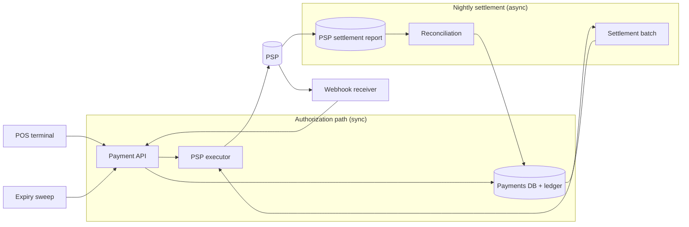

# Payment System / Coffee-Shop Ordering

[English](README.md) · [中文](README.zh.md)

<!-- meta:begin -->
| Type | Priority | Difficulty | Roles | Topics | Round |
| --- | --- | --- | --- | --- | --- |
| System design | ★★★★★ | Medium | SWE | payment, idempotency, ledger | Phone screen · Onsite |
<!-- meta:end -->

## Problem

Design the in-store ordering and card-payment system for a coffee chain. A customer orders at the
register; the cashier enters the order and the register calls the payment system, which places a
**hold** (a pre-authorization) with a payment service provider (PSP) for the order's expected total.
The barista prepares the drink; once it is ready, the register calls the payment system again to
**capture** the hold for the final amount, which can differ from the held amount — a tip added at the
register raises it, an item that was substituted or turned out to be out of stock lowers it; both PSPs
accept a capture of up to 120% of the held amount. A hold that is never captured is **voided**
(cancelled, which releases the customer's funds): either the cashier cancels the order, or the payment
system voids it on its own once it has waited too long. Every night, a batch job collects the day's
captured transactions, groups them by PSP and merchant account, submits one settlement file per group,
and reconciles each group against the settlement report that comes back for it.

Scale for this design:

- 2,000 stores, averaging 400 orders/store/day — 800,000 orders/day chain-wide.
- Usage concentrates in a 2-hour morning rush that carries about 40% of a store's daily volume.
- Target latency for a hold: the cashier and the customer are both watching the register, so the hold
  call must return in under 600 ms at the median and under 1.5 s at the 99th percentile. The PSP's own
  answer to a hold (a round trip through the card network to the card's issuer) takes about 400 ms at
  the median and 1.2 s at the 99th percentile.
- A capture typically follows its hold by about 90 seconds (the time to make the drink); a hold not
  captured within 6 minutes of being placed must be voided by the payment system — the card's issuer
  would otherwise keep the funds on hold for days.
- The nightly settlement batch starts once every store has closed for the day and must have every file
  submitted within a 2-hour window; confirmation against the settlement reports follows on the next
  business day.
- The chain settles through two PSPs — a primary that carries normal traffic and a backup used only when
  the primary is degraded. Each store belongs to one of 5 merchant accounts, and each merchant account
  is set up at both PSPs.
- Each PSP account — one PSP plus one merchant account — is held at a single acquiring bank, and that
  bank is what pays the chain: per business day it makes one deposit and issues one settlement report
  covering only that account's transactions. The card networks (Visa, Mastercard) send the chain
  nothing and it never faces them directly, so a business day closes against one report and one deposit
  per PSP account — five of them on a normal night — never against one consolidated report.
- A single country, a single currency (US dollars, tracked in integer cents), one settlement calendar.

In scope: the hold/capture/void/expire lifecycle of a single payment; idempotency on the hold call, the
capture call, PSP callbacks, and the nightly batch; the ledger that records each capture; the nightly
settlement batch and its reconciliation against the acquiring banks' settlement reports; behavior when
a PSP is slow or unreachable. Out of scope: the PSP's own internals; the menu, inventory, and
order-pricing logic (assume an order reaches the payment system as a computed total in minor currency
units); loyalty and
rewards points. The card number itself never reaches this system — the register's card reader and the
PSP's SDK tokenize it before anything is sent here, so every request downstream of the register carries
only a PSP-issued token, never a card number, which keeps raw card data, and most of the PCI DSS (the
card industry's data-security standard) requirements that come with it, out of this system.

Produce:

1. Requirements and a scale estimate: request volume and QPS on the hold path, at both average and peak;
   the day's ledger write volume; a rough storage estimate.
2. A data model (orders, payments, ledger entries, settlement batches) and 3-5 core APIs.
3. An architecture diagram that separates the synchronous authorization path from the asynchronous
   settlement path, and a walk-through of one order along that path.
4. Deep dives into: (a) what in this flow has to stay synchronous versus what can run later, and how a
   PSP timeout on the hold call is handled; (b) partial failure and rerun of the nightly settlement
   batch, and how reconciliation against each acquiring bank's settlement report catches missed or
   duplicated entries; (c) consistency and sharding for the payment records, and behavior when a PSP
   degrades.

## Reference solution

<details>
<summary>Show the reference solution</summary>

Two points worth confirming before designing: what happens when a final amount would exceed the 120%
ceiling, and whether a declined hold may be retried under the same order. Assumed here: in both cases
the register opens a fresh order, voiding the old hold in the first case.

### Requirements and scale

**Order volume and hold QPS.** $S = 2{,}000$ stores at 400 orders/store/day give
$800{,}000$ orders/day chain-wide, an average of $800{,}000 / 86{,}400 \approx 9.3$ QPS on the hold path.
About 40% of a store's volume falls inside its 2-hour morning rush; taking every store's rush to fall
in the same two hours — an overestimate for a chain spread across time zones —
$0.40 \times 800{,}000 = 320{,}000$ orders land in a 7,200 s window, a peak rate of
$320{,}000 / 7{,}200 \approx 44.4$ QPS. A 1.3x margin for bursts inside that window gives a design
target of about 58 QPS for the online tier — round up to 60 for headroom.

**Ledger, storage, and batch size.** 97% of the day's holds are captured, 2% voided, 1% expire, so
$776{,}000$ payments/day reach `captured`; each posts two ledger rows, $1{,}552{,}000$ rows/day.
At ~200 and ~120 bytes/row that is about 54 GiB/year of payment data
and 63 GiB/year of ledger data, before indexes and replication. Split across 5 merchant accounts, a
normal night's captures average $155{,}200$ rows/account, about 14.8 MiB per settlement file at ~100
bytes/row — none of it large: the system is bound by correctness and latency, not by data volume.

### Data model and API

**Order** — `order_id`, `store_id`, `register_id`, `final_amount_minor`, `currency`, `created_at`,
`order_status` (`open | completed | cancelled`).

**Payment** — `payment_id`, `order_id` (at most one non-terminal payment per order, enforced by a partial
unique index), `store_id`, `psp_account_id`, `psp_hold_id`, `psp_capture_id` (null until captured),
`hold_amount_minor`, `capture_amount_minor` (null until a capture is requested), `currency`, `state`,
`idempotency_key_hold` (unique), `hold_created_at`, `hold_expires_at`, `captured_at`, `batch_id`
(null until `settling`), `settled_at`, `updated_at`. Besides that unique index, a composite
`(state, hold_expires_at)` serves the expiry sweep and `(state, psp_account_id, captured_at)` serves the
nightly batch's claim of one account's `captured` rows, so neither has to scan the whole table.

**Ledger entry** — `entry_id`, `posting_key`, `payment_id` (null for batch-level postings), `account`,
`direction` (`debit | credit`), `amount_minor`, `currency`, `created_at`. Rows are append-only; a
correction is a new posting. `posting_key` names the event behind a posting (`capture:<payment_id>`,
`payout:<batch_id>`, `refund:<refund_id>`, ...), and a unique index on `(posting_key, account)` makes
every posting idempotent. A capture's pair is written in the same transaction as its `authorized →
captured` update — ledger rows live on the payment's shard, so no distributed transaction is needed. A
\$4.75 capture of a \$4.00 hold (a \$0.75 tip) debits `psp_receivable` 475, the asset "the PSP owes us",
and credits `store_card_sales` 475, a per-store clearing account the chain's accounting system (out of
scope) splits into revenue, sales tax, and tips.

**Settlement batch** — `batch_id`, `business_date`, `psp_account_id`, `cutoff_at`,
`state` (`building | submitted | reconciled | failed`), `file_reference` (derived from `batch_id`, so it
is known before submission), row counts and totals at claim and after reconciliation (`claimed_*`,
`reconciled_*`), `submitted_at`, `reconciled_at`; the unique index on
`(business_date, psp_account_id)` is the batch's own idempotency key.

**State machine.** Each transition is one conditional update,
`UPDATE payments SET state = <to>, <fields> WHERE payment_id = ? AND state = <from> AND <extra>`; the
table lists only the fields and the extra condition (the batch claim updates every matching row at once).

| Transition | Trigger | Actor | PSP call | Fields; extra condition |
| --- | --- | --- | --- | --- |
| → `pending` | hold request arrives | payment service | none (called after the insert) | `INSERT`; unique `idempotency_key_hold` |
| `pending` → `authorized` | PSP approves (reply, lookup or webhook) | payment service | `create_hold` | `psp_hold_id`, `hold_expires_at` |
| `pending` → `failed` | PSP declines, or confirms no hold exists | payment service | `create_hold` or lookup | — |
| `authorized` → `captured` | PSP confirms the capture | payment service | `capture` | `psp_capture_id`, `captured_at`; `capture_amount_minor IS NOT NULL` |
| `authorized` → `voided` | cashier cancels | payment service | `void` (after the update) | `capture_amount_minor IS NULL` |
| `authorized` → `expired` | 6 minutes without a capture | expiry sweep | `void` (after the update) | `capture_amount_minor IS NULL AND hold_expires_at < now()` |
| `captured` → `settling` | batch claim | batch job | none | `batch_id`; `psp_account_id = ? AND captured_at < cutoff_at` |
| `settling` → `settled` | PSP report lists the row | reconciliation job | none | `settled_at`; `batch_id = ?` |
| `settling` → `captured` | dropped from the file, file rejected, or PSP confirms it unsettled | batch or reconciliation job | none | `batch_id = NULL`; `batch_id = ?` |

A capture first checks the amount against 120% of `hold_amount_minor`, writes `capture_amount_minor`
under the condition `state = 'authorized' AND capture_amount_minor IS NULL`, and only then calls the
PSP, retrying until the PSP answers. A void goes the other
way round: the update comes first, so a capture that arrives afterwards fails its guard instead of
racing the PSP void, which is then retried until acknowledged (voiding is safe to repeat). Zero affected
rows means the caller re-reads the row: already in the target state (with the same amount) is a
duplicate, answered with the stored result; any other state is a conflict or a stale event, logged and
rejected. No application-level locking is needed.

**Idempotency.** The hold call carries an `idempotency_key` that the register generates once per order
and keeps in local storage, so even a retry after a reboot reuses it. It is stored as the payment's
unique `idempotency_key_hold`; a repeat finds the existing payment and returns its current state instead
of calling the PSP again. A capture needs no separate key: the two guards above already admit one amount
and one capture per hold. Every outbound PSP call carries a key too (`idempotency_key_hold` for the
hold, `payment_id` for capture and void), and because the `pending` row is committed before the hold
call, a crash between the PSP accepting a request and our recording it leaves only a `pending` row, for
the timeout lookup to resolve.

PSP webhooks can be delivered more than once, out of order, or after our own lookup has already
resolved the payment. Each is deduplicated by inserting its `psp_event_id` into an events table under a
unique index, in the same transaction as the conditional update it triggers — done separately, a crash
between the two would mark the event as seen while losing its effect. A stale "authorized" webhook that
meets an already `captured` payment therefore fails its precondition and is discarded instead of
rewinding the state.

Core APIs:

1. `POST /orders/{order_id}/hold` — body `{register_id, amount_minor, currency, card_token,
   idempotency_key}`; returns `{payment_id, state, psp_hold_id, hold_expires_at}`, `{state: "failed",
   decline_reason}`, or, when the outcome is unknown, `{payment_id, state: "pending"}`.
2. `POST /payments/{payment_id}/capture` — body `{final_amount_minor}`; returns `{state,
   capture_amount_minor, psp_capture_id}` (`state` stays `authorized` while the PSP capture is still
   being retried).
3. `POST /payments/{payment_id}/void` — body `{reason}`; returns `{state: "voided"}`.
4. `GET /payments/{payment_id}` — status read, for the register's UI and support tooling.
5. `POST /internal/settlement-batches` — starts or resumes tonight's batch for one PSP account; body
   `{business_date, psp_account_id}` (idempotent on that pair), called by the nightly scheduler.

### Architecture



A hold request from the register (`pos`) reaches the payment API, which inserts a `pending` payment,
calls the PSP through the PSP executor, and records the answer in the payments DB before replying; a PSP
that resolves a hold asynchronously instead sends its webhook to the webhook receiver, driving the same
transition. A ready drink triggers a capture over the same route, moving the payment to `captured` and
posting its two ledger rows in the same transaction. The expiry sweep runs on its own, handling holds
past `hold_expires_at` and `pending` rows left unresolved. Every night the settlement batch claims
`captured` rows and submits one file per PSP account through the executor; the PSP's settlement report
arrives the next business day, and reconciliation marks rows settled and posts the payout and any
mismatch to the ledger.

### Deep dives

**Sync authorization, async settlement, and a PSP timeout.** The hold call could block the register until
the PSP round trip finishes, or accept the request and push the answer back later over a separate
channel. This design keeps it synchronous: the 1.5 s p99 budget leaves about 300 ms beyond
the PSP's own 1.2 s p99 for our writes, and routing the confirmation through a queue adds exactly the
kind of delay that gets worse under load, right when the register can least afford it; only work nobody
is watching in real time (webhook handling, capture and void retries, the nightly batch) goes async.

The hard case is a hold call that times out (the PSP call's timeout is about 1.3 s, so fewer than 1% of
calls reach this path): the request was sent but no answer came back, so whether the PSP created the
hold is unknown; a blind retry is only as safe as the PSP's deduplication of the key, and giving up
risks abandoning a real hold. On a timeout, the payment service first looks the request up at the PSP by
`idempotency_key_hold`: a found hold is adopted (`authorized`), a decline is recorded (`failed`), and
only a "no such request" answer clears the way to resend the create call under the same key. If the
lookup itself times out, only the lookup is retried, with backoff, never the create call. If the outcome
is still unknown after a few seconds, the register receives `pending` and the cashier can take another
card under a fresh order; the expiry sweep keeps retrying the lookup, adopts a hold it finds (and voids
it once the 6 minutes pass without a capture), and marks the payment `failed` only when the PSP confirms
there is no hold. A request delayed in transit can still create the hold after that answer: its
"authorized" webhook then meets a `failed` payment, and the handler voids the stray hold rather than
discarding the event.

**Partial failure and rerun of the nightly batch.** One all-or-nothing transaction per file is simple
but lets a single bad row (a currency mismatch, an amount above the ceiling) block that account's whole
night; committing row by row avoids that but makes "did the batch finish" hard to answer. Here the
batch, not the row, is the unit of retry, and a bad row is returned to `captured` and reported instead
of blocking the file. Each step is safe to rerun after a crash:

1. **Create or resume.** `INSERT ... ON CONFLICT DO NOTHING` the `building` batch with its `cutoff_at`.
   A rerun that finds an existing `building` batch first asks the PSP whether its `file_reference` was
   already received (an unanswered check is retried, never skipped); if it was, the rerun only marks the
   batch `submitted`.
2. **Claim.** The claim update runs on every shard; a rerun matches no row already in `settling`, and
   the stored `cutoff_at` keeps it from pulling in later captures.
3. **Generate and submit.** The file is built from the rows tagged with `batch_id`, sorted by
   `payment_id`, so every rerun produces the same file under the same reference.
4. **Mark submitted.** `UPDATE settlement_batches SET state = 'submitted' WHERE batch_id = ? AND state =
   'building'`; after that no rerun claims or submits again. A file the PSP rejects outright marks the
   batch `failed` and returns its rows to `captured` for the next night.

Reconciliation, the next business day, runs per PSP account: it diffs that account's report against
the rows that account's batch claimed, by `(psp_capture_id, amount)`, and the matched amounts less
fees have to equal the single deposit that acquiring bank made for the day. Rolled into one
chain-wide total, an account short by exactly what another is over would disappear. A matched row
moves to `settled` through its own conditional update, so a rerun skips it. A claimed row missing
from the report stays `settling` and is looked up at the PSP; it returns to `captured` only once the
PSP confirms it was not settled — resubmitting it on a guess could settle it twice. A report row
with no claim (a duplicate capture our checks should have stopped, or a manual PSP-side adjustment)
is posted to a `suspense` account, keyed by the report row's id, and opens an investigation. The
payout is one posting per batch, keyed `payout:<batch_id>`: debit `bank_cash` (net) and `psp_fees`
(the fee), credit `psp_receivable` (gross).

**Consistency, sharding, and PSP resilience.** Payment and ledger rows need strong consistency: every
transition commits on its shard's primary with a synchronous replica, so a failover never loses a
committed capture, and every decision that depends on state (capture, void, batch claim) reads the
primary, never an asynchronous replica that may lag.

At ~60 QPS and ~120 GiB a year, one primary can carry the whole chain; the sharding key matters for
growth, and is a real trade-off. Two dimensions that come up first are unavailable here: the card's
issuing bank, which this system cannot name at all — only a PSP token reaches it, never a card
number or a BIN — and the cardholder, who has no account in an in-store flow. That leaves
`payment_id` and `store_id`. `payment_id` spreads writes perfectly evenly but scatters one store's
rows across every shard, turning a single-store statement or a store's clearing-account balance into
a scatter-gather. `store_id` keeps them on one shard — a store with ten times the average traffic is
still nowhere near a shard's ceiling — at the cost of uneven shard sizes, absorbed by hashing
`store_id` into a fixed number of buckets, several stores per bucket. That favors `store_id`.

When a PSP is slow or unreachable, a circuit breaker trips on a rolling error rate (say, more than 20%
failures over the last 50 calls), so holds fail fast instead of each waiting out a 1.3 s timeout; below
that threshold, transient errors get a bounded exponential backoff. Once the breaker trips, new holds go
to the backup PSP — but only new ones: an authorization belongs to the PSP (and its acquiring bank)
that obtained it, so only that PSP can capture or void it; the backup has no record of it. A capture for
a hold at the primary is therefore retried against the primary until it recovers — the issuer keeps the
authorization valid for days, far longer than the chain's 6-minute policy — and the expiry sweep skips
any payment whose capture is already requested.

### Follow-ups

- Scaled up to 10,000 authorizations/s (864,000,000 a day), one account's nightly file would reach
  15.6 GiB: cut it into parts of 100,000 rows, sorted by `payment_id`, about 1,700 of them, and record
  each part's index on the batch row as the PSP accepts it, so a rerun resumes at the next part and
  `submitted` is still set exactly once, at the end.
- A refund, unlike a void, returns money that was already captured: it gets its own `refund:<refund_id>`
  posting (debit `store_card_sales`, credit `psp_receivable`) and settles as its own line in a later
  batch, never by mutating the original captured row, whose batch may already be reconciled.

<details>
<summary>Estimate check (runnable)</summary>

```python
import math

stores, avg_orders_per_store = 2_000, 400
daily_orders = stores * avg_orders_per_store
assert daily_orders == 800_000

avg_qps = daily_orders / 86_400
assert round(avg_qps, 1) == 9.3

peak_share, window_hours = 0.40, 2
peak_orders = daily_orders * peak_share
window_seconds = window_hours * 3600
peak_qps = peak_orders / window_seconds
assert round(peak_qps, 1) == 44.4

burst_margin = 1.3
design_qps = peak_qps * burst_margin
assert round(design_qps, 1) == 57.8

capture_rate, void_rate, expire_rate = 0.97, 0.02, 0.01
assert round(capture_rate + void_rate + expire_rate, 2) == 1.0
captured_per_day = daily_orders * capture_rate
assert captured_per_day == 776_000
ledger_rows_per_day = captured_per_day * 2
assert ledger_rows_per_day == 1_552_000

days_per_year = 365
payments_per_year = daily_orders * days_per_year
ledger_per_year = ledger_rows_per_day * days_per_year
assert payments_per_year == 292_000_000
assert ledger_per_year == 566_480_000

GiB = 1024 ** 3
payments_row_bytes, ledger_row_bytes = 200, 120
payments_storage_gib = payments_per_year * payments_row_bytes / GiB
ledger_storage_gib = ledger_per_year * ledger_row_bytes / GiB
assert round(payments_storage_gib) == 54
assert round(ledger_storage_gib) == 63
assert round(payments_storage_gib + ledger_storage_gib, -1) == 120

merchant_accounts = 5
rows_per_file = captured_per_day / merchant_accounts
bytes_per_row = 100
file_size_mib = rows_per_file * bytes_per_row / (1024 ** 2)
assert round(file_size_mib, 1) == 14.8

scaled_tps = 10_000                                 # the follow-up's larger chain
scaled_daily_orders = scaled_tps * 86_400
assert scaled_daily_orders == 864_000_000
scaled_rows_per_file = scaled_daily_orders * capture_rate / merchant_accounts
assert scaled_rows_per_file == 167_616_000
scaled_file_gib = scaled_rows_per_file * bytes_per_row / GiB
assert round(scaled_file_gib, 1) == 15.6
rows_per_part = 100_000
parts = math.ceil(scaled_rows_per_file / rows_per_part)
assert parts == 1677                                # "about 1,700 parts"

hold_p99_s, psp_p99_s, psp_timeout_s = 1.5, 1.2, 1.3
assert round(hold_p99_s - psp_p99_s, 1) == 0.3     # our own share of the p99 budget
assert psp_p99_s < psp_timeout_s < hold_p99_s       # timeouts stay inside the 1% tail

tip_hold_minor, tip_capture_minor = 400, 475
assert tip_capture_minor <= tip_hold_minor * 1.2    # the ledger example is within the ceiling

print("all requirements-and-scale numbers check out")
```

</details>

</details>
