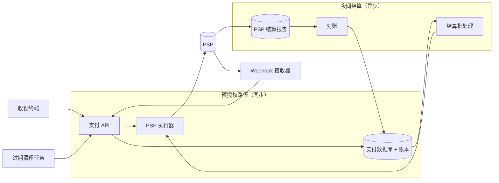

# 支付系统 / 咖啡店点单

[English](README.md) · [中文](README.zh.md)

<!-- meta:begin -->
| 题型 | 优先级 | 难度 | 岗位 | 考点 | 轮次 |
| --- | --- | --- | --- | --- | --- |
| 系统设计 | ★★★★★ | 中等 | SWE | payment, idempotency, ledger | 电话面 · 现场面 |
<!-- meta:end -->

## 题目

设计一家连锁咖啡店的门店点单与刷卡支付系统。顾客在收银台点单；收银员录入订单后，收银终端调用支付系统，向支付服务商（PSP，payment service provider）为订单的预计总额下一个*预授权*（hold）。咖啡师制作饮品；饮品做好后，收银终端再次调用支付系统，按最终金额对这个预授权做*扣款*（capture）——最终金额可能和预授权金额不同：收银台加的小费会让它变高，某个商品被替换或缺货会让它变低；两家 PSP 都接受不超过预授权金额 120% 的扣款。始终没有扣款的预授权会被*作废*（void），即撤销预授权、释放顾客被冻结的资金：要么是收银员取消了订单，要么是预授权等得太久，由支付系统主动作废。每天晚上，一个批处理任务收集当天已扣款的交易，按 PSP 和商户账户分组，每组生成一份结算文件并提交，再拿这一组返回来的结算报告对账。

这次设计的规模：

- 2,000 家门店，平均每店每天 400 笔订单——全连锁每天 800,000 笔订单。
- 使用量集中在一个 2 小时的早高峰，承担单店每天约 40% 的量。
- 预授权的延迟目标：收银员和顾客都在盯着收银终端，预授权调用的中位数延迟要在 600 毫秒内，第 99 百分位在 1.5 秒内。PSP 自己答复一次预授权（经卡组织到发卡行走一个来回）的中位数约 400 毫秒，第 99 百分位约 1.2 秒。
- 扣款通常在预授权之后约 90 秒发生（制作饮品所需的时间）；预授权下达后 6 分钟内没有扣款，支付系统必须把它作废——否则发卡行会把这笔钱冻结好几天。
- 夜间结算批处理在当天所有门店都打烊后启动，必须在 2 小时内把所有结算文件都提交完毕；与结算报告的核对在下一个营业日进行。
- 这家连锁通过两个 PSP 结算——一个承担日常流量的主 PSP，一个只在主 PSP 出问题时才启用的备用 PSP。每家门店属于 5 个商户账户中的一个，每个商户账户在两家 PSP 都有开设。
- 每个 PSP 账户（一家 PSP 加一个商户账户）都开在一家*收单行*（acquiring bank）名下，真正把钱打给连锁的是这家收单行：每个营业日入账一笔，并出具一份只覆盖这个账户的结算报告。卡组织（Visa、Mastercard）不向连锁出具任何东西，连锁也不直接面对它们，所以一个营业日结束时要核对的是每个 PSP 账户各一份报告、各一笔入账（正常一晚 5 份），而不是一份合并的总报告。
- 单一国家、单一货币（美元，用整数美分记账）、统一的结算日历。

范围内：单笔支付的预授权/扣款/作废/过期生命周期；预授权调用、扣款调用、PSP 回调、夜间批处理这几处的幂等；记录每笔扣款的账本；夜间结算批处理及其与各收单行结算报告的对账；PSP 变慢或不可达时的应对。范围外：PSP 自身的内部实现；菜单、库存与订单定价逻辑（假设订单到达支付系统时已经是一个以货币最小单位表示的总额）；会员积分。卡号本身不会到达这个系统——收银终端的读卡器和 PSP 的 SDK 会在数据发到这里之前就完成令牌化，所以收银终端下游的每个请求带的都是 PSP 签发的令牌而不是卡号，原始卡数据以及随之而来的大部分 PCI DSS（支付卡行业数据安全标准）合规要求，都落在这个系统之外。

要产出：

1. 需求与规模估算：预授权路径上的请求量与 QPS，平均值和峰值都要给；当天的账本写入量；一个粗略的存储估算。
2. 一个数据模型（订单、支付、账本分录、结算批次）和 3 到 5 个核心接口。
3. 一张架构图，把同步的预授权路径和异步的结算路径分开，并沿着一笔订单把这条路径走一遍。
4. 深入讨论：(a) 这个流程里哪些部分必须保持同步、哪些可以推迟，以及预授权调用遇到 PSP 超时时如何处理；(b) 夜间结算批处理的部分失败与重跑，以及与每家收单行结算报告的对账如何发现漏记或重复的条目；(c) 支付记录的一致性与分片，以及 PSP 出问题时的应对。

## 参考解答

<details>
<summary>展开参考解答</summary>

动手设计之前值得先确认两点：最终金额超过 120% 上限时怎么办，被拒绝的预授权能否在同一笔订单下重试。这里假设两种情况都改开一笔新订单，前一种顺带作废旧的预授权。

### 需求与规模

**订单量与预授权 QPS。** $S = 2{,}000$ 家门店，每店每天 400 笔订单，全连锁每天 $800{,}000$ 笔订单，预授权路径平均 QPS 为 $800{,}000 / 86{,}400 \approx 9.3$。单店约 40% 的量落在 2 小时早高峰；假设所有门店的早高峰落在同样的两个小时里（门店分布在几个时区，这是高估），$0.40 \times 800{,}000 = 320{,}000$ 笔订单落在 7,200 秒的窗口内，峰值速率为 $320{,}000 / 7{,}200 \approx 44.4$ QPS。为窗口内的突发流量再留 1.3 倍余量，在线层设计目标约 58 QPS——向上取整到 60。

**账本、存储与结算批次大小。** 当天预授权中 97% 被扣款、2% 被作废、1% 过期，所以每天 $776{,}000$ 笔支付到达 `captured`；每笔写两条账本分录，每天 $1{,}552{,}000$ 行。按每行约 200 和 120 字节估算，约合每年 54 GiB 支付数据和 63 GiB 账本数据（不含索引和副本）。分摊到 5 个商户账户，正常一晚每账户平均 $155{,}200$ 行，按每行约 100 字节算，一份结算文件约 14.8 MiB——都不大，这个系统受限于正确性和延迟，不是数据量。

### 数据模型与 API

**Order（订单）**——`order_id`、`store_id`、`register_id`、`final_amount_minor`、`currency`、`created_at`、`order_status`（`open | completed | cancelled`）。

**Payment（支付）**——`payment_id`、`order_id`（同一订单最多一笔非终态支付，部分唯一索引保证）、`store_id`、`psp_account_id`、`psp_hold_id`、`psp_capture_id`（扣款前为空）、`hold_amount_minor`、`capture_amount_minor`（发起扣款前为空）、`currency`、`state`、`idempotency_key_hold`（唯一）、`hold_created_at`、`hold_expires_at`、`captured_at`、`batch_id`（进入 `settling` 前为空）、`settled_at`、`updated_at`。除该唯一索引外，复合索引 `(state, hold_expires_at)` 供过期清理任务扫描，`(state, psp_account_id, captured_at)` 供夜间批处理认领某个账户的 `captured` 行，都不必扫全表。

**Ledger entry（账本分录）**——`entry_id`、`posting_key`、`payment_id`（批次级的记账为空）、`account`、`direction`（`debit | credit`）、`amount_minor`、`currency`、`created_at`。分录只追加，更正靠一笔新的记账。`posting_key` 标明记账来自哪个事件（`capture:<payment_id>`、`payout:<batch_id>`、`refund:<refund_id>` 等），`(posting_key, account)` 上的唯一索引让每笔记账都幂等。扣款的两条分录和它的 `authorized → captured` 更新在同一个事务里提交——账本行与支付在同一个分片上，不需要分布式事务。预授权 \$4.00、扣款 \$4.75（含 \$0.75 小费）的一笔支付，借记 `psp_receivable` 475（资产：PSP 欠我们的钱），贷记 `store_card_sales` 475——每家门店一个的过渡账户，由连锁的会计系统（不在范围内）再拆成收入、销售税和小费。

**Settlement batch（结算批次）**——`batch_id`、`business_date`、`psp_account_id`、`cutoff_at`、`state`（`building | submitted | reconciled | failed`）、`file_reference`（由 `batch_id` 派生，提交之前就已确定）、认领和对账后的行数与金额（`claimed_*`、`reconciled_*`）、`submitted_at`、`reconciled_at`；`(business_date, psp_account_id)` 上的唯一索引就是这个批次自己的幂等键。

**状态机。** 每个转移都是一次带条件的更新 `UPDATE payments SET state = <新状态>, <字段> WHERE payment_id = ? AND state = <旧状态> AND <附加条件>`，表里只列字段和附加条件（批次认领一次更新所有符合条件的行）。

| 转移 | 触发条件 | 执行者 | PSP 调用 | 写入字段；附加条件 |
| --- | --- | --- | --- | --- |
| → `pending` | 收到预授权请求 | 支付服务 | 无（写入后才调用） | `INSERT`；`idempotency_key_hold` 唯一 |
| `pending` → `authorized` | PSP 批准（答复、查询或 webhook） | 支付服务 | `create_hold` | `psp_hold_id`、`hold_expires_at` |
| `pending` → `failed` | PSP 拒绝，或确认没有该预授权 | 支付服务 | `create_hold` 或查询 | — |
| `authorized` → `captured` | PSP 确认扣款 | 支付服务 | `capture` | `psp_capture_id`、`captured_at`；`capture_amount_minor IS NOT NULL` |
| `authorized` → `voided` | 收银员取消 | 支付服务 | `void`（更新之后） | `capture_amount_minor IS NULL` |
| `authorized` → `expired` | 6 分钟内没有扣款 | 过期清理任务 | `void`（更新之后） | `capture_amount_minor IS NULL AND hold_expires_at < now()` |
| `captured` → `settling` | 批次认领 | 批处理任务 | 无 | `batch_id`；`psp_account_id = ? AND captured_at < cutoff_at` |
| `settling` → `settled` | PSP 报告里有这一行 | 对账任务 | 无 | `settled_at`；`batch_id = ?` |
| `settling` → `captured` | 被剔出文件、文件被拒，或 PSP 确认未结算 | 批处理或对账任务 | 无 | `batch_id = NULL`；`batch_id = ?` |

扣款先检查金额不超过 `hold_amount_minor` 的 120%，再以 `state = 'authorized' AND capture_amount_minor IS NULL` 为条件写入 `capture_amount_minor`，然后才调用 PSP，并一直重试到 PSP 给出答复。作废的顺序反过来：先更新状态，之后才到的扣款就会因条件不满足而失败，不会和作废请求赛跑；发往 PSP 的作废随后一直重试到对方确认（重复作废是安全的）。受影响行数为零时，调用方重读这一行：已处在目标状态（且金额相同）就是重复请求，返回存好的结果；处在别的状态就是冲突或过时的事件，记录并拒绝。因此不需要应用层加锁。

**幂等。** 预授权调用带一个 `idempotency_key`，由收银终端为每笔订单生成一次并存在本地，终端重启后的重试也用同一个；它存为这笔支付上唯一的 `idempotency_key_hold`，重复的请求找到已有的支付，返回它当前的状态，不再调用 PSP。扣款不需要单独的 key：上面两个条件已经保证每个预授权只接受一个金额、只扣一次。发往 PSP 的调用也都带 key（预授权用 `idempotency_key_hold`，扣款和作废用 `payment_id`）；`pending` 行又是在调用 PSP 之前提交的，所以在“PSP 已受理”和“我们已记下”之间崩溃，只会留下一条 `pending` 行，交给处理超时的查询流程。

PSP 的 webhook 可能重复投递、乱序，或晚于我们主动查询得出的结论。每个 webhook 把 `psp_event_id` 写进带唯一索引的事件表去重，并和它触发的带条件更新放在同一个事务里——分开做的话，两步之间崩溃会把事件记成“已处理”，效果却丢了。所以滞后到达的“已授权” webhook 遇到已是 `captured` 的支付，会因前置条件不满足被丢弃，不会把状态往回改。

核心接口：

1. `POST /orders/{order_id}/hold`——请求体 `{register_id, amount_minor, currency, card_token, idempotency_key}`；返回 `{payment_id, state, psp_hold_id, hold_expires_at}`、`{state: "failed", decline_reason}`，结果未知时返回 `{payment_id, state: "pending"}`。
2. `POST /payments/{payment_id}/capture`——请求体 `{final_amount_minor}`；返回 `{state, capture_amount_minor, psp_capture_id}`（PSP 扣款还在重试时，`state` 仍是 `authorized`）。
3. `POST /payments/{payment_id}/void`——请求体 `{reason}`；返回 `{state: "voided"}`。
4. `GET /payments/{payment_id}`——供收银终端界面和支持团队查询状态。
5. `POST /internal/settlement-batches`——为某个 PSP 账户启动或续跑当晚的批次；请求体 `{business_date, psp_account_id}`（对这一对参数幂等），由夜间调度器调用。

### 架构



收银终端（`pos`）的预授权请求到达支付 API：先插入一条 `pending` 支付，再经 PSP 执行器调用 PSP，把答复写进数据库后回复；异步给出结果的 PSP 把 webhook 发到 webhook 接收器，驱动同样的转移。饮品做好后，扣款走同一条路径，把支付推进到 `captured`，并在同一个事务里写入两条分录。过期清理任务独立运行，处理超过 `hold_expires_at` 的预授权和迟迟没有结论的 `pending` 行。每晚结算批处理认领 `captured` 行，经执行器为每个 PSP 账户提交一份文件；下一个营业日报告到达，对账把对上的行标为已结算，把回款和对不上的部分记入账本。

### 深入话题

**预授权同步、结算异步，以及 PSP 超时。** 预授权调用可以让收银终端等到 PSP 往返完成，也可以先接受请求、稍后经另一个通道推回答复。这里保持同步：1.5 秒的 p99 预算扣掉 PSP 自身 1.2 秒的 p99，还给我们的写入留出约 300 毫秒；把确认绕道队列，恰恰会在负载最高、收银终端最经不起等待时，添上越堵越久的延迟。只有没人实时盯着的部分（webhook 处理、扣款和作废的重试、夜间批处理）才走异步。

难的情形是预授权调用超时（PSP 调用的超时设为约 1.3 秒，不到 1% 的调用会走到这里）：请求发出了却没有响应，PSP 有没有建好预授权是未知的；盲目重试是否安全，全看 PSP 是否按 key 去重，放弃又可能丢下一个真实的预授权。所以支付服务先按 `idempotency_key_hold` 向 PSP 查询：查到预授权就采用（`authorized`），查到被拒就记下（`failed`），只有答复“没有这次请求”才用同一个 key 重发创建调用。查询本身超时，就带退避重试查询，绝不重试创建调用。几秒后仍无结果，收银终端收到 `pending`，收银员可以换一张卡、改开新订单；过期清理任务继续查询，查到预授权就采用（6 分钟内没有扣款再作废），只有 PSP 确认不存在时才标为 `failed`。路上耽搁的请求仍可能在此之后建出预授权：它的“已授权” webhook 遇到 `failed` 的支付时，作废这个多余的预授权，而不是丢弃事件。

**夜间结算批处理的部分失败与重跑。** 每个文件一个整体成败的事务很简单，但一行坏数据（货币不匹配、金额超过上限）就会挡住这个账户一整晚；逐行提交能避开这一点，却很难回答“批次到底跑完没有”。这里把重试的单位定在批次；有问题的行退回 `captured` 并报告出来，而不是挡住整份文件。每一步在崩溃后都可以安全重跑：

1. **创建或续跑。** 用 `INSERT ... ON CONFLICT DO NOTHING` 建一个带 `cutoff_at` 的 `building` 批次。重跑发现已有 `building` 批次时，先向 PSP 查询它的 `file_reference` 是否已被接收（查询没有答复就重试，绝不跳过）；已接收就只把批次标为 `submitted`。
2. **认领。** 在每个分片上执行认领更新；重跑匹配不到已是 `settling` 的行，固定的 `cutoff_at` 也不会拉进之后的扣款。
3. **生成并提交。** 文件由带该 `batch_id` 的行按 `payment_id` 排序生成，重跑得到的是同一份文件、同一个 reference。
4. **标记已提交。** `UPDATE settlement_batches SET state = 'submitted' WHERE batch_id = ? AND state = 'building'`，此后重跑不再认领或提交。PSP 整份拒收的文件把批次标为 `failed`，行退回 `captured`，等下一晚。

下一个营业日，对账按 PSP 账户分别进行：把这个账户的报告和它那个批次认领的行按 `(psp_capture_id, amount)` 逐条核对，对上的金额减去手续费，必须等于这家收单行当天入账的那一笔。要是并成一个全连锁的总数，一个账户少、另一个账户正好多，就看不出来了。对上的行各自经带条件的更新进入 `settled`，重跑会跳过。认领了却不在报告里的行留在 `settling`，向 PSP 查询，确认没有结算才退回 `captured`——凭猜测重交可能结算两次。报告里有、却没有对应认领的行（本该被拦下的重复扣款，或 PSP 的人工调整）以报告行 id 为 key 记入 `suspense`（暂记）账户并触发调查。回款每个批次记一笔，key 为 `payout:<batch_id>`：借记 `bank_cash`（净额）和 `psp_fees`（手续费），贷记 `psp_receivable`（总额）。

**一致性、分片与 PSP 的容错。** 支付和账本需要强一致：每次转移都在分片主库上提交并同步复制到一个副本，所以主备切换不会丢掉已提交的扣款；凡是依赖状态做决定的操作（扣款、作废、批次认领）都读主库，不读可能落后的异步副本。

约 60 QPS、每年约 120 GiB，一个主库就能承载整个连锁；分片键要到增长时才要紧，是一个真实的取舍。最先被想到的两个维度在这里都用不上：一是发卡行，这个系统根本说不出是哪一家——到达这里的只有 PSP 令牌，没有卡号也没有 BIN；二是持卡人，门店流程里他没有账户。剩下的是 `payment_id` 和 `store_id`。按 `payment_id` 分片能把写入摊得非常均匀，但会把某个门店的行散到每个分片上，让单店对账单、门店过渡账户的余额都变成散射-聚集查询；按 `store_id` 分片能把它们都留在一个分片上——流量十倍于平均的门店也远够不到分片上限——代价是分片大小不均，用哈希把 `store_id` 打进固定数量的分片桶、每桶装若干门店即可吸收。取舍更偏向 `store_id`。

PSP 变慢或不可达时，熔断器按滚动错误率跳闸（比如最近 50 次调用里失败超过 20%），让预授权快速失败，而不是每笔都等满 1.3 秒的超时；阈值以下的瞬时错误用有上限的指数退避重试。跳闸后，新的预授权改走备用 PSP——但只有新的：预授权属于取得它的那家 PSP（及其收单行），只有它能扣款或作废，备用 PSP 那里没有这笔记录。所以主 PSP 上的预授权，扣款会一直向主 PSP 重试到它恢复——发卡行那边的授权能保持好几天，远长于连锁 6 分钟的规定——过期清理任务则跳过已发起扣款的支付。

### 追问

- 把规模放大到每秒 10,000 笔授权（一天 864,000,000 笔），单个账户一晚的文件会到 15.6 GiB：按 `payment_id` 排序后每 10 万行切成一份，约 1,700 份，每一份被 PSP 接收后就把它的序号写回批次行，重跑因此从下一份接着来，`submitted` 仍然只在最后标记一次。
- 退款和作废不同，退回的是已经扣走的钱：它有自己的 `refund:<refund_id>` 记账（借记 `store_card_sales`，贷记 `psp_receivable`），作为单独的一行进入之后某个批次结算，绝不直接修改原来那条已扣款的记录，因为它所在的批次可能已经对过账。

<details>
<summary>估算核对（可运行）</summary>

```python
import math

stores, avg_orders_per_store = 2_000, 400
daily_orders = stores * avg_orders_per_store
assert daily_orders == 800_000

avg_qps = daily_orders / 86_400
assert round(avg_qps, 1) == 9.3

peak_share, window_hours = 0.40, 2
peak_orders = daily_orders * peak_share
window_seconds = window_hours * 3600
peak_qps = peak_orders / window_seconds
assert round(peak_qps, 1) == 44.4

burst_margin = 1.3
design_qps = peak_qps * burst_margin
assert round(design_qps, 1) == 57.8

capture_rate, void_rate, expire_rate = 0.97, 0.02, 0.01
assert round(capture_rate + void_rate + expire_rate, 2) == 1.0
captured_per_day = daily_orders * capture_rate
assert captured_per_day == 776_000
ledger_rows_per_day = captured_per_day * 2
assert ledger_rows_per_day == 1_552_000

days_per_year = 365
payments_per_year = daily_orders * days_per_year
ledger_per_year = ledger_rows_per_day * days_per_year
assert payments_per_year == 292_000_000
assert ledger_per_year == 566_480_000

GiB = 1024 ** 3
payments_row_bytes, ledger_row_bytes = 200, 120
payments_storage_gib = payments_per_year * payments_row_bytes / GiB
ledger_storage_gib = ledger_per_year * ledger_row_bytes / GiB
assert round(payments_storage_gib) == 54
assert round(ledger_storage_gib) == 63
assert round(payments_storage_gib + ledger_storage_gib, -1) == 120

merchant_accounts = 5
rows_per_file = captured_per_day / merchant_accounts
bytes_per_row = 100
file_size_mib = rows_per_file * bytes_per_row / (1024 ** 2)
assert round(file_size_mib, 1) == 14.8

scaled_tps = 10_000                                 # the follow-up's larger chain
scaled_daily_orders = scaled_tps * 86_400
assert scaled_daily_orders == 864_000_000
scaled_rows_per_file = scaled_daily_orders * capture_rate / merchant_accounts
assert scaled_rows_per_file == 167_616_000
scaled_file_gib = scaled_rows_per_file * bytes_per_row / GiB
assert round(scaled_file_gib, 1) == 15.6
rows_per_part = 100_000
parts = math.ceil(scaled_rows_per_file / rows_per_part)
assert parts == 1677                                # "about 1,700 parts"

hold_p99_s, psp_p99_s, psp_timeout_s = 1.5, 1.2, 1.3
assert round(hold_p99_s - psp_p99_s, 1) == 0.3     # our own share of the p99 budget
assert psp_p99_s < psp_timeout_s < hold_p99_s       # timeouts stay inside the 1% tail

tip_hold_minor, tip_capture_minor = 400, 475
assert tip_capture_minor <= tip_hold_minor * 1.2    # the ledger example is within the ceiling

print("all requirements-and-scale numbers check out")
```

</details>

</details>
