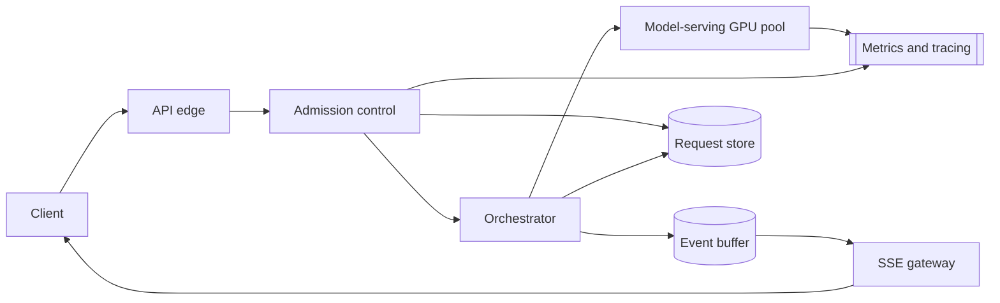

# Streaming AI Product Feature

[English](README.md) · [中文](README.zh.md)

<!-- meta:begin -->
| Type | Priority | Difficulty | Roles | Topics | Round |
| --- | --- | --- | --- | --- | --- |
| System design | ★☆☆☆☆ | — | SWE | streaming, api-design, rate-limiting, fullstack | Onsite |
<!-- meta:end -->

## Problem

Design the backend and client-facing API for an AI-assisted rewrite feature inside a collaborative
document editor. A user selects a passage of text and picks an instruction — one of four presets
(*Improve writing*, *Make shorter*, *Make longer*, *Fix grammar*) or a free-form instruction they type
themselves — and the assistant streams a suggested rewrite into a panel next to the selection as it is
generated; the user can accept it (replacing the selection), discard it, or try again. The generated text
must appear incrementally, token by token, rather than only once the full rewrite is ready, and the
feature must hold up under a large number of concurrent users.

The document editor itself — its collaborative sync, storage, and search — is out of scope, and so is the
language model: it runs behind an internal streaming completion service, reachable as a GPU-bound unit of
work with these given characteristics:

- time to first token: 400 ms on average, for the prompt lengths this feature sends;
- steady-state generation rate once decoding starts: 35 tokens/sec per stream;
- concurrency: each GPU replica serves up to 20 concurrent streams before per-stream generation rate
  degrades;
- cancellation: when the caller closes a streaming call, the service stops that stream at its next decode
  step, and it no longer counts toward the replica's 20 concurrent streams.

Content moderation of the selection and of the model's output happens inside that service and is not
designed further here.

Scale for this design:

- 5,000,000 daily active users of the editor; 6% of them use the rewrite feature at least once on a given
  day, averaging 4 invocations each, for 1,200,000 rewrite requests/day.
- Usage concentrates in business hours across time zones; the peak submission rate runs at 5x the daily
  average.
- An average request carries 220 input tokens (the selection, surrounding-paragraph context, and the
  instruction) and produces 180 output tokens.
- The model-serving GPU time is charged back internally at $0.05 per 1,000 input tokens and $0.15 per
  1,000 output tokens.

In scope: the client-facing request/response API and its streaming transport; admission control,
queueing, and overload behavior in front of the model-serving pool; caching and cost controls; the
client's incremental rendering and its recovery from a dropped stream or a request error; monitoring,
logging, and a production debugging path; and how the design changes at 10x the request rate. Out of
scope: the document editor and the model itself, as above, and authentication (assume a valid,
already-verified user identity arrives with every request).

Produce:

1. A requirements and scale estimate: average and peak request rate, concurrent streams in flight
   (Little's law), GPU replicas needed, egress bandwidth, and daily token cost.
2. A data model and the core client-facing API (start a rewrite, stream it, cancel it, check its status).
3. An architecture diagram, a walk-through of one request along it, and what you would monitor and how
   you would debug a slow or failed request.
4. Deep dives into: the streaming transport and how a client's cancellation stops generation on the
   model-serving side; admission control, queueing, overload degradation, and cost control; and the
   frontend's incremental rendering and its recovery from an interrupted stream or a failed request. For
   each, compare at least two alternatives, say which you would pick, and state the cost.
5. How the design changes at 10x the request rate.

## Reference solution

<details>
<summary>Show the reference solution</summary>

Two points worth confirming first: whether a user can have more than one rewrite panel open at once, and
how much surrounding context goes into the prompt. This design allows several concurrent requests per
user within their budget and sends a fixed window of surrounding text, not the whole document.

### Requirements and scale

**Request rate.** $1{,}200{,}000$ requests/day average to $\approx 13.9$ requests/sec; at 5x that for the
daily peak, peak submissions run at $\approx 69.4$ requests/sec.

**Service time and concurrency.** Time to first token (400 ms) plus decode time for the average 180
output tokens at 35 tokens/sec, $W = 0.4 + 180/35 \approx 5.54$ s — the time one request occupies a
model-serving concurrency slot. By Little's law, $L = \lambda \cdot W$: at peak,
$L_{\text{peak}} = 69.4 \times 5.54 \approx 385$ concurrent streams.

**GPU replicas needed.** At 20 concurrent streams per replica, $385 / 20 \approx 19.2$ replicas cover
peak load exactly; with 20% headroom for instances warming up or failing a health check,
$19.2 \times 1.2 \approx 23.1$, rounded up to **24 replicas**, draining
$24 \times 20 / 5.54 \approx 86.6$ requests/sec — peak load runs it at $\approx 80\%$ utilization.

**Egress bandwidth.** Each token leaves as its own SSE event (`id:`, `event:`, and a short JSON `data:`
line, about 55 bytes) plus HTTP/2 and TLS framing, about 100 bytes on the wire. Peak egress is
$385 \times 35 \times 100 \approx 1.35$ MB/s, about 11 Mbps — negligible.

**Daily token cost.** $1{,}200{,}000$ requests/day at 220 input and 180 output tokens average to
$264{,}000{,}000$ input and $216{,}000{,}000$ output tokens/day; at the given \$0.05 and \$0.15 per 1,000
tokens, that is \$13,200 + \$32,400 = **\$45,600/day**, about \$0.038/request.

**At 10x.** $12{,}000{,}000$ requests/day put peak submissions at $\approx 694$/sec, concurrent streams
at $\approx 3{,}849$, and the replica count at $\approx 231$, at $\approx$
\$456,000/day ($\approx$ \$166M/year). The GPU pool is the first bottleneck: it grows linearly, costs the
most, and has a procurement lead time. Next is whatever grows with tokens rather than requests: the event
buffer takes one append per token, $3{,}849 \times 35 \approx 135{,}000$/sec at 10x peak, so it is
sharded by `request_id`, and the request store is written only at state transitions, never per token. The
edge, admission control, and SSE gateway just add instances. The design changes are the per-user cost
quota and a larger default share of traffic on the smaller degrade-ladder model below.

### Data model and API

**RewriteRequest** — `request_id`, `user_id`, `document_id`, `idempotency_key` (unique per `user_id`),
`instruction_type` (`improve | shorten | lengthen | fix_grammar | custom`), `instruction_text` (`custom`
only), `input_tokens`, `output_token_cap` (400 here, about twice the average output), `status`
(`queued | admitted | streaming | completed | cancelled | failed`), `cancel_requested`,
`orchestrator_id`, `model_replica_id`, `output_tokens`, `output_text`, `cost_usd`, `created_at`,
`completed_at`.

**StreamEvent** — in an in-memory event buffer shared by all gateway instances and keyed by `request_id`,
which holds a request's whole stream (at most `output_token_cap` + 1 events) until a few minutes after
its terminal event: `request_id`, `seq` (also sent as the SSE `id`), `type` (`token | done | error`),
`payload`, `emitted_at`.

**RateBudget** — `user_id`, `balance_usd` (the bucket's level, in chargeback cost), `holds`
(`{request_id: (amount_usd, expires_at)}` for in-flight requests), `last_refill_at`,
`daily_cost_cap_usd`.

Core API:

1. `POST /v1/rewrites` —
   `{document_id, selection_text, context_text, instruction_type, instruction_text?, idempotency_key}` →
   `202 {request_id, status, stream_url}`; `429` when the user's budget or daily quota cannot cover the
   hold, `503` when the queue and the fallback pool are both full, each with a `Retry-After` header.
2. `GET /v1/rewrites/{request_id}/stream` — an SSE endpoint; replays buffered events after
   `Last-Event-ID` (sent by `EventSource` on reconnect) or `?after=<seq>` (on a connection the client
   opens itself), then follows live ones. Emits `token` (`{seq, text}`), `done`
   (`{finish_reason, output_tokens}`), and `error` (`{code, message, retryable}`) events.
3. `POST /v1/rewrites/{request_id}/cancel` — idempotent; sets `cancel_requested` and signals the
   orchestrator holding the model call. Returns the resulting `status`.
4. `GET /v1/rewrites/{request_id}` — current `status`, plus `output_tokens` and `output_text` once
   `completed`; used after a page reload.

### Architecture



A submission lands at the API edge, which authenticates it and hands it to admission control. A known
`(user_id, idempotency_key)` returns the existing request. Otherwise admission control places a hold on
the caller's `RateBudget`, checks queue depth, and inserts the `RewriteRequest` row under a unique
constraint on that pair before acknowledging, so the client never holds a `request_id` the store has no
record of (a concurrent duplicate that loses the insert releases its hold). The orchestrator takes the
request from the queue, assembles the prompt (the shared system and preset-instruction prefix first, then
context, selection, and any custom instruction), and opens a streaming call to the model-serving pool,
claiming a concurrency slot. It appends each token to the event buffer; the SSE gateway tails the buffer
and forwards new events, and because the buffer lives outside the gateway, a reconnect can land on any
gateway instance. On completion the orchestrator writes `output_tokens`, `output_text`, and `cost_usd`,
settles the hold, and a `done` event closes the stream.

What to watch: submit-to-first-rendered-token time and stream completion rate, measured in the client (a
buffering proxy shows up only there); per-replica time to first token and tokens/sec, apart from queue
wait; queue depth against a flat pool; `429`, `503`, and cancellation rates; `cost_usd` by
`instruction_type`, where a prompt change that lengthens outputs shows up before the monthly bill. Every
hop tags its logs with `request_id`, so one trace shows a slow or failed rewrite's admission decision,
queue wait, replica, and token timings.

### Deep dives

**Streaming transport and cancellation.**

- *WebSocket*: full duplex, worth it when the client streams messages up or the server pushes events
  nobody asked for. Here the only client-to-server signal after submission is an occasional cancel, which
  a plain `POST` carries; a WebSocket would also need its own resume protocol, and some enterprise
  proxies block the `Upgrade` handshake.
- *SSE* (chosen): one-directional, server to client, which is all this feature needs; it rides ordinary
  HTTP with no `Upgrade` to block, as long as every proxy on the path passes the response through
  unbuffered, or tokens arrive in batches. `EventSource` reconnects on its own and sends the last `id` it
  saw as `Last-Event-ID`, so the gateway replays only the missed events. It issues only `GET`s and cannot
  set request headers (identity rides on a cookie or a signed `stream_url`), hence the split between
  `POST` to create and `GET` to stream, at the price of one extra round trip; a `POST` that streams its
  own response must be read with `fetch`, without the built-in reconnect. Over HTTP/1.1 browsers allow
  only six connections per host across all tabs; HTTP/2 multiplexes the streams over one.

Cancellation is a separate `POST /cancel`, since SSE has no client-to-server direction. It sets
`cancel_requested` (a still-`queued` request just leaves the queue) and calls the orchestrator recorded
on the row, which closes its streaming call; the model service then stops that stream at its next decode
step and frees the slot, so the metered generation actually stops. A dropped connection without a cancel
(a closed tab) takes the same path after a grace window long enough for a page reload. If the
orchestrator dies, its calls close with it; a sweeper releases the expired hold in full and marks the
request `failed`.

**Admission control, overload, and cost control.** Two decisions sit in front of the model pool: how much
a user may spend, and what happens when the pool is full.

- *Per-request rate limiting*: simple, but "expand this into three paragraphs" and "fix this typo" cost
  very different GPU time, so counting requests bounds neither a user's spend nor a heavy user's share of
  the pool.
- *Cost-weighted token bucket* (chosen): denominated in chargeback cost. At admission a request holds its
  known input cost plus `output_token_cap` worth of output (\$0.071, against an average actual \$0.038);
  when the stream ends the hold settles to the actual cost — authorize-then-settle, as in a card payment.
  Removing the hold and deducting the cost is one update of the user's record, so settling twice is a
  no-op. A cancelled request pays for the tokens generated, a serving-side failure pays nothing, and a
  hold past `expires_at` (the longest possible generation plus margin) is released in full. Cost: budget
  sits reserved during the generation, in exchange for an exact spend bound.

A request that clears the budget check still needs a free concurrency slot.

- *Unbounded queue*: never rejects, but a request that joins behind $n$ others waits for $n$ slots to
  free, which a full pool does at its drain rate $\mu \approx 86.6$ requests/sec, so
  $W_q \approx n / \mu$. A surge to 100 requests/sec grows the queue by $100 - \mu \approx 13$ per
  second; two minutes of it leave about 1,600 entries, a 19-second wait, for an answer that is stale by
  then and still costs a full generation.
- *Bounded queue* (chosen): the same relation sets the cap, $L_q = \mu \cdot W_q$ for a 2-s wait target,
  $86.6 \times 2 \approx 173$, rounded down to 150 and recomputed from the live count of healthy
  replicas. A request past the cap is degraded: first to a smaller, faster model on its own
  always-available pool, lower quality but a complete answer; if that pool is saturated too, `503` with a
  jittered `Retry-After` of a few seconds (a full queue drains in $150 / 86.6 \approx 1.7$ s), so
  rejected clients do not return in lockstep.

Beyond admission: a cache of whole responses keyed on the prompt would almost never hit, since selections
and their context differ across documents, *Try again* must draw a new sample anyway, and a resent click
is already answered by the idempotency key. What repeats is the head of the prompt, the system and preset
instructions, whose key-value (KV) cache the model service can reuse instead of recomputing. A hit needs
the prompt to match the cached prefix token for token from its first token (a timestamp placed ahead of
it defeats it) and the cache to be resident on the serving replica; with a handful of distinct prefixes,
every replica keeps them all warm. It saves prefill compute and time to first token for those tokens
only; decode, about 5.1 s of each 5.5-s slot, is untouched, so the replica count barely moves. `cost_usd`
also rolls up per user against a daily quota separate from the bucket, a ceiling even for a user who
never exceeds the rate.

**Frontend rendering and error recovery.**

- *Re-parse and re-render the whole text on each event*: simple and always consistent, but total work
  grows quadratically with length, and a resume that replays a few hundred buffered events at once
  triggers a few hundred full renders in one burst.
- *Append-only incremental rendering* (chosen): events append to a text buffer and at most one render per
  animation frame consumes what has arrived, so a replay burst costs one render. Only the block still
  being written is re-parsed, and a construct not yet closed (an open code fence, an unmatched bold
  marker) is rendered as if closed, so no stray asterisk or broken code block flashes. `done` triggers
  one full re-parse.

An interrupted stream can resume or restart. *Resume* fits a transport-only failure: `EventSource`'s own
reconnect sends `Last-Event-ID`, a connection the client reopens passes `?after=` with the last rendered
`seq`, and the gateway replays the buffered events after it while the model, if still running, keeps
writing into the buffer; this works while the request is `streaming` or `completed` and its buffer entry
is alive. *Restart* fits a failed request (the replica crashed, the store says `failed` or `cancelled`):
the reconnect gets an `error` event at once and the client offers a fresh attempt. On `done` the client
closes its `EventSource`, which would otherwise reconnect as soon as the response ends.

Errors are shown by what they call for: a transient failure (a dropped stream, a gateway error) retries
with backoff behind a "reconnecting…" state; `429` and `503` show the wait and a manual retry that honors
`Retry-After`; a permanent failure (a content-policy rejection, a malformed selection) shows a
non-retryable message. A resend of the same `POST` (its response was lost) carries the `idempotency_key`
minted at the click, and the unique constraint on `(user_id, idempotency_key)` returns the existing
request rather than starting, and billing, a second generation. *Try again* and a restart after `failed`
use a new key; the failed attempt's hold was already released, so nothing is charged twice.

### Follow-ups

- Accepting replaces the selection only if its range still holds the original text; a collaborator may
  have edited it while the rewrite streamed, in which case the panel offers to insert the rewrite
  instead.

<details>
<summary>Estimate check (runnable)</summary>

```python
import math

dau, ai_pct, invocations = 5_000_000, 0.06, 4
daily_requests = dau * ai_pct * invocations
assert daily_requests == 1_200_000

avg_qps = daily_requests / 86_400
assert round(avg_qps, 1) == 13.9

peak_factor = 5
peak_qps = avg_qps * peak_factor
assert round(peak_qps, 1) == 69.4

ttft_sec, gen_rate, avg_output_tokens = 0.4, 35, 180
gen_time = avg_output_tokens / gen_rate
W = ttft_sec + gen_time                            # service time per concurrency slot
assert round(W, 2) == 5.54
assert round(gen_time, 1) == 5.1 and round(W, 1) == 5.5   # decode dominates the slot

L_peak = peak_qps * W                               # Little's law: L = lambda * W
assert round(L_peak) == 385

concurrency_per_replica = 20
raw_replicas = L_peak / concurrency_per_replica
headroom = 0.2
target_replicas = math.ceil(raw_replicas * (1 + headroom))
assert target_replicas == 24

mu_total = target_replicas * concurrency_per_replica / W   # requests/sec the pool can drain
assert round(mu_total, 1) == 86.6
utilization = peak_qps / mu_total
assert round(utilization, 2) == 0.80

# one SSE event per token, as the stream endpoint emits it
sample_event = 'id: 57\nevent: token\ndata: {"seq":57,"text":" clear"}\n\n'
assert 50 <= len(sample_event.encode()) <= 60       # "about 55 bytes" before HTTP/2 + TLS framing
bytes_per_token = 100
peak_egress_Bps = L_peak * gen_rate * bytes_per_token
assert round(peak_egress_Bps / 1e6, 2) == 1.35
mbps = peak_egress_Bps * 8 / 1e6
assert round(mbps) == 11

avg_input_tokens = 220
daily_input_tokens = daily_requests * avg_input_tokens
daily_output_tokens = daily_requests * avg_output_tokens
assert daily_input_tokens == 264_000_000
assert daily_output_tokens == 216_000_000

cost_input = daily_input_tokens / 1000 * 0.05
cost_output = daily_output_tokens / 1000 * 0.15
total_cost = cost_input + cost_output
assert cost_input == 13_200
assert cost_output == 32_400
assert total_cost == 45_600
assert round(total_cost / daily_requests, 3) == 0.038

# ---- cost-weighted bucket: hold at admission vs average actual ----
output_token_cap = 400
assert round(output_token_cap / avg_output_tokens) == 2   # "about twice the average output"
hold_usd = avg_input_tokens / 1000 * 0.05 + output_token_cap / 1000 * 0.15
assert round(hold_usd, 3) == 0.071

# ---- 10x ----
daily_requests_10x = daily_requests * 10
avg_qps_10x = daily_requests_10x / 86_400
peak_qps_10x = avg_qps_10x * peak_factor
L_peak_10x = peak_qps_10x * W
raw_replicas_10x = L_peak_10x / concurrency_per_replica
target_replicas_10x = math.ceil(raw_replicas_10x * (1 + headroom))
assert round(peak_qps_10x) == 694
assert round(L_peak_10x) == 3849
assert target_replicas_10x == 231

token_appends_10x = L_peak_10x * gen_rate            # event-buffer appends/sec at 10x peak
assert round(token_appends_10x, -3) == 135_000

total_cost_10x = total_cost * 10
assert total_cost_10x == 456_000
annual_10x_millions = total_cost_10x * 365 / 1e6
assert round(annual_10x_millions) == 166

# ---- admission control: bounded queue sized off Little's law ----
wait_target_sec = 2
Lq = mu_total * wait_target_sec
assert round(Lq) == 173
queue_cap = 150
assert queue_cap <= Lq and round(queue_cap / mu_total, 1) == 1.7   # a full queue drains in ~1.7 s

# ---- unbounded queue under a surge above the drain rate ----
surge_qps, surge_sec = 100, 120
growth = surge_qps - mu_total                        # queue grows by lambda - mu per second
assert round(growth) == 13
queued = growth * surge_sec
assert round(queued, -2) == 1_600
assert round(queued / mu_total) == 19                # wait of the last arrival, W_q = n / mu

print("all requirements-and-scale numbers check out")
```

</details>

</details>
