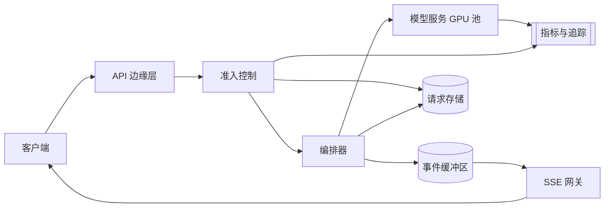

# 流式 AI 产品功能

[English](README.md) · [中文](README.zh.md)

<!-- meta:begin -->
| 题型 | 优先级 | 难度 | 岗位 | 考点 | 轮次 |
| --- | --- | --- | --- | --- | --- |
| 系统设计 | ★☆☆☆☆ | — | SWE | streaming, api-design, rate-limiting, fullstack | 现场面 |
<!-- meta:end -->

## 题目

设计一个协作文档编辑器内 AI 辅助改写功能的后端和面向客户端的 API。用户选中一段文本，选择一种指令——四个预设之一（*改进表达*、*精简*、*扩写*、*修正语法*），或者自己输入一条自由文本指令——助手随即在选区旁边的面板里流式生成一段改写建议；用户可以采纳（替换选区）、丢弃，或者重新生成一次。生成的文本必须逐 token 增量出现，而不是等整段改写完成后才显示，并且这个功能要在大量并发用户下依然可用。

文档编辑器本身——它的协作同步、存储、搜索——不在范围内，语言模型本身同样不在范围内：它运行在一个内部的流式补全（completion）服务背后，可以看作一个受 GPU 限制的工作单元，具备下列给定特征：

- 首 token 时间（time to first token）：平均 400 毫秒，针对这个功能发送的提示词长度；
- 稳定生成阶段的速率：开始解码后每条流每秒 35 个 token；
- 并发上限：每个 GPU 副本最多服务 20 条并发流，超过后单流生成速率会下降；
- 取消：调用方关闭一次流式调用后，服务在下一个解码步（decode step）停止这条流，它不再占用该副本 20 条并发流中的名额。

对选区和模型输出的内容审核发生在那个服务内部，这里不再展开设计。

这次设计的规模：

- 编辑器有 5,000,000 日活用户；其中 6% 的人当天至少用过一次改写功能，平均每人调用 4 次，合计每天 1,200,000 次改写请求。
- 使用集中在各时区的工作时间内；峰值提交速率是日均值的 5 倍。
- 一次请求平均携带 220 个输入 token（选区、周围段落的上下文，以及指令）并产生 180 个输出 token。
- 模型服务的 GPU 时间按内部结算价计费：每 1,000 个输入 token \$0.05，每 1,000 个输出 token \$0.15。

范围内：面向客户端的请求/响应 API 及其流式传输方式；模型服务池前的准入控制、排队与过载行为；缓存与成本控制；前端的增量渲染，以及它从流中断或请求出错中的恢复；监控、日志与线上排障路径；以及这套设计在流量涨到 10 倍时会怎样变化。范围外：如上所述的文档编辑器本身和模型本身；身份认证（假设每个请求到达时都已带有一个有效、已验证的用户身份）。

要产出：

1. 需求与规模估算：平均和峰值请求速率、同时在跑的并发流数（Little 定律）、需要的 GPU 副本数、出口带宽，以及每天的 token 成本。
2. 数据模型，以及面向客户端的核心 API（发起一次改写、流式接收、取消、查询状态）。
3. 一张架构图，沿着一次请求把整条路径走一遍，并说明要监控什么、一次慢或失败的请求怎么排查。
4. 深入话题：流式传输方式，以及客户端的取消如何在模型服务一端真正停止生成；准入控制、排队、过载降级与成本控制；以及前端的增量渲染，及其从流中断或请求失败中的恢复。每个话题至少比较两种方案，说明选哪个，并给出代价。
5. 这套设计在请求量涨到 10 倍时会怎样变化。

## 参考解答

<details>
<summary>展开参考解答</summary>

动手设计之前值得先确认两点：一个用户能否同时打开不止一个改写面板，以及提示词里要带多少周围的上下文。这里的设计允许一个用户在自己的限额内发起多个并发请求，并且只带一个固定窗口的周围文本，而不是整篇文档。

### 需求与规模

**请求速率。** 每天 $1{,}200{,}000$ 次请求，平均约 $13.9$ 次/秒；日峰值是这个数字的 5 倍，峰值提交约 $69.4$ 次/秒。

**服务时间与并发。** 首 token 时间（400 毫秒）加上平均 180 个输出 token 按 35 token/秒解码所需的时间，$W = 0.4 + 180/35 \approx 5.54$ 秒——这是一个请求占用一个模型服务并发槽位（concurrency slot）的时长。由 Little 定律，$L = \lambda \cdot W$：峰值时，$L_{\text{peak}} = 69.4 \times 5.54 \approx 385$ 条并发流。

**需要的 GPU 副本数。** 按每副本 20 条并发流，$385 / 20 \approx 19.2$ 个副本恰好覆盖峰值负载；加 20% 余量应对正在启动或健康检查失败的实例，$19.2 \times 1.2 \approx 23.1$，向上取整为 **24 个副本**，能处理 $24 \times 20 / 5.54 \approx 86.6$ 次/秒——峰值负载下利用率约 $80\%$。

**出口带宽。** 每个 token 作为一个单独的 SSE 事件发出（`id:`、`event:` 两行加一行简短的 JSON `data:`，约 55 字节），再加上 HTTP/2 和 TLS 的分帧开销，在网络上约占 100 字节。峰值出口流量为 $385 \times 35 \times 100 \approx 1.35$ MB/s，约 11 Mbps，可以忽略不计。

**每天的 token 成本。** $1{,}200{,}000$ 次请求/天，按平均 220 个输入和 180 个输出 token，合计 $264{,}000{,}000$ 个输入 token 和 $216{,}000{,}000$ 个输出 token/天；按给定的每 1,000 token \$0.05 和 \$0.15，即 \$13,200 + \$32,400 = **\$45,600/天**，约 \$0.038/请求。

**涨到 10 倍。** $12{,}000{,}000$ 次请求/天使峰值提交达到约 $694$ 次/秒，并发流约 $3{,}849$ 条，副本数约 $231$ 个，每天成本约 \$456,000（约 \$166M/年）。最先成为瓶颈的是 GPU 池：它随请求量线性增长、花费最大，采购还有提前期。其次是随 token 数而不是请求数增长的部分：事件缓冲区每个 token 追加一次，10 倍峰值时约 $3{,}849 \times 35 \approx 135{,}000$ 次/秒，所以按 `request_id` 分片；请求存储只在状态变化时写，从不逐 token 写。边缘层、准入控制和 SSE 网关加实例即可。设计上要改的是按用户的成本配额，以及默认让更大比例的流量走下面降级序列里那个更小的模型。

### 数据模型与 API

**RewriteRequest（改写请求）**——`request_id`、`user_id`、`document_id`、`idempotency_key`（在同一个 `user_id` 下唯一）、`instruction_type`（`improve | shorten | lengthen | fix_grammar | custom`）、`instruction_text`（仅 `custom` 时有值）、`input_tokens`、`output_token_cap`（这里取 400，约为平均输出的两倍）、`status`（`queued | admitted | streaming | completed | cancelled | failed`）、`cancel_requested`、`orchestrator_id`、`model_replica_id`、`output_tokens`、`output_text`、`cost_usd`、`created_at`、`completed_at`。

**StreamEvent（流事件）**——保存在一个由所有网关实例共享、按 `request_id` 划分的内存事件缓冲区里；它保存一个请求的整条流（最多 `output_token_cap` + 1 条事件），直到终止事件之后几分钟：`request_id`、`seq`（同时作为 SSE 的 `id` 发出）、`type`（`token | done | error`）、`payload`、`emitted_at`。

**RateBudget（限额）**——`user_id`、`balance_usd`（桶里的余额，单位是内部结算成本）、`holds`（在途请求的预留，`{request_id: (amount_usd, expires_at)}`）、`last_refill_at`、`daily_cost_cap_usd`。

核心接口：

1. `POST /v1/rewrites`——`{document_id, selection_text, context_text, instruction_type, instruction_text?, idempotency_key}` → `202 {request_id, status, stream_url}`；用户的限额或每日配额不够这笔预留时返回 `429`，队列和备用池都满时返回 `503`，两者都带 `Retry-After` 头。
2. `GET /v1/rewrites/{request_id}/stream`——一个 SSE 端点；先回放缓冲区里 `Last-Event-ID`（`EventSource` 重连时发送）或 `?after=<seq>`（客户端自己新开的连接用）之后的事件，再接着推送新事件。发出 `token`（`{seq, text}`）、`done`（`{finish_reason, output_tokens}`）、`error`（`{code, message, retryable}`）三类事件。
3. `POST /v1/rewrites/{request_id}/cancel`——幂等（idempotent）；设置 `cancel_requested`，并通知持有这次模型调用的编排器。返回处理后的 `status`。
4. `GET /v1/rewrites/{request_id}`——当前 `status`，`completed` 后还有 `output_tokens` 和 `output_text`；用于页面刷新后恢复状态。

### 架构



一次提交先到 API 边缘层，边缘层验证身份后交给准入控制。已经见过的 `(user_id, idempotency_key)` 直接返回已有请求；否则准入控制在调用方的 `RateBudget` 上预留额度、检查队列深度，然后在这对字段的唯一约束下插入 `RewriteRequest` 记录，再确认给客户端，这样客户端拿到的 `request_id` 在请求存储里一定有记录（并发的重复请求插入失败，就释放自己的预留）。编排器从队列里取出请求，组装提示词（共享的系统指令与预设指令前缀在前，然后是上下文、选区和任何自定义指令），向模型服务池发起一次流式调用，占用一个并发槽位。它把每个 token 追加进事件缓冲区；SSE 网关持续读取这个缓冲区、转发新事件，而且因为缓冲区不在网关进程里，重连落到任何一个网关实例上都行。生成完成后，编排器写入 `output_tokens`、`output_text` 和 `cost_usd`，结算预留，一个 `done` 事件关闭这条流。

要看什么：在客户端测量从提交到第一个 token 显示出来的时间和流的完成率（缓冲了流的代理只会在这里暴露）；各副本的首 token 时间和每秒 token 数，与排队时间分开统计；池子规模不变时的队列深度；`429`、`503` 和取消的比例；按 `instruction_type` 汇总的 `cost_usd`，拉长输出的提示词改动会先在这里露出来，早于月度账单。每一跳的日志都带着 `request_id`，一次慢或失败的改写从一条追踪里就能看到准入决策、排队时间、副本和它的 token 级别耗时。

### 深入话题

**流式传输与取消。**

- *WebSocket*：全双工，适合客户端要持续上行消息、或服务端要推送客户端没主动问过的事件。这里提交之后客户端到服务端唯一的信号是偶尔的取消，一次普通的 `POST` 就够了；WebSocket 还得自己设计断线续传的协议，部分企业网络的代理也会直接拦下 `Upgrade` 握手。
- *SSE*（选择的方案）：单向，服务端到客户端，正好是这个功能需要的全部；它走普通 HTTP，没有 `Upgrade` 可拦，前提是路径上的每一层代理都不缓冲响应，否则 token 会成批到达。`EventSource` 会自动重连，并把收到的最后一个 `id` 作为 `Last-Event-ID` 发回，网关只需回放漏掉的事件。它只能发 `GET`、不能设置请求头（身份只能放在 cookie 或签名过的 `stream_url` 里），所以发起（`POST`）和接收流（`GET`）拆成两个请求，代价是多一次往返；让 `POST` 直接流式返回的话，就得用 `fetch` 读流，没有内置的重连。浏览器在 HTTP/1.1 下对每个主机只开六条连接，所有标签页共享；HTTP/2 把这些流复用在一条连接上。

取消是一次单独的 `POST /cancel`，因为 SSE 没有客户端到服务端的方向。它设置 `cancel_requested`（还在 `queued` 的请求直接移出队列），并调用记录里的那个编排器实例，由它关闭这次流式调用；模型服务随即在下一个解码步停止这条流、释放槽位，被计费的生成才真正停下。连接在没有显式取消的情况下断开（关掉标签页）时，过一段足够页面重新加载的宽限期后走同一条路径。编排器本身崩溃时，它的调用随之关闭；一个清理任务在预留到期后全额释放这笔预留，并把请求标为 `failed`。

**准入控制、过载与成本控制。** 模型池前面有两个决定要做：一个用户能花多少，以及池子满了之后怎么办。

- *按请求计数限流*：简单，但“把这段扩写成三段”和“修一个错别字”耗费的 GPU 时间差别很大，按请求数计数既限制不了一个用户的开销，也限制不了一个重度用户在池子里占的份额。
- *按成本加权的令牌桶*（token bucket，选择的方案）：单位是内部结算成本。准入时，一个请求预留它已知的输入成本加上 `output_token_cap` 个输出 token 的成本（\$0.071，而实际平均只有 \$0.038）；流结束后，预留按实际成本结算——先授权、后入账（authorize-then-settle），和银行卡支付一样。删掉这笔预留和扣掉实际成本在用户记录的一次更新里完成，所以重复结算不起作用。取消的请求按已生成的 token 付费，模型服务一侧的失败不收费，超过 `expires_at`（最长可能的生成时间加余量）的预留全额释放。代价：生成期间这份额度被占用，换来的是对开销的精确上限。

通过限额检查的请求还需要一个空闲的并发槽位。

- *无界队列*：从不拒绝，但排在 $n$ 个请求之后的请求要等 $n$ 个槽位空出来，满载的池子以处理速率 $\mu \approx 86.6$ 次/秒空出槽位，所以 $W_q \approx n / \mu$。到达速率涨到 100 次/秒时，队列每秒增长 $100 - \mu \approx 13$ 个；持续两分钟就积下约 1,600 个请求、19 秒的等待，等到的答案已经过时，却仍要花掉一整次生成。
- *有界队列*（bounded queue，选择的方案）：同一个关系给出上限，$L_q = \mu \cdot W_q$，等待目标取 2 秒，得 $86.6 \times 2 \approx 173$，向下取整到 150，并按当前健康副本数实时重算。超过上限的请求被降级：先路由到一个更小、更快、独占一个常备副本池的模型，质量更低，但给出完整的答案；如果这个池子也满了，返回 `503`，带一个加了随机抖动、几秒钟的 `Retry-After`（满队列 $150 / 86.6 \approx 1.7$ 秒就能排空），让被拒绝的客户端不会同时回来。

准入之外：按提示词缓存整段回答几乎不会命中，因为不同文档的选区和上下文各不相同，“重新生成”本来就要重新采样，而同一次点击的重发已经由幂等键处理了。真正重复的是提示词的开头——系统指令和预设指令——模型服务可以复用这段前缀的键值缓存（KV cache），不必重新计算。命中要求提示词从第一个 token 起与缓存的前缀逐 token 相同（放在它前面的一个时间戳就会让它失效），并且缓存就在处理这个请求的副本上；不同的前缀只有寥寥几种，每个副本都能让它们一直留在缓存里。它省下的只是这些 token 的预填充（prefill）算力和对应的首 token 时间；解码占每个 5.5 秒槽位中的约 5.1 秒，不受影响，所以副本数几乎不变。`cost_usd` 还按用户汇总，对照一个独立于令牌桶的每日配额：一个从不超过速率限制的用户，一天的花费也有上限。

**前端渲染与错误恢复。**

- *每个事件都整体重新解析、重新渲染*：简单，结果也始终一致，但总工作量随长度平方增长；而且一次续传会一下子回放几百条缓冲的事件，触发几百次完整渲染。
- *只追加的增量渲染*（incremental rendering，选择的方案）：事件追加进一个文本缓冲区，每个动画帧最多渲染一次，处理这一帧之前到达的全部内容，所以一次回放只花一次渲染。只重新解析还在写的那个块；还没闭合的结构（一段没结束的代码围栏、一个不成对的加粗标记）按已经闭合来渲染，所以不会闪出孤立的星号或断掉的代码块。`done` 触发一次完整的重新解析。

一条被打断的流可以续传或者整体重试。*续传*适合纯传输层的失败：`EventSource` 自己重连时带上 `Last-Event-ID`，客户端自己重新打开的连接用 `?after=` 带上渲染到的最后一个 `seq`，网关回放缓冲区里那之后的事件；模型如果还在跑，就继续往缓冲区里写。前提是请求还处于 `streaming` 或 `completed`，且缓冲区条目还没过期。*整体重试*适合请求本身失败的情况（副本崩溃，或者请求存储里已经是 `failed` 或 `cancelled`）：重连会立刻收到一个 `error` 事件，客户端提供一次重新开始的操作。收到 `done` 后客户端要关掉 `EventSource`，否则响应一结束它就会自动重连。

错误按照它们该引出的动作来展示：瞬时失败（流中断、网关报错）在“重新连接中……”状态下自动退避重试；`429` 和 `503` 展示预计等待时间，以及一个遵循 `Retry-After` 的手动重试按钮；永久性失败（内容策略拒绝、选区格式不合法）展示一条不可重试的提示。同一个 `POST` 的重发（上一次的响应丢了）带着点击时生成的 `idempotency_key`，`(user_id, idempotency_key)` 上的唯一约束让它返回已有的请求，而不是再发起、再计费一次生成。“重新生成”和 `failed` 之后的重试是新的尝试，用新的键；失败那次的预留已经释放，所以不会重复扣费。

### 追问

- 采纳时，只有选区所在的范围里仍然是原来的文本，才直接替换；改写流式生成期间协作者可能已经改了这段，这时面板改为提供插入改写结果的选项。

<details>
<summary>估算核对（可运行）</summary>

```python
import math

dau, ai_pct, invocations = 5_000_000, 0.06, 4
daily_requests = dau * ai_pct * invocations
assert daily_requests == 1_200_000

avg_qps = daily_requests / 86_400
assert round(avg_qps, 1) == 13.9

peak_factor = 5
peak_qps = avg_qps * peak_factor
assert round(peak_qps, 1) == 69.4

ttft_sec, gen_rate, avg_output_tokens = 0.4, 35, 180
gen_time = avg_output_tokens / gen_rate
W = ttft_sec + gen_time                            # service time per concurrency slot
assert round(W, 2) == 5.54
assert round(gen_time, 1) == 5.1 and round(W, 1) == 5.5   # decode dominates the slot

L_peak = peak_qps * W                               # Little's law: L = lambda * W
assert round(L_peak) == 385

concurrency_per_replica = 20
raw_replicas = L_peak / concurrency_per_replica
headroom = 0.2
target_replicas = math.ceil(raw_replicas * (1 + headroom))
assert target_replicas == 24

mu_total = target_replicas * concurrency_per_replica / W   # requests/sec the pool can drain
assert round(mu_total, 1) == 86.6
utilization = peak_qps / mu_total
assert round(utilization, 2) == 0.80

# one SSE event per token, as the stream endpoint emits it
sample_event = 'id: 57\nevent: token\ndata: {"seq":57,"text":" clear"}\n\n'
assert 50 <= len(sample_event.encode()) <= 60       # "about 55 bytes" before HTTP/2 + TLS framing
bytes_per_token = 100
peak_egress_Bps = L_peak * gen_rate * bytes_per_token
assert round(peak_egress_Bps / 1e6, 2) == 1.35
mbps = peak_egress_Bps * 8 / 1e6
assert round(mbps) == 11

avg_input_tokens = 220
daily_input_tokens = daily_requests * avg_input_tokens
daily_output_tokens = daily_requests * avg_output_tokens
assert daily_input_tokens == 264_000_000
assert daily_output_tokens == 216_000_000

cost_input = daily_input_tokens / 1000 * 0.05
cost_output = daily_output_tokens / 1000 * 0.15
total_cost = cost_input + cost_output
assert cost_input == 13_200
assert cost_output == 32_400
assert total_cost == 45_600
assert round(total_cost / daily_requests, 3) == 0.038

# ---- cost-weighted bucket: hold at admission vs average actual ----
output_token_cap = 400
assert round(output_token_cap / avg_output_tokens) == 2   # "about twice the average output"
hold_usd = avg_input_tokens / 1000 * 0.05 + output_token_cap / 1000 * 0.15
assert round(hold_usd, 3) == 0.071

# ---- 10x ----
daily_requests_10x = daily_requests * 10
avg_qps_10x = daily_requests_10x / 86_400
peak_qps_10x = avg_qps_10x * peak_factor
L_peak_10x = peak_qps_10x * W
raw_replicas_10x = L_peak_10x / concurrency_per_replica
target_replicas_10x = math.ceil(raw_replicas_10x * (1 + headroom))
assert round(peak_qps_10x) == 694
assert round(L_peak_10x) == 3849
assert target_replicas_10x == 231

token_appends_10x = L_peak_10x * gen_rate            # event-buffer appends/sec at 10x peak
assert round(token_appends_10x, -3) == 135_000

total_cost_10x = total_cost * 10
assert total_cost_10x == 456_000
annual_10x_millions = total_cost_10x * 365 / 1e6
assert round(annual_10x_millions) == 166

# ---- admission control: bounded queue sized off Little's law ----
wait_target_sec = 2
Lq = mu_total * wait_target_sec
assert round(Lq) == 173
queue_cap = 150
assert queue_cap <= Lq and round(queue_cap / mu_total, 1) == 1.7   # a full queue drains in ~1.7 s

# ---- unbounded queue under a surge above the drain rate ----
surge_qps, surge_sec = 100, 120
growth = surge_qps - mu_total                        # queue grows by lambda - mu per second
assert round(growth) == 13
queued = growth * surge_sec
assert round(queued, -2) == 1_600
assert round(queued / mu_total) == 19                # wait of the last arrival, W_q = n / mu

print("all requirements-and-scale numbers check out")
```

</details>

</details>
