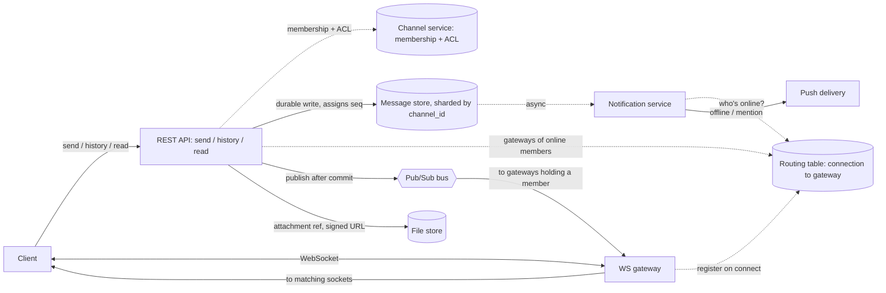

# Slack-style Messaging

[English](README.md) · [中文](README.zh.md)

<!-- meta:begin -->
| Type | Priority | Difficulty | Roles | Topics | Format | Round |
| --- | --- | --- | --- | --- | --- | --- |
| System design | ★★☆☆☆ | — | SWE · EM | messaging, pubsub, multi-device, multi-tenancy | 60 min | Phone screen · Onsite |
<!-- meta:end -->

## Problem

Design the backend for a team chat product used inside companies. Users send direct messages (DMs) to
one other person and post in channels shared by a group of people within one company's account, called a
*workspace*. A user is commonly signed in from more than one device at once — a desktop app, a phone, a
browser tab — and every one of those devices must receive a new message while it is connected. A user
must also be notified when new messages arrive and none of their devices is currently connected, and
specifically whenever a channel message @-mentions them, subject to a mute or a do-not-disturb schedule.
Users attach files to messages and can delete a message they sent, which must remove it for every
recipient. Each workspace's channels, messages and files must be completely invisible to every other
workspace, even though one backend serves all of them. Most channels a person actually posts into are
small, but a handful — a company-wide announcements channel, for instance — can grow to tens of thousands
of members.

Scale this design for:

- 200,000 workspaces and 20,000,000 registered users in total, of which 6,000,000 are active on a typical
  day.
- An active user sends about 35 messages a day on average, across DMs and channels combined —
  210,000,000 messages/day system-wide.
- A channel a person is actively posting into averages about 18 members; the largest channels in the
  largest workspaces run up to roughly 50,000 members.
- At peak, 15% of daily active users are connected at once, each with 1.3 connected devices on average.
- Target delivery latency to an online recipient: 95th percentile under 700 ms from the sender's request
  to the message appearing on a connected device.

In scope: sending and delivering DM and channel messages to every connected device of every recipient;
offline push notifications and @-mention alerts, gated by mute/DND settings; attaching and retrieving
files; deleting a message; workspace isolation; and a delivery design that keeps working as a channel
grows from a handful of members to tens of thousands. Out of scope: voice/video calls, full-text search
over history, editing a sent message, threaded replies as their own object, and the identity provider —
assume a directory service can already tell you which users belong to which workspace and channel.

Produce:

1. Requirements and a scale estimate: messages sent per second (average and peak); the number of
   concurrent WebSocket connections and how many gateway instances that requires (state your assumption
   for how many connections one instance holds); the delivery fan-out volume — deliveries per second to
   online connections — for an average channel, and separately for one of the largest channels; and the
   daily and annual growth of message storage.
2. A data model (messages, channel membership, per-user read position) and the core APIs: sending a
   message, paging through a channel's history, deleting a message, marking a channel read, and the
   WebSocket events a client receives.
3. An architecture diagram, and a walk-through of one message from the sender's client to a recipient's
   connected device.
4. Deep dives into message delivery and fan-out; ordering, deduplication and reconnection; and
   multi-tenancy and sharding.

## Reference solution

<details>
<summary>Show the reference solution</summary>

Worth confirming before designing: in a channel of tens of thousands, whether a device not showing the
channel needs each message within 700 ms or only an unread indicator, and whether offline members are
pushed every post or only @-mentions. Below, the indicator and mentions only.

### Requirements and scale

**Message rate.** $210\times10^6$ messages/day average to

$$\text{avg QPS} = \frac{210\times10^6}{86{,}400} \approx 2{,}431 \text{ messages/s.}$$

Usage concentrates in business hours, only partly spread out by time zones; a 5x peak-to-average ratio
puts the peak write rate at about $12{,}153$ messages/s.

**Connections and gateways.** At peak, 15% of the $6\times10^6$ daily actives are connected at once
($900{,}000$), each with 1.3 devices, for $900{,}000\times1.3=1{,}170{,}000$ concurrent WebSocket
connections. Budgeting 15,000 connections per gateway instance (bounded by per-connection buffers and
local fan-out cost, not raw memory) needs $\lceil 1{,}170{,}000/15{,}000\rceil=78$ instances bare; 15%
headroom for rolling deploys and failure brings the fleet to $90$.

**Average-channel fan-out.** A channel someone is actively posting into averages 18 members; assuming the
same 15% concurrency fraction holds within its membership, about $18\times0.15=2.7$ members are online at
a time, each with 1.3 devices, for $2.7\times1.3\approx3.51$ socket deliveries per message. Taking large
channels (threshold set below) as 8% of daily message volume, the other 92% — $11{,}181$ messages/s at
peak — pushes at $11{,}181\times3.51\approx39{,}244$ deliveries/s system-wide.

**Large-channel fan-out.** A 40,000-member channel, at the same 15% concurrency and 1.3 devices/member,
has $40{,}000\times0.15=6{,}000$ members online — $6{,}000\times1.3=7{,}800$ deliveries for one message if
pushed the ordinary way. Posting 5 messages/s in its busiest minute, it would alone generate $39{,}000$
deliveries/s, about as many as all small channels combined — so large channels get their own mode.

**Storage.** A message row (`message_id`, `channel_id`, `seq`, `sender_id`, average 100-byte text,
attachment references, idempotency key) is about 180 bytes: $210\times10^6\times180\text{ B}\approx37.8$
GB/day, $\approx13.8$ TB/year before replication, $\approx41.4$ TB/year at 3x replication.

### Data model and API

**Message** — `message_id` (globally unique), `channel_id`, `workspace_id`, `seq` (per-channel
position), `type` (`post` or `delete`), `sender_id`, `text` (null on a `delete` row and on a deleted
post), `attachments` (`[{file_id, name, size, content_type}]`), `target_seq` (only on `delete`: the `seq`
of the post it removes), `client_msg_id` (idempotency key, unique with `channel_id` and `sender_id`),
`created_at`.

**Channel** — `channel_id`, `workspace_id`, `kind` (`dm` or `channel`; a DM is a two-member channel),
`member_count` (picks the delivery mode), `latest_seq` (the last `seq` assigned), `name`. The row lives
on the same message-store shard as the channel's messages.

**ChannelMember** — `channel_id`, `user_id`, `workspace_id` (denormalized so every membership read is
also an isolation check), `joined_at`, `muted`.

**ReadCursor** — `user_id`, `channel_id`, `last_read_seq`, `updated_at`: one row per (user, channel), not
per message or per device; every device shows the channel as unread while `latest_seq` is past it.

**Connection** — `connection_id` (one per socket), `user_id`, `device_id`, `gateway_id`,
`connected_at`: written only on connect and disconnect. Each gateway also keeps one liveness record
with a TTL.

Core APIs:

1. `POST /channels/{channel_id}/messages` — `{client_msg_id, text, attachments}`. Appends a `post` row,
   assigning it the channel's next `seq`; a request whose `client_msg_id` was already recorded returns the
   original result. Returns `{message_id, seq, created_at}`.
2. `GET /channels/{channel_id}/messages?after_seq=&limit=` — history and gap-fill, in `seq` order; used
   for initial load, opening a large channel, and reconnect backfill.
3. `DELETE /channels/{channel_id}/messages/{message_id}` — only the sender may call this. Appends a
   `delete` row, assigning it the channel's next `seq` with `target_seq` set to the removed post's `seq`;
   deleting an already deleted post returns the first result. Returns `{seq, deleted_at}`.
4. `POST /channels/{channel_id}/read` — `{last_read_seq}`. Upserts the caller's `ReadCursor` row.
5. `GET /me/channels` — every channel the caller belongs to, with `{channel_id, last_read_seq,
   latest_seq}`; used on startup and on reconnect.

WebSocket, server → client: `message.new {channel_id, seq, message_id, sender_id, text, created_at}`;
`message.deleted {channel_id, seq, target_seq}`; `channel.activity {channel_id, latest_seq}` (large
channels: a pointer, not the body); `read.updated {channel_id, last_read_seq}` (to a user's other
devices). Client → server: `channel.focus {channel_id}` (the channel now on screen).

### Architecture



The send endpoint checks membership with the channel service, then writes the message durably to the
message store, assigning `seq` in the same transaction; the sender's response waits on this write. After
the commit the API server finds, in the routing table, the gateways holding a socket of an online member
and publishes once to each over the best-effort bus; each gateway forwards the message to its matching
local sockets. The store's write stream separately feeds the notification service, off the sender's path.
Attachments go from the client straight to the file store under a `workspace_id`-prefixed key, and only a
reference travels with the message; a download gets a short-lived signed URL only after the API checks
that the caller belongs to the message's channel and the message is not deleted.

### Deep dives

**Message delivery and fan-out.** Pushing a message the instant it is written (fan-out-on-write) is what
the 700 ms target needs; leaving it for clients to pull (fan-out-on-read) costs nothing until a client
asks, but a client that does not ask never sees it. Push is not free: one post costs the send path one
routing lookup per member and the gateways one frame per online device, so a channel of $N$ members
posting $r$ messages/s costs $N r$ lookups/s and $0.15\times1.3\times N r=0.195 N r$ frames/s. Capacity
is planned for the smooth sum of many small channels; one channel's load arrives at once and can jump
with a single incident, so no one channel may add more than 5% to the peak push volume,
$0.05\times39{,}244\approx1{,}962$ frames/s. At a busiest-minute rate of 5 messages/s that allows
$N\le1{,}962/(0.195\times5)\approx2{,}012$ (the lookups give the same bound), so the threshold is a
round **2,000 members**. Below it, the API publishes to each gateway holding an online member's socket
(every gateway subscribes to its own bus topic), and each fans out locally.

At or above it, nothing is routed per member. Each gateway subscribes to the topic of every large channel
one of its connected users belongs to (from the user's channel list at connect, updated on join and
leave), and a post is published once to that topic. Per-member routing would not narrow this anyway: with
300 of 2,000 members online, a given gateway holds none of them with probability
$(1-1/90)^{300}\approx3.5\%$. The gateway pushes the full message only to sockets that have the channel on
screen (from `channel.focus`); every other member socket gets a `channel.activity {channel_id,
latest_seq}` pointer at most once per 2 s, since a newer pointer supersedes an older one — a message body
cannot be merged that way. A client opening the channel pulls with `after_seq`. For the
40,000-member channel at 5 messages/s, its 7,800 online devices get at most $7{,}800/2=3{,}900$
pointers/s, plus one frame per message for each device viewing it, instead of $39{,}000$ messages/s.

The bus only carries a live copy to sockets connected *right now* — durability comes from the store write
and replay from `after_seq` — so a best-effort in-memory pub/sub fits, not a persistent partitioned log
with retention and consumer offsets. Broadcasting each small-channel post to all $90$ gateways would
send about 26 times the copies needed: its 3.51 sockets sit on about 3.5 gateways.

A gateway writes a `Connection` row on connect and deletes it on disconnect. No lease is needed: a socket
belongs to one process, a gateway writes only its own rows, and a duplicate copy is harmless because a
client applies events by `(channel_id, seq)` and drops repeats. What needs care is stale rows. Rows are
keyed by `connection_id`, so when a device reconnects before its old socket times out, the old gateway's
late delete removes only the old row; keyed by `(user_id, device_id)`, it would erase the new
registration and the device would silently stop receiving pushes. Each gateway refreshes its liveness
record every 3 s with a 10 s TTL, and `gateway_id` names one process lifetime; readers skip rows of a
lapsed gateway, and a sweeper deletes them. A gateway that loses contact with the routing store or the
bus closes its client sockets, so those clients reconnect elsewhere (with jittered backoff) instead of
sitting on a socket that receives nothing, and gap-fill recovers what they missed.

Off the sender's path, the notification service queues a push for every member with no connected device
and every @-mentioned member, skipping those who muted the channel or are inside their do-not-disturb
schedule (a per-user setting); in channels of 2,000 or more only mentions push, so no post walks a
40,000-member list.

**Ordering, deduplication and reconnection.** Every message and delete needs a per-channel `seq` that is
never assigned twice and has no holes, so that a hole on the client means a missed message. Either a
dedicated process per channel (or shard) hands out numbers from memory — fast, but a stateful owner that
needs a lease and fencing to survive failover — or the store increments the channel's row inside the
insert's transaction (`UPDATE channels SET latest_seq = latest_seq + 1 WHERE channel_id = $1 RETURNING
latest_seq`). The Channel row shares the `channel_id` shard key with the messages, so the second is a
single-shard transaction, and this design uses it. The row lock is held from the increment until commit,
replication round trip included — take 5 ms — so one channel accepts at most about 200 posts/s; a channel
at 50 posts/s, ten times the busy rate above, uses a quarter of that and waits under a millisecond for the
lock on average. There are no holes: a rolled-back transaction rolls back its increment too, and the next
post cannot take the lock until the previous one commits, so `seq` values become visible in order. A hole
a client sees is therefore a message still in flight or missed — two publishes can arrive out of order —
and an `after_seq` fetch fills it.

A delete appends a `delete` row with its own fresh `seq` and a `target_seq`, and in the same transaction
clears the original row's text and attachment references, so history stops serving them. The new row is
what reconnect relies on: a client that already saw the post has a `last_seen_seq` past it, so a
`seq > last_seen_seq` gap-fill would miss a change made only to the old row, but it finds the delete and
the client tombstones its copy. A background job then removes the file objects; a download URL signed
before the delete works until it expires (5 minutes).

`client_msg_id` is unique together with `(channel_id, sender_id)`. A retried send whose insert hits that
constraint rolls back, increment included, so it consumes no second `seq`, and returns the existing row:
the client sees the same `{message_id, seq}` whichever attempt landed.

A client tracks the last `seq` it applied in each channel it has opened. Once its new socket is
registered, it calls `GET /me/channels` and backfills with `after_seq` only the channels whose
`latest_seq` is ahead; anything committed after that snapshot is pushed to the new socket, and pushes
overlapping the backfill are dropped by `seq`. For a user in 300 channels the response is about
$300\times50\text{ B}\approx15$ KB, and the server reads the 300 `latest_seq` values with one batched query
per message-store shard involved, not one per channel.

Marking a channel read writes one `ReadCursor` row and pushes `read.updated` to the user's *other*
connected devices (routing table, looked up by `user_id`), so every open screen clears the badge together.

**Multi-tenancy and sharding.** The message store shards by `channel_id`, not `workspace_id`: sharding by
workspace would put one very active company's channels on a single shard, a hot shard exactly where load
is heaviest, while `channel_id` spreads even one workspace across many shards. `workspace_id` is still on
every row of every table, as an authorization filter on every read, and is `ChannelMember`'s own shard
key, since "list my channels" is workspace-scoped and small.

Every request authenticates with a token scoped to one `workspace_id`, checked against the request's
target. A per-workspace token bucket sized from the seat count bounds what a runaway bot can draw from
shared shards without throttling a normal peak: with 30% of registered users active daily, a 50,000-seat
workspace expects $50{,}000\times0.3\times35\times5/86{,}400\approx30$ messages/s at peak, so its bucket
refills at three times that, 90/s. Message text and files are encrypted at rest with a key selected by
`workspace_id`, so reading one tenant's data out of stolen storage also takes that tenant's key.

### Follow-ups

- Editing could reuse the delete mechanism: an `edit` row with a fresh `seq` and a `target_seq`, rewriting
  the original row's text in the same transaction, which gap-fill finds like a delete.
- A channel posting faster than one row lock allows (about 200 posts/s) would need its counter split,
  giving up the single per-channel order used here.

<details>
<summary>Estimate check (runnable)</summary>

```python
import math

workspaces, total_users, dau = 200_000, 20_000_000, 6_000_000
avg_msgs_per_dau = 35
total_msgs_day = dau * avg_msgs_per_dau
assert total_msgs_day == 210_000_000

avg_qps = total_msgs_day / 86_400
peak_to_avg = 5
peak_qps = avg_qps * peak_to_avg
assert round(avg_qps) == 2_431
assert round(peak_qps) == 12_153

peak_online_frac, avg_devices = 0.15, 1.3
peak_online_users = dau * peak_online_frac
peak_ws_conns = peak_online_users * avg_devices
assert peak_online_users == 900_000
assert peak_ws_conns == 1_170_000

conns_per_gateway = 15_000
gateways_bare = math.ceil(peak_ws_conns / conns_per_gateway)
margin = math.ceil(gateways_bare * 0.15)
gateways_total = gateways_bare + margin
assert gateways_bare == 78
assert gateways_total == 90

avg_channel_members = 18
devices_per_member = peak_online_frac * avg_devices  # online devices per member
deliveries_per_msg = avg_channel_members * devices_per_member
assert round(devices_per_member, 3) == 0.195
assert round(avg_channel_members * peak_online_frac, 2) == 2.7
assert round(deliveries_per_msg, 2) == 3.51

large_channel_share = 0.08
peak_qps_small = peak_qps * (1 - large_channel_share)
peak_push_frames = peak_qps_small * deliveries_per_msg
peak_push_lookups = peak_qps_small * avg_channel_members  # one routing lookup per member
assert round(peak_qps_small) == 11_181
assert round(peak_push_frames) == 39_244

# one 40,000-member channel in its busiest minute
N_large, busy_rate = 40_000, 5  # members, messages/s
online_large = N_large * peak_online_frac
frames_per_post_large = online_large * avg_devices
assert online_large == 6_000
assert frames_per_post_large == 7_800
assert frames_per_post_large * busy_rate == 39_000
assert abs(frames_per_post_large * busy_rate / peak_push_frames - 1) < 0.01  # "about as many"

# threshold: one channel may add at most 5% to peak push load, frames and lookups alike
budget_share = 0.05
frame_budget = budget_share * peak_push_frames
N_max_frames = frame_budget / (devices_per_member * busy_rate)
N_max_lookups = budget_share * peak_push_lookups / busy_rate
assert round(frame_budget) == 1_962
assert math.isclose(N_max_frames, N_max_lookups)
assert math.floor(N_max_frames) == 2_012
threshold = 2_000
assert threshold <= N_max_frames

# at the threshold, per-member routing no longer narrows the publish
G = gateways_total
online_at_threshold = threshold * peak_online_frac
p_gateway_empty = (1 - 1 / G) ** online_at_threshold
assert online_at_threshold == 300
assert round(p_gateway_empty, 3) == 0.035

# large mode: pointers coalesced to one per socket per 2 s
pointer_interval_s = 2
assert frames_per_post_large / pointer_interval_s == 3_900

# small channel: broadcasting to every gateway vs the gateways that hold a socket
gateways_hit = G * (1 - (1 - 1 / G) ** deliveries_per_msg)
assert round(gateways_hit, 1) == 3.5
assert round(G / gateways_hit) == 26

bytes_per_message = 180
daily_bytes = total_msgs_day * bytes_per_message
daily_gb = daily_bytes / 1e9
annual_tb = daily_gb * 365 / 1e3
annual_tb_replicated = annual_tb * 3
assert round(daily_gb, 1) == 37.8
assert round(annual_tb, 1) == 13.8
assert round(annual_tb_replicated, 1) == 41.4

# sequence counter: the row lock is held for the whole transaction
lock_hold_s = 0.005
max_posts_per_channel = 1 / lock_hold_s
hot_rate = 10 * busy_rate
rho = hot_rate * lock_hold_s
mean_lock_wait_ms = rho * lock_hold_s / (2 * (1 - rho)) * 1000  # M/D/1 queue
assert round(max_posts_per_channel) == 200
assert hot_rate == 50 and rho == 0.25
assert mean_lock_wait_ms < 1

# reconnect: one GET /me/channels entry per channel
channels_per_user, bytes_per_entry = 300, 50
assert channels_per_user * bytes_per_entry == 15_000

# per-workspace token bucket, from the seat count
dau_share = dau / total_users
seats = 50_000
workspace_peak = seats * dau_share * avg_msgs_per_dau * peak_to_avg / 86_400
assert dau_share == 0.3
assert round(workspace_peak) == 30
assert 3 * round(workspace_peak) == 90

print("all requirements-and-scale numbers check out")
```

</details>

</details>
