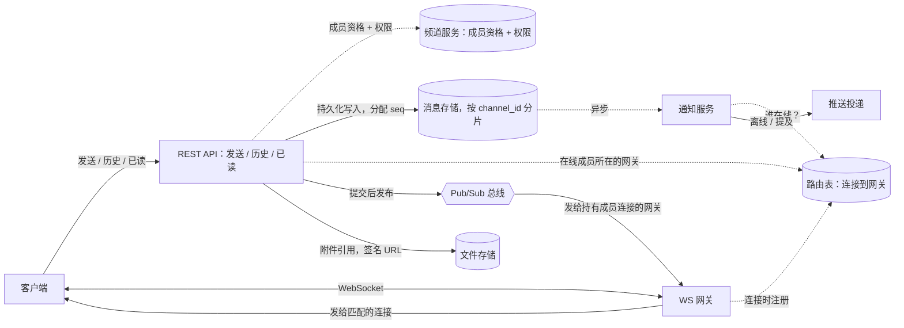

# 类 Slack 即时通讯

[English](README.md) · [中文](README.zh.md)

<!-- meta:begin -->
| 题型 | 优先级 | 难度 | 岗位 | 考点 | 形式 | 轮次 |
| --- | --- | --- | --- | --- | --- | --- |
| 系统设计 | ★★☆☆☆ | — | SWE · EM | messaging, pubsub, multi-device, multi-tenancy | 60 分钟 | 电话面 · 现场面 |
<!-- meta:end -->

## 题目

设计一个供公司内部使用的团队聊天产品的后端。用户可以给某一个人发私信（direct message，DM），也可以在一组人共享的频道里发消息，这一组人所属的公司账号称为*工作区*（workspace）。一个用户经常同时在多台设备上登录——桌面客户端、手机、浏览器标签页——这些设备只要处于连接状态，就都必须收到新消息。当用户的所有设备都不在连接状态时，还要能通知到用户有新消息；如果某条频道消息 @提及了该用户，无论如何都要通知，但要受静音或免打扰计划的约束。用户可以给消息添加附件文件，也可以删除自己发过的消息，删除必须让所有接收者都看不到这条消息。每个工作区的频道、消息和文件必须对其他所有工作区完全不可见，尽管这些工作区共用同一套后端。一个人真正在发消息的频道大多数都不大，但也有少数——比如全公司公告频道——会长到几万名成员。

规模设定：

- 共 200,000 个工作区、20,000,000 名注册用户，其中 6,000,000 人日活。
- 一个日活用户平均每天发送约 35 条消息，私信和频道合计——全系统每天 210,000,000 条消息。
- 一个人正在发消息的频道平均约有 18 名成员；最大的工作区里最大的频道能到约 50,000 名成员。
- 高峰时，日活用户中有 15% 同时在线，人均连接 1.3 台设备。
- 在线接收者的送达延迟目标：从发送方发出请求到消息出现在某台已连接设备上，第 95 百分位低于 700 毫秒。

范围内：把私信和频道消息送达每个接收者的每台已连接设备；离线推送通知与 @提及提醒，受静音/免打扰设置约束；上传与获取附件文件；删除消息；工作区隔离；以及一套能撑住频道从几名成员长到几万名成员的投递设计。范围外：语音/视频通话、对历史消息的全文搜索、编辑已发消息、把回复串（thread）作为独立对象，以及身份提供方本身——假设已经有一个目录服务可以查到某用户属于哪些工作区和频道。

要产出：

1. 需求与规模估算：每秒发送消息数（平均值和峰值）；并发 WebSocket 连接数，以及为此需要多少台网关实例（说明你对单实例能承载多少连接的假设）；投递的扇出量——每秒送达在线连接的数量——按平均规模的频道算一次，再单独为最大的频道之一算一次；以及消息存储量的日增长和年增长。
2. 数据模型（消息、频道成员、每个用户的已读位置）与核心接口：发送消息、翻页读取频道历史、删除消息、标记频道已读，以及客户端收到的 WebSocket 事件。
3. 一张架构图，并沿着一条消息从发送方客户端到接收方已连接设备的路径走一遍。
4. 深入讨论：消息投递与扇出；顺序、去重与重连；多租户与分片。

## 参考解答

<details>
<summary>展开参考解答</summary>

动手设计之前值得先确认：在几万人的频道里，没在看这个频道的设备是要在 700 毫秒内收到每条消息，还是只要一个未读标记；离线成员是每条消息都要推送，还是只在被 @提及时推送。下面都取后者。

### 需求与规模

**消息速率。** $210\times10^6$ 条消息/天平均下来是

$$\text{平均 QPS} = \frac{210\times10^6}{86{,}400} \approx 2{,}431 \text{ 条/秒。}$$

使用量集中在工作时间，工作区分布在多个时区只能部分摊平；按 5 倍的峰均比，峰值写入速率约为 $12{,}153$ 条/秒。

**连接与网关。** 高峰时，$6\times10^6$ 名日活用户中有 15% 同时在线（$900{,}000$ 人），人均 1.3 台设备，即 $900{,}000\times1.3=1{,}170{,}000$ 条并发 WebSocket 连接。按每台网关实例承载 15,000 条连接预算（受限于单连接缓冲区和本地扇出开销，而非原始内存），裸需求是 $\lceil 1{,}170{,}000/15{,}000\rceil=78$ 台；为滚动发布和故障留 15% 余量，机群共 $90$ 台。

**平均规模频道的扇出。** 一个人正在发消息的频道平均 18 名成员；假设同样 15% 的并发比例在频道自己的成员里也成立，同时在线的成员约 $18\times0.15=2.7$ 人，人均 1.3 台设备，即每条消息约 $2.7\times1.3\approx3.51$ 次连接投递。把超大频道（阈值在下面确定）算作日消息量的 8%，其余 92%——高峰时约 $11{,}181$ 条/秒——推送产生约 $11{,}181\times3.51\approx39{,}244$ 次/秒的全系统投递量。

**超大频道的扇出。** 一个 40,000 人的频道，按同样的并发比例和设备数，同时在线 $40{,}000\times0.15=6{,}000$ 人；按普通方式推送，一条消息就要产生 $6{,}000\times1.3=7{,}800$ 次投递。它在最忙的一分钟里每秒发 5 条，单独就会产生 $39{,}000$ 次/秒的投递，和全部小频道加起来差不多——所以超大频道要换一种投递方式。

**存储。** 一条消息记录（`message_id`、`channel_id`、`seq`、`sender_id`、平均 100 字节正文、附件引用、幂等键）约 180 字节：$210\times10^6\times180\text{ 字节}\approx37.8$ GB/天，复制之前约 $13.8$ TB/年，3 倍复制后约 $41.4$ TB/年。

### 数据模型与 API

**Message（消息）**——`message_id`（全局唯一）、`channel_id`、`workspace_id`、`seq`（在频道内的位置）、`type`（`post` 或 `delete`）、`sender_id`、`text`（`delete` 行和已删除的帖子为空）、`attachments`（`[{file_id, name, size, content_type}]`）、`target_seq`（只在 `delete` 行上设置：被删帖子的 `seq`）、`client_msg_id`（幂等键，与 `channel_id`、`sender_id` 联合唯一）、`created_at`。

**Channel（频道）**——`channel_id`、`workspace_id`、`kind`（`dm` 或 `channel`；DM 就是两人频道）、`member_count`（决定投递方式）、`latest_seq`（最后分配出去的 `seq`）、`name`。这一行和该频道的消息放在消息存储的同一个分片上。

**ChannelMember（频道成员）**——`channel_id`、`user_id`、`workspace_id`（冗余存储，让每一次成员资格读取同时也是一次隔离检查）、`joined_at`、`muted`。

**ReadCursor（已读位置）**——`user_id`、`channel_id`、`last_read_seq`、`updated_at`：每个（用户，频道）一行，不是每条消息一行，也不是每台设备一行；只要 `latest_seq` 超过它，每台设备都把这个频道显示为未读。

**Connection（连接）**——`connection_id`（每条连接一个）、`user_id`、`device_id`、`gateway_id`、`connected_at`：只在连接和断开时写入。每台网关另有一条带 TTL 的存活记录。

核心接口：

1. `POST /channels/{channel_id}/messages`——`{client_msg_id, text, attachments}`。追加一条 `post` 行，分配该频道的下一个 `seq`；如果这个请求的 `client_msg_id` 之前已经记录过，就返回原来的结果。返回 `{message_id, seq, created_at}`。
2. `GET /channels/{channel_id}/messages?after_seq=&limit=`——按 `seq` 顺序取历史和补洞；用于初次加载、打开超大频道，以及重连补发。
3. `DELETE /channels/{channel_id}/messages/{message_id}`——只有发送者本人能调用。追加一条 `delete` 行，分配该频道的下一个 `seq`，`target_seq` 设为被删帖子的 `seq`；对已删除的帖子再删一次，返回第一次的结果。返回 `{seq, deleted_at}`。
4. `POST /channels/{channel_id}/read`——`{last_read_seq}`。更新（upsert）调用者的 `ReadCursor` 行。
5. `GET /me/channels`——调用者所属的每个频道，附带 `{channel_id, last_read_seq, latest_seq}`；用于客户端启动和重连。

WebSocket，服务器 → 客户端：`message.new {channel_id, seq, message_id, sender_id, text, created_at}`；`message.deleted {channel_id, seq, target_seq}`；`channel.activity {channel_id, latest_seq}`（超大频道用，只是一个指针，不带正文）；`read.updated {channel_id, last_read_seq}`（发给同一用户的其他设备）。客户端 → 服务器：`channel.focus {channel_id}`（当前显示在屏幕上的频道）。

### 架构



发送接口先向频道服务核对成员资格，再把消息持久化写入消息存储，在同一事务里分配 `seq`；发送方的响应就等在这次写入上。提交之后，API 服务器在路由表里查出持有某个在线成员连接的网关，经尽力而为的总线给每台各发布一次；网关再转发给本地匹配的连接。存储的写入流另外喂给通知服务，不在发送方等待的路径上。附件由客户端直接上传到文件存储，键以 `workspace_id` 为前缀，消息里只带一个引用；下载时，API 先核对调用者属于这条消息所在的频道、且消息没有被删除，才签发一个短时有效的 URL。

### 深入话题

**消息投递与扇出。** 消息一写入就推给接收者（写时扇出），才能满足 700 毫秒的目标；留给客户端来拉（读时扇出），客户端不来问就没有开销，但不来问的客户端也就永远看不到。推送并不免费：每条帖子要让发送路径为每个成员查一次路由表，让网关为每台在线设备写一帧，所以一个 $N$ 人、每秒发 $r$ 条的频道，每秒要查 $N r$ 次路由、写 $0.15\times1.3\times N r=0.195 N r$ 帧。容量是按大量小频道之和规划的，这个和很平稳；单个频道的负载却是一下子到来的，一次事故就能让它猛涨，所以任何一个频道给峰值推送量增加的负担都不能超过 5%，即 $0.05\times39{,}244\approx1{,}962$ 帧/秒。按最忙一分钟每秒 5 条算，$N\le1{,}962/(0.195\times5)\approx2{,}012$（按路由查询算也是同一个界），所以阈值取整为 **2,000 人**。低于它，API 给每台持有在线成员连接的网关各发布一次（每台网关都订阅自己的总线主题），由网关在本地扇出。

达到或超过阈值，就不再按成员逐个路由。只要本机有已连接的用户是某个超大频道的成员，网关就订阅这个频道的主题（连接时从该用户的频道列表得知，加入或退出频道时更新），一条帖子只往频道的主题发布一次。反正按成员路由在这里也缩小不了范围：2,000 人里有 300 人在线，某台网关一个都分不到的概率只有 $(1-1/90)^{300}\approx3.5\%$。网关只给正把这个频道显示在屏幕上的连接（由 `channel.focus` 得知）推送完整消息；其余成员连接收到的是 `channel.activity {channel_id, latest_seq}` 指针，每 2 秒至多一个——新的指针可以取代旧的，消息正文却不能这样合并。客户端打开频道时用 `after_seq` 拉取。对 40,000 人、每秒 5 条的频道，7,800 台在线设备每秒至多收到 $7{,}800/2=3{,}900$ 个指针，再加上正在看它的设备每条消息一帧，而不是每秒 $39{,}000$ 条完整消息。

总线只需要把一份实时副本送到*此刻*已连接的连接上——持久性来自存储写入，重放靠 `after_seq`——所以尽力而为的内存发布订阅就够了，不需要带保留期和消费者偏移量的持久化分区日志。如果把每条小频道帖子广播给全部 $90$ 台网关，副本数约是需要的 26 倍：它的 3.51 条连接平均只落在约 3.5 台网关上。

网关在连接时写一行 `Connection`，断开时删掉。这里不需要租约：一条连接只属于一个进程，网关只写自己的行，而重复的副本无害，因为客户端按 `(channel_id, seq)` 应用事件、丢弃重复。要小心的是过期的行。行以 `connection_id` 为键，所以设备在旧连接超时之前就重连时，旧网关迟到的删除只会删掉旧行；如果以 `(user_id, device_id)` 为键，它会把新的注册一起抹掉，设备从此悄无声息地收不到推送。每台网关每 3 秒刷新一次自己的存活记录，TTL 为 10 秒，`gateway_id` 标识的是一个进程的一次生命期；读取方跳过已失效网关的行，再由清理任务删除。与路由存储或总线失联的网关会主动关闭它的客户端连接，让这些客户端重连到别处（退避时间带随机抖动），而不是守着一条什么也收不到的连接；其间漏掉的由补洞找回。

通知服务不在发送方的路径上：它为每个没有已连接设备的成员、以及每个被 @提及的成员排一次推送，跳过把该频道设为静音、或正处于免打扰时段（一项用户设置）的成员；在 2,000 人及以上的频道里只有提及才推送，所以没有哪条帖子会让它遍历一份 40,000 人的名单。

**顺序、去重与重连。** 每条消息和每次删除都需要一个按频道分配的 `seq`，绝不重复、也没有空洞，这样客户端看到空洞就意味着漏收了消息。一种做法是给每个频道（或分片）配一个专属进程，从内存里发号——快，但它是有状态的持有者，要靠租约和隔离令牌才能撑过故障切换；另一种是在插入消息的同一事务里给该频道那一行加一（`UPDATE channels SET latest_seq = latest_seq + 1 WHERE channel_id = $1 RETURNING latest_seq`）。Channel 行和消息共用 `channel_id` 这个分片键，所以后者是单分片事务，这里选它。行锁从加一开始一直持有到提交，包括提交时的复制往返——取 5 毫秒——所以一个频道每秒至多接受约 200 条帖子；每秒 50 条的频道（上面繁忙速率的十倍）只用掉四分之一，平均等锁不到 1 毫秒。编号没有空洞：回滚的事务连同它的加一一起回滚，而下一条帖子要等上一条提交之后才能拿到锁，所以 `seq` 按顺序变得可见。客户端看到的空洞因此只能是还在路上或漏掉的消息——两次发布可能乱序到达——用 `after_seq` 拉取就能补上。

删除追加一条 `delete` 行，带着全新的 `seq` 和 `target_seq`，并在同一事务里清空原帖的正文和附件引用，历史里就不再提供它们。重连靠的是这条新行：已经收到原帖的客户端，其 `last_seen_seq` 已超过原帖，`seq > last_seen_seq` 的补洞发现不了只改动旧行的变化，却能找到这条删除，客户端据此把本地副本标成墓碑。随后由后台任务删除文件对象；删除之前签发的下载 URL 在过期（5 分钟）之前仍然有效。

`client_msg_id` 与 `(channel_id, sender_id)` 联合唯一。重试的插入撞上这个约束时事务回滚，加一也随之回滚，所以不会再占用一个 `seq`；请求返回已存在的那一行，不管哪一次尝试真正落地，客户端看到的都是同一个 `{message_id, seq}`。

客户端为打开过的每个频道记录最后应用过的 `seq`。新连接注册好之后，它调用 `GET /me/channels`，只对 `latest_seq` 比自己新的频道用 `after_seq` 补洞；这次快照之后提交的消息会推到新连接上，与补洞重叠的推送按 `seq` 丢弃。一个用户在 300 个频道里时，响应约 $300\times50\text{ 字节}\approx15$ KB，服务器按消息存储分片批量读取这 300 个 `latest_seq`，每个涉及的分片查一次，而不是每个频道查一次。

标记频道已读只写一行 `ReadCursor`，并把 `read.updated` 推给同一用户的*其他*已连接设备（查同一张路由表，按 `user_id`），每个打开的界面一起清掉未读标记。

**多租户与分片。** 消息存储按 `channel_id` 分片，不按 `workspace_id`：按工作区分片会把一家活跃公司的频道都放到一个分片上，恰好在负载最重处造出热分片；按 `channel_id` 分片则把一个工作区也摊到很多分片上。`workspace_id` 仍写在每张表的每一行上，每次读取都用作鉴权过滤条件；它也是 `ChannelMember` 自己的分片键，因为“列出我的频道”天然按工作区查询，结果也不大。

每个请求都用只对一个 `workspace_id` 生效的令牌鉴权，并核对它与请求的目标一致。按工作区计的令牌桶按席位数设定，既限住失控的机器人能从共用分片里抽走多少容量，又不卡正常的高峰：注册用户中 30% 是日活，一个 50,000 席位的工作区高峰时约 $50{,}000\times0.3\times35\times5/86{,}400\approx30$ 条/秒，它的令牌桶就按三倍、即每秒 90 条补充。消息正文和文件按 `workspace_id` 选取密钥做静态加密，从被窃取的存储里读出某个租户的数据，还需要那个租户的密钥。

### 追问

- 编辑消息可以复用删除的机制：一条带全新 `seq` 和 `target_seq` 的 `edit` 行，在同一事务里改写原帖的正文，补洞会像找到删除一样找到它。
- 发帖速率超过一把行锁所能承受（约每秒 200 条）的频道，需要把计数器拆开，也就放弃了这里的单一频道内顺序。

<details>
<summary>估算核对（可运行）</summary>

```python
import math

workspaces, total_users, dau = 200_000, 20_000_000, 6_000_000
avg_msgs_per_dau = 35
total_msgs_day = dau * avg_msgs_per_dau
assert total_msgs_day == 210_000_000

avg_qps = total_msgs_day / 86_400
peak_to_avg = 5
peak_qps = avg_qps * peak_to_avg
assert round(avg_qps) == 2_431
assert round(peak_qps) == 12_153

peak_online_frac, avg_devices = 0.15, 1.3
peak_online_users = dau * peak_online_frac
peak_ws_conns = peak_online_users * avg_devices
assert peak_online_users == 900_000
assert peak_ws_conns == 1_170_000

conns_per_gateway = 15_000
gateways_bare = math.ceil(peak_ws_conns / conns_per_gateway)
margin = math.ceil(gateways_bare * 0.15)
gateways_total = gateways_bare + margin
assert gateways_bare == 78
assert gateways_total == 90

avg_channel_members = 18
devices_per_member = peak_online_frac * avg_devices  # online devices per member
deliveries_per_msg = avg_channel_members * devices_per_member
assert round(devices_per_member, 3) == 0.195
assert round(avg_channel_members * peak_online_frac, 2) == 2.7
assert round(deliveries_per_msg, 2) == 3.51

large_channel_share = 0.08
peak_qps_small = peak_qps * (1 - large_channel_share)
peak_push_frames = peak_qps_small * deliveries_per_msg
peak_push_lookups = peak_qps_small * avg_channel_members  # one routing lookup per member
assert round(peak_qps_small) == 11_181
assert round(peak_push_frames) == 39_244

# one 40,000-member channel in its busiest minute
N_large, busy_rate = 40_000, 5  # members, messages/s
online_large = N_large * peak_online_frac
frames_per_post_large = online_large * avg_devices
assert online_large == 6_000
assert frames_per_post_large == 7_800
assert frames_per_post_large * busy_rate == 39_000
assert abs(frames_per_post_large * busy_rate / peak_push_frames - 1) < 0.01  # "about as many"

# threshold: one channel may add at most 5% to peak push load, frames and lookups alike
budget_share = 0.05
frame_budget = budget_share * peak_push_frames
N_max_frames = frame_budget / (devices_per_member * busy_rate)
N_max_lookups = budget_share * peak_push_lookups / busy_rate
assert round(frame_budget) == 1_962
assert math.isclose(N_max_frames, N_max_lookups)
assert math.floor(N_max_frames) == 2_012
threshold = 2_000
assert threshold <= N_max_frames

# at the threshold, per-member routing no longer narrows the publish
G = gateways_total
online_at_threshold = threshold * peak_online_frac
p_gateway_empty = (1 - 1 / G) ** online_at_threshold
assert online_at_threshold == 300
assert round(p_gateway_empty, 3) == 0.035

# large mode: pointers coalesced to one per socket per 2 s
pointer_interval_s = 2
assert frames_per_post_large / pointer_interval_s == 3_900

# small channel: broadcasting to every gateway vs the gateways that hold a socket
gateways_hit = G * (1 - (1 - 1 / G) ** deliveries_per_msg)
assert round(gateways_hit, 1) == 3.5
assert round(G / gateways_hit) == 26

bytes_per_message = 180
daily_bytes = total_msgs_day * bytes_per_message
daily_gb = daily_bytes / 1e9
annual_tb = daily_gb * 365 / 1e3
annual_tb_replicated = annual_tb * 3
assert round(daily_gb, 1) == 37.8
assert round(annual_tb, 1) == 13.8
assert round(annual_tb_replicated, 1) == 41.4

# sequence counter: the row lock is held for the whole transaction
lock_hold_s = 0.005
max_posts_per_channel = 1 / lock_hold_s
hot_rate = 10 * busy_rate
rho = hot_rate * lock_hold_s
mean_lock_wait_ms = rho * lock_hold_s / (2 * (1 - rho)) * 1000  # M/D/1 queue
assert round(max_posts_per_channel) == 200
assert hot_rate == 50 and rho == 0.25
assert mean_lock_wait_ms < 1

# reconnect: one GET /me/channels entry per channel
channels_per_user, bytes_per_entry = 300, 50
assert channels_per_user * bytes_per_entry == 15_000

# per-workspace token bucket, from the seat count
dau_share = dau / total_users
seats = 50_000
workspace_peak = seats * dau_share * avg_msgs_per_dau * peak_to_avg / 86_400
assert dau_share == 0.3
assert round(workspace_peak) == 30
assert 3 * round(workspace_peak) == 90

print("all requirements-and-scale numbers check out")
```

</details>

</details>
