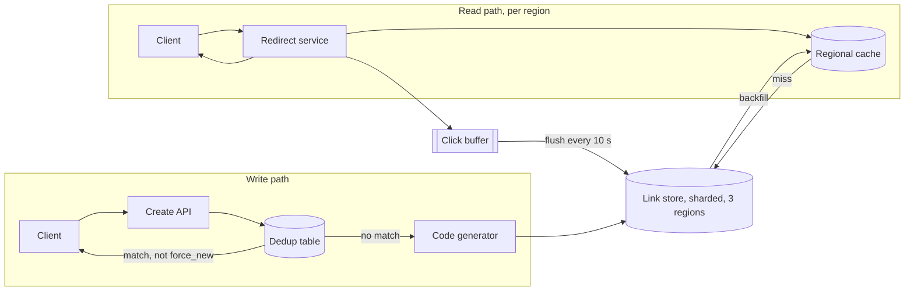

# URL Shortener

[English](README.md) · [中文](README.zh.md)

<!-- meta:begin -->
| Type | Priority | Difficulty | Roles | Topics | Round |
| --- | --- | --- | --- | --- | --- |
| System design | ★★☆☆☆ | — | SWE | hashing, caching, scaling, database | Onsite |
<!-- meta:end -->

## Problem

Design a service that turns a long URL into a short code and, when a client requests that code,
redirects them to the original URL. A create call is served by a general HTTP API used by client
applications and a lightweight web form; a redirect is served by following a link of the form
`https://s.example/{code}` from anywhere on the web — a browser, a chat app's link preview, a
scanned QR code. A caller may request a custom alias instead of a generated code; a custom alias and a
generated code share one namespace, and if the requested alias is already taken the create call fails
outright, never falling back to a different code. A code is redirectable the instant its create call
returns success, from any region a client happens to be in.

A link has no expiration by default, though a caller may set one at creation time; once a link is
expired or explicitly deleted, requests for its code stop redirecting for good, and the code is never
reassigned to a different destination later. An authenticated caller (one that carries an `owner_id`)
who submits a URL that normalizes to one they already own (same scheme and host, case-insensitively,
same path and query, no fragment) gets back their existing code unless they ask for a fresh one;
anonymous creates (no `owner_id`) are never deduplicated against anything. Every successful redirect
counts toward that code's click count; the count is approximate, a bounded amount of lag is acceptable,
and nothing else about the click (referrer, device, location) is recorded.

Scale for this design:

- 1,200,000 new links created per day (about 14/s on average).
- A 100:1 ratio of redirects to creates.
- Traffic is bursty around link shares and campaigns: plan for a 5x peak-to-average ratio on both
  creates and redirects.
- Capacity-plan for 5 years of accumulation at the above creation rate.
- Redirect latency target: p50 under 20 ms, p99 under 150 ms. Redirect availability target: 99.95%.

In scope: the create and redirect APIs; short-code generation and collision handling; the durable
mapping store; the caching layer behind the redirect path; multi-region serving of redirects; an
owner's paginated list of their own links; the approximate click count. Out of scope: the identity
layer that produces `owner_id` for an authenticated call; a moderation policy beyond a pass/fail
malicious-URL check at creation time; branded/custom domains; analytics beyond the raw click count.

Produce:

1. A scale estimate: short-code length, storage footprint, redirect QPS (average and peak), and how
   many popular links the cache needs to hold.
2. A data model for the link record and its secondary indexes, and 3-5 core APIs.
3. An architecture diagram that separates the write path from the read path, and a walk-through of one
   redirect along that path.
4. Deep dives into: short-code generation; the read path; and storage and scale. For each, compare at
   least two alternatives, say which you would pick, and state the cost of that choice.

## Reference solution

<details>
<summary>Show the reference solution</summary>

Two points worth confirming before designing: whether anonymous (unauthenticated) creation needs to be
supported at all, or every caller already carries an owner id from an existing auth layer; and whether a
single shared domain is enough for now, with branded per-owner domains left for later. The design below
assumes anonymous creation is allowed, just never deduplicated, and a single shared domain.

### Requirements and scale

**Short-code length.** Planning for $Y=5$ years at $r = 1{,}200{,}000$ creates/day gives a total volume
of

$$n = r \cdot 365 \cdot Y = 2.19\times10^{9} \text{ codes.}$$

A base62 alphabet (62 symbols) of length $k$ names $N=62^k$ distinct codes. The scheme chosen in the
short-code generation deep dive draws a code at random and retries on collision. When $i$ codes are
already taken, a draw collides with probability $i/N$, so that insert needs $i/(N-i)$ retries on average,
and filling the space to $n$ needs

$$R = \sum_{i=0}^{n-1} \frac{i}{N-i} \approx \frac{n^2}{2N} \quad (n \ll N)$$

retries in expectation. This is an expected count, not the birthday-paradox probability of at least one
collision, which at these sizes is essentially 1. At $k=6$ ($N\approx5.68\times10^{10}$, 3.9% full after
5 years) that is $R\approx43.3$ million, where the approximation alone gives 42.2 million; at $k=7$
($N\approx3.52\times10^{12}$) it is about 681,000. One more character cuts retries by more than 60x, so
$k=7$ is what this design uses; after 5 years only $n/N\approx0.062\%$ of the space is taken.

**Storage.** A link record is about 167 bytes: a 7-byte code, a 110-byte average long URL, an 8-byte
owner id, three 8-byte timestamps/counters (`created_at`, `expires_at`, `click_count`), a 16-byte URL
hash for dedup, and two 1-byte flags; an authenticated link also has a 31-byte dedup row (owner id, URL
hash, code). With roughly 1.5x overhead for indexes and log-structured storage, the upper bound of 198
bytes per link becomes 297 bytes on disk, so $n$ links take $n \times 297\text{B} \approx 650$ GB for one
copy and $\approx 1.95$ TB with 3x replication; since the store's QPS is small (redirect QPS, cache),
capacity is what sets the shard count.

**Redirect QPS.** At the 100:1 ratio, $1.2\times10^{8}$ redirects/day average to $\approx1{,}389$ QPS; the
5x peak factor puts the number the redirect service and cache must be provisioned for at
$\approx6{,}944$ QPS. Creates stay under 70 QPS even at peak.

**Cache.** Assume a day's redirects are spread over a pool of $M=5{,}000{,}000$ codes with Zipf
popularity of exponent $s=1.1$ (the $j$-th most popular code draws a share proportional to $j^{-s}$). The
hottest $C=10^6$ (20% of the pool) then draw $\sum_{j\le C} j^{-s} / \sum_{j\le M} j^{-s} \approx 95.6\%$
of requests, so the cache needs to hold about a million entries. At about 126 bytes each (code, URL,
`expires_at`, status) that is 126 MB, while an 8 GiB node holds $\approx68$ million: memory is not the
binding constraint, the TTL is (read path). With the 24-hour TTL chosen there the regional hit rate is
about 95.3%, so the store absorbs $\approx6{,}944\times(1-0.9526)\approx330$ QPS of misses at peak,
alongside the sub-70-QPS creates.

### Data model and API

**Link** — `short_code` (primary key: 7 base62 characters when generated, 3-32 caller-chosen base62
characters for a custom alias, one shared namespace either way, with API path names such as `links`
reserved), `long_url`, `url_hash` (16-byte hash of the normalized URL, set only when `owner_id` is
present), `owner_id` (nullable), `created_at`, `expires_at` (nullable), `status`
(`active | expired | deleted`), `click_count` (updated asynchronously, never on the request path),
`is_custom_alias`. An `(owner_id, created_at)` → `short_code` secondary index serves an owner's paginated
listing.

**Dedup** — `(owner_id, url_hash)` → `short_code`, a table of its own written only with conditional
writes: the link store is sharded by code, so an index over it could not enforce this uniqueness in one
place. The hash keeps the key short however long the URL is; at 16 bytes, even if all $n$ links belonged
to one owner, the expected number of colliding pairs would be about $7\times10^{-21}$ (a reuse still
compares the stored `long_url`). A create writes its link row first and its dedup row second, as an
insert-if-absent; if a concurrent create of the same URL got there first, this one returns the winner's
code and marks its own fresh row `deleted`, never having handed it out. A dedup row pointing at an
expired or deleted link counts as no match and is replaced by a compare-and-set on the old code.

Core APIs:

1. `POST /links` — `{long_url, custom_alias?, expires_at?, force_new?}`, `owner_id` from the auth
   context (absent for an anonymous call). Returns `201 {short_code, short_url, long_url, expires_at,
   created_at, reused: false}` for a new code; when the owner's dedup row finds a live match (including
   the one a concurrent create just wrote) and `force_new` was not set, returns `200` with the existing
   record and `reused: true`; when `custom_alias` is already taken, returns `409 {error: "alias_taken"}`
   — no retry, no substitute code.
2. `GET /{short_code}` — the redirect: `302` to `long_url` when the link is `active` and not past
   `expires_at` (compared with the clock on every request, so expiry takes effect on time); `404` when
   the code was never issued; `410 Gone` when it was issued but is deleted or expired, so a caller can
   tell "never existed" from "existed, then died"; `503` when the regional replica has no row and the
   shard leader cannot be reached (architecture), since a `404` there might be wrong. Every response
   carries `Cache-Control: no-store`. `302`, not `301`: without explicit cache headers a `301` is
   cacheable by default and browsers tend to keep it for a long time, so later clicks never reach this
   API — the count stops moving and a delete goes unseen. `no-store` would stop that for a `301` too, but
   a `301` also announces a permanent move, which crawlers credit to the target. `307` and `308` only add
   a ban on changing the request method, irrelevant for `GET` and `HEAD`; `308` is cacheable by default
   like `301`.
3. `GET /links/{short_code}` — metadata only, no redirect: `{short_code, long_url, click_count, status,
   created_at, expires_at}`. Used by an owner's dashboard.
4. `DELETE /links/{short_code}` — owner-only. Sets `status = deleted`; redirects stop within each
   region's replication lag (read path), and the code is retired for good.
5. `GET /links?cursor=...` — an authenticated owner's own links, newest first, via the
   `(owner_id, created_at)` index.

### Architecture



A create from an authenticated caller first looks up the dedup table for the caller's owner id and the
submitted URL's hash (an anonymous call skips this entirely, since the table is keyed by owner id); on a
live match, unless `force_new` was set, it returns the existing code without touching anything else.
Otherwise the generator draws a random code and sends a uniqueness-constrained insert to the leader of
that code's shard, retrying on the rare collision; an authenticated create then writes its dedup row
(data model). Each shard is one replication group with a replica in each of three regions, and only its
leader decides whether a code is free, so two regions can never hand out the same code; the insert
commits once two of the three replicas have it, so creates survive the loss of any one region. A redirect
reads its own region: the regional cache first, then the regional replica on a miss, which also backfills
the cache. A replica may trail the leader, so when it has no row the redirect service asks the shard
leader before answering `404` — this is what makes a new code redirectable everywhere the instant its
create returns. On success the redirect service replies with the `302` and adds the click to an in-memory
buffer that a background flush aggregates into `click_count`, off the request path entirely.

### Deep dives

**Short-code generation.** Three ways to produce the code: (1) a monotonic counter, base62-encoded —
collision-free by construction; to avoid contending on every create, each instance reserves a "segment"
(the next 1,000 ids from one shared, atomically incremented row) and hands it out locally. Its real cost
is that adjacent codes are adjacent integers: anyone can walk `base62(0), base62(1), ...` and enumerate
the whole corpus, learning of every link, private or not, and how fast they grow. (2) The first $k$
base62 characters of a hash of the normalized URL — the same URL always yields the same code, which looks
like dedup for free, but it would also merge different owners and anonymous callers, which the dedup
rules forbid. A good hash is uniform over the $62^k$ codes, so two *different* URLs collide like two
random draws: the expected number of colliding pairs among $n$ URLs is $\binom{n}{2}/N$, about 681,000 at
$k=7$ over 5 years (the same size as $R$, but a different quantity), each a pair of URLs silently sharing
one code unless a collision check is added. A custom alias is not the hash of anything, so it would need
a second uniqueness mechanism anyway. (3) A uniformly random $k$-character draw from a cryptographically
secure generator (so codes already seen do not predict the next ones), with a uniqueness-constrained
insert (an insert that only succeeds if the code is free, never a separate check-then-insert in
application code, which would race under concurrent creates) — chosen here, because it needs no
coordinated counter service and a code says nothing about its neighbours or its age. The cost is the
retry math of the requirements estimate: even at the year-5 size only about 1 insert in 1,608 needs an
extra attempt. By the same odds a random guess finds a live link once per 1,608 tries, and every miss
costs a read at the shard leader (architecture), so `404`s are rate-limited per client. A custom alias
uses the same uniqueness-constrained insert, with one difference: on conflict it returns an error to the
caller instead of retrying with a different string, since the caller asked for that exact one.

**Read path.** Each region runs its own cache cluster in front of its store replica. A region fetches
about 2.3 million distinct codes a day, under 300 MB, so nothing is evicted for space, and the TTL alone
sets the hit rate: every expiry forces one miss. If a code gets $x$ requests per TTL window on average,
each miss starts a window that serves about $x$ hits, so its hit fraction is $x/(1+x)$; summed over the
Zipf pool with a third of the traffic per region, a 120-second TTL gives only about 71% (about 2,000
store reads per second at peak), a 24-hour TTL about 95.3%. Delete consistency therefore cannot come from
a short TTL. Instead, each region's invalidator tails its store replica's change log from a checkpoint,
and for every delete the replica applies it overwrites the cache entry with a `deleted` tombstone (a set,
not a removal), while a miss backfills with add-if-absent: a read that fetched the row just before the
delete cannot write it back just after, and a restarted invalidator resumes from its checkpoint rather
than losing messages. A deleted code stops redirecting in each region within that region's replication
lag, normally under a second; the 24-hour TTL only bounds the damage from a bug on that path, and expiry
needs none of this, since each entry carries `expires_at`. A CDN in front of the redirects was rejected:
an edge stores a `302` only if its `Cache-Control` or the CDN's own configuration allows it, and a
redirect answered at the edge never reaches the click buffer, so counts would have to come from edge logs
and every delete would need an edge purge too.

**Storage and scale.** The link store is a sharded key-value store with conditional writes, sharded by a
hash of `short_code` rather than by key range: random codes would spread evenly either way, but custom
aliases cluster around common words, and hashing spreads them too. The dedup table (data model) lives on
the same nodes under its own key; the listing index is kept eventually consistent, since it is never on
the redirect path. At about 650 GB per copy, a 150 GB-per-node budget needs five shards; with one replica
per region that is 15 storage nodes — sized by data volume, since everything the store absorbs at peak
(about 330 cache-miss reads plus under 70 creates) would fit on a single node. Expired or deleted codes
are never reassigned (storage is cheap enough that recycling buys nothing but risk), so "cleanup" is only
a batch job flipping `status` to `expired` for listings. Clicks are summed per code in each redirect
instance's memory and flushed every 10 seconds as one increment per code at its shard leader. By Little's
law, $L=\lambda W$ with $W = 5$ s (the average wait until the next flush), about
$6{,}944\times5\approx34{,}700$ clicks are unflushed across the fleet at peak; since the count only needs
to be approximate, the buffer has no backing store, and a crashed instance loses at most its last 10
seconds of clicks. Even without aggregation each of the five shard leaders would take at most about 1,389
increments per second at peak. Creates are limited per API key or IP by a token bucket, and each URL is
checked against a malicious-URL blocklist at creation and re-checked periodically.

### Follow-ups

- If a shard's leader fails, creates that land on that shard wait for a new leader (seconds); a generated
  code can simply be redrawn onto another shard, so only a custom alias has to wait. Redirects of codes
  already in the regional replica are unaffected.
- Branded, per-owner domains would key the store by `(domain, short_code)` instead of `short_code` alone,
  and add certificate provisioning per domain — both left out of this design.
- A URL flagged by a later blocklist re-check is retired like a delete, through the same tombstone path;
  clicks served before the flag are not retroactively recalled.
- Two different owners (or two anonymous callers) end up with two different codes for the same
  destination — dedup is scoped per owner on purpose, so the platform never merges them or their click
  counts.

<details>
<summary>Estimate check (runnable)</summary>

```python
import contextlib
import itertools
import math
import random
import statistics
import threading
import time

# ---------- requirements and scale ----------
creates_per_day, ratio, peak_factor = 1_200_000, 100, 5
redirects_per_day = creates_per_day * ratio
avg_redirect_qps = redirects_per_day / 86_400
peak_redirect_qps = avg_redirect_qps * peak_factor
assert (round(avg_redirect_qps), round(peak_redirect_qps)) == (1_389, 6_944)
assert round(creates_per_day / 86_400 * peak_factor, 1) == 69.4
n = creates_per_day * 365 * 5
assert n == 2_190_000_000


def expected_retries(N: int, n: int) -> float:
    """R = sum_{i<n} i/(N-i) = N*(H_N - H_{N-n}) - n, harmonic numbers by Euler-Maclaurin."""
    m = N - n
    dH = -math.log1p(-n / N) + 1 / (2 * N) - 1 / (2 * m) - 1 / (12 * N * N) + 1 / (12 * m * m)
    return N * dH - n


assert abs(expected_retries(5_000, 300) - sum(i / (5_000 - i) for i in range(300))) < 1e-6
R6, R7 = expected_retries(62 ** 6, n), expected_retries(62 ** 7, n)
assert round(R6 / 1e6, 1) == 43.3 and round(n * n / (2 * 62 ** 6) / 1e6, 1) == 42.2   # exact vs n^2/(2N)
assert round(R7, -3) == 681_000 and R6 / R7 > 60
assert round(100 * n / 62 ** 6, 1) == 3.9 and round(100 * n / 62 ** 7, 3) == 0.062
assert round(62 ** 7 / n) == 1_608                         # retry (and random-guess hit) odds at year 5
assert round(math.comb(n, 2) / 62 ** 7, -3) == 681_000     # hash scheme: expected colliding URL pairs
assert 6e-21 < math.comb(n, 2) / 2 ** 128 < 8e-21          # 16-byte url_hash, all links under one owner

row_b, dedup_row_b = 7 + 110 + 8 + 3 * 8 + 16 + 2, 8 + 16 + 7
assert (row_b, dedup_row_b, (row_b + dedup_row_b) * 1.5) == (167, 31, 297)
one_copy_gb = n * (row_b + dedup_row_b) * 1.5 / 1e9
assert round(one_copy_gb) == 650 and round(3 * one_copy_gb / 1000, 2) == 1.95
shards = math.ceil(one_copy_gb / 150)
assert shards == 5 and 3 * shards == 15                    # one replica per region, 3 regions

# cache: Zipf popularity over a pool of M codes; an ideal top-C cache, and a TTL cache per region
M, s, C = 5_000_000, 1.1, 1_000_000
H_M = H_C = 0.0
for j in range(1, M + 1):
    H_M += j ** (-s)
    if j == C:
        H_C = H_M
assert round(H_C / H_M, 3) == 0.956

regions, day_s, ttls = 3, 86_400, (120, 86_400)
hits, working_set = dict.fromkeys(ttls, 0.0), 0.0
for j in range(1, M + 1):
    share = j ** (-s) / H_M
    for T in ttls:
        x = share * redirects_per_day / regions * T / day_s   # expected requests per TTL window
        hits[T] += share * x / (1 + x)                        # per window: 1 miss, then about x hits
    working_set += 1 - math.exp(-x)                           # (T = 1 day) distinct codes fetched per day
assert round(hits[120], 3) == 0.713 and round(hits[day_s], 4) == 0.9526
assert round(peak_redirect_qps * (1 - hits[120]), -2) == 2_000
assert round(peak_redirect_qps * (1 - hits[day_s]), -1) == 330
cache_entry_b = 7 + 110 + 8 + 1                            # code + url + expires_at + status
assert cache_entry_b * C / 1e6 == 126 and round(8 * 1024 ** 3 / cache_entry_b / 1e6) == 68
assert round(working_set / 1e6, 1) == 2.3 and working_set * cache_entry_b / 1e6 < 300

unflushed = peak_redirect_qps * 10 / 2                     # Little's law, W = half the 10 s flush interval
assert round(unflushed, -2) == 34_700 and round(peak_redirect_qps / shards) == 1_389
print("all requirements-and-scale numbers check out")

# ---------- base62 codec, cross-checked against an independent implementation ----------
ALPHABET = "0123456789ABCDEFGHIJKLMNOPQRSTUVWXYZabcdefghijklmnopqrstuvwxyz"
INDEX = {c: i for i, c in enumerate(ALPHABET)}


def encode_base62(value: int, width: int = 7) -> str:
    digits = [0] if value == 0 else []
    while value > 0:
        value, rem = divmod(value, 62)
        digits.append(rem)
    return "".join(ALPHABET[d] for d in reversed(digits)).rjust(width, ALPHABET[0])


def decode_base62(code: str) -> int:
    value = 0
    for ch in code:
        value = value * 62 + INDEX[ch]
    return value


def naive_encode(value: int, width: int = 7) -> str:       # independent: digit p is value // 62**p % 62
    length = width
    while 62 ** length <= value:
        length += 1
    return "".join(ALPHABET[value // 62 ** p % 62] for p in reversed(range(length)))


rng = random.Random(0)
values = [0, 1, 61, 62, 62 ** 7 - 1, 62 ** 7] + [rng.randint(0, 62 ** 8) for _ in range(20_000)]
for value in values:
    code = encode_base62(value)
    assert code == naive_encode(value)
    assert decode_base62(code) == value == sum(INDEX[c] * 62 ** p for p, c in enumerate(reversed(code)))
assert encode_base62(62 ** 7 - 1) == "z" * 7 and len(encode_base62(62 ** 7)) == 8
print(f"base62 codec: {len(values):,} values round-trip and match the independent version")

# ---------- segment allocator: concurrent instances never get overlapping ids ----------
class SegmentAllocator:
    """The shared counter row: reserve_segment() is a fetch-and-add, modeled as read, forced yield,
    write under a lock. use_lock=False runs the same code, yield included: the negative control."""

    def __init__(self, segment_size: int = 1_000, use_lock: bool = True):
        self._next, self._size = 0, segment_size
        self._lock = threading.Lock() if use_lock else contextlib.nullcontext()

    def reserve_segment(self) -> range:
        with self._lock:
            start = self._next
            time.sleep(0)                                  # force a thread switch between read and write
            self._next = start + self._size
        return range(start, start + self._size)


def duplicated_ids(allocator, n_threads=8, per_thread=50) -> int:
    out, out_lock = [], threading.Lock()

    def worker():
        mine = [allocator.reserve_segment() for _ in range(per_thread)]
        with out_lock:
            out.extend(mine)

    threads = [threading.Thread(target=worker, daemon=True) for _ in range(n_threads)]
    for t in threads:
        t.start()
    for t in threads:
        t.join(timeout=10)
        assert not t.is_alive(), "worker thread did not finish in time"   # main thread asserts
    assert len(out) == n_threads * per_thread
    ids = [i for seg in out for i in seg]
    return len(ids) - len(set(ids))


assert all(duplicated_ids(SegmentAllocator()) == 0 for _ in range(5))
unsafe = sum(duplicated_ids(SegmentAllocator(use_lock=False)) for _ in range(5))
assert unsafe > 0                                          # negative control: the lock is what matters
print(f"segment allocator: 0 duplicated ids with the lock, {unsafe:,} without it (5 runs each)")

# ---------- random draw + retry vs. R; i.i.d. draws vs. the colliding-pair count ----------
def simulate(space: int, draws: int, trials: int, seed: int, retry: bool) -> tuple:
    rng, results = random.Random(seed), []
    for _ in range(trials):
        seen, count = {}, 0
        for _ in range(draws):
            d = rng.randrange(space)
            while retry and d in seen:
                count, d = count + 1, rng.randrange(space)
            count += 0 if retry else seen.get(d, 0)        # i.i.d.: each earlier equal draw forms a pair
            seen[d] = seen.get(d, 0) + 1
        results.append(count)
    return statistics.fmean(results), statistics.stdev(results) / math.sqrt(trials)


for space, draws in ((5_000, 300), (2_000, 600)):          # 6% and 30% fill
    m, se = simulate(space, draws, 1_500, seed=space, retry=True)
    assert abs(m - expected_retries(space, draws)) < 4 * se
    print(f"retries, space {space}, {draws} draws: simulated {m:.2f} +/- {se:.2f}, "
          f"R = {expected_retries(space, draws):.2f}, n^2/(2N) = {draws ** 2 / (2 * space):.2f}")
assert abs(m - draws ** 2 / (2 * space)) > 20 * se         # at 30% fill only the exact sum fits
m, se = simulate(5_000, 300, 1_500, seed=1, retry=False)
assert abs(m - math.comb(300, 2) / 5_000) < 4 * se
print(f"colliding pairs, space 5000, 300 i.i.d. draws: simulated {m:.2f} +/- {se:.2f}, C(n,2)/N = 8.97")

# ---------- dedup: every interleaving of two same-URL creates, with every crash point ----------
def create_steps(db, fresh, out, variant="ordered"):
    """One authenticated create of URL "k" as atomic steps; each yield lets the other create run."""
    cur = db["dedup"].get("k")                             # 1: dedup lookup
    if cur is not None and db["links"].get(cur) == "active":
        return out.append(cur)
    yield
    if variant == "dedup_first":                           # negative control: dedup row before link row
        if db["dedup"].get("k") != cur:
            return out.append(db["dedup"]["k"])
        db["dedup"]["k"] = fresh
        yield
        db["links"][fresh] = "active"
        return out.append(fresh)
    db["links"][fresh] = "active"                          # 2: insert the link row (the code is free)
    yield
    if variant == "blind" or db["dedup"].get("k") == cur:  # 3: insert-if-absent, or CAS from the dead code
        db["dedup"]["k"] = fresh                           #    ("blind" = plain put: negative control)
        return out.append(fresh)
    winner = db["dedup"]["k"]
    yield
    db["links"][fresh] = "deleted"                         # 4: lost the race; retire the fresh code
    out.append(winner)


def dedup_check(variant) -> tuple:
    starts = ({}, {"k": "old"})                            # no dedup row; a row pointing at a deleted link
    violations = races = 0
    for start, schedule, crash in itertools.product(
            starts, sorted(set(itertools.permutations([0] * 5 + [1] * 5))),
            itertools.product((None, 0, 1, 2), repeat=2)):
        db = {"links": {"old": "deleted"}, "dedup": dict(start)}
        outs, done, alive = ([], []), [0, 0], [True, True]
        procs = [create_steps(db, f"fresh{p}", outs[p], variant) for p in (0, 1)]
        for p in schedule:
            alive[p] = alive[p] and (crash[p] is None or done[p] <= crash[p])   # crash after a step
            if alive[p]:
                try:
                    next(procs[p])
                    done[p] += 1
                except StopIteration:
                    alive[p] = False
        later = []                                         # a later create of the same URL, run alone
        for _ in create_steps(db, "fresh_later", later, variant):
            pass
        returned = {o[0] for o in outs if o}
        violations += not (len(returned) <= 1 and returned <= set(later)
                           and db["links"].get(later[0]) == "active")
        races += crash == (None, None) and {"fresh0", "fresh1"} <= db["links"].keys()
    return violations, races


violations, races = dedup_check("ordered")
assert violations == 0 and races >= 400                    # both creates got past the lookup
assert dedup_check("blind")[0] > 0 and dedup_check("dedup_first")[0] > 0
print(f"dedup: 0 violations over every interleaving and crash point ({races} true races)")
```

</details>

</details>
