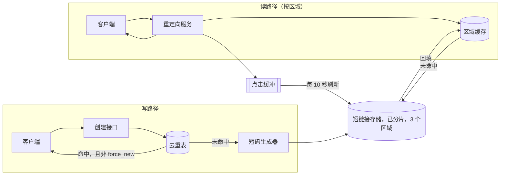

# 短链接服务

[English](README.md) · [中文](README.zh.md)

<!-- meta:begin -->
| 题型 | 优先级 | 难度 | 岗位 | 考点 | 轮次 |
| --- | --- | --- | --- | --- | --- |
| 系统设计 | ★★☆☆☆ | — | SWE | hashing, caching, scaling, database | 现场面 |
<!-- meta:end -->

## 题目

设计一个服务：把一个长网址转换成一个短码（short code），当客户端请求这个短码时，把它重定向到原始网址。创建请求由一个通用的 HTTP 接口提供服务，供客户端应用和一个简单的网页表单调用；重定向则由网上任何地方——浏览器、聊天软件的链接预览、扫码得到的二维码——跟随形如 `https://s.example/{code}` 的链接触发。调用方可以在创建时指定一个自定义别名（alias）而不是使用自动生成的短码；别名与自动生成的短码共用同一个命名空间，如果请求的别名已经被占用，这次创建请求直接失败，绝不会退而求其次返回另一个可用的短码。一个短码在它的创建请求返回成功的那一刻起就可以被重定向，无论客户端身处哪个地区。

短链接默认没有过期时间，但调用方可以在创建时设置一个；一个短链接一旦过期或被显式删除，对它短码的请求就永久停止重定向，这个短码之后也不会被重新分配给别的目标网址。一个带有 `owner_id`（即已登录）的调用方，如果提交的网址标准化后与自己已有的某个网址相同（scheme 和 host 不分大小写，path 和 query 保持原样，忽略 fragment），会拿回已有的那个短码，除非明确要求生成一个新的；匿名创建（没有 `owner_id`）永远不做这种去重。每一次成功的重定向都会计入该短码的点击计数；这个计数是近似的，允许一定的滞后，并且不记录关于这次点击的其它信息（来源、设备、地理位置）。

这次设计的规模：

- 每天新建 1,200,000 个短链接（平均约 14 个/秒）。
- 重定向与创建的比例是 100:1。
- 流量有明显的波峰（链接被大量分享、营销活动等场景）：创建和重定向都按 5 倍的峰均比规划。
- 按上述创建速率，容量规划以 5 年的累积量为目标。
- 重定向延迟目标：中位数低于 20 毫秒，第 99 百分位低于 150 毫秒。重定向可用性目标：99.95%。

范围内：创建接口与重定向接口；短码生成与冲突处理；持久化的映射存储；重定向读路径背后的缓存层；重定向的多区域服务；某个所有者名下短链接的分页列表；近似的点击计数。范围外：签发 `owner_id` 的身份认证层本身；创建时一个简单通过/拒绝的恶意网址检测之外的内容审核策略；自定义域名（品牌化短链接）；点击计数之外更丰富的分析。

要产出：

1. 规模估算：短码长度、存储占用、重定向 QPS（平均值与峰值），以及缓存需要装下多少热门链接。
2. 短链接记录及其辅助索引的数据模型，以及 3 到 5 个核心接口。
3. 一张架构图，把写路径和读路径分开，并沿着一次重定向把整条路径走一遍。
4. 深入讨论：短码生成；读路径；存储与规模。每个话题至少比较两种方案，说明选哪个、为什么，并给出这个选择的代价。

## 参考解答

<details>
<summary>展开参考解答</summary>

动手设计之前值得先确认两点：是否需要支持匿名（未登录）创建，还是所有调用方都已经由某个身份认证层带上了所有者 id；以及现在是否只需要一个共用域名就够，品牌化的按所有者自定义域名留到以后再做。下面的设计假设允许匿名创建，只是不对它去重，并且只用一个共用域名。

### 需求与规模

**短码长度。** 按 $Y=5$ 年、$r = 1{,}200{,}000$ 个/天的创建速率规划，总量为

$$n = r \cdot 365 \cdot Y = 2.19\times10^{9} \text{ 个短码。}$$

一个 62 字符的 base62 字母表，长度为 $k$ 时能命名 $N=62^k$ 个不同的短码。短码生成这个深入话题选定的方案是随机抽取一个短码、冲突时重试。已经有 $i$ 个短码被占用时，一次抽取发生冲突的概率是 $i/N$，所以这一次插入平均需要 $i/(N-i)$ 次重试；把空间填到 $n$ 个，期望的重试总数是

$$R = \sum_{i=0}^{n-1} \frac{i}{N-i} \approx \frac{n^2}{2N} \quad (n \ll N)$$

这是一个期望次数，不是生日悖论（birthday paradox）里“至少发生一次冲突”的概率——在这样的规模下，那个概率几乎就是 1。$k=6$（$N\approx5.68\times10^{10}$，5 年后填满 3.9%）时 $R\approx4{,}330$ 万，只用近似式会得到 4,220 万；$k=7$（$N\approx3.52\times10^{12}$）时约为 68.1 万。多一个字符让重试次数下降 60 倍以上，因此这个设计选 $k=7$；5 年之后空间也只被占用了 $n/N\approx0.062\%$。

**存储。** 一条短链接记录约 167 字节：7 字节的短码、平均 110 字节的长网址、8 字节的所有者 id、三个 8 字节的时间戳/计数字段（`created_at`、`expires_at`、`click_count`）、16 字节用于去重的网址哈希，以及两个 1 字节的标志位；已登录用户创建的链接还有一行 31 字节的去重记录（所有者 id、网址哈希、短码）。索引与日志结构存储再加约 1.5 倍开销，每条链接至多 198 字节，落盘 297 字节，因此 $n$ 条链接单份约占 $n \times 297\text{B} \approx 650$ GB，3 倍副本约 1.95 TB；存储层的 QPS 很小（重定向 QPS、缓存），所以分片数由容量决定。

**重定向 QPS。** 按 100:1 的比例，$1.2\times10^{8}$ 次/天的重定向平均约 $1{,}389$ QPS；5 倍峰值系数把重定向服务和缓存要按此配置容量的数字定在约 $6{,}944$ QPS。创建即使在峰值也不到 70 QPS。

**缓存。** 假设一天的重定向分布在 $M=5{,}000{,}000$ 个短码上，热度服从指数 $s=1.1$ 的 Zipf 分布（第 $j$ 热门的短码所占份额正比于 $j^{-s}$）。最热门的 $C=10^6$ 个（占 20%）得到 $\sum_{j\le C} j^{-s} / \sum_{j\le M} j^{-s} \approx 95.6\%$ 的请求，所以缓存需要装下约一百万条。每条约 126 字节（短码、网址、`expires_at`、状态），合计 126 MB，而一个 8 GiB 的缓存节点能装下约 6,800 万条：内存不是瓶颈，真正的瓶颈是 TTL（读路径）。按读路径里选定的 24 小时 TTL，区域缓存的命中率约为 95.3%，峰值时存储层要吸收约 $6{,}944\times(1-0.9526)\approx330$ QPS 的未命中，加上不到 70 QPS 的创建流量。

### 数据模型与 API

**Link（短链接）**——`short_code`（主键：自动生成时是 7 个 base62 字符，自定义别名是调用方自选的 3-32 个 base62 字符，两者共用同一个命名空间，`links` 这类 API 路径名保留不用）、`long_url`、`url_hash`（标准化网址的 16 字节哈希，只在 `owner_id` 存在时设置）、`owner_id`（可为空）、`created_at`、`expires_at`（可为空）、`status`（`active | expired | deleted`）、`click_count`（异步更新，从不出现在请求路径上）、`is_custom_alias`。一个 `(owner_id, created_at)` → `short_code` 辅助索引用于某个所有者的分页列表。

**Dedup（去重）**——`(owner_id, url_hash)` → `short_code`，单独的一张表，只用条件写入来写：短链接存储是按短码分片的，建在它上面的索引没法在一个地方保证这种唯一性。用哈希做键，是为了无论网址多长，键都短而定长；16 字节时，即使全部 $n$ 条链接都属于同一个所有者，期望的碰撞对数也只有约 $7\times10^{-21}$（复用之前仍会比较存储的 `long_url`）。一次创建先写短链接记录，再以“不存在才插入”的方式写去重记录；如果另一个并发的、提交同一网址的创建抢先写入了，这次创建就返回对方的短码，并把自己刚插入的那条记录标成 `deleted`——它从未交给任何人。一条指向已过期或已删除链接的去重记录视为未命中，用针对旧短码的比较并交换（compare-and-set）替换掉。

核心接口：

1. `POST /links`——`{long_url, custom_alias?, expires_at?, force_new?}`，`owner_id` 来自认证上下文（匿名请求时不带）。新建一个短码时返回 `201 {short_code, short_url, long_url, expires_at, created_at, reused: false}`；当该所有者的去重记录命中一条有效链接（包括并发创建刚写入的那条）且没有设置 `force_new` 时，返回 `200`、附上已有记录和 `reused: true`；当 `custom_alias` 已被占用时，返回 `409 {error: "alias_taken"}`——不重试，不替换成别的短码。
2. `GET /{short_code}`——重定向：链接为 `active` 且未过 `expires_at` 时 `302` 到 `long_url`（每次请求都拿 `expires_at` 和时钟比较，过期准时生效）；短码从未被签发过时 `404`；签发过但已删除或已过期时 `410 Gone`，这样调用方能分清“从未存在”和“存在过、后来失效了”；区域副本里没有这一行、又联系不上分片主节点时 `503`（架构），因为这时回答 `404` 可能是错的。所有响应都带 `Cache-Control: no-store`。用 `302` 而不是 `301`：没有显式缓存头时，`301` 默认可以被缓存，浏览器往往会保存很久，之后的点击就不再打到这个接口——点击计数不再变化，删除也看不到。`no-store` 同样能阻止浏览器缓存 `301`，但 `301` 还宣告了一次永久迁移，搜索引擎会把权重记到目标网址上。`307` 和 `308` 只是多了“不许改变请求方法”这一条，对 `GET` 和 `HEAD` 没有区别；`308` 和 `301` 一样默认可以被缓存。
3. `GET /links/{short_code}`——只返回元数据、不重定向：`{short_code, long_url, click_count, status, created_at, expires_at}`，供所有者的管理面板使用。
4. `DELETE /links/{short_code}`——仅限所有者操作。把 `status` 置为 `deleted`；各区域在各自的复制延迟之内停止重定向（读路径），这个短码永久退役。
5. `GET /links?cursor=...`——某个已登录所有者自己名下的短链接，按创建时间倒序，走 `(owner_id, created_at)` 索引。

### 架构



一个已登录调用方发起的创建请求，首先用调用方的所有者 id 和提交网址的哈希去查去重表（匿名请求直接跳过这一步，因为这张表是按所有者 id 建键的）；命中一条有效链接时，只要没有设置 `force_new`，就直接返回已有的短码，不触碰其它任何东西。否则生成器抽取一个随机短码，向这个短码所在分片的主节点发起一次带唯一性约束的写入，罕见的冲突就重试；已登录的创建随后再写去重记录（数据模型）。每个分片是一个复制组，三个区域各有一个副本，只有主节点能判定一个短码是否空闲，所以两个区域不可能发出同一个短码；三个副本中有两个写入后这次插入即提交，因此任何一个区域失效都不影响创建。一次重定向读它所在的区域：先读区域缓存，未命中再读该区域的存储副本，同时回填缓存。副本可能落后于主节点，所以当副本里没有这一行时，重定向服务先去问分片主节点，再决定是否回答 `404`——正是这一点让一个新短码在创建返回的那一刻起就能在所有区域被重定向。成功时重定向服务回复 `302`，并把这次点击记进一个内存缓冲区，由后台的定时刷新汇总进 `click_count`——完全不占用请求路径。

### 深入话题

**短码生成。** 生成短码有三种办法：（1）一个单调递增的计数器、base62 编码——由构造保证零冲突；为了不在每次创建时都去抢同一份共享状态，每个实例预订一个“号段”（从一行原子递增的共享计数器里一次取接下来的 1,000 个 id），再在本地逐个发放。它真正的代价在于相邻的短码就是相邻的整数：任何人只要依次遍历 `base62(0), base62(1), ...`，就能枚举出全部链接，知道每一条链接（不管是不是想保密）的存在，以及它们的增长速度。（2）取标准化网址的哈希的前 $k$ 个 base62 字符——同一个网址总是得到同一个短码，看起来正好“白拿”了去重，但它也会把不同所有者、匿名调用方的同一网址合并起来，而去重规则不允许这样做。一个好的哈希函数在 $62^k$ 个短码上是均匀的，所以两个*不同*的网址发生碰撞的概率和两次随机抽取一样：$n$ 个网址里期望的碰撞对数是 $\binom{n}{2}/N$，$k=7$ 时 5 年约 68.1 万对（与 $R$ 大小相同，但是另一个量），每一对都是两个网址悄悄共用一个短码，除非另加冲突检测。自定义别名不是任何东西的哈希值，无论如何都还需要另一套唯一性机制。（3）用密码学安全的随机数生成器随机抽取一个 $k$ 字符的字符串（这样已经看到的短码无助于预测下一个），配合一次带唯一性约束的写入（只有短码空闲时才会成功的写入，绝不是应用层的“先检查再写入”，那样在并发创建下会产生竞态）——这里选的就是这一种，因为它不需要一个协调好的计数器服务，一个短码也不会透露它的邻居或它的创建时间。代价正是需求与规模里那段重试的数学：即使到了第 5 年的规模，也只有大约每 1,608 次插入才多需要一次尝试。按同样的比例，随机猜一个短码，每 1,608 次就能猜中一条有效链接，而每一次未命中都要去分片主节点读一次（架构），所以对 `404` 按客户端限流。自定义别名用的是同一种带唯一性约束的写入，唯一的区别是：冲突时直接把错误返回给调用方而不重试——调用方要的就是那个确切的字符串。

**读路径。** 每个区域在自己的存储副本前面运行一套缓存集群。一个区域一天取到的不同短码约 230 万个，不到 300 MB，所以不会因为空间不足而淘汰条目，命中率完全由 TTL 决定：每一次到期都会造成一次未命中。如果一个短码在每个 TTL 窗口里平均有 $x$ 次请求，那么每次未命中之后的那个窗口约有 $x$ 次命中，它的命中比例就是 $x/(1+x)$；按每个区域承担三分之一的流量，对整个 Zipf 分布求和，120 秒的 TTL 只能得到约 71% 的命中率（峰值时存储层每秒约 2,000 次读），24 小时的 TTL 约为 95.3%。所以删除后的一致性不能靠一个很短的 TTL 来保证。做法是：每个区域的失效程序从检查点开始跟随本区域存储副本的变更日志，副本每应用一次删除，它就把对应的缓存条目覆盖成一个 `deleted` 墓碑（tombstone）——是写入而不是删除键；而未命中时的回填只在键不存在时才写入（add-if-absent）。这样，一个恰好在删除之前读到旧记录的请求，就不可能在删除之后再把旧记录写回缓存；失效程序重启后从检查点继续，不会丢消息。一个被删除的短码在每个区域的复制延迟之内停止重定向，正常情况下不到一秒；24 小时的 TTL 只是为这条路径上的程序错误兜底。过期则完全不需要这一套，因为每个条目都带着 `expires_at`。在重定向前面加一层 CDN 的方案被否决了：边缘节点只有在响应的 `Cache-Control` 或 CDN 自身的配置允许时才会存下一次 `302`，而在边缘就被回答的重定向到不了点击缓冲区，点击数就只能从边缘日志里重新统计，每次删除也还要再对边缘做一次清除（purge）。

**存储与规模。** 短链接存储是一个支持条件写入、按分片的键值存储，分片依据是 `short_code` 的哈希，而不是按键的范围：随机短码无论哪种方式都分布均匀，但自定义别名会扎堆在常见单词附近，哈希能把它们也摊开。去重表（数据模型）放在同样的节点上，按自己的键分片；列表索引与主记录保持最终一致即可，因为它从不出现在重定向路径上。单份约 650 GB，按每节点 150 GB 的预算需要 5 个分片；每个区域一个副本，一共 15 个存储节点——这是由数据量决定的，因为存储层在峰值时要吸收的全部负载（约 330 次缓存未命中的读，加上不到 70 次创建）单个节点就绰绰有余。过期或删除的短码永远不会被重新分配（存储足够便宜，回收带来的只有风险、没有收益），所以“清理”只是一个批处理任务，把记录的 `status` 改成 `expired`，供列表使用。点击数先在每个重定向实例的内存里按短码累加，每 10 秒刷新一次，每个短码一次增量，写到它所在分片的主节点。按 Little 定律，$L=\lambda W$，$W = 5$ 秒（到下一次刷新的平均等待时间），峰值时整个集群里任意时刻约有 $6{,}944\times5\approx34{,}700$ 次点击尚未刷新；计数只要求近似，所以缓冲区没有持久化存储，一个实例崩溃至多丢失它最近 10 秒的点击。即使完全不做汇总，峰值时 5 个分片主节点每个也至多承受约每秒 1,389 次增量。对创建请求按 API key 或 IP 做令牌桶限流，创建时对照黑名单做恶意网址检测，并定期重新检测。

### 追问

- 如果某个分片的主节点宕机，落在这个分片上的创建要等新主节点选出来（几秒）；自动生成的短码可以直接重新抽取、落到别的分片上，只有自定义别名需要等待。已经在区域副本里的短码，重定向不受影响。
- 按所有者自定义品牌域名，需要把存储的键改成 `(domain, short_code)` 而不是单独的 `short_code`，还要为每个新域名做证书自动化——这个设计里都没有覆盖。
- 之后被黑名单重新检测标记出来的网址，像删除一样退役，走同一条墓碑路径；标记之前已经发生的点击不会被追溯撤回。
- 两个不同的所有者（或两个匿名调用方）会为同一个目标网址各自拿到一个不同的短码——去重本来就是按所有者划定范围的，平台不会把它们或它们的点击计数合并。

<details>
<summary>估算核对（可运行）</summary>

```python
import contextlib
import itertools
import math
import random
import statistics
import threading
import time

# ---------- requirements and scale ----------
creates_per_day, ratio, peak_factor = 1_200_000, 100, 5
redirects_per_day = creates_per_day * ratio
avg_redirect_qps = redirects_per_day / 86_400
peak_redirect_qps = avg_redirect_qps * peak_factor
assert (round(avg_redirect_qps), round(peak_redirect_qps)) == (1_389, 6_944)
assert round(creates_per_day / 86_400 * peak_factor, 1) == 69.4
n = creates_per_day * 365 * 5
assert n == 2_190_000_000


def expected_retries(N: int, n: int) -> float:
    """R = sum_{i<n} i/(N-i) = N*(H_N - H_{N-n}) - n, harmonic numbers by Euler-Maclaurin."""
    m = N - n
    dH = -math.log1p(-n / N) + 1 / (2 * N) - 1 / (2 * m) - 1 / (12 * N * N) + 1 / (12 * m * m)
    return N * dH - n


assert abs(expected_retries(5_000, 300) - sum(i / (5_000 - i) for i in range(300))) < 1e-6
R6, R7 = expected_retries(62 ** 6, n), expected_retries(62 ** 7, n)
assert round(R6 / 1e6, 1) == 43.3 and round(n * n / (2 * 62 ** 6) / 1e6, 1) == 42.2   # exact vs n^2/(2N)
assert round(R7, -3) == 681_000 and R6 / R7 > 60
assert round(100 * n / 62 ** 6, 1) == 3.9 and round(100 * n / 62 ** 7, 3) == 0.062
assert round(62 ** 7 / n) == 1_608                         # retry (and random-guess hit) odds at year 5
assert round(math.comb(n, 2) / 62 ** 7, -3) == 681_000     # hash scheme: expected colliding URL pairs
assert 6e-21 < math.comb(n, 2) / 2 ** 128 < 8e-21          # 16-byte url_hash, all links under one owner

row_b, dedup_row_b = 7 + 110 + 8 + 3 * 8 + 16 + 2, 8 + 16 + 7
assert (row_b, dedup_row_b, (row_b + dedup_row_b) * 1.5) == (167, 31, 297)
one_copy_gb = n * (row_b + dedup_row_b) * 1.5 / 1e9
assert round(one_copy_gb) == 650 and round(3 * one_copy_gb / 1000, 2) == 1.95
shards = math.ceil(one_copy_gb / 150)
assert shards == 5 and 3 * shards == 15                    # one replica per region, 3 regions

# cache: Zipf popularity over a pool of M codes; an ideal top-C cache, and a TTL cache per region
M, s, C = 5_000_000, 1.1, 1_000_000
H_M = H_C = 0.0
for j in range(1, M + 1):
    H_M += j ** (-s)
    if j == C:
        H_C = H_M
assert round(H_C / H_M, 3) == 0.956

regions, day_s, ttls = 3, 86_400, (120, 86_400)
hits, working_set = dict.fromkeys(ttls, 0.0), 0.0
for j in range(1, M + 1):
    share = j ** (-s) / H_M
    for T in ttls:
        x = share * redirects_per_day / regions * T / day_s   # expected requests per TTL window
        hits[T] += share * x / (1 + x)                        # per window: 1 miss, then about x hits
    working_set += 1 - math.exp(-x)                           # (T = 1 day) distinct codes fetched per day
assert round(hits[120], 3) == 0.713 and round(hits[day_s], 4) == 0.9526
assert round(peak_redirect_qps * (1 - hits[120]), -2) == 2_000
assert round(peak_redirect_qps * (1 - hits[day_s]), -1) == 330
cache_entry_b = 7 + 110 + 8 + 1                            # code + url + expires_at + status
assert cache_entry_b * C / 1e6 == 126 and round(8 * 1024 ** 3 / cache_entry_b / 1e6) == 68
assert round(working_set / 1e6, 1) == 2.3 and working_set * cache_entry_b / 1e6 < 300

unflushed = peak_redirect_qps * 10 / 2                     # Little's law, W = half the 10 s flush interval
assert round(unflushed, -2) == 34_700 and round(peak_redirect_qps / shards) == 1_389
print("all requirements-and-scale numbers check out")

# ---------- base62 codec, cross-checked against an independent implementation ----------
ALPHABET = "0123456789ABCDEFGHIJKLMNOPQRSTUVWXYZabcdefghijklmnopqrstuvwxyz"
INDEX = {c: i for i, c in enumerate(ALPHABET)}


def encode_base62(value: int, width: int = 7) -> str:
    digits = [0] if value == 0 else []
    while value > 0:
        value, rem = divmod(value, 62)
        digits.append(rem)
    return "".join(ALPHABET[d] for d in reversed(digits)).rjust(width, ALPHABET[0])


def decode_base62(code: str) -> int:
    value = 0
    for ch in code:
        value = value * 62 + INDEX[ch]
    return value


def naive_encode(value: int, width: int = 7) -> str:       # independent: digit p is value // 62**p % 62
    length = width
    while 62 ** length <= value:
        length += 1
    return "".join(ALPHABET[value // 62 ** p % 62] for p in reversed(range(length)))


rng = random.Random(0)
values = [0, 1, 61, 62, 62 ** 7 - 1, 62 ** 7] + [rng.randint(0, 62 ** 8) for _ in range(20_000)]
for value in values:
    code = encode_base62(value)
    assert code == naive_encode(value)
    assert decode_base62(code) == value == sum(INDEX[c] * 62 ** p for p, c in enumerate(reversed(code)))
assert encode_base62(62 ** 7 - 1) == "z" * 7 and len(encode_base62(62 ** 7)) == 8
print(f"base62 codec: {len(values):,} values round-trip and match the independent version")

# ---------- segment allocator: concurrent instances never get overlapping ids ----------
class SegmentAllocator:
    """The shared counter row: reserve_segment() is a fetch-and-add, modeled as read, forced yield,
    write under a lock. use_lock=False runs the same code, yield included: the negative control."""

    def __init__(self, segment_size: int = 1_000, use_lock: bool = True):
        self._next, self._size = 0, segment_size
        self._lock = threading.Lock() if use_lock else contextlib.nullcontext()

    def reserve_segment(self) -> range:
        with self._lock:
            start = self._next
            time.sleep(0)                                  # force a thread switch between read and write
            self._next = start + self._size
        return range(start, start + self._size)


def duplicated_ids(allocator, n_threads=8, per_thread=50) -> int:
    out, out_lock = [], threading.Lock()

    def worker():
        mine = [allocator.reserve_segment() for _ in range(per_thread)]
        with out_lock:
            out.extend(mine)

    threads = [threading.Thread(target=worker, daemon=True) for _ in range(n_threads)]
    for t in threads:
        t.start()
    for t in threads:
        t.join(timeout=10)
        assert not t.is_alive(), "worker thread did not finish in time"   # main thread asserts
    assert len(out) == n_threads * per_thread
    ids = [i for seg in out for i in seg]
    return len(ids) - len(set(ids))


assert all(duplicated_ids(SegmentAllocator()) == 0 for _ in range(5))
unsafe = sum(duplicated_ids(SegmentAllocator(use_lock=False)) for _ in range(5))
assert unsafe > 0                                          # negative control: the lock is what matters
print(f"segment allocator: 0 duplicated ids with the lock, {unsafe:,} without it (5 runs each)")

# ---------- random draw + retry vs. R; i.i.d. draws vs. the colliding-pair count ----------
def simulate(space: int, draws: int, trials: int, seed: int, retry: bool) -> tuple:
    rng, results = random.Random(seed), []
    for _ in range(trials):
        seen, count = {}, 0
        for _ in range(draws):
            d = rng.randrange(space)
            while retry and d in seen:
                count, d = count + 1, rng.randrange(space)
            count += 0 if retry else seen.get(d, 0)        # i.i.d.: each earlier equal draw forms a pair
            seen[d] = seen.get(d, 0) + 1
        results.append(count)
    return statistics.fmean(results), statistics.stdev(results) / math.sqrt(trials)


for space, draws in ((5_000, 300), (2_000, 600)):          # 6% and 30% fill
    m, se = simulate(space, draws, 1_500, seed=space, retry=True)
    assert abs(m - expected_retries(space, draws)) < 4 * se
    print(f"retries, space {space}, {draws} draws: simulated {m:.2f} +/- {se:.2f}, "
          f"R = {expected_retries(space, draws):.2f}, n^2/(2N) = {draws ** 2 / (2 * space):.2f}")
assert abs(m - draws ** 2 / (2 * space)) > 20 * se         # at 30% fill only the exact sum fits
m, se = simulate(5_000, 300, 1_500, seed=1, retry=False)
assert abs(m - math.comb(300, 2) / 5_000) < 4 * se
print(f"colliding pairs, space 5000, 300 i.i.d. draws: simulated {m:.2f} +/- {se:.2f}, C(n,2)/N = 8.97")

# ---------- dedup: every interleaving of two same-URL creates, with every crash point ----------
def create_steps(db, fresh, out, variant="ordered"):
    """One authenticated create of URL "k" as atomic steps; each yield lets the other create run."""
    cur = db["dedup"].get("k")                             # 1: dedup lookup
    if cur is not None and db["links"].get(cur) == "active":
        return out.append(cur)
    yield
    if variant == "dedup_first":                           # negative control: dedup row before link row
        if db["dedup"].get("k") != cur:
            return out.append(db["dedup"]["k"])
        db["dedup"]["k"] = fresh
        yield
        db["links"][fresh] = "active"
        return out.append(fresh)
    db["links"][fresh] = "active"                          # 2: insert the link row (the code is free)
    yield
    if variant == "blind" or db["dedup"].get("k") == cur:  # 3: insert-if-absent, or CAS from the dead code
        db["dedup"]["k"] = fresh                           #    ("blind" = plain put: negative control)
        return out.append(fresh)
    winner = db["dedup"]["k"]
    yield
    db["links"][fresh] = "deleted"                         # 4: lost the race; retire the fresh code
    out.append(winner)


def dedup_check(variant) -> tuple:
    starts = ({}, {"k": "old"})                            # no dedup row; a row pointing at a deleted link
    violations = races = 0
    for start, schedule, crash in itertools.product(
            starts, sorted(set(itertools.permutations([0] * 5 + [1] * 5))),
            itertools.product((None, 0, 1, 2), repeat=2)):
        db = {"links": {"old": "deleted"}, "dedup": dict(start)}
        outs, done, alive = ([], []), [0, 0], [True, True]
        procs = [create_steps(db, f"fresh{p}", outs[p], variant) for p in (0, 1)]
        for p in schedule:
            alive[p] = alive[p] and (crash[p] is None or done[p] <= crash[p])   # crash after a step
            if alive[p]:
                try:
                    next(procs[p])
                    done[p] += 1
                except StopIteration:
                    alive[p] = False
        later = []                                         # a later create of the same URL, run alone
        for _ in create_steps(db, "fresh_later", later, variant):
            pass
        returned = {o[0] for o in outs if o}
        violations += not (len(returned) <= 1 and returned <= set(later)
                           and db["links"].get(later[0]) == "active")
        races += crash == (None, None) and {"fresh0", "fresh1"} <= db["links"].keys()
    return violations, races


violations, races = dedup_check("ordered")
assert violations == 0 and races >= 400                    # both creates got past the lookup
assert dedup_check("blind")[0] > 0 and dedup_check("dedup_first")[0] > 0
print(f"dedup: 0 violations over every interleaving and crash point ({races} true races)")
```

</details>

</details>
