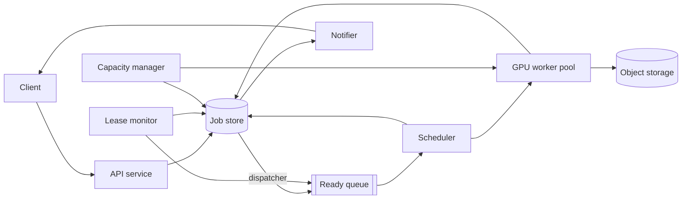

# Video Generation Pipeline (Sora-style)

[English](README.md) · [中文](README.zh.md)

<!-- meta:begin -->
| Type | Priority | Difficulty | Roles | Topics | Format | Round |
| --- | --- | --- | --- | --- | --- | --- |
| System design | ★★★★★ | Medium | SWE · Infra Eng · EM | gpu-scheduling, queueing, fault-tolerance | 60 min | Phone screen · Onsite |
<!-- meta:end -->

## Problem

A client submits a request to generate a short video from a text prompt: the prompt itself, a
requested duration, and a resolution. Design the backend that turns each accepted request into a
finished video — queueing the request, matching it to a GPU worker, running the generation,
storing the result, and notifying the user — on a GPU pool that is both limited in size and
fluctuating: workers run on instances rented from more than one cloud provider, and available
capacity can be reclaimed or drop sharply with no warning. Submitting a request must return a
durable `job_id` immediately, since generation itself takes minutes; the client polls or gets
pushed a status, a progress percentage, and, once finished, a link to download the result. A
queued or running job can be cancelled. The system matches every queued job to a free GPU worker —
each worker drives one GPU and runs one job at a time — and must keep going when a worker crashes,
is preempted by its cloud provider, or a network partition fools the scheduler into thinking a live
worker is dead — without losing an accepted job and without letting two workers both finalize the
same job. The focus of this design is scheduling and failure handling, not the generative model itself.

Scale for this design:

- 172,800 video-generation requests per day; the submission rate reaches 8x the daily average
  during a daily peak lasting up to an hour.
- Requested duration averages 6 seconds (range 3-20 s) regardless of resolution; resolution splits
  50% 480p, 35% 720p, 15% 1080p. Generating one second of output video costs about 10 GPU-seconds
  at 480p, 30 at 720p, and 80 at 1080p; encoded output size is about 1, 2.5, and 6 MB per
  output-second at the same three resolutions.
- Workers send a heartbeat every 10 seconds to renew their lease on a job, and a progress update
  every 5 seconds.
- The GPU pool draws instances from more than one cloud provider. During a capacity crunch (a
  provider reclaiming spot instances, a regional outage), available capacity can drop to as low as
  about 1,800 GPUs within minutes, and such a dip can last up to 20 minutes before the capacity
  manager brings up replacement capacity elsewhere.
- Targets: request acknowledgement under 300 ms and scheduling latency under 30 s, both at the
  95th percentile when the pool is at its normal size; progress updates no more than 5 s stale; no
  accepted job ever lost; at most 90 seconds of a job's GPU work redone after a worker loss; 99.9%
  availability; under 1% of accepted jobs permanently failing once retries are exhausted. During a
  capacity shortage, queueing delay is allowed to exceed the 30 s scheduling target, but the system
  must still surface a wait-time estimate and apply admission control instead of assuming capacity
  is unlimited.

The system is built on these components. The job store is a transactional database: a conditional
`UPDATE` reports how many rows it changed, and the statements of one transaction commit together or
not at all. It publishes a change stream that delivers every committed row change at least once, in
commit order, and a consumer that crashes resumes from the last position it acknowledged. Object
storage writes each key atomically but cannot make a write conditional on anything in the job store,
and queues take no part in job-store transactions.

In scope: everything about scheduling, worker lifecycle, checkpoint/resume, cancellation, capacity
fluctuation, priority and fair-share scheduling, and storing and delivering the output. Out of
scope: the generative model itself and its inference kernels — assume "generate `duration_sec`
seconds of video at `resolution` from a prompt" is available as a GPU-bound unit of work with the
per-second costs given above; prompt-safety checks and content moderation, which run on the prompt
before a request is queued and on the finished video before it may be downloaded, but are not
designed further here; and billing.

Produce:

1. A requirements and scale estimate: average and peak request rate, how many jobs are running
   concurrently, how large the GPU pool needs to be, what happens to the backlog and how long it
   takes to drain during the capacity-dip scenario above, and daily output storage volume.
2. A data model (job, checkpoint, result) and the core external and internal (worker-facing) APIs.
3. An architecture diagram and a walk-through of one request along it.
4. Deep dives into: lease-based scheduling with fencing tokens (including how cancellation reaches
   a running worker); checkpointing and retry policy; and how the design handles capacity
   volatility and priority scheduling, both when capacity drops and when traffic bursts. For each,
   compare at least two alternatives, say which you would pick, and state the cost.

## Reference solution

<details>
<summary>Show the reference solution</summary>

Worth confirming before designing: whether a run can be snapshotted mid-generation and resumed on
another worker. This design assumes it can, at about 3 seconds per snapshot.

### Requirements and scale

**Request rate.** $172{,}800$ requests/day average to $172{,}800 / 86{,}400 = 2$ requests/sec; at
8x that for the daily peak, peak submissions run at $16$ requests/sec.

**Average GPU-seconds per job.** Weighting the per-second GPU cost by the resolution mix,

$$
10 \times 0.50 + 30 \times 0.35 + 80 \times 0.15 = 27.5 \text{ GPU-sec per output-second,}
$$

and at the average requested duration of 6 seconds, a job costs
$6 \times 27.5 = 165$ GPU-seconds (about 2.75 minutes) — the $W$ used below.

**Concurrently running jobs.** By Little's law, $L = \lambda \cdot W$: at the average arrival rate,
$L_{\text{avg}} = 2 \times 165 = 330$ jobs running at once; at peak, $L_{\text{peak}} = 16 \times
165 = 2{,}640$. One worker runs one job, so $2{,}640$ is also the number of busy workers needed at
peak.

**Target pool size.** $2{,}640$ workers leaves no slack for ones booting, draining, or failing a
health check; with 20% headroom, $2{,}640 \times 1.2 = 3{,}168$, rounded up to **3,200 workers**,
which finish $3{,}200 / 165 \approx 19.4$ jobs/sec — peak arrival runs it at $\approx 82.5\%$
utilization, keeping queueing delay small.

**Backlog during a capacity dip.** At the given floor of $1{,}800$ GPUs, the pool finishes only
$10.9$ jobs/sec, a deficit of $\approx 5.1$ jobs/sec against peak arrivals; over the 1,200-second
dip that adds $\approx 6{,}100$ jobs. The $\approx 1{,}155$ jobs that were running on the $1{,}400$
reclaimed GPUs ($82.5\%$ of them busy) rejoin the queue too, on average half done, worth
$\approx 580$ more average jobs — a backlog of $\approx 6{,}690$ if every request is admitted. Once
the pool is back at 3,200 workers, the surplus over peak arrivals is $\approx 3.4$ jobs/sec, so
draining takes $\approx 1{,}970$ seconds, **about 33 minutes**, assuming arrivals stay at peak — far
past the 30-second target, so it has to surface as an ETA and trigger admission control.

**Storage.** Weighting output size the same way gives $2.275$ MB per output-second, or
$\approx 13.65$ MB per average job — about **2.36 TB/day** across 172,800 jobs.

### Data model and API

**Job** — `id`, `user_id`, `idempotency_key`, `prompt_ref` (opaque, already-moderated),
`model_version`, `duration_sec`, `resolution`, `priority_tier` (`free | plus | enterprise`),
`status` (`queued | running | succeeded | failed | cancelled`), `progress_pct`,
`cancel_requested`, `attempt_count`, `max_attempts`, `preemption_count`, `fencing_token` (a
per-job counter, bumped by every claim and never reset), `lease` (`{worker_id,
lease_expires_at}`, present only while `status = running`), `latest_checkpoint_id`, `result_id`,
`failure_reason`, `created_at`, `updated_at`.

**Checkpoint** — `id`, `job_id`, `fencing_token`, `storage_uri`, `progress_pct`, `created_at`,
`expires_at` (short TTL — superseded or terminal-job checkpoints are reclaimed quickly).

**Result** — `id`, `job_id`, `storage_uri`, `size_bytes`, `checksum`, `created_at`, `expires_at`
(a longer TTL for the downloadable artifact).

External API:

1. `POST /jobs` — `{prompt_ref, duration_sec, resolution, priority_tier, idempotency_key,
   callback_url}` → `202 {job_id, status: "queued", queue_eta_seconds}`; a retried submission
   carrying a seen `idempotency_key` returns the existing job.
2. `GET /jobs/{job_id}` — `{status, progress_pct, attempt_count, result_url, failure_reason}`.
3. `POST /jobs/{job_id}/cancel` — a terminal job is left as is; a `queued` job becomes `cancelled`
   through a compare-and-swap on `status = 'queued'`; a `running` job, including one a claim
   grabbed first, only gets `cancel_requested` set. Returns the resulting status.
4. `GET /jobs/{job_id}/result` — once `status = succeeded`, redirects to a short-lived signed URL.

Internal, worker-facing API — every call after `claim` carries the `fencing_token` it was issued;
the job store answers `409` when that token isn't the job's current one or the job is no longer
`running`:

1. `POST /workers/{worker_id}/claim` — returns `{job_id, fencing_token, lease_expires_at,
   resume_checkpoint_uri}`, or `204` if none available.
2. `POST /jobs/{job_id}/heartbeat` — `{fencing_token}` → `{lease_expires_at, cancel_requested}`.
3. `POST /jobs/{job_id}/progress` — `{fencing_token, progress_pct, eta_seconds}`; no lease effect.
4. `POST /jobs/{job_id}/checkpoint` — `{fencing_token, storage_uri, progress_pct}` → new
   `Checkpoint` row, and `latest_checkpoint_id` moves to it.
5. `POST /jobs/{job_id}/complete` — `{fencing_token, storage_uri, size_bytes, checksum}` → new
   `Result`, job `succeeded`.
6. `POST /jobs/{job_id}/fail` — `{fencing_token, reason, retryable}`; releases the lease and
   applies the retry/backoff/terminal-failure rule from the checkpointing deep dive.

### Architecture



A submission lands at the API service, which validates it and writes a `Job` row to the job store —
the one place a job's state is authoritative — before acknowledging the client, since a crash
between the two would let the client believe a job exists that the system has no record of. A
background dispatcher tails the store's change stream and turns queued jobs into entries in the
ready queue, a disposable, rebuildable index. The API
does not enqueue the job as it writes the row, because no transaction spans a database and a queue:
a crash between those two writes would strand the job, or leave an entry for a job that does not
exist. The stream delivers at least once, and a duplicate entry is harmless because only the claim's
compare-and-swap assigns the job. A GPU worker asking for work gets a candidate from the ready
queue, but only a compare-and-swap against the job's row in the store claims it; the scheduler then
hands the worker a 30-second lease (three heartbeat intervals) and a fencing token. The worker
generates the video, periodically persisting checkpoints and progress and renewing its lease,
then uploads the finished video to object storage and calls `complete`; the status change fans out
through the notifier as a webhook or SSE event. Two components run continuously alongside this path
rather than per-request: the lease monitor requeues any job whose lease expired without a
heartbeat, and the capacity manager watches queue depth and per-provider health, scaling the pool
and marking workers `draining` on a reclaim warning.

### Deep dives

**Lease-based scheduling with fencing tokens.** Invariant to protect: at most one attempt's writes
can still take effect, even when a partition or long pause makes the scheduler believe a worker is
dead while it keeps running.

- *Lease timeout alone*: the scheduler reassigns a job once its lease expires unheard-from. Cheap,
  but it only bounds how long the *scheduler* waits — nothing stops the *original* worker from
  finishing late (delayed by the same partition) and writing a completion after a second worker
  already took the job: split brain. Having the worker check its own lease before writing doesn't
  close the gap, since a pause can fall between the check and the write.
- *Fencing token on every write* (chosen): the claim's compare-and-swap also increments the job's
  `fencing_token`, and the new value goes to the worker. Every later worker call carries it and
  becomes a conditional update, `UPDATE jobs SET ... WHERE id = ? AND fencing_token = ? AND status
  = 'running'`; zero rows updated means the attempt is stale — superseded by a new claim, or
  already requeued or cancelled — and the `409` tells the worker to abandon it.

The object store cannot run that check on an upload, so each attempt writes its checkpoints and
result under keys containing its token
(`{job_id}/{fencing_token}/...`), never overwriting another attempt's objects, and an upload only
becomes current when the `checkpoint` or `complete` call commits its URI into the row under the
same condition; a fenced-off worker's uploads stay orphans until the TTL removes them. Cost: one
extra predicate on a write already keyed by job id. Fencing alone doesn't stop a fenced-off
worker's GPU: a worker that can't renew its lease stops when its own lease runs out, and one whose
partition heals stops at its first `409`.

Cancellation reuses this machinery. A `running` job's cancel only sets `cancel_requested`, since
nothing stops a remote worker on the spot: the worker learns at its next heartbeat (within 10 s),
stops, and calls `fail` with `reason: "cancelled"`, which ends the job `cancelled` without touching
the retry budget and deletes its checkpoints. If the worker is unreachable, the lease monitor finds
the flag when the lease expires and cancels instead of requeueing; a `complete` that lands before
the worker sees the flag wins, and the job ends `succeeded`.

**Checkpointing and retries.** A checkpoint trades a pause now for less recomputation after a
loss. Over each $T$ seconds of work a checkpoint costs $C$, and an unannounced worker loss (a
crash, a reclaim without warning), arriving on average every $\text{MTBF}$ seconds, redoes on
average $T/2$; the fraction of GPU time lost is therefore $C/T + T/(2 \cdot \text{MTBF})$, smallest
at $T^* = \sqrt{2 C \cdot \text{MTBF}}$ (Young's approximation). It assumes losses form a Poisson
process (a constant hazard, whatever a job has already done) with $C \ll \text{MTBF}$, so two
losses within one interval are negligible; a restart cost $R$ adds about $R/\text{MTBF}$ to the
loss but does not move $T^*$. A provider-wide outage is a burst rather than a rate, which is why
$\text{MTBF}$ below comes from a volatile period.

With $C = 3$ s and $\text{MTBF} = 900$ s, $T^* = \sqrt{2 \times 3 \times 900} \approx 73$ s — call
it 75 s. The loss there is under 9%, and the minimum is flat: 50 s or 100 s would cost less than
one percentage point more. At worst a crash lands just before a checkpoint commits and redoes
$T + C = 78$ s, inside the 90-second target.

Each job carries `attempt_count` and `max_attempts = 4`; a retryable `fail` other than a
preemption, or a lease expiry, increments it, a non-retryable one (an input the model rejects) ends the job at once, and reaching
the cap moves the job to terminal `failed` — `failure_reason` set, user notified — instead of back
to `queued`. A requeued job waits out an exponential backoff (base 5 s, factor 2, cap 60 s,
jitter) before it can be claimed again. That isn't to protect the pool — workers pull one job at a
time, so the queue absorbs a mass requeue — but to slow a job that crashes every worker it lands on
(a poison input, running out of GPU memory).

*Preemption* with notice (tens of seconds): the capacity manager marks the worker `draining`, the
worker takes an out-of-band checkpoint and fails with `reason: "preempted"`, and the job is
requeued at once — outside the retry budget, but counted in a separately capped
`preemption_count`, so a job that keeps getting reclaimed is eventually pinned to steadier,
non-preemptible capacity. A *crash*, or a reclaim with no warning, which looks the same, is noticed
only at lease expiry, up to 30 s later; it redoes at most one interval and does consume the retry
budget, since without extra signal it can't be told apart from a job-specific failure. The
detection delay postpones the retry but costs no GPU work — the lost GPU is gone either way.

**Capacity volatility and priority scheduling.** The pool spans several cloud providers and
regions; the capacity manager tracks per-provider counts and requests replacement capacity
elsewhere when one shrinks, so the scheduler sees the *aggregate* pool. Jobs on reclaimed instances
are displaced no matter what; the choice is which *other* running jobs yield when a higher-tier
job has waited past its tier's target (say 30 s for `enterprise`) — the case where waiting for the
next GPU to free up isn't enough:

- *Oldest-first*: preempt whichever attempt has run longest. Simple, but it ignores tier, and the
  oldest attempt is often the closest to finishing — about to free its GPU anyway.
- *Priority tier, then least progress* (chosen): rank running attempts by `priority_tier`, then
  `progress_pct`, and preempt from the front, only jobs of a lower tier than the one waiting — a
  fresh `free` job yields before a nearly done `plus` one, and an `enterprise` job never yields.
  The yielding job checkpoints out of band first, so little is redone, and one whose
  `preemption_count` has hit its cap is skipped, so no job is bounced forever. Cost: a live index
  on `(priority_tier, progress_pct)`, and a checkpoint plus a reload for every job moved.

A single FIFO queue lets one tier crowd out the others and, when the pool mixes GPU types, lets a
job at its head that needs a type the asking worker lacks block the compatible jobs behind it. The
ready queue is instead partitioned by `(priority_tier, gpu_class)` and pulled with weighted
round-robin (`enterprise : plus : free` roughly `6 : 3 : 1`), skipping empty partitions. That share
is the guarantee against starvation: while `free` has queued work it gets at least a tenth of
dispatches however heavy paid traffic is. Tier is not the only input: within a partition the
scheduler rotates between users instead of following submission time strictly, so one account
queueing 500 jobs cannot push a same-tier account behind all of them, and inside one user
submission order holds, so a job only moves forward as it waits. A job requeued after a preemption
rejoins at the front of its user's jobs, so yielding a GPU does not also cost it its place in line.

At submission the API computes the job's ETA: GPU-seconds queued ahead of it in its partition,
divided by the GPU-seconds per second that partition received over the last minute. `free`-tier
submissions with an ETA over 10 minutes get `429` instead of an indefinite queue; paid tiers are
always accepted and shown their ETA, which stays bounded as long as paid arrivals alone fit within
the shrunken pool.

Preemption's own cost is invisible in a job's latency, so it is measured separately: GPU-seconds
redone after a preemption as a share of GPU-seconds spent, preemptions per running job per hour by
tier, how many jobs reached their `preemption_count` cap, and each partition's share of dispatches —
the last is the starvation alarm: `free` with queued work and under a tenth of dispatches means the
weighted round-robin is being bypassed.

### Follow-ups

- Moderating the finished video adds a condition to the download: the check runs on the `complete`
  path and records its verdict on the `Result` row, and `GET /jobs/{job_id}/result` signs a URL only
  for a job that is both `succeeded` and cleared.
- A worker whose `complete` call times out retries it, though the first call may already have gone
  through: the row keeps the token after success, so a `complete` whose token matches an already
  `succeeded` job returns success instead of `409`.

<details>
<summary>Estimate check (runnable)</summary>

```python
import math
import random

# ---- arrival rates ----
requests_per_day = 172_800
avg_rate = requests_per_day / 86_400
assert avg_rate == 2.0
peak_to_avg = 8
peak_rate = avg_rate * peak_to_avg
assert peak_rate == 16.0
assert peak_rate * 3600 < requests_per_day            # an hour at peak fits inside the daily total

# ---- average GPU-seconds per job, weighted by resolution mix ----
tiers = {
    "480p":  dict(share=0.50, gpu_sec_per_sec=10, mb_per_sec=1.0),
    "720p":  dict(share=0.35, gpu_sec_per_sec=30, mb_per_sec=2.5),
    "1080p": dict(share=0.15, gpu_sec_per_sec=80, mb_per_sec=6.0),
}
assert abs(sum(t["share"] for t in tiers.values()) - 1.0) < 1e-9

avg_duration_sec = 6
weighted_gpu_factor = sum(t["share"] * t["gpu_sec_per_sec"] for t in tiers.values())
assert weighted_gpu_factor == 27.5
avg_gpu_seconds = avg_duration_sec * weighted_gpu_factor
assert avg_gpu_seconds == 165.0

# ---- Little's law: concurrently running jobs = arrival rate x average service time ----
L_avg = avg_rate * avg_gpu_seconds
L_peak = peak_rate * avg_gpu_seconds
assert L_avg == 330.0
assert L_peak == 2640.0

# ---- target GPU pool with headroom for booting/draining/failed instances ----
headroom = 0.20
target_pool_raw = L_peak * (1 + headroom)
assert target_pool_raw == 3168.0
target_pool = 3200                                    # rounded up from 3,168
mu_target = target_pool / avg_gpu_seconds              # jobs/sec the target pool can finish
assert round(mu_target, 2) == 19.39
utilization = peak_rate / mu_target
assert round(utilization, 3) == 0.825

# ---- capacity-dip scenario: pool falls to the given floor for 20 minutes ----
floor_pool = 1_800
mu_floor = floor_pool / avg_gpu_seconds
assert round(mu_floor, 2) == 10.91
deficit = peak_rate - mu_floor
dip_seconds = 20 * 60
backlog_from_arrivals = deficit * dip_seconds
assert round(backlog_from_arrivals, -2) == 6100

# jobs running on the reclaimed GPUs requeue too, on average half done
displaced = (target_pool - floor_pool) * utilization
assert round(displaced) == 1155
backlog = backlog_from_arrivals + displaced / 2       # in average-job equivalents
assert round(backlog, -1) == 6690

surplus = mu_target - peak_rate
drain_seconds = backlog / surplus
assert round(drain_seconds, -1) == 1970
assert round(drain_seconds / 60) == 33
assert dip_seconds + drain_seconds < 3600             # dip plus drain fit inside the hour-long peak

# ---- daily output storage ----
weighted_mb_per_sec = sum(t["share"] * t["mb_per_sec"] for t in tiers.values())
assert weighted_mb_per_sec == 2.275
avg_video_mb = weighted_mb_per_sec * avg_duration_sec
assert round(avg_video_mb, 2) == 13.65
daily_storage_tb = requests_per_day * avg_video_mb / 1e6
assert round(daily_storage_tb, 2) == 2.36

# ---- checkpoint interval: Young's approximation ----
C = 3                         # seconds per checkpoint
M = 900                       # seconds between unannounced worker losses, volatile period
T_star = math.sqrt(2 * C * M)
assert round(T_star) == 73
T = 75                        # interval used in the write-up

def loss_first_order(t):
    # checkpoint time per unit of work + expected redo (t/2 per loss) per unit of time
    return C / t + t / (2 * M)

assert 0.08 < loss_first_order(T) < 0.09
for other in (50, 100):
    assert 0 < loss_first_order(other) - loss_first_order(T) < 0.01     # the minimum is flat
assert T + C <= 90                                     # worst-case redo meets the target

# independent check: exact expected time per segment under Poisson losses with restart cost R,
# e^(R/M) * M * (e^((t+C)/M) - 1), minimized numerically
def loss_exact(t, R):
    return math.exp(R / M) * M * (math.exp((t + C) / M) - 1) / t - 1

grid = [x / 10 for x in range(100, 3001)]
for R in (0, 30, 120):
    best = min(grid, key=lambda t: loss_exact(t, R))
    assert abs(best - 71.5) < 0.2                      # R does not move the optimum
    assert abs(best - T_star) < 3                      # Young is within a few seconds of it
    assert loss_exact(T, R) - loss_exact(best, R) < 0.001
assert loss_exact(T, 0) < 0.09

# Monte Carlo of one long job: check the exact formula, and that 75 s beats 20 s and 300 s
def simulated_loss(t, R, work, runs, rng):
    total = 0.0
    for _ in range(runs):
        done = elapsed = 0.0
        while done < work:
            lost_at = rng.expovariate(1 / M)
            if lost_at >= t + C:                      # segment and its checkpoint both finish
                elapsed, done = elapsed + t + C, done + t
            else:                                     # redo from the last checkpoint
                elapsed += lost_at + R
        total += elapsed
    return total / (runs * work) - 1

rng = random.Random(7)
work = 22_500                                           # a multiple of 20, 75 and 300
sim = {t: simulated_loss(t, 30, work, 400, rng) for t in (20, 75, 300)}
for t, v in sim.items():
    assert abs(v - loss_exact(t, 30)) < 0.01, (t, v, loss_exact(t, 30))
assert sim[75] < sim[20] and sim[75] < sim[300]

print("all estimation numbers check out")
```

</details>

</details>
