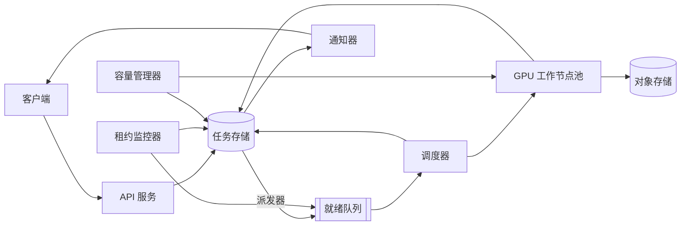

# 视频生成流水线（类 Sora）

[English](README.md) · [中文](README.zh.md)

<!-- meta:begin -->
| 题型 | 优先级 | 难度 | 岗位 | 考点 | 形式 | 轮次 |
| --- | --- | --- | --- | --- | --- | --- |
| 系统设计 | ★★★★★ | 中等 | SWE · Infra Eng · EM | gpu-scheduling, queueing, fault-tolerance | 60 分钟 | 电话面 · 现场面 |
<!-- meta:end -->

## 题目

客户端提交一个请求，要求根据一段文本提示词生成一段短视频：提示词本身、要求的时长、以及分辨率。设计把每个被接受的请求变成一段成片的后端系统——排队、把请求匹配给一个 GPU 工作节点、执行生成、保存结果、通知用户——运行在一个规模有限且会波动的 GPU 池上：工作节点跑在从不止一个云厂商租来的实例上，可用容量随时可能被收回，或者毫无预警地骤降。提交请求必须立刻返回一个持久化的 `job_id`，因为生成本身要花几分钟；客户端通过轮询或被推送拿到状态、进度百分比，完成后拿到结果的下载链接。处于排队中或正在运行的任务可以被取消。系统把每个排队中的任务分配给一个可用的 GPU 工作节点——每个工作节点占用一块 GPU，同一时刻只跑一个任务；系统必须在工作节点崩溃、被云厂商抢占、或者网络分区让调度器误以为一个还活着的工作节点已经死掉时继续运转——既不能丢失已接受的任务，也不能让两个工作节点同时把同一个任务标记为完成。这次设计的重点是调度与故障处理，不是生成模型本身。

这次设计的规模：

- 每天 172,800 次视频生成请求，其中有一段最长约一小时的高峰，提交速率达到日均值的 8 倍。
- 请求的时长平均 6 秒（范围 3-20 秒），与分辨率无关；分辨率占比 480p 50%、720p 35%、1080p 15%。生成一秒输出视频，480p 大约耗费 10 个 GPU-秒，720p 30 个，1080p 80 个；编码后的输出体积在这三档分辨率下分别约为每输出秒 1、2.5、6 MB。
- 工作节点每 10 秒发一次心跳，续订它所持任务的租约（lease），每 5 秒上报一次进度。
- GPU 池的实例来自不止一个云厂商。遇到容量紧张时（某个厂商收回 spot 实例、某个地区出故障），可用容量可能在几分钟内跌到约 1,800 个 GPU，这样的低谷可能持续长达 20 分钟，容量管理器才能在别处补上替代容量。
- 目标：请求确认（P95）低于 300 毫秒、调度延迟（P95，池处于正常规模时）低于 30 秒；进度更新的陈旧程度不超过 5 秒；已接受的任务绝不丢失；一次工作节点丢失后，任务需要重做的 GPU 工作不超过 90 秒；可用性 99.9%；重试耗尽后彻底失败的任务不超过已接受任务的 1%。容量紧张期间，排队延迟允许超过 30 秒的调度延迟目标，但系统必须把预计等待时间（ETA）展示出来，并做准入控制，而不是假装容量是无限的。

这套系统建立在下面这些组件上。任务存储是一个事务型数据库：条件 `UPDATE` 会报告自己改动了几行，同一个事务里的语句要么一起提交、要么都不提交；它发布一个变更流，把每一次已提交的行变更按提交顺序至少投递一次，消费者崩溃后从自己最后确认的位置续读。对象存储按键原子写入，但没法把一次写入的条件挂在任务存储的内容上；队列不参与任务存储的事务。

范围内：调度、工作节点生命周期、检查点与恢复、取消、容量波动、优先级与公平调度，以及输出的存储与交付。范围外：生成模型本身及其推理内核——假设“根据提示词按 `resolution` 生成 `duration_sec` 秒视频”已经是一个可用的、受 GPU 限制的工作单元，耗费按上面给出的每秒成本计算；提示词安全检查与内容审核，它们在入队前作用于提示词、在允许下载前作用于成片，但这里不展开设计；计费。

要产出：

1. 需求与规模估算：平均和峰值的请求速率、同时有多少任务在运行、GPU 池需要多大、在上面给出的容量骤降场景下积压会怎样增长、需要多久才能消化完，以及每天的输出存储量。
2. 数据模型（任务、检查点、结果）和核心的对外接口与对内（面向工作节点）接口。
3. 一张架构图，并沿着一次请求把整条路径走一遍。
4. 深入话题：带隔离令牌（fencing token）的租约调度（包括取消请求如何传到正在运行的工作节点）；检查点与重试策略；以及这套设计如何应对容量波动与优先级调度——容量骤降和流量突发这两种情况都要覆盖。每个话题至少比较两种方案，说明你会选哪个，并给出这个选择的代价。

## 参考解答

<details>
<summary>展开参考解答</summary>

动手设计之前值得先确认：一次生成能否在中途打快照、换一个工作节点接着跑。这里假设可以，每个快照耗时约 3 秒。

### 需求与规模

**请求速率。** $172{,}800$ 次请求/天，平均下来 $172{,}800 / 86{,}400 = 2$ 次/秒；日峰值是这个数字的 8 倍，峰值提交速率为 $16$ 次/秒。

**每个任务的平均 GPU-秒数。** 按分辨率占比对每秒 GPU 成本加权，

$$
10 \times 0.50 + 30 \times 0.35 + 80 \times 0.15 = 27.5 \text{ 个 GPU-秒 / 输出秒，}
$$

按平均请求时长 6 秒算，一个任务平均耗费 $6 \times 27.5 = 165$ 个 GPU-秒（约 2.75 分钟）——这就是下面用到的 $W$。

**同时在跑的任务数。** 由 Little 定律，$L = \lambda \cdot W$：按平均到达速率，$L_{\text{avg}} = 2 \times 165 = 330$ 个任务同时在跑；按峰值，$L_{\text{peak}} = 16 \times 165 = 2{,}640$ 个。一个工作节点跑一个任务，所以 $2{,}640$ 同时也是峰值下需要的忙碌工作节点数。

**目标池规模。** 恰好配 $2{,}640$ 个工作节点，没给还在启动、排空、或刚挂掉健康检查的节点留余量；加 20% 余量，$2{,}640 \times 1.2 = 3{,}168$，向上取整为 **3,200 个工作节点**，能完成 $3{,}200 / 165 \approx 19.4$ 个任务/秒——峰值到达时利用率约 $82.5\%$，排队延迟很小。

**容量骤降期间的积压。** 按给定的下限 $1{,}800$ 个 GPU，池只能完成 $10.9$ 个任务/秒，相对峰值到达的缺口约 $5.1$ 个任务/秒；1,200 秒的骤降期内积压增加约 $6{,}100$ 个任务。被收回的 $1{,}400$ 个 GPU 中有 $82.5\%$ 正在跑任务，这约 $1{,}155$ 个任务也要重新排队，平均已完成一半，折合约 $580$ 个平均任务——如果来者不拒，积压约为 $6{,}690$ 个。池恢复到 3,200 个工作节点后，相对峰值到达的富余约 $3.4$ 个任务/秒，消化完需要约 $1{,}970$ 秒，**约 33 分钟**（假设到达速率一直停在峰值）——远超 30 秒的目标，必须作为 ETA 展示出来，并触发准入控制。

**存储。** 按同样权重算输出体积，每输出秒 $2.275$ MB，平均每个任务约 $13.65$ MB——172,800 个任务每天约 **2.36 TB** 成片视频。

### 数据模型与 API

**Job（任务）** —— `id`、`user_id`、`idempotency_key`、`prompt_ref`（已过审提示词的不透明引用）、`model_version`、`duration_sec`、`resolution`、`priority_tier`（`free | plus | enterprise`）、`status`（`queued | running | succeeded | failed | cancelled`）、`progress_pct`、`cancel_requested`、`attempt_count`、`max_attempts`、`preemption_count`、`fencing_token`（每个任务一个计数器，每次领取加一，从不重置）、`lease`（`{worker_id, lease_expires_at}`，只在 `running` 时存在）、`latest_checkpoint_id`、`result_id`、`failure_reason`、`created_at`、`updated_at`。

**Checkpoint（检查点）** —— `id`、`job_id`、`fencing_token`、`storage_uri`、`progress_pct`、`created_at`、`expires_at`（TTL 较短，被取代或终止态任务的检查点很快回收）。

**Result（结果）** —— `id`、`job_id`、`storage_uri`、`size_bytes`、`checksum`、`created_at`、`expires_at`（下载用的 TTL 更长）。

对外接口：

1. `POST /jobs` —— `{prompt_ref, duration_sec, resolution, priority_tier, idempotency_key, callback_url}` → `202 {job_id, status: "queued", queue_eta_seconds}`；带着已见过的 `idempotency_key` 重试提交，返回已有任务。
2. `GET /jobs/{job_id}` —— `{status, progress_pct, attempt_count, result_url, failure_reason}`。
3. `POST /jobs/{job_id}/cancel` —— 已处于终止态的任务保持不变；`queued` 任务通过一次以 `status = 'queued'` 为条件的比较后交换（compare-and-swap）变为 `cancelled`；`running` 任务（包括被领取抢先一步的）只设置 `cancel_requested`。返回处理后的状态。
4. `GET /jobs/{job_id}/result` —— 一旦 `status = succeeded`，重定向到一个短时有效的签名 URL。

对内、面向工作节点的接口——`claim` 之后的每一次调用都要带上领取时拿到的 `fencing_token`；令牌不是任务当前的令牌、或者任务已不处于 `running` 时，任务存储返回 `409`：

1. `POST /workers/{worker_id}/claim` —— 返回 `{job_id, fencing_token, lease_expires_at, resume_checkpoint_uri}`，没有可用任务则返回 `204`。
2. `POST /jobs/{job_id}/heartbeat` —— `{fencing_token}` → `{lease_expires_at, cancel_requested}`。
3. `POST /jobs/{job_id}/progress` —— `{fencing_token, progress_pct, eta_seconds}`；不影响租约。
4. `POST /jobs/{job_id}/checkpoint` —— `{fencing_token, storage_uri, progress_pct}` → 新建一条 `Checkpoint` 记录，并把 `latest_checkpoint_id` 指向它。
5. `POST /jobs/{job_id}/complete` —— `{fencing_token, storage_uri, size_bytes, checksum}` → 新建 `Result`，任务变为 `succeeded`。
6. `POST /jobs/{job_id}/fail` —— `{fencing_token, reason, retryable}`；释放租约，套用检查点深入话题里的重试/退避/终止态规则。

### 架构



一次提交先到 API 服务，校验请求、把一条 `Job` 记录写进任务存储——唯一权威来源——然后才确认给客户端；两步之间一旦崩溃，客户端会以为存在一个系统里根本没有记录的任务。后台派发器追读任务存储的变更流，把排队中的任务变成就绪队列里的条目，这是一个可丢弃、可重建的索引。API 不会在写记录的同时把任务入队，因为没有事务能同时覆盖数据库和队列：在这两次写入之间崩溃，要么任务被晾在那里，要么队列里留下一个指向不存在任务的条目。变更流至少投递一次，重复的条目无害，因为只有领取时的比较后交换才真正把任务分出去。GPU 工作节点来要活时，调度器从就绪队列挑一个候选，但只有针对任务存储里那行记录的一次比较后交换成功，才算真正领取；随后调度器把一个 30 秒的租约（三个心跳间隔）和一个隔离令牌交给工作节点。工作节点生成视频，期间不断持久化检查点和进度、续租，最后把成片上传到对象存储并调用 `complete`；状态变化经通知器以 webhook 或 SSE 事件发出。另外两个组件持续在这条路径之外运行：租约监控器把租约过期、没等到心跳的任务重新入队；容量管理器盯着队列深度和各厂商的工作节点健康状况，据此伸缩池子、在收回预警时把对应工作节点标记为 `draining`。

### 深入话题

**带隔离令牌的租约调度。** 要保护的不变量：任何时刻，一个任务至多只有一次尝试的写入还能生效——即便网络分区或长时间停顿让调度器误以为某个工作节点已经死了、而它其实还在跑。

- *只靠租约超时*：调度器在租约过期还没等到心跳时重新分配任务。便宜，但只限定了*调度器*要等多久——挡不住*原来那个*工作节点照样把活干完（被同一次网络分区拖慢），在第二个工作节点已领走同一任务后还写下完成结果：这就是脑裂（split brain）。让工作节点写入前自己查一下租约也堵不住这个口子，因为停顿可能恰好落在检查和写入之间。
- *每次写入都核对隔离令牌*（选择的方案）：领取任务的那次比较后交换同时把任务的 `fencing_token` 加一，新值发给工作节点。之后工作节点的每次调用都带上它，变成一次条件更新：`UPDATE jobs SET ... WHERE id = ? AND fencing_token = ? AND status = 'running'`；影响行数为零说明这次尝试已经过期——被新的领取取代，或者任务已被重新排队、已被取消——返回的 `409` 让工作节点放弃这次尝试。

对象存储没法对上传做这项检查，所以每次尝试都把检查点和结果写到包含自己令牌的键下（`{job_id}/{fencing_token}/...`），从不覆盖别的尝试的对象；上传的对象只有在 `checkpoint` 或 `complete` 调用按同样的条件把它的 URI 写进任务记录之后才生效，被隔离的工作节点上传的对象成为无主对象，由 TTL 清掉。代价：一次本来就按任务 id 定位的写入上多一个条件。隔离令牌本身不会让被隔离的工作节点停下 GPU：续不了租的工作节点在自己的租约到期时自行停止，网络恢复后的则在收到第一个 `409` 时停止。

取消复用同一套机制。`running` 任务的取消只设置 `cancel_requested`，因为没法当场叫停一个远端的工作节点：工作节点在下一次心跳（10 秒以内）时得知，停下，用 `reason: "cancelled"` 调 `fail`，任务随即变为 `cancelled`，不占重试预算，检查点也被删除。如果工作节点联系不上，租约监控器在租约过期时看到这个标记，就直接取消而不是重新排队；如果 `complete` 抢在工作节点看到标记之前到达，则以完成为准，任务结束于 `succeeded`。

**检查点与重试。** 做检查点是用眼下的一次暂停，换取丢失工作节点之后更少的重算。每做 $T$ 秒的工作打一次检查点，花 $C$ 秒；没有预告的工作节点丢失（崩溃、无预警的收回）平均每隔 $\text{MTBF}$ 秒发生一次，每次平均要重做 $T/2$。于是损失的 GPU 时间比例是 $C/T + T/(2 \cdot \text{MTBF})$，在 $T^* = \sqrt{2 C \cdot \text{MTBF}}$ 处最小（Young 近似）。它假设丢失事件构成泊松过程（风险率恒定，与任务已经跑了多久无关），且 $C \ll \text{MTBF}$，因而一个间隔内发生两次丢失可以忽略；重启开销 $R$ 让损失增加约 $R/\text{MTBF}$，但不改变 $T^*$。波及整个厂商的故障是一阵突发而不是一个稳定的速率，所以下面的 $\text{MTBF}$ 取自波动期。

代入 $C = 3$ 秒、$\text{MTBF} = 900$ 秒，$T^* = \sqrt{2 \times 3 \times 900} \approx 73$ 秒，取 75 秒。此时的损失不到 9%，而且最小值附近很平：取 50 秒或 100 秒，只多损失不到一个百分点。最坏情况是崩溃恰好发生在一次检查点提交之前，要重做 $T + C = 78$ 秒，仍在 90 秒的目标之内。

每个任务带着 `attempt_count` 和 `max_attempts = 4`：可重试的 `fail`（被抢占的除外）或租约过期让它加一，不可重试的失败（例如模型拒绝的输入）立即结束任务，达到上限就进入终止态 `failed`（写明 `failure_reason` 并通知用户），不再回到 `queued`。重新入队的任务要先等一段指数退避（基数 5 秒、倍率 2、上限 60 秒、加抖动）才能再被领取。这不是为了保护池子——工作节点一次只拉一个任务，大批任务同时重新入队也只是在队列里排着——而是为了拖慢一个落到哪个工作节点就让哪个崩溃的任务（有毒的输入、显存不足）。

*被抢占*有提前通知（几十秒）：容量管理器把工作节点标记为 `draining`，工作节点立刻做一次计划外检查点，以 `reason: "preempted"` 调 `fail`，任务立即重新入队——不占重试预算，但计入单独设了上限的 `preemption_count`，反复被收回的任务最终会被钉在更稳定、不可抢占的容量上。*崩溃*和没有预警的收回看起来一样，只有等租约过期才会被发现，最长要 30 秒；这类丢失最多重做一个间隔的工作，并且会占用重试预算，因为没有额外信号就无法把它和任务本身的失败区分开。发现得晚只会推迟重试，不会多损失 GPU 工作——那块 GPU 反正已经没了。

**容量波动与优先级调度。** GPU 池横跨几个云厂商和地区；容量管理器跟踪各厂商的工作节点数量，一个厂商收缩时就向别处申请替代容量，调度器看到的始终是*聚合后*的池子。被收回实例上的任务无论如何都会被挤掉。要决定的是另一件事：某个高档位任务的等待已经超过所在档位的目标（例如 `enterprise` 为 30 秒）、光等下一块 GPU 空出来已经不够时，还要让哪些*别的*正在运行的任务让出 GPU：

- *最早启动的先让*：让运行时间最长的那次尝试让出。简单，但不看档位；而且运行最久的尝试往往最接近完成，本来很快就会空出 GPU。
- *先按优先级档位、再按进度最少排序*（选择的方案）：正在运行的尝试先按 `priority_tier`、再按 `progress_pct` 升序排列，从队首开始让出，而且只让比等待者档位低的任务让出——刚起步的 `free` 任务会在快完成的 `plus` 任务之前让出，`enterprise` 任务从不让出。让出的任务先做一次计划外检查点，几乎不用重做；`preemption_count` 已达上限的任务会被跳过，所以没有任务会被反复挤掉。代价：要在 `(priority_tier, progress_pct)` 上维护一份实时排序索引，每挪动一个任务都要付一次检查点加一次重新加载。

单一 FIFO 队列会让某个档位挤占其他档位；池子里混有不同 GPU 型号时，排在队首的任务如果需要来要活的工作节点所没有的型号，还会堵住后面能在这个节点上跑的任务。因此就绪队列按 `(priority_tier, gpu_class)` 分区，用加权轮询取任务（`enterprise : plus : free` 大致 `6 : 3 : 1`），跳过空分区。这个份额就是防饿死的保证：只要 `free` 分区里有排队的任务，不管付费流量多大，它都能拿到至少十分之一的派发。决定顺序的不只有档位：分区内部在用户之间轮转，而不是严格按提交时间出队，这样一个账号一次排进 500 个任务也压不住同档位的别人；同一个用户内部仍按提交顺序，任务只会越等越靠前。被挤掉后重新入队的任务排在自己这个用户的队首，让出 GPU 不该连排队的位置也一起丢掉。

提交时，API 算出任务的 ETA：它所在分区里排在它前面的 GPU-秒总数，除以这个分区最近一分钟里每秒得到的 GPU-秒数。`free` 档提交若 ETA 超过 10 分钟就返回 `429`，而不是塞进一个排不完的队列；付费档位总是被接受并看到自己的 ETA，只要付费任务本身的到达速率不超过缩水后的池子的处理能力，这个 ETA 就有上限。

抢占自身的代价不会出现在任务的延迟里，要单独度量：抢占后重做的 GPU-秒占已花 GPU-秒的比例、按档位分的每个运行中任务每小时被抢占次数、`preemption_count` 触到上限的任务数，以及各分区实际拿到的派发份额——最后一项是饿死的告警：`free` 有排队任务、份额却不到十分之一，说明加权轮询被绕过了。

### 追问

- 对成片的审核给下载加了一个条件：这项检查跑在 `complete` 这条路径上，把判定写进 `Result` 记录，`GET /jobs/{job_id}/result` 只为既 `succeeded` 又通过审核的任务签发 URL。
- `complete` 调用超时的工作节点会重试，而第一次调用可能其实已经成功：任务成功后记录里仍保留那次尝试的令牌，所以令牌相符、任务已是 `succeeded` 的 `complete` 返回成功，而不是 `409`。

<details>
<summary>估算核对（可运行）</summary>

```python
import math
import random

# ---- arrival rates ----
requests_per_day = 172_800
avg_rate = requests_per_day / 86_400
assert avg_rate == 2.0
peak_to_avg = 8
peak_rate = avg_rate * peak_to_avg
assert peak_rate == 16.0
assert peak_rate * 3600 < requests_per_day            # an hour at peak fits inside the daily total

# ---- average GPU-seconds per job, weighted by resolution mix ----
tiers = {
    "480p":  dict(share=0.50, gpu_sec_per_sec=10, mb_per_sec=1.0),
    "720p":  dict(share=0.35, gpu_sec_per_sec=30, mb_per_sec=2.5),
    "1080p": dict(share=0.15, gpu_sec_per_sec=80, mb_per_sec=6.0),
}
assert abs(sum(t["share"] for t in tiers.values()) - 1.0) < 1e-9

avg_duration_sec = 6
weighted_gpu_factor = sum(t["share"] * t["gpu_sec_per_sec"] for t in tiers.values())
assert weighted_gpu_factor == 27.5
avg_gpu_seconds = avg_duration_sec * weighted_gpu_factor
assert avg_gpu_seconds == 165.0

# ---- Little's law: concurrently running jobs = arrival rate x average service time ----
L_avg = avg_rate * avg_gpu_seconds
L_peak = peak_rate * avg_gpu_seconds
assert L_avg == 330.0
assert L_peak == 2640.0

# ---- target GPU pool with headroom for booting/draining/failed instances ----
headroom = 0.20
target_pool_raw = L_peak * (1 + headroom)
assert target_pool_raw == 3168.0
target_pool = 3200                                    # rounded up from 3,168
mu_target = target_pool / avg_gpu_seconds              # jobs/sec the target pool can finish
assert round(mu_target, 2) == 19.39
utilization = peak_rate / mu_target
assert round(utilization, 3) == 0.825

# ---- capacity-dip scenario: pool falls to the given floor for 20 minutes ----
floor_pool = 1_800
mu_floor = floor_pool / avg_gpu_seconds
assert round(mu_floor, 2) == 10.91
deficit = peak_rate - mu_floor
dip_seconds = 20 * 60
backlog_from_arrivals = deficit * dip_seconds
assert round(backlog_from_arrivals, -2) == 6100

# jobs running on the reclaimed GPUs requeue too, on average half done
displaced = (target_pool - floor_pool) * utilization
assert round(displaced) == 1155
backlog = backlog_from_arrivals + displaced / 2       # in average-job equivalents
assert round(backlog, -1) == 6690

surplus = mu_target - peak_rate
drain_seconds = backlog / surplus
assert round(drain_seconds, -1) == 1970
assert round(drain_seconds / 60) == 33
assert dip_seconds + drain_seconds < 3600             # dip plus drain fit inside the hour-long peak

# ---- daily output storage ----
weighted_mb_per_sec = sum(t["share"] * t["mb_per_sec"] for t in tiers.values())
assert weighted_mb_per_sec == 2.275
avg_video_mb = weighted_mb_per_sec * avg_duration_sec
assert round(avg_video_mb, 2) == 13.65
daily_storage_tb = requests_per_day * avg_video_mb / 1e6
assert round(daily_storage_tb, 2) == 2.36

# ---- checkpoint interval: Young's approximation ----
C = 3                         # seconds per checkpoint
M = 900                       # seconds between unannounced worker losses, volatile period
T_star = math.sqrt(2 * C * M)
assert round(T_star) == 73
T = 75                        # interval used in the write-up

def loss_first_order(t):
    # checkpoint time per unit of work + expected redo (t/2 per loss) per unit of time
    return C / t + t / (2 * M)

assert 0.08 < loss_first_order(T) < 0.09
for other in (50, 100):
    assert 0 < loss_first_order(other) - loss_first_order(T) < 0.01     # the minimum is flat
assert T + C <= 90                                     # worst-case redo meets the target

# independent check: exact expected time per segment under Poisson losses with restart cost R,
# e^(R/M) * M * (e^((t+C)/M) - 1), minimized numerically
def loss_exact(t, R):
    return math.exp(R / M) * M * (math.exp((t + C) / M) - 1) / t - 1

grid = [x / 10 for x in range(100, 3001)]
for R in (0, 30, 120):
    best = min(grid, key=lambda t: loss_exact(t, R))
    assert abs(best - 71.5) < 0.2                      # R does not move the optimum
    assert abs(best - T_star) < 3                      # Young is within a few seconds of it
    assert loss_exact(T, R) - loss_exact(best, R) < 0.001
assert loss_exact(T, 0) < 0.09

# Monte Carlo of one long job: check the exact formula, and that 75 s beats 20 s and 300 s
def simulated_loss(t, R, work, runs, rng):
    total = 0.0
    for _ in range(runs):
        done = elapsed = 0.0
        while done < work:
            lost_at = rng.expovariate(1 / M)
            if lost_at >= t + C:                      # segment and its checkpoint both finish
                elapsed, done = elapsed + t + C, done + t
            else:                                     # redo from the last checkpoint
                elapsed += lost_at + R
        total += elapsed
    return total / (runs * work) - 1

rng = random.Random(7)
work = 22_500                                           # a multiple of 20, 75 and 300
sim = {t: simulated_loss(t, 30, work, 400, rng) for t in (20, 75, 300)}
for t, v in sim.items():
    assert abs(v - loss_exact(t, 30)) < 0.01, (t, v, loss_exact(t, 30))
assert sim[75] < sim[20] and sim[75] < sim[300]

print("all estimation numbers check out")
```

</details>

</details>
