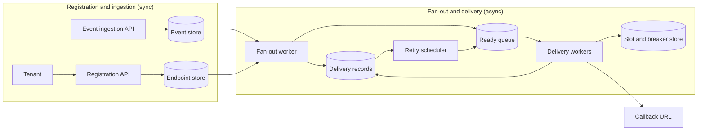

# Webhook Delivery

[English](README.md) · [中文](README.zh.md)

<!-- meta:begin -->
| Type | Priority | Difficulty | Roles | Topics | Round |
| --- | --- | --- | --- | --- | --- |
| System design | ★★☆☆☆ | — | SWE · Infra Eng | queueing, retry, idempotency, security | Onsite |
<!-- meta:end -->

## Problem

Design the webhook delivery system behind a multi-tenant SaaS platform. Each tenant registers one or
more *endpoints* — an HTTPS callback URL plus the subset of event types it wants — and the platform must
deliver every matching event to every one of that tenant's active endpoints as an HTTP POST, with
**at-least-once** delivery: a retried delivery is preferable to a lost one. Events are produced entirely
inside the platform (a job finishes, an order changes status, ...) and each is scoped to exactly one
tenant; an event is never delivered to another tenant's endpoints.

Scale for this design:

- 216,000,000 events/day platform-wide, averaging 3 subscribed endpoints per event, for 648,000,000
  baseline delivery attempts/day before any retries.
- Traffic has roughly a 3x peak-to-average ratio (tenants' business hours overlap enough that the day is
  not flat).
- Endpoint response times split into three tiers, by traffic share: 90% of deliveries go to endpoints
  that answer in roughly 200 ms; 8% go to endpoints that are consistently slow, taking roughly 3 s; 2% go
  to endpoints that are unreachable at that moment, so the call runs all the way to the platform's own
  10 s request timeout. Which endpoints fall in which tier changes over time (a slow deploy, an outage),
  but this is the mix at any instant.
- Delivery latency target: 95% of deliveries must have their first attempt start within 2 s of the event
  being accepted. For an endpoint that is actually reachable, a delivery must reach a terminal outcome —
  delivered, or dead-lettered (given up on and kept for the tenant to inspect and
  replay) — within 90 minutes of its first attempt.
- 150,000 tenants, averaging 2 registered endpoints each (300,000 endpoints total).

In scope: the endpoint registration API; accepting an event and fanning it out to the matching
subscriptions; the delivery workers, their retry policy and backoff; isolating a slow or dead endpoint
from the rest of the fleet; dead-lettering and manual replay; request signing and protection against
server-side request forgery (SSRF) on the outbound call. Out of scope: the internal services that decide
an event happened (assume one arrives at the ingestion API already carrying a tenant id, an event type,
and a JSON payload); the tenant-facing dashboard; billing or metering of webhook volume; delivery
channels other than HTTP.

Produce:

1. A requirements and scale estimate: baseline and peak delivery throughput; the number of HTTP requests
   in flight at once (via Little's law), broken out by response-time tier; the number of delivery workers
   that takes; the extra traffic retries add; a storage estimate for events and delivery records.
2. A data model (endpoints, events, deliveries) and 3-5 core APIs.
3. An architecture diagram that separates the synchronous registration-and-ingestion path from the
   asynchronous fan-out-and-delivery path, and a walk-through of one event along that path.
4. Deep dives into: (a) at-least-once delivery and idempotency, including which HTTP response codes are
   retried and which are not; (b) the retry policy and how a slow or permanently dead endpoint is kept
   from starving delivery capacity that other endpoints need; (c) delivery ordering guarantees and the
   security of the outbound call (payload signing and SSRF protection).

## Reference solution

<details>
<summary>Show the reference solution</summary>

One point worth confirming before designing: whether a newly registered endpoint should receive events
older than its subscription (assumed no).

### Requirements and scale

**Delivery throughput.** $E = 216\times10^6$ events/day average to $E / 86{,}400 = 2{,}500$ events/sec.
At an average fan-out of $f = 3$ subscribed endpoints per event, baseline deliveries are
$D = E \cdot f = 648\times10^6$/day, or $D / 86{,}400 = 7{,}500$/sec on average. A 3x peak-to-average
ratio puts the design point at $7{,}500 \times 3 = 22{,}500$ deliveries/sec.

**Concurrency, by response-time tier.** Little's law, $L = \lambda W$, gives the number of requests in
flight at once, where $W$ is the *full* hold time — including a request that never answers and simply
times out. Splitting the peak rate by tier:

| Tier | Share of traffic | Hold time $W$ | $\lambda$ at peak | $L = \lambda W$ | Share of $L$ |
| --- | --- | --- | --- | --- | --- |
| Healthy | 90% | 0.2 s | 20,250/s | 4,050 | 29% |
| Slow | 8% | 3 s | 1,800/s | 5,400 | 39% |
| Dead (timeout) | 2% | 10 s | 450/s | 4,500 | 32% |

Total $L_{peak} \approx 13{,}950$ requests in flight. The last two rows are the point: 10% of traffic
(slow and dead) holds 71% of that concurrency.

**Workers.** Budgeting $c = 200$ concurrent connections per worker (an async event loop, not one OS
thread per request), $\lceil 13{,}950 / 200 \rceil = 70$ workers cover the peak; a 15% margin for bursts
rounds that to 81, or 16,200 slots.

**Retry traffic.** Take the first-attempt failure rate as 3% (a blend across the tiers, mostly the dead
tier), with 1.5 more attempts on average before success or dead-lettering:
$648\times10^6 \times 0.03 \times 1.5 = 29.16\times10^6$ extra attempts/day, 337.5/sec — about 4.5% on
top of the 7,500/sec baseline. In slots they weigh far more, since a retry goes back to an endpoint that
just failed: at the 3x peak, 1,012.5 retries/sec all running to the 10 s timeout would hold 10,125 slots,
against 2,250 left over. The 81 workers suffice only because the circuit breaker (deep dive (b)) makes
most retries to a dead endpoint fail at once, holding no slot.

**Storage.** Events are kept 14 days (long enough to replay a fan-out bug, short enough to bound cost) at
roughly 2.2 KB/row: $216\times10^6 \times 14 \times 2{,}200 \text{ B} \approx 6.1$ TiB. Delivery records,
one row per (event, endpoint) that retries update in place, are kept 30 days at roughly 150 B/row:
$648\times10^6 \times 30 \times 150 \text{ B} \approx 2.7$ TiB. A sharded relational store holds both
and gives the delivery records the conditional single-row updates and secondary indexes they need.

### Data model and API

**Endpoint** — `endpoint_id`, `tenant_id`, `callback_url`, `signing_secret_current`,
`signing_secret_previous` (null outside a rotation grace window), `secret_rotated_at`, `status`
(`active | paused | disabled_after_failures`), `created_at`, `updated_at`.

**EndpointEventType** — `endpoint_id`, `tenant_id` (denormalized, so fan-out never joins back to
`Endpoint`), `event_type`. Unique `(endpoint_id, event_type)`; index `(tenant_id, event_type,
endpoint_id)` directly serves the fan-out query for "every active endpoint of this tenant subscribed to
this event type."

**Event** — `event_id` (producer-generated, globally unique), `tenant_id`, `event_type`, `sequence` (per
tenant, assigned by the event store in the insert's transaction), `payload` (JSON), `created_at`,
`fanned_out_at` (null until every delivery row for the event exists). The unique index on `event_id` makes
a producer's retried submission idempotent; an index on events without `fanned_out_at` feeds fan-out.

**Delivery** — `delivery_id` (stable across every attempt, sent to the receiver inside the signed body),
`event_id`, `endpoint_id`, `state` (`pending | claimed | delivered | dead`), `attempt_count` (incremented
by each claim), `lease_token` (a fresh value minted on each claim), `lease_deadline`, `next_retry_at` (when
a `pending` row is next due), `last_response_code`, `last_error`, `created_at`, `updated_at`. Unique
`(event_id, endpoint_id)` makes fan-out idempotent — inserting the same pair twice is a no-op. Indexes
`(state, next_retry_at)` and `(state, lease_deadline)` serve the scheduler's two scans;
`(endpoint_id, state)` serves the history API's `status` filter. The queue message carries
`attempt_count` alongside `delivery_id`, so checking the remaining retry budget costs no database read,
and a stale message is recognized at claim time.

Core APIs:

1. `POST /endpoints` — `{callback_url, event_types}` → `{endpoint_id, status: "active",
   signing_secret}` (the secret is returned exactly once).
2. `PATCH /endpoints/{endpoint_id}` — `{callback_url?, event_types?, status?, action?}`; `action:
   "rotate_secret"` returns a fresh `{signing_secret}` and keeps the old one valid as a second signature
   for 24 hours.
3. `DELETE /endpoints/{endpoint_id}` — stops future deliveries; existing delivery records are kept for
   their retention window.
4. `GET /endpoints/{endpoint_id}/deliveries?status=dead&limit=50&cursor=...` — paginated history.
5. `POST /deliveries/{delivery_id}/replay` — re-queues a `delivered` or `dead` delivery under the same
   `delivery_id` with a fresh attempt budget. Returns `{delivery_id, state: "pending"}`.

### Architecture



The registration API writes a tenant's endpoint and its event-type subscriptions to the endpoint store. An
internal service calls the ingestion API with a tenant id, an event type, and a payload, and the event is
committed to the event store before the call is acknowledged. The fan-out worker takes an event whose
`fanned_out_at` is null, inserts one `pending` delivery row per subscribed active endpoint, pushes each
onto the ready queue (this direct push keeps first attempts within 2 s), and then sets `fanned_out_at`. A
delivery worker pulls a message, takes a slot for the endpoint in the slot store, claims the delivery
under a lease, sends the signed POST, and records the outcome together with the next retry time. The retry
scheduler scans the delivery records for rows that are due — an elapsed backoff or an expired lease — and
pushes them back onto the ready queue; the same records back the history and replay APIs.

### Deep dives

**At-least-once delivery and idempotency.** The ingestion API commits the event *before* acknowledging
the caller: a crash between accepting the request and that commit leaves nothing behind, and the caller's
retry with the same `event_id`, absorbed by its unique index, is the right recovery. The reverse order,
acknowledge then persist, loses every event whose crash falls between the two steps, after the caller has
been told it was accepted.

The event store and the delivery records are separate stores, so fan-out is not part of the event's
transaction, and it does not need to be. `fanned_out_at` is set only after every delivery row exists, so a
fan-out worker that dies midway leaves the event to be picked up again; the re-run inserts only the missing
rows (the unique `(event_id, endpoint_id)` index turns the rest into no-ops) and pushes every row again.
Setting the marker first would let a crash lose the remaining endpoints' deliveries for good.

A queue message only names a row; the row decides. Every `pending` row carries a `next_retry_at` — a
minute out for a fresh row, the backoff time after a failure — so a message lost to a crash only delays
its delivery until the scheduler's scan finds the row. A claim is one conditional update: it succeeds only
if the row is still at the message's `attempt_count` and is `pending` (or `claimed` under an expired
lease), and it increments `attempt_count` and mints a fresh `lease_token` with a 30 s lease, three times
the request timeout. A duplicate or stale message therefore fails its claim and is dropped, and a delivery
that crashes its worker every time still runs out of attempts; one whose last attempt loses its lease is
dead-lettered by the scheduler.

Recording the outcome and scheduling the next attempt are one write under `WHERE lease_token = <mine>`:
`delivered`, `dead`, or `pending` with the new `next_retry_at`. As two writes — say, a record followed by
a push onto a separate retry queue — a crash between them would leave a `pending` row that nothing ever
dispatches again. The token condition stops a worker that was slow rather than crashed: once its lease has
expired and another worker has claimed the delivery, its late write matches no row instead of overwriting
the new claimant's result, for instance turning a `delivered` row back into a retry.

A crash after the send but before the record leaves the lease to expire and another worker to retry, so
the endpoint can receive one delivery twice with the same `delivery_id`. After a timeout the platform
cannot know whether the endpoint processed the request, so only the receiver can make processing
exactly-once: it treats POSTs with the same `delivery_id` as one and remembers ids for at least the
80-minute retry horizon, a requirement written into the tenant documentation.

Response codes, in order: `2xx` is success, terminal. `410 Gone` dead-letters the delivery and pauses the
endpoint (it is not deleted), notifying the tenant. `408`, `429`, `5xx`, connection and DNS failures, and
a timed-out request retry, since each can clear up by itself. A `Retry-After` on a `429` or `503` becomes
a floor under the backoff, unless it would push the next attempt past the 80-minute horizon, in which case
the delivery is dead-lettered. Every other `4xx` (`400`, `404`, `422`, `401`/`403`) and any `3xx` do not
retry: the same payload against the same unchanged handler gets the same answer, and a tenant who fixes it
can call replay. Redirects are not followed, for the SSRF reason in deep dive (c).

**Retry policy and fault isolation.** Retries use exponential backoff: 30 s, 90 s, 270 s, 810 s, capped
at 30 minutes, for up to 7 attempts. Jitter only shortens a gap (each is drawn between half and all of
it), so the six gaps plus seven 10 s requests take at most 81 minutes, inside the 90-minute target; a
delivery still failing then becomes `dead` and sits in the tenant's dead-letter list until replayed.

Since slow and dead endpoints hold 71% of in-flight requests with 10% of traffic, a batch of bad endpoints
left unchecked could exhaust the pool for everyone. A dedicated queue per endpoint would isolate them
perfectly, but running and rebalancing 300,000 partitions is an operational cost that scales with endpoint
count, not load; sharing one pool while bounding what each endpoint can take gets the same isolation
without it. Two mechanisms, both kept per endpoint in the shared slot store:

- **A per-endpoint concurrency cap.** At most $K = 5$ requests in flight per endpoint. Each slot is an
  entry keyed by the attempt's `lease_token` that expires with the lease, so a crashed worker's slot frees
  itself; a plain counter, incremented on claim and decremented on outcome, would leak a slot per crash
  until the endpoint was blocked for good. The count is soft state, so an in-memory store will do: losing
  it loosens the cap for one lease period. A worker that finds the endpoint at $K$ does not wait; it moves
  the row's `next_retry_at` a few seconds out without spending an attempt. One dead endpoint then holds at
  most 5 of the 16,200 slots however deep its backlog, and even 300 endpoints failing together (0.1% of
  them — a shared hosting provider going down) hold at most $300 \times 5 = 1{,}500$, 9.3%; uncapped, a
  dead endpoint holds its own $\lambda \times 10$ s of slots, growing with its traffic and retries. The
  cost is a ceiling of $K/W$ per endpoint, 25 deliveries/sec at 200 ms: over 300 times the peak average of
  0.075/sec, but an endpoint that needs more must be given a larger $K$. - **A circuit breaker** on a
  rolling window of the endpoint's last 20 real attempts: 16 or more failures trip it. While it is
  tripped, deliveries to the endpoint fail at once — counted as an attempt and rescheduled on the normal
  backoff, with no call and no slot — for a cooldown (2 minutes, doubling on repeated trips, capped at 30
  minutes); then one probe request goes through, whose success closes the breaker and whose failure
  re-trips it. An endpoint busy enough to fill its 5 slots with 10 s timeouts trips after about $16 \times
  10 / 5 = 32$ s, and from then on holds one probe per cooldown instead of 5 slots for the whole 80-minute
  horizon.

An endpoint whose breaker stays tripped through 10 consecutive dead-lettered deliveries in an hour is set
to `disabled_after_failures` and the tenant notified; re-enabling it takes a deliberate `PATCH`.

**Ordering and security.** With $K = 5$ there is no ordering guarantee: up to five deliveries to one
endpoint are in flight together, and a retry of an earlier event can land after a later event that
succeeded on its first try. So every body carries `delivery_id`, `event_id`, `created_at` and the event's
per-tenant `sequence`: a receiver that cares keeps, per object, the highest `sequence` it has applied and
discards older updates, or treats the webhook as a cue to fetch the current state. Strict order is opt-in
per endpoint: $K = 1$, the next delivery in `sequence` order not attempted until the previous one is
`delivered` or `dead`, and that tenant's fan-out run in `sequence` order. The cost is head-of-line
blocking: every later event waits behind one that is retrying, for up to 80 minutes, and the endpoint's
ceiling drops from $K/W$ to $1/W$ — harmless at an average endpoint's 0.025/sec, but one failing event
stalls the whole stream.

Each attempt is signed with the endpoint's current secret over `"{timestamp}.{raw_body}"` (HMAC-SHA256)
and sent as `t=<unix_ts>,v1=<hex_hmac>`. `t` is the time of that attempt, so a retry an hour later still
passes the receiver's check, and `delivery_id` sits inside the signed body. The receiver recomputes the
HMAC over the raw bytes, compares it in constant time, and rejects any `t` more than 5 minutes from its
own clock; that bounds how long a captured request stays replayable, and within the window its
`delivery_id` check absorbs a replay. Rotating a secret (`rotate_secret`) keeps the old one valid for 24
hours, during which every request also carries a `v0` signature made with it, so a receiver
mid-migration validates against whichever secret it has configured.

A callback URL is resolved and checked at registration: it must be `https`, and none of its resolved
addresses (IPv4-mapped IPv6 forms included) may fall in a private, loopback, link-local or other reserved
range; link-local covers the cloud metadata address `169.254.169.254`. That alone is not enough, since
DNS can change afterward (DNS rebinding): a name that resolved to a public address at registration can
point at an internal one by the next delivery. So every send repeats the resolve-and-check and connects
directly to the address it just checked, using the hostname only for SNI, certificate verification and
the `Host` header; no second, unchecked resolution happens between the check and the connection.
Redirects are not followed: the `Location` target was never resolved or checked, so following it would
walk straight past the check.

### Follow-ups

- A per-tenant concurrency ceiling, not just a per-endpoint one, would be needed once a single tenant's
  many endpoints could together still crowd out other tenants sharing the pool.
- Replay is bounded by the 14-day event retention, not the 30-day record retention: an older dead-lettered
  delivery keeps its history row but cannot be replayed, since its event is gone.

<details>
<summary>Estimate and crash-interleaving check (runnable)</summary>

The first block checks the estimates. The second models deep dives (a) and (b) step by step: the two
orderings of ingestion, then an exhaustive search over the fan-out worker, the scheduler's two scans, lease
expiry, the per-endpoint slots (with $K = 1$) and the workers' claim, send and fenced record, with up to
two worker deaths. It runs two configurations: two endpoints, one worker and one attempt each; and one
endpoint with two workers and two attempts, where a slow worker can outlive its lease. It checks that no `delivered` or `dead` row is ever rewritten, that nothing is
dead-lettered early or recorded by an older attempt, and that every reachable state can still finish with
each row terminal and no slot held. Each broken variant is caught: without the `lease_token` condition a
slow worker's late write rewrites a `delivered` row; a retry scheduled by a second write can be stranded;
setting `fanned_out_at` first loses a delivery row; a slot without expiry leaks and blocks the endpoint.

```python
import math

events_per_day, avg_fanout, peak_factor = 216_000_000, 3, 3
assert events_per_day / 86_400 == 2_500
deliveries_per_day = events_per_day * avg_fanout
deliveries_per_sec_avg = deliveries_per_day / 86_400
deliveries_per_sec_peak = deliveries_per_sec_avg * peak_factor
assert (deliveries_per_day, deliveries_per_sec_avg, deliveries_per_sec_peak) == (648_000_000, 7_500, 22_500)

tiers = {"healthy": (0.90, 0.20), "slow": (0.08, 3.0), "dead": (0.02, 10.0)}
L_tier = {name: deliveries_per_sec_peak * share * w for name, (share, w) in tiers.items()}  # L = lambda * W
L_peak = sum(L_tier.values())
assert [round(v) for v in L_tier.values()] == [4_050, 5_400, 4_500] and round(L_peak) == 13_950
assert [round(v / L_peak, 2) for v in L_tier.values()] == [0.29, 0.39, 0.32]
assert round((L_tier["slow"] + L_tier["dead"]) / L_peak, 2) == 0.71  # 10% of traffic, 71% of slots

workers = math.ceil(math.ceil(L_peak / 200) * 1.15)  # 200 connections per worker
pool_slots = workers * 200
assert math.ceil(L_peak / 200) == 70 and workers == 81 and pool_slots == 16_200
assert round(pool_slots - L_peak) == 2_250  # left over at peak

extra_per_day = deliveries_per_day * 0.03 * 1.5  # 3% fail first, 1.5 more tries
retry_rate = extra_per_day / 86_400
assert round(extra_per_day) == 29_160_000 and round(retry_rate, 1) == 337.5
assert round(retry_rate / deliveries_per_sec_avg, 3) == 0.045
assert round(retry_rate * peak_factor * 10) == 10_125  # every peak retry to the timeout

TiB = 1024 ** 4
assert round(events_per_day * 14 * 2_200 / TiB, 1) == 6.1
assert round(deliveries_per_day * 30 * 150 / TiB, 1) == 2.7  # one row per (event, endpoint)

delays = [min(30 * 3 ** (n - 1), 1_800) for n in range(1, 7)]  # gaps before attempts 2..7
assert delays == [30, 90, 270, 810, 1_800, 1_800] and sum(delays) == 4_800
assert round((sum(delays) + 7 * 10) / 60, 1) == 81.2  # plus seven 10 s requests

endpoints, K = 150_000 * 2, 5
assert endpoints == 300_000
assert deliveries_per_sec_avg / endpoints == 0.025 and deliveries_per_sec_peak / endpoints == 0.075
assert round(300 * K / pool_slots, 3) == 0.093  # 300 endpoints down together
assert K / 0.2 == 25 and K / 0.2 / (deliveries_per_sec_peak / endpoints) > 300  # K / W at 200 ms
assert 16 * 10 / K == 32  # seconds until the breaker trips

print("all requirements-and-scale numbers check out")
```

```python
from collections import Counter, namedtuple
from itertools import product


def lost_events(order):  # each of two tries may die after either step; the producer retries until acked
    lost = 0
    for dies in product((1, 2, None), repeat=2):
        stored = acked = False
        for done in dies + (None,):
            stored |= "persist" in order[:done]
            acked |= "ack" in order[:done]
            if acked:
                break
        lost += not stored
    return lost


assert lost_events(("persist", "ack")) == 0 and lost_events(("ack", "persist")) > 0

# Fan-out and delivery. Atomic steps: a fan-out insert, push or mark; a scheduler push; a lease expiring;
# a worker's pull (taking a slot, or deferring at the cap), claim, send, record, and slot release.
# Searched: every interleaving of them; any worker may die between any two steps (two deaths in all); a
# lease may expire while its holder keeps running; a send may get a 2xx, a 5xx, or time out after the
# endpoint processed it.
S = namedtuple("S", "fan fanned rows queue workers slots processed deaths")
Row = namedtuple("Row", "state attempts token expired due")  # due: next_retry_at is set
DONE = ("delivered", "dead")


def moves(s, n, max_attempts, bug):
    steps = [(op, e) for e in range(n) for op in ("insert", "push")]
    steps = [("mark", 0)] + steps if bug == "mark_first" else steps + [("mark", 0)]
    put = lambda seq, i, v: seq[:i] + (v,) + seq[i + 1:]
    out = []
    if s.fan < len(steps):  # fan-out worker
        (op, e), nxt = steps[s.fan], s._replace(fan=s.fan + 1)
        if op == "insert" and s.rows[e]:
            out.append(("re-run insert is a no-op", nxt))  # INSERT ... ON CONFLICT DO NOTHING
        elif op == "insert":
            out.append(("", nxt._replace(rows=put(s.rows, e, Row("pending", 0, None, False, True)))))
        elif op == "push":
            out.append(("", nxt._replace(queue=s.queue | {(e, 0)})))
        else:
            out.append(("", nxt._replace(fanned=True)))  # set fanned_out_at
        if s.deaths:  # dies; picked up again unless marked
            out.append(("", s._replace(fan=len(steps) if s.fanned else 0, deaths=s.deaths - 1)))

    for e, r in enumerate(s.rows):  # scheduler scans; lease expiry
        if r and (r.state == "pending" and r.due or r.expired):
            if r.attempts < max_attempts and (e, r.attempts) not in s.queue:
                out.append(("", s._replace(queue=s.queue | {(e, r.attempts)})))
            elif r.attempts == max_attempts:  # the last attempt lost its lease
                dead = Row("dead", max_attempts, None, False, False)
                out.append(("dead after a lost lease", s._replace(rows=put(s.rows, e, dead))))
        if r and r.state == "claimed" and not r.expired:  # its slot expires with it
            slots = s.slots if bug == "no_slot_ttl" else s.slots - {(e, r.token)}
            out.append(("", s._replace(rows=put(s.rows, e, r._replace(expired=True)), slots=slots)))
    if bug != "no_slot_ttl":  # the holder died before claiming
        held = {(w[0], w[2]) for w in s.workers if w and w[3] == "slot"}
        held |= {(e, r.token) for e, r in enumerate(s.rows) if r and r.state == "claimed" and not r.expired}
        out += [("", s._replace(slots=s.slots - {x})) for x in s.slots - held]

    for w, ws in enumerate(s.workers):  # delivery workers
        if ws is None:
            for e, m in s.queue:
                q, r = s.queue - {(e, m)}, s.rows[e]
                if any(se == e for se, _ in s.slots):  # at K = 1: move next_retry_at out
                    rows = put(s.rows, e, r._replace(due=True)) if r and r.state == "pending" else s.rows
                    out.append(("deferred at the cap", s._replace(queue=q, rows=rows)))
                else:  # a slot keyed by a new lease_token
                    mine = (e, m, (w, m), "slot", None)
                    out.append(("", s._replace(queue=q, workers=put(s.workers, w, mine),
                                               slots=s.slots | {(e, (w, m))})))
            continue
        e, m, tok, step, resp = ws
        r = s.rows[e]
        go = lambda to, **kw: s._replace(workers=put(s.workers, w, (e, m, tok, to, resp)), **kw)
        free = s._replace(workers=put(s.workers, w, None), slots=s.slots - {(e, tok)})
        if s.deaths:
            out.append(("", s._replace(workers=put(s.workers, w, None), deaths=s.deaths - 1)))
        if step == "slot":  # claim: WHERE attempt_count = m AND (pending OR lease expired)
            if r and r.attempts == m < max_attempts and (r.state == "pending" or r.expired):
                out.append(("reclaimed after lease expiry" if r.expired else "",
                            go("claimed", rows=put(s.rows, e, Row("claimed", m + 1, tok, False, False)))))
            else:
                out.append(("stale message dropped", free))
        elif step == "claimed":  # the HTTP POST
            for resp in ("2xx", "5xx", "timeout after processing"):
                hit = resp != "5xx"
                out.append(("processed twice" if hit and s.processed[e] else "",
                            s._replace(processed=put(s.processed, e, hit or s.processed[e]),
                                       workers=put(s.workers, w, (e, m, tok, "sent", resp)))))
        elif step == "sent":  # outcome and next retry in one write, WHERE lease_token = tok
            if r.token != tok and bug != "no_fencing":
                out.append(("late write fenced off", go("free")))
                continue
            state = "delivered" if resp == "2xx" else "dead" if m + 1 == max_attempts else "pending"
            new = Row(state, r.attempts, r.token, False, state == "pending" and bug != "separate_schedule")
            stale = "! an older attempt's outcome was recorded" if r.attempts != m + 1 else ""
            out.append((stale, go("free", rows=put(s.rows, e, new))))
        elif bug == "separate_schedule" and r.token == tok and r.state == "pending":
            out.append(("", free._replace(rows=put(s.rows, e, r._replace(due=True)))))  # a second write
        else:
            out.append(("", free))
    return out


def explore(n, workers, max_attempts, bug=None):
    start = S(0, False, (None,) * n, frozenset(), (None,) * workers, frozenset(), (False,) * n, 2)
    seen, stack, preds, labels, broken = {start}, [start], {}, Counter(), set()
    while stack:
        s = stack.pop()
        for label, t in moves(s, n, max_attempts, bug):
            labels[label] += 1
            bad = {label[2:]} if label.startswith("!") else set()
            bad |= {f"a {a.state} row was rewritten" for a, b in zip(s.rows, t.rows)
                   if a and a.state in DONE and b != a}
            bad |= {"dead-lettered early" for b in t.rows
                    if b and b.state == "dead" and b.attempts < max_attempts}
            if bad:
                broken |= bad
                continue
            preds.setdefault(t, []).append(s)
            if t not in seen:
                seen.add(t)
                stack.append(t)
    if broken:
        return sorted(broken)
    at_rest = lambda s: s.fan == 2 * n + 1 and not any(s.workers)
    finished = [s for s in seen if at_rest(s) and s.fanned and not s.slots
                and all(r and r.state in DONE for r in s.rows)]
    ok, frontier = set(finished), list(finished)  # every reachable state must still be able to finish
    while frontier:
        for p in preds.get(frontier.pop(), ()):
            if p not in ok:
                ok.add(p)
                frontier.append(p)
    stuck = [s for s in seen - ok if at_rest(s)]
    if any(None in s.rows for s in stuck):
        return ["an endpoint never gets its delivery row"]
    if stuck:
        return ["a slot leaks and blocks the endpoint" if all(s.slots for s in stuck)
                else "a pending row is never dispatched"]
    assert seen == ok
    return len(seen), labels, Counter(r.state for s in finished for r in s.rows)


FANOUT, RACE = (2, 1, 1), (1, 2, 2)  # (endpoints, workers, max attempts): two rows; two workers racing
states, labels, ends = 0, Counter(), Counter()
for config in (FANOUT, RACE):
    found = explore(*config)
    assert not isinstance(found, list), (config, found)
    states, labels, ends = states + found[0], labels + found[1], ends + found[2]
assert all(labels[x] > 100 for x in ("re-run insert is a no-op", "stale message dropped", "processed twice",
                                     "reclaimed after lease expiry", "late write fenced off",
                                     "deferred at the cap", "dead after a lost lease")), labels
assert ends["delivered"] > 0 and ends["dead"] > 0
print(f"{states} states: every row ends delivered or dead and is never rewritten; no slot leaks")

for bug, config, expected in (("no_fencing", RACE, "a delivered row was rewritten"),
                              ("separate_schedule", RACE, "a pending row is never dispatched"),
                              ("mark_first", FANOUT, "an endpoint never gets its delivery row"),
                              ("no_slot_ttl", RACE, "a slot leaks and blocks the endpoint")):
    found = explore(*config, bug)
    assert isinstance(found, list) and expected in found, (bug, found)
    print(f"{bug:18} -> {', '.join(found)}")
```

</details>

</details>
