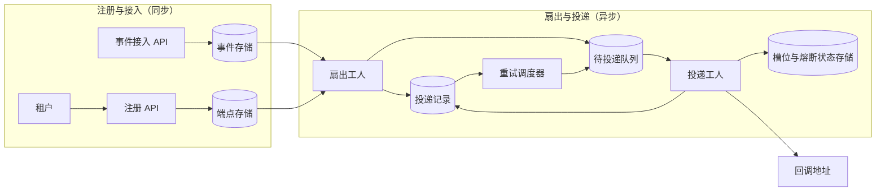

# Webhook 投递

[English](README.md) · [中文](README.zh.md)

<!-- meta:begin -->
| 题型 | 优先级 | 难度 | 岗位 | 考点 | 轮次 |
| --- | --- | --- | --- | --- | --- |
| 系统设计 | ★★☆☆☆ | — | SWE · Infra Eng | queueing, retry, idempotency, security | 现场面 |
<!-- meta:end -->

## 题目

设计一个多租户 SaaS 平台背后的 webhook 投递系统。每个租户可以注册一个或多个*端点*（endpoint）——一个 HTTPS 回调地址，外加它想接收的事件类型子集——平台必须把每一个匹配的事件以 HTTP POST 的形式，投递给该租户名下每一个订阅了对应事件类型的活跃端点，并保证*至少一次*（at-least-once）投递：宁可重复投递，也不能丢失。事件完全产生于平台内部（例如一个任务执行完毕、一笔订单状态发生变化），且每个事件只属于一个租户；一个事件永远不会被投递到别的租户的端点。

这次设计的规模：

- 全平台每天 216,000,000 个事件，平均每个事件对应 3 个订阅端点，因此在任何重试之前，基准投递次数是每天 648,000,000 次。
- 流量的峰均比大约是 3 倍（各租户的工作时间有足够的重叠，使得全天流量并不平坦）。
- 端点的响应时间分成三档，按流量占比划分：90% 的投递发往大约 200 毫秒就能响应的端点；8% 发往持续偏慢的端点，大约需要 3 秒；2% 发往当时不可达的端点，请求会一直跑到平台自己设定的 10 秒请求超时。哪些端点落在哪一档会随时间变化（一次缓慢的发布、一次故障），但任意时刻的流量构成就是这个比例。
- 投递延迟目标：95% 的投递必须在事件被接受后 2 秒内发起首次尝试。对于一个确实可达的端点，一次投递必须在首次尝试后 90 分钟内到达终态——投递成功，或者进入死信（放弃投递，留给租户查看和重放）。
- 150,000 个租户，平均每个租户注册 2 个端点（总共 300,000 个端点）。

范围内：端点注册接口；接收一个事件并把它扇出给匹配的订阅；投递工人及其重试策略与退避；把一个慢的或已经宕掉的端点和其余机群隔离开；死信与手动重放；出站调用的请求签名与防范服务端请求伪造（SSRF，server-side request forgery）。范围外：判定“发生了一个事件”的那些内部服务（假设一个事件到达接入接口时，已经带着租户 id、事件类型和一个 JSON 载荷）；面向租户的仪表盘；webhook 用量的计费或计量；HTTP 之外的投递通道。

要产出：

1. 需求与规模估算：基准与峰值投递吞吐；同一时刻在途的 HTTP 请求数（用 Little 定律），按响应时间档位拆开；由此需要的投递工人数；重试带来的额外流量；事件与投递记录的存储估算。
2. 一个数据模型（端点、事件、投递）和 3 到 5 个核心接口。
3. 一张架构图，把同步的注册与接入路径和异步的扇出与投递路径分开，并沿着一个事件把这条路径走一遍。
4. 深入讨论：(a) 至少一次投递与幂等，包括哪些 HTTP 响应码会重试、哪些不会；(b) 重试策略，以及如何不让一个慢的或永久宕掉的端点耗尽其他端点需要的投递能力；(c) 投递的顺序保证，以及出站调用的安全性（负载签名与 SSRF 防护）。

## 参考解答

<details>
<summary>展开参考解答</summary>

动手设计之前值得先确认一点：一个刚注册的端点是否应该收到早于这次订阅的历史事件（这里假设不会）。

### 需求与规模

**投递吞吐。** $E = 216\times10^6$ 个事件/天，平均下来 $E / 86{,}400 = 2{,}500$ 个事件/秒。按平均每个事件 $f = 3$ 个订阅端点算，基准投递量是 $D = E \cdot f = 648\times10^6$/天，即平均 $D / 86{,}400 = 7{,}500$/秒。3 倍峰均比把设计点定在 $7{,}500 \times 3 = 22{,}500$ 次投递/秒。

**按响应时间档位划分的并发。** Little 定律 $L = \lambda W$ 给出同一时刻在途的请求数，其中 $W$ 是*完整*占用时长——包括一直没有应答、跑满超时的请求。把峰值速率按档位拆开：

| 档位 | 流量占比 | 占用时长 $W$ | 峰值 $\lambda$ | $L = \lambda W$ | 占 $L$ 的比例 |
| --- | --- | --- | --- | --- | --- |
| 健康 | 90% | 0.2 秒 | 20,250/秒 | 4,050 | 29% |
| 偏慢 | 8% | 3 秒 | 1,800/秒 | 5,400 | 39% |
| 宕机（超时） | 2% | 10 秒 | 450/秒 | 4,500 | 32% |

总计 $L_{peak} \approx 13{,}950$ 个在途请求。重点在后两行：10% 的流量（偏慢和宕机两档）占了 71% 的并发。

**工人数。** 按每个工人 $c = 200$ 个并发连接预算（异步事件循环，而不是每个请求一个操作系统线程），$\lceil 13{,}950 / 200 \rceil = 70$ 个工人刚好覆盖峰值；为突发再留 15% 余量，取整到 81 个，即 16,200 个槽位。

**重试流量。** 把首次尝试失败率取为 3%（三档的混合值，主要来自宕机档），失败的投递平均还要多试 1.5 次才会成功或进入死信：$648\times10^6 \times 0.03 \times 1.5 = 29.16\times10^6$ 额外次数/天，即 337.5/秒——在 7,500/秒的基准之上大约多 4.5%。按槽位算，重试的分量要重得多，因为重试总是发回刚失败过的端点：3 倍峰值下每秒 1,012.5 次重试如果都跑满 10 秒超时，会占住 10,125 个槽位，而峰值时只剩 2,250 个空闲。81 个工人之所以够用，是因为熔断器（深入话题 (b)）让发往宕机端点的大部分重试立刻失败、不占槽位。

**存储。** 事件保留 14 天（够重放一次扇出故障，又限住了成本），每行约 2.2 KB：$216\times10^6 \times 14 \times 2{,}200\text{ B} \approx 6.1$ TiB。投递记录每个（事件、端点）一行，重试在原行上更新，保留 30 天，每行约 150 字节：$648\times10^6 \times 30 \times 150\text{ B} \approx 2.7$ TiB。一个分片的关系型存储就能装下两者，也提供投递记录需要的单行条件更新和二级索引。

### 数据模型与 API

**Endpoint（端点）**——`endpoint_id`、`tenant_id`、`callback_url`、`signing_secret_current`、`signing_secret_previous`（轮换宽限期之外为空）、`secret_rotated_at`、`status`（`active | paused | disabled_after_failures`）、`created_at`、`updated_at`。

**EndpointEventType**——`endpoint_id`、`tenant_id`（冗余一份，扇出不必回连 `Endpoint`）、`event_type`。唯一索引 `(endpoint_id, event_type)`；索引 `(tenant_id, event_type, endpoint_id)` 直接支撑“这个租户名下订阅了这个事件类型的每一个活跃端点”这条扇出查询。

**Event（事件）**——`event_id`（由产生方生成，全局唯一）、`tenant_id`、`event_type`、`sequence`（按租户递增，由事件存储在插入的同一个事务里分配）、`payload`（JSON）、`created_at`、`fanned_out_at`（这个事件的投递记录全部建好之前为空）。`event_id` 上的唯一索引让产生方的重试提交天然幂等；`fanned_out_at` 为空的事件另有索引，供扇出取用。

**Delivery（投递）**——`delivery_id`（每次尝试都保持不变，放在签名覆盖的请求体里发给接收方）、`event_id`、`endpoint_id`、`state`（`pending | claimed | delivered | dead`）、`attempt_count`（每次认领加一）、`lease_token`（每次认领时新生成一个值）、`lease_deadline`、`next_retry_at`（`pending` 行下一次到期的时间）、`last_response_code`、`last_error`、`created_at`、`updated_at`。唯一索引 `(event_id, endpoint_id)` 让扇出幂等——同一对再插入一次是空操作。索引 `(state, next_retry_at)` 和 `(state, lease_deadline)` 供调度器的两种扫描使用；`(endpoint_id, state)` 供历史查询接口按 `status` 过滤。队列消息本身带着 `attempt_count` 和 `delivery_id`，查剩余重试预算不必读数据库，认领时也能认出过期的消息。

核心接口：

1. `POST /endpoints`——`{callback_url, event_types}` → `{endpoint_id, status: "active", signing_secret}`（密钥只在这一次返回）。
2. `PATCH /endpoints/{endpoint_id}`——`{callback_url?, event_types?, status?, action?}`；`action: "rotate_secret"` 会额外返回一个新的 `{signing_secret}`，并让旧密钥作为第二个签名继续有效 24 小时。
3. `DELETE /endpoints/{endpoint_id}`——停止之后的投递；已有的投递记录在各自的保留期内继续保留。
4. `GET /endpoints/{endpoint_id}/deliveries?status=dead&limit=50&cursor=...`——分页的投递历史。
5. `POST /deliveries/{delivery_id}/replay`——把一次 `delivered` 或 `dead` 的投递，在同一个 `delivery_id` 下、带着全新的尝试预算重新入队。返回 `{delivery_id, state: "pending"}`。

### 架构



注册 API 把租户注册的端点和它订阅的事件类型写入端点存储。一个内部服务带着租户 id、事件类型和载荷调用接入 API，事件提交进事件存储后才确认这次调用。扇出工人取出一个 `fanned_out_at` 为空的事件，为每一个订阅了它的活跃端点插入一条 `pending` 投递记录，把每条都直接推进待投递队列（首次尝试能落在 2 秒之内，靠的就是这一步），然后才设置 `fanned_out_at`。投递工人取出一条消息，在槽位存储里为这个端点占一个槽位，用租约认领这条投递，发出已签名的 POST，并把结果和下一次重试时间一起记下。重试调度器扫描投递记录里已经到期的行——退避时间已过，或者租约已经过期——把它们重新推进待投递队列；历史查询和重放接口也靠这些记录支撑。

### 深入话题

**至少一次投递与幂等。** 接入 API 先把事件提交进事件存储，*然后*才确认调用方：接受请求和这次提交之间的崩溃什么都不会留下，调用方用同一个 `event_id` 重试（被唯一索引吸收）正是正确的恢复方式。反过来先确认、再持久化，崩溃恰好落在两步之间的事件就会丢掉，而调用方已经被告知它被接受了。

事件存储和投递记录是两个不同的存储，所以扇出不在插入事件的那个事务里，也不需要在。`fanned_out_at` 要等这个事件的投递记录全部建好之后才设置，所以扇出工人中途崩溃时，这个事件会被再次取出；重跑只插入缺失的行（唯一索引 `(event_id, endpoint_id)` 让其余的插入成为空操作），并把每一行重新推送一遍。如果先设置标记，一次崩溃就会让其余端点的投递永远丢失。

队列消息只是指明去看哪一行，由这一行说了算。每一条 `pending` 行都带着 `next_retry_at`——新建的行是一分钟之后，失败之后是退避到期的时间——所以一条因崩溃丢失的消息只会让这次投递推迟到调度器扫描到这一行为止。认领是一次条件更新：只有当这一行仍然停在消息所带的 `attempt_count`、并且是 `pending`（或者是租约已过期的 `claimed`）时才成功，同时把 `attempt_count` 加一，并生成一个新的 `lease_token`，租约 30 秒，是请求超时的三倍。于是重复或过期的消息认领失败、被丢弃；一个每次都让工人崩溃的投递也终究会用完尝试次数；最后一次尝试的租约过期时，由调度器把它转入死信。

记录结果和安排下一次尝试是同一次写入，条件是 `WHERE lease_token = <自己的>`：写成 `delivered`、`dead`，或者带着新 `next_retry_at` 的 `pending`。如果拆成两次写入（比如先记录结果、再推进单独的重试队列），两次之间的崩溃会留下一条再也没人派发的 `pending` 行。令牌条件挡住的是一个没崩溃、只是慢了的工人：它的租约过期、别的工人已经认领之后，它迟到的写入匹配不到任何行，不会覆盖新认领者的结果（例如把一条 `delivered` 的行又改回重试）。

请求发出之后、结果记录之前崩溃，租约到期后另一个工人会重试，端点就可能以同一个 `delivery_id` 收到同一次投递两次。请求超时之后，平台无从知道端点有没有处理过它，所以只有接收方才能让处理恰好一次：把带同一个 `delivery_id` 的 POST 当成一次，并且至少在 80 分钟的重试期内记住这些 id，这一条要作为要求写给租户。

响应码按顺序判断：`2xx` 是成功，终态。`410 Gone` 让这次投递进入死信，并暂停（而不是删除）这个端点、通知租户。`408`、`429`、`5xx`、连接失败、DNS 失败，以及请求超时都会重试，因为它们都可能自行恢复。`429` 或 `503` 带的 `Retry-After` 作为退避时间的下限，除非它会把下一次尝试推到 80 分钟的重试期之外，那样就直接进入死信。其余所有 `4xx`（`400`、`404`、`422`、`401`/`403`）和所有 `3xx` 都不重试：同样的载荷打到同一个没变过的处理逻辑上，每次都会得到同样的回答，租户修好之后可以调用重放。重定向不会被跟随，原因见深入话题 (c) 的 SSRF 部分。

**重试策略与故障隔离。** 重试用指数退避：30 秒、90 秒、270 秒、810 秒，封顶 30 分钟，最多 7 次尝试。抖动只会缩短间隔（每段在原值的一半到全部之间随机取），所以六段间隔加上七次 10 秒的请求最多 81 分钟，落在 90 分钟的目标之内；到那时仍然失败的投递进入 `dead`，留在该租户的死信列表里，直到被重放。

偏慢和宕机的端点以 10% 的流量占着 71% 的在途请求，不加约束的话，一批有问题的端点就能耗尽共用的池子。给每个端点一条专用队列能做到完美隔离，但运行和重新平衡 300,000 个分区的运维成本随端点数量而不是负载增长；共用一个池子、限制每个端点能占多少，能得到同样的隔离而没有这笔成本。两个机制，都按端点保存在共享的槽位存储里：

- **按端点的并发上限。** 每个端点同一时刻最多 $K = 5$ 个请求在途。每个槽位是一条以这次尝试的 `lease_token` 为键、随租约一起过期的条目，崩溃的工人占着的槽位会自己释放；只用一个认领时加一、出结果时减一的计数器的话，每次崩溃都会泄漏一个槽位，直到端点被永久堵死。这个计数是软状态，放在内存型存储里就够了，丢了只会让上限在一个租约周期内放松。工人发现端点已到 $K$ 时不等待，把这一行的 `next_retry_at` 往后推几秒，不消耗尝试次数。于是一个宕机端点无论积压多深，最多占 16,200 个槽位中的 5 个；300 个端点同时出问题（全部端点的 0.1%，例如一个共享托管商故障）也最多占 $300 \times 5 = 1{,}500$ 个，即 9.3%；不设上限时，一个宕机端点占用的槽位数是它自己的 $\lambda \times 10$ 秒，随流量和重试增长。代价是每个端点的吞吐上限为 $K/W$，200 毫秒响应时为 25 次/秒，是峰值时端点平均速率 0.075 次/秒的 300 多倍；需要更多的端点得给它更大的 $K$。
- **熔断器**，看这个端点最近 20 次真实尝试组成的滚动窗口：16 次或更多失败就跳闸。跳闸期间，发往这个端点的投递立刻失败——算作一次尝试、按正常退避重新安排，不发出站调用，也不占槽位——持续一段冷却时间（2 分钟，每次再跳闸就翻倍，封顶 30 分钟）；之后放一个探测请求通过，成功就闭合，失败就再跳闸。一个忙到能用 10 秒超时占满 5 个槽位的端点，大约 $16 \times 10 / 5 = 32$ 秒后跳闸，此后每个冷却期只占一个探测请求，而不是整个 80 分钟的重试期都占着 5 个槽位。

熔断器一直跳闸、一小时内连续 10 次投递进入死信的端点会被置为 `disabled_after_failures` 并通知租户；重新启用要租户主动 `PATCH`。

**顺序与安全。** $K = 5$ 意味着没有顺序保证：同一个端点最多有五条投递同时在途，一个更早事件的重试可能落在一个更晚、第一次就成功的事件之后。所以每个请求体都带着 `delivery_id`、`event_id`、`created_at` 和事件的按租户 `sequence`：在意顺序的接收方为每个对象记住已经应用过的最大 `sequence`，丢弃更旧的更新，或者把 webhook 只当作一个去拉取当前状态的提示。严格保序是按端点开放的选项：$K = 1$，按 `sequence` 顺序，前一条到达 `delivered` 或 `dead` 之前不尝试下一条，这个租户的扇出也按 `sequence` 顺序进行。代价是队头阻塞：后面的每一个事件都要排在正在重试的那一条后面，最长 80 分钟；这个端点的吞吐上限也从 $K/W$ 降到 $1/W$——对平均 0.025 次/秒的端点无关紧要，但一个失败的事件会卡住整条流。

每次尝试都用端点当前的密钥，对 `"{timestamp}.{raw_body}"` 做 HMAC-SHA256 签名，以 `t=<unix_ts>,v1=<hex_hmac>` 的形式发送。`t` 是这一次尝试的时间，所以一个小时之后的重试照样能通过接收方的检查；`delivery_id` 在签名覆盖的请求体里。接收方对收到的原始字节重新计算 HMAC，做常数时间比较，并且拒绝任何与自己时钟相差超过 5 分钟的 `t`：这限制了截获的请求能被重放多久，窗口之内的重放则由接收方对 `delivery_id` 的去重吸收。轮换密钥（`rotate_secret`）会让旧密钥再有效 24 小时，这期间每个请求还会带一个用旧密钥签出的 `v0` 签名，迁移中的接收方不管配置的是哪个密钥都能验证通过。

回调地址在注册时就会被解析和检查：必须是 `https`，而且它解析出的每一个地址（包括 IPv4 映射的 IPv6 形式）都不能落在私有地址、回环地址、链路本地地址或其他保留网段里；链路本地网段包含云平台的元数据地址 `169.254.169.254`。只做这一次检查不够，因为 DNS 之后还会变（DNS 重绑定）：注册时解析到公网地址的域名，到下一次投递时可能已经指向内网地址。所以每次发送都重新做一遍解析和检查，然后直接连到刚刚检查过的那个地址，主机名只用于 SNI、证书校验和 `Host` 头；检查和建立连接之间不会再有第二次、未经检查的解析。重定向不会被跟随：`Location` 指向的目标从来没有被解析和检查过，跟随它就等于直接绕过了检查。

### 追问

- 如果一个租户名下众多端点加在一起，依然能挤占共用这个工人池的其他租户，那就还需要一个按租户的并发上限，而不只是按端点的。
- 能重放多远由 14 天的事件保留期决定，而不是 30 天的记录保留期：更老的死信投递还留着历史记录，但已经没法重放，因为它对应的事件已经不在了。

<details>
<summary>估算与崩溃交错核对（可运行）</summary>

第一段核对估算。第二段逐步模拟深入话题 (a)、(b) 的设计：先是接入的两种顺序，然后穷举扇出工人、调度器的两种扫描、租约过期、按端点的槽位（取 $K = 1$）以及工人的认领、发送和带令牌条件的记录这些步骤的所有交错。过程中工人最多崩溃两次。它跑两种配置：两个端点、一个工人、每条投递一次尝试；一个端点、两个工人、两次尝试，其中慢的工人可能活过自己的租约。检查的是：`delivered` 或 `dead` 的行永远不会被改写；不会提前进入死信，也不会记下一次较早尝试的结果；从每一个可达状态出发，都仍然能走到每行都是终态、没有槽位被占着的结局。每个改坏的版本都会被抓住：去掉 `lease_token` 条件，慢工人迟到的写入会改写一条 `delivered` 的行；用第二次写入来安排重试，重试可能永远搁浅；先设置 `fanned_out_at`，会丢掉一条投递记录；不会过期的槽位会泄漏，并堵死这个端点。

```python
import math

events_per_day, avg_fanout, peak_factor = 216_000_000, 3, 3
assert events_per_day / 86_400 == 2_500
deliveries_per_day = events_per_day * avg_fanout
deliveries_per_sec_avg = deliveries_per_day / 86_400
deliveries_per_sec_peak = deliveries_per_sec_avg * peak_factor
assert (deliveries_per_day, deliveries_per_sec_avg, deliveries_per_sec_peak) == (648_000_000, 7_500, 22_500)

tiers = {"healthy": (0.90, 0.20), "slow": (0.08, 3.0), "dead": (0.02, 10.0)}
L_tier = {name: deliveries_per_sec_peak * share * w for name, (share, w) in tiers.items()}  # L = lambda * W
L_peak = sum(L_tier.values())
assert [round(v) for v in L_tier.values()] == [4_050, 5_400, 4_500] and round(L_peak) == 13_950
assert [round(v / L_peak, 2) for v in L_tier.values()] == [0.29, 0.39, 0.32]
assert round((L_tier["slow"] + L_tier["dead"]) / L_peak, 2) == 0.71  # 10% of traffic, 71% of slots

workers = math.ceil(math.ceil(L_peak / 200) * 1.15)  # 200 connections per worker
pool_slots = workers * 200
assert math.ceil(L_peak / 200) == 70 and workers == 81 and pool_slots == 16_200
assert round(pool_slots - L_peak) == 2_250  # left over at peak

extra_per_day = deliveries_per_day * 0.03 * 1.5  # 3% fail first, 1.5 more tries
retry_rate = extra_per_day / 86_400
assert round(extra_per_day) == 29_160_000 and round(retry_rate, 1) == 337.5
assert round(retry_rate / deliveries_per_sec_avg, 3) == 0.045
assert round(retry_rate * peak_factor * 10) == 10_125  # every peak retry to the timeout

TiB = 1024 ** 4
assert round(events_per_day * 14 * 2_200 / TiB, 1) == 6.1
assert round(deliveries_per_day * 30 * 150 / TiB, 1) == 2.7  # one row per (event, endpoint)

delays = [min(30 * 3 ** (n - 1), 1_800) for n in range(1, 7)]  # gaps before attempts 2..7
assert delays == [30, 90, 270, 810, 1_800, 1_800] and sum(delays) == 4_800
assert round((sum(delays) + 7 * 10) / 60, 1) == 81.2  # plus seven 10 s requests

endpoints, K = 150_000 * 2, 5
assert endpoints == 300_000
assert deliveries_per_sec_avg / endpoints == 0.025 and deliveries_per_sec_peak / endpoints == 0.075
assert round(300 * K / pool_slots, 3) == 0.093  # 300 endpoints down together
assert K / 0.2 == 25 and K / 0.2 / (deliveries_per_sec_peak / endpoints) > 300  # K / W at 200 ms
assert 16 * 10 / K == 32  # seconds until the breaker trips

print("all requirements-and-scale numbers check out")
```

```python
from collections import Counter, namedtuple
from itertools import product


def lost_events(order):  # each of two tries may die after either step; the producer retries until acked
    lost = 0
    for dies in product((1, 2, None), repeat=2):
        stored = acked = False
        for done in dies + (None,):
            stored |= "persist" in order[:done]
            acked |= "ack" in order[:done]
            if acked:
                break
        lost += not stored
    return lost


assert lost_events(("persist", "ack")) == 0 and lost_events(("ack", "persist")) > 0

# Fan-out and delivery. Atomic steps: a fan-out insert, push or mark; a scheduler push; a lease expiring;
# a worker's pull (taking a slot, or deferring at the cap), claim, send, record, and slot release.
# Searched: every interleaving of them; any worker may die between any two steps (two deaths in all); a
# lease may expire while its holder keeps running; a send may get a 2xx, a 5xx, or time out after the
# endpoint processed it.
S = namedtuple("S", "fan fanned rows queue workers slots processed deaths")
Row = namedtuple("Row", "state attempts token expired due")  # due: next_retry_at is set
DONE = ("delivered", "dead")


def moves(s, n, max_attempts, bug):
    steps = [(op, e) for e in range(n) for op in ("insert", "push")]
    steps = [("mark", 0)] + steps if bug == "mark_first" else steps + [("mark", 0)]
    put = lambda seq, i, v: seq[:i] + (v,) + seq[i + 1:]
    out = []
    if s.fan < len(steps):  # fan-out worker
        (op, e), nxt = steps[s.fan], s._replace(fan=s.fan + 1)
        if op == "insert" and s.rows[e]:
            out.append(("re-run insert is a no-op", nxt))  # INSERT ... ON CONFLICT DO NOTHING
        elif op == "insert":
            out.append(("", nxt._replace(rows=put(s.rows, e, Row("pending", 0, None, False, True)))))
        elif op == "push":
            out.append(("", nxt._replace(queue=s.queue | {(e, 0)})))
        else:
            out.append(("", nxt._replace(fanned=True)))  # set fanned_out_at
        if s.deaths:  # dies; picked up again unless marked
            out.append(("", s._replace(fan=len(steps) if s.fanned else 0, deaths=s.deaths - 1)))

    for e, r in enumerate(s.rows):  # scheduler scans; lease expiry
        if r and (r.state == "pending" and r.due or r.expired):
            if r.attempts < max_attempts and (e, r.attempts) not in s.queue:
                out.append(("", s._replace(queue=s.queue | {(e, r.attempts)})))
            elif r.attempts == max_attempts:  # the last attempt lost its lease
                dead = Row("dead", max_attempts, None, False, False)
                out.append(("dead after a lost lease", s._replace(rows=put(s.rows, e, dead))))
        if r and r.state == "claimed" and not r.expired:  # its slot expires with it
            slots = s.slots if bug == "no_slot_ttl" else s.slots - {(e, r.token)}
            out.append(("", s._replace(rows=put(s.rows, e, r._replace(expired=True)), slots=slots)))
    if bug != "no_slot_ttl":  # the holder died before claiming
        held = {(w[0], w[2]) for w in s.workers if w and w[3] == "slot"}
        held |= {(e, r.token) for e, r in enumerate(s.rows) if r and r.state == "claimed" and not r.expired}
        out += [("", s._replace(slots=s.slots - {x})) for x in s.slots - held]

    for w, ws in enumerate(s.workers):  # delivery workers
        if ws is None:
            for e, m in s.queue:
                q, r = s.queue - {(e, m)}, s.rows[e]
                if any(se == e for se, _ in s.slots):  # at K = 1: move next_retry_at out
                    rows = put(s.rows, e, r._replace(due=True)) if r and r.state == "pending" else s.rows
                    out.append(("deferred at the cap", s._replace(queue=q, rows=rows)))
                else:  # a slot keyed by a new lease_token
                    mine = (e, m, (w, m), "slot", None)
                    out.append(("", s._replace(queue=q, workers=put(s.workers, w, mine),
                                               slots=s.slots | {(e, (w, m))})))
            continue
        e, m, tok, step, resp = ws
        r = s.rows[e]
        go = lambda to, **kw: s._replace(workers=put(s.workers, w, (e, m, tok, to, resp)), **kw)
        free = s._replace(workers=put(s.workers, w, None), slots=s.slots - {(e, tok)})
        if s.deaths:
            out.append(("", s._replace(workers=put(s.workers, w, None), deaths=s.deaths - 1)))
        if step == "slot":  # claim: WHERE attempt_count = m AND (pending OR lease expired)
            if r and r.attempts == m < max_attempts and (r.state == "pending" or r.expired):
                out.append(("reclaimed after lease expiry" if r.expired else "",
                            go("claimed", rows=put(s.rows, e, Row("claimed", m + 1, tok, False, False)))))
            else:
                out.append(("stale message dropped", free))
        elif step == "claimed":  # the HTTP POST
            for resp in ("2xx", "5xx", "timeout after processing"):
                hit = resp != "5xx"
                out.append(("processed twice" if hit and s.processed[e] else "",
                            s._replace(processed=put(s.processed, e, hit or s.processed[e]),
                                       workers=put(s.workers, w, (e, m, tok, "sent", resp)))))
        elif step == "sent":  # outcome and next retry in one write, WHERE lease_token = tok
            if r.token != tok and bug != "no_fencing":
                out.append(("late write fenced off", go("free")))
                continue
            state = "delivered" if resp == "2xx" else "dead" if m + 1 == max_attempts else "pending"
            new = Row(state, r.attempts, r.token, False, state == "pending" and bug != "separate_schedule")
            stale = "! an older attempt's outcome was recorded" if r.attempts != m + 1 else ""
            out.append((stale, go("free", rows=put(s.rows, e, new))))
        elif bug == "separate_schedule" and r.token == tok and r.state == "pending":
            out.append(("", free._replace(rows=put(s.rows, e, r._replace(due=True)))))  # a second write
        else:
            out.append(("", free))
    return out


def explore(n, workers, max_attempts, bug=None):
    start = S(0, False, (None,) * n, frozenset(), (None,) * workers, frozenset(), (False,) * n, 2)
    seen, stack, preds, labels, broken = {start}, [start], {}, Counter(), set()
    while stack:
        s = stack.pop()
        for label, t in moves(s, n, max_attempts, bug):
            labels[label] += 1
            bad = {label[2:]} if label.startswith("!") else set()
            bad |= {f"a {a.state} row was rewritten" for a, b in zip(s.rows, t.rows)
                   if a and a.state in DONE and b != a}
            bad |= {"dead-lettered early" for b in t.rows
                    if b and b.state == "dead" and b.attempts < max_attempts}
            if bad:
                broken |= bad
                continue
            preds.setdefault(t, []).append(s)
            if t not in seen:
                seen.add(t)
                stack.append(t)
    if broken:
        return sorted(broken)
    at_rest = lambda s: s.fan == 2 * n + 1 and not any(s.workers)
    finished = [s for s in seen if at_rest(s) and s.fanned and not s.slots
                and all(r and r.state in DONE for r in s.rows)]
    ok, frontier = set(finished), list(finished)  # every reachable state must still be able to finish
    while frontier:
        for p in preds.get(frontier.pop(), ()):
            if p not in ok:
                ok.add(p)
                frontier.append(p)
    stuck = [s for s in seen - ok if at_rest(s)]
    if any(None in s.rows for s in stuck):
        return ["an endpoint never gets its delivery row"]
    if stuck:
        return ["a slot leaks and blocks the endpoint" if all(s.slots for s in stuck)
                else "a pending row is never dispatched"]
    assert seen == ok
    return len(seen), labels, Counter(r.state for s in finished for r in s.rows)


FANOUT, RACE = (2, 1, 1), (1, 2, 2)  # (endpoints, workers, max attempts): two rows; two workers racing
states, labels, ends = 0, Counter(), Counter()
for config in (FANOUT, RACE):
    found = explore(*config)
    assert not isinstance(found, list), (config, found)
    states, labels, ends = states + found[0], labels + found[1], ends + found[2]
assert all(labels[x] > 100 for x in ("re-run insert is a no-op", "stale message dropped", "processed twice",
                                     "reclaimed after lease expiry", "late write fenced off",
                                     "deferred at the cap", "dead after a lost lease")), labels
assert ends["delivered"] > 0 and ends["dead"] > 0
print(f"{states} states: every row ends delivered or dead and is never rewritten; no slot leaks")

for bug, config, expected in (("no_fencing", RACE, "a delivered row was rewritten"),
                              ("separate_schedule", RACE, "a pending row is never dispatched"),
                              ("mark_first", FANOUT, "an endpoint never gets its delivery row"),
                              ("no_slot_ttl", RACE, "a slot leaks and blocks the endpoint")):
    found = explore(*config, bug)
    assert isinstance(found, list) and expected in found, (bug, found)
    print(f"{bug:18} -> {', '.join(found)}")
```

</details>

</details>
